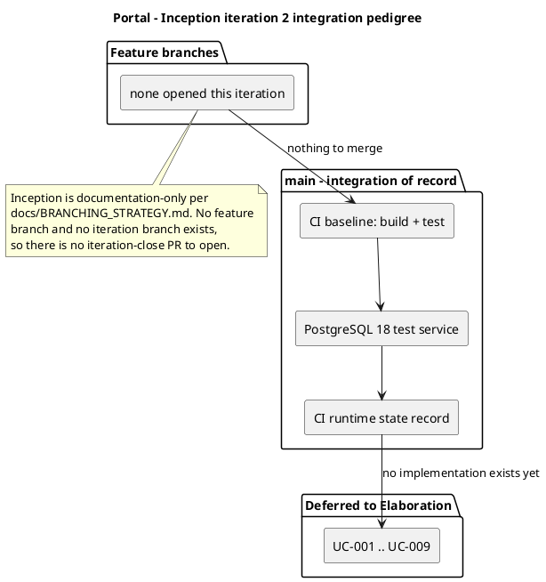

# CI runtime state - Portal

Operational record of the CI pipeline's state. This file is the home for CI lifecycle
state. `docs/BRANCHING_STRATEGY.md` records branching topology only and never CI state.

## Pipeline

| Item | State | Evidence |
|---|---|---|
| Workflow definition | Present | `.github/workflows/ci.yml` |
| Build job | Green on `main` | run `36094382461` |
| Test job | Green on `main` | run `36094382461` |
| Trigger coverage | `main`, `iteration/**`, `chore/**`, `feature/**`, `hotfix/**` on push and on pull_request | `.github/workflows/ci.yml` |
| Solution sync | `Portal.sln` regenerated from the `src/` + `tests/` tree before every build | `.github/workflows/ci.yml` |
| Test discovery | Every `tests/**/*.csproj` executed; no fixed project name | `.github/workflows/ci.yml` |
| Test database | PostgreSQL 18 service container on the test job, health-checked before tests run | `.github/workflows/ci.yml` |

The evidence column cites the run that validated the current pipeline shape. It is
refreshed when the pipeline changes, not on every run.

## Integration discipline

- One approved feature PR merged into `iteration/Cn` at a time, bottom-up over the
  subsystem dependency graph, leaves first. The graph is embedded in `ci.yml`.
- Every merge is followed by a build-status check. A red post-merge build HALTS the
  pipeline and is tracked by an `integration-regression` Issue - never silenced, never
  worked around.
- Target cadence: at least one build per day toward an iteration close, one per week
  minimum.
- CI never holds production data or credentials and never deploys (`CON-026`, `CON-029`).
- The iteration-close PR (`iteration/Cn` -> `main`) is the formal record of the
  iteration's integration outcome: pedigree chain, merged feature PRs, CI status and the
  component and deployment diagrams.

## Integration outcome - Inception iteration 2

| Subsystem | Pedigree | Basis |
|---|---|---|
| CI baseline (build + test) | VERIFIED | run `36094382461` green on `main` |
| PostgreSQL 18 test service | VERIFIED | run `36094281565` green on `main` |
| CI runtime state record | VERIFIED | run `36094382461` green on `main` |
| UC-001 .. UC-009 | DEFERRED | no implementation exists; Inception is documentation-only |

Merged feature PRs this iteration: none. No branch carried `ready-for-review` and no pull
request was open, so no merge was performed and no post-merge build check was due.

No `iteration/Cn` branch was created. `docs/BRANCHING_STRATEGY.md` declares Inception
documentation-only and its topology defines no Inception iteration branch, so there is no
`iteration/Cn` -> `main` pull request to open. The iteration-close PR is the Construction
and Elaboration instrument; the first one is due at the close of the first iteration that
merges feature branches.

Outstanding: `Issue #2` - `docs/BRANCHING_STRATEGY.md` cites a superseded blob sha for the
CI configuration item. ConfigurationManager-owned; not corrected by the Integrator.
