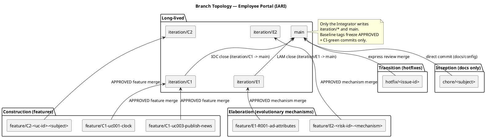
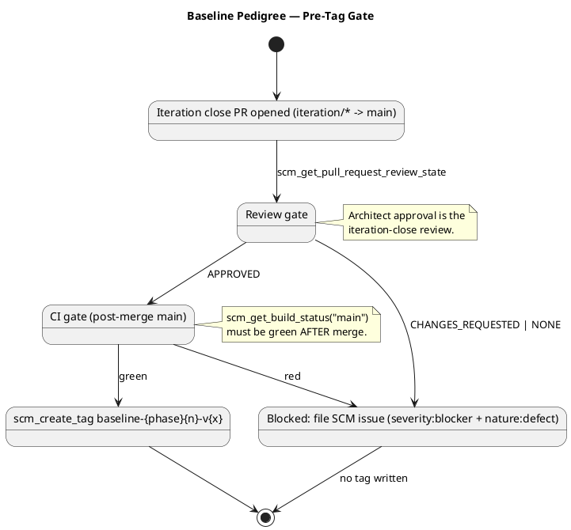

# Branching Strategy — Employee Portal

## Document Control

| Field | Value |
|---|---|
| Phase | Inception |
| Status | Draft |
| Milestone Target | End-of-Inception (Lifecycle Objectives) — NOT YET ACHIEVED |
| Owner | ConfigurationManager |

This file is configuration-as-code: it is committed DIRECT to `main` (never opened as a PR) and re-read by the ConfigurationManager in every later phase. It expresses the workspace hierarchy (developer → integration → release) that the Integrator, Implementer, and Reviewer consume.

## Item Identification Scheme

### Branch naming conventions

| Pattern | Purpose | Phase |
|---|---|---|
| `feature/E<n>-<risk-id>[-<mechanism>]` | Evolutionary architectural mechanism (production code in `src/`, based on `iteration/E<n>`) | Elaboration |
| `feature/C<n>-<uc-id>-<subject>` | Construction feature branch (UC realization) | Construction |
| `iteration/E<n>` | Elaboration integration workspace | Elaboration |
| `iteration/C<n>` | Construction integration workspace | Construction |
| `hotfix/<issue-id>` | Transition hotfix from `main` | Transition |
| `chore/<subject>` | Non-functional repo maintenance (branching strategy, CI config) | Any |

Non-conforming branches are surfaced as SCM issues with `severity:minor` + `nature:defect` + `naming-violation` labels.

### Baseline tag naming

`baseline-{phase}{n}-v{x}` where `phase` ∈ {elaboration, construction, transition}, `n` is the iteration number, and `x` is the patch version starting at 1.

- `baseline-elaboration-E<n>-v<patch>` — Elaboration architecture baseline (per iteration).
- `baseline-construction-C<n>-v<patch>` — Construction iteration baseline (per iteration).
- `baseline-transition-T<n>-v<patch>` — Transition release baseline (per release).

`<patch>` starts at 1; re-tag `v2, v3…` only after an explicit rollback or a post-baseline critical fix. One baseline per iteration close — never mid-iteration.

## Canonical Branching Model per Phase

### Inception — documentation only

No implementation code is produced. A feasibility mechanism, if genuinely required for risk reduction, is built evolutionarily in `src/` on `feature/I<n>-<subject>` (never throwaway).

### Elaboration — evolutionary architectural mechanism (mirrors Construction)

The architectural prototype is EVOLUTIONARY — it becomes the Construction baseline, not throwaway sample code. A technical risk is retired by ANALYSIS (the SoftwareArchitect reasons feasibility — no code) or by building the REAL mechanism in `src/` on `feature/E<n>-<risk-id>[-<mechanism>]` based on `iteration/E<n>`. The Architect records the decision as a process fact (`record_poc_decision`: `analysis-only` | `single-mechanism` | `candidates`). The Code Reviewer opens + reviews each mechanism PR (base `iteration/E<n>`) as production; the Integrator merges the APPROVED mechanism into `iteration/E<n>`. For competing `candidates` the Architect selects the winner and the Integrator closes the loser's PR (`scm_close_pull_request`) per the recorded decision. At LAM close the Integrator opens `iteration/E<n> → main`; the Deliver bookend merges the reviewed baseline. There is **no** `samples/poc/` and **no** ephemeral `poc/*` branch.

### Construction — feature branches

UC realizations on `feature/C<n>-<uc-id>-<subject>` based on `iteration/C<n>`; the Code Reviewer reviews, the Integrator merges APPROVED into `iteration/C<n>` and opens `iteration/C<n> → main` at IOC.

### Transition — hotfixes

`hotfix/<issue-id>` from `main`, express review, merge to `main` with a patch baseline tag.

## Cross-Phase Invariants

- Only the Integrator writes `iteration/*` and `main` (no other role pushes there).
- `ready-for-review` is the Implementer→Code Reviewer handoff label.
- A baseline tag freezes only an APPROVED + CI-green commit.
- `docs/BRANCHING_STRATEGY.md` changes go DIRECT to `main` via `scm_commit_files` — never a PR.

## Change Control Board

The Change Control Board (CCB) is the ChangeControlManager's responsibility. The CCM owns the Change Request state machine (`cr:new` → `cr:approved` → `cr:complete`, etc.) and CCB decisions. The ConfigurationManager consumes CCM-triaged outcomes indirectly via the branches and PRs they authorize — it does NOT triage CRs or evaluate impact.

## Audit Procedures

### Pre-tag audit gate (mandatory before every `scm_create_tag`)

1. `scm_get_pull_request_review_state` on the iteration-close PR must return `APPROVED`.
2. `scm_get_build_status("main")` must return green AFTER the merge.

Either gate fails → file an Issue (`severity:blocker` + `nature:defect`) and DO NOT tag.

### Tag message (audit record)

Every tag message must contain: iteration-close PR number and head commit SHA, Architect approval review ID, `main` CI run URL at tag time, and any notable findings (naming violations, deferred items, re-tag justifications).

## Tooling

- `scm_create_branch` / `scm_create_pull_request` / `scm_merge_pull_request` — workspace + integration.
- `scm_get_pull_request_review_state` / `scm_get_build_status` — pre-tag gate.
- `scm_create_tag` — baseline freezing.
- `scm_create_issue` — gate-failure escalation and naming-violation surfacing.
- `scm_commit_files` — `docs/BRANCHING_STRATEGY.md` publication/evolution.

## Branch Topology

## Baseline Pedigree

## Traceability

| Element | Traces From | Link Type | Traces To |
|---|---|---|---|
| Branch naming conventions | CON-006, CON-007 (external systems consumed, not re-engineered) | DependsOn | Integrator, Implementer, Reviewer |
| Baseline tag naming | RUP Ch.13 (baselines at iteration ends) | DependsOn | DeploymentManager, Integrator |
| Evolutionary mechanism (no `poc/*`) | R001 (retired via analysis-only PoC) | DependsOn | Software Architect |
| Pre-tag audit gate | NFR-004 (audit traceability) | DependsOn | ConfigurationManager |
| Two-level authorization (HR vs employee) | NFR-005 | DependsOn | Software Architecture Document |
