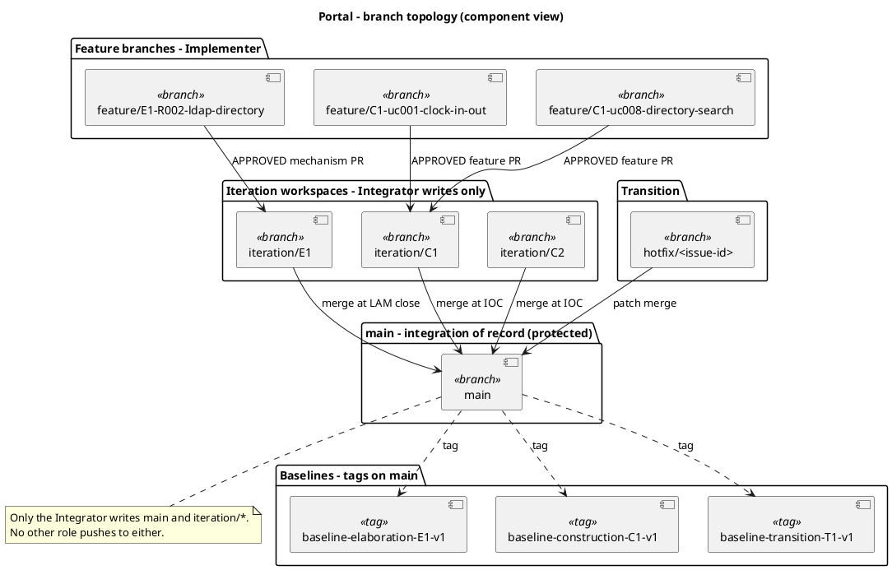
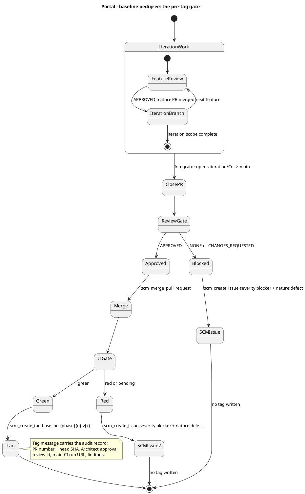
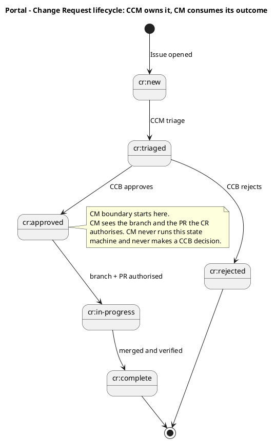
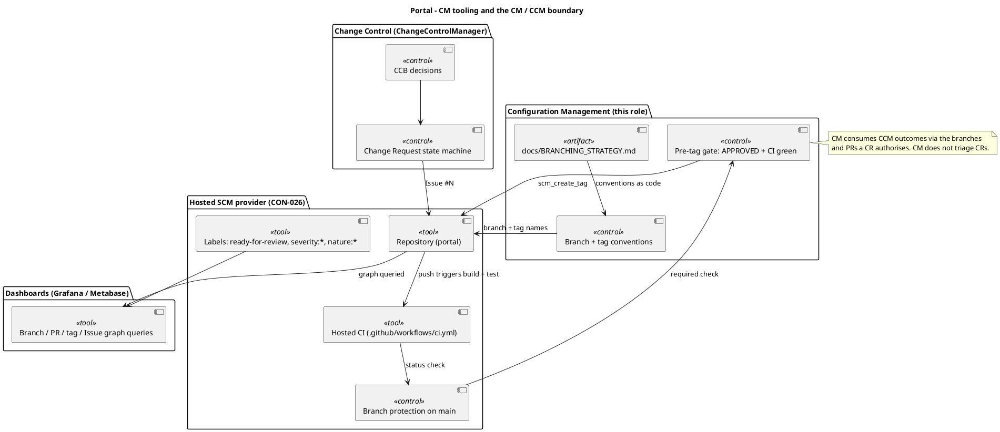

# Branching Strategy

## Document Control

- **Phase:** Inception
- **Status:** Draft — iteration 1, not yet reviewed
- **Milestone Target:** Lifecycle Objectives (LCO) — end of Inception. NOT YET ACHIEVED.

## Purpose

This file is the project's configuration-management model expressed as code. It fixes four things
and nothing else: how a configuration item is identified, how branches are named, when a baseline
tag may be written, and which tool enforces each rule. Every role that creates a branch, opens a
pull request or writes a tag reads this file first.

It is documentation, not source. It is committed directly to `main`; it is never opened as a pull
request, because a Markdown change has nothing for a Reviewer to inspect and would not reach the
Integrator, Implementer or Reviewer until the PR was handled.

## Configuration Items and Identification Scheme

A configuration item is anything whose change must be traceable. Each CI type has exactly one
identifier form, and that form is the only way it is cited.

| CI type | Identifier form | Authority | Example |
|---|---|---|---|
| Declared requirement | `FR-NNN` / `NFR-NNN` | declared input | `FR-003` |
| Constraint / business rule | `CON-NNN` | declared input | `CON-016` |
| Acceptance criterion | `AC-NNN` | declared input | `AC-006` |
| Risk | `RNNN` | declared input, curated by ProjectManager | `R002` |
| Use case | `UC-NNN` | SystemAnalyst | `UC-001` |
| Analysis / design class | `ACL-NNN` / `CLS-NNN` | Designer | `CLS-001` |
| Component | `COMP-NNN` | SoftwareArchitect | `COMP-001` |
| Test case | `TC-NNN` | TestDesigner | `TC-001` |
| Artifact | canonical artifact name | owning role | `Use-Case Model` |
| Source file | repository path | Implementer | `src/Portal.Web/Pages/Clock.cshtml` |
| Branch | branch naming convention (below) | Integrator / Implementer | `feature/C1-uc001-clock-in-out` |
| Baseline | `baseline-{phase}{n}-v{x}` | ConfigurationManager | `baseline-construction-C1-v1` |
| Change Request | `Issue #N` | ChangeControlManager | `Issue #14` |

Two rules make the scheme hold. First, an identifier is minted only by its authority role; every
other role copies it. Second, a CI is cited by its identifier and never by a restatement of its
state — the state lives with its authority, and a copy of it in a second place is a defect.

## Branch Topology

## Branch Naming Convention

| Pattern | Phase | Base branch | Opened by | Merged by |
|---|---|---|---|---|
| `feature/E{n}-{risk-id}[-{mechanism}]` | Elaboration | `iteration/E{n}` | Implementer | Integrator, after Code Reviewer approval |
| `feature/C{n}-{uc-id}-{subject}` | Construction | `iteration/C{n}` | Implementer | Integrator, after Code Reviewer approval |
| `iteration/E{n}` | Elaboration | `main` | Integrator | Integrator, at LAM close |
| `iteration/C{n}` | Construction | `main` | Integrator | Integrator, at IOC |
| `hotfix/{issue-id}` | Transition | `main` | Implementer | Integrator, express review |
| `chore/{subject}` | any | `main` | any role | direct commit for documentation and CI config |

A branch that does not match one of these patterns is not renamed by anyone. It is surfaced as an
SCM issue carrying `severity:minor` + `nature:defect` + `naming-violation`, and the owning role
re-creates it under a conforming name.

## Per-Phase Branching Model

### Inception — documentation only

No implementation code. The artifacts of the phase are committed to `main` by their owning roles.
A feasibility mechanism, if one were genuinely required for risk reduction, would be built
evolutionarily in `src/` on `feature/I{n}-{subject}` — never as throwaway sample code. On Portal no
such mechanism is required: the Development Case records that no technical risk needs empirical
validation, and CON-003 confirms the OIDC client is already registered so login is testable from
day one.

### Elaboration — evolutionary architectural mechanism

The architectural prototype is evolutionary: it becomes the Construction baseline, not throwaway
sample code. There is no `samples/poc/` directory and no ephemeral `poc/*` branch.

A technical risk is retired either by analysis — the SoftwareArchitect reasons feasibility and no
code is written — or by building the real mechanism in `src/` on `feature/E{n}-{risk-id}[-{mechanism}]`
based on `iteration/E{n}`. The Architect records the decision as a process fact
(`analysis-only` | `single-mechanism` | `candidates`). The Code Reviewer opens and reviews each
mechanism PR against `iteration/E{n}` as production code; the Integrator merges the APPROVED
mechanism into `iteration/E{n}`. Where competing `candidates` were built, the Architect selects the
winner and the Integrator closes the loser's PR. At LAM close the Integrator opens
`iteration/E{n} → main` and the reviewed baseline is merged.

### Construction — feature branches

Use-case realizations are built on `feature/C{n}-{uc-id}-{subject}` based on `iteration/C{n}`. The
Code Reviewer reviews; the Integrator merges APPROVED features into `iteration/C{n}` and opens
`iteration/C{n} → main` at IOC.

### Transition — hotfixes

`hotfix/{issue-id}` branches from `main`, receives an express review, and merges to `main` with a
patch baseline tag.

## Baseline Policy

A baseline is written once per iteration close, never mid-iteration. It freezes a commit whose
iteration-close PR was APPROVED and whose post-merge `main` CI is green. A tag that freezes a red
build or an unreviewed commit is a defect, not a baseline.

| Tag | Written at | Freezes |
|---|---|---|
| `baseline-elaboration-E{n}-v{x}` | LAM close, after `iteration/E{n} → main` merges | the Elaboration architecture baseline |
| `baseline-construction-C{n}-v{x}` | IOC, after `iteration/C{n} → main` merges | the Construction iteration baseline |
| `baseline-transition-T{n}-v{x}` | release close, after the hotfix merges | the release baseline |

`{x}` starts at `1`. A higher `{x}` is justified only after an explicit rollback or a post-baseline
critical fix applied to the iteration branch. Routine iteration work targets the NEXT iteration's
tag, never a re-tag of the previous one.

### Baseline pedigree — the pre-tag gate

### Tag message content

The tag annotation is the audit statement and carries, at minimum: the iteration-close PR number and
its head commit SHA; the Architect approval review id; the `main` CI run URL at tag time; and any
notable finding — a naming violation, a deferred item, or the justification for a re-tag. A tag
message that says only `baseline` is not an audit record.

## Change Control

The Change Control Board and the Change Request state machine belong to the ChangeControlManager.
Configuration Management does not triage a CR, does not assess its impact and does not make a CCB
decision. CM consumes the CCM's outcome indirectly: the branch and the pull request a CR authorises
are what CM sees, and the CR's identifier is what CM cites.

## Audit Procedures

Two audits are performed, both against the repository graph rather than against a document.

| Audit | Question | Evidence | Frequency |
|---|---|---|---|
| Functional configuration audit | Does the tagged commit demonstrate the use cases the iteration claimed? | The APPROVED feature PRs merged into the iteration branch, each citing its `UC-NNN` | At every iteration close, before the tag |
| Physical configuration audit | Does the tagged commit match the approved design and the declared constraints? | The merged diff against the Design Model and the Software Architecture Document; the CI run that built it | At every iteration close, before the tag |
| Naming audit | Does every branch and tag conform to this file? | `scm_list_branches_with_label` sweep; the tag list | Every iteration close |
| Gate audit | Was every tag written only after APPROVED + green? | The tag message's PR number, approval review id and CI run URL | Every iteration close |

A failed audit produces an SCM issue, never a silent correction. A naming violation is
`severity:minor` + `nature:defect` + `naming-violation`; a missing approval or a red build at tag
time is `severity:blocker` + `nature:defect`.

## Tooling

| Tool | Role in the model |
|---|---|
| Hosted SCM repository | Holds every CI; the branch and tag graph is the configuration record |
| Hosted CI (CON-026) | Builds and tests on push; its status on `main` is one of the two pre-tag gates. It never holds production data or credentials and never deploys — Infrastructure does |
| Branch protection on `main` | Requires the CI status check and a review before merge; makes the gate mechanical rather than a convention |
| Labels | `ready-for-review` is the Implementer to Code Reviewer handoff; `severity:*` and `nature:*` classify SCM issues |
| Dashboards | Query the branch, PR, tag and Issue graph directly. No status report artifact is produced or upserted |

**CI configuration item.** The pipeline definition is present at `.github/workflows/ci.yml`
(sha `358f1f826ce016cfc4ff492e6247c8eab232eaec`). It builds and tests on push to `main`,
`iteration/**`, `chore/**`, `feature/**` and `hotfix/**`, and on pull requests into the same set. It
syncs `Portal.sln` from the `src/` and `tests/` tree before every build, so a project added by the
Implementer cannot be silently omitted from the build. It holds no production data or credentials
and does not deploy (CON-026, CON-029). The pre-tag CI gate is therefore evaluable from this
iteration onward.

## Cross-Phase Invariants

1. Only the Integrator writes `iteration/*` and `main`. No other role pushes to either.
2. `ready-for-review` is the Implementer to Code Reviewer handoff label. A branch carrying it and
   having no pull request is a branch waiting to be processed.
3. A baseline tag freezes only an APPROVED and CI-green commit.
4. A pull request is merged only when its consolidated review state is APPROVED.
5. A configuration item is cited by its identifier; its state is never restated outside its
authority.
6. Documentation and CI configuration are committed directly to `main`; source code travels by
   pull request.

## Traceability

| Element | Traces From | Link Type | Traces To |
|---|---|---|---|
| Branch topology | CON-026, CON-029 | Refines | Development Case |
| Branch naming convention | CON-020 | Refines | Development Case |
| Baseline policy and tag naming | CON-021, CON-027 | Refines | Iteration Plan |
| Pre-tag gate (APPROVED + CI green) | CON-026 | Refines | Review Record |
| Change control boundary | CON-020 | Refines | Change Request |
| Audit procedures | NFR-004, CON-018, CON-019 | Refines | Review Record |
| Tooling and CI configuration item | CON-026 | Refines | Development Case |
| Cross-phase invariants | CON-004, CON-016 | Refines | Software Architecture Document |
