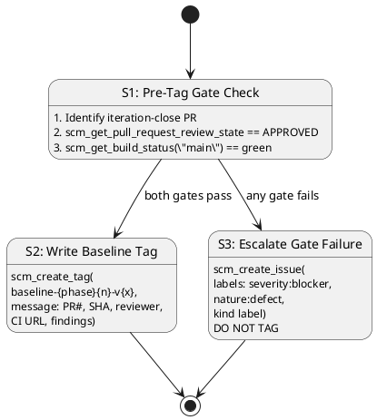

# Branching Strategy — Portal

> Configuration-as-code for the IARI/RUP workspace hierarchy.
> This file is owned by the Configuration Manager and committed directly to `main`.
> Source-code changes flow through pull requests; branching-strategy changes flow through direct commits.

## 1. Configuration Items (CIs)

| CI Type | Examples | Naming / Versioning | Authority |
|---|---|---|---|
| Source code | `src/**/*.cs`, `src/**/*.cshtml`, `src/**/*.js` | File path + Git SHA | Implementer |
| Build / deploy scripts | `.github/workflows/*.yml`, `*.props`, `Dockerfile` | File path + Git SHA | Environment / Implementer |
| Design models & docs | `docs/*.md` (excluding this file), UML diagrams | File path + Git SHA | respective discipline |
| Branching configuration | `docs/BRANCHING_STRATEGY.md` | File path + Git SHA | Configuration Manager |
| Baselines | Git tags | `baseline-{phase}{n}-v{x}` | Configuration Manager |
| Change requests | GitHub issues | `Issue #N` with labels | Change Control Manager |

## 2. Branch Naming Convention

All branches MUST use one of the canonical prefixes. Non-conforming branches are surfaced as SCM issues with `severity:minor` + `nature:defect` + `naming-violation`.

| Phase | Branch Pattern | Purpose | Base Branch |
|---|---|---|---|
| Inception | `feature/I{n}-{subject}` | Feasibility / documentation mechanism (evolutionary, never throwaway) | `iteration/I{n}` or `main` if no integration branch exists |
| Elaboration | `feature/E{n}-{risk-id}[-{mechanism}]` | Evolutionary architectural mechanism that becomes the Construction baseline | `iteration/E{n}` |
| Construction | `feature/C{n}-{uc-id}-{subject}` | Use-case realization | `iteration/C{n}` |
| Transition | `hotfix/{issue-id}` | Production fix | `main` |
| Any | `chore/{subject}` | Non-functional repo maintenance (CI, branching strategy, housekeeping) | `main` |
| Elaboration / Construction | `iteration/E{n}` | Integration workspace for iteration `n` | `main` |
| Elaboration / Construction | `iteration/C{n}` | Integration workspace for iteration `n` | `main` |

## 3. Workspace Hierarchy

```plantuml
@startuml BranchTopology

package "main" as MAIN_PKG {
    [main] as MAIN_BRANCH
}

package "iteration branches" as ITER_PKG {
    [iteration/I{n}] as I_INCEPTION
    [iteration/E{n}] as I_ELAB
    [iteration/C{n}] as I_CONST
}

package "feature branches" as FEAT_PKG {
    [feature/I{n}-SUBJECT] as F_INCEPTION
    [feature/E{n}-RISK-MECHANISM] as F_ELAB
    [feature/C{n}-UC-SUBJECT] as F_CONST
}

package "hotfix branches" as HOT_PKG {
    [hotfix/ISSUE-ID] as HOTFIX
}

MAIN_BRANCH --> I_INCEPTION : forks at iteration start
MAIN_BRANCH --> I_ELAB : forks at iteration start
MAIN_BRANCH --> I_CONST : forks at iteration start

I_INCEPTION --> F_INCEPTION : base for Inception docs
I_ELAB --> F_ELAB : base for architectural mechanisms
I_CONST --> F_CONST : base for UC realizations

MAIN_BRANCH --> HOTFIX : forks in Transition

F_INCEPTION --> I_INCEPTION : PR, Code Reviewer review
F_ELAB --> I_ELAB : PR, Code Reviewer review
F_CONST --> I_CONST : PR, Code Reviewer review

HOTFIX --> MAIN_BRANCH : PR, express review

I_INCEPTION --> MAIN_BRANCH : iteration-close PR at milestone
I_ELAB --> MAIN_BRANCH : iteration-close PR at LAM
I_CONST --> MAIN_BRANCH : iteration-close PR at IOC

note right of MAIN_BRANCH
  Only Integrator writes here.
  Baseline tags point only to
  APPROVED + CI-green commits.
end note

note right of F_ELAB
  Elaboration mechanisms are
  EVOLUTIONARY — they become
  the Construction baseline,
  not throwaway samples.
end note

note right of HOTFIX
  Transition only.
  Patch baseline tag after merge.
end note
@enduml
```

## 4. Per-Phase Branching Model

### 4.1 Inception — documentation only

- Normally no implementation code.
- If a feasibility mechanism is genuinely required for risk reduction, it is built evolutionarily in `src/` on `feature/I{n}-{subject}` (never a throwaway `poc/` branch or `samples/poc/` directory).
- At iteration close the Integrator opens `iteration/I{n} -> main` (or, when no integration branch exists, the relevant `feature/I{n}-*` -> `main` PRs).

### 4.2 Elaboration — evolutionary architectural mechanism

The architectural prototype is **evolutionary**: it becomes the Construction baseline, not throwaway sample code.

1. A technical risk is retired by **analysis** (Software Architect reasons feasibility — no code) or by building the **real mechanism** in `src/` on `feature/E{n}-{risk-id}[-{mechanism}]` based on `iteration/E{n}`.
2. The Architect records the decision as a process fact (`analysis-only` | `single-mechanism` | `candidates`).
3. The Code Reviewer opens and reviews each mechanism PR (base `iteration/E{n}`) as production code.
4. The Integrator merges the APPROVED mechanism into `iteration/E{n}`.
5. For competing `candidates`, the Architect selects the winner and the Integrator closes the loser's PR per the recorded decision.
6. At LAM close the Integrator opens `iteration/E{n} -> main`; the Deliver bookend merges the reviewed baseline.

There is **no** `samples/poc/` directory and **no** ephemeral `poc/*` branch.

### 4.3 Construction — feature branches

1. Use-case realizations are developed on `feature/C{n}-{uc-id}-{subject}` based on `iteration/C{n}`.
2. The Code Reviewer reviews each feature PR.
3. The Integrator merges APPROVED PRs into `iteration/C{n}`.
4. At IOC the Integrator opens `iteration/C{n} -> main`.

### 4.4 Transition — hotfixes

1. `hotfix/{issue-id}` is forked from `main`.
2. The fix is reviewed and merged via express PR.
3. A patch baseline tag (`baseline-transition-T{n}-v{x}`) is written after the merge.

## 5. Cross-Phase Invariants

| # | Invariant | Rationale |
|---|---|---|
| 1 | Only the Integrator writes `iteration/*` and `main`. | Preserves architectural and release integrity. |
| 2 | `ready-for-review` is the Implementer -> Code Reviewer handoff label. | Single, unambiguous signal. |
| 3 | A baseline tag freezes only an APPROVED + CI-green commit. | Defensible pedigree; no poisoned baselines. |
| 4 | Feature PRs target the current iteration branch, not `main` directly. | Keeps `main` releasable at all times. |
| 5 | Elaboration mechanisms are evolutionary, not throwaway. | Avoids re-work and keeps architecture honest. |
| 6 | No `poc/*` branches or `samples/poc/` directories. | Feasibility is either analysis or real code. |

## 6. Baseline Pedigree State Machine

## 7. Baseline Tag Naming

| Milestone | Tag Pattern | When Written |
|---|---|---|
| Inception iteration close | `baseline-inception-I{n}-v{x}` | End of Inception iteration `n` (only when architecture is not yet stable; normally one tag at the final Inception iteration if required) |
| Elaboration iteration close | `baseline-elaboration-E{n}-v{x}` | End of Elaboration iteration `n` (LAM) |
| Construction iteration close | `baseline-construction-C{n}-v{x}` | End of Construction iteration `n` (IOC) |
| Transition release | `baseline-transition-T{n}-v{x}` | End of Transition release `n` (GA) |

- `<patch>` (`x`) starts at `1`.
- Re-tag `v2, v3...` is only justified after an explicit rollback or a post-baseline critical fix.
- Routine iteration work targets the **next** iteration's tag, not a re-tag of the previous.

## 8. Change Control

- The Change Control Manager (CCM) owns the Change Request (CR) state machine and CCB decisions.
- The Configuration Manager consumes CCM-triaged outcomes indirectly via the branches and PRs they authorize.
- Pull requests are lightweight change control for code CIs.
- Non-conforming branch/PR naming is reported as an SCM issue (`severity:minor` + `nature:defect` + `naming-violation`) and is **not** auto-renamed.

## 9. Audit & Status Accounting

- **Functional Configuration Audit (FCA):** verified by CI tests and reviewer approval on each PR.
- **Physical Configuration Audit (PCA):** verified by the baseline tag message, which records the iteration-close PR number, head commit SHA, reviewer approval ID, `main` CI run URL, and any notable findings.
- Status and measurement data flow to dashboards that query the branch/PR/tag/issue graph directly. No separate status report document is produced by Configuration Management.

## 10. Tooling

| Function | Tool | Notes |
|---|---|---|
| Version control | Git / GitHub | Single repository for the Portal project |
| CI / build | GitHub Actions | Validates every PR and `main` post-merge |
| Change requests | GitHub Issues | Owned by the Change Control Manager |
| Baseline tags | Git tags | Written only by the Configuration Manager |
| Status dashboards | Grafana / Metabase | Query the GitHub graph (branches, PRs, tags, issues) |
