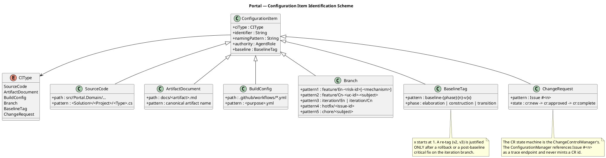
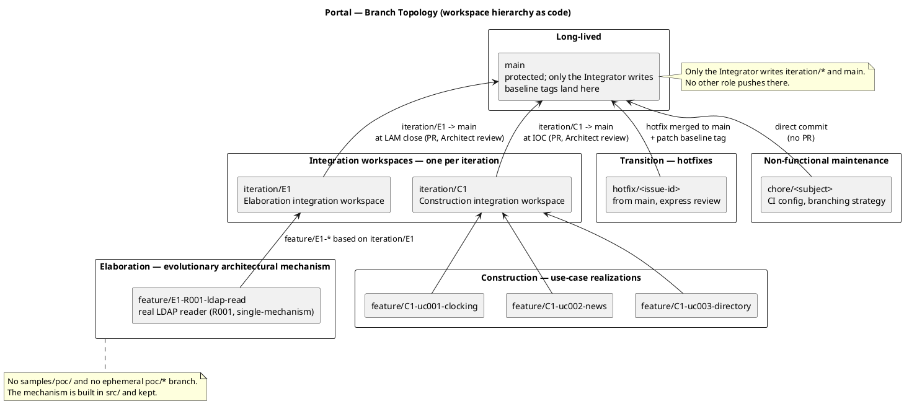
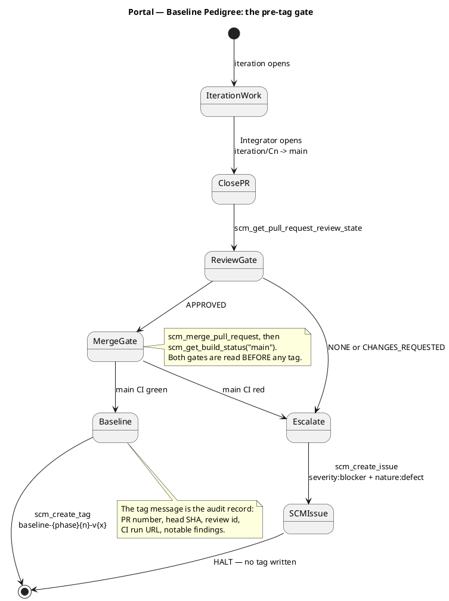
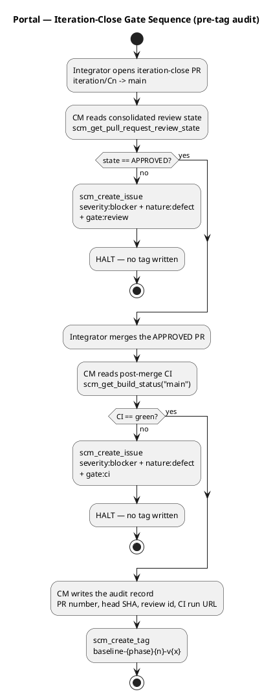
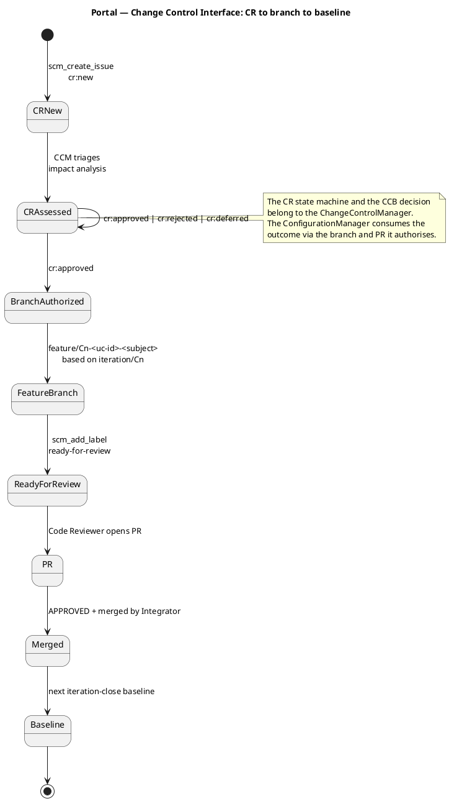
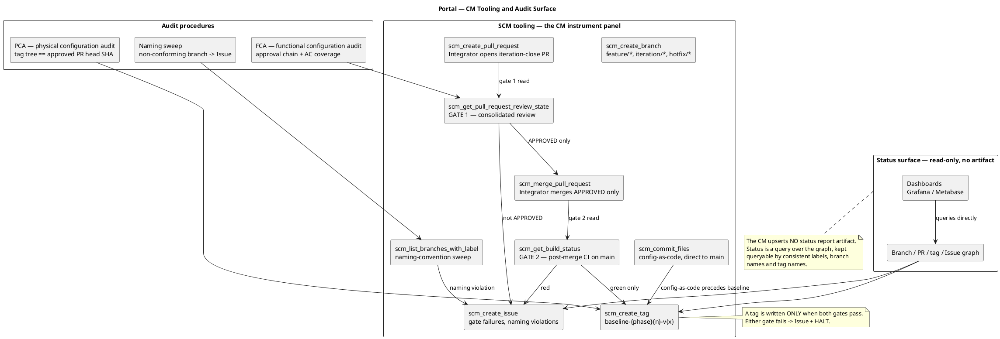
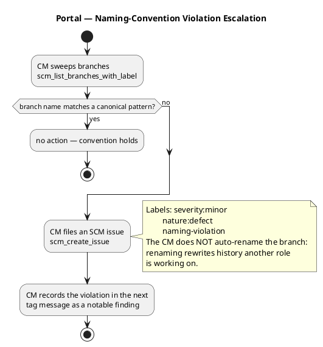

## Document Control

| Field | Value |
|---|---|
| Artifact | Branching Strategy — Portal (Employee Portal, Cuba Corp) |
| Phase | Inception |
| Status | Draft — published for review; milestone NOT YET ACHIEVED |
| Milestone Target | End-of-Inception (LCO) — not marked complete by this file |
| Iteration / Cycle | 1 / 1 |
| Owner | ConfigurationManager |
| Date | 2026-09-18 |
| Governing process | Development Case (Inception) — Business Modeling INACTIVE; Architectural Proof-of-Concept trigger FIRED (delta D2) |
| Nature of this file | Documentation / configuration-as-code. Committed DIRECT to `main` via `scm_commit_files`. Never opened as a pull request. |

**What this file is.** The project's configuration management strategy, expressed as code: the configuration-item identification scheme, the branch topology, the baseline pedigree and its pre-tag gate, the change-control interface, the audit procedures and the tooling. It is the workspace hierarchy the Integrator, Implementer and Reviewer work inside.

**What this file is not.** It is not a status report and not an audit findings document. Status and measurement data are queries over the branch / PR / tag / Issue graph, read from dashboards. The ConfigurationManager upserts no status artifact.

**Why it is committed direct to `main`.** This file is documentation. A pull request would gate a Markdown change behind a Reviewer with nothing actionable to inspect, and would withhold the file from the Integrator, Implementer and Reviewer until the PR was handled. PRs are for source code; docs are commits.

## Configuration Item Identification Scheme

Every configuration item is identified by a stable scheme, so that a change can be traced to the item it touched and a baseline can be audited against it.

| CI type | Identifier | Naming pattern | Authority |
|---|---|---|---|
| Source code | file path | `src/<Solution>/<Project>/<Type>.cs` — the four projects fixed by the SAD Implementation View (`Portal.Web`, `Portal.Api`, `Portal.Domain`, `Portal.Infrastructure`) | Implementer |
| Artifact document | canonical artifact name | `docs/<artifact>.md` | the artifact's primary owner |
| Build configuration | file path | `.github/workflows/<purpose>.yml` | Implementer / Integrator |
| Branch | branch name | the five patterns in *Branch Topology* | Integrator (integration branches), Implementer (feature branches) |
| Baseline tag | tag name | `baseline-{phase}{n}-v{x}` | ConfigurationManager |
| Change request | `Issue #<n>` | GitHub issue, `cr:*` labels | ChangeControlManager |

**Element identifiers are not configuration items.** `COMP-001`..`COMP-011`, `INT-001`..`INT-010`, `ADR-001`..`ADR-007`, `UC-001`..`UC-003`, `FR-001`..`FR-014`, `NFR-001`..`NFR-004`, `CON-001`..`CON-024`, `R001`..`R006`, `AC-001`..`AC-005` are model elements owned by their authority roles. They are referenced, never re-minted here.

## Branch Topology

The topology is the workspace hierarchy: developer → integration → release. It is deliberately small — three use cases, one internal Windows Server (CON-007), 200 employees (CON-008).

### Naming conventions

| Pattern | Phase | Base branch | Purpose |
|---|---|---|---|
| `feature/E{n}-{risk-id}[-{mechanism}]` | Elaboration | `iteration/E{n}` | Evolutionary architectural mechanism. Built in `src/`, integrated like a feature. |
| `feature/C{n}-{uc-id}-{subject}` | Construction | `iteration/C{n}` | Use-case realization. |
| `iteration/E{n}` | Elaboration | `main` | Integration workspace for the iteration. |
| `iteration/C{n}` | Construction | `main` | Integration workspace for the iteration. |
| `hotfix/{issue-id}` | Transition | `main` | Post-release fix; express review; merged to `main` with a patch baseline tag. |
| `chore/{subject}` | any | `main` | Non-functional repository maintenance — CI config, this file. |

**Cross-phase invariants.**

1. **Only the Integrator writes `iteration/*` and `main`.** No other role pushes there. Feature branches are the Implementer's; integration branches and `main` are the Integrator's.
2. **`ready-for-review` is the Implementer → Code Reviewer handoff label.** A branch carrying it and no pull request is a branch waiting for one.
3. **A baseline tag freezes only an APPROVED + CI-green commit.** See *Baseline Pedigree*.
4. **No `samples/poc/` directory and no ephemeral `poc/*` branch exists.** The Elaboration mechanism is evolutionary: it is built in `src/` and becomes the Construction baseline.

### Per-phase model

**Inception — documentation only.** No implementation code. The declared scope is a closed set of fourteen functional requirements (FR-001..FR-014) and the Development Case records `business-process-led = false`, so no feasibility mechanism is required. No `feature/I*` branch is created. **Inception produces no baseline tag** — the phase token set is {elaboration, construction, transition}, and the LCO milestone is recorded by the review, not by a tag.

**Elaboration — evolutionary architectural mechanism.** The Development Case fired the Architectural Proof-of-Concept trigger on R001 (delta D2), with mode `single-mechanism`. The mechanism is the **real** LDAP reader, built in `src/` on `feature/E1-R001-ldap-read` based on `iteration/E1`. It is not throwaway sample code. The Code Reviewer opens and reviews the mechanism PR as production; the Integrator merges the APPROVED mechanism into `iteration/E1`. R003 and R004 are `analysis-only` — no branch, no prototype; they are discharged in the Design Model. At LAM close the Integrator opens `iteration/E1 → main` and the Deliver bookend merges the reviewed baseline.

**Construction — feature branches.** UC realizations on `feature/C{n}-{uc-id}-{subject}` based on `iteration/C{n}`. The Code Reviewer reviews; the Integrator merges APPROVED into `iteration/C{n}` and opens `iteration/C{n} → main` at IOC.

**Transition — hotfixes.** `hotfix/{issue-id}` from `main`, express review, merged to `main` with a patch baseline tag.

## Baseline Pedigree

A baseline tag is written **only** when the iteration-close PR has consolidated review state `APPROVED` **and** post-merge CI on `main` is green. A tag that freezes a red build or an unreviewed commit is a defect, not a baseline.

### Baseline tag naming

| Tag | Written at | Phase token |
|---|---|---|
| `baseline-elaboration-E{n}-v{x}` | LAM close — `iteration/E{n} → main` merged | `elaboration` |
| `baseline-construction-C{n}-v{x}` | IOC — `iteration/C{n} → main` merged | `construction` |
| `baseline-transition-T{n}-v{x}` | release / hotfix merged to `main` | `transition` |

`{x}` starts at `1`. A re-tag (`v2`, `v3`) is justified **only** after an explicit rollback or a post-baseline critical fix applied to the iteration branch. Routine iteration work targets the **next** iteration's tag, never a re-tag of the previous one. One baseline per iteration close — never mid-iteration.

### Tag message contract

The tag message is the audit statement. It is terse, factual and Git-native, and it carries:

- the iteration-close PR number and the head commit SHA it points at;
- the Architect approval review id;
- the `main` CI run URL at tag time;
- any notable findings — naming violations, deferred items, re-tag justification.

A tag message reading `"baseline"` alone is a defect: it claims a pedigree it does not evidence.

### Gate dependency — CI must exist before the first baseline

The second gate reads `scm_get_build_status("main")`. The Development Case records the CI workflow as **UNVERIFIED** in its S1 tool inventory (2026-09-17), with the Implementer / Integrator as content owner and the target "verified before the first Construction iteration". The first baseline this strategy writes is `baseline-elaboration-E1-v1` at LAM close, which precedes that target — so the gate is satisfiable, but only if the workflow exists by then.

Until it does, the second gate **cannot be read**, and an unreadable gate is a **failed** gate, not a waived one: no tag is written. The ConfigurationManager does not author the CI workflow — it is not a CM deliverable, and the Development Case assigns it to the Implementer / Integrator — but it does refuse to tag without it. This dependency is named here so that the gate's validity is auditable rather than assumed.

## Change Control Interface

The Change Request state machine and the CCB decisions belong to the **ChangeControlManager**. The ConfigurationManager does not triage CRs and does not evaluate impact. It consumes the CCM-triaged outcome indirectly, through the branch and the PR that outcome authorises.

**Boundary.** The ConfigurationManager references a change request as `Issue #<n>` — an observed process fact. It never mints a `CR-NNN` identifier: that family is not in the element-ID table, and a composed citation is worth less than none.

## Audit Procedures

Two audits run at every iteration close, before the tag is written.

| Audit | Question it answers | Procedure |
|---|---|---|
| **FCA** — functional configuration audit | Does the tagged commit meet the requirements the iteration claimed? | Verify the approval chain: each feature PR carries a Code Reviewer approval; the iteration-close PR carries the Architect approval. Verify the iteration's use cases are covered by the merged feature branches. The ConfigurationManager verifies the **approval chain**, not the use cases directly. |
| **PCA** — physical configuration audit | Does the tag point at the commit that was actually approved? | Compare the tag's target SHA against the head SHA of the APPROVED iteration-close PR. A mismatch is a defect. |
| **Naming sweep** | Does every branch conform to the canonical patterns? | `scm_list_branches_with_label` sweep; non-conforming branches are surfaced as issues, never auto-renamed. |

### Escalation discipline

Any gate failure yields an SCM issue with `severity:blocker` + `nature:defect` and a kind label (`gate:review`, `gate:ci`). A gate never fails silently.

| Failure | Labels | Action |
|---|---|---|
| Iteration-close PR not `APPROVED` | `severity:blocker`, `nature:defect`, `gate:review` | Issue filed; **no tag written**; HALT until the Architect reviews. |
| `main` CI red after merge | `severity:blocker`, `nature:defect`, `gate:ci` | Issue filed; **no tag written**; HALT until green. |
| Non-conforming branch name | `severity:minor`, `nature:defect`, `naming-violation` | Issue filed; branch **not** renamed; recorded as a notable finding in the next tag message. |

## Status and Measurement

Status and measurement data — progress, aging, distribution, trends — flow to dashboards (Grafana / Metabase) that query the branch / PR / tag / Issue graph directly. The ConfigurationManager **upserts no status report artifact**. What it does is keep that graph queryable: consistent labels, consistent branch naming, consistent tag naming. A dashboard is only as good as the conventions it queries.

## Traceability

| Element | Traces From | Link Type | Traces To |
|---|---|---|---|
| Configuration item identification scheme | CON-001, CON-002, CON-003, CON-004, CON-007 | Derives | Implementation Model |
| Branch topology — `main` / `iteration/*` / `feature/*` / `hotfix/*` / `chore/*` | CON-011, CON-016 | Derives | Software Architecture Document |
| Elaboration mechanism branch `feature/E{n}-{risk-id}[-{mechanism}]` | R001, R003, R004, R006 | Derives | Architectural Proof-of-Concept |
| Construction feature branch `feature/C{n}-{uc-id}-{subject}` | FR-001, FR-002, FR-003, FR-004, FR-005, FR-006, FR-007, FR-008, FR-009, FR-010, FR-011, FR-012, FR-013, FR-014 | Derives | Design Model |
| Baseline tag `baseline-{phase}{n}-v{x}` | CON-011, NFR-004 | Derives | Release Notes |
| Pre-tag gate — APPROVED + CI green | NFR-004, AC-001, AC-002, AC-003, AC-004, AC-005 | Derives | Test Evaluation Summary |
| Change-control interface — CR to branch to baseline | CON-016 | Derives | Change Request |
| Naming-convention sweep and escalation | CON-011 | Derives | Change Request |
| Status surface — dashboards over the graph, no artifact | CON-011 | Derives | Iteration Plan |

**Not traced, and why.** `STK-001`..`STK-004` and `BG-001`..`BG-003` are consumed by the Vision and drive no configuration-management decision. `R002` (adoption) and `R005` (gate queue time) are Project Management concerns carried in the Risk List and the Iteration Plan; R005's 14-day gate ceiling is a planning constraint, not a branching one. `CON-005`, `CON-006`, `CON-008`, `CON-009`, `CON-010`, `CON-012`, `CON-013`, `CON-014`, `CON-015`, `CON-017`, `CON-018`, `CON-019`, `CON-020`, `CON-021`, `CON-022`, `CON-023`, `CON-024` and `NFR-001`..`NFR-003` are architectural and business-rule constraints discharged by the Software Architecture Document and the Design Model; they do not shape the branch topology, so no row is duplicated here.
