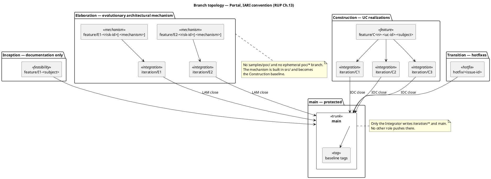
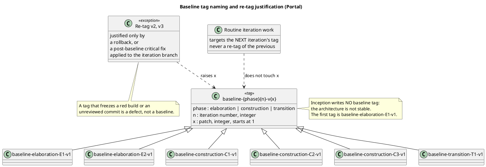
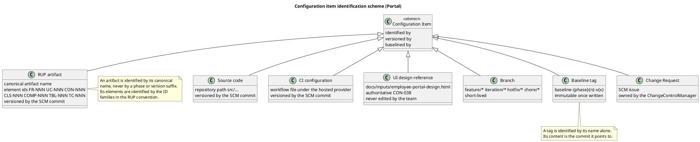
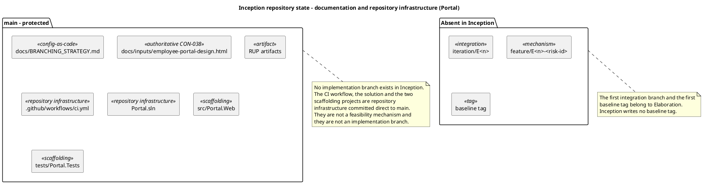
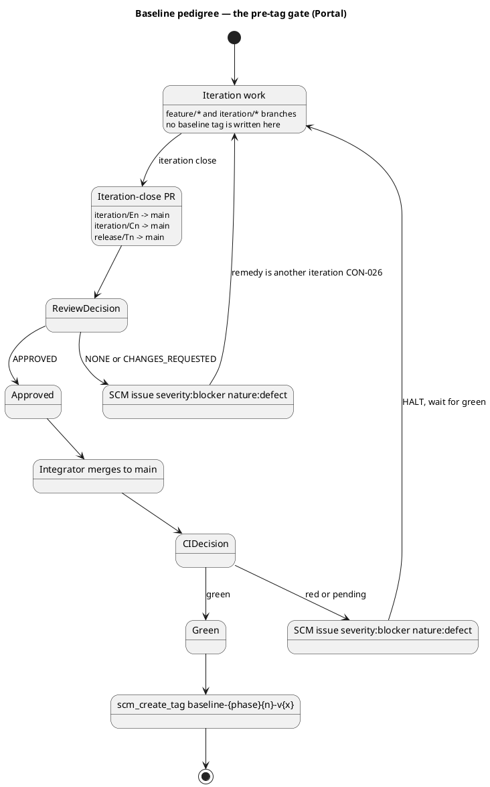
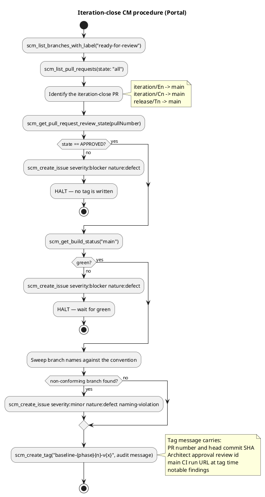
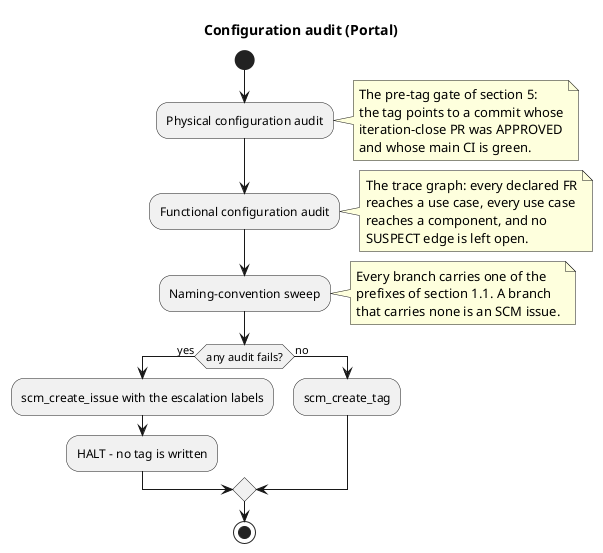
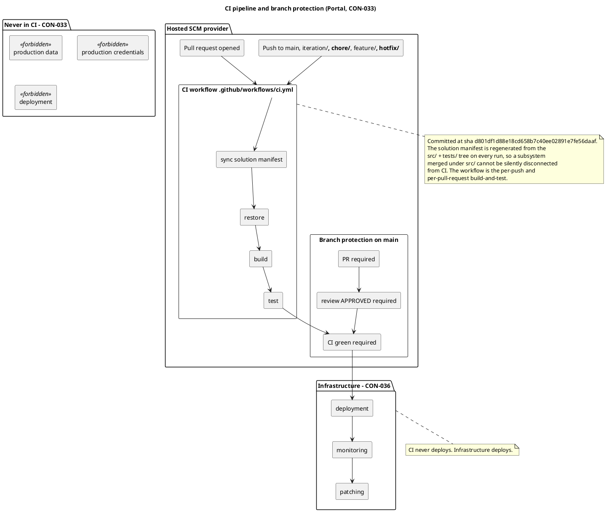
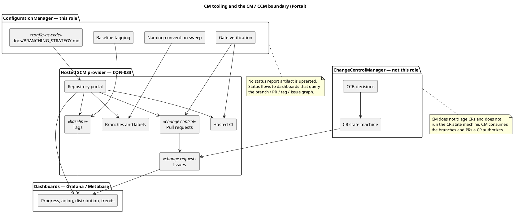

# Branching Strategy and Configuration Management

- **Phase:** Inception
- **Status:** Published — governs all iterations
- **Iteration:** 2, Cycle 1
- **Owner:** ConfigurationManager
- **Date:** 2026-10-07

This file is the workspace hierarchy expressed as code. It is documentation/config-as-code: it is committed direct to `main` and is never opened as a pull request. CI does not validate it. Every role reads it; the Integrator and the Implementer follow it; the ConfigurationManager owns it.

## 1. Branch Topology

The repository has one long-lived branch, `main`, and three classes of short-lived branch. Only the Integrator writes `iteration/*` and `main`.

```plantuml
@startuml
title Branch topology — Portal, IARI convention (RUP Ch.13)

skinparam componentStyle rectangle

package "main — protected" as MAIN {
  component "main" as M <<trunk>> {
    component "baseline tags" as TAGS <<tag>>
  }
}

package "Inception — documentation only" as INC {
  component "feature/I1-<subject>" as FI1 <<feasibility>>
}

package "Elaboration — evolutionary architectural mechanism" as ELA {
  component "iteration/E1" as IE1 <<integration>>
  component "iteration/E2" as IE2 <<integration>>
  component "feature/E1-<risk-id>[-<mechanism>]" as FE1 <<mechanism>>
  component "feature/E2-<risk-id>[-<mechanism>]" as FE2 <<mechanism>>
}

package "Construction — UC realizations" as CON {
  component "iteration/C1" as IC1 <<integration>>
  component "iteration/C2" as IC2 <<integration>>
  component "iteration/C3" as IC3 <<integration>>
  component "feature/C<n>-<uc-id>-<subject>" as FC <<feature>>
}

package "Transition — hotfixes" as TRA {
  component "hotfix/<issue-id>" as HF <<hotfix>>
}

FI1 --> M
FE1 --> IE1
FE2 --> IE2
FC --> IC1
FC --> IC2
FC --> IC3
IE1 --> M : LAM close
IE2 --> M : LAM close
IC1 --> M : IOC close
IC2 --> M : IOC close
IC3 --> M : IOC close
HF --> M
M --> TAGS

note right of M
  Only the Integrator writes iteration/* and main.
  No other role pushes there.
end note

note bottom of ELA
  No samples/poc/ and no ephemeral poc/* branch.
  The mechanism is built in src/ and becomes
  the Construction baseline.
end note
@enduml
```

### 1.1 Branch naming convention

RUP Ch.13: naming conventions are important because they facilitate communication. Every branch carries exactly one of the prefixes below. A branch that carries none is a naming violation and is surfaced as an SCM issue — it is never auto-renamed.

| Pattern | Phase | Purpose | Opened by | Merged by |
|---|---|---|---|---|
| `feature/I<n>-<subject>` | Inception | Feasibility mechanism, only if genuinely required for risk reduction. Built evolutionarily in `src/`, never throwaway. | Implementer | Integrator |
| `feature/E<n>-<risk-id>[-<mechanism>]` | Elaboration | Evolutionary architectural mechanism, based on `iteration/E<n>`, integrated like a feature. | Implementer | Integrator |
| `feature/C<n>-<uc-id>-<subject>` | Construction | Use-case realization, based on `iteration/C<n>`. | Implementer | Integrator |
| `iteration/E<n>` | Elaboration | Integration workspace for the iteration. | Integrator | Integrator (to `main` at LAM close) |
| `iteration/C<n>` | Construction | Integration workspace for the iteration. | Integrator | Integrator (to `main` at IOC close) |
| `hotfix/<issue-id>` | Transition | Express fix from `main`. | Implementer | Integrator |
| `chore/<subject>` | any | Non-functional repository maintenance: branching strategy updates, CI configuration. | ConfigurationManager | Integrator |

### 1.2 Tag naming convention

```plantuml
@startuml
title Baseline tag naming and re-tag justification (Portal)

skinparam classAttributeIconSize 0

class "baseline-{phase}{n}-v{x}" as TAG <<tag>> {
  phase : elaboration | construction | transition
  n : iteration number, integer
  x : patch, integer, starts at 1
}

class "baseline-elaboration-E1-v1" as E1
class "baseline-elaboration-E2-v1" as E2
class "baseline-construction-C1-v1" as C1
class "baseline-construction-C2-v1" as C2
class "baseline-construction-C3-v1" as C3
class "baseline-transition-T1-v1" as T1

class "Re-tag v2, v3" as RETAG <<exception>> {
  justified only by
  a rollback, or
  a post-baseline critical fix
  applied to the iteration branch
}

class "Routine iteration work" as ROUTINE {
  targets the NEXT iteration's tag
  never a re-tag of the previous
}

TAG <|-- E1
TAG <|-- E2
TAG <|-- C1
TAG <|-- C2
TAG <|-- C3
TAG <|-- T1
RETAG ..> TAG : raises x
ROUTINE ..> TAG : does not touch x

note right of TAG
  Inception writes NO baseline tag:
  the architecture is not stable.
  The first tag is baseline-elaboration-E1-v1.
end note

note bottom of RETAG
  A tag that freezes a red build or an
  unreviewed commit is a defect, not a baseline.
end note
@enduml
```

| Tag | Written at | Freezes |
|---|---|---|
| `baseline-elaboration-E1-v1` | Close of Elaboration 1 | The first architectural baseline: the mechanisms for R001, R004 and R008 built in `src/`. |
| `baseline-elaboration-E2-v1` | Close of Elaboration 2 (LCA) | The stable architecture, validated against the real Keycloak and the real AD. |
| `baseline-construction-C1-v1` | Close of Construction 1 | The first integrated increment. |
| `baseline-construction-C2-v1` | Close of Construction 2 | The second integrated increment. |
| `baseline-construction-C3-v1` | Close of Construction 3 (IOC) | The declared scope implemented, integrated and tested. |
| `baseline-transition-T1-v1` | Close of Transition 1 (PR) | The released product, after Infrastructure accepts operation. |

`<patch>` starts at `1`. A re-tag with a higher patch number is justified only by an explicit rollback or by a post-baseline critical fix applied to the iteration branch. Routine iteration work targets the NEXT iteration's tag.

## 2. Configuration Item Identification Scheme

Every configuration item is identified by a name that is stable across iterations, and versioned by the SCM commit that carries it. No item is identified by a phase name, an iteration number or a status qualifier.

```plantuml
@startuml
title Configuration item identification scheme (Portal)

skinparam classAttributeIconSize 0

class "Configuration Item" as CI <<abstract>> {
  identified by
  versioned by
  baselined by
}

class "RUP artifact" as ART {
  canonical artifact name
  element ids FR-NNN UC-NNN CON-NNN
  CLS-NNN COMP-NNN TBL-NNN TC-NNN
  versioned by the SCM commit
}

class "Source code" as SRC {
  repository path src/...
  versioned by the SCM commit
}

class "CI configuration" as CIC {
  workflow file under the hosted provider
  versioned by the SCM commit
}

class "UI design reference" as UID {
  docs/inputs/employee-portal-design.html
  authoritative CON-038
  never edited by the team
}

class "Branch" as BR {
  feature/* iteration/* hotfix/* chore/*
  short-lived
}

class "Baseline tag" as TAG {
  baseline-{phase}{n}-v{x}
  immutable once written
}

class "Change Request" as CR {
  SCM issue
  owned by the ChangeControlManager
}

CI <|-- ART
CI <|-- SRC
CI <|-- CIC
CI <|-- UID
CI <|-- BR
CI <|-- TAG
CI <|-- CR

note right of ART
  An artifact is identified by its canonical
  name, never by a phase or version suffix.
  Its elements are identified by the ID
  families in the RUP convention.
end note

note bottom of TAG
  A tag is identified by its name alone.
  Its content is the commit it points to.
end note
@enduml
```

| Configuration item | Identifier | Versioned by | Baselined by |
|---|---|---|---|
| RUP artifact | Its canonical artifact name — `Vision`, `Use-Case Model`, `Software Architecture Document`, `Design Model`, `Test Case`, `Iteration Plan`, `Risk List`, `Review Record`, `Development Case`, `Change Request`. Never a phase, iteration or status suffix. | The SCM commit of each `upsert_artifact` | The iteration baseline tag |
| Artifact element | The ID family of its type: `FR-NNN`, `NFR-NNN`, `CON-NNN`, `UC-NNN`, `AC-NNN`, `BG-NNN`, `RNNN`, `CLS-NNN`, `COMP-NNN`, `TBL-NNN`, `TC-NNN`, `STK-NNN` | The artifact that carries it | The iteration baseline tag |
| Source code | Its repository path, `src/...` | The SCM commit | The iteration baseline tag |
| CI configuration | Its path under the hosted provider's workflow directory | The SCM commit | The iteration baseline tag |
| UI design reference | `docs/inputs/employee-portal-design.html` — authoritative and read-only (CON-038) | The SCM commit that committed it | Not baselined by this project; it is an input |
| Branch | Its name, per §1.1 | The SCM branch | Not baselined; short-lived |
| Baseline tag | Its name, per §1.2 | Immutable once written | — |
| Change Request | Its SCM issue number | The issue's own state machine, owned by the ChangeControlManager | — |

**What is not a configuration item.** The historical Excel archive on the shared drive (CON-037) is a read-only input, not a CI of this project. The real Keycloak and the real Active Directory are external systems (CON-030, CON-003) — their configuration is not versioned here. No backup artefact is a CI (CON-039).

## 3. Per-Phase Branching Model

### 3.1 Inception — documentation only

Inception produces the artifact scope and the risk record, not running code. There is normally no implementation branch. A feasibility mechanism, if genuinely required for risk reduction, is built evolutionarily in `src/` on `feature/I1-<subject>` — never as throwaway sample code. **No baseline tag is written in Inception: the architecture is not stable.**

```plantuml
@startuml
title Inception repository state - documentation and repository infrastructure (Portal)

skinparam componentStyle rectangle

package "main - protected" as MAIN {
  component "docs/BRANCHING_STRATEGY.md" as BS <<config-as-code>>
  component "docs/inputs/employee-portal-design.html" as UID <<authoritative CON-038>>
  component "RUP artifacts" as ART <<artifact>>
  component ".github/workflows/ci.yml" as CI <<repository infrastructure>>
  component "Portal.sln" as SLN <<repository infrastructure>>
  component "src/Portal.Web" as WEB <<scaffolding>>
  component "tests/Portal.Tests" as TST <<scaffolding>>
}

package "Absent in Inception" as ABS {
  component "iteration/E<n>" as IE <<integration>>
  component "feature/E<n>-<risk-id>" as FE <<mechanism>>
  component "baseline tag" as TAG <<tag>>
}

note bottom of MAIN
  No implementation branch exists in Inception.
  The CI workflow, the solution and the two
  scaffolding projects are repository
  infrastructure committed direct to main.
  They are not a feasibility mechanism and
  they are not an implementation branch.
end note

note bottom of ABS
  The first integration branch and the first
  baseline tag belong to Elaboration.
  Inception writes no baseline tag.
end note
@enduml
```

### 3.2 Elaboration — evolutionary architectural mechanism

The architectural prototype is EVOLUTIONARY. It becomes the Construction baseline; it is not throwaway sample code. There is **no** `samples/poc/` directory and **no** ephemeral `poc/*` branch.

A technical risk is retired by one of two routes:

1. **Analysis** — the SoftwareArchitect reasons feasibility and writes no code. The Architect records the decision as a process fact via `record_poc_decision` with value `analysis-only`.
2. **Building the real mechanism** — the mechanism is built in `src/` on `feature/E<n>-<risk-id>[-<mechanism>]`, based on `iteration/E<n>`. The Architect records `single-mechanism` (one candidate) or `candidates` (competing candidates).

The Code Reviewer opens and reviews each mechanism PR (base `iteration/E<n>`) as production code. The Integrator merges the APPROVED mechanism into `iteration/E<n>`. For competing `candidates` the Architect selects the winner and the Integrator closes the loser's PR with `scm_close_pull_request`, per the recorded decision.

At LAM close the Integrator opens `iteration/E<n> -> main`; the Deliver bookend merges the reviewed baseline.

### 3.3 Construction — feature branches

Use-case realizations are built on `feature/C<n>-<uc-id>-<subject>`, based on `iteration/C<n>`. The Code Reviewer reviews; the Integrator merges APPROVED work into `iteration/C<n>` and opens `iteration/C<n> -> main` at IOC.

### 3.4 Transition — hotfixes

`hotfix/<issue-id>` branches from `main`, receives an express review, and merges to `main` with a patch baseline tag.

## 4. Cross-Phase Invariants

These hold in every phase and are not negotiable per iteration.

| # | Invariant |
|---|---|
| CM-1 | Only the Integrator writes `iteration/*` and `main`. No other role pushes there. |
| CM-2 | `ready-for-review` is the Implementer-to-Code-Reviewer handoff label. A branch carrying it and no pull request is waiting for a reviewer. |
| CM-3 | A baseline tag freezes only an APPROVED and CI-green commit. |
| CM-4 | `docs/BRANCHING_STRATEGY.md` is committed direct to `main` via `scm_commit_files`. It is never opened as a pull request. |
| CM-5 | CI never holds production data or credentials and never deploys (CON-033). Infrastructure deploys (CON-036). |
| CM-6 | No status report artifact is upserted. Status flows to dashboards that query the branch, PR, tag and Issue graph. |
| CM-7 | The ConfigurationManager does not triage Change Requests and does not run the CR state machine. That is the ChangeControlManager's. |

## 5. Baseline Pedigree — the Pre-Tag Gate

A tag is defensible only when every commit it points to came from an APPROVED pull request and a GREEN build. The gate is executed before every `scm_create_tag`.

```plantuml
@startuml
title Baseline pedigree — the pre-tag gate (Portal)

[*] --> IterationWork

state "Iteration work" as IterationWork {
  IterationWork : feature/* and iteration/* branches
  IterationWork : no baseline tag is written here
}

IterationWork --> ClosePR : iteration close
state "Iteration-close PR" as ClosePR {
  ClosePR : iteration/En -> main
  ClosePR : iteration/Cn -> main
  ClosePR : release/Tn -> main
}

ClosePR --> ReviewDecision
state ReviewDecision <<choice>>
ReviewDecision --> Approved : APPROVED
ReviewDecision --> Blocked : NONE or CHANGES_REQUESTED

state "SCM issue severity:blocker nature:defect" as Blocked
Blocked --> IterationWork : remedy is another iteration CON-026

Approved --> Merge
state "Integrator merges to main" as Merge
Merge --> CIDecision
state CIDecision <<choice>>
CIDecision --> Green : green
CIDecision --> Red : red or pending
state "SCM issue severity:blocker nature:defect" as Red
Red --> IterationWork : HALT, wait for green

Green --> Tag
state "scm_create_tag baseline-{phase}{n}-v{x}" as Tag
Tag --> [*]
@enduml
```

### 5.1 Iteration-close procedure

```plantuml
@startuml
title Iteration-close CM procedure (Portal)

|ConfigurationManager|
start
:scm_list_branches_with_label("ready-for-review");
:scm_list_pull_requests(state: "all");
:Identify the iteration-close PR;
note right
  iteration/En -> main
  iteration/Cn -> main
  release/Tn -> main
end note

:scm_get_pull_request_review_state(pullNumber);
if (state == APPROVED?) then (no)
  :scm_create_issue severity:blocker nature:defect;
  :HALT — no tag is written;
  stop
else (yes)
endif

:scm_get_build_status("main");
if (green?) then (no)
  :scm_create_issue severity:blocker nature:defect;
  :HALT — wait for green;
  stop
else (yes)
endif

:Sweep branch names against the convention;
if (non-conforming branch found?) then (yes)
  :scm_create_issue severity:minor nature:defect naming-violation;
else (no)
endif

:scm_create_tag("baseline-{phase}{n}-v{x}", audit message);
note right
  Tag message carries:
  PR number and head commit SHA
  Architect approval review id
  main CI run URL at tag time
  notable findings
end note
stop
@enduml
```

### 5.2 Tag message — the audit record

The tag body is the audit statement. It is terse and factual, and it carries:

- the iteration-close PR number and the head commit SHA it points to;
- the Architect approval review id;
- the `main` CI run URL at tag time;
- any notable finding: naming violations, deferred items, re-tag justification.

A tag message reading `baseline` alone is a defect: it claims a pedigree it does not record.

### 5.3 Configuration audit

Three audits run at every iteration close, before the tag. Each is a check against observable state, not a document.

```plantuml
@startuml
title Configuration audit (Portal)

|ConfigurationManager|
start
:Physical configuration audit;
note right
  The pre-tag gate of section 5:
  the tag points to a commit whose
  iteration-close PR was APPROVED
  and whose main CI is green.
end note

:Functional configuration audit;
note right
  The trace graph: every declared FR
  reaches a use case, every use case
  reaches a component, and no
  SUSPECT edge is left open.
end note

:Naming-convention sweep;
note right
  Every branch carries one of the
  prefixes of section 1.1. A branch
  that carries none is an SCM issue.
end note

if (any audit fails?) then (yes)
  :scm_create_issue with the escalation labels;
  :HALT - no tag is written;
else (no)
  :scm_create_tag;
endif
stop
@enduml
```

| Audit | Question it answers | Evidence | Failure |
|---|---|---|---|
| Physical configuration audit | Does the baseline contain what the iteration claims it contains? | The iteration-close PR diff and the commit the tag points to | `severity:blocker`, `nature:defect`; no tag |
| Functional configuration audit | Does every declared requirement reach a use case, and every use case a component? | The trace graph, read at the iteration close | `severity:blocker`, `nature:defect`; no tag |
| Naming-convention sweep | Does every branch carry a prefix of §1.1? | `scm_list_branches_with_label` and the branch list | `severity:minor`, `nature:defect`, `naming-violation`; the tag is not blocked |

No audit produces a document. The physical audit is the pre-tag gate; the functional audit is the trace graph; the naming sweep is the branch list. A configuration audit finding is an SCM issue, and the audit's result is the tag that was or was not written.

## 6. CI and Branch Protection

```plantuml
@startuml
title CI pipeline and branch protection (Portal, CON-033)

skinparam componentStyle rectangle

package "Hosted SCM provider" as HOST {
  component "Push to main, iteration/**, chore/**, feature/**, hotfix/**" as PUSH
  component "Pull request opened" as PRO
  component "CI workflow .github/workflows/ci.yml" as WF {
    component "sync solution manifest" as S0
    component "restore" as S1
    component "build" as S2
    component "test" as S3
  }
  component "Branch protection on main" as BP {
    component "PR required" as BP1
    component "review APPROVED required" as BP2
    component "CI green required" as BP3
  }
}

package "Never in CI - CON-033" as NEVER {
  component "production data" as ND <<forbidden>>
  component "production credentials" as NC <<forbidden>>
  component "deployment" as DEPF <<forbidden>>
}

package "Infrastructure - CON-036" as INFRA {
  component "deployment" as DEP
  component "monitoring" as MON
  component "patching" as PAT
}

PUSH --> WF
PRO --> WF
WF --> S0
S0 --> S1
S1 --> S2
S2 --> S3
S3 --> BP3
BP1 --> BP2
BP2 --> BP3
BP3 --> DEP
DEP --> MON
MON --> PAT

note bottom of WF
  Committed at sha d801df1d88e18cd658b7c40ee02891e7fe56daaf.
  The solution manifest is regenerated from the
  src/ + tests/ tree on every run, so a subsystem
  merged under src/ cannot be silently disconnected
  from CI. The workflow is the per-push and
  per-pull-request build-and-test.
end note

note bottom of INFRA
  CI never deploys. Infrastructure deploys.
end note
@enduml
```

`main` is protected: a pull request is required, an APPROVED review is required, and a green CI run is required.

The CI workflow is committed at `.github/workflows/ci.yml` and is green on `main`. It triggers on `push` and on `pull_request` for `main`, `iteration/**`, `chore/**`, `feature/**` and `hotfix/**`, and it regenerates the solution manifest from the `src/` and `tests/` tree on every run — a subsystem merged under `src/` cannot be silently disconnected from the build. The workflow is the per-push and per-pull-request build-and-test the regression rule requires (CON-033).

The remaining Elaboration entry criteria are the test stand-ins and the test conventions in `CONTRIBUTING.md`; the CI workflow is not among them.

## 7. Configuration Management and Change Control Boundary

```plantuml
@startuml
title CM tooling and the CM / CCM boundary (Portal)

skinparam componentStyle rectangle

package "Hosted SCM provider — CON-033" as SCM {
  component "Repository portal" as REPO
  component "Pull requests" as PR <<change control>>
  component "Issues" as ISS <<change request>>
  component "Branches and labels" as BR
  component "Tags" as TAG <<baseline>>
  component "Hosted CI" as CI
}

package "ConfigurationManager — this role" as CM {
  component "Baseline tagging" as BT
  component "Naming-convention sweep" as SW
  component "Gate verification" as GV
  component "docs/BRANCHING_STRATEGY.md" as BS <<config-as-code>>
}

package "ChangeControlManager — not this role" as CCM {
  component "CR state machine" as CRSM
  component "CCB decisions" as CCB
}

package "Dashboards — Grafana / Metabase" as DASH {
  component "Progress, aging, distribution, trends" as Q
}

REPO --> PR
REPO --> BR
REPO --> TAG
REPO --> CI
PR --> ISS
GV --> PR
GV --> CI
BT --> TAG
SW --> BR
BS --> REPO
CRSM --> ISS
CCB --> CRSM
REPO --> Q
ISS --> Q
TAG --> Q

note bottom of CM
  No status report artifact is upserted.
  Status flows to dashboards that query
  the branch / PR / tag / Issue graph.
end note

note bottom of CCM
  CM does not triage CRs and does not
  run the CR state machine. CM consumes
  the branches and PRs a CR authorizes.
end note
@enduml
```

The ChangeControlManager owns the Change Request state machine (`cr:new` -> `cr:approved` -> `cr:complete`) and the CCB decisions. The ConfigurationManager does not triage CRs and does not evaluate impact. It consumes the CCM-triaged outcomes indirectly, through the branches and pull requests those decisions authorize.

## 8. Escalation Labels

| Situation | Labels |
|---|---|
| Iteration-close PR not APPROVED | `severity:blocker`, `nature:defect` |
| `main` CI red or pending at tag time | `severity:blocker`, `nature:defect` |
| Non-conforming branch name | `severity:minor`, `nature:defect`, `naming-violation` |

A gate failure is never silent. It produces an issue and no tag.

## 9. Traceability

| Element | Traces From | Link Type | Traces To |
|---|---|---|---|
| Branching Strategy | CON-002, CON-019, CON-033, CON-036 | Refines | Software Architecture Document |
| Branching Strategy | CON-023, CON-024, CON-025, CON-026, CON-034 | Refines | Development Case |
| Branching Strategy | R001, R002, R003, R004, R008 | Refines | Risk List |
| Branching Strategy | UC-002, UC-004, UC-005, UC-010, UC-011 | Refines | Use-Case Model |
| Branching Strategy | NFR-001, NFR-005 | Refines | Supplementary Specification |
| Branching Strategy | AC-001, AC-002, AC-003, AC-004, AC-005, AC-006 | Refines | Test Case |
