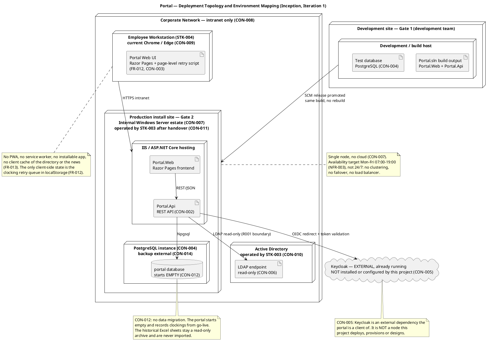
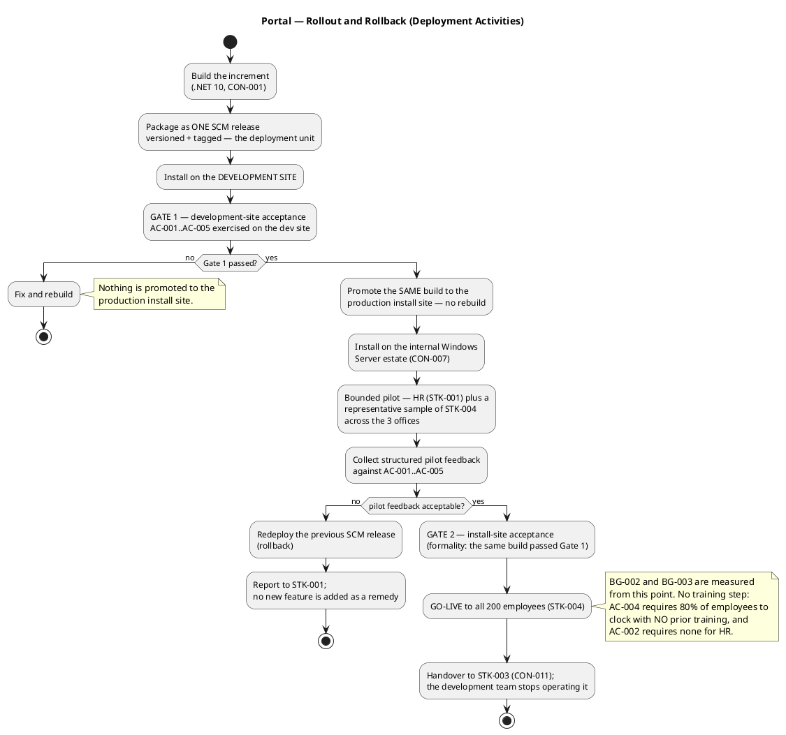
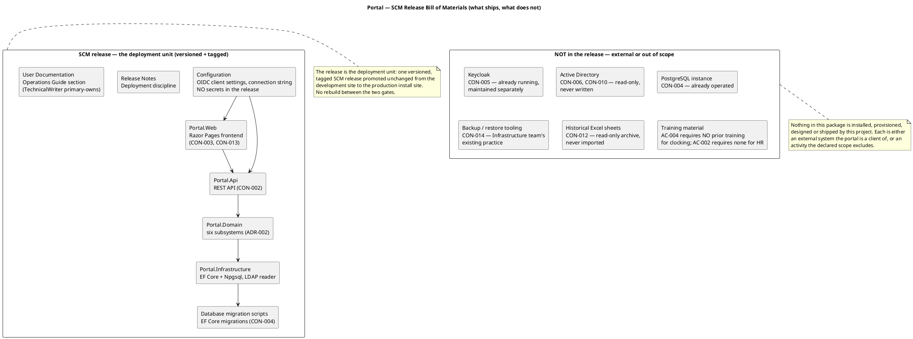

# Deployment Strategy — Portal (Employee Portal, Cuba Corp)

## Document Control

| Field | Value |
|---|---|
| Document | Deployment Strategy — Portal (Employee Portal, Cuba Corp) |
| Phase | Inception |
| Status | Draft — produced for review; milestone NOT YET ACHIEVED |
| Milestone Target | End-of-Inception (LCO) — not marked complete by this document |
| Iteration / Cycle | 1 / 1 |
| Owner | DeploymentManager |
| Date | 2026-09-18 |
| Revision | 2 — adds *Deployment Prerequisites* and *Pilot Feedback Programme* (revision 1 baselined at `69b672a`) |
| Detail level | Inception — **deployment strategy and topology sketch**. Per DC §5.1 the Release Notes enter in Transition; this document carries the strategy, the mode, the two acceptance gates, the rollout and rollback criteria, the pilot feedback programme and the bill of materials until then. |
| Governing process | Development Case (Inception) — **Deployment Model trigger NOT FIRED** (single internal Windows Server, no cloud, no external route); deployment is a section in the Software Architecture Document. **Architectural Proof-of-Concept trigger FIRED** on R001. |
| Deployment mode | **Custom-built** — see *Deployment Mode* |

**What this document is.** The deployment strategy for the Portal, seeded in Inception as the Development Case requires and executed in Transition. It states the deployment **mode**, the target user community, the target environments, the install-time prerequisites, the two acceptance gates, the rollout and rollback criteria, the pilot feedback programme and the bill of materials.

**Why this is a repository document and not an artifact.** The Deployment Plan is not an upsertable artifact in this project's artifact set, and the two artifacts that would carry the strategy are not available in Inception: the **Release Notes** enter at Transition (DC §5.1 — the artifact service rejects them in Inception), and the **Deployment Model** optional artifact has its trigger **NOT FIRED** (single node, no cloud, no multi-environment topology). The strategy is therefore baselined here, in the repository, and is folded into the Release Notes when they open in Transition.

**What this document is not.** It is not the deployment topology — that is the Deployment View of the Software Architecture Document. It is not a Bill of Materials document: the lock files in the repository are the BOM, and the inline summary below is the human-readable view of it.

## Deployment Mode

### Custom-built

The three deployment modes are custom-built, shrink-wrapped and downloadable. This project is **custom-built**, and the choice is forced by the declared constraints rather than preferred:

| Mode | Verdict | Basis |
|---|---|---|
| **Custom-built** | **SELECTED** | The product is a single internal web application for one organization, deployed onto that organization's own Windows Server estate (CON-007), reachable only from its own corporate network (CON-008), authenticating against its own Active Directory (CON-006) and its own Keycloak (CON-005). There is no distribution channel, no installer for third parties, and no user who installs anything. |
| Shrink-wrapped | Rejected | There is no packaged product for an unknown customer. The portal has exactly one deployment target and one operator (STK-003). |
| Downloadable | Rejected | CON-008 forbids access from outside the corporate network, so there is no download channel and no self-service installation. |

**Consequences of the mode, which bind every later deployment decision.** Because the mode is custom-built: there is no installer to build, no licence key, no version-upgrade path for third parties, and no end-user installation step. The deployment unit is an **SCM release** — one versioned, tagged build promoted unchanged from the development site to the production install site. The only installation actor is the Infrastructure team (STK-003), and the only installation event is the handover at the end of Transition (CON-011).

## Target User Community

| Community | Size | What they receive | Basis |
|---|---|---|---|
| STK-004 Cuba Corp Employees | 200 people, 3 offices | The clocking page, the news page and the directory, in the corporate browser | STK-004, CON-009 |
| STK-001 Laura Gómez (HR Director) and the HR function | The HR AD group | The HR-wide attendance view, the correction path, the monthly CSV export, news publishing and the worker-category management | STK-001, CON-016 |
| STK-003 Infrastructure team | The operator | The deployable .NET application, the handover, and the operations section of the User Documentation | STK-003, CON-011 |

**The user community is not trained, and that is a declared requirement, not an omission.** AC-004 requires 80% of employees to complete at least one clocking **with no prior training**, and AC-002 requires an HR Administrator to publish a news item **without technical assistance**. Training material is therefore **not** a deliverable of this release: the product must be self-evident, and the supplied design (CON-013) is what makes it so. This is recorded in the bill of materials below as an explicit exclusion rather than a gap.

## Target Environments

| Environment | Purpose | Basis |
|---|---|---|
| **Development site** | Where the increment is built, installed and exercised. **Gate 1** is held here. | Development Case; the two-gate rule |
| **Production install site** — internal Windows Server estate | Where the same build is installed and where **Gate 2** is held, followed by go-live. | CON-007, CON-011 |

**One production environment, and no staging environment is invented.** CON-007 fixes hosting to a single internal Windows Server with no cloud, and CON-008 forbids any external route. A staging environment would be a second environment the declared scope does not name, and the Development Case's Deployment Model trigger did not fire on multi-environment topology. The two-gate discipline below is what substitutes for it: the development site is the first gate, and the install site is the second.

## Deployment Prerequisites

What must be in place before each gate. Every prerequisite is either already satisfied or is provided by the party that owns the underlying system — none of them is a work item this project creates.

| # | Prerequisite | Provided by | Needed before | Basis |
|---|---|---|---|---|
| 1 | OIDC client credentials for the Keycloak client | Already with the development team | **Gate 1** | CON-005 — the client is already registered, so login is testable from day one |
| 2 | An Active Directory bind account with **read-only** rights, for the LDAP directory read | STK-003, as AD's operator | **Gate 1** | CON-006 (the directory is read directly from AD over LDAP), CON-010 (this project neither administers AD nor writes to it). The account is a prerequisite, not a scope item: the project needs read access, and AD's operator grants it |
| 3 | A PostgreSQL instance reachable from the build host | STK-003 | **Gate 1** | CON-004 |
| 4 | The supplied design at `docs/inputs/employee-portal-design.html` | Committed to the repository | Already present | CON-013 — mandatory and authoritative for the UI visual layer; not pending and needs no confirmation that it will arrive |
| 5 | Server access on the internal Windows Server estate | STK-003 | **Gate 2** | CON-007, CON-011 |
| 6 | A PostgreSQL instance reachable from the production server, with the portal database created empty | STK-003 | **Gate 2** | CON-004, CON-012 — the portal starts empty; there is no import step |
| 7 | A workstation in each of the 3 offices, to verify reachability | STK-003 | **Gate 2** | CON-008, CON-009 |
| 8 | Confirmation that the existing server-backup practice covers the production PostgreSQL instance in restorable form | STK-003 | Already confirmed in writing, with a verified restore test | CON-014 — no backup design, no backup tooling and no restore procedure is part of this project |

**No prerequisite is a Keycloak work item.** CON-005 forbids realm design, client provisioning scripts and Keycloak hosting, and the Development Case repeats it as a process rule binding the DeploymentManager. Prerequisite 1 is the *use* of an already-registered client, not the creation of one.

**No prerequisite is an Active Directory change.** Prerequisite 2 grants read access; it does not alter AD, its schema or its data (CON-010).

## Deployment Topology

The topology is owned by the Software Architecture Document's Deployment View (the Deployment Model optional artifact is **NOT FIRED**). It is reproduced here because the strategy must be operable without the reader opening the SAD.

**Nodes and connectors.**

| Node | Role | Operated by | Basis |
|---|---|---|---|
| Development / build host | Builds the increment and hosts the development-site installation | Development team | Development Case |
| Employee Workstation | Runs the corporate browser; holds the clocking retry queue in `localStorage` | STK-004 | CON-009, FR-012 |
| Internal Windows Server | Hosts the Razor Pages frontend, the REST API and the PostgreSQL instance | STK-003 after handover | CON-007, CON-011 |
| Active Directory | Supplies corporate attributes over LDAP, read-only | STK-003 | CON-006, CON-010 |
| Keycloak | OIDC provider — **external, not deployed, provisioned or designed by this project** | Maintained separately | CON-005 |

**Keycloak is drawn as an external cloud, never as a node this project installs.** CON-005 forbids Keycloak appearing in the deployment diagram as something we install, and the Development Case repeats it as a project-specific process rule binding the DeploymentManager. It appears here only because the portal is a client of it at the boundary.

## Deployment Constraints and Risks

| Constraint / risk | Effect on deployment | Basis |
|---|---|---|
| Single internal Windows Server, no cloud | One production node; no horizontal scaling, no load balancer, no container platform | CON-007 |
| Intranet only | No external route, no public DNS entry, no certificate from a public CA is required by the declared scope | CON-008 |
| Keycloak external and already running | **Zero Keycloak deployment work.** The OIDC client is already registered and its credentials are with the development team, so login is testable from day one | CON-005 |
| Active Directory read-only | The deployment writes nothing to AD; no AD schema change, no service account with write rights | CON-006, CON-010 |
| Backups already covered | **No backup design, no backup tooling, no restore procedure** in this project | CON-014 |
| No data migration | The portal starts empty; there is no import step, no cutover of historical data, and no reconciliation | CON-012 |
| Operations handed over | The development team hands over at the end of Transition and does not run the portal afterwards | CON-011 |
| **R001** — AD attribute completeness (exposure 9, High) | The directory's displayed fields depend on AD being populated across the 3 offices. The deployment cannot repair this: the portal holds no local copy (CON-020). Confronted in Elaboration by the Architectural Proof-of-Concept, **before** the directory mapping is designed | R001, SS-IF-02 |
| **R002** — digital clocking adoption (exposure 6, Significant) | The deployment's success criterion is adoption, not a clean install. Measured by BG-003 and AC-004 from go-live. The remedy is communication by HR, never a feature | R002, BG-003, AC-004 |
| **R005** — human gate queue time (exposure 4, Moderate) | Both acceptance gates and the go-live decision are stakeholder gates. Ceiling 14 days of queue time per the Development Case measurement policy; beyond it the process suspends and nothing is auto-filled | R005 |
| **R006** — mandatory design versus closed declared scope (exposure 4, Moderate) | If the supplied design depicts a screen the declared scope does not authorise, the declared scope wins and the divergence is a Change Request. It must be resolved in Elaboration, before implementation — not discovered at the install site | R006, CON-013 |

## What the User Community Receives

**This is an Inception strategy: no feature is released by this document.** The declared scope is a closed set of fourteen functional requirements across three use cases, and all three use cases are Must. What follows is the **deployment-relevant** view of that scope — expressed as use-case scenarios rather than as a technical component list, per the use-case-driven principle.

| Use case | Scenarios the user community receives | Declared source | Acceptance |
|---|---|---|---|
| **UC-001 Clocking** | Clock in / clock out with the button reflecting current status; own monthly history; HR-wide attendance view; HR correction or insertion (additive and audited); monthly CSV export; clocking retry after network loss | FR-001, FR-002, FR-003, FR-004, FR-012, FR-014 | AC-001, AC-004, AC-005 |
| **UC-002 News** | Publish a news item; read and filter by category; featured banner; edit a published item; unpublish (never delete) | FR-005, FR-006, FR-007, FR-008, FR-009 | AC-002 |
| **UC-003 Employee Directory** | Search by name, department or office; assign or clear a worker category; no-connection message | FR-010, FR-011, FR-013 | AC-003 |

**What the deployment must NOT ship, because the declared scope excludes it.** Each line is a declared exclusion and is binding on the release contents: no native mobile app; no push notifications; no payroll integration; no vacation or sick-leave management; no biometric clocking; **no Keycloak work of any kind**; no writing back to Active Directory and no employee-field editing anywhere; no local copy of the employee, no sync job, no reconciliation screen, no conflict resolution; no news archive screen; no hard delete of a news item; no offline mode beyond the clocking retry (no PWA, no service worker, no installable app, no client cache of the directory or the news); no permission model beyond the two levels; no rule that features a news item by itself; and **no in-portal audit view screen** (stakeholder decision, 2026-09-17 — the audit is written for compliance and read directly from the database).

**No feature is added by this document.** The declared scope is the ceiling. Nothing above is derived, and nothing is a recommendation.

## Upgrade and Compatibility Notes

### There is no upgrade path, and there is no migration

| Concern | Verdict | Basis |
|---|---|---|
| Data migration | **None.** The portal starts empty and records clockings from go-live onwards. The historical Excel sheets stay on the shared drive as a read-only archive and are never imported. | CON-012 |
| Cutover of historical data | **None.** There is no import step, no reconciliation and no back-fill. | CON-012 |
| Upgrade from a previous portal version | **None.** This is the first release; there is no predecessor to upgrade from. | Declared scope |
| Coexistence with Excel | **Deliberate and temporary.** BG-002 requires 100% of **new** clockings to be recorded outside Excel from go-live; the historical sheets remain readable. Excel is not switched off by this project. | BG-002, CON-012 |
| Rollback of a release | **Redeploy the previous SCM release.** Because the portal starts empty and holds no imported data, a rollback does not need a data-restore step for migrated content. | CON-012, CON-014 |

**The absence of migration is a deployment simplification, not a gap.** It removes the highest-risk deployment activity — a data cutover — from the plan entirely. It also means the go-live decision carries no data-integrity risk: the only data at risk is the clockings recorded since go-live, and those are covered by the Infrastructure team's existing backup practice (CON-014).

### Compatibility

| Dimension | Requirement | Basis |
|---|---|---|
| Browser | Current Chrome and Edge. No other browser is a target. | CON-009 |
| Client platform | Responsive web, no native app, no installable app, no service worker. | Declared scope |
| Network | Reachable only from the internal corporate network. No external route. | CON-008 |
| Server platform | The internal Windows Server estate the Infrastructure team already runs, as a .NET application. No cloud. | CON-007, CON-011 |
| Runtime | .NET 10 backend, Razor Pages frontend, REST API between them, PostgreSQL database. No additional runtime, framework or datastore is introduced. | CON-001, CON-002, CON-003, CON-004 |
| Identity | OIDC client of the already-running Keycloak. The client is already registered and its credentials are with the development team, so login is testable from day one. | CON-005 |
| Directory | Read-only LDAP against Active Directory. The deployment writes nothing to AD and requires no AD schema change. | CON-006, CON-010 |
| Timezone | All three offices are in Europe/Madrid. Clockings are stored in UTC and displayed in Europe/Madrid. There is no multi-timezone case. | CON-015 |
| Database version | PostgreSQL, target version **latest** (stakeholder decision, 2026-09-17). No version floor and no LTS-only rule. | CON-004; Development Case version policy D4 |

## Acceptance Gates

Two gates, with **distinct criteria**, and the second is a formality because the same build passed the first. This is the discipline that substitutes for the staging environment the declared scope does not provide.

| Gate | Site | Criteria | Who decides |
|---|---|---|---|
| **Gate 1 — development-site acceptance** | Development site | AC-001..AC-005 exercised against the real AD over LDAP, the real Keycloak OIDC client and a PostgreSQL instance. The clocking retry (AC-005) is exercised with the network actually interrupted. The CSV export is checked against the exact declared column set and order. | Development team, with STK-002 for engineering clarifications |
| **Gate 2 — install-site acceptance** | Production install site | The **same build** installed on the internal Windows Server estate, reachable from a workstation in each of the 3 offices, with login working against the production Keycloak client and the directory reading the production AD. A formality: no new functional criterion is introduced at Gate 2. | STK-003 (operator) and STK-001 (sponsor) |

**Why Gate 2 must be a formality.** If Gate 2 can fail on a functional criterion, then Gate 1 was not a real acceptance gate — it was a smoke test. The only things Gate 2 may legitimately discover are **environmental**: the production AD is not the development AD, the production Keycloak client differs, or the server estate lacks something the development host had. Those are installation defects, and they are fixed by re-installing, not by re-designing.

## Rollout and Rollback

**Rollout approach — bounded pilot, then go-live.** The pilot is bounded to HR (STK-001) plus a representative sample of STK-004 across the 3 offices. It is deliberately **not** a phased office-by-office rollout: the three offices share one AD, one Keycloak and one server, so a per-office phase would add coordination without reducing risk. The pilot's purpose is to exercise the two things that cannot be exercised on the development site — the production AD's attribute completeness (R001) and real employee behaviour on the clocking page (R002).

**Rollback criteria — the release is rolled back when any of these holds.**

| # | Rollback trigger | Basis |
|---|---|---|
| 1 | A clocking is lost or recorded with a wrong timestamp in a way the retry and idempotency mechanisms do not bound | AC-005, FR-012 |
| 2 | The directory cannot read AD from the production install site, or shows a field the Proof-of-Concept did not observe | R001, SS-IF-02 |
| 3 | Login fails against the production Keycloak client for a material share of users | CON-005 |
| 4 | The monthly CSV export does not match the declared column set and order | FR-014 |
| 5 | Two news items are simultaneously featured, or the banner shows an item HR did not flag | CON-018, R004 |
| 6 | A clocking correction overwrites or deletes the original record | CON-017 |

**Rollback mechanism.** Redeploy the previous SCM release. Because the portal starts empty and imports nothing (CON-012), rollback needs no data-restore step for migrated content; the clockings recorded since go-live are covered by the Infrastructure team's existing backup practice (CON-014). **Rollback is a deployment action, not a scope decision** — and if a rollback trigger fires, the remedy is a fix or a Change Request decided by STK-001, never a new feature added to the release.

**What is deliberately NOT a rollback trigger.** Low adoption (R002) is not a rollback trigger. It is measured by BG-003 and AC-004 over 3 months, and its remedy is communication by HR — the declared scope forbids every feature-shaped remedy (no push notifications, no reminders). Rolling back a working system because people have not yet changed their habit would be the wrong response to the right signal.

## Pilot Feedback Programme

Beta testing is a structured feedback mechanism, not a QA activity. Functional verification happens at **Gate 1**; the pilot exists to answer the questions the development site cannot answer.

**Participants.** HR (STK-001) plus a representative sample of STK-004 across the 3 offices. The sample is sized by STK-001 as the sponsor; no figure is asserted here, because the declared scope names none and inventing one would be a fabricated measurement.

**Feedback mechanism — deliberately outside the portal.** The declared scope forbids every in-portal feedback feature: no comments, no reactions, no push notifications, and no new screen. The mechanism is therefore:

1. **A short structured questionnaire**, administered by HR (STK-001) through the channel HR already uses for internal communication. Using the incumbent channel for the pilot is not a new feature and adds nothing to the release.
2. **A named triage point.** HR (STK-001) collects and triages; STK-002 answers engineering clarifications; the DeploymentManager records the outcome against the acceptance criteria.
3. **Three buckets, and only three.** Every reported item is classified as (a) a **defect against a declared requirement** — fixed; (b) an **environmental or installation defect** — re-installed; or (c) a **request for something the declared scope does not authorise** — raised as a Change Request decided by STK-001, never implemented silently. There is no fourth bucket, and in particular no "quick win" bucket.

**The questions the pilot must answer**, each mapped to a declared criterion:

| Question put to pilot participants | Answers | Criterion |
|---|---|---|
| Could you clock in and out without help from HR or the development team? | yes / no, and what you did | AC-001 |
| Did you need any instruction before your first clocking? | yes / no | AC-004 |
| How long did it take you to find a colleague's phone or email? | under 10 seconds / over | AC-003 |
| Could HR publish a news item without technical assistance? | yes / no | AC-002 |
| Was any clocking lost when the network dropped? | yes / no | AC-005 |
| For each directory entry you looked at, was any field empty? | which field, which office | R001 |
| Would you use the portal instead of Excel next time? | yes / no, and why not | R002, BG-002 |

**Success criteria for the pilot.** The pilot passes when: no rollback trigger has fired; AC-001, AC-002, AC-003 and AC-005 are met by the pilot participants; and the R001 field-emptiness observations are **recorded as measured data** rather than scored pass/fail — AD's completeness is not this project's to fix (CON-010), and a gap is reported to STK-003 as an AD data-quality issue.

**What the pilot is not.** It is not a QA activity — the functional verification happened at Gate 1. It is not a feature-request channel. And it is not a substitute for the 3-month adoption measurement (BG-003), which continues after go-live and is the only measure of R002.

## Known Issues and Limitations

| # | Known issue / limitation | Status | Basis |
|---|---|---|---|
| 1 | **The directory's completeness depends on AD, and the portal cannot repair it.** If job title or extension is unpopulated in AD for some employees, the directory shows the field empty. There is no local copy, no cache and no fallback value. | **Open — confronted in Elaboration** by the Architectural Proof-of-Concept, which reads the real AD attributes across the 3 offices and reports the measured population rate of each. The directory mapping is designed against observed data, not against the assumption that AD is complete. | R001, CON-020, CON-024, SS-IF-02 |
| 2 | **Adoption is not guaranteed by the deployment.** Some employees may keep using Excel out of habit. | **Open — confronted in Transition**, measured by BG-003 (80% of 200 employees within 3 months) and AC-004. The remedy is communication by HR (STK-001), never a feature. | R002, BG-003, AC-004 |
| 3 | **A wrong client clock writes a wrong record.** FR-012 requires the server to accept the timestamp the client sends, so a workstation with a wrong clock produces a wrong clocking that is not detectable from the record itself. | **Accepted and bounded by design** — the 5-minute retry window, the unique idempotency key, and the audited additive correction path (CON-017) bound the exposure. A wrong record is correctable without destroying the original. | R003, FR-012, CON-017 |
| 4 | **A clocking made while the network is down for more than 5 minutes is not captured by the portal.** | **By design.** Beyond 5 minutes the employee reports the clocking to HR, who inserts it under FR-004 — additive and audited. This is the declared behaviour, not a defect. | FR-012, AC-005, CON-017 |
| 5 | **A day with a clock-in and no clock-out produces a row with an empty `ClockOut` and an empty `HoursWorked`.** | **By design.** The row is never omitted, because omitting it would hide the incident from HR rather than report it. Resolving the missing clock-out is a manual HR task outside the portal. | FR-014, CON-022, FR-004; stakeholder decision 2026-09-17 |
| 6 | **The audit trail is not readable in the portal.** There is no audit view screen for HR or anyone else. | **By design.** The audit is written for compliance and read directly from the database by whoever needs it. | NFR-004, SS-AUD-07; stakeholder decision 2026-09-17 |
| 7 | **No staging environment exists.** Gate 2 is held on the production install site itself. | **Accepted.** CON-007 fixes hosting to a single internal Windows Server and CON-008 forbids any external route; a staging environment is not declared. The two-gate discipline is the substitute. | CON-007, CON-008 |
| 8 | **No 24/7 availability.** The declared target is Monday–Friday 07:00–19:00 with fault tolerance within the corporate network. | **By design.** 24/7 is explicitly not required, so no clustering, no failover and no load balancer is introduced. This is an availability target, not a curfew: a clocking made while the system is up is recorded whenever it is made. | NFR-003, SS-REL-01 |
| 9 | **The supplied design may depict a screen the declared scope does not authorise.** | **Open — confronted in Elaboration**, before implementation. The declared scope wins; a divergence is a Change Request decided by STK-001, never implemented silently and never resolved by dropping the design. | R006, CON-013 |
| 10 | **Both acceptance gates and the go-live decision are stakeholder gates.** | **Open — monitored every iteration.** Ceiling 14 days of human queue time per the Development Case measurement policy; beyond it the process suspends and nothing is auto-filled. | R005 |

**No issue above is a defect in the product.** Items 3–8 are declared behaviour that a reader might mistake for a defect, and they are recorded here so that a reviewer does not raise them as findings. Items 1, 2, 9 and 10 are genuine open risks, each with a named confrontation point and a named owner.

## Bill of Materials — What Ships

The lock files in the repository are the authoritative BOM. This is the human-readable summary of what the SCM release contains and, equally important, what it deliberately does not.

| BOM item | In the release? | Note |
|---|---|---|
| `Portal.Web` — Razor Pages frontend | **Yes** | Implements the supplied design's visual layer (CON-013) |
| `Portal.Api` — REST API | **Yes** | CON-002 |
| `Portal.Domain` — the six subsystems | **Yes** | ADR-002; holds the volatile decisions |
| `Portal.Infrastructure` — EF Core + Npgsql, LDAP reader | **Yes** | Adapters only |
| Database migration scripts | **Yes** | EF Core migrations against PostgreSQL (CON-004). The database starts empty (CON-012) |
| Configuration — OIDC client settings, connection string | **Yes** | **No secrets in the release.** Credentials are supplied at install time by the operator |
| Release Notes | **Yes** | Produced in Transition (DC §5.1); this strategy document is folded into it |
| User Documentation — Operations Guide section | **Yes** | TechnicalWriter primary-owns the artifact; the DeploymentManager contributes the operations section |
| Keycloak | **No** | CON-005 — already running, maintained separately. Zero Keycloak work of any kind |
| Active Directory | **No** | CON-006, CON-010 — read-only, never written, never administered |
| PostgreSQL instance | **No** | CON-004 — already operated by the Infrastructure team |
| Backup / restore tooling | **No** | CON-014 — the Infrastructure team's existing practice, confirmed in writing with a verified restore test |
| Historical Excel sheets | **No** | CON-012 — read-only archive, never imported |
| Training material | **No** | AC-004 requires 80% of employees to clock with **no prior training**; AC-002 requires none for HR. Training material would contradict the acceptance criteria rather than support them |
| Installer / licence key / upgrade path | **No** | Custom-built mode: there is no third-party installation and no predecessor version |

## Traceability

| Element | Traces From | Link Type | Traces To |
|---|---|---|---|
| Deployment Strategy | CON-007, CON-008 | Derives | Release Notes |
| Deployment Strategy | CON-011 | Derives | Release Notes |
| Deployment Strategy | CON-005, CON-006, CON-010 | Derives | Release Notes |
| Deployment Strategy | CON-012, CON-014 | Derives | Release Notes |
| Deployment Strategy | CON-001, CON-002, CON-003, CON-004, CON-009 | Derives | Release Notes |
| Deployment Strategy | CON-013, CON-015, CON-016, CON-017, CON-018, CON-019, CON-020, CON-021, CON-022, CON-023, CON-024 | Derives | Release Notes |
| Deployment Strategy | NFR-001, NFR-002, NFR-003, NFR-004 | Derives | Release Notes |
| Deployment Strategy | FR-001, FR-002, FR-003, FR-004, FR-012, FR-014 | Derives | Release Notes |
| Deployment Strategy | FR-005, FR-006, FR-007, FR-008, FR-009 | Derives | Release Notes |
| Deployment Strategy | FR-010, FR-011, FR-013 | Derives | Release Notes |
| Deployment Strategy | AC-001, AC-002, AC-003, AC-004, AC-005 | Derives | Release Notes |
| Deployment Strategy | BG-002, BG-003 | Derives | Release Notes |
| Deployment Strategy | R001, R002, R003, R004, R005, R006 | Derives | Release Notes |
| Deployment Strategy | STK-001, STK-003, STK-004 | Derives | Release Notes |
| Deployment Strategy | Software Architecture Document (Deployment View) | DependsOn | Release Notes |
| Deployment Strategy | UC-001, UC-002, UC-003 | Derives | Release Notes |

**Coverage.** All 24 declared constraints, all 4 declared NFRs, all 14 declared FRs, all 5 acceptance criteria, the 2 business goals that bear on deployment (BG-002, BG-003), all 6 risks and all 3 deployment-relevant stakeholders are placed in this document. The deployment topology is consumed from the Software Architecture Document's Deployment View rather than restated as a competing source, because the Development Case did **not** fire the Deployment Model trigger.

**No open question remains in this document.** The three FR-014 export-contract cells and the audit-view question were answered by the stakeholder on 2026-09-17 and are recorded as decisions, not as pending markers. No `[SCOPE_QUESTION]`, no `[DERIVED]` and no `[ASSUMPTION]` is carried here.
