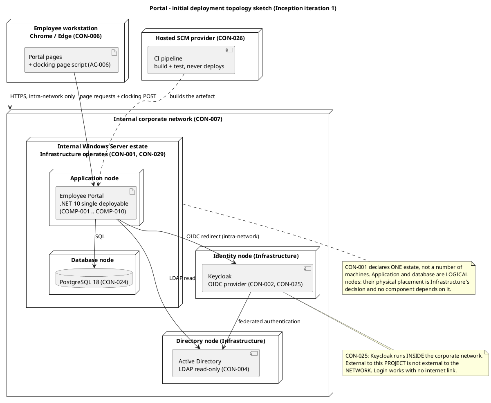
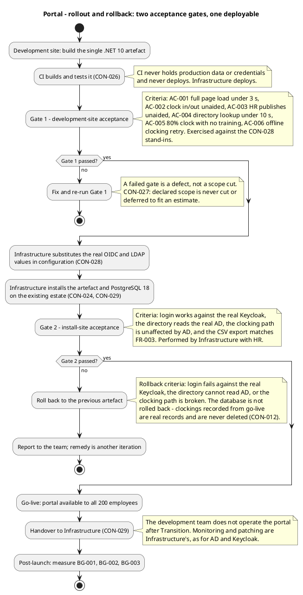

# Portal — Deployment Strategy (Inception iteration 1)

**Phase:** Inception | **Status:** Draft — iteration 1, not yet reviewed | **Milestone Target:** Lifecycle Objectives (LCO) — end of Inception. NOT YET ACHIEVED.

This document is the deployment strategy baseline. It fixes the deployment mode, the target user
community, the environments, the topology sketch, the rollout approach and the rollback criteria.
It is deliberately shallow: Inception selects the mode and sketches the topology. Detailed
installation procedures, the beta programme schedule and the release notes are Transition work.

## 1. Deployment mode

**Mode: Custom-built, internally deployed.**

| Mode | Verdict | Basis |
|---|---|---|
| Custom-built | **SELECTED** | The portal is built for Cuba Corp's declared scope (FR-001..FR-009) and deployed by the Infrastructure team onto the estate they already operate (CON-001, CON-029). There is no external customer, no distribution channel and no installer to package for a third party |
| Shrink-wrapped | Rejected | No product is sold or distributed. The 200 users are employees of the same organisation that owns the system (STK-004) |
| Downloadable | Rejected | The portal is reachable only from the internal corporate network (CON-007). There is nothing to download and no public distribution |

**Consequence for packaging.** The deployment unit is a single .NET 10 artefact (CON-001, CON-022)
plus one PostgreSQL 18 instance (CON-024). There is no installer, no licence key, no auto-update
mechanism and no version-check service. Infrastructure installs the artefact and substitutes the
real configuration values (CON-028, CON-029).

**Consequence for the deployment unit's identity.** The artefact is packaged as an SCM release —
versioned, tagged and traceable — so that what Infrastructure installs is identifiable and so that
a rollback has a named target to return to.

## 2. Target user community

| Community | Size | What they do with the portal | Source |
|---|---|---|---|
| Cuba Corp employees | 200 people, 3 offices | Clock in/out, read news, search the directory | STK-004, FR-001, FR-004, FR-008 |
| HR Administrators | Members of the HR AD group | Publish, edit and unpublish news; correct or insert clockings; export the monthly CSV; assign or clear worker categories | STK-001, NFR-005, FR-002, FR-003, FR-005, FR-006, FR-007, FR-009 |
| Infrastructure team | STK-003 | Operates the portal in production after handover — deployment, monitoring, patching | CON-029 |

**The two-level authorization model is the whole model** (NFR-005): HR AD group membership decides
whether a user is an HR Administrator; everyone else is an employee. There is no role matrix, no
permission administration screen and no per-category rule (CON-013).

**No training programme is planned for the employee population.** AC-005 requires 80% of employees
to complete at least one clocking with no prior training, and AC-002 requires clocking without help
from HR or the development team. The committed design (CON-031) is the interface they meet.

## 3. Environments

| Environment | Where | Purpose | Data | Source |
|---|---|---|---|---|
| Development and test | The team's environment, against stand-ins | Build and test every use case | Stand-in OIDC issuer and stand-in directory carrying the declared attributes, including entries with empty job title and extension. No production data | CON-028 |
| CI | Hosted SCM provider | Build and test the artefact | No production data, no credentials, no deployment | CON-026 |
| Production | The internal Windows Server estate | The live portal | Real Keycloak and real AD values substituted by Infrastructure at deployment | CON-001, CON-024, CON-028, CON-029 |

**There is no staging environment, and none is introduced.** The stakeholder declared one estate
(CON-001) and one PostgreSQL instance on it (CON-024); it did not declare a staging tier, and the
scope does not justify one. The two acceptance gates below are what stand in its place.

**The stand-in environment is the project's principal process control** (CON-028). The team never
works against the real Keycloak or the real Active Directory. The OIDC client and the LDAP
connection are configured with placeholder values — issuer, client id, client secret, LDAP host,
bind account, base DN — held in configuration and never in code. Infrastructure substitutes the real
values at deployment.

## 4. Topology sketch

One .NET 10 application and one PostgreSQL 18 instance, both on the internal Windows Server estate
Infrastructure already operates. Keycloak and Active Directory are existing corporate systems on the
same internal network that this project neither deploys nor operates.

**The physical placement of the application and the database within the estate is Infrastructure's
decision, not this project's.** CON-001 declares one estate, not a number of machines. The diagram
below shows the application and the database as logical nodes inside the estate, not as a claim
about the number of physical servers. Nothing in the architecture depends on the answer.

**CON-025 is load-bearing.** Keycloak runs inside the corporate network. External to this *project*
is not the same as external to the *network*: the OIDC redirect is an intra-network call, nothing
about login crosses the corporate boundary, and login keeps working with no internet link. A
topology that placed Keycloak in a cloud node would contradict CON-025 and be wrong.

### Nodes and connectors

| Node | Operated by | Hosts | Source |
|---|---|---|---|
| Employee workstation | The employee | A current Chrome or Edge browser; the clocking page's localStorage retry | CON-006, AC-006 |
| Application node (logical, in the estate) | Infrastructure (STK-003) | The single .NET 10 deployable — COMP-001..COMP-010 | CON-001, CON-029 |
| Database node (logical, in the estate) | Infrastructure (STK-003) | PostgreSQL 18 | CON-024, CON-032 |
| Identity node | Infrastructure (STK-003) | Keycloak, inside the corporate network | CON-002, CON-025 |
| Directory node | Infrastructure (STK-003) | Active Directory, read-only to the portal | CON-004, CON-005 |
| Hosted SCM provider | The provider | The CI pipeline — build and test only | CON-026 |

| Connector | Protocol | Crosses the corporate boundary? | Source |
|---|---|---|---|
| Browser to application | HTTPS | No — internal network only | CON-007 |
| Application to PostgreSQL | SQL | No | CON-024 |
| Application to Keycloak | OIDC redirect over HTTPS | **No** — Keycloak is inside the corporate network | CON-025 |
| Application to Active Directory | LDAP, read-only | No | CON-005 |
| Keycloak to Active Directory | Federated authentication | No | CON-002 |
| CI to application artefact | Build and test only | The CI service is outside the runtime boundary; it never deploys and never holds production data or credentials | CON-026 |

## 5. Rollout approach

**Approach: single-step go-live to the whole population, gated by two acceptance gates.**

There is no phased rollout by office and no pilot group. The declared scope gives no basis for one:
the three offices are in the same timezone (CON-008), on the same internal network (CON-007), and
the portal starts empty with no data migration (CON-030). A phased rollout would add coordination
cost for Infrastructure with no requirement behind it.

**The two gates are distinct and both are mandatory.**

| Gate | Where | Who performs it | Criteria |
|---|---|---|---|
| Gate 1 — development-site acceptance | The team's environment, against the CON-028 stand-ins | The team, with the Test discipline | AC-001 full page load under 3 s; AC-002 clock in/out unaided; AC-003 HR publishes unaided; AC-004 directory lookup under 10 s; AC-005 80% clock with no training; AC-006 offline clocking retry |
| Gate 2 — install-site acceptance | The production estate, with the real Keycloak and real AD | Infrastructure with HR (CON-028) | Login works against the real Keycloak; the directory reads the real AD; the clocking path is unaffected by AD; the CSV export matches the FR-003 contract |

**Gate 2 must be a formality.** Its purpose is to confirm that the real configuration values
behave as the stand-ins did, not to discover defects. Anything Gate 2 discovers that Gate 1 could
have caught is a defect in Gate 1, not a finding of Gate 2.

**The human validation of the real Keycloak and real AD is not team work to plan** (CON-028). It is
performed by Infrastructure with HR, its feedback must reach the team before Elaboration closes,
and if it delays a milestone the remedy is another iteration (CON-021).

## 6. Rollback criteria

Rollback returns the application artefact to the previous release. It is triggered by any of:

| Trigger | Why it is a rollback and not a fix-forward |
|---|---|
| Login fails against the real Keycloak | No use case is reachable without a session. The failure is in the configuration Infrastructure substituted, not in the artefact |
| The directory cannot read the real Active Directory | The six read-only fields (CON-005) are unavailable, so UC-008 and the FullName column of the CSV fail |
| The clocking path is broken | BG-002 and BG-003 depend on it, and it is the one path that must never be lost |

**The database is never rolled back.** Clockings recorded from go-live onwards are real records of
real working time. CON-012 states the original record is never overwritten in place and never
deleted, and CON-017 states news is never deleted. A rollback of the application artefact therefore
leaves the schema and its data in place; the schema is additive and the previous artefact tolerates
it.

**There is no data migration to reverse** (CON-030). The portal starts empty and the historical
Excel sheets stay on the shared drive as a read-only archive. A rollback has no data consequence
beyond the records written since go-live, which are kept.

**Backups are not part of this project** (CON-032). Infrastructure's existing server-backup practice
already covers this PostgreSQL instance in restorable form, confirmed in writing with a verified
restore test. No backup design, tooling or restore procedure is produced here.

## 7. Packaging and the bill of materials

The deployment unit is an SCM release: a tagged, versioned, traceable artefact. The bill of
materials is the repository's lock files, not a separate document.

| Deliverable | Form | Owner | Source |
|---|---|---|---|
| The portal application | One .NET 10 artefact, tagged as an SCM release | Implementer, Integrator | CON-001, CON-022 |
| PostgreSQL 18 | Installed by Infrastructure on the existing estate | Infrastructure (STK-003) | CON-024 |
| Configuration values | Placeholder values in configuration, never in code; real values substituted at deployment | Infrastructure (STK-003) | CON-028 |
| Release Notes | Per release, for handover to Infrastructure | DeploymentManager | CON-029 |
| User Documentation | Employee-facing guidance for clocking, news and directory; HR-facing guidance for publishing, correcting and exporting | TechnicalWriter | Development Case |
| The authoritative UI design | `docs/inputs/employee-portal-design.html`, already committed | UserInterfaceDesigner consumes | CON-031 |

**No installer, no licence key, no auto-update mechanism and no version-check service is produced.**
The custom-built mode selected in section 1 has no use for any of them.

## 8. Beta programme

**No external beta programme is planned.** The declared scope has no external user community: the
200 users are employees of the organisation that owns the system (STK-004), and the portal is
reachable only from the internal network (CON-007).

What stands in its place is the two-gate acceptance above, plus the CON-028 human validation of the
real Keycloak and real AD by Infrastructure with HR. That validation is the structured feedback
mechanism for this project, and its feedback must reach the team before Elaboration closes.

**Adoption is measured after go-live, not before.** BG-003 requires 80% of the 200 employees to be
actively using the portal within 3 months of launch. R003 records the risk that employees keep
using Excel out of habit; the mechanism is HR's communication, and it is accepted in advance under
CON-021.

## 9. Constraints and risks bearing on deployment

| Item | Effect on deployment | Source |
|---|---|---|
| Keycloak and AD are operated by Infrastructure, not this project | The portal is an OIDC client and an LDAP reader. Neither is deployed, configured or hosted by the team | CON-002, CON-004, CON-025 |
| The OIDC client is already registered and its credentials are with the development team | Login is testable from day one. There is no request to raise, no queue to wait on and no gate | CON-003 |
| CI never deploys | Infrastructure deploys. The pipeline builds and tests only, and never holds production data or credentials | CON-026, CON-029 |
| The team hands over at the end of Transition | The development team does not operate the portal afterwards. Monitoring and patching are Infrastructure's | CON-029 |
| No data migration | The portal starts empty. The historical Excel sheets stay on the shared drive as a read-only archive and are not imported | CON-030 |
| Backups are Infrastructure's existing practice | No backup design, tooling or restore procedure is part of this project | CON-032 |
| R001 — a change on Infrastructure's side breaks the portal | Accepted in advance under CON-021. The dependency is confined to two configuration-held boundaries, so a change on their side cannot break development | R001, CON-021 |
| R002 — LDAP attributes inconsistently filled across the 3 offices | The stand-in directory carries entries with empty job title and extension, so the behaviour is exercised before the real AD is validated | R002, CON-028 |
| R005 — the human validation gate does not return before Elaboration closes | Accepted in advance under CON-021. Every use case is built and tested against the stand-ins, so the team's work does not wait on it | R005, CON-021, CON-028 |

## 10. What this document does not yet contain

Inception selects the mode and sketches the topology. The following are Transition work and are
deliberately absent here:

- Detailed installation and configuration procedures for Infrastructure
- The release notes for each release
- The final bill of materials for a specific release
- The measured acceptance verdict against AC-001..AC-006
- Lessons learned

## Traceability

| Element | Traces From | Link Type | Traces To |
|---|---|---|---|
| Deployment mode: custom-built, internally deployed | CON-001, CON-007, CON-029 | Refines | Software Architecture Document |
| Target user community | STK-001, STK-003, STK-004, NFR-005 | Refines | User Documentation |
| Environment mapping | CON-026, CON-028, CON-029 | Refines | Software Architecture Document |
| Topology sketch | CON-001, CON-002, CON-004, CON-007, CON-024, CON-025 | Refines | Software Architecture Document |
| Rollout approach and two acceptance gates | AC-001, AC-002, AC-003, AC-004, AC-005, AC-006, CON-028 | Refines | Release Notes |
| Rollback criteria | CON-012, CON-017, CON-030, CON-032 | Refines | Release Notes |
| Packaging and bill of materials | CON-001, CON-022, CON-024, CON-031 | Refines | Release Notes |
| Beta programme (none; CON-028 validation in its place) | STK-004, CON-007, CON-028, BG-003, R003 | Refines | Release Notes |
| Deployment constraints and risks | R001, R002, R005, CON-021, CON-029 | Refines | Risk List |
