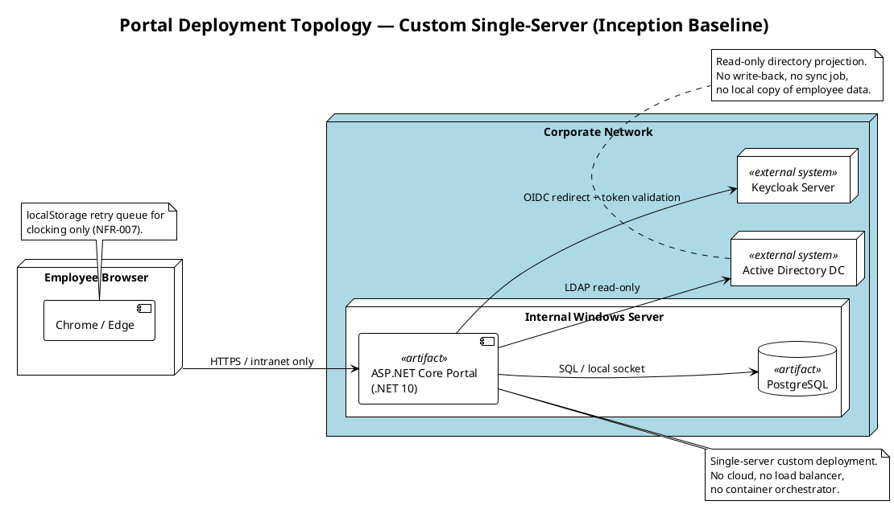

# Deployment Strategy — Portal (Employee Portal)

**Project:** Portal  
**Phase:** Inception  
**Iteration:** 2  
**Deployment Mode:** Custom-built, single-server, internal Windows Server  
**Target Community:** Cuba Corp employees (200 users, 3 offices) and HR Administrators (AD "HR" group members).

## Deployment Topology Sketch

## Deployment Mode Rationale

- **Custom-built** (CON-007): the portal is built for Cuba Corp's internal Windows Server estate and handed over to the Infrastructure team.
- **Single-server**: declared scope (200 employees, low data volume) does not justify multi-node topology; the optional Deployment Model trigger is therefore not fired.
- **No cloud / no container orchestration**: explicit constraint (CON-007, CON-008).
- **External systems maintained by Infrastructure**: Keycloak and AD are pre-existing and out of project scope (CON-004, CON-006, CON-011).

## Target Environments

| Environment | Purpose | Owner | Notes |
|---|---|---|---|
| Development | Local / team development | Development team | Containerized PostgreSQL allowed for dev; not a deployment target. |
| Staging | Pre-production smoke tests on Windows Server-like target | Infrastructure team (STK-003) | Must be available early in Construction (R006 mitigation). |
| Production | Live intranet portal for all 200 employees | Infrastructure team (STK-003) | Same Windows Server estate as AD/Keycloak; no external access. |

## Rollout Approach (Draft — to be detailed in Transition)

1. **Beta / Pilot:** HR Administrators (AD "HR" group) use the portal in Staging during late Construction to validate news, clocking oversight, and CSV export.
2. **Soft Launch:** One office or a volunteer group uses clocking and directory for a short period before company-wide release.
3. **General Availability:** All employees switch from Excel to the portal; HR retires Excel for new clockings (BG-002).

## Two-Gate Acceptance

- **Development-site gate:** Build, unit tests, integration tests, and deployment smoke test pass in Staging.
- **Install-site gate:** Infrastructure team deploys to Production and verifies end-to-end login, a clocking round-trip, a directory search, and a news publish/unpublish cycle.

## Rollback Criteria

- Rollback is triggered if the install-site gate fails on any critical acceptance path (login, clocking, directory, news).
- Rollback unit: the previous deployment package (binaries + database migration baseline).
- Data integrity: no rollback that would lose already-recorded clockings or audit entries; forward-fix preferred over data rollback.

## Risks and Constraints

- R001: AD LDAP attribute gaps may affect directory quality.
- R002: Employee adoption depends on communication; no technical mitigation.
- R006: Windows Server + PostgreSQL deployment mismatch; mitigated by early Staging environment.
- CON-013: Handover to Infrastructure team at end of Transition.
- CON-016: Backup is covered by existing Infrastructure practice; no backup design in this project.

## Bill of Materials (Inline Summary)

| Item | Source | Responsibility |
|---|---|---|
| .NET 10 ASP.NET Core portal application | This project | Development team builds; Infrastructure deploys. |
| PostgreSQL database | CON-003 | Infrastructure team operates; existing backup practice covers it. |
| Keycloak OIDC provider | Pre-existing corporate service | Infrastructure team maintains; portal is client only. |
| Active Directory | Pre-existing corporate service | Infrastructure team maintains; read-only LDAP. |
| Chrome / Edge browser | End-user device | Employees use current Chrome/Edge (CON-009). |

## Open Items for Elaboration / Construction

- Exact Staging server name and credentials (STK-003).
- IIS / Windows Service hosting decision for the ASP.NET Core application.
- Database migration strategy and rollback scripts.
- Deployment package format (zip / MSI / folder copy).
