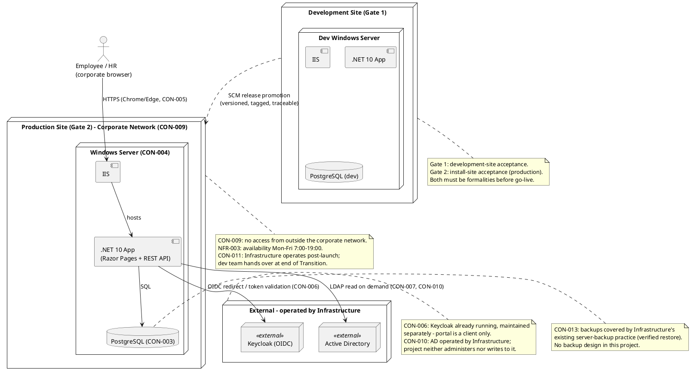

# Deployment Strategy — Employee Portal

## Document Control

| Field | Value |
|---|---|
| Phase | Inception |
| Status | Draft (awaiting review) |
| Milestone Target | End-of-Inception (Lifecycle Objectives) — NOT YET ACHIEVED |
| Project | Portal |
| Owner | DeploymentManager |

## Deployment Mode

**Custom-built.** The Employee Portal is an internal web application built for Cuba Corp and deployed onto Infrastructure's internal Windows Server (CON-004). It is neither shrink-wrapped (no installer for arbitrary customers) nor downloadable (no public distribution channel — CON-009 forbids access from outside the corporate network).

Consequences of the custom-built mode:
- The deployment unit is an **SCM release** — versioned, tagged, and traceable to the source that produced it.
- Installation is performed by the Infrastructure team (CON-011), not by end users.
- No licensing, no activation, no public packaging. The only "customer" is Cuba Corp's own Infrastructure team.

## Target User Community and Environments

**User community:** 200 Cuba Corp employees across 3 offices (STK-004) plus HR administrators (STK-001), all on the corporate network, using Chrome/Edge (CON-005).

**Environments** (two, both internal):

| Environment | Purpose | Operator |
|---|---|---|
| Development site | Gate 1 acceptance — dev team verifies the release before handover | Development team |
| Production site (corporate network) | Gate 2 acceptance — install-site verification; the live system | Infrastructure team (CON-011) |

There is **no staging/QA environment** declared in scope. The two-gate acceptance model (development site first, then install site) is the acceptance path; both gates must be formalities before go-live.

## Deployment Topology

**Topology summary:** single-node deployment. One Windows Server hosts IIS + the .NET 10 app, with PostgreSQL co-located (or on a co-located DB node — resolved in Elaboration). Keycloak and AD are external, operated by Infrastructure (CON-006, CON-010). No cloud, no multi-node topology, no load balancing (200 users, NFR-003 availability window). The Deployment Model optional artifact is **not triggered** (single-node, single-environment) — deployment detail lives in the SAD Deployment View.

## Rollout Approach

1. **Build & package** — each iteration produces a deployable increment; the final product is packaged as an SCM release (versioned, tagged, traceable).
2. **Gate 1 — development site.** The dev team deploys the release to the development site and verifies it against the acceptance criteria (AC-001…AC-005). This gate must pass before any production activity.
3. **Beta / pilot** (Transition) — a structured beta with a subset of employees validates adoption (R002, BG-003) and surfaces real-world issues before full rollout. Feedback flows through a defined pipeline, not ad hoc.
4. **Gate 2 — install site.** Infrastructure installs the release on the production Windows Server. Final site tests are formalities — the system was already proven at Gate 1.
5. **Handover** — at end of Transition, the development team hands over to Infrastructure (CON-011), who operate the portal exactly as they operate AD and Keycloak.

**No data migration** (CON-012): the portal starts empty and records clockings from go-live onward. Historical Excel sheets remain read-only archive on the shared drive.

## Rollback Criteria

Because there is **no data migration** (CON-012) and the portal's own data is minimal (CON-007 — only `AD user id → worker category` plus clocking/news/audit records), rollback is low-cost and low-risk:

- **Rollback trigger:** any Gate 2 install-site test that is not a formality — i.e., a defect that blocks an acceptance criterion (AC-001…AC-005) or violates a business-rule invariant (CON-015, CON-019, CON-020).
- **Rollback action:** redeploy the previous SCM release (the prior versioned, tagged release). No data reconciliation is required because no migration occurred and clocking/news records are append-only (never overwritten in place — CON-019, CON-020).
- **Rollback decision authority:** the Infrastructure team (production operator, CON-011) in coordination with the development team during Transition; Infrastructure alone post-handover.
- **No rollback of external systems:** Keycloak and AD are never touched by this project (CON-006, CON-010) — rollback scope is the portal application and its PostgreSQL data only.

## Deployment Constraints and Risks

| Constraint | Deployment consequence |
|---|---|
| CON-004 | Internal Windows Server (IIS) hosting — no cloud |
| CON-009 | No access from outside the corporate network — no public distribution |
| CON-011 | Infrastructure operates post-launch; dev team hands over at end of Transition |
| CON-006 / CON-010 | Keycloak and AD are external, operated by Infrastructure — never deployed/provisioned here |
| CON-013 | Backups are Infrastructure's existing practice — no backup design in this project |
| CON-012 | No data migration — portal starts empty |

**Risks affecting deployment:**
- **R001** (AD attribute gaps) — surfaces at Gate 1/2 via UC-008; validated early in Elaboration.
- **R002** (Excel habit / adoption) — mitigated by the beta program and training/support material (BG-003, AC-004).

## Traceability

| Element | Traces From | Link Type | Traces To |
|---|---|---|---|
| Custom-built deployment mode | CON-004, CON-009, CON-011 | DependsOn | SCM release (Transition) |
| Two-gate acceptance | AC-001…AC-005 | DependsOn | Development site, Production site |
| Single-node topology | CON-004, NFR-003 | DependsOn | SAD Deployment View |
| Rollback (redeploy prior release) | CON-012, CON-019, CON-020 | DependsOn | SCM release history |
| Beta program | R002, BG-003, AC-004 | DependsOn | Transition plan |
| Handover to Infrastructure | CON-011 | DependsOn | End of Transition |
