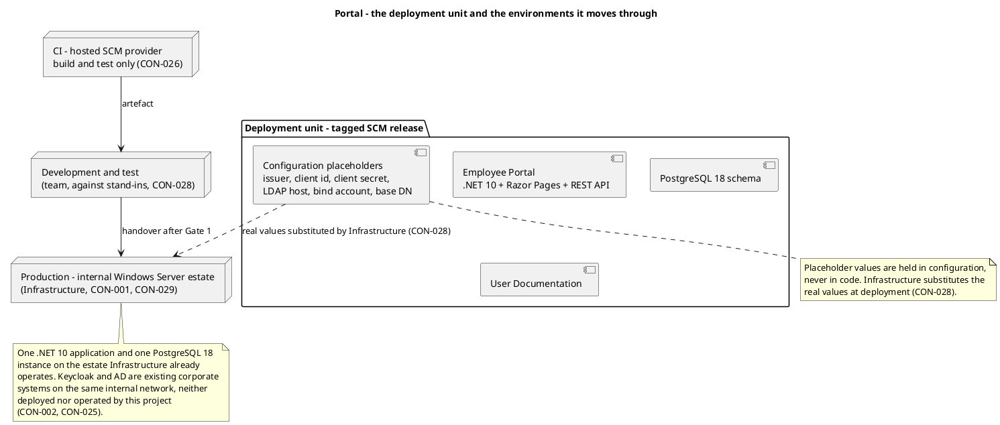
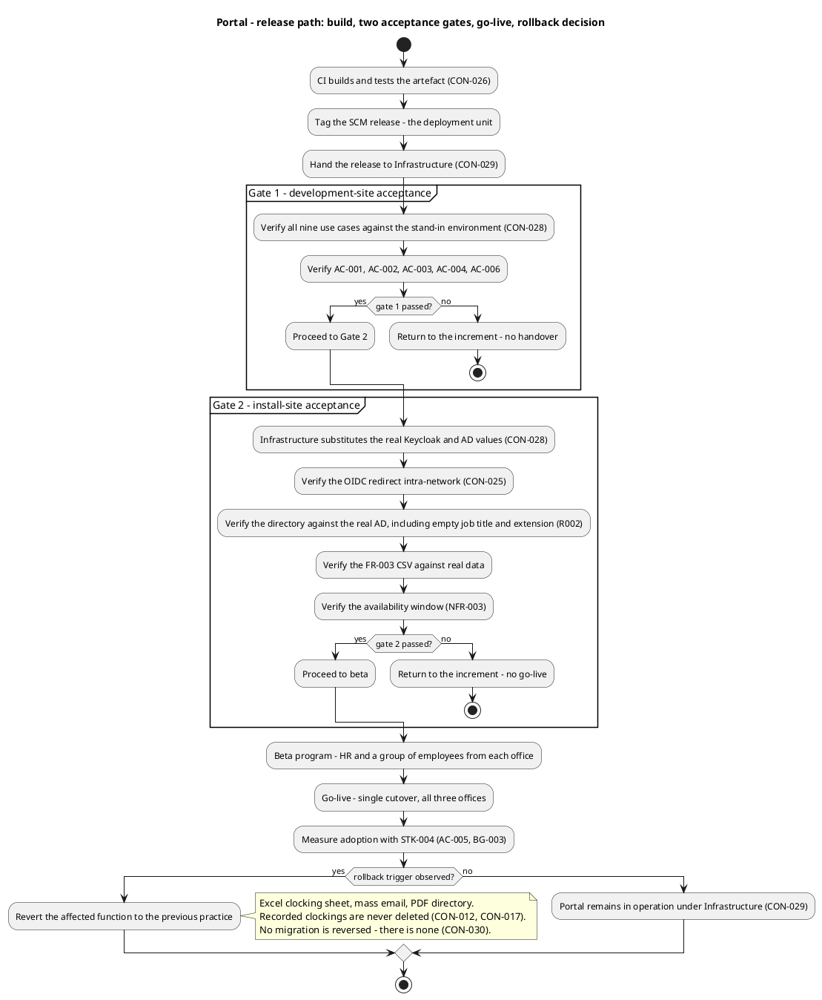
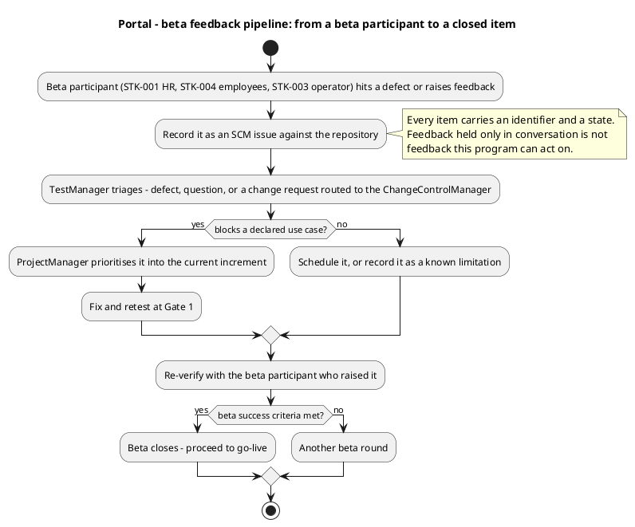

# Portal — Deployment Strategy

**Phase:** Inception | **Iteration:** 2 | **Status:** Draft — not yet reviewed
**Milestone Target:** Lifecycle Objectives (LCO) — end of Inception. NOT YET ACHIEVED.

This is the deployment strategy baseline. It is held in the repository, not as a RUP artifact: the
Development Case records the Deployment Model optional artifact as NOT FIRED (single-node topology,
deployment is a section of the Software Architecture Document), and Release Notes enter at Transition
per DC §5.1. This file is the Inception record of the strategy; the Release Notes will operationalise
it from Transition onwards.

## 1. Deployment mode

**Custom-built internal web application.** Not shrink-wrapped, not downloadable. The portal is a single
.NET 10 deployable (CON-022, CON-023) with one PostgreSQL 18 instance (CON-024), built for one
organisation, reachable only from the internal corporate network (CON-007), and operated by the
Infrastructure team that already runs the estate (CON-001, CON-029).

Every packaging, distribution and installation decision below follows from that mode: there is no
installer to ship to the public, no licence mechanism, and no self-service download.

## 2. Target user community

| Community | Who | What they receive | Source |
|---|---|---|---|
| End users | `STK-004` — 200 employees across 3 offices | Clock in/out, read news, search the directory, from a current Chrome or Edge browser | CON-006 |
| HR administrators | `STK-001` — HR Director and the HR group | Publish, edit and unpublish news; correct or insert clockings; export the monthly CSV; assign or clear a worker category | NFR-005 |
| Operator | `STK-003` — Infrastructure Team | The release to deploy, monitor and patch; the configuration values to substitute | CON-029 |

`STK-002` is not a user of the portal: he clarifies engineering doubts for the technical roles and
receives no deployment.

## 3. Target environments

| Environment | Where | Purpose | Data | Source |
|---|---|---|---|---|
| Development and test | The team's environment, against stand-ins | Build and test every use case | Stand-in OIDC issuer and stand-in directory carrying the declared attributes, including entries with empty job title and extension. No production data | CON-028 |
| CI | Hosted SCM provider | Build and test the artefact | No production data, no credentials, no deployment | CON-026 |
| Production | The internal Windows Server estate | The live portal | Real Keycloak and real AD values substituted by Infrastructure at deployment | CON-001, CON-024, CON-028, CON-029 |

No staging environment is introduced. The declared topology is one estate (CON-001) and one PostgreSQL
instance on it (CON-024); the physical placement of the application and the database within the estate
is Infrastructure's decision, and no component depends on the answer. The Software Architecture
Document's Deployment View is the authority for the topology; this strategy operationalises it.

## 4. Deployment topology

**CON-025 is load-bearing.** Keycloak runs INSIDE the corporate network. External to this *project* is
not the same as external to the *network*: the OIDC redirect is an intra-network call, nothing about
login crosses the corporate boundary, and login keeps working with no internet link. A deployment view
that placed Keycloak in a cloud node would contradict CON-025 and be wrong.

## 5. The deployment unit

The deployment unit is a **tagged SCM release** (CON-026): the artefact the CI pipeline builds and
tests, tagged in the repository, handed to Infrastructure. It is versioned and traceable to the commit
it was built from. CI never deploys — Infrastructure does (CON-026, CON-029).

## 6. Release path and the two acceptance gates

Both gates are formalities by design: each verifies a state that earlier work has already established,
and neither is the first time the system is exercised.

| Gate | Where | Who runs it | What it verifies | Failure consequence |
|---|---|---|---|---|
| Gate 1 — development-site acceptance | The team's environment, against the stand-ins | TestManager with the team | All nine use cases against the stand-in OIDC issuer and stand-in directory; `AC-001`, `AC-002`, `AC-003`, `AC-004`, `AC-006` | The increment is not handed over. No release is tagged for handover |
| Gate 2 — install-site acceptance | Production, on the estate | Infrastructure with HR | The real Keycloak and real AD values substituted; the OIDC redirect intra-network (CON-025); the directory against the real AD including empty job title and extension (R002); the `FR-003` CSV against real data; the availability window (NFR-003) | No go-live. The portal is not opened to employees |

`AC-005` is not a gate criterion. It is an adoption measure taken with `STK-004` after go-live, and no
test the team runs can close it.

## 7. Rollout approach

**Single cutover, all three offices at once.** There is no phased rollout, no pilot office and no
parallel running, and the reason is the declared scope: the portal starts empty and records clockings
from go-live onwards (CON-030), so there is no data to migrate, no reconciliation between an old and a
new record of truth, and no state that a phased rollout would protect. All three offices are in one
timezone (CON-008) and reach the same estate over the same internal network (CON-007), so there is no
per-office variation to stage.

The rollout sequence is: Gate 1 → handover to Infrastructure → Gate 2 → beta → go-live → adoption
measurement. The beta program sits between Gate 2 and go-live, not before it: beta participants use the
production configuration, which is the only configuration in which the real AD's data quality (R002) is
observable.

## 8. Beta program

| Element | Definition |
|---|---|
| Participants | `STK-001` (HR, the sponsor) and a group of `STK-004` employees drawn from each of the three offices, so that the AD attribute gaps R002 predicts are exercised across offices rather than in one |
| Duration | Bounded by the beta success criteria below, not by a calendar span. No duration is stated because none has been measured |
| Feedback mechanism | Every item is recorded as an SCM issue against the repository, with an identifier and a state. Feedback held only in conversation is not feedback this program can act on |
| Success criteria | (1) Every one of the nine use cases has been exercised by a beta participant in the production configuration. (2) No open item blocks a declared use case. (3) `AC-002`, `AC-003` and `AC-004` are observed to hold with a real participant, not a tester. (4) HR has published, edited and unpublished a news item and exported a monthly CSV without technical assistance |
| Exit | Beta closes when the four criteria hold; otherwise another beta round. Beta does not close on a date |

## 9. Rollback criteria

Rollback here means **reverting a function to the practice it replaced**, not restoring a database.
There is no migration to reverse (CON-030) and no record is ever deleted (CON-012, CON-017), so a
rollback loses nothing that was recorded.

| Trigger | Scope of the rollback | What is preserved | Decision owner |
|---|---|---|---|
| Clocking cannot be recorded reliably — a clocking is lost or recorded with a wrong time | Clocking reverts to the Excel sheet for the affected period | Every clocking already recorded stays in the database; HR corrects or inserts the gap through `FR-002` | `STK-001` with `STK-003` |
| The directory shows wrong or missing employee data that AD cannot explain | The directory screen is withdrawn; the PDF list stays in use | The worker-category links already assigned stay in the database | `STK-001` with `STK-003` |
| News publishing is unavailable or an item cannot be unpublished | News reverts to mass email | Every published item and its audit trail stay in the database | `STK-001` |
| Login fails for a material part of the workforce | The portal is closed to employees until login is restored | Nothing is lost; no clocking is recorded while the portal is closed | `STK-003` |
| The availability window (NFR-003) is not met during 07:00–19:00 Monday–Friday | The affected function reverts until the estate issue is resolved | As above | `STK-003` |

A rollback is a decision by `STK-001` and `STK-003`, not by the development team: the team hands over
at the end of Transition and does not run the portal afterwards (CON-029). A rollback never cuts or
defers declared scope — the remedy for a delayed milestone is another iteration (CON-021).

## 10. Configuration substituted at deployment

The OIDC client and the LDAP connection are configured with placeholder values — issuer, client id,
client secret, LDAP host, bind account, base DN — held in configuration and never in code.
**Infrastructure substitutes the real values at deployment** (CON-028). This is the one deployment step
that is not the team's, and it is the step Gate 2 verifies.

## 11. What the deployment does not touch

| System | Position | Source |
|---|---|---|
| Active Directory | Never written to. The portal reads the six directory fields over LDAP and writes nothing back. No employee field is editable anywhere in the portal | CON-004, CON-005 |
| Keycloak | Not deployed, not configured and not operated by this project. It is already deployed, already federated to AD, and maintained by someone else. It runs inside the corporate network, so the OIDC redirect is an intra-network call and login keeps working with no internet link | CON-002, CON-025 |
| Payroll system | No integration | Declared scope |
| Backups | The Infrastructure team's existing server-backup practice already covers this PostgreSQL instance in restorable form. No backup design, tooling or restore procedure is part of this project | CON-032 |
| CI | Builds and tests only. It never holds production data or credentials and never deploys | CON-026 |

## 12. Post-launch operations

The Infrastructure team operates the portal in production once it is live — deployment, monitoring and
patching — exactly as they already operate AD and Keycloak. The development team hands over at the end
of Transition and does not run it afterwards (CON-029). The Operations Guide in the User Documentation
is the handover artefact.

## 13. Bill of materials

| Deliverable | State | Owner |
|---|---|---|
| The tagged SCM release — the .NET 10 artefact and the PostgreSQL 18 schema | Not yet built; no release is tagged in Inception | ConfigurationManager, Integrator |
| Configuration placeholder set — issuer, client id, client secret, LDAP host, bind account, base DN | Not yet built; held in configuration, never in code | Implementer, Integrator |
| User Documentation — employee guidance for clocking, news and directory; HR guidance for publishing, correcting and exporting | Not yet produced | TechnicalWriter, with the Deployment Manager contributing the Operations Guide |
| Release Notes | Not yet produced; DC §5.1 places them in Transition | DeploymentManager |
| `docs/inputs/employee-portal-design.html` — the authoritative UI visual layer | Present in the repository | UserInterfaceDesigner consumes; Designer and Implementer implement |
| `CONTRIBUTING.md` and the lint configuration | Absent; authored during Elaboration | SoftwareArchitect, Implementer, TestManager |
| Stand-in environment — test OIDC issuer and test directory | Absent; the first construction item of the iteration | Implementer, Integrator |

No training programme is a deliverable: `AC-005` requires that 80% of employees complete a clocking
with no prior training, so training would invalidate the criterion it is meant to support.

## 14. Traceability

| Element | Traces From | Link Type | Traces To |
|---|---|---|---|
| Deployment strategy | FR-001, FR-002, FR-003, FR-004, FR-005, FR-006, FR-007, FR-008, FR-009 | Refines | UC-001, UC-002, UC-003, UC-004, UC-005, UC-006, UC-007, UC-008, UC-009 |
| Deployment strategy | CON-001, CON-002, CON-004, CON-005, CON-006, CON-007, CON-008, CON-022, CON-023, CON-024, CON-025, CON-026, CON-028, CON-029, CON-030, CON-031, CON-032 | Refines | NFR-003 |
| Deployment strategy | NFR-001, NFR-002, NFR-003, NFR-004, NFR-005 | Refines | AC-001, AC-002, AC-003, AC-004, AC-005, AC-006 |
| Deployment strategy | R002, R003 | DependsOn | UC-008 |
| Deployment strategy | CON-021 | DependsOn | R001 |
| Deployment strategy | CON-028 | DependsOn | R004 |

**Trace endpoints.** `FR-001`..`FR-009`, `NFR-001`..`NFR-005`, `AC-001`..`AC-006`, `CON-001`..`CON-032`,
`BG-001`..`BG-003`, `STK-001`..`STK-004` and `R001`..`R009` are declared identifiers, copied exactly
from the work order. `UC-001`..`UC-009` are the System Analyst's use-case identifiers. No element of
this role is minted: the Deployment Manager produces no `UC-NNN`, `CLS-NNN`, `COMP-NNN`, `TC-NNN` or
`INT-NNN`. The sections of this file are not trace-graph elements, so no edge is registered on them.

**Milestone not declared.** This file produces the evidence the reviewers rule on. It does not declare
the LCO milestone, the iteration or the phase as completed.
