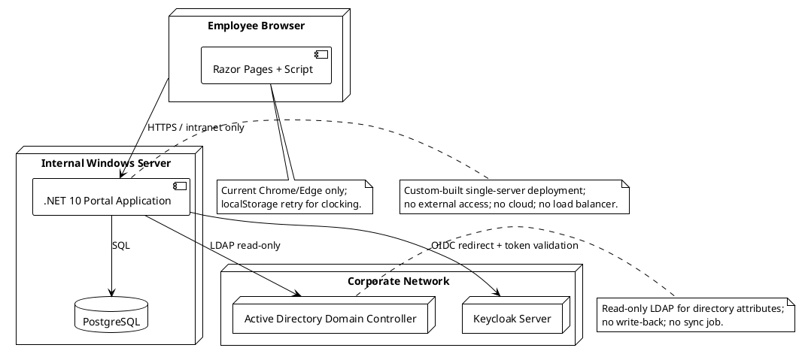

# Deployment Strategy — Portal

## Document Control

| Field | Value |
|---|---|
| Project | Portal |
| Phase | Inception |
| Iteration | 3 |
| Status | Draft |
| Milestone Target | End-of-Inception review (LCO final closure) |

## Deployment Mode

**Custom-built single-server deployment** — selected in Inception Iteration 1 and reaffirmed by the declared constraints.

- The portal is built and packaged by the development team.
- It is deployed to a single internal Windows Server already operated by the Infrastructure team (CON-007, CON-013).
- Keycloak and Active Directory are existing corporate services maintained by the Infrastructure team; they are not deployed or modified by this project (CON-004, CON-006, CON-011).
- No cloud hosting, no container orchestration, and no load balancer are in scope.

## Target User Community

- **Primary users:** Cuba Corp employees (STK-004) — 200 people across 3 offices.
- **Administrative users:** Members of the AD "HR" group (A-002), who manage worker categories, clockings, news, and exports.
- **Operators:** Infrastructure team (STK-003), who run the portal in production after handover.

## Target Environments

| Environment | Purpose | Topology | Owner |
|---|---|---|---|
| Development | Local development and CI builds | Developer workstation + shared PostgreSQL + corporate Keycloak/AD for integration tests | Development team |
| Test / Staging | Pre-production validation on internal Windows Server estate | Single Windows Server + PostgreSQL; mirrors production configuration | Infrastructure team |
| Production | Live employee portal | Single internal Windows Server + PostgreSQL; no external access | Infrastructure team |

> **Inception note:** Environment names and exact server identities will be confirmed with the Infrastructure team in Elaboration. The topology (single server, external auth/directory services) is fixed by CON-007.

## Initial Deployment Topology

## Deployment Constraints and Risks

| ID | Constraint / Risk | Impact on Deployment |
|---|---|---|
| CON-007 | Hosting: internal Windows Server | Deployment artifact must be a .NET 10 application that runs on Windows Server (IIS or Kestrel behind reverse proxy). |
| CON-008 | No access from outside the corporate network | No external DNS, TLS, or firewall rules required; deployment is intranet-only. |
| CON-013 | Infrastructure team operates portal post-launch | Handover must include runbook, connection strings, and Keycloak client configuration. |
| CON-016 | Existing server-backup practice covers PostgreSQL | No backup tooling is delivered; deployment package must reference Infrastructure backup confirmation. |
| R001 | AD LDAP attribute gaps | Validate AD attribute fill rates in Elaboration; deployment must not assume AD schema completeness. |
| R006 | PostgreSQL on Windows Server differs from dev environment | Staging deployment on Windows Server must occur before production to retire deployment/integration risk. |

## Rollout Approach (Initial)

1. **Elaboration:** Confirm staging server identity with Infrastructure team; validate deployment artifact on Windows Server.
2. **Construction:** Deploy each construction increment to staging; run smoke tests against Keycloak and AD.
3. **Transition:** Deploy to production; conduct two-gate acceptance (development site first, then install site); hand over to Infrastructure team.
4. **Beta program:** A limited beta with a subset of HR administrators and employees from each office will be run in late Construction / early Transition to validate clocking, directory, and news workflows before full rollout.

## Rollback Criteria (Initial)

- **Rollback trigger:** Production deployment fails two-gate acceptance, or a critical defect blocks clocking/news/directory access.
- **Rollback action:** Restore the previous deployed application build from SCM release artifact; database remains at current version unless a data-integrity defect is found.
- **Rollback owner:** Infrastructure team, with development team on-call support during Transition.

## Bill of Materials (Inline Summary)

The authoritative BOM is the repository lock files and package manifests. This inline summary captures the deployment-relevant items:

- .NET 10 runtime / ASP.NET Core 10 hosting bundle on Windows Server.
- PostgreSQL instance (existing Infrastructure-managed instance).
- Keycloak OIDC client credentials (already registered, CON-005).
- Active Directory read-only LDAP service account and attribute list.
- Application build artifact produced by `.github/workflows/ci.yml`.

## Traceability

| Element | Traces From | Link Type | Traces To |
|---|---|---|---|
| Deployment Strategy | CON-007, CON-013 | Refines | SAD §Deployment View |
| Custom-built mode | Scope statement | Refines | Release Notes (Transition) |
| Single-server topology | CON-007, CON-008 | Refines | SAD §Deployment View |
| Beta program | BG-003, R002 | Refines | Transition Iteration Plan |
| Two-gate acceptance | Deployment discipline heuristic | Refines | Transition acceptance criteria |
| Rollback criteria | R006, CON-013 | Refines | Transition runbook |
| BOM summary | CON-001..CON-005 | Refines | Repository lock files / CI artifact |
