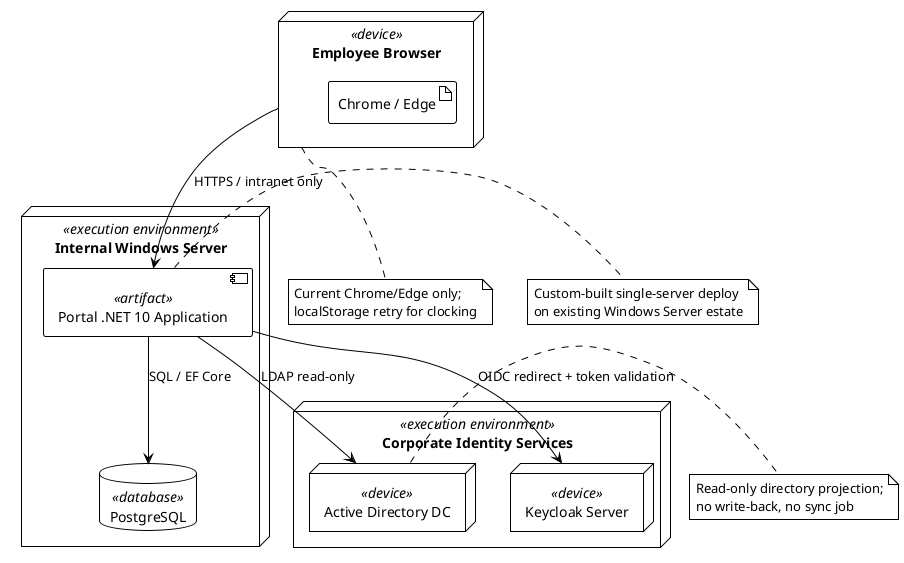

# Deployment Strategy — Portal (Inception Baseline)

## Deployment Mode

**Custom-built, single-server deployment** on the existing internal Windows Server estate.

This mode is selected because:
- The stakeholder declared internal Windows Server hosting (CON-007).
- The Infrastructure team will operate the portal post-launch (CON-013).
- There is no cloud, load-balancer, container orchestration, or multi-node requirement in scope.
- Keycloak and Active Directory are existing corporate services maintained separately (CON-004, CON-006, CON-011).

## Target Environments

| Environment | Purpose | Owner | Notes |
|---|---|---|---|
| Development | Local development and automated tests | Development team | .NET 10 + PostgreSQL (container or local) |
| Staging | Target-like validation before production | Infrastructure team | To be confirmed in Elaboration |
| Production | Live portal for 200 employees | Infrastructure team | Internal Windows Server only |

## Rollout Approach

1. **Inception**: deployment strategy baseline (this document).
2. **Elaboration**: refine topology, confirm staging environment, bootstrap CI/CD skeleton.
3. **Construction**: build deployable increments; run dev-site acceptance tests per iteration.
4. **Transition**: beta test, finalize packaging, install-site acceptance, handover to Infrastructure.
5. **Go-live**: release to all 200 employees across 3 offices.
6. **Adoption monitoring**: track 80% clocking usage within 3 months of go-live (BG-003).

## Rollback Criteria

Rollback is triggered when:
- Dev-site acceptance tests fail.
- Install-site acceptance tests fail.
- A critical production defect is detected within 24 hours of go-live.
- Performance targets (NFR-001, NFR-002) are not met.

## Topology Sketch

## Risks and Dependencies

| ID | Risk / Dependency | Owner | Mitigation |
|---|---|---|---|
| R001 | AD LDAP attribute gaps across offices | STK-003 | Prototype directory read in Elaboration; render blanks if gaps persist |
| R003 | Keycloak OIDC / AD group claim mapping | STK-003 | Confirm client registration and claim name early in Elaboration |
| R006 | Windows Server + PostgreSQL deployment mismatch | STK-003 | Provide target-like staging environment in Construction |
| R008 | Stakeholder availability for gates | STK-001 | Schedule reviews at iteration start |

## Constraints

See the Work Order and Software Architecture Document for the full constraint set. Key deployment constraints:
- CON-007: Hosting on internal Windows Server.
- CON-008: No access from outside the corporate network.
- CON-013: Infrastructure team operates portal post-launch.
- CON-016: Existing server-backup practice covers PostgreSQL.

## Notes

- This is a strategic baseline. Detailed installation and runbook procedures will be produced in Transition.
- No data migration: the portal starts empty at go-live (CON-014).
- No cloud, no load balancer, no container orchestration in scope.
