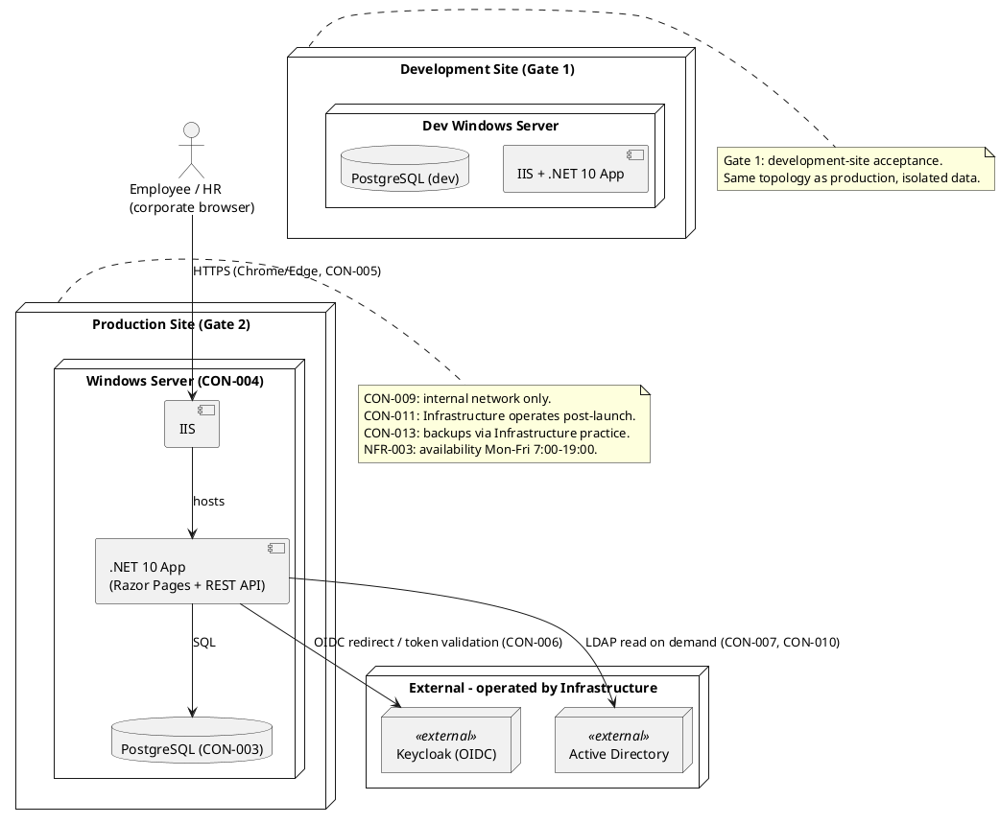
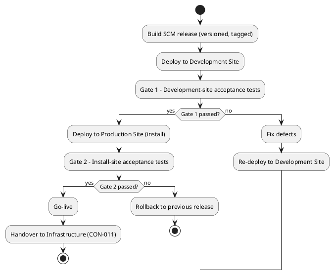

# Deployment Strategy — Employee Portal

## Document Control

| Field | Value |
|---|---|
| Phase | Inception |
| Status | Draft |
| Milestone Target | End-of-Inception (Lifecycle Objectives) — NOT YET ACHIEVED |
| Project | Portal |
| Owner | Deployment Manager |

## Deployment Mode

**Custom-built** deployment (selected at Inception). The portal is built for a single customer (Cuba Corp), installed on their internal infrastructure, and operated by their Infrastructure team post-launch (CON-011). This is neither shrink-wrapped (no third-party distribution) nor downloadable (no public artifact).

## Target User Community and Environments

| Environment | Purpose | Operator |
|---|---|---|
| Development Site | Gate 1 acceptance (development-site tests) | Development team |
| Production Site | Gate 2 acceptance (install-site tests) + go-live | Infrastructure team (CON-011) |

**User community:** 200 employees across 3 offices (STK-004), plus HR administrators (STK-001). All access is from the corporate browser (Chrome/Edge, CON-005) on the internal network only (CON-009).

## Deployment Topology (sketch)

**Topology summary:** single-node deployment — one Windows Server hosting IIS + the .NET 10 app, with PostgreSQL co-located (or a co-located DB node, decided in Elaboration). Keycloak and AD are external, operated by Infrastructure (CON-006, CON-010). No cloud, no multi-node topology, no load balancing (200 users, NFR-003 availability window). This matches the SAD Deployment View; the Deployment Model optional artifact is **not triggered** (single-node, single-environment).

## Rollout Approach

**Two-gate acceptance path** (established at Inception):

**Gate 1 — Development site.** The development team deploys the SCM release to the development site and runs acceptance tests there first. No production install until Gate 1 passes.

**Gate 2 — Install site.** After Gate 1 passes, the release is installed on the production site and install-site acceptance tests run. This is the final gate before go-live.

**Rollback criteria.** Rollback to the previous SCM release is triggered when Gate 2 (install-site acceptance) fails. Gate 1 failures do not roll back — they loop back to defect fixing and re-deploy on the development site.

**Handover.** At the end of Transition, the development team hands over to the Infrastructure team, who operate the portal in production (deployment, monitoring, patching) exactly as they operate AD and Keycloak (CON-011).

## Deployment Constraints and Risks

| Constraint | Deployment consequence |
|---|---|
| CON-004 | Internal Windows Server (IIS) hosting — no cloud |
| CON-006 | Keycloak is an OIDC client dependency only — never deployed/provisioned here |
| CON-009 | No access from outside the corporate network |
| CON-011 | Infrastructure operates post-launch; dev team hands over at end of Transition |
| CON-012 | No data migration — portal starts empty; historical Excel stays read-only archive |
| CON-013 | Backups covered by Infrastructure's existing practice (verified restore) — no backup design in this project |

| Risk | Deployment relevance |
|---|---|
| R001 | AD attribute gaps (job title, extension) may render blank in the directory — validate early in Elaboration against UC-008 |
| R002 | Digital clocking adoption — mitigated by communication and training at go-live (BG-003, AC-004) |

## Traceability

| Element | Traces From | Link Type | Traces To |
|---|---|---|---|
| Custom-built mode | CON-004, CON-011 | DependsOn | — |
| Two-gate acceptance path | AC-001…AC-005 | DependsOn | Transition plan |
| Single-node topology | CON-004, NFR-003 | DependsOn | SAD Deployment View |
| Handover to Infrastructure | CON-011 | DependsOn | Transition plan |
| R001 | CON-007, FR-008, UC-008 | DependsOn | Elaboration PoC |
| R002 | BG-003, AC-004, FR-001 | DependsOn | Transition plan |
