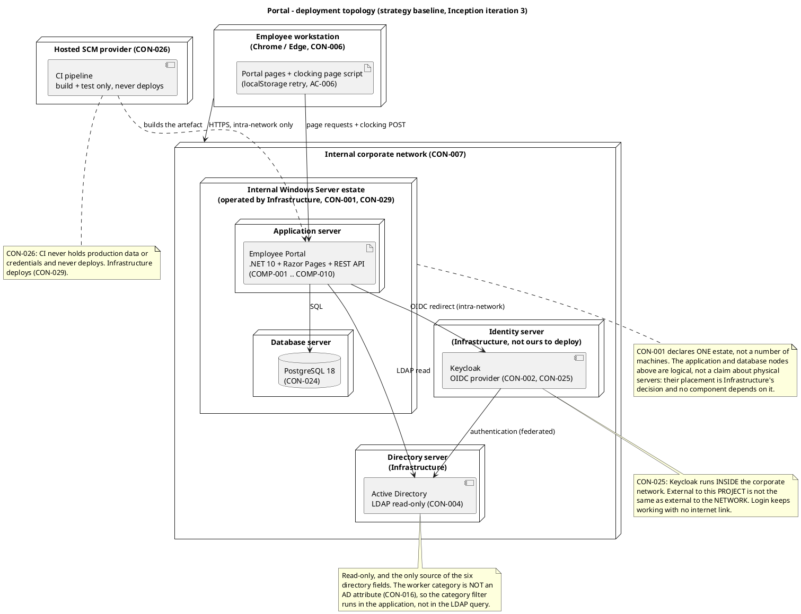
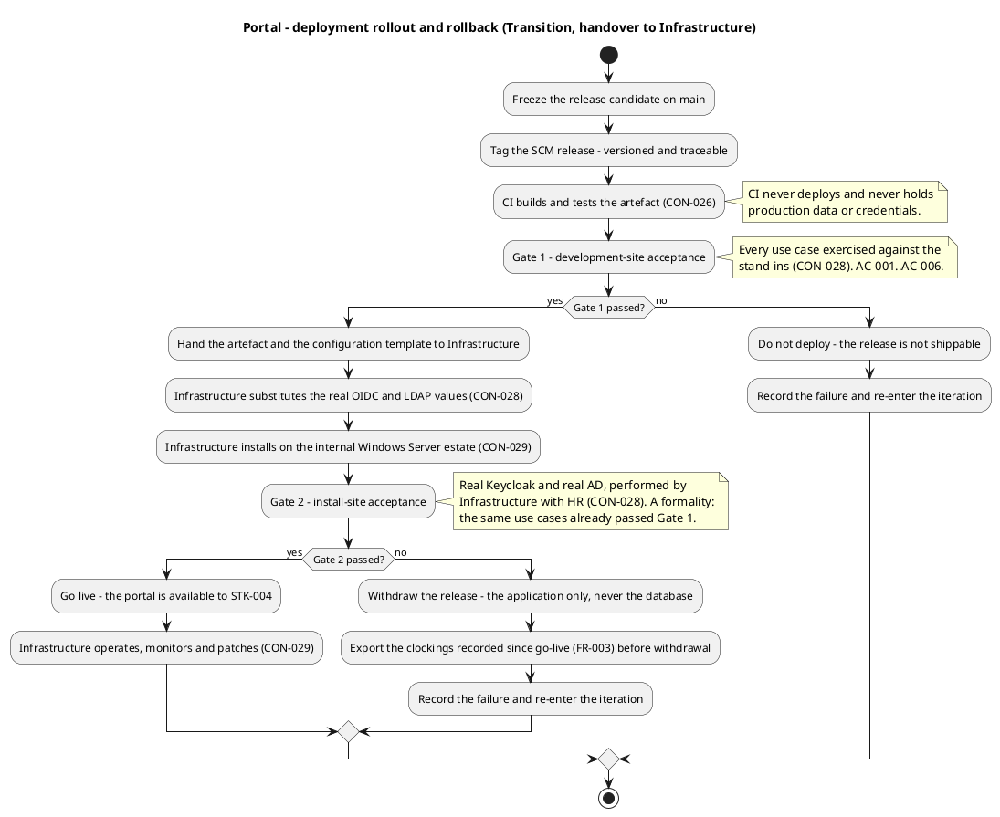

# Portal — Deployment Strategy Baseline

**Phase:** Inception | **Iteration:** 3 | **Status:** Draft — governs Inception iteration 3; not yet reviewed
**Milestone Target:** Lifecycle Objectives (LCO) — end of Inception. NOT YET ACHIEVED.

This file is the deployment strategy baseline. It is not a RUP artifact: the Deployment Model optional
artifact is not triggered (DC §5.2) and the Release Notes enter at Transition (DC §5.1). The strategy is
seeded here in Inception, refined against the Software Architecture Document's Deployment View in
Elaboration, and executed as the Release Notes at Transition.

## 1. Deployment mode: custom-built

The portal is installed on the internal Windows Server estate by the Infrastructure team that already
operates it (CON-001, CON-029), is reachable only from the internal corporate network (CON-007), and is
distributed to no one — the users reach it through a browser.

Shrink-wrapped and downloadable packaging are excluded by CON-007 and CON-029: there is no installer for a
third party and no artefact for an end user to obtain. Every packaging decision below follows from this
mode.

## 2. Target user community

| Population | Who | What they do |
|---|---|---|
| STK-004 | 200 employees, 3 offices, current Chrome or Edge (CON-006) | Clock in and out, read news, search the directory |
| STK-001 | HR Director and HR Administrators | Publish, edit and unpublish news; correct clockings; export the monthly report; manage worker categories |
| STK-003 | Infrastructure Team | Operates the portal in production (CON-029). Not a user of it |

## 3. Target environments

| Environment | Where | Purpose | Data |
|---|---|---|---|
| Development and test | The team's environment, against stand-ins | Build and test every use case | Stand-in OIDC issuer and stand-in directory carrying the declared attributes, including entries with empty job title and extension (CON-028). No production data |
| CI | Hosted SCM provider | Build and test the artefact | No production data, no credentials, no deployment (CON-026) |
| Production | The internal Windows Server estate | The live portal | Real Keycloak and real AD values substituted by Infrastructure at deployment (CON-028, CON-029) |

No staging environment is declared and none is introduced. The human validation of the real Keycloak and
real AD (CON-028) is performed by Infrastructure with HR against the production configuration.

## 4. Topology

The Deployment Model optional artifact is not triggered (DC §5.2): one application, one database, one
estate, one network, one timezone (CON-008). The topology is the Software Architecture Document's
Deployment View; this strategy operationalizes that view rather than restating it.

**CON-025 is load-bearing.** Keycloak runs INSIDE the corporate network. External to this *project* is not
the same as external to the *network*: the OIDC redirect is an intra-network call, nothing about login
crosses the corporate boundary, and login keeps working with no internet link. A deployment view that
placed Keycloak in a cloud node would contradict CON-025 and be wrong.

## 5. Release unit and bill of materials

One SCM release: a tag on the repository plus the artefact it names. Versioned, tagged and traceable, so
the deployed binary is identifiable from the repository alone.

| Item | Content | Source |
|---|---|---|
| Application artefact | `Portal.sln` — .NET 10, Razor Pages front end and REST API, `COMP-001`..`COMP-010` as logical units inside one deployable | CON-022, CON-023 |
| Database schema | PostgreSQL 18 schema — clockings, news, the worker-category link, the audit records | CON-024, NFR-004 |
| Configuration template | Placeholder OIDC issuer, client id, client secret, LDAP host, bind account and base DN, held in configuration and never in code | CON-028 |
| Release Notes | Drafted at Transition (DC §5.1) | — |
| User Documentation | Employee guidance for clocking, news and the directory; HR guidance for publishing, correcting and exporting | CON-031 |

The ten components are logical units inside one deployable, not ten services: the architecture is a layered
single deployable. The physical placement of the application and the database within the estate is
Infrastructure's decision and no component depends on it.

## 6. Rollout approach

One go-live for all three offices. There is one deployable, one estate, one PostgreSQL instance and one
timezone (CON-008), and no per-office configuration exists to sequence — a phased rollout by office would
add coordination without reducing risk. The risk a phased rollout would normally address is addressed
instead by the two acceptance gates below.

### 6.1 Two acceptance gates

| Gate | Where | Who runs it | Criteria | Consequence of failure |
|---|---|---|---|---|
| Gate 1 — development-site acceptance | The team's environment, against the stand-ins | The team | Every use case exercised against the stand-ins (CON-028); `AC-001`..`AC-006` | The release is not shippable. No deployment is attempted |
| Gate 2 — install-site acceptance | Production, against the real Keycloak and the real AD | Infrastructure with HR (CON-028) | The same use cases, on the real identity and directory path | The release is withdrawn and the iteration re-entered |

Gate 2 is a formality by construction: it re-runs use cases that already passed Gate 1, and the only
variable it introduces is the substitution of the real OIDC and LDAP values. A Gate 2 failure is therefore
a configuration defect, not a functional one, and it is diagnosed as such.

### 6.2 Beta programme

The beta is the install-site acceptance run with a pilot group, and it is the only structured feedback
mechanism the rollout has.

| Element | Definition |
|---|---|
| Participants | A pilot group drawn from `STK-004` across the three offices, plus `STK-001` (HR) as the process owner. The pilot group is the population that exercises the real identity and directory path before full go-live |
| Feedback mechanism | `STK-001` collects it, because HR owns the HR processes the portal replaces. A defect found in the pilot is raised as an SCM issue and carries an issue number; a usability observation is recorded against the use case it concerns |
| Success criteria | `AC-002` (an employee clocks in and out without help from HR or the development team), `AC-003` (HR publishes a news item without technical assistance), `AC-004` (any employee finds a colleague's phone or email in under 10 seconds), `AC-005` (employees complete at least one clocking with no prior training) |
| Exit | Every pilot defect is closed or recorded as a known issue before full go-live. `AC-001` and `AC-006` are measured at Gate 1, not in the pilot |

## 7. Rollback criteria

The application is withdrawn; the database is never withdrawn. Clockings recorded since go-live are the
record of hours worked and are not recoverable from anywhere else (CON-030 — there is no import and no
historical source), so a rollback that discarded them would destroy the only copy. Before any withdrawal,
the clockings recorded since go-live are exported through `UC-002` (FR-003).

| Trigger | Threshold | Action |
|---|---|---|
| Gate 2 fails | Any use case fails on the real identity or directory path | Withdraw the application; export the clockings; re-enter the iteration |
| Login unavailable | The OIDC path against the real Keycloak fails for any employee | Withdraw the application; export the clockings; escalate to Infrastructure |
| Clocking not recorded | A clocking press is accepted by the client and not persisted, or a duplicate is created | Withdraw the application; export the clockings; the idempotency key and the client timestamp are the first items examined |
| Clocking integrity broken | A day carries more than one clocking pair for an employee, or a pair crosses midnight (CON-010, CON-011) | Withdraw the application; export the clockings; the schema constraint is the first item examined |
| Audit trail incomplete | A news publication, edit, unpublish, category change or clocking correction is not audited (NFR-004) | Withdraw the application; export the clockings; the audit write is the first item examined |
| Response time breached | `NFR-002` (under 1 second for clock in/out) is breached for a sustained period, or `NFR-001` (under 3 seconds full page load) is breached | Do not withdraw on the first breach — record it, and withdraw only if the breach persists after Infrastructure has examined the estate |

A withdrawal is a deployment action, not a data action. The database stays in place, the schema stays in
place, and the clockings stay in place.

## 8. Migration

There is none (CON-030). The portal starts empty and records clockings from go-live onwards. The historical
Excel sheets stay on the shared drive as a read-only archive and are not imported. `BG-002` — eliminate
100% of Excel usage for recording new clockings — refers to new clockings only, and no migration step
exists to satisfy it.

## 9. Compatibility position

| Item | Position |
|---|---|
| Browsers | Current Chrome and Edge (CON-006). No other browser is supported and none is tested |
| Client framework | None. Razor Pages with a page-level script on the clocking page (CON-023). No SPA, no client-side router, no client cache of the directory or the news |
| Timezone | All three offices are Europe/Madrid (CON-008). Clockings are stored in UTC and displayed in Europe/Madrid. No multi-timezone case exists |
| Network | Internal corporate network only (CON-007). The portal is not reachable from outside it |
| Identity | The portal is an OIDC client of the existing Keycloak, which federates Active Directory (CON-002). The client is already registered and its credentials are with the development team (CON-003) |
| Active Directory | Read-only. The portal never writes to AD (CON-004) and holds no local copy of the employee (CON-016) |
| Backups | Infrastructure's existing server-backup practice covers the PostgreSQL instance in restorable form (CON-032). No backup design, tooling or restore procedure is part of this project |

## 10. Handover

The development team hands over at the end of Transition and does not operate the portal afterwards
(CON-029). Infrastructure takes deployment, monitoring and patching, exactly as it already operates AD and
Keycloak. The handover package is the release unit in section 5, plus the configuration template with the
placeholder values Infrastructure replaces.

## 11. Constraints and risks this strategy carries

| Item | State | Effect on the deployment plan |
|---|---|---|
| Stand-in environment (CON-028) | Not delivered — no stand-in OIDC issuer and no stand-in directory exist in the repository | No use case can be built or tested against the real Keycloak or the real AD, so no use case is buildable and Gate 1 cannot be run. This is the first construction item of the iteration |
| `R004` | Materialized — the stand-in environment is not delivered | The risk that gates every test. Its treatment is a hard gate owned by the Integrator |
| `R001` | Probability and impact recorded as `[ASSUMPTION — requires validation]`; exposure 12 provisional | The magnitude bands rest on `R002`'s and `R003`'s declared exposures, not on `R001` |
| `R002` | Treatment specified, not executed — the stand-in directory is to carry entries with empty job title and extension | Gate 1 cannot exercise the directory's gap behaviour until the stand-in directory exists |
| `R005` | Gate not yet opened; it opens in Elaboration, bounded at 14 days of queue time | The human validation of the real Keycloak and real AD (CON-028) is Infrastructure's and HR's work, not the team's to plan |
| No release cut | Inception produces no deployable increment | The first SCM release is cut at Transition. No tag exists and none is claimed |
| CI build | Green on `main` — run `36110880293` | The build is verifiable (CON-026). CI never deploys and never holds production data or credentials |

## 12. Traceability

| Element | Traces From | Link Type | Traces To |
|---|---|---|---|
| Deployment strategy (this file) | CON-001, CON-022, CON-023, CON-024, CON-026, CON-029 | Refines | UC-001, UC-002, UC-003, UC-004, UC-005, UC-006, UC-007, UC-008, UC-009 |
| Deployment mode: custom-built | CON-001, CON-007, CON-029 | Refines | UC-001 |
| Release unit and bill of materials | CON-001, CON-024, CON-031 | Refines | UC-001, UC-004, UC-008 |
| Target environments | CON-026, CON-028 | Refines | AC-006 |
| Two acceptance gates | CON-028, CON-029 | Refines | AC-001, AC-002, AC-003, AC-004, AC-005, AC-006 |
| Beta programme | CON-028, CON-029 | Refines | AC-002, AC-003, AC-004, AC-005 |
| Rollback criteria | CON-010, CON-011, CON-012, NFR-004 | Refines | UC-001, UC-003 |
| Migration: none | CON-030 | Refines | UC-002 |
| Compatibility position | CON-002, CON-003, CON-004, CON-006, CON-007, CON-008, CON-016, CON-023, CON-032 | Refines | UC-001, UC-008 |
| Handover to Infrastructure | CON-029 | Refines | UC-001, UC-002, UC-003, UC-004, UC-005, UC-006, UC-007, UC-008, UC-009 |
| Constraints and risks carried | CON-028, R001, R002, R004, R005 | Refines | UC-001, UC-008 |

Every endpoint above is an element identifier, not a document section: the constraints the deployment plan
tailors to, and the use cases and acceptance criteria the release carries. This strategy governs no system
element of its own, so it carries no edge to an artifact name.
