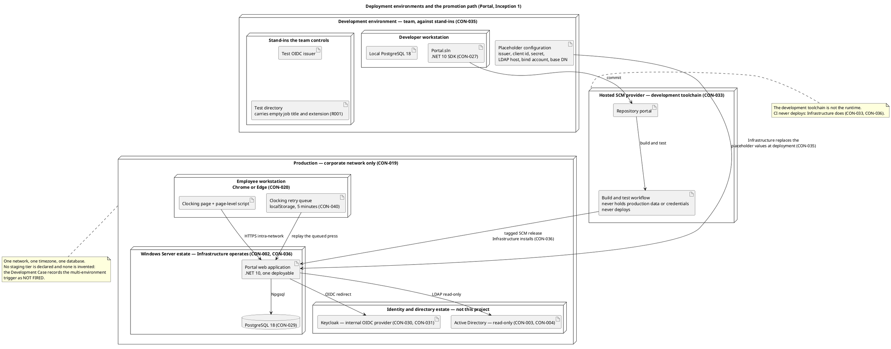
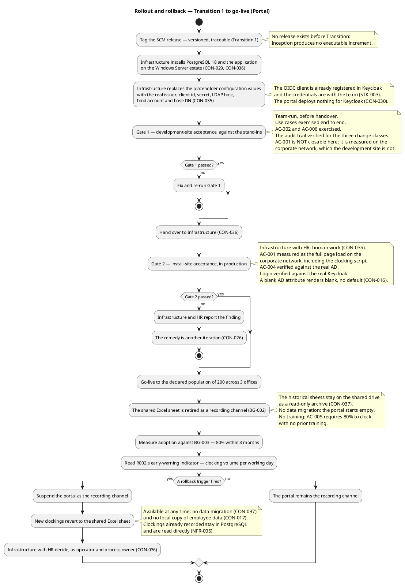

# Deployment Strategy — Portal

## Document Control

- **Phase:** Inception
- **Status:** Draft — under review
- **Milestone Target:** End of Inception (not yet achieved)
- **Iteration:** 1, Cycle 1
- **Owner:** DeploymentManager
- **Date:** 2026-10-07

## Deployment Mode

**Custom-built, single-tenant, installed by the operator.** The portal is built for one organization, deployed once on the Windows Server estate Infrastructure already operates (CON-002, CON-036), and reachable only from the internal corporate network (CON-019). It is not shrink-wrapped: there is no distributable for third parties, no licence mechanism and no installer for an unknown host. It is not downloadable: no user installs anything, the employee opens the corporate browser (CON-020).

The mode fixes the whole of the packaging decision.

- The deployment unit is an SCM release — a tag plus the code it names, versioned and traceable. There is no product box, no media and no distribution channel.
- The bill of materials is the repository's lock files, summarised inline in the Release Notes. No separate BOM document is produced.
- Installation is Infrastructure's act, not a script this project ships. No deployment automation is in scope (CON-036) and CI never deploys (CON-033).
- Configuration is the handover surface. The six values — issuer, client id, client secret, LDAP host, bind account, base DN — are placeholders in the repository and real values in production, put there by Infrastructure (CON-035).

## Target User Community

| Community | Who | What they do with the portal | Basis |
|---|---|---|---|
| Employees | STK-004 — 200 people across 3 offices | Clock in and out, read news, search the directory | FR-001, FR-002, FR-007, FR-011 |
| HR Administrators | STK-001 — HR Director and HR staff | View and export all clockings, correct or insert a clocking, publish, edit, unpublish and feature news, assign or clear a worker category | FR-003 to FR-006, FR-008 to FR-010, FR-012 |
| Infrastructure | STK-003 — operator | Install, monitor, patch and back up the portal; operate AD and Keycloak | CON-036, CON-039 |

The two authorization levels are the whole of the community split (CON-018). No third population exists, and no per-category rule distinguishes one employee from another (CON-014).

## Target Environments

Three environments, and only three. The Development Case records the multi-environment trigger as NOT FIRED: one .NET application, one PostgreSQL instance, one internal network, one timezone.

| Environment | Purpose | What is real there | What is a stand-in |
|---|---|---|---|
| Development | Build, unit and integration test | .NET 10 SDK, local PostgreSQL 18 | Test OIDC issuer; test directory carrying the declared attributes including empty job title and extension (CON-035, R001) |
| Hosted SCM provider CI | Build and test on every push | The repository and the toolchain | Nothing production: no production data, no credentials, no deployment (CON-033) |
| Production | The portal the declared population uses | The real Keycloak, the real AD, the real PostgreSQL 18, the real Windows Server estate | Nothing |

**No staging tier is declared and none is invented.** The Development Case records the trigger as NOT FIRED, and the two acceptance gates below carry the verification a staging tier would otherwise carry. Adding one would be a technology and an operational burden the stakeholder did not declare, and Infrastructure accepted operating *a* .NET application (CON-002).

**The hosted CI is not a runtime environment.** "No cloud" and "internal network only" govern where the portal runs and who can reach it, not where the build runs (CON-033).

```plantuml
@startuml
title Deployment environments and the promotion path (Portal, Inception 1)

skinparam componentStyle rectangle

node "Development environment — team, against stand-ins (CON-035)" as DEV {
  node "Developer workstation" as DW {
    artifact "Portal.sln\n.NET 10 SDK (CON-027)" as A1
    artifact "Local PostgreSQL 18" as A2
  }
  node "Stand-ins the team controls" as ST {
    artifact "Test OIDC issuer" as A3
    artifact "Test directory\ncarries empty job title and extension (R001)" as A4
  }
  artifact "Placeholder configuration\nissuer, client id, secret,\nLDAP host, bind account, base DN" as A5
}

node "Hosted SCM provider — development toolchain (CON-033)" as CI {
  artifact "Repository portal" as A6
  artifact "Build and test workflow\nnever holds production data or credentials\nnever deploys" as A7
}

node "Production — corporate network only (CON-019)" as PROD {
  node "Employee workstation\nChrome or Edge (CON-020)" as WS {
    artifact "Clocking page + page-level script" as A8
    artifact "Clocking retry queue\nlocalStorage, 5 minutes (CON-040)" as A9
  }
  node "Windows Server estate — Infrastructure operates (CON-002, CON-036)" as SRV {
    artifact "Portal web application\n.NET 10, one deployable" as A10
    database "PostgreSQL 18 (CON-029)" as A11
  }
  node "Identity and directory estate — not this project" as IDM {
    artifact "Keycloak — internal OIDC provider (CON-030, CON-031)" as A12
    artifact "Active Directory — read-only (CON-003, CON-004)" as A13
  }
}

A1 --> A6 : commit
A6 --> A7 : build and test
A7 --> A10 : tagged SCM release\nInfrastructure installs (CON-036)
A5 --> A10 : Infrastructure replaces the\nplaceholder values at deployment (CON-035)
A3 -[hidden]- A4
A8 --> A10 : HTTPS intra-network
A10 --> A12 : OIDC redirect
A10 --> A13 : LDAP read-only
A10 --> A11 : Npgsql
A9 --> A10 : replay the queued press

note right of CI
  The development toolchain is not the runtime.
  CI never deploys: Infrastructure does (CON-033, CON-036).
end note

note bottom of PROD
  One network, one timezone, one database.
  No staging tier is declared and none is invented:
  the Development Case records the multi-environment
  trigger as NOT FIRED.
end note
@enduml
```

## Rollout Approach

**One release, one go-live, to the declared population.** No per-office difference is declared: all three offices are on the same network, in the same timezone, with the same browser target (CON-006, CON-019, CON-020). A staged activation by office is held as a contingency for R002, not as the plan — it would delay the BG-003 adoption measurement without a declared reason to stage.

**No data migration and no training are part of the rollout.** The portal starts empty and records clockings from go-live onwards; the historical Excel sheets stay on the shared drive as a read-only archive (CON-037). AC-005 requires 80% of employees to complete a clocking with no prior training, so the rollout carries no training programme.

**The rollout is a handover, not a deployment by this team.** Infrastructure installs and operates (CON-036); the development team hands over at the end of Transition and does not run the portal afterwards.

```plantuml
@startuml
title Rollout and rollback — Transition 1 to go-live (Portal)

start
:Tag the SCM release — versioned, traceable (Transition 1);
note right
  No release exists before Transition:
  Inception produces no executable increment.
end note

:Infrastructure installs PostgreSQL 18 and the application\non the Windows Server estate (CON-029, CON-036);
:Infrastructure replaces the placeholder configuration values\nwith the real issuer, client id, secret, LDAP host,\nbind account and base DN (CON-035);
note right
  The OIDC client is already registered in Keycloak
  and the credentials are with the team (STK-003).
  The portal deploys nothing for Keycloak (CON-030).
end note

:Gate 1 — development-site acceptance, against the stand-ins;
note right
  Team-run, before handover.
  Use cases exercised end to end.
  AC-002 and AC-006 exercised.
  The audit trail verified for the three change classes.
  AC-001 is NOT closable here: it is measured on the
  corporate network, which the development site is not.
end note

if (Gate 1 passed?) then (no)
  :Fix and re-run Gate 1;
  stop
else (yes)
endif

:Hand over to Infrastructure (CON-036);
:Gate 2 — install-site acceptance, in production;
note right
  Infrastructure with HR, human work (CON-035).
  AC-001 measured as the full page load on the
  corporate network, including the clocking script.
  AC-004 verified against the real AD.
  Login verified against the real Keycloak.
  A blank AD attribute renders blank, no default (CON-016).
end note

if (Gate 2 passed?) then (no)
  :Infrastructure and HR report the finding;
  :The remedy is another iteration (CON-026);
  stop
else (yes)
endif

:Go-live to the declared population of 200 across 3 offices;
:The shared Excel sheet is retired as a recording channel (BG-002);
note right
  The historical sheets stay on the shared drive
  as a read-only archive (CON-037).
  No data migration: the portal starts empty.
  No training: AC-005 requires 80% to clock
  with no prior training.
end note

:Measure adoption against BG-003 — 80% within 3 months;
:Read R002's early-warning indicator — clocking volume per working day;

if (A rollback trigger fires?) then (yes)
  :Suspend the portal as the recording channel;
  :New clockings revert to the shared Excel sheet;
  note right
    Available at any time: no data migration (CON-037)
    and no local copy of employee data (CON-017).
    Clockings already recorded stay in PostgreSQL
    and are read directly (NFR-005).
  end note
  :Infrastructure with HR decide, as operator and process owner (CON-036);
else (no)
  :The portal remains the recording channel;
endif
stop
@enduml
```

### Rollout sequence

| Step | Act | Owner | Basis |
|---|---|---|---|
| 1 | Tag the SCM release — versioned, traceable. | ConfigurationManager | CON-033 |
| 2 | Install PostgreSQL 18 and the application on the Windows Server estate. | Infrastructure | CON-029, CON-036 |
| 3 | Replace the six placeholder configuration values with the real ones. | Infrastructure | CON-035 |
| 4 | Gate 1 — development-site acceptance, against the stand-ins. | Development team | AC-002, AC-006 |
| 5 | Hand over to Infrastructure. | Development team | CON-036 |
| 6 | Gate 2 — install-site acceptance, in production. | Infrastructure with HR | AC-001, AC-004, CON-035 |
| 7 | Go-live; retire the shared Excel sheet as a recording channel. | HR | BG-002 |
| 8 | Measure adoption against BG-003; read R002's early-warning indicator. | ProjectManager | BG-003, R002 |

## Rollback Criteria

Rollback is cheap here, and that is a property of the declared scope rather than a design achievement: there is no data migration (CON-037), no local copy of employee data (CON-017), and the historical Excel sheets remain on the shared drive as a read-only archive. Reverting the recording channel costs no data movement.

**Rollback never deletes.** Clockings already recorded stay in PostgreSQL and are read directly (NFR-005); news items are never deleted (CON-013); the audit trail is append-only (NFR-001). A rollback suspends the portal as the recording channel and reverts new clockings to the shared Excel sheet. It does not undo what the portal recorded.

| # | Trigger | Why it is a rollback and not a fix-forward | Basis |
|---|---|---|---|
| RB-1 | A clocking is lost or double-recorded in production. | The audit trail is wrong, and a clocking record that is true is the portal's first purpose. | AC-006, CON-009, CON-040 |
| RB-2 | The audit trail is incomplete for any of the three change classes. | NFR-005 means no in-portal screen would reveal a missing record: the defect is invisible to the user and fatal to the requirement. | NFR-001, NFR-005 |
| RB-3 | Login fails against the real Keycloak, or the directory is unusable against the real AD. | Both are outside the team's control and neither is a portal defect to fix forward. | CON-030, CON-031, R001, R003 |
| RB-4 | The full page load exceeds the NFR-002 threshold on the corporate network. | AC-001 measures the employee's experience, and the remedy CON-041 forbids — a client cache — is not available. | NFR-002, AC-001, CON-041, R008 |
| RB-5 | Adoption falls below the BG-003 trajectory. | The portal is not replacing the manual tooling, which is the point of the project. | BG-003, R002 |

**Who decides.** Infrastructure, as operator, with HR, as process owner (CON-036). The development team does not run the portal after handover and does not hold the rollback decision.

**What a rollback is not.** It is not a scope cut. Declared scope is the stakeholder's to change, not the plan's (CON-034). A rollback suspends a channel; it does not remove a use case from the release.

## Acceptance Gates

Two gates, distinct criteria, distinct sites. The final site test is a formality only if the first gate did its work.

| Gate | Site | Who runs it | Criteria | What it cannot close |
|---|---|---|---|---|
| Gate 1 — development-site acceptance | Development, against the stand-ins | Development team | Every use case exercised end to end; AC-002 (clocking without help); AC-006 (a clocking made while the network is down for the full 5-minute window is not lost); the audit trail verified for the three change classes; the blank-attribute directory path exercised. | AC-001 — the full page load is measured on the corporate network, which the development site is not. AC-004 against the real AD. |
| Gate 2 — install-site acceptance | Production, on the corporate network | Infrastructure with HR | AC-001 measured as the full page load including the clocking page's script; AC-004 against the real AD; login against the real Keycloak; a blank AD attribute renders blank with no default invented. | AC-003 and AC-005, which are exercised in Construction and measured after go-live. |

**Gate 2 is human work, not team work to plan** (CON-035). It is bounded as R003, with a 14-day ceiling, and its feedback must reach the team before Elaboration closes. If it delays a milestone, the remedy is another iteration (CON-026).

## Support Material and Bill of Materials

| Deliverable | Owner | Enters | Content |
|---|---|---|---|
| Release Notes | DeploymentManager | Transition (DC §5.1) | Features delivered by use case, installation steps, known issues, migration notes, the bill of materials inline, the acceptance verdict. |
| User Documentation — operations section | TechnicalWriter (primary); DeploymentManager contributes | Construction (DC §5.1) | Installation, configuration and runbooks for Infrastructure. |
| Bill of materials | — | — | The repository's lock files. Summarised inline in the Release Notes; no separate document. |
| SCM release | ConfigurationManager | Transition | The tag and the code it names. The product IS the release. |

**No training material is produced.** AC-005 requires 80% of employees to complete a clocking with no prior training, and the clocking screen is one press with confirmation (FR-002). Training material would contradict the acceptance criterion it is meant to serve.

**No migration guide is produced.** There is no migration (CON-037). The Release Notes carry that as a statement, not as a procedure.

```plantuml
@startuml
title Release package and the configuration handover (Portal, Transition 1)

skinparam componentStyle rectangle

package "SCM release — tagged, versioned, traceable" as REL {
  component "Portal web application\n.NET 10, one deployable (CON-027)" as R1
  component "Database schema\nPostgreSQL 18 (CON-029)" as R2
  component "Lock files — the bill of materials" as R3
  component "Release Notes\nfeatures, installation, known issues,\nmigration notes, BOM inline (Transition)" as R4
  component "User Documentation\noperations section: installation,\nconfiguration, runbooks (Construction)" as R5
}

package "Configuration — placeholder in the repository, real values at deployment" as CFG {
  component "issuer" as C1
  component "client id" as C2
  component "client secret" as C3
  component "LDAP host" as C4
  component "bind account" as C5
  component "base DN" as C6
}

package "Infrastructure — operator (CON-036)" as INF {
  component "Installs the application and PostgreSQL 18" as I1
  component "Replaces the placeholder values (CON-035)" as I2
  component "Monitors and patches" as I3
  component "Existing server-backup practice (CON-039)" as I4
}

R1 --> I1
R2 --> I1
R3 --> R4 : summarised inline
R4 --> I1
R5 --> I1
CFG --> I2
I2 --> R1 : real values in configuration,\nnever in code (CON-035)

note bottom of REL
  The product IS the SCM release: tag plus code.
  No release is created in Inception — there is
  no executable increment to tag.
end note

note bottom of INF
  No deployment automation, no monitoring design
  and no backup design are part of this project
  (CON-036, CON-039). CI never deploys (CON-033).
end note
@enduml
```

## Traceability

| Element | Traces From | Link Type | Traces To |
|---|---|---|---|
| docs/DEPLOYMENT_STRATEGY.md | CON-002, CON-019, CON-020, CON-027, CON-029, CON-036 | Refines | Software Architecture Document |
| docs/DEPLOYMENT_STRATEGY.md | CON-030, CON-031, CON-035 | Refines | Software Architecture Document |
| docs/DEPLOYMENT_STRATEGY.md | CON-037, CON-039, CON-042 | Refines | Release Notes |
| docs/DEPLOYMENT_STRATEGY.md | CON-033, CON-038, CON-040, CON-041 | Refines | User Documentation |
| docs/DEPLOYMENT_STRATEGY.md | NFR-002, NFR-004, AC-001, AC-004, AC-006 | Refines | Test Case |
| docs/DEPLOYMENT_STRATEGY.md | BG-002, BG-003, R001, R002, R003, R008 | Refines | Iteration Plan |
| docs/DEPLOYMENT_STRATEGY.md | STK-001, STK-003, STK-004 | Refines | Vision |
| docs/DEPLOYMENT_STRATEGY.md | FR-001, FR-002, FR-003, FR-004, FR-005, FR-006, FR-007, FR-008, FR-009, FR-010, FR-011, FR-012 | Refines | Use-Case Model |

**Reading the table.** `Traces From` is the declared input each decision in this strategy realizes — the constraint, requirement, goal, risk or stakeholder copied from the Work Order. `Traces To` is the artifact that consumes the decision. The Release Notes and the User Documentation are the two artifacts this strategy feeds; neither exists yet, because the Development Case enters them at Transition and Construction respectively.

**Coverage.** Every deployment decision in this document names the declared constraint that fixes it. No environment, node, gate or rollback trigger is introduced that the stakeholder did not declare or that the Development Case did not sanction.
