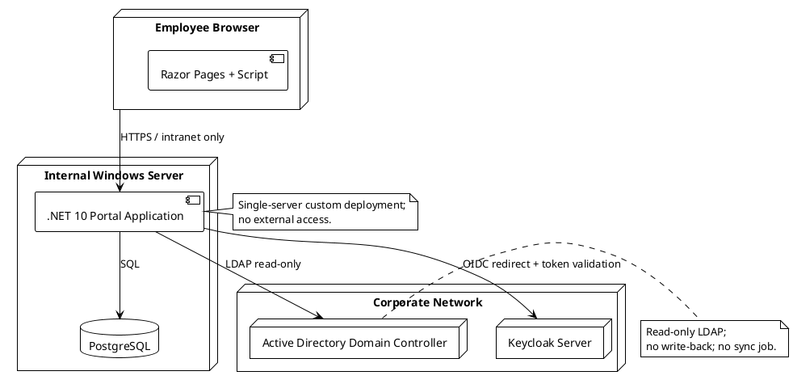

# Operations Guide — Portal

## Document Control

| Field | Value |
|---|---|
| Project | Portal |
| Phase | Inception |
| Iteration | 3 |
| Status | Draft |
| Milestone Target | End-of-Inception review (LCO final closure) |

## Target Topology

The portal runs as a custom-built .NET 10 application on a single internal Windows Server, with PostgreSQL on the same server. Authentication and directory services are existing corporate systems operated by the Infrastructure team.

## Installation Prerequisites

| Item | Source / Owner | Notes |
|---|---|---|
| Internal Windows Server | Infrastructure team | CON-007 |
| PostgreSQL instance | Infrastructure team | CON-003; backup covered by existing practice (CON-016) |
| Keycloak OIDC client credentials | Development team / Infrastructure team | CON-005 |
| Active Directory read-only LDAP account | Infrastructure team | CON-006, CON-011 |
| .NET 10 hosting bundle | Infrastructure team | CON-001 |

## Configuration Checklist

- [ ] PortalApp connection string to PostgreSQL.
- [ ] OIDC client ID, secret, and authority URL for Keycloak.
- [ ] LDAP server, bind account, and base DN for Active Directory.
- [ ] HR AD group claim name for authorization (NFR-006).
- [ ] Europe/Madrid timezone configured for display/export (CON-021).
- [ ] Intranet HTTPS certificate (internal CA acceptable).

## Runbook — Deployment

1. Obtain the SCM release artifact for the target version.
2. Back up the current application files and the PostgreSQL database.
3. Stop the portal application process.
4. Deploy the new artifact to the Windows Server application folder.
5. Apply any pending database migrations.
6. Start the portal application process.
7. Run smoke tests: login via Keycloak, directory search, clock in/out, news browse.
8. Notify HR administrators and employees of the new version.

## Runbook — Rollback

1. Stop the portal application process.
2. Restore the previous application files from the pre-deployment backup.
3. If a data-integrity defect was introduced, restore the PostgreSQL database to the pre-deployment backup; otherwise leave the database at the current version.
4. Start the portal application process.
5. Verify smoke tests pass.
6. Record the rollback reason in the Incident Log.

## Traceability

| Element | Traces From | Link Type | Traces To |
|---|---|---|---|
| Operations Guide | CON-007, CON-013 | Refines | SAD §Deployment View |
| Installation prerequisites | CON-001..CON-006 | Refines | docs/DEPLOYMENT_STRATEGY.md |
| Configuration checklist | NFR-006, CON-021 | Refines | SAD §Architecture Mechanisms |
| Deployment runbook | CON-013 | Refines | Transition Iteration Plan |
| Rollback runbook | R006, CON-013 | Refines | docs/DEPLOYMENT_STRATEGY.md |
