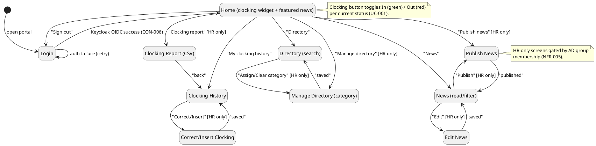
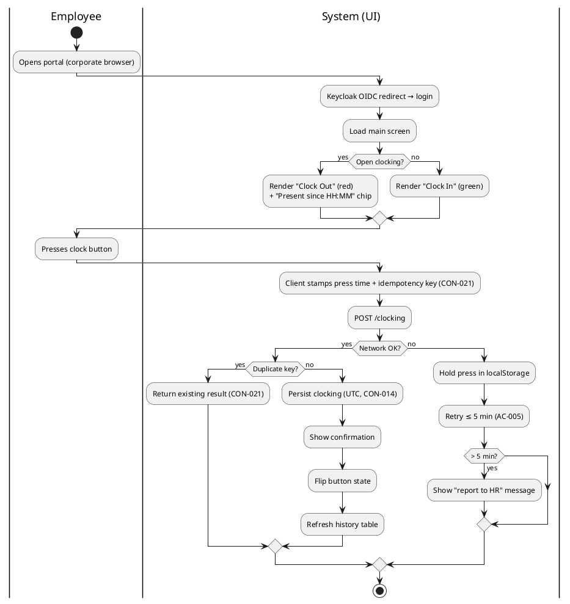
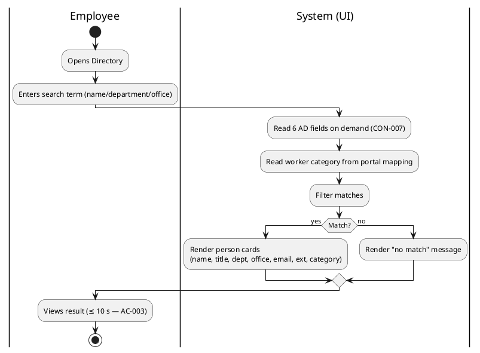
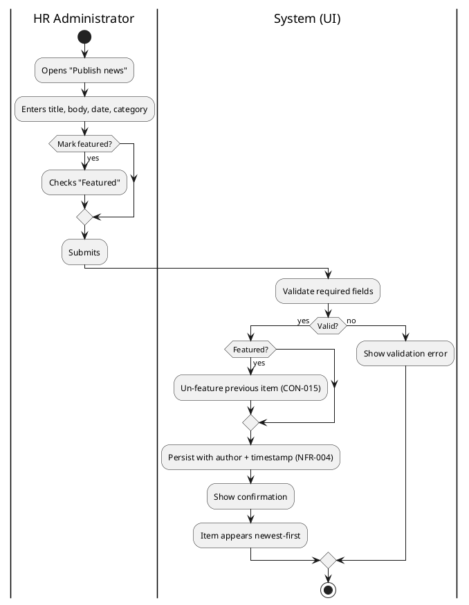
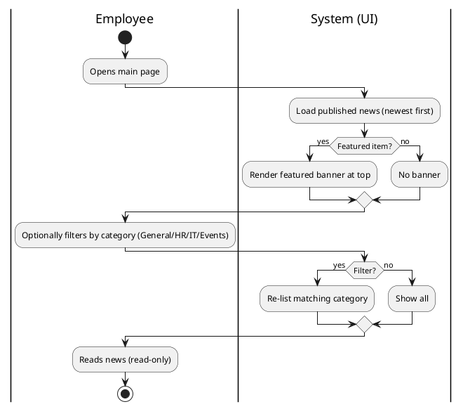
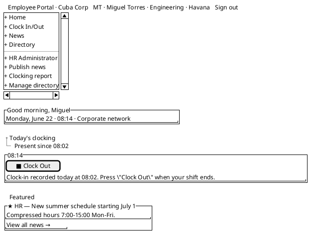
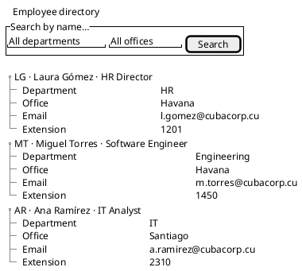
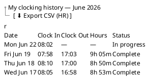
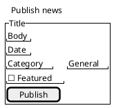

## Document Control
| Field | Value |
|---|---|
| Phase | Elaboration |
| Status | Draft |
| Milestone Target | End-of-Elaboration (Lifecycle Architecture) — NOT YET ACHIEVED |

## Design Overview

This Design Model is co-authored: the **Designer** owns the Domain Model, Use-Case Realizations,
Design Packages and Classes, Interface Contracts, Persistent Data Classes, and Capsules/Protocols/Signals
sections; the **Database Designer** contributes the persistent-data detail; the **User Interface Designer**
owns the **Boundary Classes and Navigation Map** section (this contribution) and the UI Patterns.

This Elaboration Iter-1 contribution by the User Interface Designer delivers the **use-case storyboards**:
the user-interface realization of the critical use-case flows, for stakeholder validation against the
custom design reference (`docs/inputs/employee-portal-design.html`, CON-008). The User-Interface Prototype
optional artifact is **not triggered** this iteration (no UX-critical trigger fired per the Development
Case §5.2), so the interaction design — navigation topology, per-UC storyboard swimlanes, and Salt
wireframes — lives here in the Design Model's Boundary Classes and Navigation Map section.

## Domain Model

*Owned by the Designer — pending Elaboration contribution. The candidate persistent entities are
sketched in the Software Architecture Document (Data View): Clocking, Clocking correction/insertion
audit, News, News audit, Worker category mapping, Category audit.*

## Use-Case Realizations

*Owned by the Designer — pending Elaboration contribution. The storyboards below are the UI-layer
realization of UC-001, UC-008, UC-003, and UC-004; the Designer's class-level realizations follow.*

## Design Packages and Classes

*Owned by the Designer — pending Elaboration contribution.*

## Interface Contracts

*Owned by the Designer — pending Elaboration contribution.*

## Persistent Data Classes

*Owned by the Designer / Database Designer — pending Elaboration contribution.*

## Boundary Classes and Navigation Map

> **Contribution by the User Interface Designer (Elaboration Iter-1).** These storyboards are the
> user-interface realization of the critical use-case flows — the direct translation of each use
> case's flow of events into observable screen sequences. Every screen, transition, and wireframe
> traces to the custom design reference (`docs/inputs/employee-portal-design.html`, CON-008) — the
> authoritative visual layer. The design tokens (brand-900 `#0B3D5C` header, accent `#17A398`
> clock-in, danger `#C0392B` clock-out, warn `#E6A817` featured banner), the topbar + sidebar shell,
> the card grid, the category chips, and the person-card directory layout are all taken verbatim
> from that reference.

### Navigation Topology (screen state machine)

The formal definition of every screen in the portal and the conditions under which navigation
transitions fire. Every screen is a state; every user action causing a screen change is a directed
edge with a guard condition. HR-only screens are gated by AD group membership (NFR-005).

**Navigation completeness check:** every screen is reachable from Home; the only terminal state is
`Login` (via "Sign out"); no dead-end screens — every HR action screen returns to its parent list
(Pub/Edit → News, Mgr → Dir, Corr → Hist, Rep → Hist). The offline-retry path (AC-005) and the
"no connection" message for directory/news are transient states rendered within Home/News/Dir, not
separate screens.

### Storyboard — UC-001 Clock In/Out (primary screen)

### Storyboard — UC-008 Search Directory

### Storyboard — UC-003 Publish News

### Storyboard — UC-004 Read & Filter News

### Wireframes — primary screens (Salt)

**Home (clocking widget + featured news):**

**Directory (person cards):**

**Clocking history (table):**

**Publish news (HR form):**

### Storyboard coverage and validation notes

| UC | Storyboard | Wireframe | Notes |
|---|---|---|---|
| UC-001 Clock In/Out | ✓ swimlane | ✓ Home + history | Button toggles In/Out; offline-retry (AC-005) is a transient state, not a screen |
| UC-008 Search Directory | ✓ swimlane | ✓ Directory | AD gap (R001) renders blank field; ≤ 10 s lookup (AC-003) |
| UC-003 Publish News | ✓ swimlane | ✓ Publish form | Featured checkbox triggers CON-015 un-feature |
| UC-004 Read & Filter News | ✓ swimlane | ✓ Home (banner) | Featured banner + category chips; read-only |

The remaining UCs (UC-002, UC-005…UC-007, UC-009…UC-012) reuse the same screens and interaction
patterns already storyboarded: UC-002/UC-011/UC-012 operate on the Clocking History screen;
UC-005/UC-006/UC-007 operate on the News screen; UC-009/UC-010 operate on the Directory screen.
Their flows are fully specified in the Use-Case Model's Use-Case Specifications section with
activity diagrams; no new screen is introduced by them, so no additional storyboard is required.

**Validation feedback (this iteration):** storyboards are presented to stakeholders for validation
against the custom design reference (CON-008). Feedback is captured in the Review Record at the
end of this iteration and folded into the next iteration's storyboards.

## Capsules, Protocols and Signals

*Owned by the Designer — pending Elaboration contribution.*

## Traceability

| Element | Traces From | Link Type | Traces To |
|---|---|---|---|
| Navigation Topology (screens) | UC-001…UC-012, CON-008 | Derives | Boundary Classes (Designer, pending) |
| Storyboard UC-001 | UC-001, FR-001, CON-021, AC-005 | Derives | Clocking subsystem (SAD) |
| Storyboard UC-008 | UC-008, FR-008, CON-007, R001 | Derives | Directory subsystem (SAD) |
| Storyboard UC-003 | UC-003, FR-003, CON-015, NFR-004 | Derives | News subsystem (SAD) |
| Storyboard UC-004 | UC-004, FR-004, CON-015 | Derives | News subsystem (SAD) |
| Wireframes (Home/Directory/History/Publish) | CON-008 (custom design reference) | Derives | Implementer (Construction) |
