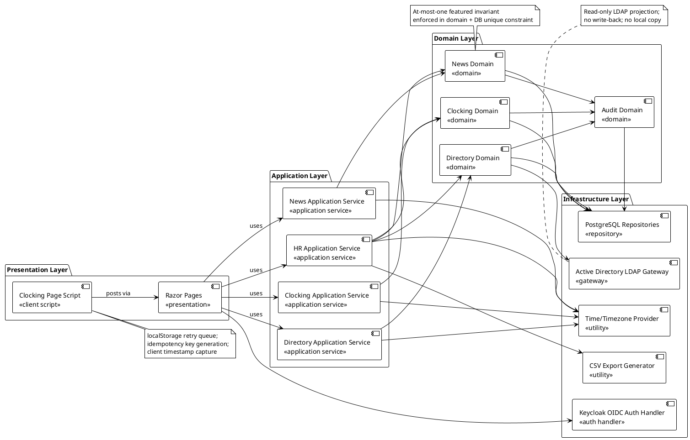
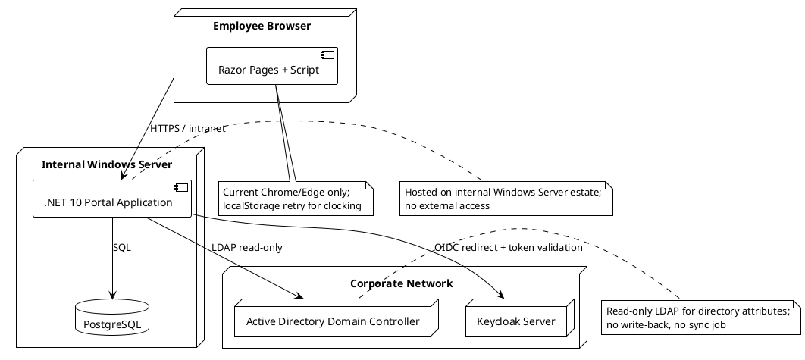

## Document Control

| Field | Value |
|---|---|
| Project | Portal |
| Phase | Inception |
| Iteration | 1 |
| Status | Draft |
| Milestone Target | End-of-Inception review (LCO) |

## Architectural Representation

This document presents the candidate architecture for the Cuba Corp Employee Portal. It is a sketch-level baseline for Inception, not a fully elaborated architecture. The architecture is expressed through the 4+1 views; in this iteration the Logical and Deployment views are sketched, while the Use-Case, Process, Implementation, and Data views are outlined with enough detail to guide Elaboration.

## Architectural Goals and Constraints

### Goals

| ID | Goal | Source |
|---|---|---|
| AG-001 | Provide a single internal web application for clocking, HR news, and corporate directory | Vision |
| AG-002 | Replace Excel sheets, mass emails, and PDF directory with auditable, centralized processes | BG-001, BG-002 |
| AG-003 | Achieve 80% employee adoption for clocking within 3 months of go-live | BG-003 |
| AG-004 | Maintain two-level authorization derived from AD group membership | NFR-006 |
| AG-005 | Preserve audit trails for news lifecycle, worker category changes, and clocking corrections | NFR-004, NFR-005, FR-007 |
| AG-006 | Survive up to 5-minute network outage for clocking via localStorage retry | NFR-007, AC-005 |

### Constraints

The full set of declared constraints is reproduced below for traceability. See the Work Order for authoritative detail.

| ID | Constraint | Category | Architectural Implication |
|---|---|---|---|
| CON-001 | Backend: .NET 10, REST API | Technical | Application built on ASP.NET Core 10; REST endpoints for clocking POST and CSV export |
| CON-002 | Frontend: Razor Pages (intranet, no SPA) | Technical | Server-rendered pages; page-level JavaScript only where required (clocking retry) |
| CON-003 | Database: PostgreSQL | Technical | Persistence layer targets PostgreSQL via EF Core provider |
| CON-004 | Keycloak already running and maintained separately | Architectural | Portal is OIDC client only; no Keycloak deployment or provisioning work |
| CON-005 | OIDC client already registered in Keycloak | Architectural | Authentication integration can be tested from day one |
| CON-006 | Directory read directly from AD over LDAP | Architectural | Directory data projected from AD on demand; no local copy |
| CON-007 | Hosting: internal Windows Server | Environmental | Single-server deployment on existing Windows Server estate |
| CON-008 | No access from outside corporate network | Operational | No external-facing security design required |
| CON-009 | Compatible with current Chrome and Edge only | Technical | localStorage retry logic targets these browsers |
| CON-010 | Employee data read from AD on demand, never copied | Architectural | Portal DB stores only AD user id + worker category |
| CON-011 | AD operated by Infrastructure team; portal does not administer it | Operational | Read-only LDAP integration; no AD write-back |
| CON-012 | No writing back to AD; AD fields read-only | Architectural | Directory service is a read-only projection |
| CON-013 | Infrastructure team operates portal post-launch | Operational | Deployment and handover planned for Transition |
| CON-014 | No data migration; portal starts empty | Business Rule | Clocking history begins at go-live |
| CON-015 | Custom design at `docs/inputs/employee-portal-design.html` is mandatory | Technical | UI visual layer follows committed design |
| CON-016 | Existing server-backup practice covers PostgreSQL | Operational | No backup design in project scope |
| CON-017 | Worker categories: closed list of four values | Business Rule | Category modeled as enumeration/closed value set |
| CON-018 | Worker category descriptive only; does not drive access control | Business Rule | Authorization uses AD group claims, not worker category |
| CON-019 | At most one featured news item at any moment | Business Rule | Invariant enforced in domain + DB unique constraint |
| CON-020 | Original clocking records never overwritten or deleted | Business Rule | Corrections create new audited entries |
| CON-021 | All offices in Europe/Madrid timezone | Business Rule | Clockings stored UTC, displayed/exported Europe/Madrid |

## Use-Case View

The Use-Case View validates that the architecture can support the architecturally significant use cases identified in the Use-Case Model. The four detailed use cases drive the candidate architecture:

| Priority | Use Case | Architectural Significance | Risk Addressed |
|---|---|---|---|
| 1 | UC-003 Clock In / Clock Out | Client timestamp, idempotency, localStorage retry | R005 localStorage edge cases; NFR-007; AC-005 |
| 2 | UC-012 Search Corporate Directory | AD LDAP read-on-demand projection; worker category join | R001 AD attribute gaps; CON-010; CON-012 |
| 3 | UC-007 Correct or Insert Clocking | Audit trail; immutable original records; correction entries | CON-020; NFR-004 |
| 4 | UC-008 Publish News Item | At-most-one featured invariant; audit trail | R007 featured invariant; CON-019; NFR-004 |

The remaining use cases (UC-001, UC-002, UC-004..UC-006, UC-009..UC-011) are supported by the same subsystems and mechanisms but do not introduce new architectural concerns.

## Logical View

The candidate logical architecture is a layered application following a simplified Clean Architecture / layered style. Subsystems are grouped by layer and by area of change, not by feature.

### Subsystem Responsibilities

| Subsystem | Layer | Responsibility | Encapsulated Volatility |
|---|---|---|---|
| Razor Pages | Presentation | Server-rendered UI pages; form posts; page-level scripts | UI rendering technology (Razor Pages per CON-002) |
| Clocking Page Script | Presentation | Client-side retry queue, idempotency key, timestamp capture | Browser storage/ retry mechanism |
| Clocking Application Service | Application | Orchestrate clock-in/out, history, correction/insertion | Clocking workflow coordination |
| News Application Service | Application | Orchestrate publish, edit, unpublish, browse, feature | News workflow coordination |
| Directory Application Service | Application | Orchestrate directory search and worker category projection | Directory read coordination |
| HR Application Service | Application | Orchestrate HR-specific operations: all-clockings view, CSV export, corrections | HR reporting workflow coordination |
| Clocking Domain | Domain | Clocking entity, idempotency rules, correction/insertion logic | Clocking business rules (CON-020, CON-021) |
| News Domain | Domain | News entity, featured invariant, publish state machine | News business rules (CON-019, NFR-004) |
| Directory Domain | Domain | Directory entry projection, worker category mapping | Directory projection rules |
| Audit Domain | Domain | Audit entry abstraction, author/timestamp capture | Audit recording rules (NFR-004, NFR-005) |
| PostgreSQL Repositories | Infrastructure | EF Core / Dapper persistence for portal-owned entities | Database access technology (PostgreSQL per CON-003) |
| Active Directory LDAP Gateway | Infrastructure | Read-only LDAP queries for employee attributes | AD access technology / schema |
| Keycloak OIDC Auth Handler | Infrastructure | OIDC authentication, AD group claims → roles | Authentication provider (Keycloak per CON-004) |
| CSV Export Generator | Infrastructure | Generate monthly CSV with defined columns/timezone | Export format (FR-006) |
| Time/Timezone Provider | Infrastructure | Europe/Madrid conversion, UTC storage | Timezone handling (CON-021) |

### Analysis Mechanisms

The following mechanisms are identified at analysis level (capability + properties). Product selections are recorded only where the stakeholder declared them.

| Mechanism | Capability | Properties | Declared Product / Version | ADR |
|---|---|---|---|---|
| Persistence | Store portal-owned data (clockings, news, categories, audit) durably | Relational, ACID, backup covered by existing ops | PostgreSQL (CON-003); provider TBD | ADR-001 |
| Authentication | Verify user identity and obtain AD group claims | OIDC, token validation, role derivation | Keycloak OIDC client (CON-004, CON-005); ASP.NET Core OpenIdConnect 10.0.12 | ADR-002 |
| Directory Projection | Read employee attributes from AD on demand | Read-only LDAP, no write-back, no local copy | Active Directory LDAP (CON-006) | ADR-003 |
| Authorization | Enforce two-level access control | AD group → HR/Employee role, no role matrix | AD group claims (NFR-006) | ADR-004 |
| Audit Logging | Record author/timestamp for news, category, and clocking changes | Immutable append-only entries | PostgreSQL audit table(s) | ADR-005 |
| Clocking Resilience | Survive short network outage for clocking | localStorage queue, 5-minute retry, idempotency | Browser localStorage + idempotency key (NFR-007) | ADR-006 |
| CSV Generation | Export monthly clocking report | Defined column order, Europe/Madrid local time | In-process CSV writer | ADR-007 |
| Timezone Handling | Store UTC, display/export Europe/Madrid | Single timezone, no normalization | TimeZoneConverter / Noda Time TBD | ADR-008 |

## Process View

The Process View is intentionally lightweight in Inception. The portal is a single-process ASP.NET Core application hosted on one Windows Server. Concurrency is handled by the ASP.NET Core request pipeline; there are no background services, no message queues, and no distributed processes in the declared scope.

Key runtime processes:

- **HTTP request handling:** ASP.NET Core worker process serves Razor Pages and REST endpoints.
- **OIDC authentication flow:** Redirect to Keycloak, token validation, claims transformation.
- **LDAP directory query:** Synchronous read from AD during directory page rendering.
- **Clocking retry:** Client-side JavaScript event loop in the browser; no server-side retry process.

[OMITTED: detailed activity / sequence diagrams for Process view — not required for Inception sketch; will be elaborated in Elaboration if concurrent or distributed concerns emerge.]

## Deployment View

The deployment topology is a single internal Windows Server with external authentication and directory services already operated by the Infrastructure team.

### Deployment Notes

- The portal application and PostgreSQL run on the same internal Windows Server (CON-007).
- Keycloak and AD are existing corporate services maintained by the Infrastructure team (CON-004, CON-006, CON-011).
- No cloud deployment, no load balancer, no container orchestration in scope.
- Backup is handled by existing Infrastructure practice (CON-016).

## Implementation View

The implementation view is sketched at a high level for Inception. The repository structure will be defined in Elaboration by the Implementer and ConfigurationManager.

Proposed layers (mapped to .NET projects):

| Project | Responsibility |
|---|---|
| Portal.Web | ASP.NET Core Razor Pages + OIDC setup |
| Portal.Application | Application services and DTOs |
| Portal.Domain | Domain entities, value objects, invariants |
| Portal.Infrastructure | EF Core repositories, LDAP gateway, CSV generator, time provider |

This structure will be refined in Elaboration based on team preference and build constraints.

## Data View

The Data View is intentionally high-level in Inception. The Database Designer will produce the formal Data Model artifact (triggered by the Development Case). The portal-owned data consists of:

- **Worker category mapping:** AD user id → category value (closed list).
- **Clocking events:** employee id, event type (in/out), client timestamp (UTC), idempotency key, server received timestamp.
- **Clocking corrections/insertions:** reference to original event (if any), author, timestamp, previous value, new value, reason.
- **News items:** title, body, date, category, featured flag, published flag, author, timestamps.
- **Audit entries:** author, timestamp, action, entity type, entity id, serialized change details.

Active Directory attributes are not stored; they are projected at read time.

## Size and Performance

### Size

- Target user population: 200 employees across 3 offices.
- Expected data volume: low (hundreds of clockings per month, tens of news items).
- Single-server deployment is proportionate to declared scope.

### Performance

| Requirement | Target | Architectural Tactic |
|---|---|---|
| NFR-001 Page load < 3 seconds | All pages on corporate network | Server-rendered Razor Pages; minimal client scripts; AD directory query must complete within target |
| NFR-002 Clock in/out < 1 second | Button press to confirmation | Lightweight POST endpoint; idempotency check by key; no heavy joins |
| AC-003 Directory lookup < 10 seconds | Find colleague phone/email | AD LDAP query on demand; portal-side filtering; worker category join from PostgreSQL |

Performance testing conditions will be quantified in Elaboration.

## Quality

### Quality Attributes and Tactics

| Quality Attribute | Source | Architectural Tactic |
|---|---|---|
| Security | NFR-006, CON-004, CON-005 | OIDC via Keycloak; AD group claims → HR/Employee role; no custom permission model |
| Auditability | NFR-004, NFR-005, FR-007 | Append-only audit entries; original clocking records immutable; news edits versioned |
| Reliability | NFR-007, AC-005 | localStorage retry queue with idempotency; server accepts client timestamp |
| Maintainability | CON-001, CON-002 | Layered architecture; domain logic isolated from UI and infrastructure |
| Usability | CON-015, AC-004 | Mandatory custom design; simple clocking page |
| Deployability | CON-007, CON-013 | Single-server .NET application; handover to Infrastructure team |

## ADRs

### ADR-001 Persistence Mechanism — PostgreSQL

- **Context:** The portal must durably store portal-owned data (clockings, news, categories, audit). The stakeholder declared PostgreSQL (CON-003) and .NET 10 (CON-001).
- **Decision:** Use PostgreSQL as the relational database, accessed via Entity Framework Core with the Npgsql provider version 10.0.3.
- **Alternatives considered:** Dapper (more control, more boilerplate); raw ADO.NET (too low-level for this scope). EF Core is proportionate for a data-centric intranet with standard CRUD and audit patterns.
- **Trade-offs:** EF Core increases abstraction and change-tracking overhead; acceptable for low-volume intranet. Dapper would be chosen if query complexity or performance became critical.
- **Consequences:** Provider version pinned to 10.0.3 per version policy. Migrations managed in code. Backup responsibility remains with Infrastructure team (CON-016).

### ADR-002 Authentication Mechanism — Keycloak OIDC

- **Context:** The portal needs to authenticate users and know whether they belong to the HR AD group. Keycloak is already deployed and federated to AD (CON-004, CON-005).
- **Decision:** Use ASP.NET Core OpenIdConnect 10.0.12 to register the portal as an OIDC client of the existing Keycloak instance. Role claims are read from the token and mapped to HR/Employee roles.
- **Alternatives considered:** Windows Integrated Authentication (would bind us to AD directly and complicate browser/Keycloak separation); custom login form (violates CON-004).
- **Trade-offs:** OIDC redirect adds a round-trip but delegates identity management to the existing corporate provider.
- **Consequences:** Version pinned to 10.0.12 per version policy. STK-003 must confirm the HR AD group claim name and client credentials (R003).

### ADR-003 Directory Projection Mechanism — Read-Only LDAP

- **Context:** Directory data lives in AD; the portal must display AD-sourced fields plus the portal-owned worker category (CON-006, CON-010, CON-012).
- **Decision:** Query AD over LDAP on demand for each directory request and join results with the worker category stored in PostgreSQL.
- **Alternatives considered:** Local copy/sync job (explicitly excluded by CON-010); Keycloak as directory source (CON-006 says directory is read from AD, not Keycloak).
- **Trade-offs:** On-demand LDAP queries depend on AD availability and attribute population; no sync complexity.
- **Consequences:** Directory page performance depends on AD latency; R001 must be retired by prototyping AD attribute fill rates in Elaboration.

### ADR-004 Authorization Mechanism — AD Group Claims

- **Context:** Two authorization levels are required: HR administrators and employees (NFR-006). No role matrix or permission administration screen.
- **Decision:** Map membership of a designated HR AD group to the HR role; all authenticated users receive the Employee role.
- **Alternatives considered:** Worker category driving access (explicitly excluded by CON-018); portal-managed roles table (adds admin UI not in scope).
- **Trade-offs:** Simplest implementation matching declared constraints; requires Infrastructure team to maintain HR group membership.
- **Consequences:** Authorization logic is centralized in a claims transformation / policy handler.

### ADR-005 Audit Mechanism — Append-Only Audit Entries

- **Context:** Audit trails are required for news lifecycle, worker category changes, and clocking corrections (NFR-004, NFR-005, FR-007, CON-020).
- **Decision:** Store audit entries in PostgreSQL as append-only records containing author, timestamp, action, entity type, entity id, and serialized change details.
- **Alternatives considered:** Separate audit database (overkill for this scale); event sourcing (excluded by scope and complexity).
- **Trade-offs:** Append-only relational table is simple to query and back up; may grow over time but volume is low.
- **Consequences:** Audit records are never updated or deleted; retention follows Infrastructure backup policy.

### ADR-006 Clocking Resilience Mechanism — localStorage Retry + Idempotency

- **Context:** Clocking must survive up to 5-minute network outages (NFR-007, AC-005). The server accepts the client-sent timestamp and rejects duplicates by idempotency key.
- **Decision:** Implement a client-side retry queue in the clocking page script using localStorage. Each button press captures the client timestamp and generates an idempotency key. The script retries POST for up to 5 minutes, then stops and instructs the employee to report to HR.
- **Alternatives considered:** Service Worker / PWA (explicitly excluded by scope statement); server-side queue (requires background process not declared).
- **Trade-offs:** localStorage is simple but has edge cases in private browsing and storage quotas (R005).
- **Consequences:** Must test in Chrome/Edge normal and private modes; storage-quota handling required.

### ADR-007 CSV Export Mechanism — In-Process CSV Generation

- **Context:** HR exports a monthly clocking report with exact columns and Europe/Madrid local time (FR-006).
- **Decision:** Generate the CSV in-process in the HR application service using a streaming CSV writer.
- **Alternatives considered:** Background job + file storage (adds infrastructure); third-party reporting service (out of scope).
- **Trade-offs:** In-process generation is simple for low-volume monthly exports; memory use is bounded by month + employee count.
- **Consequences:** Export endpoint must set correct content-type and filename; timezone conversion applied before writing.

### ADR-008 Timezone Handling Mechanism — Europe/Madrid Conversion

- **Context:** All offices are in Europe/Madrid (CON-021). Clockings are stored UTC and displayed/exported in Europe/Madrid.
- **Decision:** Use a dedicated time provider abstraction that converts between UTC and Europe/Madrid for display and export.
- **Alternatives considered:** Noda Time (richer API, extra dependency); built-in TimeZoneInfo (sufficient for single-zone case).
- **Trade-offs:** Built-in TimeZoneInfo is available in .NET 10 with no extra dependency; Noda Time may be chosen if timezone logic becomes more complex.
- **Consequences:** Decision pending until Elaboration; current recommendation is TimeZoneInfo with clear abstraction boundary so the provider can be swapped.

## PoC Plan (Elaboration)

The following technical risks are candidates for empirical validation in Elaboration. The Development Case currently does not trigger a standalone Architectural Proof-of-Concept in Inception; these risks will be re-evaluated at the start of Elaboration.

| Risk | PoC Scope | Success Criteria | Owner |
|---|---|---|---|
| R001 AD LDAP attribute gaps | Directory prototype reads all six AD attributes for a sample from each office and reports fill rates | ≥90% fill rate for job title and extension, or documented gap + plan | Software Architect |
| R003 Keycloak OIDC / AD group claims | Spike: portal authenticates via Keycloak and reads HR group claim | Token contains claim; role mapping works end-to-end | Software Architect |
| R005 localStorage retry edge cases | Prototype clocking page script with retry queue; test normal + private browsing on Chrome/Edge | Retry succeeds after simulated outage; graceful handling of storage failure | Software Architect / Implementer |
| R007 News featured invariant | Prototype news service ensuring at most one featured item via domain + DB constraint | Concurrent publish/edit operations never leave >1 featured item | Software Architect / Designer |

## Traceability

| Element | Traces From | Link Type | Traces To |
|---|---|---|---|
| SAD | UC-003, UC-007, UC-008, UC-012 | Derives | COMP-001..COMP-015 |
| AG-001 | Vision | Refines | SAD |
| AG-002 | BG-001, BG-002 | Refines | SAD |
| AG-003 | BG-003 | Refines | SAD |
| AG-004 | NFR-006 | Refines | SAD |
| AG-005 | NFR-004, NFR-005, FR-007 | Refines | SAD |
| AG-006 | NFR-007, AC-005 | Refines | SAD |
| ADR-001 | CON-003 | Refines | Npgsql.EntityFrameworkCore.PostgreSQL 10.0.3 |
| ADR-002 | CON-004, CON-005, NFR-006 | Refines | Microsoft.AspNetCore.Authentication.OpenIdConnect 10.0.12 |
| ADR-003 | CON-006, CON-010, CON-012 | Refines | UC-012 |
| ADR-004 | NFR-006, CON-018 | Refines | UC-001, UC-002, UC-005..UC-010 |
| ADR-005 | NFR-004, NFR-005, FR-007, CON-020 | Refines | UC-007, UC-008, UC-009, UC-010, UC-001, UC-002 |
| ADR-006 | NFR-007, AC-005 | Refines | UC-003 |
| ADR-007 | FR-006 | Refines | UC-006 |
| ADR-008 | CON-021 | Refines | UC-003, UC-006, UC-007 |
| R001 PoC | R001 | DependsOn | UC-012 |
| R003 PoC | R003 | DependsOn | UC-001..UC-012 |
| R005 PoC | R005 | DependsOn | UC-003 |
| R007 PoC | R007 | DependsOn | UC-008, UC-009, UC-010 |
