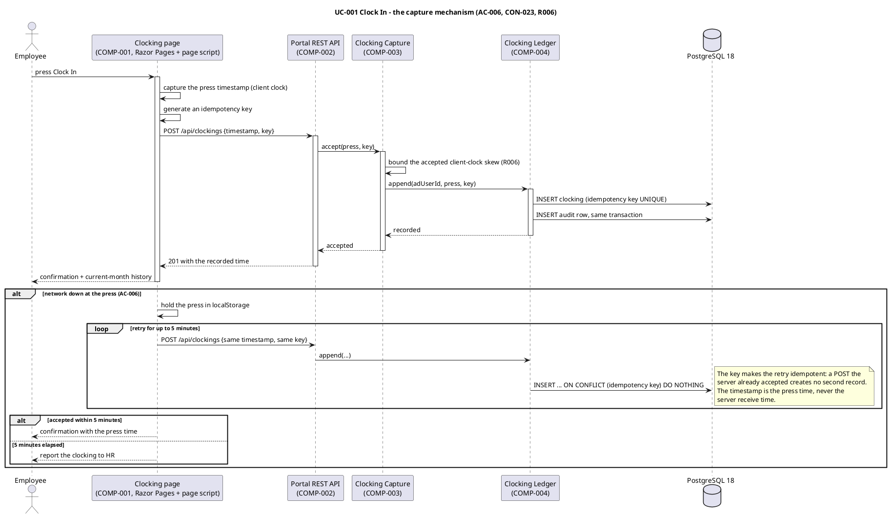
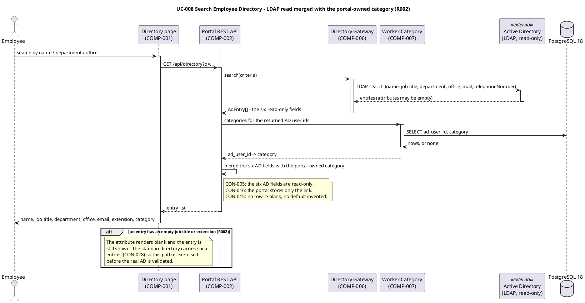
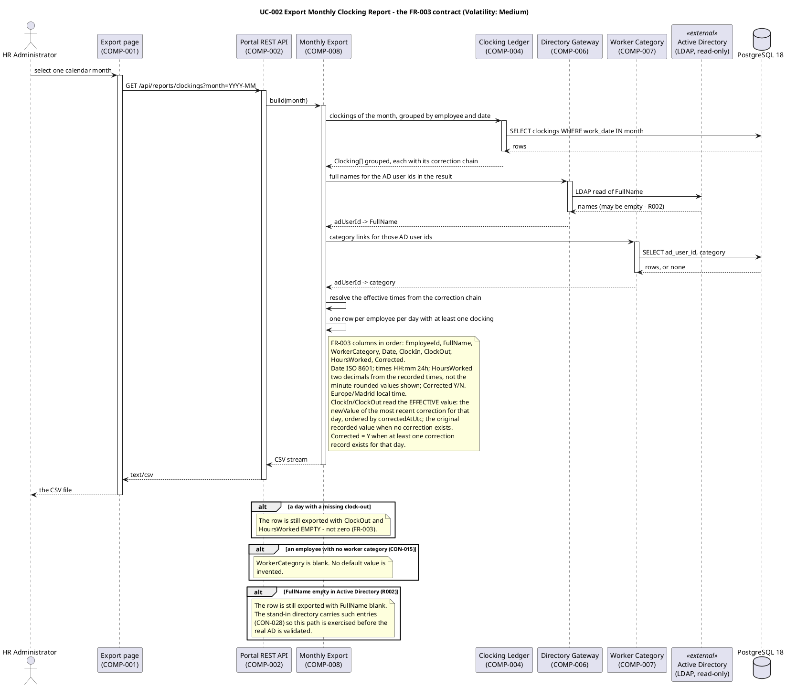
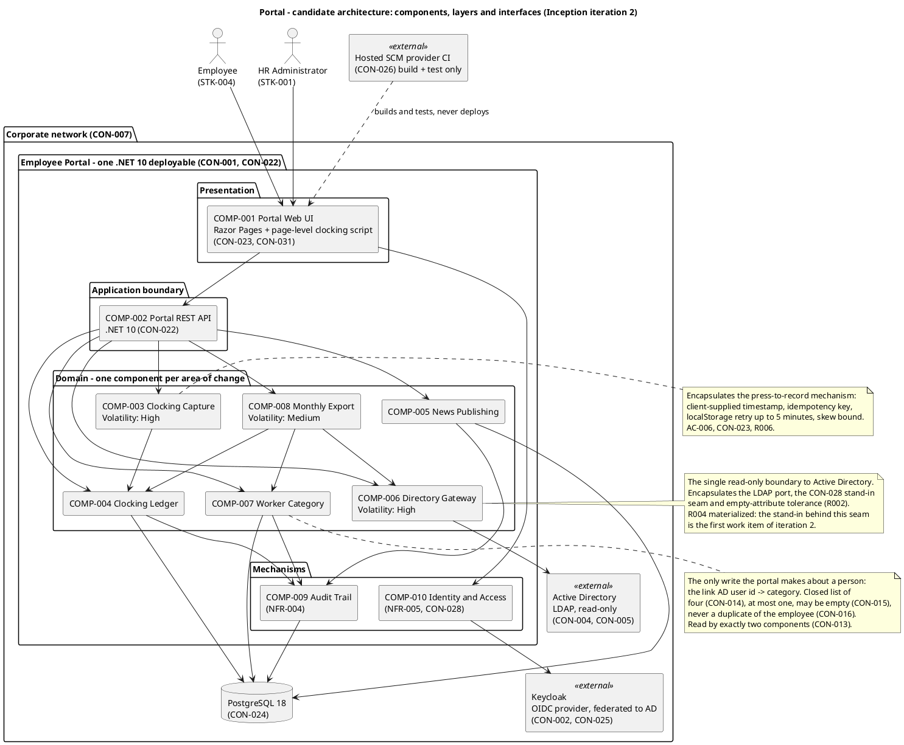
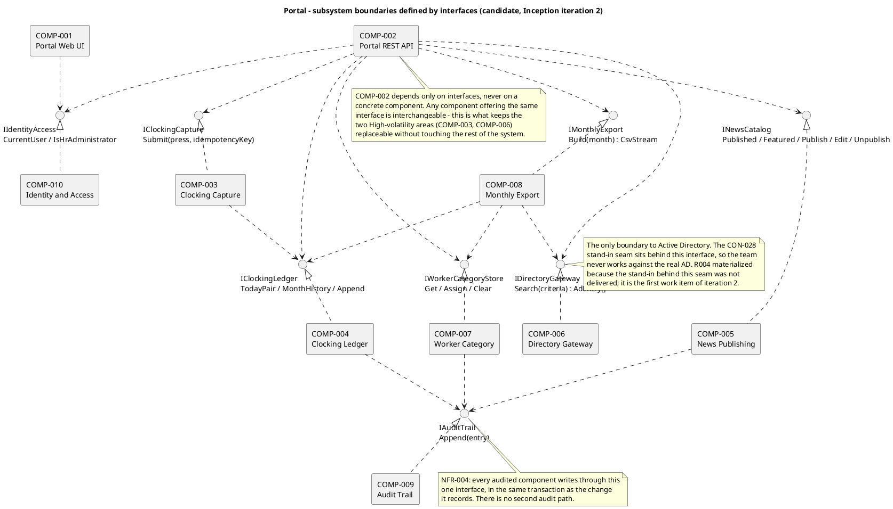
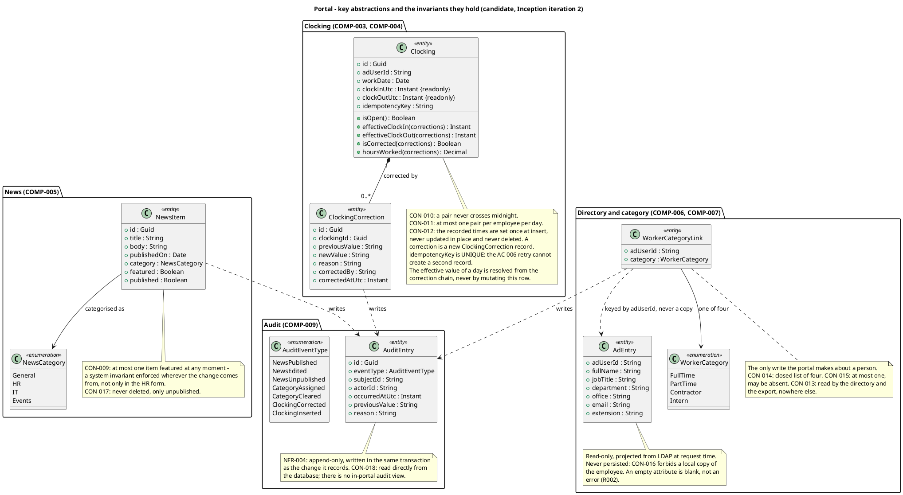
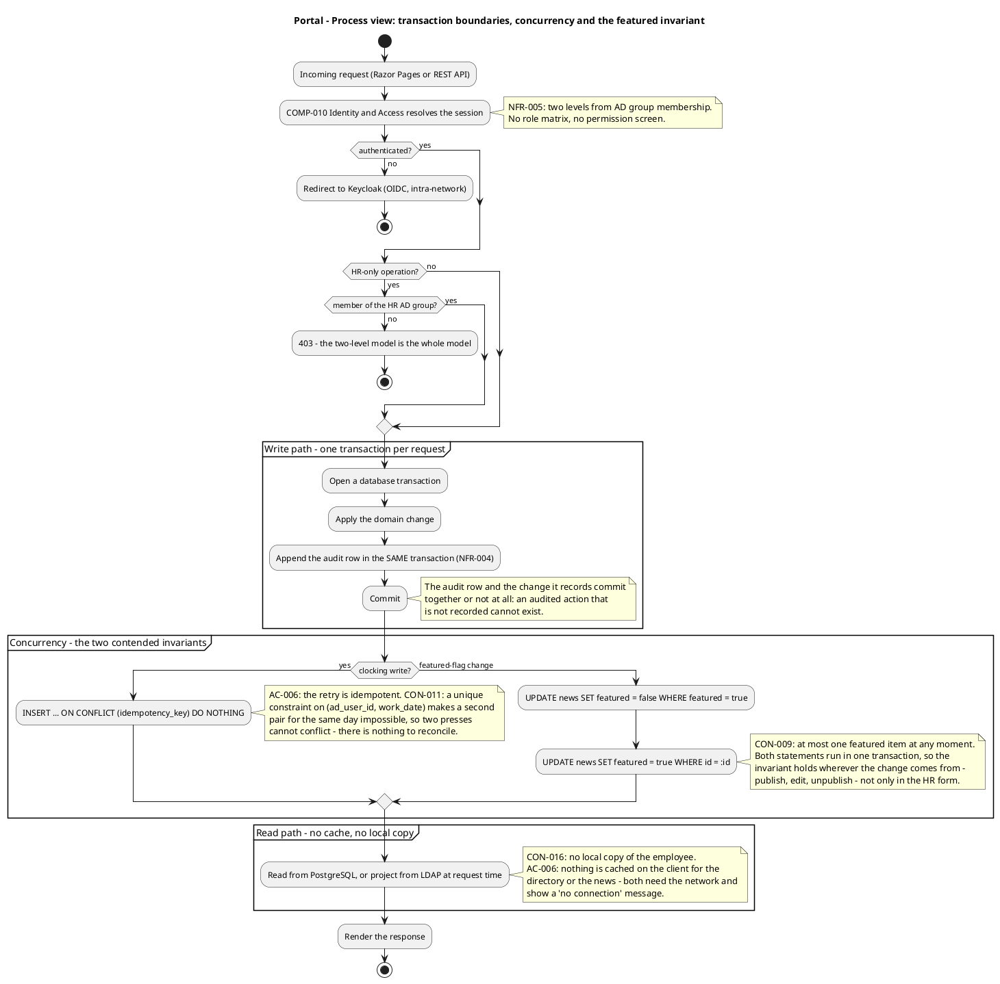
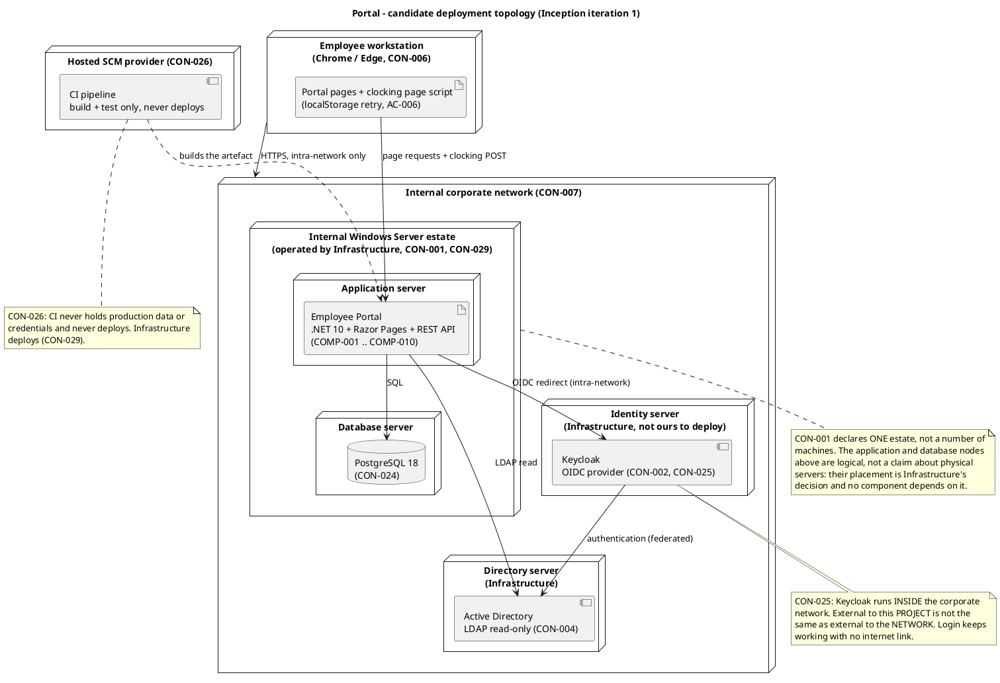

## Document Control
- **Phase:** Inception
- **Status:** Draft — iteration 2
- **Milestone Target:** Lifecycle Objectives (LCO) — end of Inception. NOT YET ACHIEVED.
## Architectural Representation
This document is the candidate architecture for Portal, produced in Inception iteration 2. It is a **sketch, not a baseline**: it fixes the architectural style, the subsystem decomposition, the mechanisms and the interfaces, and it surfaces the architectural risks that Elaboration must retire. The 4+1 views are addressed at the depth Inception requires — Logical and Deployment in full, Process and Implementation sketched, Data and Use-Case views carried far enough to validate the decomposition.

| View | Addressed this iteration | Primary diagram |
|---|---|---|
| Logical | Yes — decomposition, interfaces, key abstractions | Component diagram, interface diagram, class diagram |
| Process | Yes — transaction boundaries, the two contended invariants, fault tolerance | Process activity diagram |
| Deployment | Yes — nodes, connectors, environment mapping | Deployment diagram |
| Implementation | Sketched — layers, repository layout, build structure | Component diagram (layers) |
| Use-Case | Yes — the three architecturally significant use cases realized | Three sequence diagrams |
| Data | Sketched — entities, the invariants they hold, the correction-resolution rule | Class diagram |

**Architectural style.** A **layered, single-deployable application with an interface-separated domain**, decomposed by area of change rather than by feature. One .NET 10 process serves Razor Pages and the REST API; the domain is a set of components behind interfaces; PostgreSQL 18 is the only store. There is no message broker, no workflow engine, no rule engine, no anti-corruption layer and no distributed topology — the declared scope (9 use cases, 200 users, one internal network, one server estate) does not justify any of them, and CON-001/CON-022/CON-023/CON-024 fix the stack.

**Optional artifacts.** The Development Case records the Architectural Proof-of-Concept, the Deployment Model and the Data Model as not triggered. The deployment topology and the data view are therefore sections of this document, and no prototype is planned: no technical risk requires empirical validation, and the two risks with a technical mechanism (R002, R006) are retired by a design decision plus the CON-028 stand-in test.

### ADR-001 — Architectural style: layered single deployable, decomposed by area of change

**Context.** Nine declared use cases, 200 employees, three offices, one internal network, one Windows Server estate operated by Infrastructure (CON-001, CON-007, CON-029). Two of the nine use cases are annotated Volatility: High (UC-001, UC-008) and one Medium (UC-002).

**Decision.** A single .NET 10 deployable, layered Presentation → Application boundary → Domain → Mechanisms, where the Domain is decomposed into one component per **area of change** — not one per feature. The two High-volatility areas (clocking capture, directory read) each get a dedicated component behind an interface, so the mechanism most likely to change is replaceable without touching the rest of the system.

**Alternatives considered.**
- *Feature-per-component (Clocking Service, News Service, Directory Service).* Rejected: this is functional decomposition. A change to the clocking mechanism would ripple through the API, the export and the UI, because the feature boundary cuts across the change boundary. It also produces components that share the audit and category concerns with no home.
- *Microservices / distributed topology.* Rejected: 200 users on one internal network with one server estate. Distribution would add network failure modes, deployment complexity and operational burden for Infrastructure (CON-029) with no requirement to justify it. Architecture by buzzword.
- *Modular monolith with no interfaces.* Rejected: the two High-volatility areas would be reachable only as concrete types, so the CON-028 stand-in seam and the R002 empty-attribute behaviour could not be substituted or tested in isolation.

**Trade-offs.** A single deployable means one build, one deployment and one failure domain — acceptable because NFR-003 requires availability only 07:00–19:00 Monday–Friday with fault tolerance inside the corporate network, not 24/7. The cost is that a change to one component requires redeploying the whole application; the benefit is that Infrastructure operates one artefact, exactly as they already operate AD and Keycloak.

**Consequences.** The decomposition is stable against the changes the Use-Case Model predicts (clocking mechanism, LDAP data quality, CSV format) and the interfaces are the seams where those changes land.

### ADR-002 — Persistence: one PostgreSQL 18 instance, relational, with the invariants enforced in the schema

**Context.** The portal owns exactly three things: clockings, news, and the worker-category link (CON-016). CON-024 pins PostgreSQL 18, installed by Infrastructure on the existing estate. CON-030 states there is no data migration. CON-032 states backups are Infrastructure's existing practice.

**Decision.** One relational PostgreSQL 18 instance, one schema, with the declared business rules enforced as database constraints wherever a constraint can express them: a unique constraint on (ad_user_id, work_date) for CON-011, a unique constraint on the idempotency key for AC-006, and a partial unique index on the featured flag for CON-009. The audit table is append-only, and the clocking row's recorded times are never updated in place (CON-012) — a correction is a new row.

**Alternatives considered.**
- *Enforce the invariants only in application code.* Rejected: CON-009 says the featured invariant "must hold wherever the change comes from, not only in the HR form". A constraint holds it against every writer, including a future one; application code holds it only where the author remembered.
- *A document store for news.* Rejected: the news model is four scalar fields and a category from a closed list. A document store adds an operational component for Infrastructure to run with no requirement behind it.
- *A separate audit database.* Rejected: NFR-004 requires the audit to be written for compliance and read directly from the database. A second store would need its own transaction coordination to keep the audit and the change atomic, and CON-018 gives the audit no screen of its own.

**Trade-offs.** Database constraints make some failures surface as constraint violations rather than as friendly domain errors, so the API must translate them. In exchange, the invariants cannot be violated by any code path.

**Consequences.** The schema is the last line of defence for CON-009, CON-011 and AC-006. No ORM-level abstraction may bypass it.

### ADR-003 — Identity and directory: OIDC client of the existing Keycloak, LDAP read-only, both behind configuration-held stand-in seams

**Context.** CON-002 makes the portal an OIDC client of the existing Keycloak, which federates AD. CON-025 places Keycloak **inside** the corporate network. CON-004 forbids writing to AD. CON-005 makes the six directory fields read-only. CON-016 forbids any local copy of the employee. CON-028 requires the team to work against stand-ins, never the real systems, with placeholder values in configuration and never in code.

**Decision.** Two components own the two external boundaries and nothing else crosses them: **COMP-010 Identity and Access** owns the OIDC client, and **COMP-006 Directory Gateway** owns the LDAP read. Both read their connection settings from configuration. The directory is projected from LDAP at request time and is **never persisted** — the portal stores only the category link keyed by AD user id.

**Alternatives considered.**
- *Cache the directory locally to meet NFR-001.* Rejected: CON-016 forbids a local copy of the employee, and AC-006 forbids a client cache of the directory. The performance target is met by server-side rendering and indexed queries instead.
- *A synchronisation job from AD into a portal table.* Rejected: explicitly excluded by the declared scope — no sync job, no reconciliation screen, no conflict resolution.
- *Write the category back to AD as an attribute.* Rejected: CON-004 forbids modifying AD, and CON-016 makes the link the portal's own.

**Trade-offs.** Reading LDAP on every directory request costs latency and makes the directory only as available as AD. Accepted: it is the only design that satisfies CON-016, and R001 (a change on Infrastructure's side) is accepted in advance under CON-021.

**Consequences.** The CON-028 stand-in seam sits behind `IDirectoryGateway` and the OIDC client configuration, so every use case is buildable and testable without the real Keycloak or AD. R002's empty-attribute behaviour is a property of COMP-006 alone. R004 materialized because that stand-in was not delivered; the seam is unchanged and the stand-in behind it is the first work item of iteration 2.

### ADR-004 — Clocking capture: client-supplied timestamp with a server-verified idempotency key

**Context.** AC-006 requires that a clocking made while the network is down for up to 5 minutes is not lost, that the server accepts the timestamp the client sends (the time the employee pressed the button, not the time the server received it), and that duplicates are rejected by an idempotency key. CON-023 permits a page-level script on an already-rendered Razor Page. R006 records the risk that a skewed client clock records a timestamp that did not happen.

**Decision.** The clocking page script captures the press timestamp and generates an idempotency key, holds the press in localStorage on failure, and retries the POST for up to 5 minutes. The server accepts the client timestamp, **bounds the accepted skew**, and enforces the idempotency key with a unique constraint so a retry the server already accepted creates no second record. The mechanism is encapsulated in **COMP-003 Clocking Capture** alone.

**Alternatives considered.**
- *Server timestamp only.* Rejected: AC-006 states the server must accept the client timestamp, because a server timestamp would record a time at which the employee did not press the button — the audit trail would record something that did not happen.
- *A background sync queue or service worker.* Rejected: the declared scope excludes offline mode beyond the clocking retry, and excludes PWA and service worker. One action, one queue, one entity.
- *Accept any client timestamp without a skew bound.* Rejected: R006. An unbounded client clock would let a badly-set workstation write a clocking into the wrong day, breaking CON-010 and CON-011.

**Trade-offs.** A skew bound means a clocking from a badly-set workstation is rejected rather than recorded; the employee reports it to HR, who corrects it through UC-003 with a full audit entry. This is the declared remedy path.

**Consequences.** The retry is idempotent by construction, so there is nothing to reconcile and no conflict resolution to write. The skew bound is a design parameter the Designer fixes in Elaboration and the stand-in test exercises.

### ADR-005 — UI: server-rendered Razor Pages implementing the committed design, with one page-level script

**Context.** CON-023 declares Razor Pages and no SPA, and clarifies that "no SPA" does not mean no JavaScript. CON-031 makes `docs/inputs/employee-portal-design.html` mandatory and authoritative for the UI visual layer. AC-001 measures the full page load the employee experiences, including the clocking page's script.

**Decision.** Server-rendered Razor Pages for every screen, implementing the committed design. Exactly one page-level script, on the clocking page, for the AC-006 capture-and-retry mechanism. No client-side framework, no client-side router, no client cache of the directory or the news.

**Alternatives considered.**
- *A client-side SPA.* Rejected: CON-023 declares no SPA, and a framework bundle would work against AC-001's full-page-load measurement.
- *A client-side cache of the directory or news.* Rejected: AC-006 states nothing is copied locally for the directory or the news; both need the network and show a 'no connection' message.
- *A UI prototype to validate the design.* Rejected: CON-031 makes the design already decided and authoritative, and the Development Case records the User-Interface Prototype trigger as not fired.

**Trade-offs.** Server rendering means every interaction is a round trip; on the corporate network with NFR-002's one-second budget for clocking this is acceptable, and it keeps the page weight low for AC-001.

**Consequences.** The UI layer is thin and the visual layer is not a design decision this project takes — it is an input it implements.

## Architectural Goals and Constraints

### Goals

| Goal | Architectural response | Source |
|---|---|---|
| G-1 The clocking mechanism must be replaceable without touching the rest of the system | COMP-003 Clocking Capture behind `IClockingCapture`; the retry, the client timestamp and the idempotency key live nowhere else | UC-001 Volatility: High, AC-006 |
| G-2 The directory must survive inconsistently filled AD attributes | COMP-006 Directory Gateway behind `IDirectoryGateway`; an empty attribute renders blank and never removes the entry | UC-008 Volatility: High, R002 |
| G-3 The CSV export contract must be isolated | COMP-008 Monthly Export behind `IMonthlyExport`; the column set, order and formats live nowhere else | UC-002 Volatility: Medium, FR-003 |
| G-4 Employee data must have exactly one home | No employee table exists. COMP-006 projects from LDAP at request time; COMP-007 stores only the link | CON-016, CON-005 |
| G-5 Every audited action must be recorded atomically with the action | COMP-009 Audit Trail behind `IAuditTrail`; the audit row commits in the same transaction as the change | NFR-004 |
| G-6 The declared invariants must hold against every writer | Database constraints for CON-009, CON-011 and AC-006 | CON-009, CON-011, AC-006 |
| G-7 The team must never depend on the real Keycloak or AD | Two configuration-held seams: the OIDC client and `IDirectoryGateway` | CON-028 |
| G-8 The full page load must stay under 3 seconds | Server-rendered pages, one page-level script, no client framework, no client cache | NFR-001, AC-001 |

### Constraints

| Constraint | Architectural consequence |
|---|---|
| CON-001, CON-022 | One .NET 10 application on the internal Windows Server estate |
| CON-023 | Razor Pages; no client-side framework and no client-side router; a page-level script is permitted |
| CON-024 | PostgreSQL 18, patch level floating, major pinned |
| CON-002, CON-025 | The portal is an OIDC client of Keycloak, which runs **inside** the corporate network. The redirect is an intra-network call |
| CON-004, CON-005 | AD is read over LDAP and never written; the six directory fields are read-only |
| CON-007 | Reachable only from the internal corporate network |
| CON-008 | Clockings stored in UTC, displayed in Europe/Madrid; no multi-timezone case |
| CON-026 | CI runs on the hosted SCM provider, never holds production data or credentials, never deploys |
| CON-028 | Placeholder OIDC and LDAP values in configuration, never in code; stand-ins only |
| CON-029 | Infrastructure deploys, monitors and patches; the team hands over at the end of Transition |
| CON-031 | `docs/inputs/employee-portal-design.html` is authoritative for the UI visual layer |
| CON-032 | No backup design, tooling or restore procedure is part of this project |

### Technology stack

Every entry below is a technology the stakeholder declared. No technology is introduced that the stakeholder did not name, and no version is recorded that the version policy does not pin.

| Layer | Technology | Version | Source | Version policy |
|---|---|---|---|---|
| Backend | .NET | 10 | CON-022 | Pinned 10, ltsOnly false |
| Frontend | Razor Pages (ASP.NET Core, part of .NET 10) | 10 | CON-023 | Follows the .NET pin |
| Database | PostgreSQL | 18 | CON-024 | Pinned 18, ltsOnly false; patch level floats |
| Identity provider | Keycloak (existing, not deployed by this project) | — | CON-002, CON-025 | Not a project dependency; no version is pinned and none is recorded |
| Directory | Active Directory (existing, read-only) | — | CON-004, CON-005 | Not a project dependency; no version is pinned and none is recorded |
| CI | Hosted SCM provider CI | — | CON-026 | Not a project dependency; no version is pinned and none is recorded |

Keycloak, Active Directory and the CI service are **existing corporate systems the project consumes, not components it selects**. No version is pinned for them by the version policy, so none is recorded here — recording one would be inventing a version the stakeholder did not declare.

## Use-Case View
The Use-Case View validates every other view: each architecturally significant use case is realized as a sequence of interactions through the components of the Logical view, on the nodes of the Deployment view.

### Architecturally significant use cases — prioritized for the Project Manager

Priority is by architectural significance: risk retired, coverage of the architecture, and criticality to the declared goals. This list is the input the Project Manager plans Elaboration iterations from.

| Rank | Use case | Volatility | Why it is architecturally significant | Risk it addresses | Elaboration iteration |
|---|---|---|---|---|---|
| 1 | UC-001 Clock In and Clock Out | High | Forces the client-timestamp, idempotency-key and localStorage-retry decisions (AC-006), the page-level script (CON-023), the skew bound (R006), and the CON-011/CON-010 invariants. It is the use case BG-002 and BG-003 depend on | R006, R003, R004 | First |
| 2 | UC-008 Search Employee Directory | High | Forces the LDAP read, the merge with the portal-owned category link, and the empty-attribute behaviour that R002 is about. It is the use case AC-004 depends on | R002, R001, R004 | First |
| 3 | UC-002 Export Monthly Clocking Report | Medium | Forces the exact FR-003 contract and the AD read at export time (CON-016). It is the artefact that replaces the Excel sheet, so BG-001 depends on it | R002 | Second |
| 4 | UC-009 Assign or Clear Worker Category | Low | Exercises the only write the portal makes about a person, and the CON-014/CON-015/CON-016 invariants | — | Second |
| 5 | UC-005, UC-006, UC-007 Publish / Edit / Unpublish News | Low | Together they exercise the CON-009 featured invariant from three different entry points, which is why the invariant is enforced in the schema and not in the form | — | Second |
| 6 | UC-003 Correct or Insert a Clocking | Low | Exercises the append-only correction model and the NFR-004 audit contract | R006 (contingency) | Third |
| 7 | UC-004 Read Internal News | Low | Read path only; validates the no-cache rule of AC-006 | — | Third |

**Coverage check.** Every component in the Logical view is exercised by at least one of the three realized scenarios, and every node in the Deployment view carries traffic from at least one of them. No view exists without a use-case scenario exercising it.

**R004 gates this list.** Every use case below is built and tested against the CON-028 stand-ins, never against the real Keycloak or the real AD. R004 materialized in iteration 1 because the stand-in environment was not delivered, so no use case could be built or tested. The stand-in OIDC issuer and the stand-in directory are therefore the first work item of iteration 2, ahead of the use cases that depend on them.

### UC-001 Clock In and Clock Out — realization

### UC-008 Search Employee Directory — realization

### UC-002 Export Monthly Clocking Report — realization

## Logical View
### Decomposition — one component per area of change

The decomposition is by **area of change**, not by feature. Each component below encapsulates exactly one decision likely to change, and hides it from every other component. The two High-volatility areas of the Use-Case Model each own a component; the Medium-volatility area owns a third.

| Component | Responsibility | Area of change it encapsulates | Volatility | Interfaces offered | Interfaces used |
|---|---|---|---|---|---|
| COMP-001 Portal Web UI | Razor Pages screens implementing the committed design; the clocking page's page-level script | The UI visual layer (CON-031) and the page-level script (CON-023) | Medium | — | `IIdentityAccess`, `IClockingCapture`, `IClockingLedger`, `INewsCatalog`, `IDirectoryGateway`, `IWorkerCategoryStore`, `IMonthlyExport` |
| COMP-002 Portal REST API | The application boundary: routing, request validation, authorization checks, error translation | The HTTP contract between the pages and the domain | Medium | — | every domain interface |
| COMP-003 Clocking Capture | The press-to-record mechanism: client timestamp, idempotency key, skew bound, retry semantics | **The clocking capture mechanism** | **High** | `IClockingCapture` | `IClockingLedger` |
| COMP-004 Clocking Ledger | The clocking record: today's pair, month history, append, correction, the CON-010/CON-011 invariants | The clocking record model | Low | `IClockingLedger` | `IAuditTrail` |
| COMP-005 News Publishing | Publish, edit, unpublish, the featured flag, the CON-009 invariant, the CON-017 no-delete rule | The news lifecycle | Low | `INewsCatalog` | `IAuditTrail` |
| COMP-006 Directory Gateway | The single read-only boundary to Active Directory; the CON-028 stand-in seam; empty-attribute tolerance | **The LDAP read and its data-quality behaviour** | **High** | `IDirectoryGateway` | — |
| COMP-007 Worker Category | The link AD user id → category; the CON-014 closed list, CON-015 at-most-one, CON-016 link-only rules | The portal's only write about a person | Low | `IWorkerCategoryStore` | `IAuditTrail` |
| COMP-008 Monthly Export | The FR-003 contract: column set, order, formats, row rules, the AD read at export time | **The CSV export format** | **Medium** | `IMonthlyExport` | `IClockingLedger`, `IDirectoryGateway`, `IWorkerCategoryStore` |
| COMP-009 Audit Trail | Append-only audit write for the five audited events (NFR-004) | The audit record shape and its atomicity | Low | `IAuditTrail` | — |
| COMP-010 Identity and Access | The OIDC client, the session, the two-level authorization model (NFR-005), the CON-028 configuration seam | The identity integration and the authorization model | Medium | `IIdentityAccess` | — |

**Why this is not a feature list.** A feature decomposition would give "Clocking Service", "News Service", "Directory Service". Under that decomposition, a change to the clocking capture mechanism would ripple through the API, the export and the UI, because the feature boundary cuts across the change boundary. Here, the clocking capture mechanism is COMP-003 alone: the API, the export and the UI see only `IClockingCapture` and `IClockingLedger`, and neither changes when the capture mechanism does. The same holds for the LDAP read (COMP-006) and the CSV format (COMP-008).

**Why the mechanisms are components and not utilities.** COMP-009 Audit Trail and COMP-010 Identity and Access are architectural mechanisms: common solutions to common problems, used by many components. They are components because they have wide impact on structure and because NFR-004 and NFR-005 are system-wide requirements with no single use case owning them.

### Component diagram

### Interfaces — every subsystem boundary is an interface

No component depends on another component's concrete type. COMP-002 depends only on interfaces, so any component offering the same interface is interchangeable — this is what makes the two High-volatility areas replaceable without touching the rest of the system.

### Key abstractions

The analysis classes below are the architecturally significant ones — the business entities and the records that carry the declared invariants. They are not a complete design model; the Designer refines them into `CLS-NNN` design classes in Elaboration.

**The recorded times of a clocking are immutable.** CON-012 states the original record is never overwritten in place and never deleted. `Clocking.clockInUtc` and `Clocking.clockOutUtc` are therefore set once at insert and carry no setter; a correction is a new `ClockingCorrection` record, never an update to the clocking row. The `corrected` flag is not a field of `Clocking` either — it is derived from the existence of a correction record, so it cannot drift from the correction chain. The effective value of a day is resolved from that chain by the rule stated in the Data View.

## Process View

The portal is a single process serving concurrent requests. There is no background job, no scheduler and no message broker: the monthly CSV is exported on demand by HR, not on a schedule, and no time-triggered actor is declared.

### Transaction boundaries

Every write is one database transaction that contains both the domain change and its audit row. An audited action that is not recorded cannot exist, and a recorded action that did not happen cannot exist — the two commit together or not at all.

### The two contended invariants

Only two things in this system can be contended by concurrent requests, and both are held by the schema rather than by application locking:

| Invariant | Contention | Mechanism |
|---|---|---|
| CON-011 — at most one clocking pair per employee per calendar day | Two presses by the same employee, or a press and its AC-006 retry | Unique constraint on (ad_user_id, work_date); the retry is additionally idempotent by the unique idempotency key |
| CON-009 — at most one featured news item at any moment | Two HR users featuring different items, or a publish and an edit | Both statements run in one transaction; a partial unique index on the featured flag makes a second featured row impossible |

**Why there is nothing to reconcile.** AC-006 states it directly: one action, one queue, one entity. Two clocking presses by the same employee cannot conflict with anything, so there is no conflict resolution to write. The idempotency key makes the retry a no-op rather than a duplicate, and the day constraint makes a second pair impossible rather than a conflict to resolve.

### Fault tolerance

| Failure | Behaviour | Source |
|---|---|---|
| Corporate network down at the moment of a clocking press | The press is held in browser localStorage and the POST is retried for up to 5 minutes; the server accepts the press timestamp and rejects duplicates by the idempotency key. Beyond 5 minutes the employee reports the clocking to HR | AC-006, REL-001 |
| Network down for the directory or the news | A 'no connection' message. Nothing is copied locally, so there is nothing to cache and nothing to sync | AC-006, REL-002 |
| Active Directory unavailable | The directory and the export cannot read the six AD fields. The clocking path is unaffected — it never touches AD | CON-005, R001 |
| Keycloak unavailable | No session can be established, so no use case is reachable. Accepted in advance under CON-021; the remedy for a milestone delay is another iteration | CON-002, R001, CON-021 |
| Database unavailable | No read and no write. Infrastructure's existing server-backup practice covers restore (CON-032); no backup design is part of this project | CON-032 |

## Deployment View
The Development Case records the Deployment Model optional artifact as **not triggered** — the topology is a single application on the existing internal Windows Server estate, so deployment is a section of this document rather than an artifact of its own.

### Topology

One .NET 10 application and one PostgreSQL 18 instance, both on the internal Windows Server estate Infrastructure already operates (CON-001, CON-024, CON-029). Keycloak and Active Directory are existing corporate systems on the same internal network that the project neither deploys nor operates (CON-002, CON-025). The CI service is outside the runtime boundary entirely (CON-026).

**The physical placement of the application and the database within the estate is Infrastructure's decision, not this project's.** The stakeholder declared one estate (CON-001) and one PostgreSQL instance on it (CON-024); it did not declare how many machines that is. The diagram below therefore shows the application and the database as **logical nodes inside the estate**, not as a claim about the number of physical servers. Nothing in the architecture depends on the answer: the application reaches the database over the estate's own network, and no component is co-located with another for a performance or availability reason.

**CON-025 is load-bearing here.** Keycloak runs **inside** the corporate network. External to this *project* is not the same as external to the *network*: the OIDC redirect is an intra-network call, nothing about login crosses the corporate boundary, and login keeps working with no internet link. A deployment view that placed Keycloak in a cloud node would contradict CON-025 and be wrong.

### Nodes and connectors

| Node | Operated by | Hosts | Source |
|---|---|---|---|
| Employee workstation | The employee | A current Chrome or Edge browser; the clocking page's localStorage retry | CON-006, AC-006 |
| Application server (logical node in the estate) | Infrastructure (STK-003) | The single .NET 10 deployable — COMP-001..COMP-010 | CON-001, CON-029 |
| Database server (logical node in the estate) | Infrastructure (STK-003) | PostgreSQL 18 | CON-024, CON-032 |
| Identity server | Infrastructure (STK-003) | Keycloak, inside the corporate network | CON-002, CON-025 |
| Directory server | Infrastructure (STK-003) | Active Directory, read-only to the portal | CON-004, CON-005 |
| Hosted SCM provider | The provider | The CI pipeline — build and test only | CON-026 |

| Connector | Protocol | Crosses the corporate boundary? | Source |
|---|---|---|---|
| Browser → application | HTTPS | No — internal network only | CON-007 |
| Application → PostgreSQL | SQL | No | CON-024 |
| Application → Keycloak | OIDC redirect over HTTPS | **No** — Keycloak is inside the corporate network | CON-025 |
| Application → Active Directory | LDAP, read-only | No | CON-005 |
| Keycloak → Active Directory | Authentication, federated | No | CON-002 |
| CI → application artefact | Build and test only | The CI service is outside the runtime boundary; it never deploys and never holds production data or credentials | CON-026 |

### Environment mapping

| Environment | Where | Purpose | Data |
|---|---|---|---|
| Development and test | The team's environment, against stand-ins | Build and test every use case | Stand-in OIDC issuer and stand-in directory carrying the declared attributes, including entries with empty job title and extension (CON-028). No production data |
| CI | Hosted SCM provider | Build and test the artefact | No production data, no credentials, no deployment (CON-026) |
| Production | The internal Windows Server estate | The live portal | Real Keycloak and real AD values substituted by Infrastructure at deployment (CON-028, CON-029) |

There is no staging environment declared, and none is introduced. The human validation of the real Keycloak and real AD (CON-028) is performed by Infrastructure with HR against the production configuration, and its feedback reaches the team before Elaboration closes.

## Implementation View
### Layers and repository layout

The repository layout is the one already in place; this architecture does not fork a parallel tree.

| Layer | Repository location | Contents | Source |
|---|---|---|---|
| Presentation | `src/` | Razor Pages, the committed design's markup and styles, the clocking page's page-level script | CON-023, CON-031 |
| Application boundary | `src/` | The REST API controllers and the request/response contracts | CON-022 |
| Domain | `src/` | COMP-003..COMP-008, one namespace per component | This document |
| Mechanisms | `src/` | COMP-009 Audit Trail, COMP-010 Identity and Access | NFR-004, NFR-005 |
| Tests | `tests/` | Unit and integration tests, including the stand-in directory with empty-attribute entries | CON-028, R002 |
| CI | `.github/workflows/` | The build and test pipeline | CON-026 |
| Documentation | `docs/artifacts/`, `docs/inputs/` | The RUP artifacts and the authoritative UI design | CON-031 |

**Build structure.** One solution, one deployable artefact. The CI pipeline exists and builds green on `main`; this architecture requires only that it builds and tests the single artefact and never deploys (CON-026). The guideline files the Development Case records as absent (`CONTRIBUTING.md`, lint configuration) are the ConfigurationManager's and Implementer's work and do not change the build structure.

**Dependency rule.** Presentation depends on the Application boundary; the Application boundary depends on domain interfaces; domain components depend on each other only through interfaces; mechanisms are depended upon, never depending. No component reaches across a layer boundary, and no component depends on a concrete type of another component.

## Data View
The Development Case records the Data Model optional artifact as **not triggered** — the portal owns well under ten entities and CON-030 states there is no data migration — so the data view is a section of this document and the data lives inline in the Design Model.

### What the portal stores, and what it does not

| Stored | Entity | Invariant enforced in the schema | Source |
|---|---|---|---|
| Yes | Clocking | Unique (ad_user_id, work_date); unique idempotency key; the recorded times are set once at insert and never updated in place, never deleted | CON-011, CON-012, AC-006 |
| Yes | ClockingCorrection | Append-only; carries previous value, new value, reason, actor and timestamp | CON-012, NFR-004 |
| Yes | NewsItem | Never deleted, only unpublished; at most one featured (partial unique index) | CON-017, CON-009 |
| Yes | WorkerCategoryLink | Keyed by AD user id; at most one row per user; category from the closed list of four | CON-014, CON-015, CON-016 |
| Yes | AuditEntry | Append-only; written in the same transaction as the change it records | NFR-004 |
| **No** | Employee | **No employee table exists.** The six directory fields are projected from LDAP at request time and never persisted | CON-005, CON-016 |
| **No** | Category catalogue | The four categories are a closed list fixed for this project, not a table to administer | CON-014 |

**The absence of an employee table is the architecture's most important data decision.** CON-016 states employee data has exactly one home — Active Directory — and the portal stores only a link. There is therefore no synchronisation, no reconciliation and no conflict to resolve, and no stale copy can exist. The FullName column of the CSV export is read from AD at export time for exactly this reason.

### The correction chain, and the effective value of a day

CON-012 states the original clocking record is never overwritten in place and never deleted. The clocking row is therefore **immutable in its recorded times**: `clockInUtc` and `clockOutUtc` are written once at insert and no code path updates them. A correction is a new `ClockingCorrection` row carrying `previousValue`, `newValue`, `reason`, `correctedBy` and `correctedAtUtc`.

**Resolution rule — the effective value of a day.** The effective ClockIn and effective ClockOut of a day are the `newValue` of the **most recent correction record for that day, ordered by `correctedAtUtc` descending**; when no correction record exists for that day, the effective value is the value recorded on the clocking row. A correction that inserts a missing clock-out produces a correction record whose `previousValue` is empty and whose `newValue` is the inserted time. A correction that changes an existing time produces a record whose `previousValue` is the time it replaced.

**This rule is what FR-003's ClockIn and ClockOut columns read.** The export resolves the effective value per day through this rule and never reads the clocking row's recorded times directly when a correction exists. `Corrected` is `Y` when at least one correction record exists for that day, else `N` — it is derived from the correction chain, not stored as a flag on the clocking row, so it cannot drift from the chain it reports.

**HoursWorked is computed from the effective times**, not from the minute-rounded values the screen shows (FR-003). A day whose effective ClockOut is empty exports ClockOut and HoursWorked empty, not zero.

**The audit and the correction chain are two records of one event, and both are kept.** The `ClockingCorrection` row is the domain record the export reads; the `AuditEntry` row is the compliance record NFR-004 requires. They are written in the same transaction as each other, so neither can exist without the other.

### Time

Clockings are stored in UTC and displayed in Europe/Madrid (CON-008). All three offices are in the same timezone, so there is no normalisation to design. The `workDate` of a clocking is the Europe/Madrid calendar date, which is what makes CON-010 and CON-011 expressible as constraints.

## Size and Performance

### Declared targets

| Target | Value | Source |
|---|---|---|
| Full page load | Under 3 seconds on the corporate network, measured as the full page load the employee experiences — browser request to page displayed and usable, including the clocking page's script | NFR-001, AC-001 |
| Clock in/out response | Under 1 second | NFR-002 |
| Availability | Monday–Friday 07:00–19:00, with fault tolerance inside the corporate network. 24/7 is not required | NFR-003 |

### Architectural tactics

| Tactic | Addresses | Rationale |
|---|---|---|
| Server-rendered Razor Pages, no client-side framework and no client-side router | NFR-001, AC-001 | The page the employee experiences is the page the server sent. There is no framework bundle to download and no client-side render pass, so the measured full page load is close to the server response time |
| Exactly one page-level script, on the clocking page only | NFR-001, AC-001 | The script is required by AC-006 and is the only client-side code in the system. Every other page ships no script |
| No client cache of the directory or the news | AC-006, NFR-001 | Nothing is copied locally, so there is no cache to invalidate and no stale render. Both need the network and show a 'no connection' message |
| Indexed queries on (ad_user_id, work_date) and on the news date and category | NFR-002, NFR-001 | The clocking path reads today's pair by that key; the news list sorts and filters on date and category |
| LDAP read only where a use case needs it, never on the clocking path | NFR-002 | The clocking path never touches AD, so an AD slowdown cannot affect the one-second clocking budget |
| The export reads AD once for the employees in the result, not per row | NFR-001 | The export is an HR operation on a month of data; a per-row LDAP read would be the one place the architecture could become slow |

**No measured figure exists yet.** Nothing in this project has been built or measured, so this section states the declared targets and the tactics chosen to meet them, and no performance number is asserted. The first measurement of the full page load and the clocking response is taken in Elaboration, against the stand-in environment, and reported as a measured value at that point.

## Quality
Each declared quality attribute is mapped to the architectural tactics that address it. A quality attribute with no tactic would be a gap; there is none below.

| Quality attribute | Requirement | Architectural tactic | Component |
|---|---|---|---|
| Performance | NFR-001, NFR-002 | Server rendering, one page-level script, no client cache, indexed queries, AD off the clocking path | COMP-001, COMP-002, COMP-004, COMP-006 |
| Reliability | NFR-003, AC-006 | localStorage retry with a client timestamp and an idempotency key; the retry is idempotent by construction so there is nothing to reconcile; the directory and news show a 'no connection' message | COMP-001, COMP-003, COMP-004 |
| Functionality — audit | NFR-004 | One audit interface, append-only, written in the same transaction as the change it records; no second audit path | COMP-009 |
| Functionality — authorization | NFR-005 | Two levels derived from AD group membership, resolved once in COMP-010; no role matrix, no permission screen, no per-category rule | COMP-010 |
| Security | SEC-001..SEC-008 | OIDC client of the existing Keycloak; no local account and no second credential store; AD never written; internal network only; secrets in configuration, never in code; CI never holds production data or credentials | COMP-010, COMP-006 |
| Usability | USA-001..USA-007, AC-002..AC-005 | The committed design implemented as the UI visual layer; server-rendered pages on current Chrome and Edge; no training required for the clocking path | COMP-001 |
| Supportability | SUP-001..SUP-008 | One deployable artefact for Infrastructure to operate; placeholder OIDC and LDAP values in configuration; no data migration; no backup design in this project | COMP-001..COMP-010 |
| Maintainability | G-1, G-2, G-3 | One component per area of change, each behind an interface; the two High-volatility areas are replaceable without touching the rest of the system | COMP-003, COMP-006, COMP-008 |
| Data integrity | CON-009, CON-010, CON-011, CON-012, CON-014, CON-015, CON-016, CON-017 | The declared invariants enforced as database constraints wherever a constraint can express them, so they hold against every writer; the clocking row's recorded times are immutable and a correction is a new row | COMP-004, COMP-005, COMP-007 |

### Architectural risks and their disposition

| Risk | Architectural exposure | Disposition |
|---|---|---|
| R001 — a change on Infrastructure's side breaks the portal | The portal depends on AD and Keycloak through two configuration-held boundaries | Accepted in advance (CON-021). The dependency is confined to COMP-006 and COMP-010, so a change on Infrastructure's side cannot break development, and the real values are substituted at deployment. R001's probability and impact are marked provisional in the Risk List; the architectural exposure does not depend on their value, because the dependency is confined to two components either way |
| R002 — LDAP attributes inconsistently filled across the 3 offices | COMP-006 is the only component that reads AD, so the empty-attribute behaviour is a property of one component | Mitigated by design: an empty attribute renders blank and never removes the entry. The stand-in directory carries such entries (CON-028) so the path is exercised as soon as the stand-in exists |
| R003 — employees keep using Excel out of habit | No architectural exposure; the mechanism is HR's communication | Accepted in advance (CON-021). AC-005 and the committed design mean no training is needed for the clocking path |
| R004 — the stand-in environment is not ready | Every use case depends on the two CON-028 seams | **Materialized.** The stand-in environment was not delivered in iteration 1, so no use case could be built or tested and the iteration produced no verifiable increment. The contingency (another iteration) was executed. The treatment is re-scoped as the first work item of iteration 2: the stand-in OIDC issuer and the stand-in directory, the latter carrying entries with empty job title and extension so R002's path is exercised. No architectural change follows from the materialization — the seams are unchanged; what is missing is the stand-in behind them |
| R005 — the human validation gate does not return before Elaboration closes | No architectural exposure; the team's work does not wait on it | Accepted in advance (CON-021). Every use case is built and tested against the stand-ins |
| R006 — a skewed client clock records a timestamp that did not happen | COMP-003 accepts the client timestamp, which is what AC-006 requires | Avoided by design: COMP-003 bounds the accepted skew, and the idempotency key is verified server-side. The stand-in test exercises a skewed clock. Contingency is HR correction through UC-003 |
| R007 — the roadmap under-counts the iterations | No architectural exposure | Project Manager's; re-planned from measured actuals each iteration (CON-027) |
| R009 — the CI pipeline and guideline files are not in place | The build cannot be verified | The CI half is retired: the pipeline exists and builds green on `main`. The guideline files remain the ConfigurationManager's and Implementer's work |

### Proof-of-Concept Disposition

The Development Case evaluated the Architectural Proof-of-Concept optional artifact against its §5.2 trigger and found it **not fired**: no technical risk requires empirical validation. R001 and R002 are dependency and data-quality risks owned by Infrastructure and HR, not technical unknowns, and CON-021 accepts them in advance; CON-028 removes the only candidate by fixing the stand-in approach; CON-003 confirms the OIDC client is already registered so login is testable from day one.

Two risks nevertheless have a technical mechanism, and both are retired by a design decision plus the CON-028 stand-in test rather than by a prototype. Their dispositions are recorded as **analysis-only** — no code is built for them, and the Implementer builds nothing on their account.

| Risk | Mode | What retires it | Acceptance criterion | Where it is exercised |
|---|---|---|---|---|
| R002 — LDAP attributes inconsistently filled across the 3 offices | analysis-only | COMP-006 is the single LDAP boundary; an empty job title or extension renders as blank without removing the entry, and no default value is invented (CON-015) | The stand-in directory, carrying entries with empty job title and extension, returns those entries with the attribute blank in both UC-008 (directory) and UC-002 (FullName column of the CSV) | The stand-in directory (CON-028), the first work item of iteration 2 |
| R006 — a skewed client clock records a timestamp that did not happen | analysis-only | COMP-003 bounds the accepted client-clock skew, and the idempotency key is verified server-side by a unique constraint so a retry cannot create a second record | A clocking POST carrying a skewed client timestamp outside the bound is rejected rather than recorded, and a repeated POST carrying the same idempotency key creates no second record | The stand-in test (CON-028), the first work item of iteration 2 |

**The remedy path for both is the same and is already declared.** A clocking rejected by the skew bound is reported by the employee to HR, who corrects it through UC-003 with a full audit entry (NFR-004). An attribute that is empty in AD renders blank; HR fills it in AD, which is the single home of employee data (CON-016).

**No prototype is planned for Elaboration either.** The two mechanisms above are validated by the stand-in environment, which is iteration-2 construction work owned by the Implementer and Integrator, not by a proof-of-concept. If a later iteration finds a technical unknown that the stand-in cannot exercise, the disposition is revised then, with the risk it retires named.

## Traceability
Every row below is a registered edge in the trace graph. The components are the elements this document mints; the ADRs and the 4+1 views are **sections of this document, not elements**, so they carry no edge of their own — the justification they record is carried by the component rows they govern.

| Element | Traces From | Link Type | Traces To |
|---|---|---|---|
| COMP-001 Portal Web UI | AC-001, NFR-001, CON-023, CON-031, CON-026 | Derives | UC-001, UC-002, UC-004, UC-008 |
| COMP-002 Portal REST API | CON-001, CON-022 | Derives | UC-001, UC-002, UC-008 |
| COMP-003 Clocking Capture | AC-006, R006 | Derives | UC-001 |
| COMP-004 Clocking Ledger | CON-010, CON-011, CON-012, NFR-002 | Derives | UC-001, UC-003 |
| COMP-005 News Publishing | CON-009, CON-017 | Derives | UC-005, UC-006, UC-007 |
| COMP-006 Directory Gateway | CON-004, CON-005, CON-028, R002, R004 | Derives | UC-002, UC-008 |
| COMP-007 Worker Category | CON-013, CON-014, CON-015, CON-016 | Derives | UC-009 |
| COMP-008 Monthly Export | FR-003 | Derives | UC-002 |
| COMP-009 Audit Trail | NFR-004, CON-018, CON-024 | Derives | UC-002, UC-003, UC-005, UC-006, UC-007, UC-009 |
| COMP-010 Identity and Access | NFR-005, CON-002, CON-025, R001 | Derives | UC-001, UC-002, UC-003, UC-004, UC-005, UC-006, UC-007, UC-008, UC-009 |

**Link direction.** A component `Realizes` the use case it fulfils — design to use case. The `Traces From` column carries the constraints, requirements, acceptance criteria and risks that justify the component's existence; the `Traces To` column carries the use cases it realizes. `CON-026` and `CON-001` reach COMP-001 and COMP-002 as `DependsOn` (the artefact is built by the hosted CI and runs on the estate), and `R001`, `R002`, `R004` and `R006` reach their components as `DependsOn` (the component is what the risk threatens or what mitigates it). Both directions are registered.

**Coverage.** All nine use cases are realized by at least one component. Every component is justified by at least one declared constraint, requirement, acceptance criterion or risk. No component exists that the declared scope does not support, and no declared use case is unrealized by the architecture.
