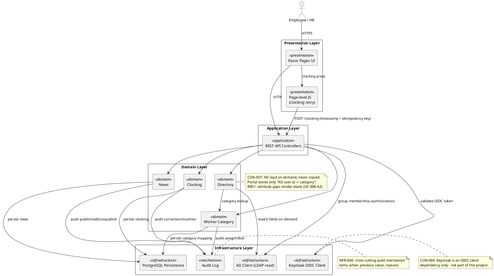
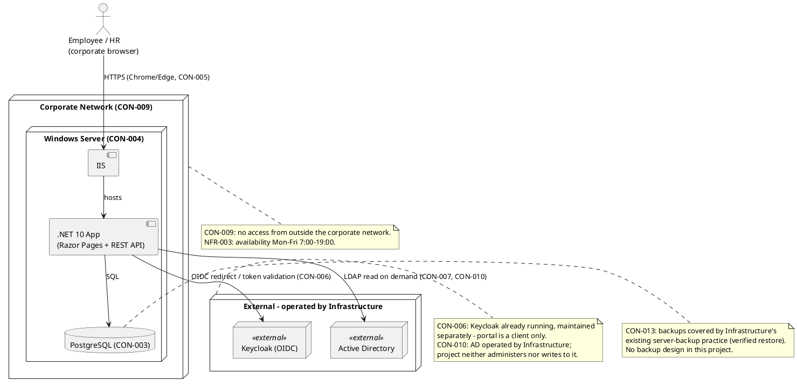

## Document Control

| Field | Value |
|---|---|
| Phase | Inception |
| Status | Draft |
| Milestone Target | End-of-Inception (Lifecycle Objectives) — NOT YET ACHIEVED |

## Architectural Representation

This document presents the **candidate architecture** for the Employee Portal, produced during Inception iteration 1. It is a sketch — not a baseline. Its purpose is to surface architectural risks and guide Elaboration planning; the full 4+1 baseline is produced and validated (via executable prototype) in Elaboration.

The architecture is represented using the 4+1 view model. In Inception, two views are sketched: the **Logical view** (component diagram) and the **Deployment view** (deployment diagram). The Use-Case view is carried by the Use-Case Model (UC-001…UC-012); the Process and Implementation views are deferred to Elaboration, where concurrency and build structure are baselined.

## Architectural Goals and Constraints

**Goals** (trace to Business Goals BG-001…BG-003):
- Centralize clocking, news, and directory in one internal web app with no data duplication (CON-007).
- Deliver audited clocking corrections/insertions, news publication, and category management (NFR-004).
- Meet page-load < 3s (NFR-001) and clocking < 1s (NFR-002) on the corporate network.

**Constraints** (the architecture must honor every one — CON-001…CON-021). The load-bearing architectural constraints are:

| Constraint | Architectural consequence |
|---|---|
| CON-001 | Backend is .NET 10 REST API — single framework, no polyglot |
| CON-002 | Razor Pages, no SPA, no client-side router; page-level JS allowed (clocking retry) |
| CON-003 | PostgreSQL persistence |
| CON-004 | Internal Windows Server hosting (IIS) — no cloud |
| CON-006 | Keycloak is an OIDC client dependency only — never designed/provisioned here |
| CON-007 | AD read on demand, never copied; portal stores only `AD user id → worker category` |
| CON-008 | Custom design (docs/inputs/employee-portal-design.html) authoritative for UI |
| CON-009 | No access from outside the corporate network |
| CON-014 | Single timezone; clockings UTC storage, Europe/Madrid display |
| CON-015 | At most one featured news item (invariant) |
| CON-016 | Worker categories: closed list of exactly four values |
| CON-019 | Original clocking never overwritten/deleted; corrections audited |
| CON-020 | News never hard-deleted; unpublish hides |
| CON-021 | Server accepts client timestamp; idempotency key rejects duplicates (clocking only) |

**Technology stack** (only what the stakeholder declared — nothing invented):

| Concern | Choice | Source |
|---|---|---|
| Backend framework | .NET 10 | CON-001 (version policy pin: .NET 10) |
| Frontend | Razor Pages | CON-002 |
| Database | PostgreSQL | CON-003 (no version declared — not pinned) |
| Identity | Keycloak OIDC (external, consumed) | CON-006 |
| Directory source | Active Directory (external, read-only) | CON-007, CON-010 |

No other technology is declared. The PostgreSQL driver version is not pinned by policy and is not invented here; it is resolved at implementation time against the enterprise version policy.

## Use-Case View

The architecturally significant use cases are **UC-001 (Clock In/Out)** and **UC-008 (Search Directory)** — both detailed in the Use-Case Model. They are prioritized first because they force the two highest-risk decisions:

- **UC-001** forces client-timestamp acceptance + idempotency (CON-021) and the offline-retry window (AC-005), and is the adoption-critical screen (R002, BG-003).
- **UC-008** forces the AD on-demand projection boundary (CON-007) and surfaces R001 (attribute gaps across offices).

**Prioritized use-case list for the Project Manager** (architectural significance = risk + coverage + criticality):

| Rank | UC | Rationale |
|---|---|---|
| 1 | UC-001 Clock In/Out | Highest risk (CON-021, AC-005, R002); first screen employees see |
| 2 | UC-008 Search Directory | Surfaces R001 (AD attribute consistency); validates CON-007 boundary |
| 3 | UC-003 Publish News | Establishes the audit mechanism (NFR-004) reused by all HR UCs |
| 4 | UC-011 Correct Clocking | Validates the immutable-record + audit pattern (CON-019) |
| 5 | UC-005 Feature News | Validates the single-featured invariant (CON-015) |
| 6 | UC-002 Export CSV | Validates timezone + column-order rules (CON-014, FR-002) |
| 7 | UC-004 Read & Filter News | Read path; validates featured banner + category filter |
| 8 | UC-006 Edit News | Reuses audit mechanism |
| 9 | UC-007 Unpublish News | Reuses audit mechanism; validates soft-hide (CON-020) |
| 10 | UC-009 Assign Worker Category | Closed-list category (CON-016) + audit |
| 11 | UC-010 Clear Worker Category | Empty-category rule (CON-018) + audit |
| 12 | UC-012 Insert Clocking | Reuses immutable-record + audit pattern |

## Logical View

The candidate decomposition is a **layered architecture** with four layers. Within the Domain layer, subsystems are decomposed by **area of change**, not by feature: each subsystem encapsulates one decision likely to change (per the Use-Case Model's "Volatility: High" annotations — UC-001 clocking interaction and UC-008 directory field availability).

**Subsystem rationale** (each encapsulates one area of change):

| Subsystem | Encapsulates | Volatility source |
|---|---|---|
| Clocking | Client-timestamp + idempotency (CON-021), offline-retry window (AC-005), immutable-record audit (CON-019) | UC-001 (Medium) |
| Directory | AD on-demand projection boundary (CON-007), six-field read, attribute-gap handling | UC-008 (Medium), R001 |
| News | Publication/edit/unpublish/feature lifecycle, single-featured invariant (CON-015), soft-hide (CON-020) | Stable (Low) |
| Worker Category | Closed-list of four values (CON-016), at-most-one + empty rule (CON-018) | Stable (Low) |

**Analysis mechanisms** (abstract capabilities — no product named where none was declared):

| Mechanism | Capability | Properties it must hold | Source |
|---|---|---|---|
| Persistence | Store clockings, news, category mapping, audit records | ACID; immutable clocking/news records (CON-019, CON-020); single-featured invariant enforceable (CON-015) | CON-003 |
| Authentication | Validate OIDC token, redirect for login | Delegated to Keycloak; portal is client only | CON-006 |
| Authorization | Two-level access from AD group membership | HR group vs. everyone else; no role matrix (NFR-005) | NFR-005, CON-010 |
| Directory projection | Read six AD fields on demand | Never copied; read-only; gap-tolerant (blank render) | CON-007, R001 |
| Audit | Record who/when/previous-value/reason | Append-only; covers news, category, clocking corrections/insertions | NFR-004 |
| Idempotency | Reject duplicate clocking presses | Key-based; clocking only (CON-021) | CON-021 |
| Offline retry | Hold clocking press in localStorage, retry ≤ 5 min | Clocking only; directory/news show "no connection" | AC-005 |

## Process View

Deferred to Elaboration. Inception notes the concurrency-relevant facts that will shape the Process view baseline:

- The single-featured invariant (CON-015) and the immutable-record rules (CON-019, CON-020) require **transactional enforcement** at the persistence boundary — concurrent feature/unpublish or correct/insert operations must not violate invariants.
- The offline-retry path (AC-005) introduces a client-side retry loop that must be reconciled with server-side idempotency (CON-021) — a concurrency concern between client and server.
- No scheduled jobs, no background sync (CON-007, CON-013) — the system is request/response only.

## Deployment View

**Topology summary:** single-node deployment — one Windows Server hosting IIS + the .NET 10 app, with PostgreSQL on the same node (or a co-located DB node, decided in Elaboration). Keycloak and AD are external, operated by Infrastructure (CON-006, CON-010). No cloud, no multi-node topology, no load balancing (200 users, NFR-003 availability window). The Deployment Model optional artifact is **not triggered** (single-node, single-environment) — deployment detail lives here in the SAD.

## Implementation View

Deferred to Elaboration. Inception notes the build-structure intent: a single .NET 10 solution with the Razor Pages project and the REST API, layered per the Logical view (Presentation / Application / Domain / Infrastructure). The exact project/module layout is baselined in Elaboration when the architectural prototype is built.

## Data View

The portal's own data is minimal by design (CON-007 — no employee copy). Candidate persistent entities:

| Entity | Purpose | Notes |
|---|---|---|
| Clocking | Employee clock in/out records | Immutable (CON-019); client timestamp + idempotency key (CON-021); UTC storage (CON-014) |
| Clocking correction/insertion audit | Audit trail for HR corrections/insertions | who, when, previous value, reason (NFR-004) |
| News | News items | Never hard-deleted (CON-020); featured flag (CON-015 invariant) |
| News audit | Audit trail for publish/edit/unpublish | author + timestamp (NFR-004) |
| Worker category mapping | `AD user id → worker category` | The ONLY portal-owned employee field (CON-007); closed list of four (CON-016); at most one, may be empty (CON-018) |
| Category audit | Audit trail for assign/clear | who, when (NFR-004) |

Employee identity and the six directory fields are **projected from AD at read time** and never stored (CON-007). The Data Model optional artifact is **not triggered** (≤ 10 entities, no migration — CON-012); data detail lives in the Design Model in Elaboration.

## Size and Performance

- **Scale:** 200 employees, 3 offices, single timezone (CON-014). No horizontal scaling required.
- **Performance targets:** page load < 3s (NFR-001); clocking < 1s (NFR-002) on the corporate network.
- **Architectural tactics to meet NFR-001/NFR-002:** AD projection is on-demand and read-only (no sync latency); clocking is a single-row insert with idempotency-key lookup; news/directory reads are simple indexed queries. The AD read path (UC-008) is the main latency risk and is validated in the Elaboration prototype against R001.

## Quality

| Quality attribute | Requirement | Architectural response |
|---|---|---|
| Performance | NFR-001, NFR-002 | Single-node, indexed reads, on-demand AD projection |
| Availability | NFR-003 (Mon–Fri 7:00–19:00) | Single-node; no 24/7 requirement; fault tolerance within corporate network |
| Auditability | NFR-004 | Append-only audit mechanism; immutable clocking/news records |
| Security | NFR-005, CON-009 | Two-level AD-group authorization; internal-network-only |
| Maintainability | CON-011 | Layered architecture; clean handover to Infrastructure at end of Transition |

## Architecture Decisions (ADRs)

### ADR-001 — Layered architecture (Presentation / Application / Domain / Infrastructure)

- **Context:** Internal web app, 200 users, three functional areas (clocking, news, directory), Razor Pages + .NET 10 REST API + PostgreSQL.
- **Decision:** Four-layer architecture with domain subsystems decomposed by area of change (Clocking, News, Directory, Worker Category).
- **Alternatives considered:** Microservices (rejected — 200 users, single node, no independent scaling needs); modular monolith with feature-based decomposition (rejected — feature decomposition maximizes change ripple; the two volatile areas are UC-001 and UC-008).
- **Trade-offs:** Layering adds indirection but isolates the two volatile areas and keeps the audit/authorization mechanisms cross-cutting.
- **Consequences:** Designer refines subsystems into classes in Elaboration; Implementer builds within these boundaries.

### ADR-002 — AD on-demand projection (no copy, no sync)

- **Context:** CON-007 mandates employee data read from AD on demand, never copied; portal stores only `AD user id → worker category`.
- **Decision:** Directory subsystem reads six AD fields at read time and joins with the portal-owned category mapping; no sync job, nothing to reconcile.
- **Alternatives considered:** Local cache of employee data (rejected — violates CON-007, introduces reconciliation); nightly sync (rejected — same).
- **Trade-offs:** Read latency depends on AD responsiveness (R001); mitigated by on-demand single-read and gap-tolerant rendering.
- **Consequences:** R001 must be validated early (Elaboration iteration 1) against UC-008.

### ADR-003 — Persistence mechanism (PostgreSQL, immutable records)

- **Context:** CON-003 declares PostgreSQL; CON-019/CON-020 require immutable clocking and news records; CON-015 requires a single-featured invariant.
- **Decision:** PostgreSQL as the single persistence store; clocking and news records are append-only (corrections/insertions and unpublish are separate audited records, never in-place overwrites); the featured invariant is enforced transactionally.
- **Alternatives considered:** In-place update with audit columns (rejected — CON-019/CON-020 forbid overwrite/delete); document store (rejected — CON-003 declares PostgreSQL).
- **Trade-offs:** Append-only increases storage slightly but guarantees the audit trail (NFR-004).
- **Consequences:** Database Designer models the immutable-record schema in Elaboration.

## Traceability

| Element | Traces From | Link Type | Traces To |
|---|---|---|---|
| Clocking subsystem | UC-001, CON-021, AC-005 | Derives | (Elaboration: Design Model) |
| Directory subsystem | UC-008, CON-007, R001 | Derives | (Elaboration: Design Model) |
| News subsystem | UC-003…UC-007, CON-015, CON-020 | Derives | (Elaboration: Design Model) |
| Worker Category subsystem | UC-009, UC-010, CON-016, CON-018 | Derives | (Elaboration: Design Model) |
| Audit mechanism | NFR-004 | Derives | (Elaboration: Design Model) |
| Authorization mechanism | NFR-005, CON-010 | Derives | (Elaboration: Design Model) |
| Persistence mechanism | CON-003, CON-019, CON-020 | Derives | (Elaboration: Design Model) |
| ADR-001…ADR-003 | CON-001…CON-021 | Derives | (Elaboration: baseline) |
| R001 | CON-007, FR-008, UC-008 | DependsOn | Elaboration PoC |
| R002 | BG-003, AC-004, FR-001 | DependsOn | Transition plan |
