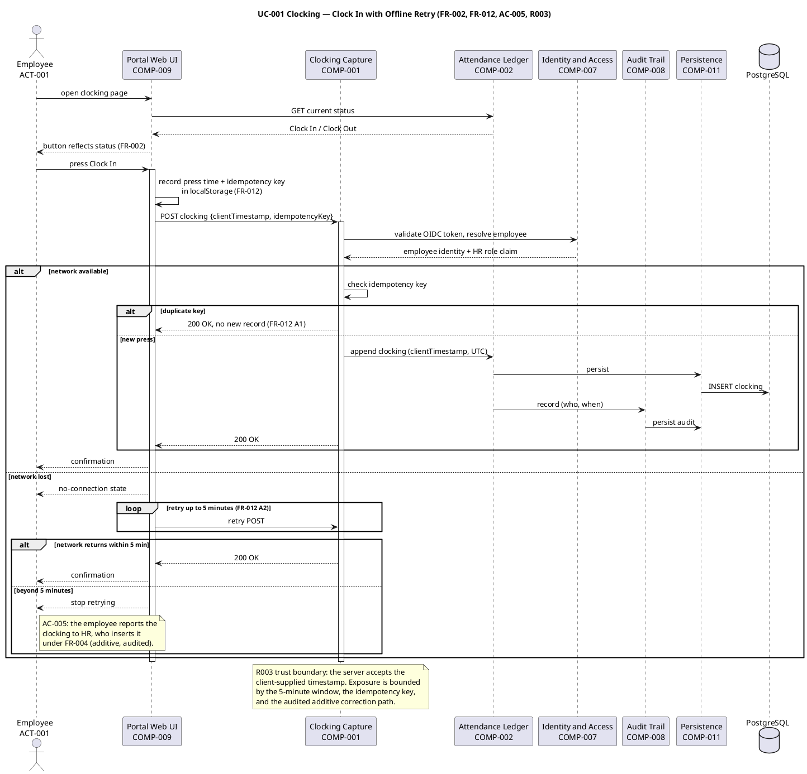
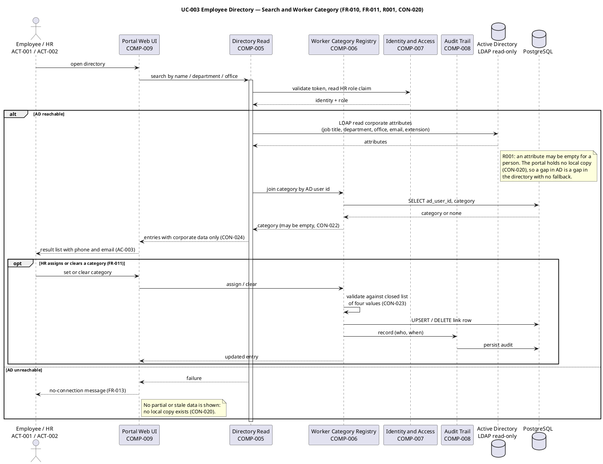
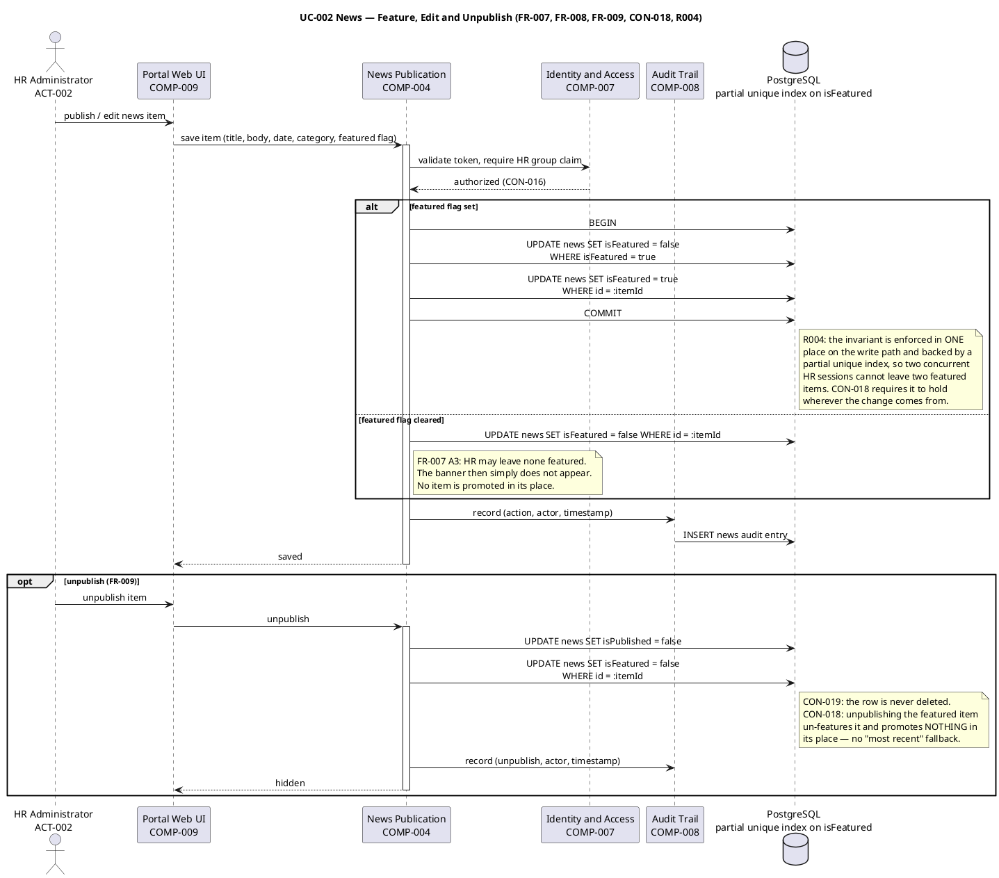
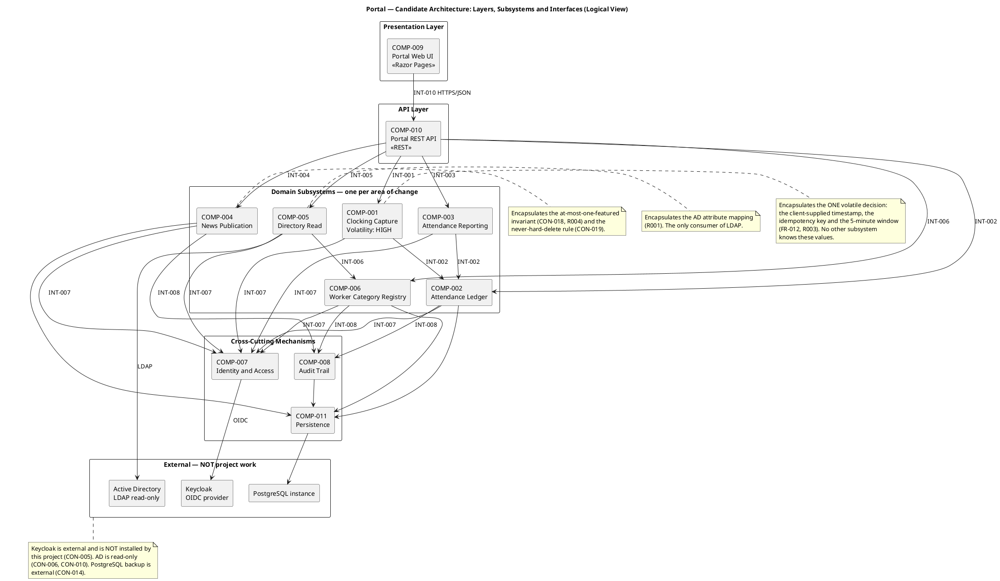
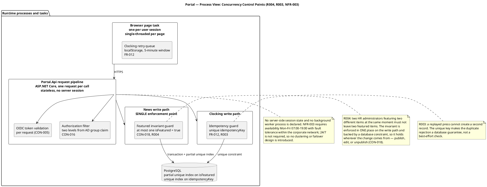
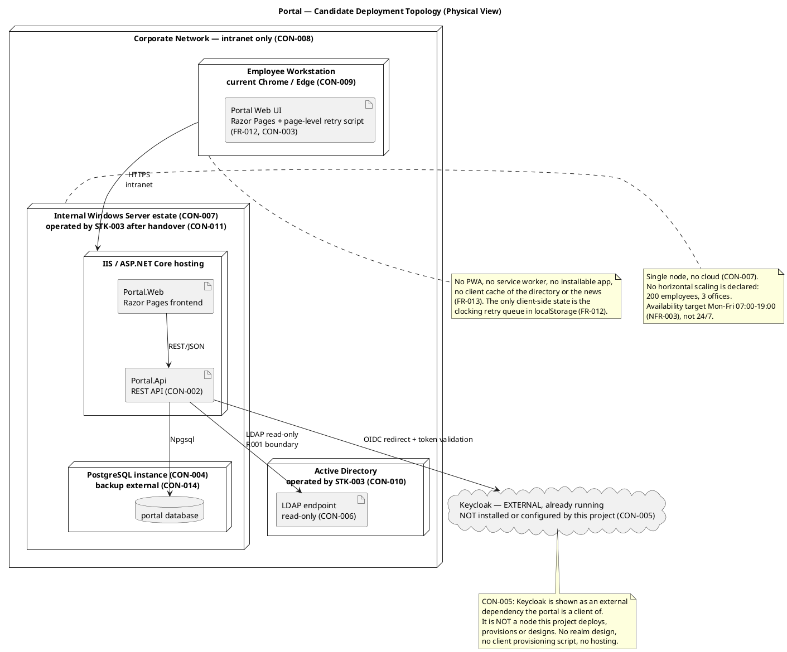
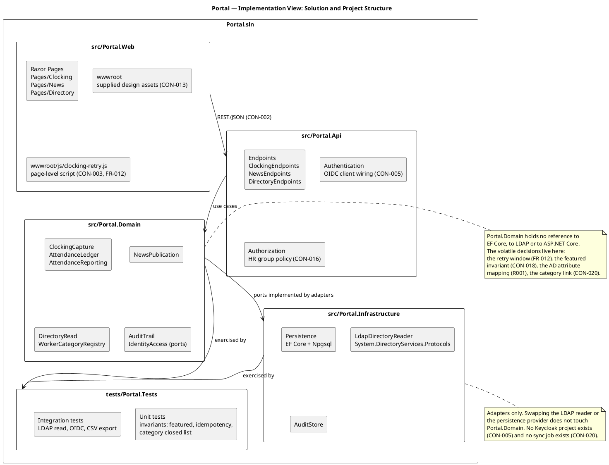

## Document Control

| Field | Value |
|---|---|
| Artifact | Software Architecture Document — Portal (Employee Portal, Cuba Corp) |
| Phase | Inception |
| Status | Draft — **candidate architecture** produced for review; milestone NOT YET ACHIEVED |
| Milestone Target | End-of-Inception (LCO) — not marked complete by this artifact |
| Iteration / Cycle | 1 / 1 |
| Owner | SoftwareArchitect |
| Date | 2026-09-17 |
| Detail level | Inception — **candidate architecture sketch**. Logical and Deployment views sketched; Use-Case, Process, Implementation and Data views sketched to the depth needed to surface architectural risk. Elaboration baselines all views. |
| Governing process | Development Case (Inception) — Architectural Proof-of-Concept trigger **FIRED** (delta D2); Deployment Model trigger **NOT FIRED**; Business Modeling **INACTIVE** |
| Version policy | Anchored against the enterprise version policy (delta D4) and resolved against the registry — see *Architectural Goals and Constraints* |

**What this document is.** A candidate architecture, not a baseline. It exists to surface architectural risk early and to give the Project Manager a prioritised use-case list to plan from. It is deliberately a **sketch**: the Logical and Deployment views are the two views Inception owes, and the remaining views are sketched only as far as they carry a decision that changes the design. Elaboration baselines all of them.

**What this document is not.** It is not a design. Class-level design, use-case realizations and the detailed data model belong to the Design Model (Designer, Database Designer) in Elaboration. Where this document names a subsystem, it names a *boundary and an interface* — not the classes behind it.

## Architectural Representation

The architecture is described through the 4+1 view model. Each view is a **slice** through the model, illuminating only the elements with system-wide impact.

| View | Addresses | Primary diagram in this document | Status this iteration |
|---|---|---|---|
| **Logical** | Functional requirements — subsystems, layers, interfaces | Component diagram (COMP-001..COMP-011, INT-001..INT-010) | **Sketched** — candidate decomposition |
| **Process** | Concurrency, synchronisation, fault tolerance | Concurrency-control diagram | **Sketched** — the two write-path guards |
| **Implementation** | Static organisation of source code | Solution/project structure diagram | **Sketched** — module boundaries |
| **Deployment** | Executables mapped to hardware nodes | Deployment topology diagram | **Sketched** — single node, intranet |
| **Use-Case** | Validates all other views | Three sequence diagrams (UC-001, UC-002, UC-003) | **Sketched** — the three architecturally significant scenarios |
| **Data** | Persistent entities and their relationships | Class diagram (entities + the CON-020 link) | **Sketched** — entity surface, not a schema |

**Diagram index.** Seven diagrams, all validated. The Use-Case view is not empty: every other view is exercised by at least one scenario below.

### Architecture Decision Records

Seven decisions are recorded. Each states context, the decision, the alternatives considered, the trade-offs accepted and the consequences. **No decision is recorded as taken where the stakeholder holds it** — the two open questions raised this iteration are named in *Data View* and are not resolved here.

**ADR-001 — Architectural style: layered application with a ports-and-adapters domain core.**
*Context.* CON-001 (.NET 10), CON-003 (Razor Pages, no SPA), CON-002 (REST API), CON-004 (PostgreSQL), CON-007 (single internal Windows Server), 200 employees across 3 offices.
*Decision.* A layered application — Presentation (Razor Pages) → API (REST) → Domain (subsystems) → Infrastructure (adapters) — with the domain core depending only on interfaces it owns.
*Alternatives considered.* (a) **Microservices** — rejected: the declared scale is 200 employees on one internal server (CON-007), and the declared scope is three use cases. Distributing them would add network hops, deployment units and operational burden to a system whose operator (STK-003) explicitly wants no new infrastructure to run. This is architecture by buzzword. (b) **Classic N-tier with a shared data layer** — rejected: it lets the volatile decisions (the retry window, the featured invariant, the AD attribute mapping) leak across tiers, which is exactly what the volatility annotations forbid. (c) **CQRS / event sourcing** — rejected: no read/write asymmetry is declared, and event sourcing would make the audit trail a by-product of a mechanism nobody asked for.
*Trade-offs accepted.* More indirection than a three-tier application needs; the domain core must be kept free of EF Core and LDAP references by discipline, not by the compiler.
*Consequences.* The volatile decisions have exactly one home each. Swapping the LDAP reader or the persistence provider does not touch the domain.

**ADR-002 — Decomposition by area of change, not by feature and not by layer.**
*Context.* The Use-Case Model annotates volatility: FR-012 **High**; FR-007/CON-018, FR-010/R001, FR-011/CON-020 and FR-014 **Medium**.
*Decision.* Six domain subsystems, each encapsulating **one** decision likely to change: COMP-001 Clocking Capture (the retry window, client timestamp and idempotency key), COMP-002 Attendance Ledger (the additive, never-overwritten correction model), COMP-003 Attendance Reporting (the exact CSV contract), COMP-004 News Publication (the at-most-one-featured invariant and never-hard-delete), COMP-005 Directory Read (the AD attribute mapping), COMP-006 Worker Category Registry (the two-column link and the closed four-value list).
*Alternatives considered.* (a) **Feature decomposition** — one subsystem per use case ("Clocking Service", "News Service", "Directory Service"). Rejected: it is functional decomposition, and it would put the audit mechanism, the identity mechanism and the persistence mechanism inside each of the three, so a change to any of them ripples across all three. (b) **Layer decomposition** — Presentation / Application / Infrastructure as the subsystems. Rejected: layers are not a decomposition; they are a stacking. A change to the featured invariant would still have to be found across every layer. (c) **One subsystem per FR-NNN** — rejected as nano-services: fourteen subsystems for a 200-user intranet is over-engineering, and several FRs share one area of change.
*Trade-offs accepted.* COMP-002 Attendance Ledger is a shared dependency of COMP-001 and COMP-003, so it is the most coupled subsystem in the model. That coupling is deliberate: the ledger is the single authoritative store of the clocking record, and duplicating it would break CON-017's "never overwritten in place".
*Consequences.* Each subsystem's name states the decision it hides. A reviewer can check the decomposition by asking, of each subsystem, "what change does this absorb?"

**ADR-003 — Persistence: EF Core over Npgsql against PostgreSQL, with the two invariants enforced as database constraints.**
*Context.* CON-004 (PostgreSQL, version `latest` per the stakeholder's answer), CON-015 (store UTC), CON-017 (corrections additive), CON-018 (at most one featured — a **system invariant**), FR-012 (duplicate rejection by idempotency key), R004.
*Decision.* EF Core with the Npgsql provider. The at-most-one-featured rule is enforced by a **partial unique index** on the featured flag, and duplicate clocking rejection by a **unique index** on the idempotency key — both in the database, not only in application code.
*Alternatives considered.* (a) **Application-level enforcement only** — rejected: CON-018 states the invariant must hold *wherever the change comes from*, and R004 names two concurrent HR sessions as the mechanism that breaks it. An application check is a race, not an invariant. (b) **Dapper / hand-written SQL** — rejected: it buys control the project does not need and costs the migration tooling the Implementer would otherwise get free. (c) **Stored procedures for the write paths** — rejected: it moves business rules out of the domain core and into the database, contradicting ADR-001.
*Trade-offs accepted.* A partial unique index is PostgreSQL-specific, which is acceptable because CON-004 fixes the datastore. EF Core adds a mapping layer between the domain and the schema.
*Consequences.* The two invariants survive concurrency, a direct database write, and a future second write path. The Design Model must state the index definitions.

**ADR-004 — Directory read: direct LDAP read against Active Directory, with no local copy and no cache.**
*Context.* CON-006 (AD is the system of record; Keycloak is not a directory), CON-010 (never write to AD), CON-020 (no local copy of the employee), CON-024 (corporate data only), R001 (exposure 9).
*Decision.* COMP-005 Directory Read is the **only** consumer of LDAP. It reads the corporate attributes on demand and joins the worker-category link by AD user id. It holds no cache and no replica.
*Alternatives considered.* (a) **Query Keycloak as the directory** — forbidden outright by CON-006. (b) **Local replica with a sync job** — forbidden by CON-020, and it would create the reconciliation and conflict-resolution work the declared scope explicitly excludes. (c) **Cache the directory in the browser** — forbidden by FR-013 and the declared exclusion of any client cache. (d) **AD LDS as an intermediate store** — rejected: it is a second system of record for employee data, which CON-020 forbids.
*Trade-offs accepted.* A gap in AD is a gap in the directory, with no fallback. This is the accepted consequence of CON-020 and it is precisely why R001 is the project's dominant risk and why the Architectural Proof-of-Concept trigger fired on it.
*Consequences.* The directory's availability is bounded by AD's availability. UC-003 E1 (AD unreachable) must report the failure rather than show stale data.

**ADR-005 — Identity and authorization: OIDC client to Keycloak, two levels read from the AD group claim.**
*Context.* CON-005 (Keycloak already running, external, not project work), CON-016 (two levels from AD group membership; no role matrix, no permission screen, no per-category rule), CON-021 (the worker category does not drive access control).
*Decision.* The portal is an OIDC client: authorization-code redirect, token validation per request, and the two authorization levels read from the group claim in the token. No local account store, no role table, no permission screen.
*Alternatives considered.* (a) **Windows Integrated Authentication** — rejected: CON-005 declares the portal an OIDC client of an already-federated Keycloak, and the client is already registered. (b) **A local role table** — rejected: it would be a second authorization source and would need the permission administration screen CON-016 forbids. (c) **Deriving access from the worker category** — forbidden by CON-021.
*Trade-offs accepted.* Authorization is only as fine-grained as the AD group claim. That is the declared requirement, not a limitation.
*Consequences.* There is no `UC-AUTH` and no authentication subsystem beyond COMP-007. Authentication is a cross-cutting constraint (SS-SEC-01) included by every use case.

**ADR-006 — Clocking capture: client-supplied timestamp, idempotency key, bounded 5-minute retry.**
*Context.* FR-012, AC-005, CON-003 (no SPA — but a page-level script is permitted), R003 (the client-timestamp trust boundary).
*Decision.* COMP-001 Clocking Capture owns the whole mechanism: the press time and idempotency key are held in `localStorage` by a page-level script on the already-rendered clocking page, the POST is retried for at most 5 minutes, the server accepts the client timestamp, and duplicates are rejected by the unique idempotency key.
*Alternatives considered.* (a) **Server timestamp only** — rejected: it violates FR-012, which requires the time the employee pressed the button. (b) **A server-side queue or background worker** — rejected: it introduces a process the declared scope does not name, and FR-012 places the queue in the browser. (c) **A service worker / PWA for offline capture** — forbidden by the declared exclusion of any offline mode beyond the clocking retry. (d) **Trusting the client without a bound** — rejected: R003's exposure is bounded by the 5-minute window, and beyond it the declared path is that the employee reports the clocking to HR.
*Trade-offs accepted.* A wrong client clock writes a wrong record. The exposure is bounded by the window, by the idempotency key, and by the audited additive correction path (CON-017) — a wrong record is correctable without destroying the original.
*Consequences.* The retry script is the only client-side mechanism in the product and must not be mistaken for a framework (SS-SUP-05).

**ADR-007 — Audit: append-only audit records written in the same transaction as the change.**
*Context.* NFR-004, SS-AUD-01..SS-AUD-07, CON-017, CON-019.
*Decision.* COMP-008 Audit Trail exposes one interface (INT-008) used by COMP-002, COMP-004 and COMP-006. Audit rows are append-only and are written inside the same transaction as the change they record. The audit is **written, never read in the portal** (SS-AUD-07).
*Alternatives considered.* (a) **Database triggers** — rejected: the audit would then be invisible to the domain and untestable from the application, and the "who" is a claim from the token, not a database user. (b) **A separate audit service or event log** — rejected: it introduces a component and a delivery guarantee the declared scope does not name, for a system with three write paths. (c) **An in-portal audit view** — excluded by the stakeholder's answer of 2026-09-17 (SS-AUD-07).
*Trade-offs accepted.* Every write path must remember to call INT-008; the discipline is enforced by keeping the call inside the same transaction and by testing it.
*Consequences.* No audit screen, no auditor actor, no audit use case. The audit is queryable directly in the database.

## Architectural Goals and Constraints

### Architecturally significant requirements

| Requirement | Why it is architecturally significant | Architectural response |
|---|---|---|
| FR-012 (Volatility **High**) | The only client-side mechanism in the product; the only place a client-supplied timestamp and an idempotency key cross the boundary | COMP-001 encapsulates the whole mechanism; ADR-006; R003 bounded by the 5-minute window and the unique key |
| CON-018 / FR-007 | Declared a **system invariant**, not a screen convention — it must hold wherever the change comes from | COMP-004 is the single enforcement point; ADR-003 backs it with a partial unique index; R004 |
| CON-006 / FR-010 / R001 | The AD/LDAP boundary carries the project's dominant risk (exposure 9) and there is no local copy and no fallback | COMP-005 is the only LDAP consumer; ADR-004; the Architectural Proof-of-Concept is scoped to this boundary |
| CON-020 / FR-011 | The worker category is the only field the portal owns about a person, stored as a link | COMP-006 owns a two-column table and nothing else; no sync, no reconciliation |
| CON-017 / NFR-004 | Corrections are additive and audited; the original is never overwritten or deleted | COMP-002 + COMP-008; ADR-007 |
| CON-002 / CON-003 | REST API between a Razor Pages frontend and the backend, with no SPA | COMP-009 → COMP-010 → domain; ADR-001 |
| NFR-002 | Clocking responds in under 1 s | The clocking write path is a single insert plus one audit insert; no external call is on the critical path except token validation |
| NFR-003 | Available Mon–Fri 07:00–19:00; 24/7 not required | No clustering, no failover design, no background worker is introduced |
| CON-005 | Keycloak is external and is not project work | COMP-007 is an OIDC client only; no Keycloak component is owned or deployed by this project |

### Prioritised use cases — for the Project Manager to plan from

Priority is expressed by **architectural significance**, not by MoSCoW: the declared scope is a closed set of fourteen functional requirements and all three use cases are Must, so no use case is downgraded.

| Rank | Use case | Architectural significance | Risk carried | Recommended iteration |
|---|---|---|---|---|
| 1 | **UC-003 Employee Directory** | **Highest** — sits on the AD/LDAP boundary, the only interface with no fallback (CON-020) | **R001** (exposure 9, High) | Elaboration Iter 1 — the Proof-of-Concept reads real AD attributes before the mapping is designed |
| 2 | **UC-001 Clocking** | **High** — the only client-side mechanism; the only client-supplied value the server trusts | **R003** (exposure 4) | Elaboration Iter 1–2 — the Design Model must state where the accepted timestamp is validated and what the window is |
| 3 | **UC-002 News** | **Medium** — carries a declared system invariant that must hold under concurrency | **R004** (exposure 4) | Elaboration Iter 2 — the invariant is enforced in one place and backed by a database constraint |

**Why UC-003 ranks first.** It is the only use case whose correctness depends on data the project does not control and cannot repair. UC-001's risk is bounded by design (a 5-minute window and a unique key); UC-002's is bounded by a constraint. UC-003's is bounded by nothing — if AD is incomplete, the directory is incomplete, and the declared scope forbids every remedy (no local copy, no sync, no fallback value).

### Constraints on the architecture

| Constraint | Architectural effect |
|---|---|
| CON-001, CON-003, CON-004, CON-002 | Fix the stack: .NET 10, Razor Pages, PostgreSQL, REST API. No additional runtime, framework or datastore is introduced (SS-SUP-04). |
| CON-005 | Keycloak is an external dependency the portal is a client of. It is **not** a node this project deploys, provisions or designs, and it does not appear in the deployment topology as something we install. |
| CON-006, CON-010 | AD is read-only and is the system of record for corporate attributes. |
| CON-007, CON-008 | Single internal Windows Server; intranet only. No cloud, no external route. |
| CON-011, CON-014 | Production operation and backup belong to the Infrastructure team. No operational or backup component is designed here. |
| CON-013 | The supplied design at `docs/inputs/employee-portal-design.html` is authoritative for the UI visual layer. COMP-009 implements it. |
| CON-016, CON-021 | Two authorization levels from the AD group claim; the worker category is descriptive and never drives access control. |
| CON-020, CON-022, CON-023 | The category is a two-column link; at most one value, possibly empty; a closed list of four. |
| CON-012, CON-015, CON-019 | No migration; UTC storage with Europe/Madrid display; news never hard-deleted. |

### Technology stack — anchored to the enterprise version policy

Every technology below is **stakeholder-declared**. Each version was resolved against the enterprise version policy and the registry — none is quoted from memory. The packages are the .NET bindings of the declared technologies, not additional technologies: no new runtime, framework or datastore is introduced (SS-SUP-04).

| Layer | Technology | Version | Basis | Policy check |
|---|---|---|---|---|
| Runtime / backend | .NET | **10** | CON-001 — declared explicitly | Policy pin `.NET = 10`; no LTS-only rule |
| Frontend | Razor Pages (ASP.NET Core) | **10** | CON-003 — a capability of the .NET 10 target, not a separate pin | Covered by the `.NET = 10` pin |
| Database | PostgreSQL | **latest** | CON-004 — declared without a version; the stakeholder answered **latest** | Policy pin `PostgreSQL = latest`; no version floor, no LTS-only rule |
| Data access | `Npgsql` | **10.0.3** | The .NET provider for the declared PostgreSQL datastore | No policy pin; registry latest stable |
| Data access | `Npgsql.EntityFrameworkCore.PostgreSQL` | **10.0.3** | EF Core provider for the declared PostgreSQL datastore | No policy pin; registry latest stable |
| Data access | `Microsoft.EntityFrameworkCore` | **10.0.12** | ORM for the declared .NET 10 target | No policy pin; registry latest stable |
| Identity | `Microsoft.AspNetCore.Authentication.OpenIdConnect` | **10.0.12** | OIDC client for the declared Keycloak dependency (CON-005) | No policy pin; registry latest stable |
| Directory | `System.DirectoryServices.Protocols` | **10.0.12** | LDAP client for the declared AD read (CON-006) | No policy pin; registry latest stable |
| Identity provider | Keycloak | **not pinned — external** | CON-005 — already running, maintained separately, not project work | Out of scope; no version is asserted by this project |
| Directory | Active Directory | **not pinned — external** | CON-006, CON-010 — operated by STK-003 | Out of scope |

**No version is advanced past a pin.** The `.NET = 10` and `PostgreSQL = latest` pins govern; the package versions above are the registry's latest stable within those pins. If the policy changes, this table is re-anchored and the change flows to every downstream role through this document.

## Use-Case View

The Use-Case view validates the other four. Three scenarios are walked — one per use case, each chosen because it exercises the view that carries that use case's risk.

### UC-001 Clocking — clock in with offline retry (validates Logical, Process, Data)

**What this scenario validates.** The Logical view: the retry mechanism is confined to COMP-001 and COMP-009, and no other subsystem knows the window or the key. The Process view: the duplicate check is a database constraint, not a race. The Data view: the clocking row carries the client timestamp and the unique idempotency key.

### UC-003 Employee Directory — search and category (validates Logical, Deployment, Data)

**What this scenario validates.** The Logical view: COMP-005 is the only LDAP consumer and COMP-006 is the only writer of the category link. The Deployment view: the LDAP read crosses from the application node to the AD node, both inside the corporate network. The Data view: the join is by AD user id, and no employee attribute is stored.

### UC-002 News — feature, edit and unpublish (validates Logical, Process, Data)

**What this scenario validates.** The Logical view: the featured invariant has exactly one enforcement point. The Process view: the invariant survives two concurrent HR sessions because the database, not the application, is the arbiter. The Data view: `isFeatured` and `isPublished` are separate flags, and unpublishing clears the first.

## Logical View

The Logical view is the decomposition. Six domain subsystems, each encapsulating **one** area of change; three cross-cutting mechanisms; two presentation/API layers.

### Subsystems

| ID | Subsystem | The ONE decision it encapsulates | Volatility | Depends on |
|---|---|---|---|---|
| COMP-001 | Clocking Capture | The client-supplied timestamp, the idempotency key and the 5-minute retry window (FR-012) | **High** | INT-002, INT-007, INT-008 |
| COMP-002 | Attendance Ledger | The additive, never-overwritten correction model (CON-017) | Low | INT-007, INT-008, INT-009 |
| COMP-003 | Attendance Reporting | The exact CSV contract — column set, order, month boundary, Europe/Madrid (FR-014) | Medium | INT-002, INT-007 |
| COMP-004 | News Publication | The at-most-one-featured invariant and never-hard-delete (CON-018, CON-019) | Medium | INT-007, INT-008, INT-009 |
| COMP-005 | Directory Read | The AD attribute mapping (R001) | Medium | INT-006, INT-007 |
| COMP-006 | Worker Category Registry | The two-column link and the closed four-value list (CON-020, CON-023) | Medium | INT-007, INT-008, INT-009 |
| COMP-007 | Identity and Access | The OIDC client and the two authorization levels (CON-005, CON-016) | Low | — |
| COMP-008 | Audit Trail | Append-only audit written in the change's transaction (NFR-004) | Low | INT-009 |
| COMP-009 | Portal Web UI | The supplied design's visual layer (CON-013) | Medium | INT-010 |
| COMP-010 | Portal REST API | The REST contract between frontend and backend (CON-002) | Low | INT-001..INT-006 |
| COMP-011 | Persistence | The datastore binding and the two database-enforced invariants (CON-004) | Low | — |

**Cohesion and coupling check.** No subsystem depends on more than three others. COMP-002 Attendance Ledger is the most depended-upon (COMP-001 and COMP-003) and that is deliberate — it is the single authoritative store of the clocking record. No subsystem is a God subsystem: the largest, COMP-002, owns one entity and one rule. No subsystem is a nano-service: fourteen FRs map to six subsystems, not fourteen.

### Interfaces

Every subsystem boundary is defined by an interface. No subsystem reaches into another's classes.

| ID | Interface | Provided by | Consumed by | Contract |
|---|---|---|---|---|
| INT-001 | Clocking Capture API | COMP-001 | COMP-010 | Accept a clocking with a client timestamp and an idempotency key; reject duplicates |
| INT-002 | Attendance Ledger API | COMP-002 | COMP-001, COMP-003, COMP-010 | Append a clocking; read status; read own history; read all clockings; apply an additive correction |
| INT-003 | Attendance Reporting API | COMP-003 | COMP-010 | Produce the monthly CSV for a given calendar month |
| INT-004 | News Publication API | COMP-004 | COMP-010 | Publish, edit, feature, un-feature, unpublish; read the list and the featured item |
| INT-005 | Directory Read API | COMP-005 | COMP-010 | Search by name, department or office; return corporate attributes joined with the category |
| INT-006 | Worker Category API | COMP-006 | COMP-005, COMP-010 | Read, assign and clear the category link for an AD user id |
| INT-007 | Identity and Access API | COMP-007 | COMP-001..COMP-006 | Validate the token; expose the caller's identity and the two authorization levels |
| INT-008 | Audit Trail API | COMP-008 | COMP-002, COMP-004, COMP-006 | Append an audit record inside the caller's transaction |
| INT-009 | Persistence API | COMP-011 | COMP-002, COMP-004, COMP-006, COMP-008 | Unit of work, repositories, and the two database-enforced invariants |
| INT-010 | Portal REST API | COMP-010 | COMP-009 | The portal's own HTTP/JSON contract (CON-002) |

### Analysis mechanisms

Each mechanism is named by the **capability** it must provide and the **properties** it must hold. Where a product is named, the stakeholder declared it.

| Mechanism | Capability it must provide | Properties it must hold | Realised by | Basis |
|---|---|---|---|---|
| Persistence | Durable storage of clockings, corrections, news, audit records and the category link | Transactional; UTC timestamps; append-only for audit; unique constraints for the idempotency key and the featured invariant | COMP-011, PostgreSQL | CON-004, CON-015, CON-017, CON-018, CON-019 |
| Identity and access | Authenticate the caller and supply the two authorization levels | OIDC authorization-code flow; token validated per request; levels read from the group claim; no local account store | COMP-007, Keycloak (external) | CON-005, CON-016 |
| Directory read | Supply corporate employee attributes | Read-only; no local copy; no cache; failure surfaces as an error, never as stale data | COMP-005, AD over LDAP | CON-006, CON-010, CON-020, CON-024 |
| Audit | Record who did what and when, for news, worker category and clocking corrections | Append-only; written in the same transaction as the change; never read in the portal | COMP-008 | NFR-004, SS-AUD-01..SS-AUD-07 |
| Clocking capture | Accept a client-supplied timestamp and reject duplicates | Bounded 5-minute window; unique idempotency key; the server never substitutes its own receive time | COMP-001 | FR-012, AC-005, R003 |
| Reporting and export | Produce the monthly CSV | Exact column set and order; Europe/Madrid local time; one calendar month boundary | COMP-003 | FR-014, CON-015 |
| Communication | Frontend ↔ backend | REST/JSON over HTTPS, intranet only | COMP-010 | CON-002, CON-008 |

## Process View

The Process view addresses concurrency, synchronisation and fault tolerance. This system has **no background worker, no scheduled job and no server-side session state** — the declared scope names none, and inventing one would be scope creep. The concurrency that matters is therefore confined to two write paths.

**Concurrency decisions.**

| Concern | Decision | Basis |
|---|---|---|
| Two HR sessions featuring different items | The invariant is enforced in one place and backed by a partial unique index; the losing transaction fails and is retried | CON-018, R004 |
| A replayed clocking press | The unique idempotency key makes the second insert fail; the client treats the failure as success | FR-012, R003 |
| Two clocking presses by the same employee | They cannot conflict — one action, one queue, one entity, nothing to reconcile | FR-012, SS-REL-06 |
| Server-side session state | None. Every request carries its own validated token | CON-005 |
| Fault tolerance | Within the corporate network only; no clustering, no failover, no 24/7 target | NFR-003 |
| Background processing | None. No scheduled job, no batch process, no queue worker is declared | Declared scope |

## Deployment View

The Deployment Model optional artifact is **NOT FIRED** per the Development Case (single node, no cloud, no multi-environment topology), so deployment is a section here.

**Nodes and connectors.**

| Node | Role | Operated by | Basis |
|---|---|---|---|
| Employee Workstation | Runs the browser; holds the clocking retry queue in `localStorage` | STK-004 | CON-009, FR-012 |
| Internal Windows Server | Hosts the Razor Pages frontend, the REST API and the PostgreSQL instance | STK-003 after handover | CON-007, CON-011 |
| Active Directory | Supplies corporate attributes over LDAP, read-only | STK-003 | CON-006, CON-010 |
| Keycloak | OIDC provider — **external, not deployed by this project** | Maintained separately | CON-005 |

**Environment mapping.** One environment is declared: production, on the internal Windows Server estate. No staging, no cloud, no external route (CON-007, CON-008). Backup and restore of the PostgreSQL instance are the Infrastructure team's existing practice (CON-014) and are not designed here.

## Implementation View

**Module boundaries.** `Portal.Domain` is the only project that holds the volatile decisions, and it references no infrastructure package. `Portal.Infrastructure` holds adapters only. There is deliberately **no** `Portal.Keycloak` project (CON-005) and **no** synchronisation or reconciliation module (CON-020). The Development Case records `CONTRIBUTING.md`, the CI workflow and the lint configuration as Elaboration gaps owned by the Implementer; they are not architecture.

## Data View
The Data Model optional artifact is **NOT FIRED** per the Development Case (fewer than 10 entities, no data migration), so the entity surface is carried here. This is an entity sketch, not a schema — the Database Designer owns the physical model in Elaboration.

```plantuml
@startuml
title Portal — Data View: Key Entities and the Worker-Category Link (CON-020, CON-022, CON-023)

skinparam classAttributeIconSize 0

package "Portal-owned data — the only new system of record" as OWNED {

  class "Clocking" as CLK <<entity>> {
    + id : Guid
    + employeeId : string
    + clientTimestampUtc : timestamptz
    + idempotencyKey : Guid
    + direction : ClockDirection
    + recordedAtUtc : timestamptz
    + isCorrected : bool
  }

  class "ClockingCorrection" as CORR <<entity>> {
    + id : Guid
    + clockingId : Guid
    + previousValue : string
    + newValue : string
    + reason : string
    + correctedBy : string
    + correctedAtUtc : timestamptz
  }

  class "NewsItem" as NEWS <<entity>> {
    + id : Guid
    + title : string
    + body : string
    + newsDate : date
    + category : NewsCategory
    + isFeatured : bool
    + isPublished : bool
    + authorId : string
    + publishedAtUtc : timestamptz
  }

  class "NewsAuditEntry" as NAUD <<entity>> {
    + id : Guid
    + newsItemId : Guid
    + action : NewsAction
    + actorId : string
    + occurredAtUtc : timestamptz
  }

  class "WorkerCategoryLink" as WCL <<entity>> {
    + adUserId : string
    + category : WorkerCategory
  }

  class "CategoryAuditEntry" as CAUD <<entity>> {
    + id : Guid
    + adUserId : string
    + previousCategory : WorkerCategory
    + newCategory : WorkerCategory
    + actorId : string
    + occurredAtUtc : timestamptz
  }

  enum "WorkerCategory" as WCAT {
    FullTime
    PartTime
    Contractor
    Intern
  }

  enum "NewsCategory" as NCAT {
    General
    HR
    IT
    Events
  }

  enum "ClockDirection" as DIR {
    In
    Out
  }
}

package "NOT stored — read from AD over LDAP (CON-006, CON-020)" as EXTERNAL {
  class "AD Employee Attributes" as ADE <<external>> {
    + sAMAccountName : string
    + displayName : string
    + jobTitle : string
    + department : string
    + office : string
    + email : string
    + extension : string
  }
}

CLK "1" --> "0..*" CORR : corrected by (additive, never overwritten)
NEWS "1" --> "0..*" NAUD : audited by
WCL "1" --> "0..*" CAUD : audited by
WCL --> WCAT : category (may be empty)
NEWS --> NCAT : category
CLK --> DIR : direction
WCL ..> ADE : adUserId links to AD\nNO copy of the employee

note bottom of WCL
  CON-020: two columns and nothing else.
  No synchronisation, no reconciliation,
  no conflict to resolve. The employee
  data has exactly one home: AD.
end note

note bottom of NEWS
  CON-018: at most one row may carry
  isFeatured = true. Enforced by a partial
  unique index, not by screen logic.
  CON-019: isPublished = false hides the
  item; the row is never deleted.
end note

note bottom of CLK
  CON-015: stored in UTC, displayed in
  Europe/Madrid. CON-017: the original row
  is never overwritten in place.
  idempotencyKey is unique (FR-012).
  employeeId is the sAMAccountName read from
  the authenticated session (stakeholder
  decision 2026-09-17) — no mapping table.
end note

note top of ADE
  sAMAccountName is the identifier the export
  keys on (FR-014, stakeholder decision
  2026-09-17). It is read from the authenticated
  session, not looked up per row.
end note
@enduml
```

**Data decisions.**

| Decision | Basis |
|---|---|
| The portal owns exactly one new system of record — the clocking — plus the news and the category link | CON-012, CON-020 |
| Employee attributes are **not stored**. The directory reads them from AD on demand | CON-006, CON-020, CON-024 |
| The category link is two columns: AD user id → category. Nothing else | CON-020 |
| The category may be empty; no default is invented | CON-022 |
| The category is a closed list of four values, stored as an enum | CON-023 |
| Corrections are separate rows; the original clocking row is never updated in place | CON-017 |
| News is never hard-deleted; `isPublished = false` hides it | CON-019 |
| Timestamps are stored in UTC and displayed in Europe/Madrid | CON-015 |
| No migration, no import, no seed of historical data | CON-012 |

### The monthly CSV export contract (FR-014)

FR-014 declares the column set and order exactly. Three cells of that contract had semantics the declared scope did not state; all three were put to the stakeholder and are now settled. COMP-003 Attendance Reporting owns the contract, and the Design Model of UC-001 realizes it.

| Column | Source | Settled semantics |
|---|---|---|
| `EmployeeId` | **`sAMAccountName`** | The stakeholder's decision of 2026-09-17: *"Use sAMAccountName. HR keys employees by their network login, which is the only identifier guaranteed to be populated and unique across all three offices — employeeID and employeeNumber are not reliably filled in AD (R001). The portal stores no employee data of its own (CON-020): it reads the login from the authenticated session and writes it to the CSV as-is, with no mapping table."* The value is read from the authenticated session, not looked up per row — so the export adds **no new dependency on AD attribute completeness** beyond the session that already exists. |
| `FullName` | AD `displayName` | Read over LDAP by COMP-005. Subject to R001: if unpopulated, the field is written empty and no value is substituted. |
| `WorkerCategory` | COMP-006 link | Blank when no category is assigned (CON-022). No default is invented. |
| `Date` | Clocking date | One row per calendar date. **A clocking pair never spans midnight** — the stakeholder's decision of 2026-09-17: *"No"*. The row is therefore keyed strictly by calendar date, and no date-boundary pairing logic is designed. |
| `ClockIn` | Clocking | Europe/Madrid local time (CON-015). |
| `ClockOut` | Clocking | Europe/Madrid local time. **Empty when the employee never clocked out.** |
| `HoursWorked` | Derived | **Blank when there is no clock-out.** The stakeholder's decision of 2026-09-17: *"Leave HoursWorked blank. A zero would assert the employee worked no hours that day, which is false; blank states that the value is unknown, which is the truth (CON-022). The row must still appear in the export, with an empty ClockOut and an empty HoursWorked — an omitted row hides the incident from HR instead of reporting it. Resolving the missing clock-out is a manual HR task outside the portal."* |
| `Corrected` | Clocking | Distinguishes a corrected or inserted row from an untouched one (FR-014, CON-017). |

**Consequences for the architecture.** The export is a **read-only projection** of the Attendance Ledger joined with the category link and the session identity. It introduces no new subsystem, no new interface and no new dependency: `EmployeeId` comes from the session, not from a per-row AD lookup, so the export does not widen the R001 exposure. A day with a clock-in and no clock-out produces a row with an empty `ClockOut` and an empty `HoursWorked` — the row is never omitted, because omitting it would hide the incident from HR rather than report it. Resolving a missing clock-out remains a manual HR task outside the portal (FR-004, CON-017).

## Size and Performance

| Dimension | Declared value | Architectural consequence |
|---|---|---|
| Users | 200 employees, 3 offices | No horizontal scaling, no load balancing, no caching tier |
| Clocking volume | ~2 clockings per employee per working day → ~400/day, ~100k/year | A single PostgreSQL instance is far beyond sufficient |
| Directory size | 200 entries, read on demand from AD | No index or replica is needed; the LDAP read is the latency risk, not the volume |
| News volume | Low; HR-published announcements | No pagination strategy beyond the declared list is required |
| Page load | **< 3 s** (NFR-001) | The directory page's LDAP read is the only call that could threaten this; it is bounded by AD's response time |
| Clocking response | **< 1 s** (NFR-002) | The write path is one insert plus one audit insert; token validation is the only external call on the critical path |
| Availability | Mon–Fri 07:00–19:00, fault tolerance within the corporate network; **24/7 not required** (NFR-003) | No clustering, no failover, no background worker is introduced |

**No performance target is invented.** The declared scale is 200 employees; a design for 10× that size would be gold-plating. The two declared thresholds (NFR-001, NFR-002) are the only performance requirements, and both are met by the architecture above without a caching tier.

## Quality

Each declared quality attribute is mapped to the architectural tactic that addresses it.

| Quality attribute | Requirement | Architectural tactic | Where |
|---|---|---|---|
| Performance | NFR-001 (< 3 s page load) | Read the directory on demand with no intermediate store; keep the page's data path to one LDAP read plus one indexed join | COMP-005, COMP-006 |
| Performance | NFR-002 (< 1 s clocking) | Single insert plus one audit insert in one transaction; no external call on the critical path except token validation | COMP-001, COMP-002 |
| Reliability | NFR-003 (Mon–Fri 07:00–19:00) | Single-node deployment on the existing estate; no 24/7 target, so no clustering is introduced | Deployment view |
| Reliability | FR-012, AC-005 (a clocking is not lost) | Bounded client-side retry queue; client-supplied timestamp; unique idempotency key | COMP-001, ADR-006 |
| Reliability | FR-013 (no-connection message) | No client cache; failure surfaces as a message, never as stale data | COMP-005, COMP-009 |
| Auditability | NFR-004 | Append-only audit written in the change's transaction; one interface used by all three write paths | COMP-008, ADR-007 |
| Integrity | CON-018 (at most one featured) | Single enforcement point plus a partial unique index — the invariant holds under concurrency | COMP-004, ADR-003 |
| Integrity | CON-017 (corrections additive) | Corrections are separate rows; the original is never updated in place | COMP-002 |
| Integrity | CON-019 (never hard-deleted) | Unpublish sets a flag; no delete path exists | COMP-004 |
| Security | CON-005, CON-016 | OIDC client with per-request token validation; two levels from the group claim; no local account store | COMP-007, ADR-005 |
| Security | CON-008 | Intranet-only deployment; no external route | Deployment view |
| Security | CON-021 | The worker category is never read on the authorization path | COMP-007 |
| Maintainability | Volatility annotations | One subsystem per area of change; the domain core references no infrastructure package | ADR-001, ADR-002 |
| Usability | CON-013, AC-003, AC-004 | The supplied design is implemented as the visual layer; contact data appears in the result list itself | COMP-009 |

**Quality attributes with no declared requirement.** No accessibility standard, no regulatory standard, no scalability target beyond 200 users, and no code-quality metric is declared. None is asserted here. If one is required it is a Change Request.

## Traceability

| Element | Traces From | Link Type | Traces To |
|---|---|---|---|
| Software Architecture Document | CON-001, CON-002, CON-003, CON-004 | Derives | Design Model |
| Software Architecture Document | CON-005, CON-006, CON-007, CON-008, CON-009, CON-010, CON-011 | Derives | Design Model |
| Software Architecture Document | CON-013, CON-014, CON-015, CON-016, CON-017, CON-018, CON-019 | Derives | Design Model |
| Software Architecture Document | CON-020, CON-021, CON-022, CON-023, CON-024 | Derives | Design Model |
| Software Architecture Document | NFR-001, NFR-002, NFR-003, NFR-004 | Derives | Design Model |
| Software Architecture Document | SS-DC-01, SS-DC-02, SS-DC-03, SS-DC-04, SS-DC-05, SS-DC-06, SS-DC-09 | Derives | Design Model |
| Software Architecture Document | SS-IF-01, SS-IF-02, SS-IF-06 | Derives | Design Model |
| Software Architecture Document | SS-SEC-01, SS-SEC-02, SS-SEC-05, SS-SEC-06 | Derives | Design Model |
| Software Architecture Document | SS-REL-05, SS-SUP-01, SS-SUP-02, SS-SUP-03, SS-SUP-04 | Derives | Design Model |
| COMP-001 | FR-012, AC-005, R003 | Derives | Design Model |
| COMP-002 | FR-001, FR-002, FR-003, FR-004, CON-017 | Derives | Design Model |
| COMP-003 | FR-014, CON-015 | Derives | Design Model |
| COMP-004 | FR-005, FR-006, FR-007, FR-008, FR-009, CON-018, CON-019, R004 | Derives | Design Model |
| COMP-005 | FR-010, FR-013, CON-006, CON-010, CON-024, R001 | Derives | Design Model |
| COMP-006 | FR-011, CON-020, CON-021, CON-022, CON-023 | Derives | Design Model |
| COMP-007 | CON-005, CON-016 | Derives | Design Model |
| COMP-008 | NFR-004, SS-AUD-01, SS-AUD-02, SS-AUD-03, SS-AUD-04, SS-AUD-05, SS-AUD-07 | Derives | Design Model |
| COMP-009 | CON-003, CON-009, CON-013 | Derives | Design Model |
| COMP-010 | CON-002 | Derives | Design Model |
| COMP-011 | CON-004, CON-014 | Derives | Design Model |
| INT-001, INT-002, INT-003, INT-004, INT-005, INT-006, INT-007, INT-008, INT-009, INT-010 | COMP-001..COMP-011 | Derives | Design Model |
| ADR-001, ADR-002 | CON-001, CON-002, CON-003, CON-007 | Derives | Design Model |
| ADR-003 | CON-004, CON-015, CON-017, CON-018, FR-012, R004 | Derives | Design Model |
| ADR-004 | CON-006, CON-010, CON-020, CON-024, R001 | Derives | Architectural Proof-of-Concept |
| ADR-005 | CON-005, CON-016, CON-021 | Derives | Design Model |
| ADR-006 | FR-012, AC-005, CON-003, R003 | Derives | Design Model |
| ADR-007 | NFR-004, SS-AUD-07, CON-017, CON-019 | Derives | Design Model |
| UC-001 | FR-001, FR-002, FR-003, FR-004, FR-012, FR-014 | Realizes | COMP-001, COMP-002, COMP-003 |
| UC-002 | FR-005, FR-006, FR-007, FR-008, FR-009 | Realizes | COMP-004 |
| UC-003 | FR-010, FR-011, FR-013 | Realizes | COMP-005, COMP-006 |
| R001 | CON-006, CON-020, AC-003 | Derives | Architectural Proof-of-Concept |
| R003 | FR-012, AC-005 | Derives | COMP-001 |
| R004 | FR-007, CON-018 | Derives | COMP-004 |
| R006 | CON-013 | Derives | COMP-009 |
| Software Architecture Document | R001, R003, R004, R006 | Derives | Architectural Proof-of-Concept |

**Coverage.** All 24 declared constraints, all 4 declared NFRs, all 14 declared FRs and all 3 declared use cases are placed in this document. R001, R003, R004 and R006 are each attached to the component that must discharge them. R002 (adoption) and R005 (gate queue time) are Project Management concerns and are not architectural; they are carried in the Risk List and the Iteration Plan.
