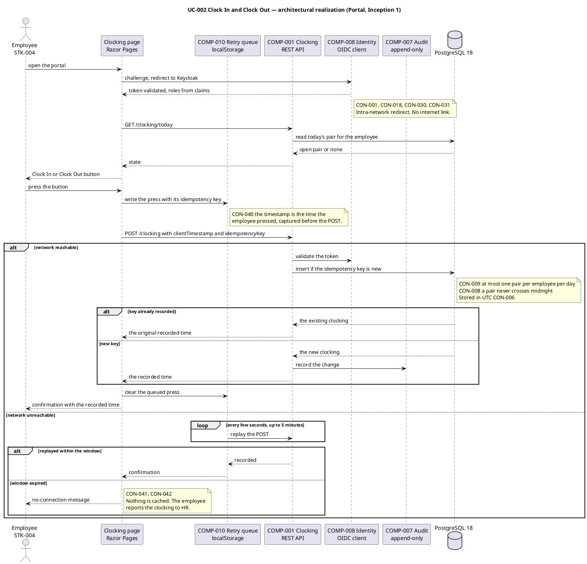
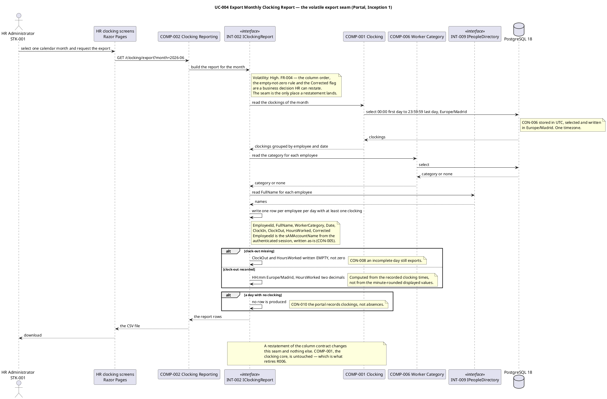
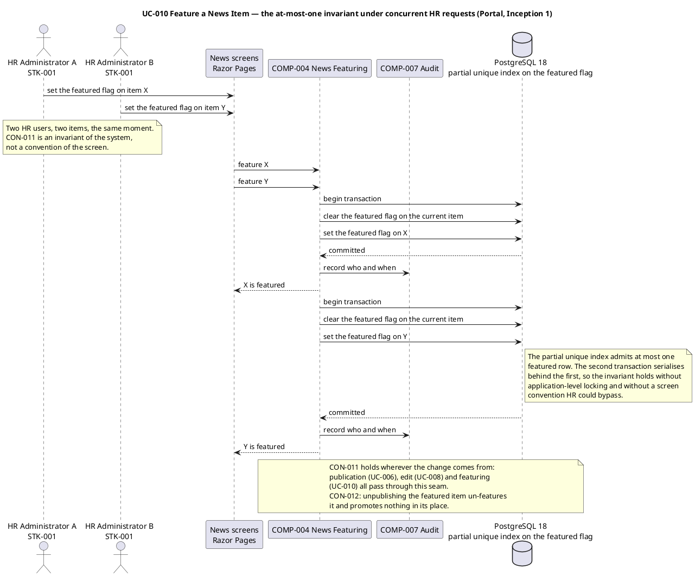
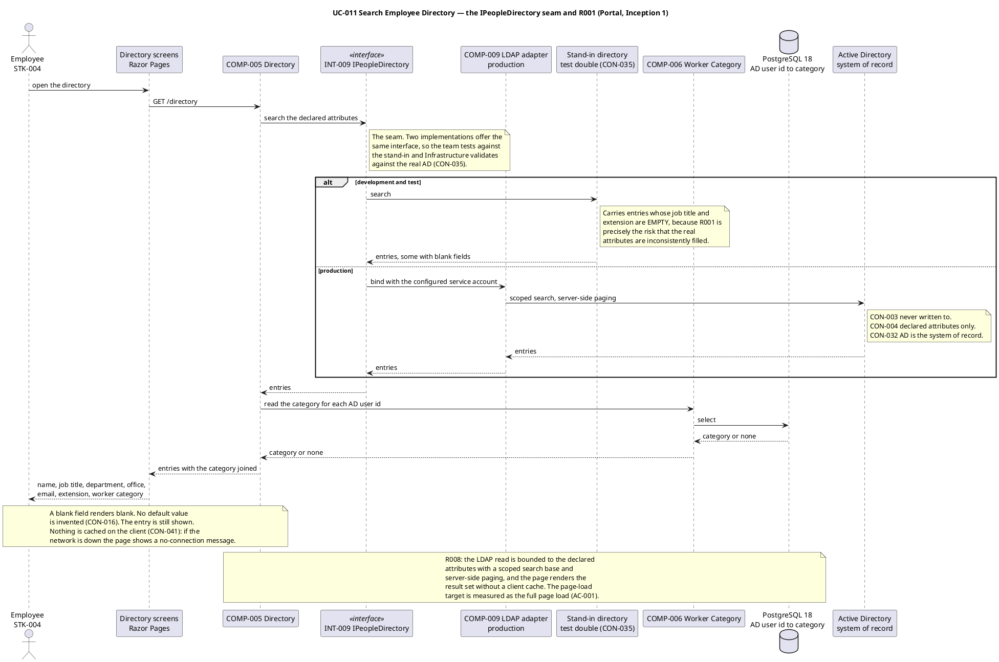
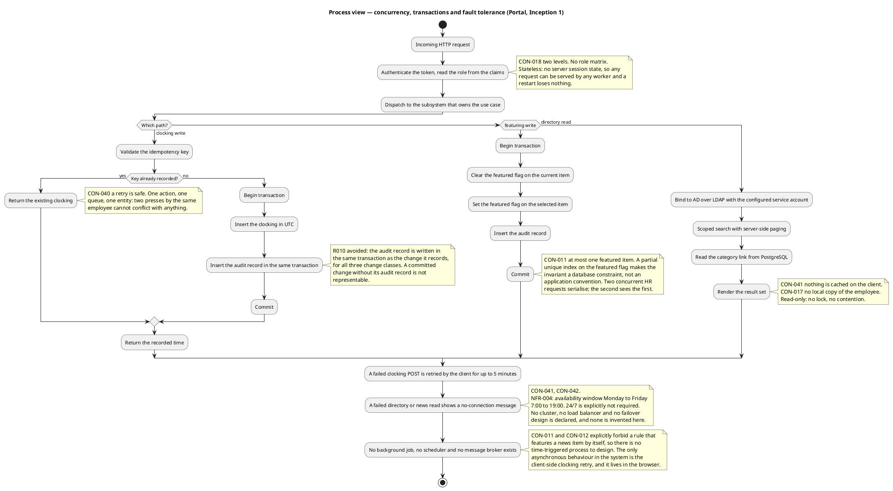
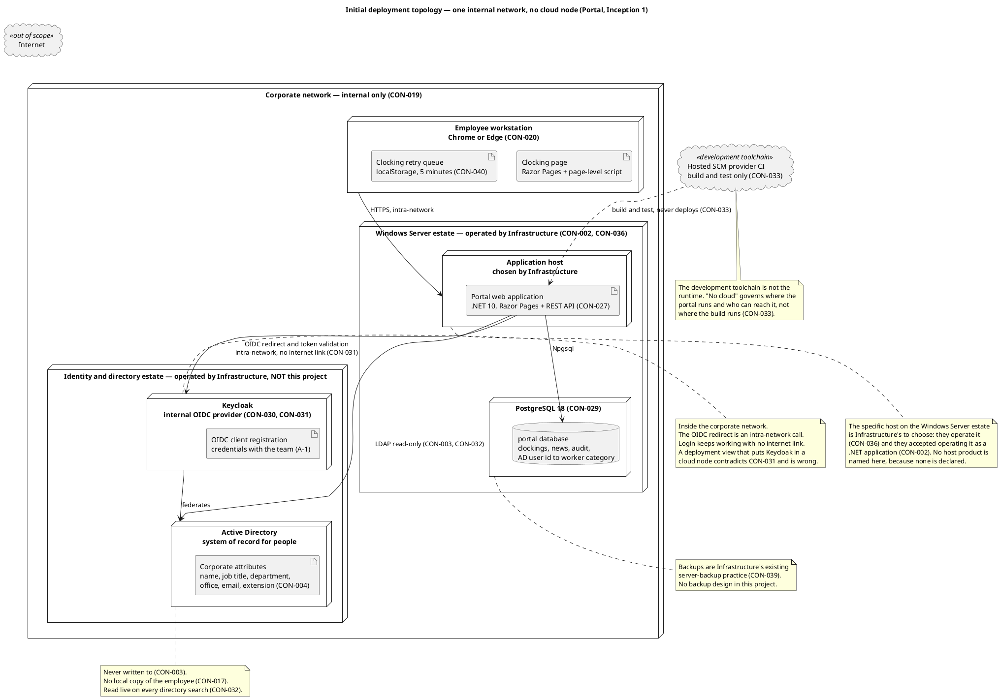
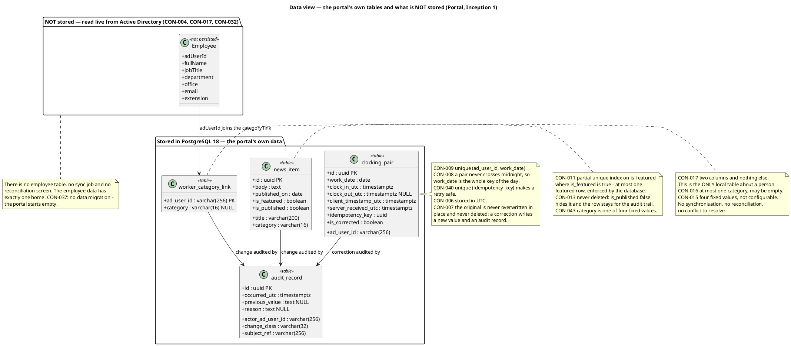

## Document Control
- **Phase:** Inception
- **Status:** Draft — under review
- **Milestone Target:** End of Inception (not yet achieved)
- **Iteration:** 2, Cycle 1
- **Owner:** SoftwareArchitect
- **Date:** 2026-10-07
## Architectural Representation

This document is the architecture of the Employee Portal, expressed in the 4+1 view model. Each view is a slice cut through the model, illuminating only the elements with system-wide impact. Everything else is design detail and belongs to the Design Model.

| View | Primary diagram in this document | Addressed this iteration |
|---|---|---|
| Logical | Component diagram — layers, subsystems, interfaces | Yes — candidate |
| Process | Activity diagram — concurrency, transactions, fault tolerance | Yes — candidate |
| Deployment | Deployment diagram — nodes and component placement | Yes — candidate |
| Implementation | Component diagram — source organization and build structure | Yes — candidate |
| Use-Case | Sequence diagrams for the architecturally significant scenarios | Yes — four scenarios |
| Data | Class diagram — the portal's own tables | Yes — candidate |

**Notation.** UML 2.5. Components are `<<component>>`; interfaces use ball-and-socket notation; external systems are drawn outside the system boundary. Identifiers are stable: `COMP-NNN` for components, `INT-NNN` for interfaces, `ADR-NNN` for decisions.

**Scope of this iteration.** Inception produces a CANDIDATE architecture — a sketch sufficient to surface architectural risk and to guide Elaboration planning. It is not a baseline. The baseline is produced in Elaboration and validated by an executable prototype against the stand-ins (CON-035).

## Architectural Goals and Constraints

### Goals

| ID | Goal | Source | Architectural tactic |
|---|---|---|---|
| G-1 | A clocking press is never lost and never double-recorded. | FR-002, AC-006, CON-040 | Client-side retry queue with an idempotency key; the server accepts the client timestamp and records its own receipt time alongside it. |
| G-2 | The full page load stays under 3 seconds on the corporate network, including the clocking page's script. | NFR-002, AC-001 | Server-side rendering (Razor Pages, no SPA); a bounded LDAP read with a scoped search base and server-side paging; no client cache. |
| G-3 | The clocking operation responds in under 1 second. | NFR-003 | A single indexed insert on a unique key; no synchronous call to AD on the clocking path. |
| G-4 | Every change of the three audited classes leaves an audit record. | NFR-001, NFR-005 | The audit record is written in the same transaction as the change it records. |
| G-5 | A restatement of the export contract or the featuring policy does not reach the clocking or news core. | FR-004, FR-010 (Volatility: High), R006 | One seam per volatile area: `INT-002 IClockingReport`, `INT-004 IFeaturingPolicy`. |
| G-6 | People data has exactly one home and the portal never writes to it. | CON-003, CON-004, CON-017, CON-032 | Live LDAP read behind `INT-009 IPeopleDirectory`; the only local table about a person is the two-column category link. |

### Constraints that shape the structure

| ID | Constraint | Structural consequence |
|---|---|---|
| CON-002, CON-027, CON-029 | .NET 10 on the Windows Server estate; PostgreSQL 18. | One ASP.NET Core application and one database. No container platform, no orchestrator. |
| CON-028 | Razor Pages; no client-side framework and no client-side router. | Server-rendered pages. The clocking page carries one page-level script — that is Razor Pages as normal. |
| CON-030, CON-031 | Keycloak is already running inside the corporate network and is not ours to deploy. | The portal is an OIDC client only. No identity store, no realm design, no Keycloak node in the deployment view as something we install. |
| CON-032, CON-004 | The directory is read directly from AD over LDAP; AD is the system of record. | A read-only adapter behind an interface. No employee table, no sync job. |
| CON-017 | The category is stored as a link — AD user id to category. | One two-column table. No reconciliation, no conflict resolution. |
| CON-019, CON-020 | Internal network only; current Chrome and Edge. | No CDN, no external asset, no cross-origin dependency. |
| CON-035 | The team works against stand-ins; placeholder values live in configuration. | Every external adapter is behind an interface with a stand-in implementation. |
| CON-036, CON-039 | Infrastructure operates, deploys, patches and backs up. | No deployment automation, no backup design and no monitoring design in this project. |

### Technology stack

The stack is the stakeholder's declaration, anchored to the enterprise version policy. No technology is chosen here that the stakeholder did not declare.

| Layer | Technology | Version | Authority |
|---|---|---|---|
| Runtime | .NET | 10 | CON-027; enterprise version policy pin |
| Web framework | ASP.NET Core Razor Pages | 10 | CON-028 |
| API style | REST over HTTP | — | CON-027 |
| Database | PostgreSQL | 18 (major pinned, patch floats) | CON-029; enterprise version policy pin |
| Data access | Npgsql | 10.0.3 | Registry latest; no policy pin governs it |
| OIDC client | Microsoft.AspNetCore.Authentication.OpenIdConnect | 10.0.12 | Registry latest; no policy pin governs it |
| LDAP client | System.DirectoryServices.Protocols | 10.0.12 | Registry latest; no policy pin governs it |
| Identity provider | Keycloak (existing, internal) | not ours | CON-030, CON-031 |
| Directory | Active Directory (existing, read-only) | not ours | CON-003, CON-004, CON-032 |

No version is quoted from memory. The two framework pins come from the enterprise version policy; the three library versions were resolved against the official registry, and no policy pin governs them.

### Architecture Decision Records

#### ADR-001 — Architectural style: layered application with ports at the two external systems

| Field | Value |
|---|---|
| Status | Accepted |
| Context | One .NET 10 application, one PostgreSQL instance, one internal network, 200 declared users, an availability window of Monday–Friday 7:00–19:00 with 24/7 explicitly not required (NFR-004). Two external systems the portal consumes but does not own: Keycloak and Active Directory. |
| Decision | A layered application — Presentation (Razor Pages), Application (REST API and use-case logic), Domain (entities and invariants), Infrastructure (adapters) — with a port (interface) at each of the two external systems. |
| Alternatives considered | (a) Microservices per process area. Rejected: three processes, 200 users, one database and one server; the operational cost of several deployables falls on Infrastructure, who accepted operating *a* .NET application (CON-002), and no scaling requirement is declared. (b) Event-driven with a message broker. Rejected: no asynchronous business process is declared, and CON-011 and CON-012 forbid a rule that features a news item by itself, so there is no event to react to. (c) CQRS with separate read and write models. Rejected: the read volume is 200 users on an intranet; the complexity buys nothing the declared NFRs ask for. |
| Trade-offs | A single deployable is a single point of failure. Accepted: NFR-004 declares fault tolerance *within the corporate network* and explicitly not 24/7, and no failover design is declared. |
| Consequences | The whole system is one build and one deployment, which Infrastructure already operates. A future need to scale one process area is a Change Request, not a redesign. |

#### ADR-002 — Decomposition by area of change, not by feature

| Field | Value |
|---|---|
| Status | Accepted |
| Context | The Use-Case Model marks two features `Volatility: High`: FR-004 (the export column contract and the empty-not-zero rule) and FR-010 (the featuring policy). Both encode a business decision HR can restate without any change to the stored data. The invariants behind them — CON-011, CON-012, CON-013 — are stable. |
| Decision | Each volatile area gets its own subsystem and its own interface: `COMP-002 Clocking Reporting` behind `INT-002 IClockingReport`, and `COMP-004 News Featuring` behind `INT-004 IFeaturingPolicy`. The remaining subsystems are grouped by the invariant each protects, not by the screen each serves. |
| Alternatives considered | (a) One subsystem per process area — Clocking, News, Directory. Rejected: it is a functional decomposition, and a restatement of the export contract would reach the clocking core. (b) One subsystem per screen. Rejected: it maximizes the effect of change and produces a component diagram that is a feature list. (c) A single application service. Rejected: it hides the two volatile seams that R006 exists to retire. |
| Trade-offs | Two more subsystems than a feature decomposition would produce, and two more interfaces. Accepted: the seams are exactly what makes a restatement cheap, and R006 is retired by them. |
| Consequences | `COMP-003 News` depends on `INT-004` rather than owning the featured flag, so the at-most-one invariant holds wherever the change comes from — publication, edit or featuring — not only in the form HR happens to use (CON-011). |

#### ADR-003 — Persistence: the invariants are database constraints, not application conventions

| Field | Value |
|---|---|
| Status | Accepted |
| Context | Three invariants must hold wherever the change comes from: at most one clocking pair per employee per calendar day (CON-009), at most one featured news item at any moment (CON-011), and a retry must not record a second clocking (CON-040). Two HR users can act at the same moment. |
| Decision | Enforce them in PostgreSQL 18: a unique constraint on `(ad_user_id, work_date)`; a partial unique index on `is_featured` where `is_featured` is true; a unique constraint on `idempotency_key`. The audit record is written in the same transaction as the change it records. |
| Alternatives considered | (a) Application-level locking. Rejected: it holds only for the code path that takes the lock, and CON-011 requires the invariant to hold wherever the change comes from. (b) A separate audit store or an event log. Rejected: NFR-005 has the audit trail read directly from the database, and a second store introduces a consistency problem the declared scope does not ask for. (c) Event sourcing. Rejected: it is a whole architecture for a system whose audit requirement is three change classes. |
| Trade-offs | The database is now the authority for the invariants, so a schema change is an architectural change. Accepted: the invariants are declared and stable, and the volatile parts — the export contract and the featuring policy — are deliberately not in the schema. |
| Consequences | R010 is avoided by construction: a committed change without its audit record is not representable. |

#### ADR-004 — Identity: OIDC client of the existing Keycloak, roles from claims, no local user store

| Field | Value |
|---|---|
| Status | Accepted |
| Context | Keycloak is already running inside the corporate network, already federated to AD, maintained by someone else (CON-030, CON-031). Authorization has exactly two levels derived from AD group membership (CON-018). |
| Decision | The portal registers an OIDC client, redirects for login, validates the token and reads the role from its claims. It stores no user, no password and no role. The two levels are a single authorization check at the API boundary. |
| Alternatives considered | (a) Local authentication. Rejected: it contradicts CON-001 and CON-030 and would create a second identity store. (b) A Keycloak realm design with per-screen roles. Rejected: explicitly out of scope, and CON-018 declares two levels with no role matrix. (c) Reading AD group membership directly over LDAP on every request. Rejected: CON-032 makes Keycloak the authentication and authorization authority; a second path to the same fact is a second thing to keep correct. |
| Trade-offs | The portal cannot start a session without Keycloak. Accepted: CON-025 declares Keycloak's availability not a risk of this project, and CON-031 places it inside the network so login works with no internet link. |
| Consequences | The application is stateless with respect to identity: no server session state, so any request can be served by any worker and a restart loses nothing. |

#### ADR-005 — People data: live LDAP read behind a port, no local copy

| Field | Value |
|---|---|
| Status | Accepted |
| Context | AD is the system of record for people and must not be modified (CON-003, CON-004, CON-032). The portal stores AD user id to worker category and nothing else about a person (CON-017). R001 is the risk that job title and extension are inconsistently filled across the three offices. |
| Decision | `COMP-005 Directory` reads people data through `INT-009 IPeopleDirectory`. The production implementation is an LDAP adapter; the development and test implementation is a stand-in directory carrying the declared attributes, including entries whose job title and extension are empty. Nothing about a person is persisted. |
| Alternatives considered | (a) A nightly sync of AD into a local employee table. Rejected: explicitly out of scope — no sync job, no reconciliation screen, no conflict resolution. (b) A short-lived server-side cache of directory results. Rejected: it creates a second copy of people data and a staleness question the declared scope does not ask for. (c) Querying Keycloak for the attributes. Rejected: CON-032 states Keycloak is not a directory to query. |
| Trade-offs | Every directory search costs a live LDAP round trip, which bears on NFR-002. Accepted and bounded: the read is scoped to the declared attributes with a scoped search base and server-side paging, and the page-load target is measured as the full page load (AC-001). |
| Consequences | The port is what lets the team build and test the blank-attribute path from the first iteration, while the real-AD validation is human work by Infrastructure with HR (CON-035, R003). |

#### ADR-006 — Clocking timestamp: accept the client's time, record the server's alongside it

| Field | Value |
|---|---|
| Status | Accepted |
| Context | CON-040 requires the server to accept the timestamp the client sends — the time the employee pressed the button, not the time the server received it — because otherwise the audit trail records something that did not happen. R004 is the risk that a skewed client clock records a time that did not happen. |
| Decision | The clocking pair stores `client_timestamp_utc` and `server_received_utc` side by side, plus an `idempotency_key`. The server accepts the client timestamp, records its own receipt time, and rejects a duplicate key by returning the already-recorded clocking. |
| Alternatives considered | (a) Server timestamp only. Rejected: it contradicts CON-040 and records a time that did not happen when the network is down. (b) Reject a press whose client timestamp deviates beyond a threshold. Rejected: it loses the clocking CON-040 requires the server to accept, and no threshold is declared. (c) Trust the client timestamp with no server record. Rejected: a skew would then be undetectable from the data. |
| Trade-offs | The stored pair carries two timestamps and the displayed time is the client's. Accepted: the second timestamp is what makes a skew detectable without rejecting the press, and HR can correct an affected clocking with who, when, previous value and reason (UC-005, NFR-001). |
| Consequences | The early-warning indicator for R004 is readable from the data: recorded times clustering at implausible minutes, or a clocking whose client timestamp precedes the previous day's clock-out. |

## Use-Case View

The Use-Case view validates every other view: each architecturally significant scenario is traced through the components, the interfaces, the transactions and the nodes that carry it. Five use cases are architecturally significant this iteration; four carry a realization diagram.

| UC | Source | Why architecturally significant | Views exercised |
|---|---|---|---|
| UC-002 Clock In and Clock Out | FR-002 | Client-supplied timestamp, idempotency key, 5-minute offline retry (CON-040, NFR-003, AC-006) | Logical, Process, Deployment, Implementation |
| UC-004 Export Monthly Clocking Report as CSV | FR-004 | High volatility: the fixed column contract and the empty-not-zero semantics | Logical, Data, Use-Case |
| UC-005 Correct or Insert a Clocking | FR-005 | Append-only correction with audit; the original is never overwritten in place (CON-007, NFR-001) | Logical, Process, Data |
| UC-010 Feature or Un-feature a News Item | FR-010 | High volatility: the at-most-one-featured invariant (CON-011, CON-012) | Logical, Process, Data |
| UC-011 Search Employee Directory | FR-011 | Live LDAP read with no local copy (CON-032, R001, R008) | Logical, Deployment, Data |

```plantuml
@startuml
title UC-002 Clock In and Clock Out — architectural realization (Portal, Inception 1)

actor "Employee\nSTK-004" as EMP
participant "Clocking page\nRazor Pages" as PAGE
participant "COMP-010 Retry queue\nlocalStorage" as Q
participant "COMP-001 Clocking\nREST API" as API
participant "COMP-008 Identity\nOIDC client" as ID
participant "COMP-007 Audit\nappend-only" as AUD
database "PostgreSQL 18" as DB

EMP -> PAGE : open the portal
PAGE -> ID : challenge, redirect to Keycloak
ID --> PAGE : token validated, roles from claims
note right of ID
  CON-001, CON-018, CON-030, CON-031
  Intra-network redirect. No internet link.
end note

PAGE -> API : GET /clocking/today
API -> DB : read today's pair for the employee
DB --> API : open pair or none
API --> PAGE : state
PAGE --> EMP : Clock In or Clock Out button

EMP -> PAGE : press the button
PAGE -> Q : write the press with its idempotency key
note right of Q
  CON-040 the timestamp is the time the
  employee pressed, captured before the POST.
end note

PAGE -> API : POST /clocking with clientTimestamp and idempotencyKey
alt network reachable
  API -> ID : validate the token
  API -> DB : insert if the idempotency key is new
  note right of DB
    CON-009 at most one pair per employee per day
    CON-008 a pair never crosses midnight
    Stored in UTC CON-006
  end note
  alt key already recorded
    DB --> API : the existing clocking
    API --> PAGE : the original recorded time
  else new key
    DB --> API : the new clocking
    API -> AUD : record the change
    API --> PAGE : the recorded time
  end
  PAGE -> Q : clear the queued press
  PAGE --> EMP : confirmation with the recorded time
else network unreachable
  loop every few seconds, up to 5 minutes
    Q -> API : replay the POST
  end
  alt replayed within the window
    API --> Q : recorded
    Q --> PAGE : confirmation
  else window expired
    PAGE --> EMP : no-connection message
    note right
      CON-041, CON-042
      Nothing is cached. The employee
      reports the clocking to HR.
    end note
  end
end
@enduml
```

```plantuml
@startuml
title UC-004 Export Monthly Clocking Report — the volatile export seam (Portal, Inception 1)

actor "HR Administrator\nSTK-001" as HR
participant "HR clocking screens\nRazor Pages" as UI
participant "COMP-002 Clocking Reporting" as REP
participant "INT-002 IClockingReport" as SEAM <<interface>>
participant "COMP-001 Clocking" as CLK
participant "COMP-006 Worker Category" as CAT
participant "INT-009 IPeopleDirectory" as PORT <<interface>>
database "PostgreSQL 18" as DB

HR -> UI : select one calendar month and request the export
UI -> REP : GET /clocking/export?month=2026-06
REP -> SEAM : build the report for the month
note right of SEAM
  Volatility: High. FR-004 — the column order,
  the empty-not-zero rule and the Corrected flag
  are a business decision HR can restate.
  The seam is the only place a restatement lands.
end note

SEAM -> CLK : read the clockings of the month
CLK -> DB : select 00:00 first day to 23:59:59 last day, Europe/Madrid
note right of DB
  CON-006 stored in UTC, selected and written
  in Europe/Madrid. One timezone.
end note
DB --> CLK : clockings
CLK --> SEAM : clockings grouped by employee and date

SEAM -> CAT : read the category for each employee
CAT -> DB : select
DB --> CAT : category or none
CAT --> SEAM : category or none

SEAM -> PORT : read FullName for each employee
PORT --> SEAM : names

SEAM -> SEAM : write one row per employee per day with at least one clocking
note right of SEAM
  EmployeeId, FullName, WorkerCategory, Date,
  ClockIn, ClockOut, HoursWorked, Corrected
  EmployeeId is the sAMAccountName from the
  authenticated session, written as-is (CON-005).
end note

alt clock-out missing
  SEAM -> SEAM : ClockOut and HoursWorked written EMPTY, not zero
  note right
    CON-008 an incomplete day still exports.
  end note
else clock-out recorded
  SEAM -> SEAM : HH:mm Europe/Madrid, HoursWorked two decimals
  note right
    Computed from the recorded clocking times,
    not from the minute-rounded displayed values.
  end note
end

alt a day with no clocking
  SEAM -> SEAM : no row is produced
  note right
    CON-010 the portal records clockings, not absences.
  end note
end

SEAM --> REP : the report rows
REP --> UI : the CSV file
UI --> HR : download

note over CLK, SEAM
  A restatement of the column contract changes
  this seam and nothing else. COMP-001, the
  clocking core, is untouched — which is what
  retires R006.
end note
@enduml
```

```plantuml
@startuml
title UC-010 Feature a News Item — the at-most-one invariant under concurrent HR requests (Portal, Inception 1)

actor "HR Administrator A\nSTK-001" as HRA
actor "HR Administrator B\nSTK-001" as HRB
participant "News screens\nRazor Pages" as UI
participant "COMP-004 News Featuring" as F
participant "COMP-007 Audit" as AUD
database "PostgreSQL 18\npartial unique index on the featured flag" as DB

HRA -> UI : set the featured flag on item X
HRB -> UI : set the featured flag on item Y
note over HRA, HRB
  Two HR users, two items, the same moment.
  CON-011 is an invariant of the system,
  not a convention of the screen.
end note

UI -> F : feature X
UI -> F : feature Y

F -> DB : begin transaction
F -> DB : clear the featured flag on the current item
F -> DB : set the featured flag on X
DB --> F : committed
F -> AUD : record who and when
F --> UI : X is featured

F -> DB : begin transaction
F -> DB : clear the featured flag on the current item
F -> DB : set the featured flag on Y
note right of DB
  The partial unique index admits at most one
  featured row. The second transaction serialises
  behind the first, so the invariant holds without
  application-level locking and without a screen
  convention HR could bypass.
end note
DB --> F : committed
F -> AUD : record who and when
F --> UI : Y is featured

note over F, DB
  CON-011 holds wherever the change comes from:
  publication (UC-006), edit (UC-008) and featuring
  (UC-010) all pass through this seam.
  CON-012: unpublishing the featured item un-features
  it and promotes nothing in its place.
end note
@enduml
```

```plantuml
@startuml
title UC-011 Search Employee Directory — the IPeopleDirectory seam and R001 (Portal, Inception 1)

actor "Employee\nSTK-004" as EMP
participant "Directory screens\nRazor Pages" as UI
participant "COMP-005 Directory" as DIR
participant "INT-009 IPeopleDirectory" as PORT <<interface>>
participant "COMP-009 LDAP adapter\nproduction" as LDAP
participant "Stand-in directory\ntest double (CON-035)" as STUB
participant "COMP-006 Worker Category" as CAT
database "PostgreSQL 18\nAD user id to category" as DB
participant "Active Directory\nsystem of record" as AD

EMP -> UI : open the directory
UI -> DIR : GET /directory
DIR -> PORT : search the declared attributes
note right of PORT
  The seam. Two implementations offer the
  same interface, so the team tests against
  the stand-in and Infrastructure validates
  against the real AD (CON-035).
end note

alt development and test
  PORT -> STUB : search
  note right of STUB
    Carries entries whose job title and
    extension are EMPTY, because R001 is
    precisely the risk that the real
    attributes are inconsistently filled.
  end note
  STUB --> PORT : entries, some with blank fields
else production
  PORT -> LDAP : bind with the configured service account
  LDAP -> AD : scoped search, server-side paging
  note right of AD
    CON-003 never written to.
    CON-004 declared attributes only.
    CON-032 AD is the system of record.
  end note
  AD --> LDAP : entries
  LDAP --> PORT : entries
end

PORT --> DIR : entries
DIR -> CAT : read the category for each AD user id
CAT -> DB : select
DB --> CAT : category or none
CAT --> DIR : category or none
DIR --> UI : entries with the category joined
UI --> EMP : name, job title, department, office,\nemail, extension, worker category

note over DIR, EMP
  A blank field renders blank. No default value
  is invented (CON-016). The entry is still shown.
  Nothing is cached on the client (CON-041): if the
  network is down the page shows a no-connection message.
end note

note over DIR, DB
  R008: the LDAP read is bounded to the declared
  attributes with a scoped search base and
  server-side paging, and the page renders the
  result set without a client cache. The page-load
  target is measured as the full page load (AC-001).
end note
@enduml
```

### UC-005 realization — append-only correction

UC-005 carries no sequence diagram of its own: its realization is the audit mechanism in the Logical view and the clocking-write transaction in the Process view. The correction path is the clocking write with one addition — the previous value and the free-text reason are captured before the new value is written, and both are written in the same transaction as the change. The original record is never overwritten in place and never deleted (CON-007), which is why `clocking_pair` carries `is_corrected` and the audit record carries `previous_value` and `reason`.

## Logical View

```plantuml
@startuml
title Candidate architecture — layers, subsystems and interfaces (Portal, Inception 1)

skinparam componentStyle rectangle
skinparam packageStyle rectangle

package "Client — internal corporate network, Chrome and Edge (CON-019, CON-020)" as CLIENT {
  component "Clocking page\nRazor Pages + page-level script (CON-028)" as PAGE
  component "COMP-010 Clocking Retry Queue\nlocalStorage, retry up to 5 minutes (CON-040)" as C10
  PAGE --> C10 : enqueue, replay
}

package "Presentation — Razor Pages (CON-028)" as PRES {
  component "Clocking screens\nUC-001, UC-002" as P1
  component "HR clocking screens\nUC-003, UC-004, UC-005" as P2
  component "News screens\nUC-006 to UC-010" as P3
  component "Directory screens\nUC-011, UC-012" as P4
}

package "Application — REST API, .NET 10 (CON-027)" as APP {
  component "COMP-001 Clocking\npair per day, idempotency,\nclient timestamp acceptance" as C1
  component "COMP-002 Clocking Reporting\nvolatile export seam (FR-004)" as C2
  component "COMP-003 News\npublish, edit, unpublish, never delete" as C3
  component "COMP-004 News Featuring\nat-most-one invariant (CON-011)" as C4
  component "COMP-005 Directory\nsearch and join" as C5
  component "COMP-006 Worker Category\ntwo-column link, closed list" as C6
}

package "Cross-cutting mechanisms" as XCUT {
  component "COMP-007 Audit Trail\nappend-only (NFR-001)" as C7
  component "COMP-008 Identity and Access\nOIDC client, two levels (CON-018)" as C8
}

package "Adapters — seams to systems we do not own" as ADAPT {
  component "COMP-009 People Directory Port\nLDAP read of AD (CON-032)" as C9
}

package "Data — PostgreSQL 18 (CON-029)" as DATA {
  database "Clockings, news, audit,\nAD user id to worker category" as DB
}

component "Keycloak\ninternal OIDC provider (CON-030, CON-031)" as KC <<external>>
component "Active Directory\nsystem of record for people (CON-003, CON-004)" as AD <<external>>

() "INT-001\nIClocking" as I1
() "INT-002\nIClockingReport" as I2
() "INT-003\nINews" as I3
() "INT-004\nIFeaturingPolicy" as I4
() "INT-005\nIDirectorySearch" as I5
() "INT-006\nIWorkerCategoryStore" as I6
() "INT-007\nIAuditTrail" as I7
() "INT-008\nIIdentityContext" as I8
() "INT-009\nIPeopleDirectory" as I9
() "INT-010\nIClockingQueue" as I10

C1 -- I1
C2 -- I2
C3 -- I3
C4 -- I4
C5 -- I5
C6 -- I6
C7 -- I7
C8 -- I8
C9 -- I9
C10 -- I10

P1 ..> I1
P1 ..> I2
P2 ..> I1
P2 ..> I2
P3 ..> I3
P3 ..> I4
P4 ..> I5
P4 ..> I6

C1 ..> I7 : audit
C3 ..> I7 : audit
C4 ..> I7 : audit
C6 ..> I7 : audit
C1 ..> I8
C2 ..> I8
C3 ..> I8
C4 ..> I8
C5 ..> I8
C6 ..> I8
C5 ..> I9 : people data
C5 ..> I6 : category join
C2 ..> I6 : category column
C3 ..> I4 : featured item
C1 ..> DB
C2 ..> DB
C3 ..> DB
C4 ..> DB
C6 ..> DB
C7 ..> DB
C9 ..> AD : LDAP, read-only
C8 ..> KC : OIDC redirect, token validation

note bottom of C2
  Volatility: High. FR-004 — the column contract
  and the empty-not-zero rule are a business
  decision HR can restate. Encapsulated so a
  restatement does not reach COMP-001.
end note

note bottom of C4
  Volatility: High. FR-010 — the featuring policy
  is a business decision. The invariant behind it
  (CON-011, CON-012) is stable and is enforced here,
  not in the screen HR happens to use.
end note

note bottom of C9
  R001 lives here. The seam is what lets the team
  test against a stand-in directory carrying empty
  job title and extension (CON-035).
end note
@enduml
```

### Subsystems

Each subsystem encapsulates one area of change and hides it from every other. The two `Volatility: High` areas of the Use-Case Model each own a subsystem and an interface; the rest are grouped by the invariant they protect.

| ID | Subsystem | Encapsulates | Volatility absorbed | Offers | Depends on |
|---|---|---|---|---|---|
| COMP-001 | Clocking | The clocking pair and its invariants: one pair per employee per calendar day, a pair never crossing midnight, the idempotency key, and the acceptance of the client timestamp. | Low | INT-001 | INT-007, INT-008, PostgreSQL |
| COMP-002 | Clocking Reporting | The export contract: the column order, the empty-not-zero rule, the Corrected flag, the Europe/Madrid rendering. | **High** (FR-004) | INT-002 | INT-001, INT-006, INT-009, INT-008 |
| COMP-003 | News | The news lifecycle: publish, edit, unpublish, never delete. | Low | INT-003 | INT-004, INT-007, INT-008 |
| COMP-004 | News Featuring | The featuring policy and the at-most-one invariant, enforced wherever the change comes from. | **High** (FR-010) | INT-004 | INT-007, INT-008, PostgreSQL |
| COMP-005 | Directory | The composition of a directory entry: a live AD read joined to the local category link. | Medium | INT-005 | INT-009, INT-006, INT-008 |
| COMP-006 | Worker Category | The only write the portal makes about a person, and the closed four-value list. | Medium | INT-006 | INT-007, INT-008, PostgreSQL |
| COMP-007 | Audit Trail | The append-only record of the three audited change classes. | Low | INT-007 | PostgreSQL |
| COMP-008 | Identity and Access | The OIDC client and the two authorization levels read from token claims. | Low | INT-008 | Keycloak |
| COMP-009 | People Directory Port | The LDAP read of AD: the bind, the scoped search, the declared attributes, the blank-field path. | Medium | INT-009 | Active Directory |
| COMP-010 | Clocking Retry Queue | The client-side press queue and its replay within the 5-minute window. | Low | INT-010 | Browser localStorage |

**Why this is not a functional decomposition.** A feature decomposition would produce Clocking, News and Directory — three subsystems mirroring the three processes, so a restatement of the export contract would reach the clocking core. Here the two volatile areas are separated from the cores they would otherwise contaminate: `COMP-002` from `COMP-001`, and `COMP-004` from `COMP-003`. `COMP-003` does not own the featured flag; it asks `INT-004` for it, which is what makes CON-011 hold for publication and edit as well as for featuring.

**Why it is not too fine-grained.** Ten subsystems for twelve use cases, three processes and two cross-cutting mechanisms. No subsystem is a pass-through: each owns a decision, an invariant or a seam. `COMP-007` and `COMP-008` are the two cross-cutting mechanisms the Supplementary Specification names, and they are subsystems here rather than use cases — which is the correct home for them.

### Interfaces

Every subsystem boundary is an interface. No subsystem depends on a concrete class of another.

| ID | Interface | Contract | Implemented by | Used by |
|---|---|---|---|---|
| INT-001 | IClocking | Read today's state; record a press with a client timestamp and an idempotency key; read a month of clockings. | COMP-001 | COMP-002, Presentation |
| INT-002 | IClockingReport | Build the monthly report rows for a calendar month. | COMP-002 | Presentation |
| INT-003 | INews | Publish, edit, unpublish, list newest-first, filter by category. | COMP-003 | Presentation |
| INT-004 | IFeaturingPolicy | Feature an item, un-feature an item, read the featured item. Enforces at most one. | COMP-004 | COMP-003, Presentation |
| INT-005 | IDirectorySearch | Search the directory by name, department or office. | COMP-005 | Presentation |
| INT-006 | IWorkerCategoryStore | Read, assign and clear a worker's category. | COMP-006 | COMP-002, COMP-005, Presentation |
| INT-007 | IAuditTrail | Append an audit record for a change of one of the three classes. | COMP-007 | COMP-001, COMP-003, COMP-004, COMP-006 |
| INT-008 | IIdentityContext | The authenticated AD user id and the two-level role. | COMP-008 | COMP-001 to COMP-006 |
| INT-009 | IPeopleDirectory | Read the declared corporate attributes for a set of AD user ids. | COMP-009, stand-in directory | COMP-002, COMP-005 |
| INT-010 | IClockingQueue | Enqueue a press, replay it, clear it. | COMP-010 | Clocking page script |

## Process View

```plantuml
@startuml
title Process view — concurrency, transactions and fault tolerance (Portal, Inception 1)

start
:Incoming HTTP request;
:Authenticate the token, read the role from the claims;
note right
  CON-018 two levels. No role matrix.
  Stateless: no server session state, so any
  request can be served by any worker and a
  restart loses nothing.
end note
:Dispatch to the subsystem that owns the use case;

if (Which path?) then (clocking write)
  :Validate the idempotency key;
  if (Key already recorded?) then (yes)
    :Return the existing clocking;
    note right
      CON-040 a retry is safe. One action, one
      queue, one entity: two presses by the same
      employee cannot conflict with anything.
    end note
  else (no)
    :Begin transaction;
    :Insert the clocking in UTC;
    :Insert the audit record in the same transaction;
    note right
      R010 avoided: the audit record is written in
      the same transaction as the change it records,
      for all three change classes. A committed
      change without its audit record is not
      representable.
    end note
    :Commit;
  endif
  :Return the recorded time;
elseif (featuring write)
  :Begin transaction;
  :Clear the featured flag on the current item;
  :Set the featured flag on the selected item;
  :Insert the audit record;
  :Commit;
  note right
    CON-011 at most one featured item. A partial
    unique index on the featured flag makes the
    invariant a database constraint, not an
    application convention. Two concurrent HR
    requests serialise; the second sees the first.
  end note
else (directory read)
  :Bind to AD over LDAP with the configured service account;
  :Scoped search with server-side paging;
  :Read the category link from PostgreSQL;
  :Render the result set;
  note right
    CON-041 nothing is cached on the client.
    CON-017 no local copy of the employee.
    Read-only: no lock, no contention.
  end note
endif

:A failed clocking POST is retried by the client for up to 5 minutes;
:A failed directory or news read shows a no-connection message;
note right
  CON-041, CON-042.
  NFR-004: availability window Monday to Friday
  7:00 to 19:00. 24/7 is explicitly not required.
  No cluster, no load balancer and no failover
  design is declared, and none is invented here.
end note

:No background job, no scheduler and no message broker exists;
note right
  CON-011 and CON-012 explicitly forbid a rule that
  features a news item by itself, so there is no
  time-triggered process to design. The only
  asynchronous behaviour in the system is the
  client-side clocking retry, and it lives in the browser.
end note
stop
@enduml
```

### Concurrency and transactions

| Concern | Treatment | Basis |
|---|---|---|
| Request handling | One task per request, no server session state. Identity is re-derived from the token on every request. | CON-018, ADR-004 |
| Clocking write | The only contended path. A unique constraint on `idempotency_key` makes a retry safe; a unique constraint on `(ad_user_id, work_date)` makes the one-pair-per-day rule a database fact. | CON-009, CON-040 |
| Featuring write | Serialised by a partial unique index on the featured flag. Two concurrent HR requests cannot both leave a featured row. | CON-011, ADR-003 |
| Directory read | Read-only, no shared mutable state, no lock. | CON-032, CON-041 |
| Audit write | In the same transaction as the change it records, for all three change classes. | NFR-001, R010 |
| Fault tolerance | Within the corporate network, in the declared window. A failed clocking POST is retried by the client; a failed read shows a no-connection message. | NFR-004, CON-040, CON-041 |
| Background processing | None. No scheduler, no queue broker, no batch job is declared, and CON-011 and CON-012 forbid a rule that features a news item by itself. | CON-011, CON-012 |

## Deployment View

```plantuml
@startuml
title Initial deployment topology — one internal network, no cloud node (Portal, Inception 1)

skinparam componentStyle rectangle
skinparam nodeSep 40

node "Corporate network — internal only (CON-019)" as NET {

  node "Employee workstation\nChrome or Edge (CON-020)" as WS {
    artifact "Clocking page\nRazor Pages + page-level script" as A1
    artifact "Clocking retry queue\nlocalStorage, 5 minutes (CON-040)" as A2
  }

  node "Windows Server estate — operated by Infrastructure (CON-002, CON-036)" as SRV {
    node "Application host\nchosen by Infrastructure" as HOST {
      artifact "Portal web application\n.NET 10, Razor Pages + REST API (CON-027)" as A3
    }
    node "PostgreSQL 18 (CON-029)" as PGS {
      database "portal database\nclockings, news, audit,\nAD user id to worker category" as DB
    }
  }

  node "Identity and directory estate — operated by Infrastructure, NOT this project" as IDM {
    node "Keycloak\ninternal OIDC provider (CON-030, CON-031)" as KC {
      artifact "OIDC client registration\ncredentials with the team (A-1)" as A4
    }
    node "Active Directory\nsystem of record for people" as AD {
      artifact "Corporate attributes\nname, job title, department,\noffice, email, extension (CON-004)" as A5
    }
  }
}

cloud "Internet" as INET <<out of scope>>
cloud "Hosted SCM provider CI\nbuild and test only (CON-033)" as CI <<development toolchain>>

WS --> HOST : HTTPS, intra-network
A3 --> KC : OIDC redirect and token validation\nintra-network, no internet link (CON-031)
A3 --> AD : LDAP read-only (CON-003, CON-032)
A3 --> DB : Npgsql
KC --> AD : federates
INET -[hidden]- NET
CI ..> A3 : build and test, never deploys (CON-033)

note right of KC
  Inside the corporate network.
  The OIDC redirect is an intra-network call.
  Login keeps working with no internet link.
  A deployment view that puts Keycloak in a
  cloud node contradicts CON-031 and is wrong.
end note

note bottom of HOST
  The specific host on the Windows Server estate
  is Infrastructure's to choose: they operate it
  (CON-036) and they accepted operating it as a
  .NET application (CON-002). No host product is
  named here, because none is declared.
end note

note bottom of AD
  Never written to (CON-003).
  No local copy of the employee (CON-017).
  Read live on every directory search (CON-032).
end note

note bottom of PGS
  Backups are Infrastructure's existing
  server-backup practice (CON-039).
  No backup design in this project.
end note

note bottom of CI
  The development toolchain is not the
  runtime. "No cloud" governs where the
  portal runs and who can reach it, not
  where the build runs (CON-033).
end note
@enduml
```

| Node | What runs there | Operated by | Basis |
|---|---|---|---|
| Employee workstation | The clocking page and its retry queue in browser localStorage. | The employee's own device. | CON-020, CON-040 |
| Application host on the Windows Server estate | The portal web application — Razor Pages and the REST API, one deployable. The specific host product is Infrastructure's to choose; none is declared and none is named here. | Infrastructure. | CON-002, CON-027, CON-036 |
| PostgreSQL 18 | The portal database: clockings, news, audit, and the two-column category link. | Infrastructure. | CON-029, CON-036, CON-039 |
| Keycloak | The existing internal OIDC provider. The portal registers a client; it deploys nothing here. | Infrastructure, separately. | CON-030, CON-031 |
| Active Directory | The system of record for people, read over LDAP and never written to. | Infrastructure. | CON-003, CON-004, CON-032 |
| Hosted SCM provider CI | Build and test only. Never holds production data or credentials and never deploys. | The development team. | CON-033 |

**One network, one timezone, one database.** No node is placed outside the corporate network. Keycloak is drawn inside it because CON-031 places it there: the OIDC redirect is an intra-network call and login keeps working with no internet link. The hosted CI is drawn outside the runtime boundary and marked as the development toolchain, because CON-033 governs where the portal runs and who can reach it, not where the build runs.

**No host product is named.** CON-002 declares the Windows Server estate and CON-036 leaves deployment and operation to Infrastructure. Which host runs the application is theirs to choose, and naming one here would be a technology the stakeholder did not declare.
## Implementation View

```plantuml
@startuml
title Implementation view — source organization and build structure (Portal, Inception 1)

skinparam componentStyle rectangle
skinparam packageStyle rectangle

package "Portal.sln" as SLN {

  package "src/Portal.Web — Razor Pages (CON-028)" as WEB {
    component "Pages/Clocking" as W1
    component "Pages/News" as W2
    component "Pages/Directory" as W3
    component "Pages/Shared" as W4
    component "wwwroot — design tokens from\ndocs/inputs/employee-portal-design.html (CON-038)" as W5
    component "wwwroot/js/clocking-queue.js\npage-level script (CON-028)" as W6
  }

  package "src/Portal.Api — REST API (CON-027)" as API {
    component "Endpoints/Clocking" as A1
    component "Endpoints/News" as A2
    component "Endpoints/Directory" as A3
  }

  package "src/Portal.Application — use-case logic" as APPL {
    component "Clocking" as P1
    component "ClockingReporting" as P2
    component "News" as P3
    component "Featuring" as P4
    component "Directory" as P5
    component "WorkerCategory" as P6
    component "Audit" as P7
    component "Identity" as P8
  }

  package "src/Portal.Domain — entities and invariants" as DOM {
    component "ClockingPair" as D1
    component "NewsItem" as D2
    component "WorkerCategoryLink" as D3
    component "AuditRecord" as D4
    component "Closed value lists\nWorkerCategory, NewsCategory" as D5
  }

  package "src/Portal.Infrastructure — adapters" as INFRA {
    component "Persistence — Npgsql 10.0.3" as I1
    component "PeopleDirectory.Ldap — System.DirectoryServices.Protocols 10.0.12" as I2
    component "Identity.Oidc — Microsoft.AspNetCore.Authentication.OpenIdConnect 10.0.12" as I3
    component "Configuration — placeholder values (CON-035)" as I4
  }

  package "tests/" as TESTS {
    component "Portal.UnitTests" as T1
    component "Portal.IntegrationTests\nagainst the stand-ins (CON-035)" as T2
    component "StandIn.Directory — carries empty\njob title and extension entries (R001)" as T3
    component "StandIn.OidcIssuer" as T4
  }
}

WEB --> API
API --> APPL
APPL --> DOM
APPL ..> INFRA
INFRA --> DOM
T1 --> DOM
T2 --> APPL
T2 ..> T3
T2 ..> T4

note bottom of INFRA
  Every adapter is behind an interface in
  Portal.Application. The LDAP adapter and the
  OIDC adapter are the only code that knows the
  real systems exist, and both are configured
  with placeholder values held in configuration,
  never in code (CON-035).
end note

note bottom of TESTS
  The stand-in directory carries entries whose job
  title and extension are EMPTY, because R001 is
  precisely the risk that the real attributes are
  inconsistently filled across the 3 offices.
end note

note bottom of SLN
  Build and test run on the hosted SCM provider's CI
  (CON-033). CI never holds production data or
  credentials and never deploys - Infrastructure does
  (CON-036).
end note
@enduml
```

| Project | Contains | Depends on | Basis |
|---|---|---|---|
| `src/Portal.Web` | Razor Pages, the design tokens from the mandatory design reference, and the one page-level clocking script. | `Portal.Api` | CON-028, CON-038 |
| `src/Portal.Api` | The REST endpoints. Thin: validation, authorization, dispatch. | `Portal.Application` | CON-027 |
| `src/Portal.Application` | The use-case logic and the interfaces every adapter implements. | `Portal.Domain` | ADR-001, ADR-002 |
| `src/Portal.Domain` | The entities and the invariants they carry. No dependency on any framework. | — | ADR-003 |
| `src/Portal.Infrastructure` | The adapters: persistence, LDAP, OIDC, configuration. | `Portal.Domain` | CON-035, ADR-005 |
| `tests/` | Unit tests, integration tests against the stand-ins, and the stand-ins themselves. | `Portal.Application` | CON-035, R001 |

**Dependency direction.** `Web` to `Api` to `Application` to `Domain`. `Infrastructure` implements interfaces declared in `Application` and is referenced only at composition time. No project references `Infrastructure` from `Domain` or `Application`, which is what keeps the two external systems replaceable by a stand-in.

## Data View

```plantuml
@startuml
title Data view — the portal's own tables and what is NOT stored (Portal, Inception 1)

skinparam classAttributeIconSize 0

package "Stored in PostgreSQL 18 — the portal's own data" as OWN {
  class "clocking_pair" as T1 <<table>> {
    + id : uuid PK
    + ad_user_id : varchar(256)
    + work_date : date
    + clock_in_utc : timestamptz
    + clock_out_utc : timestamptz NULL
    + client_timestamp_utc : timestamptz
    + server_received_utc : timestamptz
    + idempotency_key : uuid
    + is_corrected : boolean
  }
  class "audit_record" as T2 <<table>> {
    + id : uuid PK
    + occurred_utc : timestamptz
    + actor_ad_user_id : varchar(256)
    + change_class : varchar(32)
    + subject_ref : varchar(256)
    + previous_value : text NULL
    + reason : text NULL
  }
  class "news_item" as T3 <<table>> {
    + id : uuid PK
    + title : varchar(200)
    + body : text
    + published_on : date
    + category : varchar(16)
    + is_featured : boolean
    + is_published : boolean
  }
  class "worker_category_link" as T4 <<table>> {
    + ad_user_id : varchar(256) PK
    + category : varchar(16) NULL
  }
}

package "NOT stored — read live from Active Directory (CON-004, CON-017, CON-032)" as NOT {
  class "Employee" as E <<not persisted>> {
    + adUserId
    + fullName
    + jobTitle
    + department
    + office
    + email
    + extension
  }
}

T1 --> T2 : correction audited by
T3 --> T2 : change audited by
T4 --> T2 : change audited by
E ..> T4 : adUserId joins the category link

note right of T1
  CON-009 unique (ad_user_id, work_date).
  CON-008 a pair never crosses midnight, so
  work_date is the whole key of the day.
  CON-040 unique (idempotency_key) makes a
  retry safe.
  CON-006 stored in UTC.
  CON-007 the original is never overwritten in
  place and never deleted: a correction writes
  a new value and an audit record.
end note

note right of T3
  CON-011 partial unique index on is_featured
  where is_featured is true - at most one
  featured row, enforced by the database.
  CON-013 never deleted: is_published false
  hides it and the row stays for the audit trail.
  CON-043 category is one of four fixed values.
end note

note right of T4
  CON-017 two columns and nothing else.
  This is the ONLY local table about a person.
  CON-016 at most one category, may be empty.
  CON-015 four fixed values, not configurable.
  No synchronisation, no reconciliation,
  no conflict to resolve.
end note

note bottom of NOT
  There is no employee table, no sync job and no
  reconciliation screen. The employee data has
  exactly one home. CON-037: no data migration -
  the portal starts empty.
end note
@enduml
```

| Table | Holds | Key constraints | Basis |
|---|---|---|---|
| `clocking_pair` | One row per employee per calendar day that has at least one clocking. | Unique `(ad_user_id, work_date)`; unique `idempotency_key`. | CON-008, CON-009, CON-040 |
| `audit_record` | One row per change of the three audited classes. Append-only. | No update, no delete. | NFR-001, CON-007, CON-013 |
| `news_item` | One row per news item, published or unpublished. Never deleted. | Partial unique index on `is_featured` where true. | CON-011, CON-013, CON-043 |
| `worker_category_link` | AD user id to category. Two columns and nothing else. | Primary key `ad_user_id`; category nullable. | CON-015, CON-016, CON-017 |

**What is deliberately absent.** No employee table, no sync job, no reconciliation table, no conflict-resolution state, no audit view, no role or permission table, no category lookup table. Each absence is a declared exclusion, not an omission: CON-017, CON-018, CON-037, NFR-005, CON-015 and CON-043 respectively. The two closed value lists are enforced as check constraints on the column, not as reference tables, because they are fixed for this project and no screen creates or renames a value.

## Size and Performance

| Requirement | Threshold | Architectural tactic | Basis |
|---|---|---|---|
| NFR-002 | Full page load under 3 seconds on the corporate network, including the clocking page's script. | Server-side rendering with no client-side framework; no external asset, so no cross-origin fetch; the LDAP read bounded to the declared attributes with a scoped search base and server-side paging; no client cache. | AC-001, CON-028, CON-041, R008 |
| NFR-003 | Clocking operation under 1 second. | A single indexed insert on a unique key, with the audit record in the same transaction. No synchronous call to AD on the clocking path — the employee's name is not needed to record a press. | CON-040, ADR-003 |
| NFR-004 | Availability Monday–Friday 7:00–19:00, with fault tolerance within the corporate network. | One application, one database, no cluster and no failover design. A failed clocking POST is retried by the client; a failed read shows a no-connection message. | NFR-004, CON-040, CON-041 |

**No throughput, concurrency or capacity target is declared, and none is invented here.** The declared population is 200 employees across 3 offices (STK-004) and the declared window is Monday–Friday 7:00–19:00 (NFR-004). The architecture is sized against those two declared facts and against nothing else. No load test, no capacity plan and no scaling tactic is proposed, because no requirement asks for one.

**The measurement is the full page load.** AC-001 fixes it: browser request to page displayed and usable, including the clocking page's script. Server response time is the engineering target that makes this achievable, not a substitute for it. The directory page is the one to watch, because it performs a live LDAP read and no client cache is permitted (CON-041) — that is R008, and it is avoided by bounding the read rather than by caching.

## Quality

| Quality attribute | Requirement | Architectural tactic | Where it lives |
|---|---|---|---|
| Reliability — no lost clocking | AC-006, CON-040 | The press is written to localStorage before the POST is attempted; the page shows the pending state so a reload replays the queue; the idempotency key makes a replay safe. | COMP-010, COMP-001 |
| Reliability — no double clocking | CON-009, CON-040 | Unique constraint on `idempotency_key`; a duplicate returns the already-recorded clocking. | COMP-001, ADR-003 |
| Auditability | NFR-001, NFR-005 | One append-only record shape for the three change classes, written in the same transaction as the change. Read directly from the database; no in-portal screen. | COMP-007, ADR-003 |
| Security — authorization | CON-018 | Two levels read from the token claims at the API boundary. No role matrix, no permission screen, no per-category rule. | COMP-008, ADR-004 |
| Security — data protection | CON-022 | The directory renders corporate attributes only. No private personal information is read, so none can be shown. | COMP-005, COMP-009 |
| Maintainability — volatile areas | FR-004, FR-010, R006 | One seam per volatile area, so a restatement of the export contract or the featuring policy lands in one place. | COMP-002, COMP-004, ADR-002 |
| Testability | CON-035, R001 | Every external system is behind an interface with a stand-in implementation. The stand-in directory carries empty job title and extension entries. | COMP-009, INT-009 |
| Portability of the external dependencies | CON-003, CON-030 | The portal writes nothing to AD and deploys nothing for Keycloak. Both are consumed through a port. | COMP-008, COMP-009 |
| Operability | CON-036, CON-039 | One deployable, one database, no deployment automation and no backup design in this project. | Deployment view |

### Proof-of-Concept Plan

The Development Case records the Architectural Proof-of-Concept trigger as NOT FIRED for this iteration: the trigger requires the Elaboration phase, and Inception produces no executable increment. `[OMITTED: Architectural Proof-of-Concept — trigger not fired (Inception; the trigger requires Elaboration phase plus a technical risk requiring empirical validation)]`

The risks that will require empirical validation in Elaboration are identified here so the Elaboration plan can carry them. Each is a technical risk whose mechanism is inside the team's control, so each is retired by building the real mechanism rather than by reasoning about it.

| Risk | What must be demonstrated | Why reasoning is not enough | Disposition |
|---|---|---|---|
| R001 | The directory renders an entry whose job title or extension is empty, and the entry is still findable by name, department and office. | The blank-field path is the one the real AD will exercise, and R001 is precisely the risk that the real attributes are inconsistently filled. The stand-in must carry those entries or the path is never built. | Build the LDAP adapter and the stand-in directory carrying empty-attribute entries. |
| R004 | A clocking recorded from a client whose clock is skewed is still accepted, and the skew is detectable from the stored pair. | CON-040 requires the server to accept the client timestamp; whether the audit trail stays usable under a skew is an empirical question about the data, not a design question. | Build the real clocking mechanism with both timestamps and the idempotency key. |
| R008 | The full page load of the directory, with a live LDAP read and no client cache, meets the NFR-002 threshold on the corporate network. | AC-001 measures the full page load, and the LDAP round trip is the one unbounded term in it. Whether a bounded read is enough is measurable only by measuring. | Build the directory read with a scoped search base and server-side paging, and measure the full page load. |

**R003 is not a proof of concept.** The validation of the real Keycloak and the real AD is human work by Infrastructure with HR (CON-035). It is bounded as a risk in the Risk List, not as team work to plan, and no prototype substitutes for it.

## Traceability

| Element | Traces From | Link Type | Traces To |
|---|---|---|---|
| Software Architecture Document | FR-001, FR-002, FR-003, FR-004, FR-005, FR-006, FR-007, FR-008, FR-009, FR-010, FR-011, FR-012 | Refines | Design Model |
| Software Architecture Document | NFR-001, NFR-002, NFR-003, NFR-004, NFR-005 | Refines | Design Model |
| Software Architecture Document | CON-001, CON-002, CON-003, CON-004, CON-005, CON-006, CON-007, CON-008, CON-009, CON-010, CON-011, CON-012, CON-013, CON-014, CON-015, CON-016, CON-017, CON-018, CON-019, CON-020, CON-021, CON-022, CON-027, CON-028, CON-029, CON-030, CON-031, CON-032, CON-033, CON-035, CON-036, CON-037, CON-038, CON-039, CON-040, CON-041, CON-042, CON-043 | Refines | Design Model |
| Software Architecture Document | R001, R003, R004, R005, R006, R008, R010 | Refines | Risk List |
| COMP-001 | UC-001, UC-002, UC-005 | Derives | — |
| COMP-002 | UC-003, UC-004 | Derives | — |
| COMP-003 | UC-006, UC-007, UC-008, UC-009 | Derives | — |
| COMP-004 | UC-010 | Derives | — |
| COMP-005 | UC-011 | Derives | — |
| COMP-006 | UC-012 | Derives | — |
| COMP-007 | NFR-001 | Derives | — |
| COMP-008 | CON-018 | Derives | — |
| COMP-009 | CON-032, R001 | Derives | — |
| COMP-010 | CON-040 | Derives | — |
| INT-001 | COMP-001 | DependsOn | — |
| INT-002 | COMP-002 | DependsOn | — |
| INT-003 | COMP-003 | DependsOn | — |
| INT-004 | COMP-004 | DependsOn | — |
| INT-005 | COMP-005 | DependsOn | — |
| INT-006 | COMP-006 | DependsOn | — |
| INT-007 | COMP-007 | DependsOn | — |
| INT-008 | COMP-008 | DependsOn | — |
| INT-009 | COMP-009 | DependsOn | — |
| INT-010 | COMP-010 | DependsOn | — |

**Reading the table.** `Traces From` is the declared input each element realizes — the use case, requirement or constraint copied from the Work Order. `Traces To` is the downstream element, which for the components is the Design Model: the Designer refines these subsystems into design classes in Elaboration, and no design class exists yet to point at. The two `Volatility: High` areas are visible in the table as `COMP-002` (FR-004) and `COMP-004` (FR-010), each with its own interface, which is what retires R006.

**Coverage.** Twelve declared requirements, twelve use cases, ten subsystems, ten interfaces. Every subsystem traces to a declared use case, requirement or constraint. No subsystem exists without a declared source, and no declared use case is left without a subsystem that carries it.
