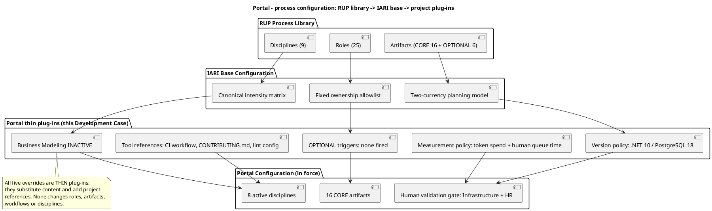
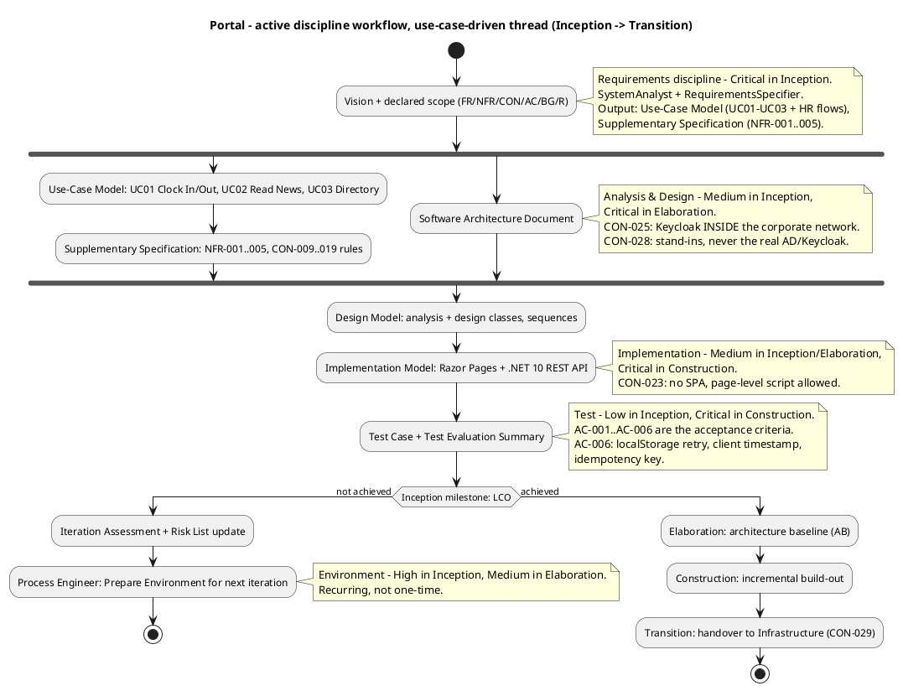
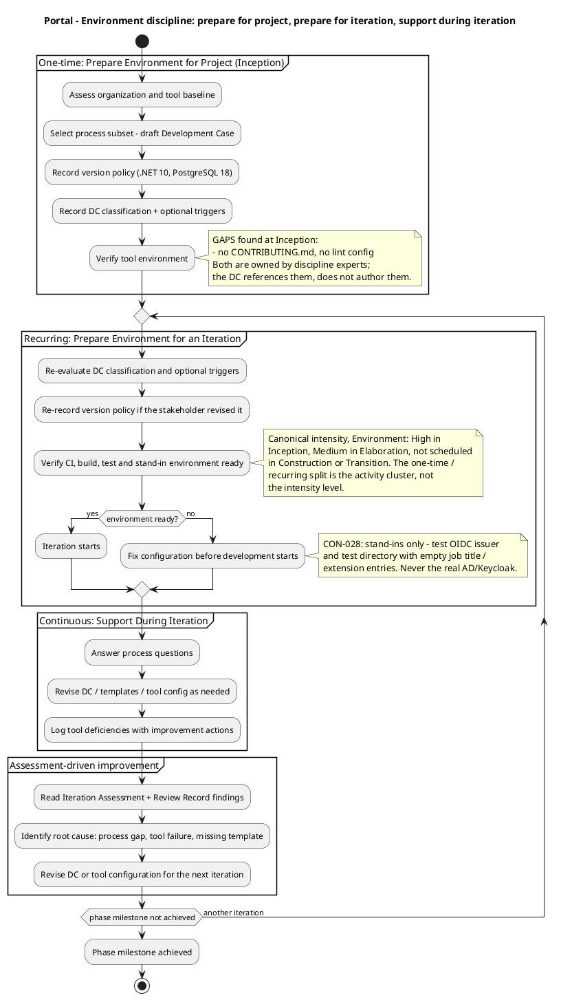
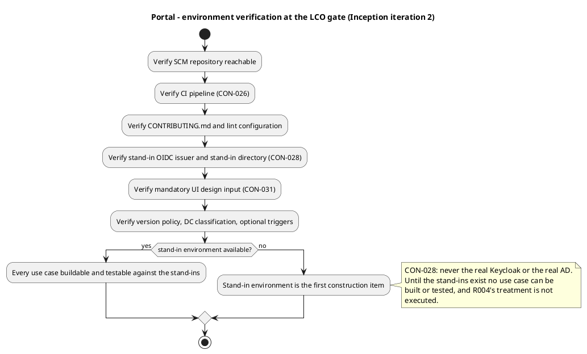

## Document Control
- **Phase:** Inception
- **Status:** Draft — governs Inception iteration 2; not yet reviewed
- **Milestone Target:** Lifecycle Objectives (LCO) — end of Inception. NOT YET ACHIEVED.

## Tailoring Overview
This Development Case is an **override delta** over the IARI Development Case baseline. The baseline
supplies the 25-role roster, the 16 CORE artifacts, the 6 OPTIONAL artifacts, the fixed ownership
allowlist and the canonical intensity matrix. This document declares only what Portal changes, and
nothing here redefines any of those.

### Organization and tool assessment (Inception, iteration 1)

| Assessed item | Finding | Consequence for the process |
|---|---|---|
| Prior process artifacts | None — this is the project's first artifact | No inherited process debt; the baseline applies unmodified |
| Execution model | Agent-executed, 25-role IARI roster | No role merging; no training programme needed |
| SCM repository | Present, hosted provider (`portal`) | CON-026 satisfied for source hosting |
| CI workflow | **GAP** — no pipeline definition found at `.github/workflows/ci.yml` | CON-026 requires hosted CI; a pipeline definition must exist before the first build. Owner: ConfigurationManager + Implementer |
| `CONTRIBUTING.md` and lint config | **GAP** — absent | Guideline content is owned by the discipline experts, not by the Process Engineer. Referenced here, authored by them during Elaboration |
| Mandatory UI design input | Present — `docs/inputs/employee-portal-design.html` | CON-031 is satisfied; the file is authoritative for the UI visual layer and is not a risk |
| Change Requests | None logged | No CR-driven process change this iteration |
| Stand-in environment (CON-028) | Not yet built | The team builds a test OIDC issuer and a test directory carrying the declared attributes, including entries with empty job title and extension. This is iteration-1 environment work |

### Plug-in classification

Every override below is a **thin plug-in**: it substitutes content or adds a project reference. None
changes a role, an artifact, a workflow or a discipline, so no structural impact analysis is required.

### Tailoring rationale

1. **Business Modeling is INACTIVE.** All four DC §4 criteria were evaluated and none fired: the
   stakeholder declared system use cases and requirements directly (FR-001..FR-009, UC01/UC02/UC03),
   no business actor or business worker is declared, no Business Use-Case Model is an input or an
   output, and the declared business rules (CON-009..CON-019) are system invariants rather than
   process definitions. The trigger-conditional roles BusinessProcessAnalyst and BusinessReviewer are
   therefore not active. Verdict persisted via `record_dc_classification`.
2. **No OPTIONAL artifact trigger fires.** Each of the six was evaluated against the project's real
   facts (see *Optional Artifact Triggers*). The declared scope actively excludes the conditions that
   would fire most of them — CON-030 states there is no data migration, CON-032 states backups are
   Infrastructure's existing practice, and the scope excludes offline mode beyond the clocking retry.
3. **The process is deliberately light on ceremony and heavy on one thing: the stand-in boundary.**
   CON-028 fixes how the team works with Keycloak and AD — against stand-ins it controls, never the
   real systems. This is the single largest process risk on the project, and the Development Case
   addresses it by making the stand-in environment an explicit iteration-preparation checkpoint
   rather than a developer's private arrangement.
4. **The human validation gate is a risk, not an estimate.** CON-028 places validation against the
   real Keycloak and real AD with Infrastructure and HR, outside the team's control, and CON-021
   grants risk acceptance in advance for exactly this class of risk. It is bounded in the Risk List
   and never forecast in the plan.

### Organization and tool assessment (Inception, iteration 2)

| Assessed item | Finding | Consequence for the process |
|---|---|---|
| Prior process artifacts | None — this is the project's first artifact | No inherited process debt; the baseline applies unmodified |
| Execution model | Agent-executed, 25-role IARI roster | No role merging; no training programme needed |
| SCM repository | Present, hosted provider (`portal`) | CON-026 satisfied for source hosting |
| CI workflow | Present — `.github/workflows/ci.yml` at `358f1f8`, build and test jobs, green on `main` | CON-026 satisfied. The pipeline syncs `Portal.sln` from the `src/` + `tests/` tree before every build, so a green check cannot be a stale-manifest lie |
| `CONTRIBUTING.md` and lint config | **GAP** — absent | Guideline content is owned by the discipline experts, not by the Process Engineer. Referenced here, authored by them during Elaboration |
| Mandatory UI design input | Present — `docs/inputs/employee-portal-design.html` | CON-031 is satisfied; the file is authoritative for the UI visual layer and is not a risk |
| Change Requests | None logged | No CR-driven process change this iteration |
| Stand-in environment (CON-028) | **GAP** — not built | The team builds a test OIDC issuer and a test directory carrying the declared attributes, including entries with empty job title and extension. This is the first construction item of the iteration and the one item that gates every use case |
| Open SCM issues | `Issue #1` — the environment-readiness record for the CI pipeline was stale | Corrected in this iteration; the record now cites the observed pipeline |

### Assessment scope and method

The organization and tool baseline is assessed against observable repository state, not against
intention: the presence and content of the CI workflow, the presence of the guideline files, the
presence of the mandatory UI design input, and the open SCM issues. Each assessed item is recorded
with the consequence it has for the process, and a gap is recorded with the role that owns it. The
assessment is re-taken every iteration, because a gap that has closed and a gap that has opened are
both process facts the next iteration must plan around.

## Disciplines and Intensity
Intensity per discipline and phase is **per the canonical matrix** — confirmed, not assigned. The
only deltas are the inactive discipline and the Environment row's phase levels, which are the
canonical levels stated explicitly.

| Discipline | Status for Portal | Delta from baseline |
|---|---|---|
| Business Modeling | **INACTIVE** | Not active in any phase. Reason: business-process-led = false (see Tailoring rationale 1). No BUC, business actor, business worker or Business Object Model is produced. |
| Requirements | Active | Per canonical matrix — Critical (Inception), High (Elaboration), Medium (Construction), Low (Transition) |
| Analysis & Design | Active | Per canonical matrix — Medium (Inception), Critical (Elaboration), High (Construction), Low (Transition) |
| Implementation | Active | Per canonical matrix — Medium (Inception), Medium (Elaboration), Critical (Construction), Medium (Transition) |
| Test | Active | Per canonical matrix — Low (Inception), Medium (Elaboration), Critical (Construction), High (Transition) |
| Deployment | Active | Per canonical matrix — Low (Inception), Low (Elaboration), Medium (Construction), Critical (Transition) |
| Configuration & Change Management | Active | Per canonical matrix — Medium (Inception), Medium (Elaboration), High (Construction), Medium (Transition) |
| Project Management | Active | Per canonical matrix — High (Inception), Medium (Elaboration), High (Construction), Medium (Transition) |
| Environment | Active | Per canonical matrix — High (Inception), Medium (Elaboration), not scheduled in Construction or Transition |

Eight disciplines are active. No intensity level is deviated from the canonical matrix, so no
stakeholder approval of a deviation is required.

The Environment discipline's activity clusters — one-time project preparation, recurring iteration
preparation, continuous support — are described in *Guidelines and Procedures*. That split is the
activity cluster, not the intensity level: Environment is High in Inception and Medium in
Elaboration, and the recurring clusters run inside those levels.

### The use-case-driven thread

The process is organised around the three declared use cases. Every discipline workflow below traces
back to them; nothing in the process exists for a use case the stakeholder did not declare.

## Artifacts and Templates
### CORE artifacts — all 16 produced

All 16 CORE artifacts are in scope for this project. None is omitted, and primary ownership is
unchanged from the IARI allowlist. The table records only the project-specific content each artifact
must carry, so that the producing role knows what "done" means here.

| CORE artifact | Project-specific content this project requires |
|---|---|
| Vision | The declared scope: 200 employees, 3 offices, the three replaced artefacts, the explicit exclusions |
| Use-Case Model | UC01 Clock In/Out, UC02 Read News, UC03 Employee Directory, plus the HR flows of FR-002, FR-003, FR-005, FR-006, FR-007, FR-009. Multi-actor interaction with the same declared process is ONE use case with multiple scenarios |
| Supplementary Specification | NFR-001..NFR-005 and the business rules CON-009..CON-019. Cross-cutting technical mechanisms (OIDC login, LDAP read, audit write) are entries here with `<<include>>` from each dependent use case — never use cases of their own |
| Software Architecture Document | CON-025 (Keycloak inside the corporate network), CON-028 (stand-ins), CON-001/CON-022/CON-023/CON-024 (the stack), CON-026 (CI boundary) |
| Design Model | Analysis and design classes for the three use cases; the worker-category link (CON-016) and the audit records (NFR-004) |
| Implementation Model | Razor Pages front end, .NET 10 REST API, PostgreSQL 18 schema |
| Test Case | Coverage of AC-001..AC-006, including the AC-006 offline clocking retry |
| Test Evaluation Summary | Result against AC-001..AC-006 |
| User Documentation | Employee-facing guidance for clocking, news and directory; HR-facing guidance for publishing, correcting and exporting |
| Release Notes | Per release, for handover to Infrastructure (CON-029) |
| Iteration Plan | Per iteration; scope is never cut or deferred to fit an estimate (CON-027) |
| Iteration Assessment | Per iteration; the input to assessment-driven process improvement |
| Risk List | R001, R002, R003 as declared, plus any risk the team identifies numbered R004 onwards in the order raised (CON-020) |
| Review Record | Concrete findings with severity and verdict, one per defect |
| Development Case | This document |
| Change Request | Per-iteration narrative ledger from Construction onwards |

### OPTIONAL artifacts — none triggered

All six OPTIONAL artifacts were evaluated against their §5.2 trigger condition. None fires. The
evaluation is recorded in *Optional Artifact Triggers* below and persisted via
`record_optional_artifact_triggers` with an empty set, so no optional-generator role may produce one
this iteration.

### Templates and tool references

The Development Case references these files; it does not author their content. Each is owned by the
discipline expert named.

| Reference | Owner | State at the LCO gate |
|---|---|---|
| `.github/workflows/ci.yml` — build and test pipeline (CON-026) | ConfigurationManager + Implementer | **Present** — build and test jobs, green on `main` |
| `CONTRIBUTING.md` — coding standards, branch and review conventions | SoftwareArchitect + Implementer | **Missing** — authored during Elaboration |
| Lint / formatter configuration for .NET and Razor Pages | Implementer | **Missing** — authored during Elaboration |
| `docs/inputs/employee-portal-design.html` — authoritative UI visual layer (CON-031) | UserInterfaceDesigner consumes; Designer and Implementer implement | Present and authoritative |
| Stand-in configuration: test OIDC issuer, test directory (CON-028) | Implementer + Integrator | **Missing** — the first construction item of the iteration |

## Optional Artifact Triggers

Each trigger was evaluated against the project's real declared facts. A trigger is FIRED only when
its condition genuinely holds; none does.

| OPTIONAL artifact | §5.2 trigger condition | Verdict | Basis |
|---|---|---|---|
| Glossary | Domain uses specialist vocabulary requiring stakeholder-validated definitions | **NOT FIRED** | The domain vocabulary is ordinary HR and intranet language. The one closed list — the four worker categories (CON-014) — is fixed and self-defining, and the CSV column set is specified literally in FR-003. No term needs a stakeholder-validated definition |
| Architectural Proof-of-Concept | Elaboration phase + at least one technical risk requiring empirical validation | **NOT FIRED** | No technical risk requires empirical validation. R001 and R002 are dependency and data-quality risks owned by Infrastructure and HR, not technical unknowns; CON-021 accepts them in advance. CON-028 removes the only candidate by fixing the stand-in approach, and CON-003 confirms the OIDC client is already registered so login is testable from day one |
| Data Model | Data-centric system OR >10 entities OR data-migration in scope | **NOT FIRED** | The portal owns exactly two things: clockings and news, plus the worker-category link (CON-016). That is well under 10 entities. CON-030 states there is no data migration — the portal starts empty and the historical Excel sheets are not imported. Data lives inline in the Design Model |
| Deployment Model | Distributed / multi-node topology, OR multi-environment non-trivial | **NOT FIRED** | Single .NET application on the existing internal Windows Server estate (CON-001), one PostgreSQL instance on the same estate (CON-024), reachable only from the internal network (CON-007). Keycloak and AD are external systems the project neither deploys nor operates (CON-002, CON-025). Deployment is a section in the Software Architecture Document |
| User-Interface Prototype | UX-critical OR UI complexity requiring stakeholder validation before implementation | **NOT FIRED** | The UI is already fixed: CON-031 makes `docs/inputs/employee-portal-design.html` mandatory and authoritative for the visual layer, and it is committed to the repository. A prototype would validate a design the stakeholder has already decided. The UI Designer implements the committed design |
| Test Plan | Formal delivery / regulatory audit / contractual test reporting | **NOT FIRED** | CON-019 states no external compliance regime applies and no retention period is mandated. There is no contractual test reporting. The Iteration Plan defines per-iteration testing scope, and AC-001..AC-006 are the acceptance criteria |

## Roles and Ownership

The 25-role roster is fixed by the IARI baseline and is not redefined here. Primary artifact
ownership is fixed by the service-side allowlist and is not reassigned. No roles are merged.

**Trigger-conditional roles not active on this project:** BusinessProcessAnalyst and BusinessReviewer,
because business-process-led = false. Their responsibilities are not redistributed — the artifacts
they would own are not produced, since Business Modeling is inactive.

**Project contributors.** The baseline ownership stands; this table records only which roles
contribute to which artifact on Portal, so that a producing role knows who to consult.

| Artifact | Primary owner (unchanged) | Portal contributors |
|---|---|---|
| Vision | SystemAnalyst | ProjectManager, RequirementsSpecifier |
| Use-Case Model | SystemAnalyst | RequirementsSpecifier, UserInterfaceDesigner |
| Supplementary Specification | RequirementsSpecifier | SystemAnalyst, SoftwareArchitect |
| Software Architecture Document | SoftwareArchitect | Designer, DatabaseDesigner, DeploymentManager |
| Design Model | Designer | UserInterfaceDesigner, DatabaseDesigner, CapsuleDesigner |
| Implementation Model | Implementer | Integrator, SoftwareArchitect |
| Test Case | TestDesigner | TestAnalyst, Tester |
| Test Evaluation Summary | TestManager | TestAnalyst |
| User Documentation | TechnicalWriter | UserInterfaceDesigner, SystemAnalyst |
| Release Notes | DeploymentManager | TechnicalWriter, Integrator |
| Iteration Plan | ProjectManager | SoftwareArchitect, TestManager |
| Iteration Assessment | ProjectManager | All discipline leads |
| Risk List | ProjectManager | SoftwareArchitect, ProcessEngineer |
| Review Record | Reviewer | ReviewCoordinator, ManagementReviewer, CodeReviewer |
| Development Case | ProcessEngineer | All discipline experts (tailoring input) |
| Change Request | ChangeControlManager | ConfigurationManager |

```plantuml
@startuml DC_RoleArtifact
title Portal - role / artifact ownership (CORE 16, fixed by IARI allowlist)

package "Requirements" {
  class "SystemAnalyst" as SA <<role>>
  class "RequirementsSpecifier" as RS <<role>>
  class "Use-Case Model" as UCM <<CORE>>
  class "Supplementary Specification" as SS <<CORE>>
  class "Vision" as VIS <<CORE>>
}

package "Analysis & Design" {
  class "SoftwareArchitect" as SWA <<role>>
  class "Designer" as DES <<role>>
  class "UserInterfaceDesigner" as UID <<role>>
  class "Software Architecture Document" as SAD <<CORE>>
  class "Design Model" as DM <<CORE>>
}

package "Implementation" {
  class "Implementer" as IMP <<role>>
  class "Integrator" as INTG <<role>>
  class "Implementation Model" as IM <<CORE>>
}

package "Test" {
  class "TestManager" as TM <<role>>
  class "TestDesigner" as TD <<role>>
  class "Tester" as TE <<role>>
  class "Test Case" as TC <<CORE>>
  class "Test Evaluation Summary" as TES <<CORE>>
}

package "Deployment" {
  class "DeploymentManager" as DPM <<role>>
  class "Release Notes" as RN <<CORE>>
}

package "Configuration & Change Mgmt" {
  class "ConfigurationManager" as CM <<role>>
  class "ChangeControlManager" as CCM <<role>>
  class "Change Request" as CR <<CORE>>
}

package "Project Management" {
  class "ProjectManager" as PM <<role>>
  class "Iteration Plan" as IP <<CORE>>
  class "Iteration Assessment" as IA <<CORE>>
  class "Risk List" as RL <<CORE>>
}

package "Environment" {
  class "ProcessEngineer" as PE <<role>>
  class "Development Case" as DC <<CORE>>
}

package "Review" {
  class "Reviewer" as REV <<role>>
  class "ReviewCoordinator" as RC <<role>>
  class "ManagementReviewer" as MR <<role>>
  class "Review Record" as RR <<CORE>>
}

class "User Documentation" as UDOC <<CORE>>
class "TechnicalWriter" as TW <<role>>

SA --> UCM
SA --> SS
RS --> SS
SWA --> SAD
DES --> DM
UID --> DM
IMP --> IM
INTG --> IM
TD --> TC
TM --> TES
TE --> TC
DPM --> RN
CCM --> CR
PM --> IP
PM --> IA
PM --> RL
PE --> DC
REV --> RR
RC --> RR
MR --> RR
TW --> UDOC

UCM ..> DM : Derives
SS ..> DM : Derives
SAD ..> DM : Derives
DM ..> IM : Specifies
IM ..> TC : Tests
DC ..> IP : governs

note bottom of DC
  ProcessEngineer owns the Development Case only.
  Guideline content (coding standards, UI patterns,
  test conventions) lives in CONTRIBUTING.md + lint
  config, owned by the discipline experts - the DC
  references those files, it does not duplicate them.
end note
@enduml
```

## Guidelines and Procedures
This section states the project's measurement policy, the Environment discipline's activity clusters, the version policy, the stand-in boundary, the iteration-preparation checkpoint and its result, guideline ownership, and the environment verification at the LCO gate.

### Measurement policy

The baseline measures two quantities and only two: tokens consumed, and elapsed time split into agent
time and human queue time. This section states what **Portal** does with them — a metric whose
decision cannot be named is not tracked.

| Measured quantity | Decision it enables | Who reads it |
|---|---|---|
| Tokens consumed per iteration | Forecast the next iteration's spend. CON-027 forbids setting a budget or cap, so this is a forecast input only — declared scope is never cut or deferred to fit it | ProjectManager, ProcessEngineer |
| Agent time per iteration | Locate where the iteration actually spent its work; identify a discipline whose artifacts are being re-read more than they are advanced | ProcessEngineer, ProjectManager |
| Human queue time | Detect a stalled human gate. The only human gate on this project is the CON-028 validation of the real Keycloak and AD by Infrastructure and HR. Ceiling 14 days, then the process suspends; actual measured and reported apart; estimate none | ProjectManager, ProcessEngineer |

No other quantity is tracked. Velocity, story points, person-days and defect-density rates are not
produced by this system and are not used to plan.

### Environment discipline: three activity clusters

Environment is High in Inception and Medium in Elaboration per the canonical matrix. Within those
levels it runs three activity clusters: one-time project preparation, recurring iteration
preparation, and continuous support during the iteration. The Process Engineer does not disappear
after Inception.

### Version policy

Recorded via `record_version_policy` from what the stakeholder declared. The SoftwareArchitect
anchors these in the Software Architecture Document; they govern over any registry "latest".

| Ecosystem | Package | Pinned version | LTS only | Source |
|---|---|---|---|---|
| framework | .NET | 10 | No | CON-022 — backend is .NET 10 exposing a REST API |
| framework | PostgreSQL | 18 | No | CON-024 — latest stable major at project start; patch floats, major pinned |

No other version is consequential to this project, and no version was left undeclared that the
project needs fixed, so no stakeholder question is raised on versions.

### Stand-in boundary (CON-028) — the project's principal process control

The team never works against the real Keycloak or the real Active Directory. The OIDC client and the
LDAP connection are configured with placeholder values — issuer, client id, client secret, LDAP host,
bind account, base DN — held in configuration and never in code. Infrastructure substitutes the real
values at deployment.

The stand-in environment must carry the declared attributes **including entries whose job title or
extension is empty**, because R002 is precisely the risk that those attributes are inconsistently
filled across the three offices. A stand-in that only contains complete records cannot exercise the
risk, and the directory's gap behaviour would be discovered in production instead of in test.

Validation against the real Keycloak and real AD is human work performed by Infrastructure with HR.
It is not team work to plan, it is not a project risk (CON-021), and its feedback must reach the team
before Elaboration closes. If it delays a milestone, the remedy is another iteration.

### Iteration preparation checkpoint

Before each iteration starts, the Process Engineer confirms: the Development Case is current for the
iteration, the CI pipeline builds and tests, the stand-in environment is available, and the optional
triggers have been re-evaluated. A configuration problem found on day 1 of an iteration is a process
defect, not a developer's bad luck.

**Checkpoint result — taken before the next iteration starts.**

| Checked item | Observed state | Evidence |
|---|---|---|
| Development Case current for the iteration | Confirmed | This document, updated this iteration |
| CI pipeline builds and tests | Confirmed | `.github/workflows/ci.yml` at `358f1f8`; build and test jobs; green on `main` |
| Stand-in environment available (CON-028) | **Not confirmed** | No stand-in OIDC issuer and no stand-in directory exist in the repository |
| Optional triggers re-evaluated | Confirmed | None fired; re-recorded this iteration |

The checkpoint does not pass. Three of the four items are confirmed; the stand-in environment is not.
The consequence is stated rather than deferred: no use case can be built or tested against the real
Keycloak or the real AD (CON-028), so until the stand-ins exist no use case is buildable and R004's
treatment is not executed. The stand-in environment is the first construction item of the iteration,
and the checkpoint is re-taken before the iteration after it.

### Guideline ownership

The Process Engineer integrates tailoring input from the discipline experts and does not author
technical guidance. Coding standards, UI patterns and test conventions live in `CONTRIBUTING.md` and
the lint configuration, owned by the SoftwareArchitect, Implementer and TestManager respectively.
This Development Case references those files; it does not duplicate their content.

### Environment readiness verification — Inception iteration 1

Superseded by *Environment readiness criteria (standing)*, which states the criteria re-taken before
every iteration, and by *Environment verification at the LCO gate*, which states the observed state
of each item.

### Environment verification at the LCO gate — Inception iteration 2

This is the post-iteration record of the actual state of each environment item at the LCO gate, with
the observed evidence for each. It is not a pre-iteration plan, and it is not offered as evidence
that LCO exit criterion 5 is met — it records that the criterion is not met.

| Check | Observed state at the gate | Evidence | Owner of the gap |
|---|---|---|---|
| SCM repository reachable | Ready | Repository `portal`, default branch | — |
| CI pipeline builds and tests (CON-026) | Ready | `.github/workflows/ci.yml` at `358f1f8`; build and test jobs; green on `main` | — |
| `CONTRIBUTING.md` | **Not ready** | File absent from the repository | SoftwareArchitect + Implementer |
| Lint / formatter configuration | **Not ready** | No `.editorconfig` and no `Directory.Build.props` in the repository | Implementer |
| Stand-in OIDC issuer and stand-in directory (CON-028) | **Not ready** | No stand-in configuration in the repository | Implementer + Integrator |
| Mandatory UI design input (CON-031) | Ready | `docs/inputs/employee-portal-design.html` | — |
| Version policy recorded | Ready | .NET 10, PostgreSQL 18 | — |
| DC classification and optional triggers recorded | Ready | business-process-led = false; no optional trigger fired | — |

**LCO exit criterion 5 is not met.** The stand-in environment is the one item that gates every use
case, and it does not exist. The two guideline gaps — `CONTRIBUTING.md` and the lint configuration —
are Elaboration work owned by the discipline experts and do not gate a use case. The CI pipeline is
present and green, so criterion 6 is met.

### Environment readiness plan — pre-iteration (Inception iteration 3)

Superseded by *Environment delta required before the next iteration starts*, which states the items
that must change state before the next iteration starts.

### Process improvement actions for the next iteration

Assessment-driven improvement, from the Review Record findings against this artifact and the observed
environment state at the LCO gate. Each action names the decision it enables.

| Observed problem | Root cause | Action | Owner |
|---|---|---|---|
| The environment-readiness record was stale on its own CI row and was offered as milestone evidence | The record was a pre-iteration plan presented as a post-iteration fact | The LCO-gate record above states the observed state of each item with its evidence; the readiness table is labelled a plan | ProcessEngineer |
| The Environment intensity row stated a recurrence pattern where the canonical matrix states a level | The activity-cluster narrative was written into the intensity table | The intensity table states the canonical level per phase; the cluster narrative lives in the Environment discipline section | ProcessEngineer |
| No iteration-preparation checkpoint result was recorded | The checkpoint was stated as an intention, not exercised as a record | The checkpoint result above records the observed state of each item it names | ProcessEngineer |
| The stand-in environment (CON-028) does not exist, so no use case is buildable and R004's treatment is not executed | Environment work not yet delivered | The stand-in environment is the first construction item of the iteration; the checkpoint is re-taken before the iteration after it | Implementer + Integrator |
| `CONTRIBUTING.md` and the lint configuration are absent | Guideline content is Elaboration work owned by the discipline experts | Authored during Elaboration; referenced from this Development Case, not duplicated in it | SoftwareArchitect, Implementer, TestManager |

### Environment delta required before the next iteration starts

Against the LCO-gate record, three items must change state before the next iteration starts, and one
must not regress.

| Item | State at the LCO gate | Required before the next iteration starts | Owner |
|---|---|---|---|
| Stand-in OIDC issuer and stand-in directory (CON-028) | Not ready | Ready — including entries with empty job title and extension | Implementer + Integrator |
| `CONTRIBUTING.md` | Not ready | Ready | SoftwareArchitect + Implementer |
| Lint / formatter configuration | Not ready | Ready | Implementer |
| CI pipeline (CON-026) | Ready, green on `main` | Must not regress | ConfigurationManager + Implementer |

The stand-in environment is the item that gates every use case. Until it exists no use case is
buildable and R004's treatment is not executed, so it is the first construction item of the iteration
and the checkpoint is re-taken before the iteration after it.

### Environment readiness criteria (standing)

The criteria for what "ready" means, re-taken before every iteration starts. This is the checklist
the iteration-preparation checkpoint verifies against; it is not milestone evidence. The milestone
evidence is *Environment verification at the LCO gate*, which states the observed state of each item.

| Check | Required state before an iteration starts | Owner of the gap |
|---|---|---|
| SCM repository reachable | Ready | — |
| CI pipeline builds and tests (CON-026) | Ready — `.github/workflows/ci.yml` present, build and test jobs, green on `main` | — |
| `CONTRIBUTING.md` | Ready — authored during Elaboration | SoftwareArchitect + Implementer |
| Lint / formatter configuration | Ready — authored during Elaboration | Implementer |
| Stand-in OIDC issuer and stand-in directory (CON-028) | Ready — including entries with empty job title and extension | Implementer + Integrator |
| Mandatory UI design input (CON-031) | Ready — `docs/inputs/employee-portal-design.html` | — |
| Version policy recorded | Ready — .NET 10, PostgreSQL 18 | — |
| DC classification and optional triggers recorded | Ready — business-process-led = false; no optional trigger fired | — |

The stand-in environment is the one item that gates development: no use case can be built or tested
against the real Keycloak or the real AD (CON-028), so the stand-ins are the first construction item
of the iteration.

### Tool evaluation — Inception iteration 2

Each tool in the development environment is evaluated after the iteration against what the process
needs it to do, not against its feature list. A deficiency is logged with an improvement action; a
deficiency carried silently from iteration to iteration is the failure mode this evaluation exists to
prevent.

| Tool | Process need it serves | Evaluation | Improvement action |
|---|---|---|---|
| Hosted SCM provider (CON-026) | Version control, branch and merge, issue tracking | Adequate — repository reachable, branches and issues in use | None |
| Hosted CI (`.github/workflows/ci.yml`) | Build and test on every push and pull request (CON-026) | Adequate — build and test jobs, green on `main`; the solution manifest is synced from the `src/` + `tests/` tree so a green check cannot be a stale-manifest lie | None |
| Lint / formatter configuration | Enforce the coding standards the discipline experts author | **Deficient** — no configuration exists, so no standard is enforced mechanically | Authored during Elaboration by the Implementer; referenced from this Development Case |
| Stand-in OIDC issuer and stand-in directory (CON-028) | Let every use case be built and tested without the real Keycloak or the real AD | **Deficient** — does not exist, so no use case is buildable and R004's treatment is not executed | First construction item of the iteration; owned by Implementer + Integrator |
| `docs/inputs/employee-portal-design.html` (CON-031) | Authoritative UI visual layer for the UI Designer and Implementer | Adequate — present and authoritative | None |

The two deficiencies are the same two items the LCO-gate record marks not ready. Neither is a tool
selection problem: the tools are chosen and adequate, and what is missing is configuration the
project owes itself. No tool change is proposed, and no tool is replaced mid-project.

### Process support during the iteration

Support is a first-class Environment activity, continuous across every iteration, not an Inception
afterthought. The Process Engineer is the process help desk while the iteration runs.

| Support request | Response | Escalation |
|---|---|---|
| A producing role asks which artifact or template applies | Answered from this Development Case within the iteration; if the Development Case is silent, the gap is a defect in this document and is corrected in place | None — answered in-iteration |
| A producing role reports a tool malfunction or a configuration problem | Logged with an improvement action in the tool evaluation below; a problem that blocks a use case is escalated immediately | ProjectManager, same iteration |
| A template proves ambiguous or a section skeleton does not fit the artifact | The Development Case section is revised; the change is recorded as a process improvement action | None — corrected in-iteration |
| A role believes the process is too heavy or too light for the work | Evaluated against the iteration's observed facts and the canonical intensity matrix; a deviation is never self-granted | Stakeholder, via `REQUIRES_USER_INPUT`, if a deviation is proposed |
| A Change Request would change the process configuration | The Development Case is re-evaluated and the affected sections are revised | ChangeControlManager |

A blocking process question is never left to the next iteration. A non-blocking one is answered in
the iteration it is raised, and the answer is written into this document rather than into a
conversation, so the next role to ask reads it instead of asking again.

## Traceability
| Element | Traces From | Link Type | Traces To |
|---|---|---|---|
| Development Case | CON-001, CON-022, CON-023, CON-024, CON-026, CON-027, CON-028, CON-031 | Refines | UC-001, UC-002, UC-003 |
| Business Modeling INACTIVE | FR-001, FR-004, FR-008 | Refines | UC-001, UC-004, UC-008 |
| Optional Artifact Triggers (none fired) | CON-014, CON-016, CON-019, CON-030, CON-031, CON-032 | Refines | NFR-004 |
| Version policy (.NET 10, PostgreSQL 18) | CON-022, CON-024 | Refines | NFR-001 |
| Stand-in boundary procedure | CON-028, R002 | Refines | UC-008 |
| Measurement policy | CON-027 | Refines | AC-001 |
| Human validation gate | CON-021, CON-028 | Refines | R001 |
| Environment verification at the LCO gate | CON-026, CON-028 | Refines | AC-006 |

Every endpoint above is an element identifier, not a document section: the constraints and risks the
process configuration tailors to, and the use cases, requirements and acceptance criteria whose
production it sanctions. The Development Case is a process artifact and governs no system element of
its own, so it carries no edge to an artifact name.

