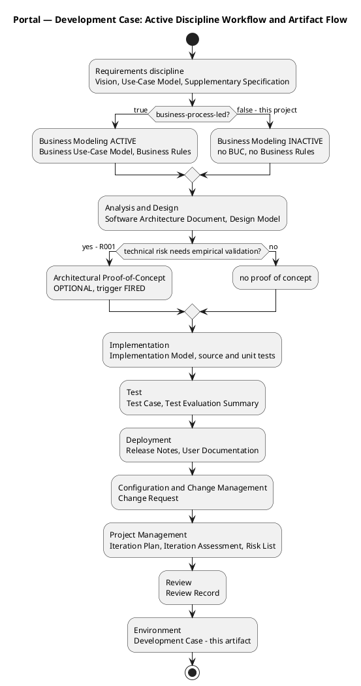
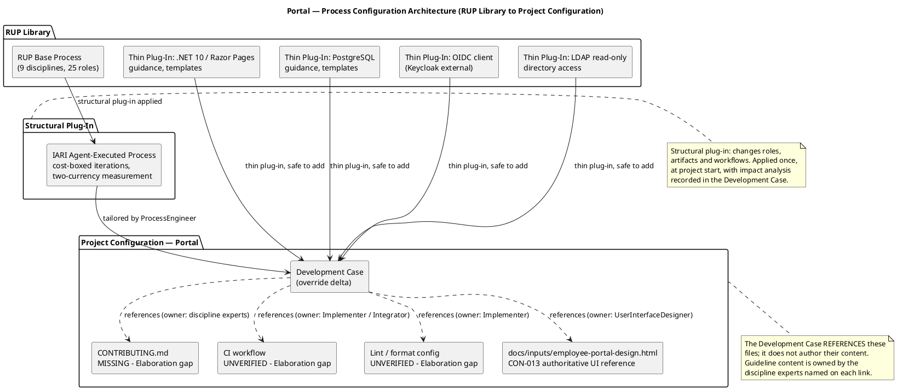
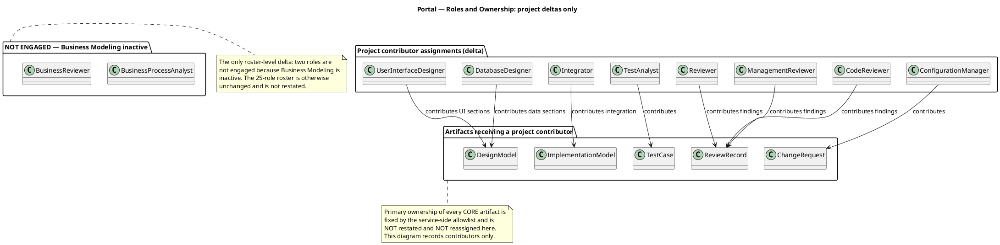
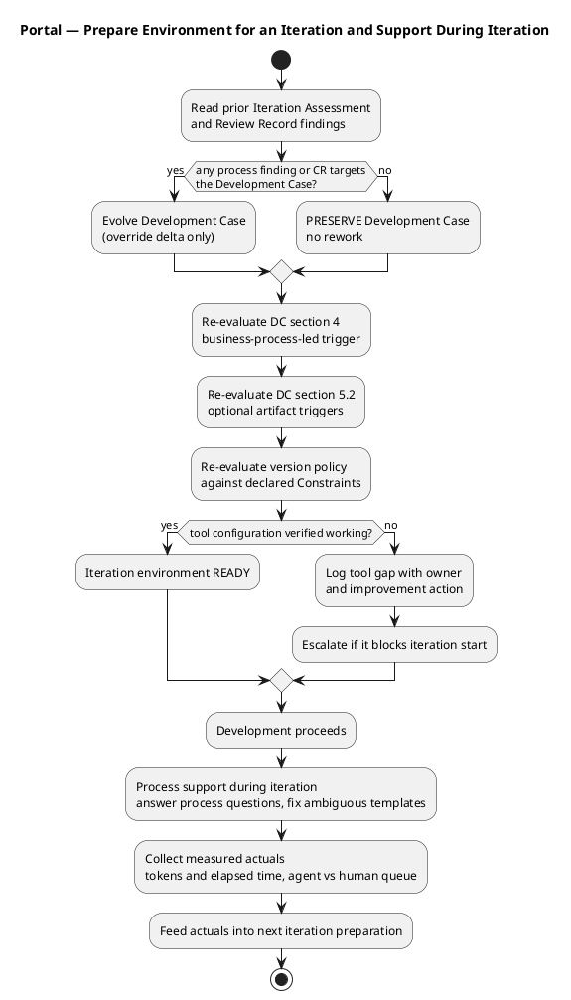

## Document Control

| Field | Value |
|---|---|
| Artifact | Development Case — Portal (project override delta over the IARI DC baseline) |
| Phase | Inception |
| Status | Draft — produced for review; milestone NOT YET ACHIEVED |
| Milestone Target | End-of-Inception (not marked complete by this artifact) |
| Iteration / Cycle | 1 / 1 |
| Owner | ProcessEngineer |
| Date | 2026-09-17 |

**What this document is.** The IARI DC baseline (25-role roster, 16 CORE artifacts, 6 OPTIONAL artifacts, canonical intensity matrix, fixed ownership) is the law and is **not restated here**. This document declares **only the project-specific deltas** over that baseline. Anything not listed as a delta is baseline and applies unchanged.

## Tailoring Overview

### S1 assessment — organization and tools (2026-09-17)

**Organization.** Greenfield: `list_artifacts` returned zero artifacts, so there is no prior process baseline, no inherited template set and no legacy tooling to migrate. The full 25-role roster is available. The project is small in artifact surface (3 system use cases, 14 declared functional requirements, 4 non-functional requirements) but carries one high-exposure technical risk, so the process is tailored **light on ceremony, heavy on early empirical validation of the AD/LDAP boundary**.

**Tool inventory.** Assessed against the declared constraints:

| Tool | State | Evidence |
|---|---|---|
| SCM repository | PRESENT | `docs/inputs/employee-portal-design.html` read at sha `ba1cb26` |
| Authoritative UI design reference | PRESENT | `docs/inputs/employee-portal-design.html` — CON-013 makes it mandatory and authoritative for the visual layer |
| Keycloak OIDC client | EXTERNAL | CON-005 — already registered, credentials with the development team; **not** project work |
| Active Directory (LDAP) | EXTERNAL | CON-006, CON-010 — read-only, operated by the Infrastructure team |
| PostgreSQL instance | EXTERNAL | CON-004, CON-014 — covered by the Infrastructure team's existing backup practice |
| `CONTRIBUTING.md` | **MISSING** | not found in the repository |
| CI workflow | **UNVERIFIED** | no workflow file confirmed present |
| Lint / format config | **UNVERIFIED** | no config file confirmed present |

The three gaps are **not** ProcessEngineer deliverables — guideline and tooling content is owned by the discipline experts (see *Guidelines and Procedures*). They are recorded here as environment gaps with named owners and an Elaboration target.

```plantuml
@startuml
title Portal — S1 Assessment: Role Engagement and Tool Inventory

skinparam classAttributeIconSize 0
skinparam packageStyle rectangle

package "Requirements" as P_REQ {
  class SystemAnalyst
  class RequirementsSpecifier
}
package "Analysis and Design" as P_AD {
  class SoftwareArchitect
  class Designer
  class UserInterfaceDesigner
  class CapsuleDesigner
  class DatabaseDesigner
}
package "Implementation" as P_IMP {
  class Implementer
  class Integrator
}
package "Test" as P_TEST {
  class TestManager
  class TestAnalyst
  class TestDesigner
  class Tester
}
package "Deployment" as P_DEP {
  class DeploymentManager
  class TechnicalWriter
}
package "Configuration and Change Management" as P_CCM {
  class ConfigurationManager
  class ChangeControlManager
}
package "Project Management" as P_PM {
  class ProjectManager
}
package "Environment" as P_ENV {
  class ProcessEngineer
}
package "Review" as P_REV {
  class Reviewer
  class ReviewCoordinator
  class ManagementReviewer
  class CodeReviewer
}
package "Business Modeling INACTIVE" as P_BM {
  class BusinessProcessAnalyst
  class BusinessReviewer
}
package "Tool Inventory assessed 2026-09-17" as P_TOOLS {
  class SCMRepository
  class UIDesignReference
  class KeycloakOIDCClient
  class ActiveDirectoryLDAP
  class PostgreSQLInstance
  class CONTRIBUTINGmd
  class CIWorkflow
  class LintConfig
}

SystemAnalyst --> SCMRepository
RequirementsSpecifier --> SCMRepository
SoftwareArchitect --> UIDesignReference
UserInterfaceDesigner --> UIDesignReference
Implementer --> CIWorkflow
Implementer --> LintConfig
ConfigurationManager --> SCMRepository
ProcessEngineer --> CONTRIBUTINGmd
SoftwareArchitect --> KeycloakOIDCClient
SoftwareArchitect --> ActiveDirectoryLDAP
DatabaseDesigner --> PostgreSQLInstance

note bottom of P_TOOLS
  Two gaps block Elaboration start:
  CONTRIBUTING.md absent; CI and lint config unverified.
  Both are assigned to discipline experts, not to the Process Engineer.
end note

note right of P_BM
  business-process-led = false (DC section 4)
  so the discipline is inactive and
  BPA / BusinessReviewer are not engaged.
  The 25-role roster itself is unchanged.
end note
@enduml
```

### The deltas this project declares

| # | Delta | Type | Basis |
|---|---|---|---|
| D1 | Business Modeling declared **INACTIVE** | Structural (discipline activation) | DC §4 verdict `business-process-led = false` |
| D2 | OPTIONAL artifact **Architectural Proof-of-Concept** trigger **FIRED**; the other five NOT FIRED | Thin (artifact scope) | R001 exposure 9; see *Optional Artifact Triggers* |
| D3 | Project tool / guideline references added: `docs/inputs/employee-portal-design.html`, `CONTRIBUTING.md`, CI workflow, lint config | Thin (tooling reference) | CON-013; S1 tool inventory |
| D4 | Enterprise version policy: framework pin `.NET 10` | Thin (version governance) | CON-001 |

No intensity deviation is requested. No CORE artifact is omitted. No primary ownership is reassigned. No role is merged.

## Disciplines and Intensity

**All nine disciplines are applied per the canonical matrix.** No level is restated and no level is changed.

**INACTIVE discipline (delta D1): Business Modeling.** The DC §4 trigger evaluation returned `business-process-led = false` and is persisted via `record_dc_classification`. The declared scope automates three discrete system use cases for a single class of internal user; CON-012 states there is no data migration and no process change; CON-016 fixes authorization to two AD-derived levels with no role matrix; CON-021 states the worker category does not drive access control. No end-to-end business process spanning multiple business actors is being reengineered, so no business-process model is required to understand the problem. Consequently `BusinessProcessAnalyst` and `BusinessReviewer` are **not engaged** and no Business Use-Case Model or Business Rules artifact is produced. The 25-role roster itself is unchanged.

**Environment discipline.** Active in Inception and Elaboration per the canonical matrix, and one-time at project start per the baseline activation rule. This Development Case is its Inception output.

## Artifacts and Templates

**CORE artifacts.** All 16 CORE artifacts are produced per the baseline. **No CORE artifact is omitted** and no primary ownership is reassigned. This section therefore declares no CORE delta.

**OPTIONAL artifacts.** Exactly one of the six has its trigger fired (delta D2). The remaining five are NOT TRIGGERED for this project; the justification for each is an auditable claim recorded in *Optional Artifact Triggers*.

**Templates and guideline files.** The Development Case **references** these files; it does not author their content:

| Reference | Owner of the content | State |
|---|---|---|
| `docs/inputs/employee-portal-design.html` | UserInterfaceDesigner (visual layer), Designer, Implementer | PRESENT — CON-013 makes it mandatory and authoritative for the UI visual layer, not only its structure |
| `CONTRIBUTING.md` | discipline experts (coding, UI, test conventions) | MISSING — Elaboration gap |
| CI workflow | Implementer / Integrator | UNVERIFIED — Elaboration gap |
| Lint / format config | Implementer | UNVERIFIED — Elaboration gap |

## Optional Artifact Triggers

Persisted via `record_optional_artifact_triggers` with exactly one entry. Each verdict below is an auditable claim against the §5.2 condition.

| OPTIONAL artifact | Verdict | Justification against the §5.2 condition |
|---|---|---|
| **Architectural Proof-of-Concept** | **FIRED** | Condition: Elaboration phase + at least one technical risk requiring empirical validation. R001 (P=3, I=3, exposure=9) is exactly that: the LDAP attributes the directory reads (job title, extension) may not be filled consistently across the 3 offices, and the declared scope gives the portal no local copy of the employee (CON-020) and no reconciliation path — so a gap in AD is a gap in the directory, with no fallback. Whether the attributes are actually populated, and whether the .NET 10 stack can read them over LDAP from the internal Windows Server estate, is an empirical question that cannot be settled by design reasoning. Produced in **Elaboration**, not Inception. |
| Glossary | NOT FIRED | Condition: specialist vocabulary requiring stakeholder-validated definitions. The domain vocabulary is ordinary HR/office language, and the only term with a closed value set — the worker category — is already fixed by the stakeholder to exactly four values (CON-023). Nothing is left for a glossary to validate. |
| Data Model | NOT FIRED | Condition: data-centric system OR >10 entities OR data-migration in scope. The persistent surface is small (clockings, news items, the two-column worker-category link of CON-020, plus audit records) — well under 10 entities. CON-012 states there is no data migration at all. Data therefore lives inline in the Design Model. |
| Deployment Model | NOT FIRED | Condition: distributed / multi-node topology, OR multi-environment non-trivial. CON-007 fixes hosting to a single internal Windows Server with no cloud, and CON-008 forbids access from outside the corporate network. Keycloak is external and CON-005 explicitly forbids it appearing in the deployment diagram as something this project installs. Deployment is therefore a section in the Software Architecture Document. |
| User-Interface Prototype | NOT FIRED | Condition: UX-critical OR UI complexity requiring stakeholder validation before implementation. The stakeholder has **already supplied and mandated** the validated design: CON-013 makes `docs/inputs/employee-portal-design.html` authoritative for the UI visual layer, and it is committed to the repository. A prototype exists to obtain validation the stakeholder has already given; producing one would be rework. |
| Test Plan | NOT FIRED | Condition: formal delivery / regulatory audit / contractual test reporting. No regulatory audit and no contractual test-reporting obligation is declared. The Iteration Plan defines per-iteration testing scope, and AC-001..AC-005 are verified through the Test Case and Test Evaluation Summary artifacts. |

## Roles and Ownership

**Roster (delta D1 only).** The 25-role roster is unchanged and is not restated. The single roster-level delta is that `BusinessProcessAnalyst` and `BusinessReviewer` are **not engaged**, because Business Modeling is inactive. No role is merged, no role is added, no role is removed.

**Primary ownership.** Fixed by the service-side allowlist. It is **not restated and not reassigned** by this Development Case.

**Contributor assignments (project delta).** The following project-level contributor relationships are recorded. They add contributors to artifacts whose primary owner is unchanged.

## Guidelines and Procedures
### Measurement policy (what THIS project does with the two currencies)

The baseline measures two and only two quantities — tokens consumed, and elapsed time split into agent time and human queue time. This project does not restate that; it states the **decision each quantity enables and who reads it**:

| Measured quantity | Decision it enables | Who reads it |
|---|---|---|
| Tokens consumed per iteration | Whether the iteration's cost box is spent, and therefore whether scope bends to the box (iterations are cost-boxed, not time-boxed) | ProjectManager, at iteration close |
| Elapsed **agent** time per iteration | Whether a discipline is consuming disproportionate agent time — the dominant cost driver is re-reading the live-artifact surface, not emitting code — and therefore whether that discipline's workflow should be simplified | ProjectManager; ProcessEngineer, when it drives a process change |
| Elapsed **human queue** time (days waiting on a stakeholder gate) | Whether a human gate is becoming a schedule risk, and therefore whether it must be bounded in the Risk List. A gate is a risk, not an estimate: ceiling 14 days, after which the process suspends and nothing is auto-filled | ProjectManager; ProcessEngineer |

A metric whose decision cannot be named does not enter this policy. No velocity is quoted, per-iteration figures are not recorded, and the two clocks are never added. Before any phase closes, the box is stated as an assumption with its basis named.

### Environment readiness checkpoint — Inception iteration 1

Recorded at the close of the Prepare Environment for Project activity. This is the "is the environment ready?" gate that precedes development, and it recurs at the start of every iteration.

| Check | Verdict | Note |
|---|---|---|
| SCM repository reachable and readable | READY | `docs/inputs/employee-portal-design.html` read at sha `ba1cb26` |
| Authoritative UI design reference present | READY | CON-013 — committed, mandatory, needs no confirmation that it will arrive |
| Keycloak OIDC client available for login testing | READY | CON-005 — already registered, credentials with the development team, so login is testable from day one |
| Active Directory reachable for LDAP reads | READY (external) | CON-006, CON-010 — operated by the Infrastructure team; the portal reads and never writes |
| PostgreSQL instance available | READY (external) | CON-004, CON-014 — covered by the Infrastructure team's existing backup practice |
| `CONTRIBUTING.md` | **GAP** | Absent. Content owner: discipline experts. Target: Elaboration |
| CI workflow | **GAP** | Unverified. Content owner: Implementer / Integrator. Target: verified before the first Construction iteration |
| Lint / format config | **GAP** | Unverified. Content owner: Implementer. Target: alongside `CONTRIBUTING.md` |

**Verdict: READY for the Inception iteration to start.** The three gaps are guideline-and-tooling content owned by discipline experts, not by the ProcessEngineer, and none of them blocks Inception work — Inception produces requirements and architecture artifacts, not build output. They are carried forward as Elaboration actions with named owners. This verdict is a readiness statement, not a milestone completion: the end-of-Inception milestone is **NOT YET ACHIEVED** and is decided by review.

### Guideline ownership and the Elaboration gaps

Guideline content lives in `CONTRIBUTING.md` and the lint configuration, **not** in this Development Case. The Development Case references those files. The S1 assessment found three gaps; each is assigned to the discipline expert who owns its content, with an Elaboration target:

| Gap | Content owner | Action |
|---|---|---|
| `CONTRIBUTING.md` absent | discipline experts — coding conventions (Implementer), UI conventions (UserInterfaceDesigner), test conventions (TestDesigner) | Author during Elaboration; the Development Case then references it |
| CI workflow unverified | Implementer / Integrator | Verify or create; confirm the build runs before the first Construction iteration |
| Lint / format config unverified | Implementer | Verify or create alongside `CONTRIBUTING.md` |

### Project-specific process rules derived from the declared constraints

These are process rules, not technical guidance. Each exists because a declared constraint would otherwise be misread by a discipline role.

| Rule | Basis | Applies to |
|---|---|---|
| "No SPA" (CON-003) means no client-side framework and no client-side router. It does **not** mean no JavaScript: a page-level script on an already-rendered page is Razor Pages as normal, and the clocking page requires one for the offline retry. A review must not reject that script as a framework violation. | CON-003 | CodeReviewer, Reviewer, Implementer |
| Keycloak is out of scope as project work. No work item, no infrastructure design, no provisioning script, and no entry in the deployment diagram as something this project installs. The portal is an OIDC client only: register a client, redirect for login, validate the token, read roles from its claims. | CON-005 | SoftwareArchitect, DeploymentManager, ProjectManager |
| The directory is read directly from Active Directory over LDAP. Keycloak is authentication and authorization only and is never queried as a directory. | CON-006 | SoftwareArchitect, Designer, DatabaseDesigner |
| There is no data migration. The portal starts empty and records clockings from go-live onwards; the historical Excel sheets remain a read-only archive. No import work item is created. | CON-012 | DatabaseDesigner, ProjectManager |
| `docs/inputs/employee-portal-design.html` is mandatory and authoritative for the UI visual layer, not only its structure. It is committed and needs no confirmation that it will arrive. | CON-013 | UserInterfaceDesigner, Designer, Implementer, Reviewer |
| Authorization is two levels derived from AD group membership. No role matrix, no permission screen, no per-category rule. The worker category is descriptive and appears in exactly two places: as a directory column that also filters it, and as a CSV export column. | CON-016, CON-021 | SoftwareArchitect, Designer, TestDesigner |
| The worker category is stored as a link (AD user id → category) in a two-column table. No synchronisation, no reconciliation, no conflict resolution, and no local copy of the employee. | CON-020 | DatabaseDesigner, Designer |
| Featuring is a manual HR flag and at most one item is featured at any moment. This is a system invariant, not a screen convention: it must hold wherever the change comes from, not only in the form HR happens to use. | CON-018 | Designer, TestDesigner, Tester |
| News items are never hard-deleted; unpublish hides an item and the record stays for the audit trail. | CON-019 | Designer, Implementer |
| Clockings are stored in UTC and displayed in Europe/Madrid. All three offices share one timezone; there is no multi-timezone case and no normalisation to design. | CON-015 | Designer, DatabaseDesigner, TestDesigner |
| The Infrastructure team operates the portal in production after handover. The development team hands over at the end of Transition and does not run it afterwards. | CON-011 | DeploymentManager, TechnicalWriter, ProjectManager |

### Version policy

**Declared and recorded (delta D4).** Framework pin `.NET` at version `10`, ecosystem `framework`, `ltsOnly = false`, derived from CON-001. The stakeholder declared the version explicitly and declared no LTS-only rule. CON-003 (Razor Pages) is a capability of that same target, not a separate pin. Persisted via `record_version_policy`. The SoftwareArchitect anchors this pin in the Software Architecture Document.

**Undeclared and consequential — escalated, not invented.** CON-004 declares PostgreSQL as the database but declares **no version**. The version is architecturally consequential: it constrains the .NET 10 data-access stack (provider and driver compatibility), the SQL feature set available to the Design Model, and the migration tooling the Implementer may use. Per the version-governance rule, an undeclared consequential version is the stakeholder's decision and is **never invented** by the ProcessEngineer. It has been escalated this round via `REQUIRES_USER_INPUT`; no PostgreSQL pin is recorded until the answer arrives. The ProcessEngineer governs the policy, the SoftwareArchitect resolves the version against the registry — neither invents it.

### Iteration preparation and process support

Process preparation is not a one-time Inception activity. Every iteration begins with an explicit readiness checkpoint, and process support runs continuously during the iteration.

**Incremental rollout.** The process is not deployed whole. Requirements and Analysis & Design are stabilised first — they carry the project's dominant risk (R001) and its dominant ambiguity (the AD/LDAP boundary). The remaining disciplines are added as their phase intensity rises per the canonical matrix. A team that partially follows a well-chosen process outperforms one that nominally follows a comprehensive process while ignoring most of it.

**Process support during the iteration.** Process questions are answered within one iteration cycle; a blocking process issue is escalated immediately rather than left to the next checkpoint. Ambiguous templates and tool malfunctions are corrected in the Development Case or the referenced guideline file, and the correction is recorded as a delta.

**Improvement is evidence-based.** Each iteration's process changes trace to a specific problem observed in the previous iteration — a Review Record finding, a Change Request, or a measured actual. A process change with no such trigger is not made.
## Traceability
Every row reads: the declared input on the left **Derives** this Development Case, which governs the artifact named on the right. Endpoints are identifiers only — declared-input identifiers (`CON-`, `R`, `AC-`) and canonical artifact names.

| Element | Traces From | Link Type | Traces To |
|---|---|---|---|
| Development Case | CON-001 | Derives | Software Architecture Document |
| Development Case | CON-003 | Derives | Design Model |
| Development Case | CON-005 | Derives | Software Architecture Document |
| Development Case | CON-006 | Derives | Software Architecture Document |
| Development Case | CON-007, CON-008 | Derives | Software Architecture Document |
| Development Case | CON-011 | Derives | Release Notes |
| Development Case | CON-012 | Derives | Design Model |
| Development Case | CON-013 | Derives | Design Model |
| Development Case | CON-015 | Derives | Design Model |
| Development Case | CON-016, CON-021 | Derives | Supplementary Specification |
| Development Case | CON-018 | Derives | Test Case |
| Development Case | CON-019 | Derives | Design Model |
| Development Case | CON-020 | Derives | Design Model |
| Development Case | CON-023 | Derives | Supplementary Specification |
| Development Case | R001 | Derives | Architectural Proof-of-Concept |
| Development Case | AC-001, AC-002, AC-003, AC-004, AC-005 | Derives | Test Evaluation Summary |

**Not traced, and why.** `FR-001`..`FR-014` and `NFR-001`..`NFR-004` are traced by the Use-Case Model and the Supplementary Specification respectively; the Development Case governs *how* those artifacts are produced, not their content, so it does not duplicate their trace rows. `STK-001`..`STK-004` and `BG-001`..`BG-003` are consumed by the Vision. `R002` (adoption) is a Project Management concern carried in the Risk List and does not drive a process tailoring decision in this iteration.
