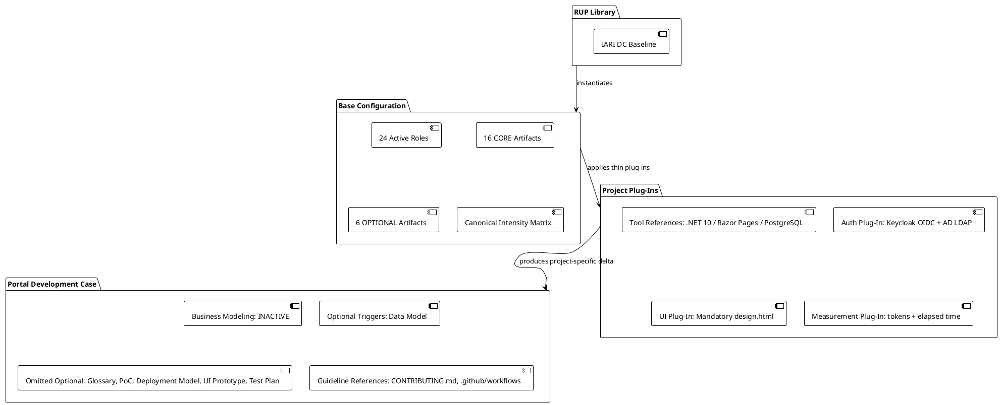
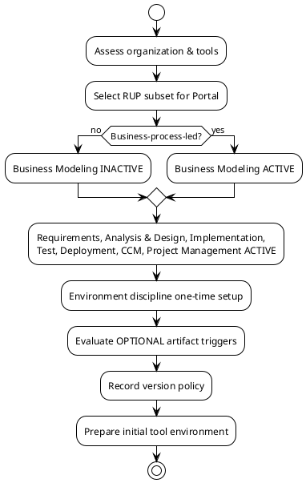
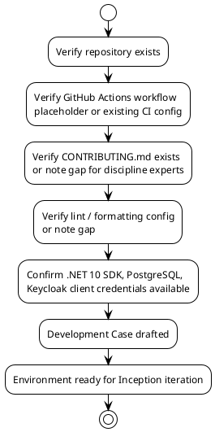

## Document Control

| Field | Value |
|---|---|
| Project | Portal |
| Phase | Inception |
| Iteration | 1 |
| Status | Draft |
| Milestone Target | End-of-Inception review |

## Tailoring Overview

This Development Case records the project-specific deltas over the IARI DC baseline for the **Portal** project. The baseline roster (24 active roles), the 16 CORE artifacts, the 6 OPTIONAL artifacts, and the canonical discipline intensity matrix remain authoritative. Only deviations, optional trigger decisions, and project-specific tool references are declared here.

### Project Context

- **Organization:** Cuba Corp, 200 employees across 3 offices, Europe/Madrid timezone.
- **System:** Internal employee portal (clock in/out, HR news, corporate directory) hosted on internal Windows Server.
- **Agent role count:** Multiple IARI roles active; process is tailored to a small-to-medium intranet project with clear scope and low architectural novelty.
- **Process maturity assumption:** Organization has existing Windows Server / AD / Keycloak operations but no prior IARI process. Ceremony level is lightweight-formal: all CORE artifacts produced, but reviews and approvals are lightweight.

### Tailoring Rationale

1. **Business Modeling is inactive.** The stakeholder scope is already expressed as 12 functional requirements (FR-001..FR-012), 8 non-functional requirements (NFR-001..NFR-008), business goals, constraints, and risks. There is no separate business-process re-engineering effort; the project automates known HR/employee processes rather than redesigning them. A dedicated Business Use-Case Model would duplicate the system Use-Case Model without adding value.
2. **Architecture risk is moderate.** The main technical risks are AD LDAP attribute consistency (R001) and digital clocking adoption (R002), not architectural feasibility. Therefore an Architectural Proof-of-Concept is not triggered in Inception; it may be triggered in Elaboration if the Software Architect identifies an empirical validation need.
3. **Data is bounded.** The portal stores only worker-category mappings, clocking records, news items, and audit entries. A separate Data Model artifact is triggered because the system is data-centric (clocking history, news audit trail, worker category) and the Database Designer needs a formal artifact.
4. **Deployment is simple.** Single internal Windows Server, no cloud, no multi-node topology. A standalone Deployment Model is not triggered; deployment concerns live in the Software Architecture Document.
5. **UI is prescribed.** The mandatory `docs/inputs/employee-portal-design.html` is the authoritative visual specification. A separate UI Prototype is not triggered because the design is already committed and not open to reinterpretation.
6. **No regulatory / contractual test reporting.** Testing scope is managed through Iteration Plans and Test Evaluation Summaries; a formal Test Plan is not triggered.
7. **No specialist glossary.** Domain terms (worker category, clocking, featured news) are defined in constraints and requirements; a separate Glossary is not triggered.



## Disciplines and Intensity

All intensity levels are per the canonical IARI DC matrix. Only discipline activation status is overridden.

| Discipline | Active | Intensity (per canonical matrix) | Rationale / Delta |
|---|---|---|---|
| Business Modeling | **INACTIVE** | — | Scope is already captured as declared FRs/NFRs; no business-process redesign. |
| Requirements | Active | Critical (Inception) | 12 FRs + 8 NFRs must be traced into Use-Case Model and Supplementary Specification. |
| Analysis & Design | Active | Medium (Inception) | Architecture and design begin; full elaboration in Elaboration. |
| Implementation | Active | Medium (Inception) | Spike/prototype only if needed; main construction later. |
| Test | Active | Low (Inception) | Test strategy and approach defined; test execution begins in Construction. |
| Deployment | Active | Low (Inception) | Target environment identified; detailed planning in Transition. |
| Configuration & Change Management | Active | Medium (Inception) | CM baseline established; Change Control Manager active from start. |
| Project Management | Active | High (Inception) | Iteration Plan, Risk List, stakeholder alignment. |
| Environment | Active | High (Inception) | One-time process setup (this Development Case). |



## Artifacts and Templates

### CORE Artifacts (always produced)

All 16 CORE artifacts from the IARI baseline are required for Portal. The following table maps each CORE artifact to its primary owner and the project-specific template / tool reference.

| Artifact | Primary Owner | Template / Tool Reference | Notes |
|---|---|---|---|
| Vision | ProjectManager | `docs/inputs/vision.md` (stakeholder-declared) | Already supplied in Work Order. |
| Use-Case Model | SystemAnalyst | Markdown + PlantUML use-case diagrams | Trace 1:1 to FR-001..FR-012. |
| Supplementary Specification | RequirementsSpecifier | Markdown | Houses NFR-001..NFR-008 and cross-cutting concerns (auth, audit). |
| Software Architecture Document | SoftwareArchitect | Markdown + PlantUML component / deployment diagrams | Must reference CON-001..CON-021. |
| Design Model | Designer | Markdown + PlantUML class / sequence diagrams | DatabaseDesigner contributes data-model section. |
| Implementation Model | Implementer | Repository structure + build scripts | .NET 10 / Razor Pages / PostgreSQL. |
| Test Case | TestDesigner | Markdown / test framework cases | Begin in Elaboration, expand in Construction. |
| Test Evaluation Summary | TestManager | Markdown | Per-iteration summary. |
| User Documentation | TechnicalWriter | Markdown | End-user help for clocking, news, directory. |
| Release Notes | TechnicalWriter | Markdown | Per-release. |
| Iteration Plan | ProjectManager | Markdown | Cost-boxed in tokens + elapsed time. |
| Iteration Assessment | ProjectManager | Markdown | Retrospective input for process improvement. |
| Risk List | ProjectManager | Markdown | R001, R002 plus emerging risks. |
| Review Record | Reviewer | Markdown | Findings from Reviewer / BusinessReviewer / ManagementReviewer / CodeReviewer. |
| Development Case | ProcessEngineer | Markdown (this document) | Override delta over IARI baseline. |
| Change Request | ChangeControlManager | SCM issue template + narrative artifact | Live state in SCM issues; per-iteration narrative in Construction+. |

### OPTIONAL Artifacts

| Artifact | Trigger Status | Reason |
|---|---|---|
| Glossary | NOT TRIGGERED | Domain terms are defined in constraints/requirements; no specialist vocabulary requiring stakeholder validation. |
| Architectural Proof-of-Concept | NOT TRIGGERED | Inception phase; may be triggered in Elaboration if Software Architect identifies empirical validation need for AD LDAP or clocking resilience. |
| Data Model | **TRIGGERED** | Data-centric system (clocking records, news audit, worker category). DatabaseDesigner produces formal data model. |
| Deployment Model | NOT TRIGGERED | Single internal Windows Server; deployment is a section in SAD. |
| User-Interface Prototype | NOT TRIGGERED | `docs/inputs/employee-portal-design.html` is mandatory and authoritative. |
| Test Plan | NOT TRIGGERED | No formal delivery / regulatory / contractual test reporting requirement. |

```plantuml
@startuml Portal_OptionalTriggerEvaluation
!theme plain

start
:Evaluate OPTIONAL artifact triggers
against declared scope;

:Glossary — specialist vocabulary
requiring stakeholder validation?;
if (No) then (yes)
  :Glossary NOT TRIGGERED;
else (no)
  :Glossary TRIGGERED;
endif

:Architectural Proof-of-Concept —
Elaboration + technical risk?;
if (No — Inception now) then (yes)
  :PoC NOT TRIGGERED;
else (no)
  :PoC TRIGGERED;
endif

:Data Model — data-centric system,
>10 entities, or data migration?;
if (Yes — worker category, clocking,
news audit) then (yes)
  :Data Model TRIGGERED;
else (no)
  :Data Model NOT TRIGGERED;
endif

:Deployment Model — distributed /
multi-node / multi-environment?;
if (No — single internal Windows Server) then (yes)
  :Deployment Model NOT TRIGGERED;
else (no)
  :Deployment Model TRIGGERED;
endif

:UI Prototype — UX-critical or
complex UI requiring validation?;
if (No — design.html is authoritative) then (yes)
  :UI Prototype NOT TRIGGERED;
else (no)
  :UI Prototype TRIGGERED;
endif

:Test Plan — formal delivery /
regulatory / contractual reporting?;
if (No) then (yes)
  :Test Plan NOT TRIGGERED;
else (no)
  :Test Plan TRIGGERED;
endif

:Record fired triggers;
stop
@enduml
```

## Optional Artifact Triggers

Fired OPTIONAL artifacts this iteration:

- **Data Model** — triggered because the portal is data-centric: clocking records with audit/correction history, news items with publication/edit/unpublish audit, worker-category assignments with audit. The DatabaseDesigner will produce this artifact in Elaboration.

Not fired this iteration:

- Glossary, Architectural Proof-of-Concept, Deployment Model, User-Interface Prototype, Test Plan.

## Roles and Ownership

The IARI baseline role roster is unchanged. The following table highlights the most active roles in Inception and any project-specific notes.

| Role | Inception Focus | Notes |
|---|---|---|
| ProjectManager | Iteration Plan, Risk List | Cost-boxed in tokens + elapsed time; human gates as risk. |
| SystemAnalyst | Use-Case Model | Trace to FR-001..FR-012; no per-actor UCs; cross-cutting concerns in Supplementary Spec. |
| RequirementsSpecifier | Supplementary Specification | NFR-001..NFR-008; auth/audit as `<<include>>` from dependent UCs. |
| SoftwareArchitect | SAD initial outline | Keycloak OIDC client, AD LDAP read, PostgreSQL, internal Windows Server. |
| Designer | Design Model initial outline | Razor Pages + page-level scripts. |
| DatabaseDesigner | Data Model (triggered) | Worker category, clocking, news audit. |
| TestManager / TestDesigner | Test strategy | Low intensity in Inception. |
| ChangeControlManager | CR process | Active from Inception for scope control. |
| ConfigurationManager | CM baseline | Repository, branching, CI/CD. |
| ProcessEngineer | Development Case (this artifact) | One-time Environment setup. |
| Reviewer / ReviewCoordinator | Review planning | Lightweight review gates. |

```plantuml
@startuml Portal_RoleArtifactMatrix
!theme plain
skinparam classAttributeIconSize 0

class "ProcessEngineer" as PE {
  + owns: Development Case
}
class "ProjectManager" as PM {
  + owns: Iteration Plan, Iteration Assessment, Risk List
}
class "ChangeControlManager" as CCM {
  + owns: Change Request
}
class "ConfigurationManager" as CFM {
  + owns: (CM practices)
}
class "SystemAnalyst" as SA {
  + owns: Use-Case Model
}
class "RequirementsSpecifier" as RS {
  + owns: Supplementary Specification
}
class "SoftwareArchitect" as SARCH {
  + owns: Software Architecture Document
}
class "Designer" as DES {
  + owns: Design Model
}
class "DatabaseDesigner" as DBD {
  + contributes to: Design Model (Data Model section)
}
class "Implementer" as IMP {
  + owns: Implementation Model
}
class "TestManager" as TM {
  + owns: Test Evaluation Summary
}
class "TestDesigner" as TD {
  + owns: Test Case
}
class "TechnicalWriter" as TW {
  + owns: User Documentation, Release Notes
}
class "Reviewer" as REV {
  + owns: Review Record
}

PE --> PM : configures
PE --> CCM : configures
PE --> CFM : configures
PE --> SA : configures
PE --> RS : configures
PE --> SARCH : configures
PE --> DES : configures
PE --> DBD : configures
PE --> IMP : configures
PE --> TM : configures
PE --> TD : configures
PE --> TW : configures
PE --> REV : configures
@enduml
```



## Guidelines and Procedures

### Project-Specific Guidelines

Guideline content is authored by the respective discipline experts and referenced here. The Process Engineer does not duplicate technical guidance.

| Guideline | Owner | Location | Status |
|---|---|---|---|
| Coding standards | Implementer / CodeReviewer | `CONTRIBUTING.md` | **NOT FOUND in repository — Implementer/CodeReviewer must create in Elaboration.** |
| UI conventions | UserInterfaceDesigner | `docs/inputs/employee-portal-design.html` (authoritative) + `CONTRIBUTING.md` | Committed input exists; CONTRIBUTING.md section to be added in Elaboration. |
| Test conventions | TestDesigner / TestManager | `CONTRIBUTING.md` | **NOT FOUND in repository — TestDesigner/TestManager must create in Elaboration.** |
| Design conventions | SoftwareArchitect / Designer | `CONTRIBUTING.md` | **NOT FOUND in repository — SoftwareArchitect/Designer must create in Elaboration.** |
| CI/CD workflow | ConfigurationManager / Implementer | `.github/workflows/` | Directory exists but content could not be verified via API; ConfigurationManager to confirm in Elaboration. |
| Lint / formatting config | Implementer / CodeReviewer | Repository root (e.g., `.editorconfig`, `dotnet-tools.json`) | To be confirmed in Elaboration. |

### Measurement Policy

This project uses the two IARI baseline measures: **tokens consumed** and **elapsed time** split into **agent time** and **human queue time**.

- **Tokens consumed** — read by ProjectManager and ProcessEngineer to monitor iteration cost-box consumption and detect roles or artifacts that consume disproportionate budget.
- **Elapsed time (agent vs. human queue)** — read by ProjectManager to identify human gates that risk suspending the process (ceiling: 14 days). Human queue time is treated as a risk, not an estimate.
- No additional project-specific metrics are defined in Inception. If the team identifies a process bottleneck during Iteration Assessment, a metric may be added via Change Request.

### Change Control

- All scope changes require an approved Change Request managed by the ChangeControlManager.
- The Change Control Board (CCB) is the stakeholder (HR Director / Laura Gómez) plus the ProjectManager and SoftwareArchitect.
- In Inception, scope questions that are potentially critical (e.g., authentication mechanism, integration boundary) are escalated to the stakeholder via `REQUIRES_USER_INPUT`; they do not proceed by assumption.

### Iteration Preparation Checklist (for every iteration)

1. Development Case updated for the upcoming iteration (ProcessEngineer).
2. Optional artifact triggers re-evaluated (ProcessEngineer).
3. Tool configurations verified (ConfigurationManager + Implementer): build, CI/CD, test, modeling.
4. Templates and guidelines available (respective discipline owners).
5. Risk List reviewed and new risks added (ProjectManager).



## Traceability

| Element | Traces From | Link Type | Traces To |
|---|---|---|---|
| Development Case | IARI DC Baseline | Refines | Portal project deltas |
| Business Modeling inactive | Scope statement | Derives | FR-001..FR-012 declared as system requirements |
| Data Model triggered | CON-010, CON-014, FR-001..FR-012 | Derives | DatabaseDesigner artifact scope |
| Glossary not triggered | Scope statement | Refines | Domain terms defined in constraints |
| Deployment Model not triggered | CON-007, CON-013 | Refines | Deployment section in SAD |
| UI Prototype not triggered | CON-015 | Refines | design.html as authoritative UI spec |
| Test Plan not triggered | Acceptance criteria | Refines | Iteration Plan + Test Evaluation Summary |
| Version policy | CON-001, CON-002, CON-003 | Derives | Software Architecture Document |
| Measurement policy | IARI DC §8.1 | Refines | Iteration Plan, Iteration Assessment |
