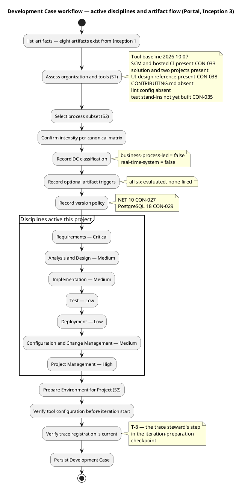
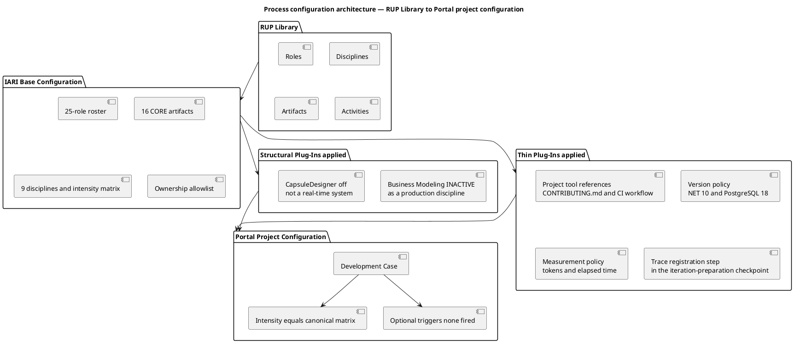
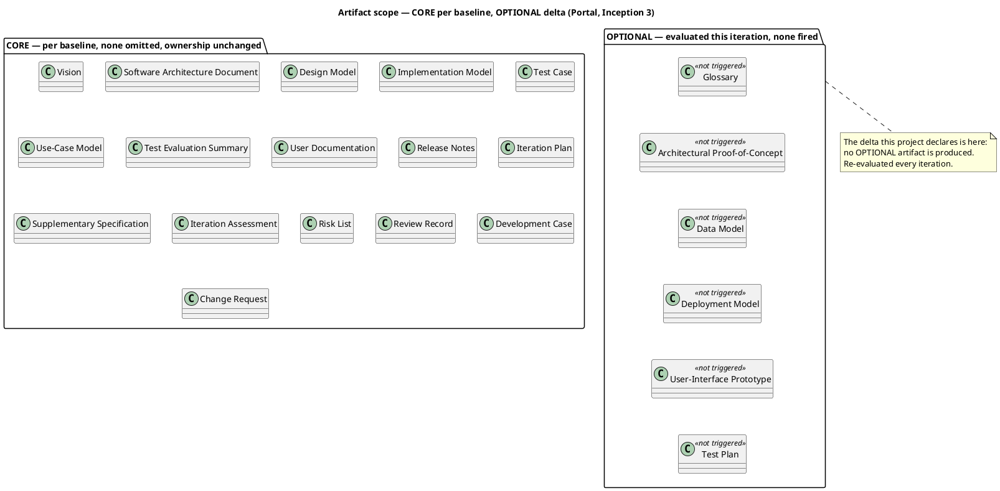
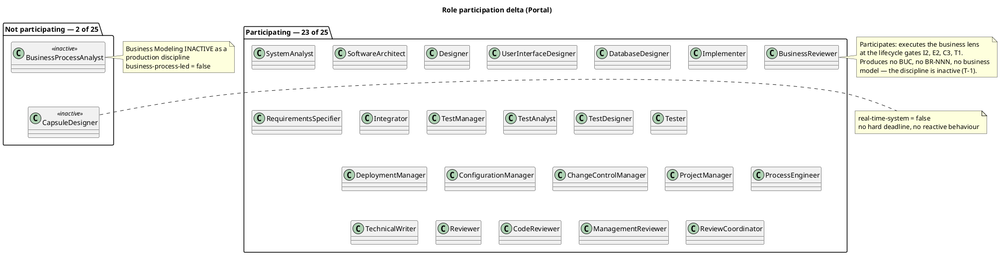
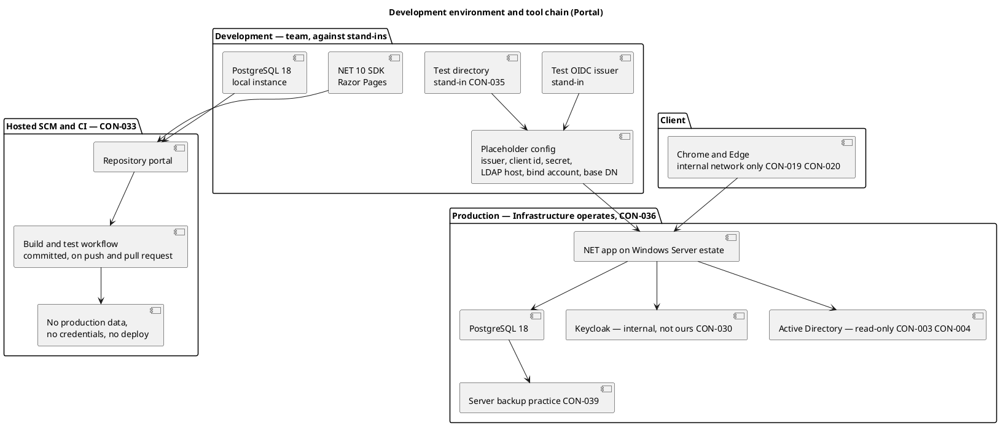

## Document Control
- **Phase:** Inception
- **Status:** Draft — under review
- **Milestone Target:** End of Inception (not yet achieved)
- **Iteration:** 3, Cycle 1
- **Owner:** ProcessEngineer
- **Date:** 2026-10-07

## Tailoring Overview
This document is the **override delta** over the IARI Development Case baseline. It declares only what this project changes. The 25-role roster, the 16 CORE artifacts, the 6 OPTIONAL artifacts, the ownership allowlist and the discipline intensity matrix are baseline and are not restated here.

### Organization and tool assessment (S1, 2026-10-07)

The project is greenfield in its artifacts: no RUP artifact existed before Inception 1. The repository is not empty, and the tool baseline is read from it directly.

**Present in the repository.** The mandatory UI design reference at `docs/inputs/employee-portal-design.html` (CON-038). The CI workflow at `.github/workflows/ci.yml`, committed at sha `0c2fd7cf47eeab68d19420fe3897d209258bd074`, triggering on `push` and on `pull_request` for `main`, `iteration/**`, `chore/**`, `feature/**` and `hotfix/**`, with a build job and a dependent test job on the hosted provider's CI (CON-033). The solution manifest `Portal.sln`, committed at sha `f554bf5bc04df43103677206c7727fcc62ea2bc4`, carrying two projects: `src/Portal.Web/Portal.Web.csproj` and `tests/Portal.Tests/Portal.Tests.csproj`. A build has run on `main` (`ci-run-37583334371`). The workflow regenerates the solution manifest from the `src/` and `tests/` tree on every run, so a subsystem merged under `src/` cannot be silently disconnected from CI.

**Absent.** `CONTRIBUTING.md` and the lint/analyzer configuration. No Change Request is open.

```plantuml
@startuml
title S1 — Organization and tool baseline (Portal, assessed 2026-10-07)

skinparam classAttributeIconSize 0

package "Organization — 25-role roster, 23 participating" as ORG {
  class "Requirements" as G1 <<discipline>> {
    SystemAnalyst
    RequirementsSpecifier
  }
  class "Analysis and Design" as G2 <<discipline>> {
    SoftwareArchitect
    Designer
    UserInterfaceDesigner
    DatabaseDesigner
  }
  class "Implementation" as G3 <<discipline>> {
    Implementer
    Integrator
  }
  class "Test" as G4 <<discipline>> {
    TestManager
    TestAnalyst
    TestDesigner
    Tester
  }
  class "Deployment" as G5 <<discipline>> {
    DeploymentManager
  }
  class "Configuration and Change Management" as G6 <<discipline>> {
    ConfigurationManager
    ChangeControlManager
  }
  class "Project Management" as G7 <<discipline>> {
    ProjectManager
  }
  class "Environment" as G8 <<discipline>> {
    ProcessEngineer
  }
  class "Review" as G9 <<discipline>> {
    Reviewer
    CodeReviewer
    ManagementReviewer
    ReviewCoordinator
    BusinessReviewer
  }
  class "Documentation" as G10 <<discipline>> {
    TechnicalWriter
  }
}

package "Not participating — 2 roles" as OFF {
  class "BusinessProcessAnalyst" as BPA <<inactive>>
  class "CapsuleDesigner" as CD <<inactive>>
}

package "Tool baseline" as TOOLS {
  class "SCM and hosted CI" as T1 <<available>> {
    repository portal
    CI workflow committed
    build and test on provider CI CON-033
  }
  class "Solution and scaffolding" as T7 <<available>> {
    Portal.sln
    src Portal.Web
    tests Portal.Tests
  }
  class "UI design reference" as T2 <<available>> {
    docs inputs employee-portal-design.html
    authoritative visual layer CON-038
  }
  class "CONTRIBUTING.md" as T3 <<absent>> {
    owner discipline experts in Elaboration
  }
  class "Lint and analyzer config" as T4 <<absent>> {
    owner SoftwareArchitect and Implementer
  }
  class "Test OIDC issuer and test directory" as T5 <<to build>> {
    stand-ins per CON-035
    must include empty job title and extension
  }
  class "NET 10 SDK and PostgreSQL 18" as T6 <<declared>> {
    CON-027 CON-029
  }
}

G1 --> T1
G2 --> T2
G3 --> T4
G4 --> T5
G8 --> T3
G8 --> T6
T1 --> T7
BPA -[hidden]- CD

note right of G9
  BusinessReviewer executes the business lens
  at the lifecycle gates I2, E2, C3 and T1.
  Business Modeling is inactive as a
  production discipline (T-1).
end note
@enduml
```

**Gaps carried into Elaboration.** Three tool gaps are open and each has a named owner. They do not block Inception, whose output is the artifact scope, not running code.

| Gap | Owner | Needed by |
|---|---|---|
| `CONTRIBUTING.md` absent — no coding, UI, test or review convention is written down | SoftwareArchitect (design and coding), UserInterfaceDesigner (UI), TestManager (test) | Elaboration, before the first implementation task |
| Lint and analyzer configuration absent | SoftwareArchitect with Implementer | Elaboration, before the first implementation task |
| Test OIDC issuer and test directory stand-ins not built | TestManager with Implementer | Elaboration, before the first integration test (CON-035) |

**Satisfied before Elaboration starts.** The CI workflow is committed and triggers on every push and pull request, and the solution builds with its two scaffolding projects. The Elaboration iteration-preparation checkpoint therefore does not carry the CI workflow as an outstanding condition.

### Classification verdicts

| Verdict | Value | Basis |
|---|---|---|
| Business-process-led | **false** | No business process is modelled, automated or orchestrated. The portal captures clockings (FR-002, FR-005), publishes and reads news (FR-006 to FR-010) and reads a directory from Active Directory (FR-011, FR-012). No business actor, business entity model or business rules engine is in declared scope. The closed value lists (CON-015, CON-043) and the invariants (CON-008 to CON-014) are system rules, not modelled business processes. |
| Real-time system | **false** | No hard deadline and no concurrent event-driven or reactive behaviour. NFR-003 is a single-request response-time target, not a deadline a late result invalidates. CON-040 is one client-side POST retry with an idempotency key — one action, one queue, one entity, nothing to reconcile. |

### Tailoring decisions

| # | Decision | Type | Rationale |
|---|---|---|---|
| T-1 | Business Modeling INACTIVE as a **production** discipline; BusinessProcessAnalyst does not participate | Structural | Classification verdict above. No business process exists to model, so no BUC, no `BR-NNN` and no business object model is produced. The BusinessReviewer is **not** covered by this decision — it participates in its review capacity, see Roles and Ownership. |
| T-2 | CapsuleDesigner does not participate | Structural | Real-time-system verdict above. No capsule, no state machine, no concurrent signal. |
| T-3 | No OPTIONAL artifact is produced this iteration | Structural | All six triggers evaluated and none fired — see Optional Artifact Triggers. |
| T-4 | Discipline intensity is the canonical matrix, unmodified | — | No deviation is proposed. The project's risk profile (R001, R002) is handled by the Requirements and Analysis & Design intensity the matrix already assigns, not by raising it. |
| T-5 | Version policy pins .NET 10 and PostgreSQL 18 | Thin | CON-027, CON-029. Recorded via the version policy; the SoftwareArchitect anchors it in the Software Architecture Document. |
| T-6 | The team builds and tests against stand-ins only; validation against the real Keycloak and AD is human work, not planned team work | Thin | CON-035. Placeholder configuration values are held in configuration, never in code. |
| T-7 | CI runs on the hosted provider; it never holds production data or credentials and never deploys | Thin | CON-033. Infrastructure deploys (CON-036). |
| T-8 | Trace registration is a named step of the iteration-preparation checkpoint, owned by the SystemAnalyst as trace steward | Thin | Process improvement carried out of Inception 2. The same defect class — declared traceability not registered in the trace repository — appeared in two artifacts and survived two iterations because no role's iteration work owned the registration step. See Guidelines and Procedures. |

```plantuml
@startuml
title Development Case workflow — active disciplines and artifact flow (Portal, Inception 3)

start
:list_artifacts — eight artifacts exist from Inception 1;
:Assess organization and tools (S1);
note right
  Tool baseline 2026-10-07
  SCM and hosted CI present CON-033
  solution and two projects present
  UI design reference present CON-038
  CONTRIBUTING.md absent
  lint config absent
  test stand-ins not yet built CON-035
end note

:Select process subset (S2);
:Confirm intensity per canonical matrix;
:Record DC classification;
note right
  business-process-led = false
  real-time-system = false
end note
:Record optional artifact triggers;
note right
  all six evaluated, none fired
end note
:Record version policy;
note right
  NET 10 CON-027
  PostgreSQL 18 CON-029
end note

partition "Disciplines active this project" {
  :Requirements — Critical;
  :Analysis and Design — Medium;
  :Implementation — Medium;
  :Test — Low;
  :Deployment — Low;
  :Configuration and Change Management — Medium;
  :Project Management — High;
}

:Prepare Environment for Project (S3);
:Verify tool configuration before iteration start;
:Verify trace registration is current;
note right
  T-8 — the trace steward's step
  in the iteration-preparation
  checkpoint
end note
:Persist Development Case;
stop
@enduml
```

```plantuml
@startuml
title Process configuration architecture — RUP Library to Portal project configuration

package "RUP Library" as LIB {
  [Disciplines] as D
  [Roles] as R
  [Artifacts] as A
  [Activities] as ACT
}

package "IARI Base Configuration" as BASE {
  [25-role roster] as R25
  [16 CORE artifacts] as C16
  [9 disciplines and intensity matrix] as D9
  [Ownership allowlist] as OWN
}

package "Thin Plug-Ins applied" as THIN {
  [Project tool references\nCONTRIBUTING.md and CI workflow] as P1
  [Version policy\nNET 10 and PostgreSQL 18] as P2
  [Measurement policy\ntokens and elapsed time] as P3
  [Trace registration step\nin the iteration-preparation checkpoint] as P4
}

package "Structural Plug-Ins applied" as STRUCT {
  [Business Modeling INACTIVE\nas a production discipline] as S1
  [CapsuleDesigner off\nnot a real-time system] as S2
}

package "Portal Project Configuration" as PROJ {
  [Development Case] as DC
  [Intensity equals canonical matrix] as INT
  [Optional triggers none fired] as OPT
}

LIB --> BASE
BASE --> THIN
BASE --> STRUCT
THIN --> PROJ
STRUCT --> PROJ
DC --> INT
DC --> OPT
@enduml
```

## Disciplines and Intensity
Intensity per discipline and phase is **per the canonical matrix**, unmodified. No deviation is proposed or granted.

**Inactive discipline:** Business Modeling — inactive as a **production** discipline for the whole project (T-1). Its intensity row in the canonical matrix does not apply, because no business-modeling artifact is produced. The business **lens** still executes at the lifecycle gates (I2, E2, C3, T1) under the BusinessReviewer, re-deriving the DC §4 verdict each iteration; that is a review activity, not a Business Modeling work item, and it carries no intensity level.

**Environment** is one-time at project start, per the baseline. Its Inception work is this document; its Elaboration work is the iteration-preparation checkpoint and the guideline integration named in Guidelines and Procedures.

## Artifacts and Templates
All 16 CORE artifacts are produced, with baseline ownership unchanged. No CORE artifact is omitted. No artifact outside the CORE + OPTIONAL universe is produced or referenced.

```plantuml
@startuml
title Artifact scope — CORE per baseline, OPTIONAL delta (Portal, Inception 3)

skinparam classAttributeIconSize 0

package "CORE — per baseline, none omitted, ownership unchanged" as CORE {
  class "Vision" as VIS
  class "Use-Case Model" as UCM
  class "Supplementary Specification" as SS
  class "Software Architecture Document" as SAD
  class "Design Model" as DM
  class "Implementation Model" as IM
  class "Test Case" as TC
  class "Test Evaluation Summary" as TES
  class "User Documentation" as UD
  class "Release Notes" as RN
  class "Iteration Plan" as IP
  class "Iteration Assessment" as IA
  class "Risk List" as RL
  class "Review Record" as RR
  class "Development Case" as DC
  class "Change Request" as CR
}

package "OPTIONAL — evaluated this iteration, none fired" as OPT {
  class "Glossary" as GL <<not triggered>>
  class "Architectural Proof-of-Concept" as POC <<not triggered>>
  class "Data Model" as DMO <<not triggered>>
  class "Deployment Model" as DPM <<not triggered>>
  class "User-Interface Prototype" as UIP <<not triggered>>
  class "Test Plan" as TP <<not triggered>>
}

note bottom of OPT
  The delta this project declares is here:
  no OPTIONAL artifact is produced.
  Re-evaluated every iteration.
end note

VIS -[hidden]- UCM
UCM -[hidden]- SS
GL -[hidden]- POC
POC -[hidden]- DMO
DMO -[hidden]- DPM
DPM -[hidden]- UIP
UIP -[hidden]- TP
@enduml
```

## Optional Artifact Triggers

All six OPTIONAL artifacts were evaluated against their §5.2 trigger condition. **None fired.** The recorded trigger set for this iteration is empty.

| Optional artifact | Trigger condition | Verdict | Basis |
|---|---|---|---|
| Glossary | Domain uses specialist vocabulary requiring stakeholder-validated definitions | **NOT FIRED** | The vocabulary is ordinary intranet and HR vocabulary. The two closed value lists (CON-015 worker categories, CON-043 news categories) are fixed enumerations of four values each, defined in the constraints themselves — they need no stakeholder-validated definition document. |
| Architectural Proof-of-Concept | Elaboration phase + at least one technical risk requiring empirical validation | **NOT FIRED** | Inception, not Elaboration. R001 (LDAP attribute consistency) is validated by reading the real directory, which CON-035 assigns to Infrastructure and HR as human work, not by a proof of concept the team builds. |
| Data Model | Data-centric system OR more than 10 entities OR data-migration in scope | **NOT FIRED** | The portal owns one local table of two columns — AD user id to worker category (CON-017). Employee data has exactly one home, Active Directory, and is read over LDAP (CON-004, CON-032). There is no data migration (CON-037). The data design lives inline in the Design Model. |
| Deployment Model | Distributed or multi-node topology, OR multi-environment non-trivial | **NOT FIRED** | Single .NET application on the Windows Server estate Infrastructure already operates, one PostgreSQL instance, one internal network, one timezone (CON-002, CON-006, CON-019, CON-029). Keycloak and AD are external systems the portal consumes, not nodes this project deploys (CON-030). Deployment is a section of the Software Architecture Document. |
| User-Interface Prototype | UX-critical OR UI complexity requiring stakeholder validation before implementation | **NOT FIRED** | The visual layer is already fixed and authoritative: `docs/inputs/employee-portal-design.html` is mandatory and needs no confirmation that it will arrive (CON-038). A prototype would duplicate a committed, authoritative reference. |
| Test Plan | Formal delivery / regulatory audit / contractual test reporting | **NOT FIRED** | No external compliance regime applies and no retention period is mandated (CON-021). The Iteration Plan defines per-iteration testing scope. |

## Roles and Ownership
**23 of the 25 baseline roles participate. 2 do not.** No role is merged, renamed or re-scoped, and no CORE artifact changes primary owner.

```plantuml
@startuml
title Role participation delta (Portal)

skinparam classAttributeIconSize 0

package "Participating — 23 of 25" as ON {
  class "SystemAnalyst" as SA
  class "RequirementsSpecifier" as RS
  class "SoftwareArchitect" as SWA
  class "Designer" as DES
  class "UserInterfaceDesigner" as UID
  class "DatabaseDesigner" as DBD
  class "Implementer" as IMP
  class "Integrator" as INT
  class "TestManager" as TM
  class "TestAnalyst" as TA
  class "TestDesigner" as TD
  class "Tester" as TE
  class "DeploymentManager" as DEP
  class "ConfigurationManager" as CM
  class "ChangeControlManager" as CCM
  class "ProjectManager" as PM
  class "ProcessEngineer" as PE
  class "TechnicalWriter" as TW
  class "Reviewer" as REV
  class "CodeReviewer" as CRV
  class "ManagementReviewer" as MR
  class "ReviewCoordinator" as RC
  class "BusinessReviewer" as BR
}

package "Not participating — 2 of 25" as OFF {
  class "BusinessProcessAnalyst" as BPA <<inactive>>
  class "CapsuleDesigner" as CD <<inactive>>
}

note right of BPA
  Business Modeling INACTIVE as a
  production discipline
  business-process-led = false
end note
note right of BR
  Participates: executes the business lens
  at the lifecycle gates I2, E2, C3, T1.
  Produces no BUC, no BR-NNN, no business
  model — the discipline is inactive (T-1).
end note
note right of CD
  real-time-system = false
  no hard deadline, no reactive behaviour
end note

SA -[hidden]- RS
BPA -[hidden]- CD
@enduml
```

| Role | Participation | Reason |
|---|---|---|
| BusinessProcessAnalyst | Not participating | Business Modeling inactive as a production discipline (T-1). No BUC, no `BR-NNN`, no business model is produced. |
| BusinessReviewer | **Participating — business lens at the lifecycle gates** | The business lens executes at I2, E2, C3 and T1. It re-derives the DC §4 INACTIVE verdict each iteration against the declared scope and the persisted artifacts, and it would catch a business process entering scope through a Change Request. It produces no business model. |
| CapsuleDesigner | Not participating | Not a real-time system (T-2). |
| All other 22 roles | Participating | Per baseline. |

**Why the BusinessReviewer participates while Business Modeling is inactive.** The two are not the same decision. Inactivating the discipline removes the *production* of business-modeling artifacts — no BUC, no business rule set, no business object model. It does not remove the *governance* duty that the business lens discharges: the DC §4 verdict is re-derived every iteration, not carried forward, and the lens is the only one that performs that re-derivation. Recording the role as non-participating while the lens executed left the re-derivation unscheduled. The role is therefore recorded as participating in its review capacity, and T-1 is restated to exclude only the production discipline.

**Contributors this project adds to CORE artifacts** (primary ownership unchanged):

| Artifact | Primary owner (baseline) | Project contributors |
|---|---|---|
| Software Architecture Document | SoftwareArchitect | DatabaseDesigner (the two-column category table and its constraints), UserInterfaceDesigner (UI layer against CON-038) |
| Design Model | Designer | UserInterfaceDesigner (UI sections), DatabaseDesigner (data sections) |
| Supplementary Specification | RequirementsSpecifier | SoftwareArchitect (NFR-002, NFR-003, NFR-004 feasibility), TestManager (verifiability) |
| User Documentation | TechnicalWriter | UserInterfaceDesigner (screen-accurate wording), SystemAnalyst (use-case flows) |

## Guidelines and Procedures
### Measurement policy

Two quantities are tracked, and only two. Each is stated with the decision it enables and its reader.

| Quantity | Decision it enables | Reader |
|---|---|---|
| Tokens consumed, measured per iteration | Whether the forecast for the next iteration is revised. There is no budget and no cap, and none is set by the team (CON-034). Declared scope is never cut or deferred to fit an estimate. | ProjectManager, ProcessEngineer |
| Elapsed time, split into agent time and time waiting for a human | Whether a human gate has become the critical path and must be escalated. The two clocks are reported apart and never added. | ProjectManager, ProcessEngineer, ReviewCoordinator |
| Process findings and process questions raised during the iteration | Which Development Case section or guideline is revised before the next iteration starts. | ProcessEngineer |

**Human gate.** The validation of the real Keycloak and the real Active Directory is human work performed by Infrastructure with HR, and its feedback must reach the team before Elaboration closes (CON-035). It is bounded as a risk in the Risk List, not as an estimate: ceiling 14 days, actual measured and reported apart, estimate none. If it delays a milestone, the remedy is another iteration (CON-026).

**Not tracked.** No velocity, no person-weeks, no person-months, no story points, no function points. No calendar date is projected from an estimate.

### Risk governance

A risk the team identifies is adopted as a first-class risk and numbered in the same series as R001 and R002, from R003 onwards in the order raised, with the same probability, impact, mitigation and contingency fields (CON-023). The identifier is granted in advance so the risk can be traced into the design.

Acceptance is granted in advance by the project sponsor and is not asked again: R001, R002 and every risk the team identifies whose mechanism is set by the declared constraints or lies outside the team's control and cannot be transferred are accepted, provided the treatment never cuts or defers declared scope (CON-024).

The availability, configuration and ownership of Keycloak and Active Directory are not risks of this project and are not registered (CON-025).

### Iteration preparation checkpoint

Every iteration opens with an explicit environment-readiness check before development starts.

**Inception iteration 3.** Repository present; design reference present; CI workflow committed and green; Development Case persisted; trace registration current — every link an artifact declares in its Traceability table is registered in the trace repository, or the table states that the artifact-level link is the registered one.

**Elaboration.** The check adds: `CONTRIBUTING.md` committed; lint configuration committed; test stand-ins built and reachable; placeholder configuration values present in configuration and absent from code (CON-035). The CI workflow is **not** an outstanding condition — it is committed and triggers on every push and pull request, and the solution builds with its two scaffolding projects.

### Process support during the iteration

Process support is continuous, not a one-time configuration. Process questions are answered within the iteration in which they are raised; a blocking process question is escalated immediately rather than carried. Tool configuration problems are logged with an improvement action and an owner, and are evaluated against process effectiveness at each iteration close.

**Improvement carried out of Inception 1 — the S1 tool baseline is read, not assumed.** The S1 tool assessment was written from the assumption that a greenfield project has an empty repository, and it recorded the CI workflow, the solution and the two scaffolding projects as absent while all three were committed. The defect was found by review, not by the assessment. The corrective practice, effective from Inception 2: the S1 tool baseline is read from the repository through the SCM tools and every claim in it cites the path and sha it was read from. An assessment statement about tool state that cites no observed artifact is not a finding of the assessment and does not enter the Development Case.

**Improvement carried out of Inception 2 — trace registration is a named step with a named owner (T-8).** The same defect class appeared in two artifacts and survived two iterations: each declared element-level traceability in its Traceability table that was not registered in the trace repository, so the declared coverage could not be verified from the graph. The root cause is a process gap, not an artifact defect: no role's iteration work owned the registration step, so the declaration and the registration drifted apart and the drift was only visible at review. The corrective practice, effective from this iteration:

- **Owner.** The SystemAnalyst is the trace steward. Registration is that role's act, performed in the iteration in which the declaring artifact is written, not deferred to review.
- **Step.** The iteration-preparation checkpoint verifies that every link an artifact declares in its Traceability table is registered in the trace repository. A declared link that is not registered is a process defect at the checkpoint, before the iteration's artifacts are reviewed.
- **Rule.** An artifact's Traceability table states what the graph carries. If an element-level link is judged redundant with the artifact-level link, the element-level row is dropped from the table rather than left declared and unregistered.
- **Escalation.** A registration gap that survives one iteration is escalated to the Change Control Manager as a process risk, because it is a process failure rather than an artifact defect.

### Guideline ownership

The ProcessEngineer integrates and publishes; the discipline experts author. Design and coding conventions belong to the SoftwareArchitect, UI conventions to the UserInterfaceDesigner, test conventions to the TestManager, and user-documentation conventions to the TechnicalWriter. These live in `CONTRIBUTING.md` and the lint configuration, which this Development Case references rather than duplicates.

### Environment constraints that shape the process

- The team builds and tests against stand-ins it controls — a test OIDC issuer and a test directory carrying the declared attributes, including entries whose job title or extension is empty (CON-035). The stand-in directory must carry those empty entries, because R001 is precisely the risk that the real attributes are inconsistently filled.
- Placeholder values for issuer, client id, client secret, LDAP host, bind account and base DN are held in configuration and never in code. Infrastructure puts the real values in at deployment (CON-035).
- CI never holds production data or credentials and never deploys; Infrastructure deploys (CON-033, CON-036).
- No backup design, tooling or restore procedure is part of this project (CON-039). No data migration is part of this project (CON-037).
- The portal is reachable only from the internal corporate network, on current Chrome and Edge (CON-019, CON-020).

```plantuml
@startuml
title Development environment and tool chain (Portal)

package "Development — team, against stand-ins" as DEV {
  [NET 10 SDK\nRazor Pages] as SDK
  [PostgreSQL 18\nlocal instance] as PG
  [Test OIDC issuer\nstand-in] as OIDC
  [Test directory\nstand-in CON-035] as LDAP
  [Placeholder config\nissuer, client id, secret,\nLDAP host, bind account, base DN] as CFG
}

package "Hosted SCM and CI — CON-033" as CI {
  [Repository portal] as REPO
  [Build and test workflow\ncommitted, on push and pull request] as WF
  [No production data,\nno credentials, no deploy] as RULE
}

package "Production — Infrastructure operates, CON-036" as PROD {
  [NET app on Windows Server estate] as APP
  [PostgreSQL 18] as PGP
  [Keycloak — internal, not ours CON-030] as KC
  [Active Directory — read-only CON-003 CON-004] as AD
  [Server backup practice CON-039] as BK
}

package "Client" as CL {
  [Chrome and Edge\ninternal network only CON-019 CON-020] as BR
}

SDK --> REPO
PG --> REPO
REPO --> WF
WF --> RULE
OIDC --> CFG
LDAP --> CFG
CFG --> APP
APP --> PGP
APP --> KC
APP --> AD
PGP --> BK
BR --> APP
@enduml
```

## Traceability
| Element | Traces From | Link Type | Traces To |
|---|---|---|---|
| Development Case | CON-001, CON-002, CON-030, CON-031, CON-032, CON-033, CON-035, CON-036, CON-039 | Refines | Software Architecture Document |
| Development Case | CON-004, CON-005, CON-006, CON-008, CON-009, CON-010, CON-014, CON-015, CON-016, CON-017, CON-037 | Refines | Design Model |
| Development Case | CON-007, CON-011, CON-012, CON-013, CON-018, CON-021, CON-022, CON-043 | Refines | Supplementary Specification |
| Development Case | CON-023, CON-024, CON-025, R001, R002 | Refines | Risk List |
| Development Case | CON-026, CON-034 | Refines | Iteration Plan, Iteration Assessment |
| Development Case | CON-003, CON-019, CON-020, CON-027, CON-028, CON-029, CON-038, CON-040, CON-041, CON-042 | Refines | Implementation Model, User Documentation |
| Development Case | FR-001, FR-002, FR-003, FR-004, FR-005, FR-006, FR-007, FR-008, FR-009, FR-010, FR-011, FR-012 | Refines | Use-Case Model |
| Development Case | NFR-001, NFR-002, NFR-003, NFR-004, NFR-005 | Refines | Test Case, Test Evaluation Summary |
| Development Case | BG-001, BG-002, BG-003, AC-001, AC-002, AC-003, AC-004, AC-005, AC-006 | Refines | Vision |

**Registration.** The links above are artifact-level: the Development Case refines the artifact named in the last column, and the declared identifiers in the second column are the constraints and requirements that tailoring decision rests on. Registration of a declared link in the trace repository is the trace steward's act, performed in the iteration in which the declaring artifact is written (T-8, Guidelines and Procedures). Where an element-level link is judged redundant with the artifact-level link, the element-level row is dropped rather than left declared and unregistered, so this table states what the graph carries.

