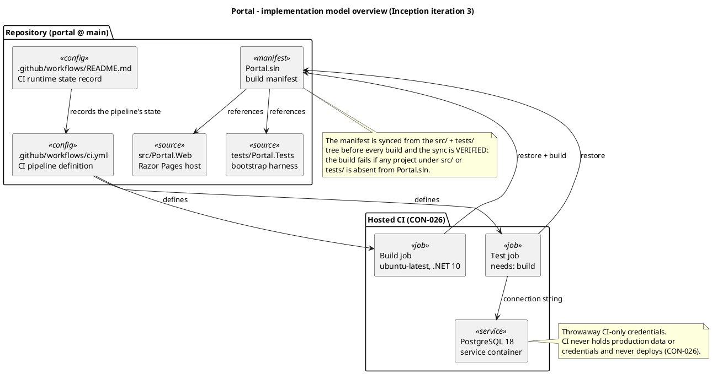
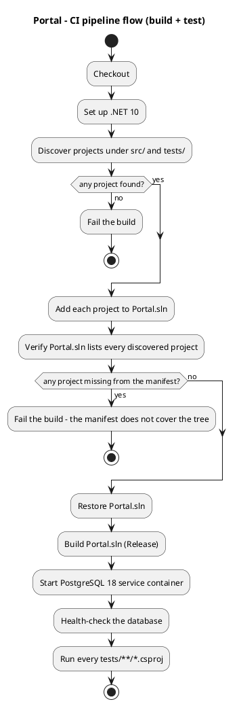

# Implementation Model

## Document Control

- **Phase:** Inception
- **Status:** Draft — iteration 3
- **Milestone Target:** Lifecycle Objectives (LCO) — end of Inception. NOT YET ACHIEVED.

## Overview

This artifact records the implementation structure as it actually exists in the repository, and the
integration discipline that governs how it grows. It is not a plan: every statement below is read
from the repository at `main` or from an observed CI run. Inception produces no use-case
implementation, so the model's content this phase is the build structure, the CI pipeline and the
integration pedigree — the substrate every later iteration's code lands on.

**Stack.** .NET 10 (CON-022) with Razor Pages (CON-023), PostgreSQL 18 (CON-024), built and tested on
the hosted SCM provider's CI (CON-026). The stack is declared, not inferred: the Vision pins all
three, so no stack question was raised.

**Repository layout.** The canonical layout is in place and this model does not fork a parallel tree.
Every buildable source file lives under `src/`, every test under `tests/`; only manifests and
configuration sit at the repository root.

| Path | Role | Owner |
|---|---|---|
| `Portal.sln` | Build manifest — references every project under `src/` and `tests/` | Integrator (co-owned with Implementer) |
| `src/Portal.Web/` | The single .NET 10 deployable: Razor Pages host, `Program.cs`, `appsettings.json`, `wwwroot/` | Implementer |
| `tests/Portal.Tests/` | Test project; the bootstrap harness | Implementer |
| `.github/workflows/ci.yml` | CI pipeline definition — build and test jobs | Integrator |
| `.github/workflows/README.md` | CI runtime state record | Integrator |
| `docs/BRANCHING_STRATEGY.md` | Branching topology and the pre-tag gate | ConfigurationManager |
| `docs/inputs/employee-portal-design.html` | Authoritative UI visual layer (CON-031) | Input, consumed by Designer and Implementer |

## Build and Integration

### The build manifest cannot drift from the tree

`Portal.sln` is a build manifest, not a source of truth. The Implementer adds subsystem projects
under `src/` every iteration, and a manifest that omits one compiles nothing of that work: the build
stays green while the merged code is never built, and the green check becomes a lie. The pipeline
therefore syncs the manifest from the `src/` + `tests/` tree before every build **and verifies the
result**, failing the build if any project under `src/` or `tests/` is absent from `Portal.sln`. An
add that silently fails can no longer pass as a sync. This is the mechanism that keeps a green check
meaningful as the tree grows.

### The pipeline

Two jobs. The build job restores and builds the whole solution in Release. The test job depends on
it, carries a health-checked PostgreSQL 18 service container, and executes every `tests/**/*.csproj`
— the job is not bound to a fixed project name, so a test project the Implementer adds is picked up
automatically. The pipeline triggers on push and on pull request for `main`, `iteration/**`,
`chore/**`, `feature/**` and `hotfix/**`, so every role's push gets CI feedback on its own branch
rather than only when a pull request is later opened.

### Integration discipline

Integration is incremental and ordered, never batched. One approved feature PR is merged into
`iteration/Cn` at a time, bottom-up over the subsystem dependency graph, leaves first — merging in
the order pull requests happen to land produces spurious CI failures that are actually wrong-order
symptoms. Every merge is followed by a build-status check; a red post-merge build HALTS the pipeline
and is tracked by an `integration-regression` Issue, never silenced and never worked around. Target
cadence is at least one build per day toward an iteration close, one per week minimum.

The dependency graph the merge order follows is embedded in `ci.yml` as a PlantUML comment, so the
order travels with the pipeline definition rather than living in a separate document.

### Two levels of integration

| Level | From -> To | Gate |
|---|---|---|
| Feature | `feature/Cn-*` -> `iteration/Cn` | Consolidated review state APPROVED, then a post-merge build check |
| Iteration | `iteration/Cn` -> `main` | The iteration-close PR, reviewed by the SoftwareArchitect and signed off by the ManagementReviewer where a milestone applies |

The iteration-close PR body is the formal record of the iteration's integration outcome: the pedigree
chain, the merged feature PRs, the CI status of each merge, and the component and deployment
diagrams. There is no separate build document — the PR body, the CI status and the Git tags are the
trace.

## Integration Pedigree at Inception Iteration 3

**No merge was performed this iteration, and none was due.** No branch carried `ready-for-review` and
no pull request was open, so no merge occurred and no post-merge build check was owed.

**No `iteration/Cn` branch was created.** `docs/BRANCHING_STRATEGY.md` — the ConfigurationManager's
authoritative branching model — declares Inception documentation-only and its topology defines no
Inception iteration branch. There is therefore no `iteration/Cn` -> `main` pull request to open. The
iteration-close PR is the Elaboration and Construction instrument; the first one is due at the close
of the first iteration that merges feature branches.

| Subsystem | Pedigree | Basis |
|---|---|---|
| CI baseline (build + test) | VERIFIED | run `36110535676` green on `main` |
| PostgreSQL 18 test service | VERIFIED | run `36110535676` green on `main` |
| CI runtime state record | VERIFIED | `.github/workflows/README.md` |
| UC-001 .. UC-009 | DEFERRED | no implementation exists; Inception is documentation-only |

**CI evidence.** Run `36110535676` on `main`, success, started 2026-09-25 08:00:02Z, completed
08:01:20Z. That run exercised the hardened workflow, so the modified pipeline definition parses and
the manifest-coverage verification passes on the current tree. The build-status endpoint did not
register the run for the intermediate revision `233644bc` across four consecutive checks; no run
reference was written into the CI record until an observed run was available.

**Commits this iteration.** `233644bc` (manifest-coverage verification added to both jobs),
`e7d5d92f` (CI runtime state record refreshed; the stale issue restatement removed), `2602d347` (the
observed run cited).

**Deferred to Elaboration.** All nine use cases. Every one is built and tested against the CON-028
stand-ins, never against the real Keycloak or the real AD. The stand-in environment does not yet
exist, so no use case is buildable and no iteration has produced a verifiable increment. It is the
first construction item of the next iteration and a hard gate: no work item that exercises a use case
against the stand-in starts until it is delivered and recorded. The stand-in directory must carry the
worker-category link as well as entries with empty job title and extension, because UC-008 filters
the directory by worker category (CON-013) and the category is the one field the portal owns
(CON-016).

## Traceability

| Element | Traces From | Link Type | Traces To |
|---|---|---|---|
| Implementation Model | COMP-001, COMP-002, COMP-003, COMP-004, COMP-005, COMP-006, COMP-007, COMP-008, COMP-009, COMP-010 | Specifies | `src/Portal.Web/Portal.Web.csproj` |
| Implementation Model | CON-022, CON-023 | Implements | `src/Portal.Web/Portal.Web.csproj` |
| Implementation Model | CON-024 | Implements | `tests/Portal.Tests/Portal.Tests.csproj` |
| Implementation Model | CON-026 | Implements | `.github/workflows/ci.yml` |
| Implementation Model | CON-026 | Implements | `Portal.sln` |
| Implementation Model | CON-031 | Implements | `docs/inputs/employee-portal-design.html` |

**Link direction.** The Implementation Model is a platform-level artifact: it `Specifies` the design
it realizes (the Software Architecture Document's components) and `Implements` the code and
configuration that carry it. The `Traces From` column carries the components and constraints that
justify the structure; the `Traces To` column carries the repository paths that materialize it.

**Scope of this phase.** Inception produces no use-case implementation, so no row traces to a
use-case source file. The rows above record the build structure and the CI pipeline only. The
use-case rows are added in Elaboration, when the Implementer's first feature branch lands and the
first merge into `iteration/E1` is CI-verified.
