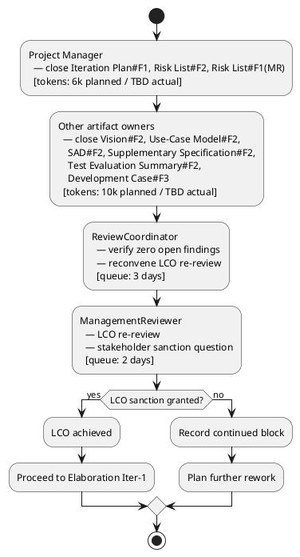

## Document Control

| Field | Value |
|---|---|
| Project | Portal |
| Phase | Inception |
| Iteration | 2 |
| Status | Draft |
| Milestone Target | Lifecycle Objectives (LCO) re-review after findings closed |
| Assessment Date | 2026-09-11 |
| ReviewCoordinator Verdict | Pending — rework in progress; LCO not yet achieved |

## Iteration Objectives Reached

The Iteration Plan for Inception Iteration 2 committed five objectives. The table below records progress given that the iteration is still in rework and the LCO gate has not been re-reviewed.

| Objective | Iteration Plan Reference | Met / Not Met | Evidence |
|---|---|---|---|
| Close all open Review Record findings on PM-owned and co-owned artifacts | Iteration Plan §Iteration Objectives #1 | In progress | Iteration Plan and Risk List updated; Vision, Use-Case Model, SAD, Supplementary Specification, Test Evaluation Summary, and Development Case findings remain open until their respective owners close them. |
| Update Iteration Plan to comply with two-currency measurement discipline | Iteration Plan §Iteration Objectives #2 | Met | Iteration Plan updated with unanchored Gantt, planned vs actual token columns, and separate human gate queue time. |
| Update Risk List to mark R003-R008 as derived and fix traceability | Iteration Plan §Iteration Objectives #3 | Met | Risk List updated with derivation markers; R003 notes CON-005 mitigation; R006 traces to SAD Deployment View / Transition planning. |
| Prepare project for LCO re-review | Iteration Plan §Iteration Objectives #4 | Not yet | ReviewCoordinator and ManagementReviewer gates are queued; dependent on other owners closing their findings first. |
| Do NOT advance to Elaboration until LCO sanction granted | Iteration Plan §Iteration Objectives #5 | Met | No Elaboration work items scheduled; roadmap shows LCO re-review as gate before Elaboration. |

## Adherence to Plan

### Critical Chain

### Budget Box Variance

| Budget Item | Planned | Actual | Variance |
|---|---|---|---|
| Iteration token budget | 16k tokens | TBD | Actual will be recorded after iteration closes; planned figure is an assumption before measurement. |
| Agent elapsed time | not measured | TBD | Baseline from Iter-1: 0:29:03. |
| Stakeholder queue time | 5 days | TBD | 3 days ReviewCoordinator verification + 2 days ManagementReviewer LCO re-review. |

### Schedule / Scope Variance

The iteration scope is **rework and re-review**, not advancement to Elaboration. The coarse roadmap milestone sequence (LCO → LCA → IOC → PR) remains valid, but the LCO milestone is explicitly pending re-review. No new use cases, design, or implementation work enters until LCO is achieved.

## Use Cases and Scenarios Implemented

No use cases were implemented in Inception Iteration 2. This iteration closes findings against the planning baseline. The architecturally significant use cases remain UC-003, UC-007, UC-008, and UC-012.

| Use Case | Significant? | Status This Iteration |
|---|---|---|
| UC-001 Assign Worker Category | No | Scope confirmed; no open PM-owned findings. |
| UC-002 Clear Worker Category | No | Scope confirmed. |
| UC-003 Clock In / Clock Out | Yes | Confirmed as driver; R005 covers localStorage retry risk. |
| UC-004 View Own Clocking History | No | Scope confirmed. |
| UC-005 View All Employee Clockings | No | Scope confirmed. |
| UC-006 Export Monthly Clocking Report | No | Scope confirmed. |
| UC-007 Correct or Insert Clocking | Yes | Confirmed as driver; CON-020 immutable records validated. |
| UC-008 Publish News Item | Yes | Confirmed as driver; R007 covers featured invariant risk. |
| UC-009 Edit News Item | Yes | Finding Use-Case Model#F2 targeted for closure by System Analyst. |
| UC-010 Unpublish News Item | No | Scope confirmed. |
| UC-011 Browse and Filter News | No | Scope confirmed. |
| UC-012 Search Corporate Directory | Yes | Confirmed as driver; R001 covers AD attribute gap risk. |

## Results Relative to Evaluation Criteria

| Criterion | Iteration Plan Exit Criterion | Status | Evidence |
|---|---|---|---|
| Iteration Plan updated with unanchored Gantt and budget box | Exit Criterion #1 | Met | Iteration Plan §Plan and Milestones shows unanchored Gantt and planned vs actual token columns. |
| Risk List updated with derivation markers and fixed traceability | Exit Criterion #2 | Met | Risk List §Risk Register marks R003-R008 as derived; R003 notes CON-005; R006 traces to SAD Deployment View. |
| Vision STK-001 attribution corrected | Exit Criterion #3 | In progress | Vision already updated by System Analyst in Iteration 2; PM concurs. |
| Use-Case Model UC-009 invariant wording corrected | Exit Criterion #4 | Open | Owned by System Analyst. |
| SAD ADR-008 marked pending | Exit Criterion #5 | Open | Owned by Software Architect. |
| Supplementary Specification authorization inclusion consistent | Exit Criterion #6 | Open | Owned by RequirementsSpecifier. |
| Test Evaluation Summary references SCM evidence | Exit Criterion #7 | Open | Owned by Test Manager. |
| Development Case Data Model trigger tied to iteration/owner | Exit Criterion #8 | Open | Owned by Process Engineer. |
| ReviewCoordinator confirms zero open findings | Exit Criterion #9 | Not yet | Blocked on other owners. |
| LCO re-review held and sanction question asked | Exit Criterion #10 | Not yet | Blocked on zero-findings confirmation. |

## Test Results

No executable artifacts exist in Inception Iteration 2; therefore no test execution results are available. The Project Manager concurs with the reviewer finding Test Evaluation Summary#F2: the Test Evaluation Summary should reference SCM evidence (CI build status, pull request state) rather than a zeroed defect table.

| Metric | Value | Goal | Decision Enabled |
|---|---|---|---|
| Test cases executed | 0 | 0 (Inception) | Confirms no code-level testing occurred. |
| Defects reported | 0 | 0 (Inception) | Confirms no executable artifacts. |
| Acceptance criteria mapped to UCs | 5/5 | 5/5 | Validates testability baseline for Construction. |
| Open findings on PM-owned artifacts | 0 | 0 | Iteration Plan and Risk List findings closed. |

## External Changes

The stakeholder's Iteration 1 answers remain authoritative:

- Laura Gómez (STK-001) is the HR Director and project sponsor, not a portal operator.
- The HR capabilities listed in the Vision belong to the AD "HR" group role, not to Laura as an individual.
- LCO advancement is blocked until all findings, including Minor findings, are closed and the review is rescheduled.

No new external changes occurred during Inception Iteration 2.

## Rework Required

The project remains in the LCO rework loop. The following actions are required before the LCO re-review:

| Action ID | Finding | Owner | Target Artifact | Severity | Status |
|---|---|---|---|---|---|
| A-001 | Vision#F2 | System Analyst / Project Manager | Vision | Critical | Closed by System Analyst in Iteration 2; PM concurs |
| A-002 | Iteration Plan#F1 (MR) | Project Manager | Iteration Plan / Review Record | Critical | Open — close after all other findings closed |
| A-003 | Iteration Plan#F1 | Project Manager | Iteration Plan | Major | Closed |
| A-004 | Risk List#F2 | Project Manager | Risk List | Major | Closed |
| A-005 | Risk List#F1 (MR) | Project Manager | Risk List / Iteration Plan | Major | Closed — rework and re-review queue time budgeted |
| A-006 | Development Case#F3 | Process Engineer | Development Case | Major | Open |
| A-007 | Supplementary Specification#F2 | RequirementsSpecifier | Supplementary Specification | Major | Open |
| A-008 | Use-Case Model#F2 | System Analyst | Use-Case Model | Major | Open |
| A-009 | Software Architecture Document#F2 | Software Architect | SAD | Major | Open |
| A-010 | Test Evaluation Summary#F2 | Test Manager | Test Evaluation Summary | Major | Open |
| A-011..A-026 | All Minor findings | Respective artifact owners | All reviewed artifacts | Minor | Open |

### Next Iteration Adjustments

1. **Scope:** If LCO re-review grants sanction, the next iteration is Elaboration Iter-1. If sanction is refused again, the next iteration remains Inception rework.
2. **Budget:** The Iteration Plan uses a 16k token planned box for the rework iteration. Measured actuals from this iteration will replace the assumption for the next plan.
3. **Schedule:** Human gate queue time is budgeted at 5 days (3 days ReviewCoordinator verification + 2 days ManagementReviewer LCO re-review).
4. **Risk:** R008 (stakeholder availability for gates) is validated by the observed LCO refusal and re-review queue time.

## Traceability

| Element | Traces From | Link Type | Traces To |
|---|---|---|---|
| Iteration Assessment | Iteration Plan | Refines | Review Record |
| Iteration Assessment | Review Record | DependsOn | Vision#F2, Iteration Plan#F1, Risk List#F2, Risk List#F1(MR), Development Case#F3, Supplementary Specification#F2, Use-Case Model#F2, Software Architecture Document#F2, Test Evaluation Summary#F2 |
| Iteration Assessment | Risk List | DependsOn | R001..R008 |
| A-003 | Iteration Plan#F1 | DependsOn | IARI cost-box discipline |
| A-004 | Risk List#F2 | DependsOn | R003..R008 |
| A-005 | Risk List#F1(MR) | DependsOn | Iteration Plan rework budget |
