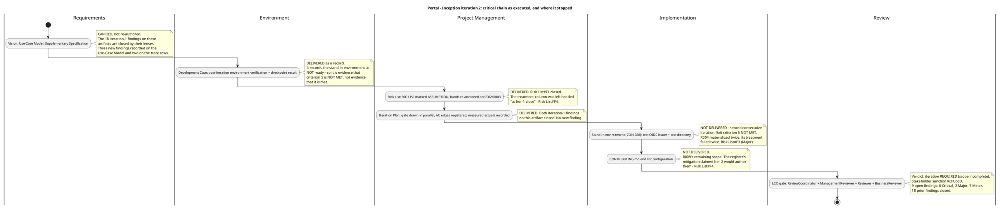
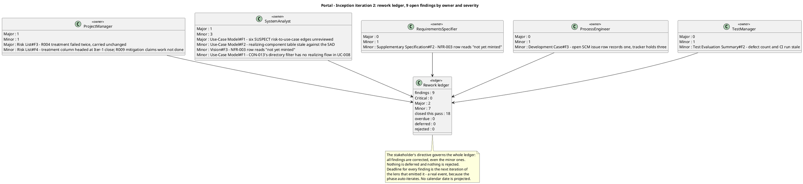

```plantuml
@startsalt
{#
  Metric goal | Metric | Primitive measure | This iteration
  Control the plan: are the iteration exit criteria met? | Iteration exit criteria met | Count of layer (b) criteria verified against evidence | 5 of 6
  Control the plan: are the declared acceptance criteria covered? | Acceptance criteria accounted for | Count of AC-001..AC-006 with a named closing iteration | 6 of 6 accounted, 0 verified
  Control quality: is the baseline fit to carry forward? | Open findings by severity | Count of findings recorded by the three review lenses | 18 - 0 Critical, 4 Major, 14 Minor
  Control quality: is the defect record current? | Open defects | Count of issues in the SCM tracker | 1 - Issue #1
  Forecast the next iteration: replace assumed shares with measured actuals | Agent work spend | Tokens consumed, measured | 6918081
  Forecast the next iteration: replace assumed shares with measured actuals | Agent elapsed time | Elapsed time measured by the system | 8:35:00.7478289
  Bound the human gate: is the gate on the team's path? | Human queue time | Days of queue time waiting for a person | 0:00:00 measured, excluding the end-of-iteration approval gate, which is not measured
  Control the process: is the process configuration exercised? | Agent invocations | Count of agent invocations | 11
  Control the process: is the stakeholder engaged? | Stakeholder interactions | Count of stakeholder interactions | 11
  Control the process: is the artifact set complete? | Artifacts produced | Count of artifacts in the project | 9
  Control quality: is the artifact set fit to carry forward? | Average artifact quality | Mean quality score recorded by the review | 10.0
}
@endsalt
```

## Document Control
- **Phase:** Inception
- **Status:** Draft — iteration 2 close, written after the reviewers ruled
- **Milestone Target:** Lifecycle Objectives (LCO) — end of Inception. NOT YET ACHIEVED.
## Iteration Objectives Reached
This assessment accumulates one entry per iteration. Each entry records the iteration's outcome given the ReviewCoordinator's verdict for that iteration; it does not declare the milestone.

### Iteration 2 — Inception

The ReviewCoordinator's verdict for this iteration is **iteration REQUIRED (scope incomplete)**, and the stakeholder refused the sanction to advance past LCO. This assessment records the iteration's outcome given that verdict. It does not declare the milestone: the LCO verdict is the ReviewCoordinator's and the ManagementReviewer's, and it has been issued.

| # | Planned objective | Verdict | Basis |
|---|---|---|---|
| 1 | Define Project Scope | **Met** | Vision, Use-Case Model and Supplementary Specification carry the declared scope with no creep: nine use cases, one per declared FR-001..FR-009, each citing its source requirement. The trace graph projects 66 roots and 231 nodes with no UNKNOWN LABEL and no leaf at Business level. The three iteration-1 trace-table findings on these artifacts are closed. |
| 2 | Identify Critical Risks | **Met, with a defective basis** | Risk List carries R001..R009 with probability, impact, magnitude, strategy, owner, mitigation and contingency. R001..R003 are preserved with the declared identifiers and magnitudes; team risks are numbered per CON-020; every acceptance cites CON-021. The classification's *basis* remains defective: R001's probability and impact are the analyst's estimates, the stakeholder declined to confirm them, and the High band's lower boundary rests on them. R004 was re-assessed at this close and moved Significant to High on the observed 2-of-2 materialization rate, so the boundary now rests on two unconfirmed figures. |
| 3 | Tailor Development Process | **Met** | Development Case conforms to the IARI baseline: the 25-role roster is unchanged, CORE ownership is unchanged, no artifact outside the CORE + OPTIONAL universe, no role merged. Business Modeling is INACTIVE on the correct trigger (business-process-led = false, all four DC §4 criteria evaluated and none fired). All six OPTIONAL triggers were re-audited against their §5.2 conditions and none fired. |
| 4 | Establish Feasibility | **Met, with the exercisable-environment gap** | The stack is pinned by CON-022/CON-023/CON-024; the OIDC client is already registered (CON-003) so login is testable from day one; the Development Case's Architectural Proof-of-Concept NOT-FIRED verdict holds — no technical unknown requires empirical validation. The gap: feasibility is established on paper and cannot yet be exercised, because the stand-in environment that CON-028 requires for any build or test was not delivered. |

**The iteration's own six objectives, as the Iteration Plan decomposed them.** Four are met, one is met with a defective basis, and one is not met.

| Plan objective | Verdict | Basis |
|---|---|---|
| 1 — Deliver the stand-in environment (CON-028) | **Not met** | No artifact evidences the test OIDC issuer or the test directory. The Development Case's LCO-gate verification records no stand-in configuration. This is LCO exit criterion 5, and it is the second consecutive iteration in which it has failed |
| 2 — Deliver the guideline files the Development Case references | **Not met** | `CONTRIBUTING.md` and the lint configuration are still absent at this close. The CI pipeline builds and tests on `main` (run `36095051721`), so the build half of the objective holds and the guideline half does not |
| 3 — Correct every finding the LCO review recorded, including the minor ones | **Met** | All 18 iteration-1 findings are closed by their originating lenses on evidence read from the corrected artifact. Nothing is deferred and nothing is rejected |
| 4 — Re-anchor the Risk List's magnitude bands on a confirmed basis | **Met, with the basis still unconfirmed** | R001's probability and impact are marked `[ASSUMPTION — requires validation]` in the Risk Register and the Risk Classification section, and the bands are anchored on R002's and R003's declared exposures. The sponsor has not confirmed R001's figures, so the High band's lower boundary remains provisional |
| 5 — Record the iteration's measured spend and elapsed time | **Met** | The measured actuals of Iter-2 are recorded in Test Results below, the two currencies reported apart |
| 6 — Make the plan's exit-criteria verdicts honest at the point of writing | **Met** | Evaluation Criteria layer (b) carries a verdict of MET or NOT MET per criterion, and criterion 5 is recorded as NOT MET with the explicit statement that the LCO gate is not passable until its evidence exists |

**What the iteration did not do, as planned.** It did not implement a use case, did not verify an acceptance criterion, and did not close a milestone. That was the plan's own statement and it held: zero acceptance criteria are verified, and the LCO gate did not open.

**The iteration's central fact.** The one objective the iteration existed to close — the stand-in environment — was not closed, for the second consecutive iteration. The corrective pass on the 18 findings succeeded completely; the environment work did not happen at all. R004 named this exact outcome before the iteration began, and its treatment failed again.

### Iteration 1 — Inception

The ReviewCoordinator's verdict for that iteration was **iteration REQUIRED (scope incomplete)**, and the stakeholder refused the sanction to advance past LCO.

| # | Planned objective | Verdict | Basis |
|---|---|---|---|
| 1 | Define Project Scope | **Met** | Vision, Use-Case Model and Supplementary Specification carry the declared scope with no creep: nine use cases, one per declared FR-001..FR-009, each citing its source requirement. The trace graph projects 47 roots and 150 nodes with no SUSPECT edge and no UNKNOWN LABEL. The Use-Case Model is the one artifact carrying no finding from any lens. |
| 2 | Identify Critical Risks | **Met, with a defective basis** | Risk List carries R001..R009 with probability, impact, magnitude, strategy, owner, mitigation and contingency. R001..R003 are preserved with the declared identifiers and magnitudes; team risks are numbered per CON-020; every acceptance cites CON-021. The classification's *basis* is defective: R001's probability and impact are the analyst's estimates, the stakeholder declined to confirm them, and every magnitude band is derived from them (`Risk List#F1`, Major). |
| 3 | Tailor Development Process | **Met** | Development Case conforms to the IARI baseline: the 25-role roster is unchanged, CORE ownership is unchanged, no artifact outside the CORE + OPTIONAL universe, no role merged. Business Modeling is INACTIVE on the correct trigger (business-process-led = false, all four DC §4 criteria evaluated and none fired). All six OPTIONAL triggers were audited against their §5.2 conditions and none fired. |
| 4 | Establish Feasibility | **Met** | The stack is pinned by CON-022/CON-023/CON-024; the OIDC client is already registered (CON-003) so login is testable from day one; the Development Case's Architectural Proof-of-Concept NOT-FIRED verdict holds — no technical unknown requires empirical validation. |

**The iteration's own six objectives, as the Iteration Plan decomposed them.** Four are met, one is met with a defective basis, and one is not met.

| Plan objective | Verdict | Basis |
|---|---|---|
| 1 — Agreed scope as a named set of use cases | Met | UC-001..UC-009, one per FR-001..FR-009; UC-001, UC-002, UC-008 detailed, the remaining six outlined |
| 2 — Non-functional and business-rule baseline | Met | Supplementary Specification carries NFR-001..NFR-005 and CON-009..CON-019 |
| 3 — Process configuration | Met | Development Case: Business Modeling inactive, no OPTIONAL trigger fired, version policy .NET 10 / PostgreSQL 18 |
| 4 — Initial risks identified and classified | Met, with a defective basis | R001..R009 classified; the magnitude bands rest on an unconfirmed estimate (`Risk List#F1`) |
| 5 — Stand-in environment real (CON-028) | **Not met** | No artifact evidences the test OIDC issuer or the test directory. This is LCO exit criterion 5 and the one criterion the ManagementReviewer records as NOT MET |
| 6 — Build verifiable (CON-026) | Met | The CI pipeline builds and tests on `main`; the build is green. The Development Case's record of it is stale (`Development Case#F1`) |

**What the iteration did not do, as planned.** It did not implement a use case, did not verify an acceptance criterion, and did not close a milestone. That was the plan's own statement and it held: zero acceptance criteria are verified, and the LCO gate did not open.

## Adherence to Plan
This section accumulates one entry per iteration. Each entry records the critical chain as executed, the work items that did not close, and the variance each one produced with its root cause and the adjustment it forces on the next plan.

### Iteration 2 — Inception

The plan's critical chain ran in the order it was written, with one exception: the first work item did not execute, and the chain's remaining items ran without it.

| # | Work item | Owner | Planned evidence | Outcome |
|---|---|---|---|---|
| 1 | Stand-in environment (CON-028): test OIDC issuer and test directory | Implementer, Integrator | A test directory carrying the declared attributes, including entries whose job title or extension is empty; recorded in the Development Case's post-iteration environment verification | **Not delivered.** The Development Case's LCO-gate verification records no stand-in configuration. This is exit criterion 5, failed for the second consecutive iteration |
| 2 | Post-iteration environment verification and iteration-preparation checkpoint | ProcessEngineer | A record taken at the gate, against observable state, for each item the checkpoint names | Delivered. The record exists and states criterion 5 is not met. One Minor finding: the open SCM issue row under-reports the tracker (`Development Case#F3`) |
| 3 | `CONTRIBUTING.md` and lint configuration | SoftwareArchitect, Implementer, TestManager | The guideline files the Development Case references exist | **Not delivered.** Both files are still absent at this close |
| 4 | Risk List: re-anchor the magnitude bands; record R004's treatment state | ProjectManager | R001's P and I marked `[ASSUMPTION — requires validation]`; bands anchored on R002 and R003; R004 recorded as materialized | Delivered. `Risk List#F1` and `Risk List#F2` closed. Two new findings recorded against this artifact: `Risk List#F3` (Major) and `Risk List#F4` (Minor) |
| 5 | Iteration Plan: gate drawn in parallel, AC edges registered, measured actuals recorded | ProjectManager | This artifact | Delivered. Both iteration-1 findings on this artifact closed. No new finding |
| 6 | Traceability reconciliation: Vision, Supplementary Specification, Software Architecture Document | SystemAnalyst, RequirementsSpecifier, SoftwareArchitect | Each trace table names element identifiers and each row is registered as an edge | Delivered. The iteration-1 table defects are closed. Two new `NFR-003` row findings recorded (`Vision#F3`, `Supplementary Specification#F2`) |
| 7 | Test Evaluation Summary: record `Issue #1` as the open defect | TestManager | The three places that assert no issue exists record the defect count as one | Delivered. `Test Evaluation Summary#F1` closed. One new finding: the evidence block is stale on the defect count and the CI run (`Test Evaluation Summary#F2`) |
| 8 | LCO review | ReviewCoordinator, ManagementReviewer, Reviewer, BusinessReviewer | The LCO verdict | Executed. Verdict: iteration REQUIRED; sanction refused; 9 open findings, 18 closed |

**Variance 1 — the stand-in environment was not delivered, for the second consecutive iteration, and the register carried its treatment unchanged.** The plan made the stand-in environment the first work item of the iteration, and it did not execute. R004 named this exact outcome before the iteration began: the stand-in environment is not ready, so no use case can be built or tested and the iteration produces no verifiable increment. The ManagementReviewer records this as `Risk List#F3` (Major): a risk that materialized and whose treatment failed twice is evidence the treatment is not working, and the register carried its magnitude, strategy and mitigation unchanged. **Root cause:** the treatment was a sequencing statement — "the first work item of the iteration" — and sequencing alone had already failed once. A shared owner (Implementer and Integrator jointly) meant no single role was accountable for the delivery. **Adjustment for iteration 3:** R004 is re-assessed at this close — probability raised 3 to 4 on the observed 2-of-2 materialization rate, magnitude Significant to High, owner changed to the Integrator alone, and the treatment replaced by a hard gate: no other work item starts until the stand-in environment is delivered and recorded. The strategy stays Avoid, because CON-021's grant does not reach a risk whose mechanism is the team's own execution. This is not a scope change: the item was already in the declared plan.

**Variance 2 — the register's treatment column was headed at the previous iteration's close.** Every row's treatment evidence was one iteration stale, and R009's mitigation compounded it by claiming the ConfigurationManager and Implementer would author `CONTRIBUTING.md` and the lint configuration "in Iter-2" — work the iteration did not do. The ManagementReviewer records this as `Risk List#F4` (Minor). **Root cause:** the column heading was written when the register was first authored and was not re-headed at close, so the register's own record of treatment state lagged the iteration it described. **Adjustment for iteration 3:** the column is re-headed to the current iteration and every row is refreshed against observable state at this close; R009's remaining scope is recorded as still absent and its mitigation moves to the iteration that will author the files.

**Variance 3 — the guideline files were not delivered, and the plan's own exit criteria named them as evidence.** `CONTRIBUTING.md` and the lint configuration are still absent. The CI half of the objective holds: the pipeline builds and tests on `main` (run `36095051721`). **Root cause:** the work item was sequenced third, behind the stand-in environment, and the environment work consumed the iteration. **Adjustment for iteration 3:** the guideline files are carried as a work item of the next iteration, and R009's mitigation names that iteration rather than the one that has closed.

**Variance 4 — the corrective pass on the 18 findings succeeded completely, and the pass itself generated 9 new findings.** All 18 iteration-1 findings are closed by their originating lenses on evidence read from the corrected artifact. The same review recorded 9 new findings: 0 Critical, 2 Major, 7 Minor. **Root cause:** the new findings cluster on evidence currency — the register's treatment column, the Development Case's issue row, the Test Evaluation Summary's evidence block, and two `NFR-003` trace rows that were not reconciled when the Software Architecture Document registered `NFR-003` → `COMP-002`. The content artifacts are clean or near-clean; the defects are in records that describe state. **Adjustment for iteration 3:** each new finding is corrected in the artifact that owns it, and the two `NFR-003` rows are reconciled against the registered edge.

**Variance 5 — the Use-Case Model carries six unreviewed SUSPECT edges, and the Risk List's changes caused them.** The Risk List changed under the Use-Case Model: R004 is now recorded as materialized and re-assessed, R001's probability and impact are marked `[ASSUMPTION — requires validation]`, and R009 is restated to the guideline files only. The Use-Case Model's constraints-and-risks table does not record any of it, so the edges remain SUSPECT. The Reviewer records this as `Use-Case Model#F1` (Major). **Root cause:** the Risk List's owner declared the change and the Use-Case Model's owner has not yet re-read its end. **Adjustment for iteration 3:** the SystemAnalyst re-reads the Risk List's current R001, R004 and R009 entries, updates the constraints-and-risks table, and declares the change in turn so the SUSPECT edges clear. This is the SystemAnalyst's work, not mine; I record it here because the change originated in my artifact.

**Variance 6 — the iteration's measured spend is recorded, and it is the input to the next plan.** The measured token spend and elapsed time of iteration 2 are recorded in Test Results below. No forecast is invented from a theoretical capacity, and no token budget is set — CON-027 declares none and none is to be set. **Root cause:** none; this is the measurement the plan requires. **Adjustment for iteration 3:** the coarse roadmap is re-planned from the measured actuals of both closed Inception iterations, and the fine plan is built only for the next iteration.

**No declared scope was cut or deferred.** CON-027 forbids it, and the remedy for an incomplete iteration is another iteration. The stakeholder's directive is that all findings are corrected, including the minor ones; nothing in the 9-finding ledger is deferred and nothing is rejected. No agent role is added to the next iteration as a remedy: adding roles increases coordination overhead without proportional benefit, and the lever here is the iteration, not the parallelism.

### Iteration 1 — Inception

The plan's critical chain ran in the order it was written. Two of its nine work items did not close, and both are environment work.

| # | Work item | Owner | Planned evidence | Outcome |
|---|---|---|---|---|
| 1 | Requirements baseline | SystemAnalyst, RequirementsSpecifier | UC-001..UC-009 traced to FR-001..FR-009 | Delivered. One Minor finding on the Supplementary Specification's trace table |
| 2 | Process configuration | ProcessEngineer | Business Modeling inactive; no OPTIONAL trigger fired; version policy recorded | Delivered. Three findings: one Major (the readiness table is not milestone evidence) and two Minor |
| 3 | Risk List | ProjectManager | R001..R009 with P, I, magnitude, strategy, owner, mitigation, contingency | Delivered. One Major (the magnitude bands rest on an unconfirmed estimate) and two Minor |
| 4 | Iteration Plan | ProjectManager | This artifact | Delivered. One Major (exit criterion 5 not evidenced) and three Minor |
| 5 | Preliminary architecture and analysis classes | SoftwareArchitect, Designer | SAD sketch; analysis classes for UC-001, UC-002, UC-008 | Delivered. Two Minor findings |
| 6 | Stand-in environment (CON-028) | Implementer, Integrator | A test directory carrying the declared attributes, including entries whose job title or extension is empty | **Not delivered.** No artifact evidences it. This is exit criterion 5 |
| 7 | CI pipeline definition (CON-026) | ConfigurationManager, Implementer | A pipeline definition that builds and tests on the hosted provider's CI | Delivered. The build on `main` is green |
| 8 | `CONTRIBUTING.md` and lint configuration | SoftwareArchitect, Implementer, TestManager | The guideline files the Development Case references exist | **Not evidenced.** The Development Case records both absent |
| 9 | LCO review | ReviewCoordinator, ManagementReviewer, Reviewer | The LCO verdict | Executed. Verdict: iteration REQUIRED; sanction refused |

**Variance 1 — the stand-in environment was not delivered, and the plan did not say so.** The plan's fine plan made the LCO review (work item 9) depend on work items 1..8, and work item 6 is the stand-in environment. The plan's Evaluation Criteria layer (b) listed criterion 5 as an open item and stated that criteria 5 and 6 "are the two items that can still fail this iteration" — but it left the criterion listed as an open item while the milestone verdict was taken. The ManagementReviewer records this as `Iteration Plan#F1` (Major): the criterion that gates every use case is not evidenced, and the plan did not state that the gate was therefore not passable. **Root cause:** the plan treated an unexecuted work item as an open item rather than as a failed exit criterion. **Adjustment for iteration 2:** the Iteration Plan's Evaluation Criteria section states each exit criterion's verdict as met or not met at the point the plan is written, and a criterion whose evidence does not exist is recorded as NOT MET, not as open.

**Variance 2 — the plan recorded no measured spend for the iteration it planned.** The plan's "Two currencies, reported apart" section stated the agent-work row as "Not yet measured — no phase has closed". That is correct for a forecast and wrong for a record: at the LCO gate the iteration has run, and CON-027 requires each iteration's measured spend to be recorded and used to forecast the next. The ManagementReviewer records this as `Iteration Plan#F2` (Minor). **Root cause:** the plan was written before the iteration ran and was never updated at close. **Adjustment for iteration 2:** the measured spend and elapsed time of iteration 1 are recorded in this assessment and are the input to the iteration 2 plan; the plan's own currency table carries the measured actual of the iteration that closed.

**Variance 3 — the plan's gantt put the human gate on the critical path.** The roadmap gantt serialized the CON-028 human validation gate ahead of Iter-3, while the plan's own text states the opposite: the team's work does not wait on the gate and every use case is built and tested against the stand-ins. The Reviewer records this as `Iteration Plan#F1` (Minor). **Root cause:** the diagram was drawn as a sequence of events rather than as the parallel tracks the discipline describes. **Adjustment for iteration 2:** the gate is drawn in parallel with Iter-2 and Iter-3.

**Variance 4 — the plan's acceptance-criterion coverage existed only as prose.** The Evaluation Criteria table accounted for all six acceptance criteria and deferred each to a named iteration, but only AC-001 and AC-006 carried a registered trace edge. AC-002, AC-003, AC-004 and AC-005 had no outgoing edge. The Reviewer records this as `Iteration Plan#F2` (Minor). **Root cause:** the table was written as a disposition list and the edges were never registered. **Adjustment for iteration 2:** the missing edges are registered — AC-002 and AC-005 to UC-001, AC-003 to UC-005, AC-004 to UC-008.

**Variance 5 — the Test Evaluation Summary's evidence block contradicted observable SCM state.** The artifact asserted in three places that the SCM issue tracker holds no issues. The tracker holds `Issue #1`, labelled `severity:minor`, `nature:defect`, `configuration-record`. The Reviewer records this as `Test Evaluation Summary#F1` (Major). The same evidence block cited CI run `36049582928` while the build on `main` observed at this close is run `36050451436`. **Root cause:** the evidence block was not refreshed against the tracker and the CI before the artifact was submitted to review. **Adjustment for iteration 2:** the Test Evaluation Summary records `Issue #1` as the open defect and states the defect count as one; its evidence block is refreshed against the tracker and the CI at the point of submission.

**Variance 6 — the Risk List's magnitude bands rest on an unconfirmed estimate.** The Risk Classification section called R001 "the highest declared exposure" and anchored every band on it, while R001's own text records that its probability and impact are the analyst's estimates and not values the stakeholder stated. The stakeholder was asked to confirm them and declined. The ManagementReviewer records this as `Risk List#F1` (Major). **Root cause:** the bands were anchored on a figure whose provenance the register itself flagged, and the flag was not carried into the classification. **Adjustment for iteration 2:** R001's probability and impact are marked `[ASSUMPTION — requires validation]` in both the Risk Register and the Risk Classification section, the bands are stated as provisional, and the confirmation is re-asked of the sponsor.

**Variance 7 — the Development Case's readiness table was presented as milestone evidence.** The table is explicitly a pre-iteration snapshot ("Verified before the iteration starts") and records the stand-in OIDC issuer and stand-in directory as not ready. It is also stale on its own CI row, recording the pipeline as absent while the pipeline builds green on `main`. The ManagementReviewer records this as `Development Case#F1` (Major). **Root cause:** a planning record was left in place as the gate's evidence. **Adjustment for iteration 2:** a post-iteration environment verification records the actual state of each item at the gate, with observed evidence; the pre-iteration table stays as the plan it is.

**Variance 8 — the Development Case's own checkpoint was never exercised as a record.** The Development Case defines an iteration-preparation checkpoint requiring the Process Engineer to confirm the CI pipeline, the stand-in environment and the optional triggers before each iteration, and records no checkpoint result for the iteration that ran. The ManagementReviewer records this as `Development Case#F2` (Minor). **Root cause:** the checkpoint was defined as a stated intention rather than as a record. **Adjustment for iteration 2:** the checkpoint result for iteration 2 is recorded with the observed state of each item it names.

**Variance 9 — R004's treatment is unverified and its mitigation claims a verification that did not happen.** R004 is the risk the register itself identifies as gating every test, and it is the only risk whose treatment this iteration was scoped to execute. Its mitigation claims that "the Development Case's iteration preparation checkpoint verifies it"; the checkpoint record does not exist and the stand-in environment is not evidenced. The ManagementReviewer records this as `Risk List#F2` (Minor). **Root cause:** the mitigation named a control that was never exercised. **Adjustment for iteration 2:** R004's treatment state is recorded against the observed stand-in environment, and its mitigation names a control that produces a record.

**Variance 10 — R009's premise is partly retired.** R009 states that the CI pipeline definition and the guideline files are not in place, so the first build cannot be verified. The pipeline exists and builds green on `main`. The Reviewer records this as `Risk List#F1` (Minor). **Root cause:** the risk was written before the pipeline was authored and was not restated. **Adjustment for iteration 2:** R009 is restated to cover only the guideline files that are genuinely absent, with the CI half recorded as retired against the observed run.

**Variance 11 — three artifacts' traceability tables declare edges the graph does not carry.** The Vision, the Supplementary Specification and the Software Architecture Document name document sections in their Traces To columns rather than element identifiers, so those rows register no edge; the SAD additionally lists UC-001 on both sides of its COMP-003 row. The Reviewer records these as `Vision#F1`, `Supplementary Specification#F1` and `Software Architecture Document#F1` (Minor). **Root cause:** the tables were written as narrative disposition lists and were never reconciled with the registered graph. **Adjustment for iteration 2:** each table names element identifiers, and each row is registered as an edge.

**Variance 12 — two diagrams of one boundary disagree, and the clocking model contradicts CON-012.** The Vision's boundary diagram draws Keycloak to UC-001 only while the Use-Case Model draws it to all nine; the SAD's class diagram gives `Clocking` mutable time fields against CON-012's rule that the original record is never overwritten in place, and does not name the rule the export applies when a day carries a correction. The Reviewer records these as `Vision#F2` and `Software Architecture Document#F2` (Minor). **Root cause:** the diagrams were drawn independently of the artifacts they depict. **Adjustment for iteration 2:** the boundary diagrams are aligned, and the SAD states the clocking time fields as immutable and names the export's correction-resolution rule.

**Variance 13 — the Vision asserts a verification path for BG-003 that does not exist.** The Problem Statement's Success criteria row states that BG-001, BG-002 and BG-003 are "Verified through AC-001..AC-006". BG-003 is 80% employee adoption within 3 months, and AC-005 — the criterion that carries it — is an adoption measure taken with real employees after go-live, which no test the team runs can close. The ManagementReviewer records this as `Vision#F1` (Minor). **Root cause:** one verification path was asserted for three goals with different measurement bases. **Adjustment for iteration 2:** the verification path is stated per goal, with BG-003 measured with STK-004 after go-live.

**Variance 14 — the Development Case's Environment intensity row states a recurrence pattern where the canonical matrix states a level.** The Reviewer records this as `Development Case#F2` (Minor). **Root cause:** the delta column carried narrative where the matrix carries a level. **Adjustment for iteration 2:** the row states the level per phase and the recurrence narrative moves to the Environment discipline section.

**Variance 15 — the iteration's own measured spend was not recorded anywhere.** This is the variance this assessment closes: the measured token spend and elapsed time of iteration 1 are recorded in Test Results below, and they are the input to the iteration 2 plan. No forecast is invented from a theoretical capacity, and no token budget is set — CON-027 declares none and none is to be set.

**Variance 16 — the iteration's exit criterion 5 failed, and the plan's own risk register predicted it.** R004 named exactly this outcome: the stand-in environment is not ready, so no use case can be built or tested and the iteration produces no verifiable increment. The risk was classified Significant with strategy Avoid and its mitigation was "the stand-in environment is the first construction item of iteration 1". The mitigation was not executed. **Root cause:** the work item was sequenced first in the plan and was not executed at all; the plan's ordering was correct and its execution was not. **Adjustment for iteration 2:** the stand-in environment is the first work item of iteration 2 and its delivery is evidenced in the artifact that owns it before any use case work begins. This is not a scope change: the item was already in the declared plan.

**No declared scope was cut or deferred.** CON-027 forbids it, and the remedy for an incomplete iteration is another iteration. The stakeholder's directive is that all findings are corrected, including the minor ones; nothing in the 18-finding ledger is deferred and nothing is rejected.

## Use Cases and Scenarios Implemented
This section accumulates one entry per iteration, recording which use cases the iteration carried and whether any was implemented.

### Iteration 2 — Inception

**None.** No use case is implemented, no scenario is executed and no acceptance criterion is verified. This is the plan's own statement of what Inception does, and it held.

| UC | Name | This iteration | Scenarios carried | Implemented |
|---|---|---|---|---|
| UC-001 | Clock In and Clock Out | Specification carried; to be exercised against the stand-in OIDC issuer | Main flow; A1 network unavailable (AC-006); A2 pair already complete (CON-011); A3 open at midnight (CON-010); A4 HR views all clockings | No |
| UC-002 | Export Monthly Clocking Report | Specification carried; to be exercised against the stand-in directory | Main flow; A1 day with no clocking; A2 missing clock-out; A3 corrected day; A4 no worker category (CON-015); A5 blank FullName (R002) | No |
| UC-003 | Correct or Insert a Clocking | Outline | A1 no reason supplied; A2 no self-service correction | No |
| UC-004 | Read Internal News | Outline | A1 no item featured (CON-009); A2 network unavailable | No |
| UC-005 | Publish News | Outline | A1 featuring un-features the previous (CON-009); A2 featuring is never automatic | No |
| UC-006 | Edit Published News | Outline | A1 featured-flag change (CON-009) | No |
| UC-007 | Unpublish News | Outline | A1 the featured item is un-featured; A2 no hard delete (CON-017) | No |
| UC-008 | Search Employee Directory | Specification carried; to be exercised against the stand-in directory | Main flow; A1 empty job title or extension (R002); A2 no category (CON-015); A3 network unavailable; A4 no match | No |
| UC-009 | Assign or Clear Worker Category | Outline | A1 category cleared (CON-015); A2 fifth value refused (CON-014); A3 no employee field is editable (CON-005) | No |

**The consequence of the unmet exit criterion.** UC-001, UC-002 and UC-008 are the three architecturally significant use cases and the three the plan scoped into this iteration as full specifications. CON-028 forbids building or testing against the real Keycloak or the real AD, so with no stand-in environment none of the three can be built or tested, and R004 — the risk the register itself calls the one that gates all testing — remains untreated for the second consecutive iteration. The specification work is complete; the environment that would let it be exercised does not exist.

### Iteration 1 — Inception

**None.** No use case is implemented, no scenario is executed and no acceptance criterion is verified. This is the plan's own statement of what Inception does, and it held.

| UC | Name | This iteration | Scenarios carried | Implemented |
|---|---|---|---|---|
| UC-001 | Clock In and Clock Out | Full specification | Main flow; A1 network unavailable (AC-006); A2 pair already complete (CON-011); A3 open at midnight (CON-010); A4 HR views all clockings | No |
| UC-002 | Export Monthly Clocking Report | Full specification | Main flow; A1 day with no clocking; A2 missing clock-out; A3 corrected day; A4 no worker category (CON-015); A5 blank FullName (R002) | No |
| UC-003 | Correct or Insert a Clocking | Outline | A1 no reason supplied; A2 no self-service correction | No |
| UC-004 | Read Internal News | Outline | A1 no item featured (CON-009); A2 network unavailable | No |
| UC-005 | Publish News | Outline | A1 featuring un-features the previous (CON-009); A2 featuring is never automatic | No |
| UC-006 | Edit Published News | Outline | A1 featured-flag change (CON-009) | No |
| UC-007 | Unpublish News | Outline | A1 the featured item is un-featured; A2 no hard delete (CON-017) | No |
| UC-008 | Search Employee Directory | Full specification | Main flow; A1 empty job title or extension (R002); A2 no category (CON-015); A3 network unavailable; A4 no match | No |
| UC-009 | Assign or Clear Worker Category | Outline | A1 category cleared (CON-015); A2 fifth value refused (CON-014); A3 no employee field is editable (CON-005) | No |

**The consequence of the unmet exit criterion.** UC-001, UC-002 and UC-008 are the three architecturally significant use cases and the three the plan scoped into iteration 1 as full specifications. CON-028 forbids building or testing against the real Keycloak or the real AD, so with no stand-in environment none of the three can be built or tested, and R004 — the risk the register itself calls the one that gates all testing — remains untreated. The specification work is complete; the environment that would let it be exercised does not exist.

## Results Relative to Evaluation Criteria
### Layer (a) — every declared acceptance criterion, one line each

| AC | Criterion | Verdict this iteration | Evidence |
|---|---|---|---|
| AC-001 | Full page load as the employee experiences it, including the clocking page's script, under 3 seconds | Not addressed this iteration — deferred to Iter-4 | No page exists. The criterion is accounted for in the Iteration Plan and carries a registered trace edge |
| AC-002 | An employee can clock in and out without help from HR or the development team | Not addressed this iteration — deferred to Iter-4 | No increment exists. The criterion is accounted for in the plan; its trace edge is not registered (`Iteration Plan#F2`) |
| AC-003 | An HR Administrator can publish a news item without technical assistance | Not addressed this iteration — deferred to Iter-4 | No increment exists. The criterion is accounted for in the plan; its trace edge is not registered (`Iteration Plan#F2`) |
| AC-004 | Any employee finds a colleague's phone/email in under 10 seconds | Not addressed this iteration — deferred to Iter-5 | No increment exists. The criterion is accounted for in the plan; its trace edge is not registered (`Iteration Plan#F2`) |
| AC-005 | 80% of employees complete at least one clocking with no prior training | Not addressed this iteration — deferred to Iter-6, and not closable by any test the team runs | An adoption measure taken with real employees after go-live. The Test Evaluation Summary states no test the team runs can close it; the Vision's assertion that AC-001..AC-006 verify it is `Vision#F1` |
| AC-006 | A clocking made while the corporate network is down for up to 5 minutes is not lost | Not addressed this iteration — deferred to Iter-4 | No increment exists. The criterion is carried by UC-001, which this iteration specified in full |

**No acceptance criterion is verified, and none was expected to be.** Inception produces a baseline, not a running system. All six are accounted for in the Iteration Plan and each is deferred to the iteration whose increment closes it.

### Layer (b) — this iteration's own exit criteria, one line each

| # | Exit criterion | Verdict | Evidence |
|---|---|---|---|
| 1 | Stakeholders agree on the scope | **Met** | Vision and Use-Case Model carry the declared scope with no creep; nine use cases, one per FR-001..FR-009; trace graph 47 roots, 150 nodes, no SUSPECT, no UNKNOWN LABEL |
| 2 | The project is viable | **Met** | Stack pinned by CON-022/CON-023/CON-024; the OIDC client is already registered (CON-003); the Architectural Proof-of-Concept NOT-FIRED verdict holds |
| 3 | Initial risks identified and classified | **Met, with a defective basis** | R001..R009 classified with P, I, magnitude, strategy, owner, mitigation, contingency. The bands rest on R001's unconfirmed estimate (`Risk List#F1`, Major) |
| 4 | The process configuration governs the project | **Met** | Development Case conforms to the IARI baseline; Business Modeling INACTIVE on the correct trigger; all six OPTIONAL triggers audited, none fired |
| 5 | The stand-in environment is available (CON-028) | **NOT MET** | No artifact evidences the test OIDC issuer or the test directory. The only record is the Development Case's pre-iteration readiness table, which is stale on its own CI row (`Development Case#F1`, Major) |
| 6 | The build is verifiable (CON-026) | **Met** | The CI pipeline builds and tests on `main`; the build is green. The Development Case's record of this criterion is stale (`Development Case#F1`) |

**Five of six met; criterion 5 is not met.** Criterion 5 is the criterion that gates every use case, and it is the one the ManagementReviewer records as NOT MET. The ReviewCoordinator's verdict — iteration REQUIRED, scope incomplete — is grounded in it, together with the four open Major findings and the stakeholder's refusal.

### Iteration 2 — Inception

#### Layer (a) — every declared acceptance criterion, one line each

| AC | Criterion | Verdict this iteration | Evidence |
|---|---|---|---|
| AC-001 | Full page load as the employee experiences it, including the clocking page's script, under 3 seconds | Not addressed this iteration — deferred to Iter-4 | No page exists. The criterion is accounted for in the Iteration Plan and carries a registered trace edge |
| AC-002 | An employee can clock in and out without help from HR or the development team | Not addressed this iteration — deferred to Iter-4 | No increment exists. The criterion is accounted for in the plan and its trace edge is registered |
| AC-003 | An HR Administrator can publish a news item without technical assistance | Not addressed this iteration — deferred to Iter-4 | No increment exists. The criterion is accounted for in the plan and its trace edge is registered |
| AC-004 | Any employee finds a colleague's phone/email in under 10 seconds | Not addressed this iteration — deferred to Iter-5 | No increment exists. The criterion is accounted for in the plan and its trace edge is registered |
| AC-005 | 80% of employees complete at least one clocking with no prior training | Not addressed this iteration — deferred to Iter-6, and not closable by any test the team runs | An adoption measure taken with real employees after go-live. The Test Evaluation Summary states no test the team runs can close it; the Vision now states the verification path per goal |
| AC-006 | A clocking made while the corporate network is down for up to 5 minutes is not lost | Not addressed this iteration — deferred to Iter-4 | No increment exists. The criterion is carried by UC-001, which this iteration carried as a full specification |

**No acceptance criterion is verified, and none was expected to be.** Inception produces a baseline, not a running system. All six are accounted for in the Iteration Plan and each is deferred to the iteration whose increment closes it. The four missing trace edges the Reviewer recorded at iteration 1 are now registered.

#### Layer (b) — this iteration's own exit criteria, one line each

| # | Exit criterion | Verdict | Evidence |
|---|---|---|---|
| 1 | Stakeholders agree on the scope | **Met** | Vision and Use-Case Model carry the declared scope with no creep; nine use cases, one per FR-001..FR-009; trace graph 66 roots, 231 nodes, no UNKNOWN LABEL, no leaf at Business level |
| 2 | The project is viable | **Met** | Stack pinned by CON-022/CON-023/CON-024; the OIDC client is already registered (CON-003); the Architectural Proof-of-Concept NOT-FIRED verdict holds |
| 3 | Initial risks identified and classified | **Met, with a defective basis** | R001..R009 classified with P, I, magnitude, strategy, owner, mitigation, contingency. The High band's lower boundary rests on R001's unconfirmed estimate and on R004's re-assessed exposure, neither stakeholder-confirmed |
| 4 | The process configuration governs the project | **Met** | Development Case conforms to the IARI baseline; Business Modeling INACTIVE on the correct trigger; all six OPTIONAL triggers re-audited, none fired |
| 5 | The stand-in environment is available (CON-028) | **NOT MET** | No artifact evidences the test OIDC issuer or the test directory. The Development Case's LCO-gate verification records no stand-in configuration. This is the second consecutive iteration in which the criterion has failed |
| 6 | The build is verifiable (CON-026) | **Met** | The CI pipeline builds and tests on `main`; the build is green (run `36095051721`) |

**Five of six met; criterion 5 is not met, for the second consecutive iteration.** Criterion 5 is the criterion that gates every use case, and it is the one the ManagementReviewer records as NOT MET. The ReviewCoordinator's verdict — iteration REQUIRED, scope incomplete — is grounded in it, together with the two open Major findings and the stakeholder's refusal.

```plantuml
@startuml IA_Iter2_ExitCriteria
title Portal - Inception iteration 2: exit criteria and phase objectives, verdict at close
skinparam classAttributeIconSize 0

class "C1 Stakeholders agree on the scope" as C1 <<criterion>> {
  verdict : MET
  evidence : Vision, Use-Case Model, Supplementary Specification
}
class "C2 The project is viable" as C2 <<criterion>> {
  verdict : MET
  evidence : stack pinned CON-022/023/024; OIDC client registered CON-003
}
class "C3 Initial risks identified and classified" as C3 <<criterion>> {
  verdict : MET
  evidence : R001..R009 with P, I, magnitude, strategy, owner
}
class "C4 The process configuration governs" as C4 <<criterion>> {
  verdict : MET
  evidence : Development Case conforms; BM inactive; 6 OPTIONAL triggers audited
}
class "C5 Stand-in environment available (CON-028)" as C5 <<criterion>> {
  verdict : NOT MET
  evidence : no artifact evidences the test OIDC issuer or test directory
}
class "C6 The build is verifiable (CON-026)" as C6 <<criterion>> {
  verdict : MET
  evidence : run 36095051721 on main is green
}

class "Phase objective 1 Define Project Scope" as O1 <<objective>> {
  verdict : MET
}
class "Phase objective 2 Identify Critical Risks" as O2 <<objective>> {
  verdict : MET, with a defective basis
}
class "Phase objective 3 Tailor Development Process" as O3 <<objective>> {
  verdict : MET
}
class "Phase objective 4 Establish Feasibility" as O4 <<objective>> {
  verdict : MET, with the exercisable-environment gap
}

class "Iteration outcome" as OUT <<verdict>> {
  verdict : iteration REQUIRED (scope incomplete)
  sanction : REFUSED by the stakeholder
  exit criteria met : 5 of 6
  open findings : 9 - 0 Critical, 2 Major, 7 Minor
  prior findings closed : 18 of 18
}

C1 --> OUT
C2 --> OUT
C3 --> OUT
C4 --> OUT
C5 --> OUT
C6 --> OUT
O1 --> OUT
O2 --> OUT
O3 --> OUT
O4 --> OUT

note bottom of C5
  C5 is the one criterion not met, for the second
  consecutive iteration. It is the criterion that gates
  every use case: CON-028 forbids building or testing
  against the real Keycloak or the real AD, so with no
  stand-in no use case can be built or tested.
end note
note bottom of OUT
  The verdict is the ReviewCoordinator's and the
  ManagementReviewer's, and it has been issued. This
  assessment records the outcome given it; it does not
  declare the milestone.
end note
@enduml
```

### Iteration 1 — Inception

#### Layer (a) — every declared acceptance criterion, one line each

| AC | Criterion | Verdict this iteration | Evidence |
|---|---|---|---|
| AC-001 | Full page load as the employee experiences it, including the clocking page's script, under 3 seconds | Not addressed this iteration — deferred to Iter-4 | No page exists. The criterion is accounted for in the Iteration Plan and carries a registered trace edge |
| AC-002 | An employee can clock in and out without help from HR or the development team | Not addressed this iteration — deferred to Iter-4 | No increment exists. The criterion is accounted for in the plan; its trace edge is not registered (`Iteration Plan#F2`) |
| AC-003 | An HR Administrator can publish a news item without technical assistance | Not addressed this iteration — deferred to Iter-4 | No increment exists. The criterion is accounted for in the plan; its trace edge is not registered (`Iteration Plan#F2`) |
| AC-004 | Any employee finds a colleague's phone/email in under 10 seconds | Not addressed this iteration — deferred to Iter-5 | No increment exists. The criterion is accounted for in the plan; its trace edge is not registered (`Iteration Plan#F2`) |
| AC-005 | 80% of employees complete at least one clocking with no prior training | Not addressed this iteration — deferred to Iter-6, and not closable by any test the team runs | An adoption measure taken with real employees after go-live. The Test Evaluation Summary states no test the team runs can close it; the Vision's assertion that AC-001..AC-006 verify it is `Vision#F1` |
| AC-006 | A clocking made while the corporate network is down for up to 5 minutes is not lost | Not addressed this iteration — deferred to Iter-4 | No increment exists. The criterion is carried by UC-001, which this iteration specified in full |

**No acceptance criterion is verified, and none was expected to be.** Inception produces a baseline, not a running system. All six are accounted for in the Iteration Plan and each is deferred to the iteration whose increment closes it.

#### Layer (b) — this iteration's own exit criteria, one line each

| # | Exit criterion | Verdict | Evidence |
|---|---|---|---|
| 1 | Stakeholders agree on the scope | **Met** | Vision and Use-Case Model carry the declared scope with no creep; nine use cases, one per FR-001..FR-009; trace graph 47 roots, 150 nodes, no SUSPECT, no UNKNOWN LABEL |
| 2 | The project is viable | **Met** | Stack pinned by CON-022/CON-023/CON-024; the OIDC client is already registered (CON-003); the Architectural Proof-of-Concept NOT-FIRED verdict holds |
| 3 | Initial risks identified and classified | **Met, with a defective basis** | R001..R009 classified with P, I, magnitude, strategy, owner, mitigation, contingency. The bands rest on R001's unconfirmed estimate (`Risk List#F1`, Major) |
| 4 | The process configuration governs the project | **Met** | Development Case conforms to the IARI baseline; Business Modeling INACTIVE on the correct trigger; all six OPTIONAL triggers audited, none fired |
| 5 | The stand-in environment is available (CON-028) | **NOT MET** | No artifact evidences the test OIDC issuer or the test directory. The only record is the Development Case's pre-iteration readiness table, which is stale on its own CI row (`Development Case#F1`, Major) |
| 6 | The build is verifiable (CON-026) | **Met** | The CI pipeline builds and tests on `main`; the build is green. The Development Case's record of this criterion is stale (`Development Case#F1`) |

**Five of six met; criterion 5 is not met.** Criterion 5 is the criterion that gates every use case, and it is the one the ManagementReviewer records as NOT MET. The ReviewCoordinator's verdict — iteration REQUIRED, scope incomplete — is grounded in it, together with the four open Major findings and the stakeholder's refusal.

## Test Results
**No test was executed this iteration.** No use case is implemented, no Test Case has been authored and no stand-in environment exists, so no acceptance criterion is verifiable. The Test Evaluation Summary states this and it holds.

| Evidence | Source | Value |
|---|---|---|
| CI build on `main` | `scm_get_build_status` | success — run `36050451436`, 2026-09-24 |
| Open defects | SCM issue tracker | 1 — `Issue #1` |
| Test Cases authored | Test Case artifact | none — the artifact is not yet produced |
| Stand-in OIDC issuer and stand-in directory | CON-028 | not built — R004's treatment unexecuted |
| Executed test results | — | none — no use case is implemented |

**Variance against the Test Evaluation Summary.** The artifact asserts in three places that the SCM issue tracker holds no issues. The tracker holds `Issue #1`, labelled `severity:minor`, `nature:defect`, `configuration-record`. The claim is false against observable SCM state and is recorded as `Test Evaluation Summary#F1` (Major). The artifact's evidence block also cites CI run `36049582928` while the build observed at this close is run `36050451436`; both are corrected by the same remediation.

**Measured spend and elapsed time — the iteration's actuals.** These are the two quantities this system measures, and they are the input to the iteration 2 plan. No forecast is invented from a theoretical capacity, and no token budget is set: CON-027 declares none and none is to be set.

| Currency | Measured this iteration | Basis |
|---|---|---|
| Agent work — tokens | 6,918,081 | Measured token spend for Inception iteration 1 |
| Agent work — elapsed time | 8:35:00.7478289 | Elapsed agent time measured by the system |
| Human gate — queue time | 0:00:00 | Days of queue time waiting for a person. This excludes the end-of-iteration approval gate, which is not measured |

The two currencies are reported apart and are never summed into one figure and never converted into one another. The human-gate figure is queue time, not work.

**Metrics, each with the decision it enables.** Every metric below is included because a decision depends on it; none is included because it is available.

**What the metrics do not support.** Defect density per page or per KLOC is not computable: page counts and lines of code are not measured by this system, and no code exists. Defect removal efficiency is not computable: it compares defects found in review against defects found in test, and no test has executed. Rework effort is not measurable in this system's units: hours are not a unit this system produces, and the corrective obligation is the 18 findings, each with an owner and a deadline. No figure is stated for any of the three.

### Iteration 2 — Inception

**No test was executed this iteration.** No use case is implemented, no Test Case has been authored and no stand-in environment exists, so no acceptance criterion is verifiable. The Test Evaluation Summary states this and it holds.

| Evidence | Source | Value |
|---|---|---|
| CI build on `main` | `scm_get_build_status` | success — run `36095051721`, 2026-09-25 |
| Open defects | SCM issue tracker | 3 — `Issue #1`, `Issue #2`, `Issue #3` |
| Test Cases authored | Test Case artifact | none — the artifact is not yet produced |
| Stand-in OIDC issuer and stand-in directory | CON-028 | not built — R004's treatment failed for the second consecutive iteration |
| Executed test results | — | none — no use case is implemented |

**Variance against the Test Evaluation Summary.** The artifact's evidence block records two open defects (`Issue #1`, `Issue #2`) and cites CI run `36094575395`, while the tracker holds three and the build observed at this close is run `36095051721`. The Reviewer records this as `Test Evaluation Summary#F2` (Minor). The three places that carry the count — the Test Summary evidence table, the Defects and Incidents section and the Conclusions table — must agree with the tracker.

**Measured spend and elapsed time — the iteration's actuals.** These are the two quantities this system measures, and they are the input to the iteration 3 plan. No forecast is invented from a theoretical capacity, and no token budget is set: CON-027 declares none and none is to be set.

| Currency | Measured this iteration | Basis |
|---|---|---|
| Agent work — tokens | 12,066,256 | Measured token spend for Inception iteration 2 |
| Agent work — elapsed time | 2:03:51.5597976 | Elapsed agent time measured by the system |
| Human gate — queue time | 0:00:00 | Days of queue time waiting for a person. This excludes the end-of-iteration approval gate, which is not measured |

The two currencies are reported apart and are never summed into one figure and never converted into one another. The human-gate figure is queue time, not work.

**The measured shape, against the assumed one.** Iteration 2 spent 12,066,256 tokens against iteration 1's 6,918,081 — 1.74 times the spend — while its elapsed agent time fell from 8:35:00.7478289 to 2:03:51.5597976. The spend rose because the iteration read the accumulated artifact surface and re-read it to close 18 findings; the elapsed time fell because the work was corrective rather than generative. This is the measured shape, and it replaces every assumed share in the forecast for iteration 3. It does not resemble the rubber profile's assumed distribution, and the measured shape wins.

**Metrics, each with the decision it enables.** Every metric below is included because a decision depends on it; none is included because it is available.

```plantuml
@startsalt
{#
  Metric goal | Metric | Primitive measure | This iteration
  Control the plan: are the iteration exit criteria met? | Iteration exit criteria met | Count of layer (b) criteria verified against evidence | 5 of 6
  Control the plan: is the criterion that gates every use case met? | Stand-in environment available | Count of artifacts evidencing the test OIDC issuer and test directory | 0 - second consecutive iteration
  Control the plan: are the declared acceptance criteria covered? | Acceptance criteria accounted for | Count of AC-001..AC-006 with a named closing iteration | 6 of 6 accounted, 0 verified
  Control quality: is the baseline fit to carry forward? | Open findings by severity | Count of findings recorded by the four review lenses | 9 - 0 Critical, 2 Major, 7 Minor
  Control quality: did the corrective pass work? | Prior findings closed | Count of iteration-1 findings closed by their originating lens | 18 of 18
  Control quality: is the defect record current? | Open defects | Count of issues in the SCM tracker | 3 - Issue #1, Issue #2, Issue #3
  Forecast the next iteration: replace assumed shares with measured actuals | Agent work spend | Tokens consumed, measured | 12066256
  Forecast the next iteration: replace assumed shares with measured actuals | Agent elapsed time | Elapsed time measured by the system | 2:03:51.5597976
  Bound the human gate: is the gate on the team's path? | Human queue time | Days of queue time waiting for a person | 0:00:00 measured, excluding the end-of-iteration approval gate, which is not measured
  Control the process: is the process configuration exercised? | Agent invocations | Count of agent invocations | 11
  Control the process: is the stakeholder engaged? | Stakeholder interactions | Count of stakeholder interactions | 11
  Control the process: is the artifact set complete? | Artifacts produced | Count of artifacts in the project | 10
  Control quality: is the artifact set fit to carry forward? | Average artifact quality | Mean quality score recorded by the review | 9.9
}
@endsalt
```

**What the metrics do not support.** Defect density per page or per KLOC is not computable: page counts and lines of code are not measured by this system, and no code exists. Defect removal efficiency is not computable: it compares defects found in review against defects found in test, and no test has executed. Rework effort is not measurable in this system's units: hours are not a unit this system produces, and the corrective obligation is the 9 findings, each with an owner and a deadline. No figure is stated for any of the three.

### Iteration 1 — Inception

**No test was executed this iteration.** No use case is implemented, no Test Case has been authored and no stand-in environment exists, so no acceptance criterion is verifiable. The Test Evaluation Summary states this and it holds.

| Evidence | Source | Value |
|---|---|---|
| CI build on `main` | `scm_get_build_status` | success — run `36050451436`, 2026-09-24 |
| Open defects | SCM issue tracker | 1 — `Issue #1` |
| Test Cases authored | Test Case artifact | none — the artifact is not yet produced |
| Stand-in OIDC issuer and stand-in directory | CON-028 | not built — R004's treatment unexecuted |
| Executed test results | — | none — no use case is implemented |

**Variance against the Test Evaluation Summary.** The artifact asserted in three places that the SCM issue tracker holds no issues. The tracker holds `Issue #1`, labelled `severity:minor`, `nature:defect`, `configuration-record`. The claim is false against observable SCM state and is recorded as `Test Evaluation Summary#F1` (Major). The artifact's evidence block also cites CI run `36049582928` while the build observed at this close is run `36050451436`; both are corrected by the same remediation.

**Measured spend and elapsed time — the iteration's actuals.** These are the two quantities this system measures, and they are the input to the iteration 2 plan. No forecast is invented from a theoretical capacity, and no token budget is set: CON-027 declares none and none is to be set.

| Currency | Measured this iteration | Basis |
|---|---|---|
| Agent work — tokens | 6,918,081 | Measured token spend for Inception iteration 1 |
| Agent work — elapsed time | 8:35:00.7478289 | Elapsed agent time measured by the system |
| Human gate — queue time | 0:00:00 | Days of queue time waiting for a person. This excludes the end-of-iteration approval gate, which is not measured |

The two currencies are reported apart and are never summed into one figure and never converted into one another. The human-gate figure is queue time, not work.

**Metrics, each with the decision it enables.** Every metric below is included because a decision depends on it; none is included because it is available.

**What the metrics do not support.** Defect density per page or per KLOC is not computable: page counts and lines of code are not measured by this system, and no code exists. Defect removal efficiency is not computable: it compares defects found in review against defects found in test, and no test has executed. Rework effort is not measurable in this system's units: hours are not a unit this system produces, and the corrective obligation is the 18 findings, each with an owner and a deadline. No figure is stated for any of the three.

## External Changes
**Stakeholder decisions taken during this iteration.** Each is recorded in the stakeholder's own words and each is already incorporated in the artifacts it governs.

| Decision | Recorded in | Effect |
|---|---|---|
| The LCO sanction was refused: the stakeholder does not accept the project scope and objectives and does not sanction advancing past LCO | Review Record, Management Reviewer lens — Disposition | The milestone verdict is No-Go. The refusal is the verdict, not a defect the team must fix |
| All findings must be corrected, even if they are minor | Review Record, consolidated finding tracker | The directive governs the whole 18-finding ledger. Nothing is deferred and nothing is rejected |
| R001's probability (3) and impact (4) are not confirmed | Review Record, Management Reviewer lens — Disposition | The magnitude bands are provisional. Recorded as `Risk List#F1` (Major) |
| Nothing new for the next iteration; iterate again and address the findings | Review Record, Review Coordinator — stakeholder input | No new requirement, no correction and no re-prioritisation. The declared scope is unchanged |

**No element was added to the declared scope.** The stakeholder's answers add no requirement, no use case and no constraint. Nothing in the Vision, the Use-Case Model or the Supplementary Specification changes as a result of them, and no marker remains open: every question asked in this iteration was answered, and each answer is written in the artifact it governs.

**SCM observations.** The build on `main` is green (run `36050451436`). The issue tracker holds `Issue #1`. No pull request was open and no branch awaited review at the gate: RUP places no implementation activity in Inception, and no scaffolding PR was raised. These are observed facts, cited as returned by the `scm_*` tools.

**No external change to the project's inputs.** The custom design at `docs/inputs/employee-portal-design.html` (CON-031) is committed to the repository and is not pending. The OIDC client is already registered (CON-003), so no request is outstanding. The CON-028 human validation of the real Keycloak and AD by Infrastructure with HR is not team work to plan and has not yet been opened; it opens in Elaboration.

### Iteration 2 — Inception

**Stakeholder decisions taken during this iteration.** Each is recorded in the stakeholder's own words and each is already incorporated in the artifacts it governs.

| Decision | Recorded in | Effect |
|---|---|---|
| The LCO sanction was refused: the stakeholder does not accept the project scope and objectives and does not sanction advancing past LCO | Review Record, Management Reviewer lens — Disposition | The milestone verdict is No-Go. The refusal is the verdict, not a defect the team must fix |
| All findings must be corrected, including the minor ones | Review Record, Management Reviewer lens — Disposition | The directive governs the whole 9-finding ledger. Nothing is deferred and nothing is rejected |
| R001's probability (3) and impact (4) are not confirmed | Review Record, Management Reviewer lens — Disposition | The magnitude bands remain provisional. R001's P and I are marked `[ASSUMPTION — requires validation]` in the Risk Register and the Risk Classification section |
| Nothing new for this iteration; iterate again and address the findings | Review Record, Review Coordinator — stakeholder input | No new requirement, no correction and no re-prioritisation. The declared scope is unchanged |

**No element was added to the declared scope.** The stakeholder's answers add no requirement, no use case and no constraint. Nothing in the Vision, the Use-Case Model or the Supplementary Specification changes as a result of them, and no marker remains open: every question asked in this iteration was answered, and each answer is written in the artifact it governs.

**SCM observations.** The build on `main` is green (run `36095051721`). The issue tracker holds three open issues — `Issue #1`, `Issue #2` and `Issue #3`, all configuration-record defects owned by the ProcessEngineer. No pull request was open and no branch awaited review at the gate: RUP places no implementation activity in Inception, and no scaffolding PR was raised. These are observed facts, cited as returned by the `scm_*` tools.

**No external change to the project's inputs.** The custom design at `docs/inputs/employee-portal-design.html` (CON-031) is committed to the repository and is not pending. The OIDC client is already registered (CON-003), so no request is outstanding. The CON-028 human validation of the real Keycloak and AD by Infrastructure with HR is not team work to plan and has not yet been opened; it opens in Elaboration.

### Iteration 1 — Inception

**Stakeholder decisions taken during this iteration.** Each is recorded in the stakeholder's own words and each is already incorporated in the artifacts it governs.

| Decision | Recorded in | Effect |
|---|---|---|
| The LCO sanction was refused: the stakeholder does not accept the project scope and objectives and does not sanction advancing past LCO | Review Record, Management Reviewer lens — Disposition | The milestone verdict is No-Go. The refusal is the verdict, not a defect the team must fix |
| All findings must be corrected, even if they are minor | Review Record, consolidated finding tracker | The directive governs the whole 18-finding ledger. Nothing is deferred and nothing is rejected |
| R001's probability (3) and impact (4) are not confirmed | Review Record, Management Reviewer lens — Disposition | The magnitude bands are provisional. Recorded as `Risk List#F1` (Major) |
| Nothing new for the next iteration; iterate again and address the findings | Review Record, Review Coordinator — stakeholder input | No new requirement, no correction and no re-prioritisation. The declared scope is unchanged |

**No element was added to the declared scope.** The stakeholder's answers add no requirement, no use case and no constraint. Nothing in the Vision, the Use-Case Model or the Supplementary Specification changes as a result of them, and no marker remains open: every question asked in this iteration was answered, and each answer is written in the artifact it governs.

**SCM observations.** The build on `main` is green (run `36050451436`). The issue tracker holds `Issue #1`. No pull request was open and no branch awaited review at the gate: RUP places no implementation activity in Inception, and no scaffolding PR was raised. These are observed facts, cited as returned by the `scm_*` tools.

**No external change to the project's inputs.** The custom design at `docs/inputs/employee-portal-design.html` (CON-031) is committed to the repository and is not pending. The OIDC client is already registered (CON-003), so no request is outstanding. The CON-028 human validation of the real Keycloak and AD by Infrastructure with HR is not team work to plan and has not yet been opened; it opens in Elaboration.

## Rework Required
**18 findings are open: 0 Critical, 4 Major, 14 Minor.** The stakeholder's directive is that all are corrected, including the minor ones. Nothing is deferred and nothing is rejected. The deadline for every finding is the next iteration of the lens that emitted it — a real event, because the phase auto-iterates. No calendar date is projected.

```plantuml
@startuml IA_Iter1_Rework
title Portal - Inception iteration 1: rework ledger, 18 findings by owner and severity
skinparam classAttributeIconSize 0

class "ProjectManager" as PM <<owner>> {
  Major : 1
  Minor : 4
  Major : Risk List#F1 - R001 P and I unconfirmed, yet anchor every magnitude band
  Minor : Risk List#F1 - R009 premise partly retired, CI half done
  Minor : Iteration Plan#F1 - gantt serializes the human gate onto the critical path
  Minor : Iteration Plan#F2 - AC-002..AC-005 carry no registered trace edge
  Minor : Iteration Plan#F2 - no measured spend or elapsed time recorded
}

class "ProcessEngineer" as PE <<owner>> {
  Major : 1
  Minor : 2
  Major : Development Case#F1 - readiness table is not milestone evidence for C5, stale on its own CI row
  Minor : Development Case#F2 - Environment intensity row states a recurrence pattern, not a level
  Minor : Development Case#F2 - no iteration-preparation checkpoint result recorded
}

class "SystemAnalyst" as SA <<owner>> {
  Major : 0
  Minor : 3
  Minor : Vision#F1 - Traces To names document sections, not elements
  Minor : Vision#F2 - boundary diagram draws Keycloak to UC-001 only
  Minor : Vision#F1 - BG-003 verification path asserted as AC-001..AC-006
}

class "SoftwareArchitect" as AR <<owner>> {
  Major : 0
  Minor : 2
  Minor : Software Architecture Document#F1 - trace table declares unregistered edges
  Minor : Software Architecture Document#F2 - Clocking time fields mutable against CON-012
}

class "RequirementsSpecifier" as RS <<owner>> {
  Major : 0
  Minor : 1
  Minor : Supplementary Specification#F1 - Traces To names document sections, not elements
}

class "TestManager" as TM <<owner>> {
  Major : 1
  Minor : 0
  Major : Test Evaluation Summary#F1 - asserts the tracker holds no issues; Issue #1 is open
}

class "Rework ledger" as LED <<ledger>> {
  findings : 18
  Critical : 0
  Major : 4
  Minor : 14
  overdue : 0
  deferred : 0
  rejected : 0
}

PM --> LED
PE --> LED
SA --> LED
AR --> LED
RS --> LED
TM --> LED

note bottom of LED
  The stakeholder's directive governs the whole ledger:
  all findings are corrected, even the minor ones.
  Nothing is deferred and nothing is rejected.
  Deadline for every finding is the next iteration of
  the lens that emitted it - a real event, because the
  phase auto-iterates. No calendar date is projected.
end note
@enduml
```

**Priority 1 — the four Major findings.** Each either withholds the evidence for an LCO exit criterion or misstates observable SCM state.

| Finding | Owner | Rework | Blocking |
|---|---|---|---|
| `Iteration Plan#F1` | ProjectManager | Evidence the stand-in environment (CON-028) — a test OIDC issuer and a test directory carrying the declared attributes, including entries with empty job title and extension — or state explicitly in Evaluation Criteria layer (b) that exit criterion 5 is NOT met and the LCO gate is not passable | Yes — the criterion that gates every use case |
| `Development Case#F1` | ProcessEngineer | Add a post-iteration environment verification recording the actual state of each item at the LCO gate, with observed evidence for each; keep the pre-iteration readiness table as the plan it is | Yes |
| `Risk List#F1` | ProjectManager | Mark R001's probability and impact as `[ASSUMPTION — requires validation]` in the Risk Register and the Risk Classification section; state the magnitude bands as provisional; re-anchor on a confirmed basis or obtain the confirmation | Yes |
| `Test Evaluation Summary#F1` | TestManager | Record `Issue #1` as the open defect in the three places that assert none exists; state the defect count as one; refresh the CI run reference | Yes |

**Priority 2 — the fourteen Minor findings, by owner.**

| Owner | Findings | Rework |
|---|---|---|
| ProjectManager | `Risk List#F1`, `Iteration Plan#F1`, `Iteration Plan#F2`, `Iteration Plan#F2` | Restate R009 to cover only the genuinely absent guideline files, or record the CI half as retired against the observed run; draw the human validation gate in parallel with Iter-2 and Iter-3; register the missing acceptance-criterion edges (AC-002 and AC-005 to UC-001, AC-003 to UC-005, AC-004 to UC-008); record the iteration's measured token spend and elapsed time, the two currencies reported apart |
| ProcessEngineer | `Development Case#F1`, `Development Case#F2`, `Development Case#F2` | Refresh the Environment readiness record to show the CI pipeline present and green on `main`; state the Environment intensity row per canonical matrix and move the recurrence narrative to the Environment section; record the iteration-preparation checkpoint result for the next iteration |
| SystemAnalyst | `Vision#F1`, `Vision#F2`, `Vision#F1` | Replace section names in Traces To with element identifiers; align the boundary diagram with the Use-Case Model's; state the business-goal verification path per goal, with BG-003 measured with STK-004 after go-live |
| SoftwareArchitect | `Software Architecture Document#F1`, `Software Architecture Document#F2` | Reconcile the traceability table with the registered edges and drop UC-001 from the Traces From side of the COMP-003 row; state that `Clocking`'s time fields are immutable and name the export's correction-resolution rule |
| RequirementsSpecifier | `Supplementary Specification#F1` | Name element identifiers in Traces To, or state that the downstream elements do not yet exist and the edges will be registered when they are minted |

**Closure discipline.** A finding is closed only when its owner confirms the corrective action and the lens that emitted it re-reads the artifact and verifies the action is adequate. Closure is executed by the originating lens. No closure was due this pass: this is the first review event, so no lens had a prior finding to reconcile. Review debt is 0% of the ledger — no finding is overdue.

**Adjustments this assessment forces on the iteration 2 plan.** These are the plan-level consequences of the variances above, and they are the input to the next Iteration Plan.

| # | Adjustment | Basis |
|---|---|---|
| 1 | The stand-in environment (CON-028) is the first work item of iteration 2, and its delivery is evidenced in the artifact that owns it before any use case work begins | Exit criterion 5 not met; R004's treatment unexecuted |
| 2 | The Iteration Plan's Evaluation Criteria section states each exit criterion's verdict as met or not met at the point the plan is written; a criterion whose evidence does not exist is recorded as NOT MET, not as open | `Iteration Plan#F1` (Major) |
| 3 | The plan's currency table carries the measured actual of the iteration that closed — 6,918,081 tokens and 8:35:00.7478289 of agent time — and the human gate is reported apart in days of queue time | `Iteration Plan#F2` (Minor); CON-027 |
| 4 | The roadmap gantt draws the CON-028 human validation gate in parallel with Iter-2 and Iter-3, not in series ahead of Iter-3 | `Iteration Plan#F1` (Minor) |
| 5 | The missing acceptance-criterion trace edges are registered: AC-002 and AC-005 to UC-001, AC-003 to UC-005, AC-004 to UC-008 | `Iteration Plan#F2` (Minor) |
| 6 | R001's probability and impact are marked `[ASSUMPTION — requires validation]` and the magnitude bands are stated as provisional; the confirmation is re-asked of the sponsor | `Risk List#F1` (Major) |
| 7 | R004's treatment state is recorded against the observed stand-in environment, and its mitigation names a control that produces a record | `Risk List#F2` (Minor) |
| 8 | R009 is restated to cover only the guideline files genuinely absent, with the CI half recorded as retired against the observed run | `Risk List#F1` (Minor) |
| 9 | The Test Evaluation Summary records `Issue #1` as the open defect and refreshes its evidence block against the tracker and the CI at the point of submission | `Test Evaluation Summary#F1` (Major) |
| 10 | The Development Case carries a post-iteration environment verification and a recorded iteration-preparation checkpoint result | `Development Case#F1` (Major), `Development Case#F2` (Minor) |
| 11 | The Vision, the Supplementary Specification and the Software Architecture Document name element identifiers in their traceability tables and register each row as an edge | `Vision#F1`, `Supplementary Specification#F1`, `Software Architecture Document#F1` (Minor) |
| 12 | The Vision's boundary diagram is aligned with the Use-Case Model's, and the SAD states the clocking time fields as immutable and names the export's correction-resolution rule | `Vision#F2`, `Software Architecture Document#F2` (Minor) |
| 13 | The Vision states the business-goal verification path per goal, with BG-003 measured with STK-004 after go-live | `Vision#F1` (Minor) |
| 14 | The Development Case's Environment intensity row states the level per phase | `Development Case#F2` (Minor) |

**No adjustment cuts or defers declared scope.** CON-027 forbids it. The remedy for an incomplete iteration is another iteration, and the stakeholder directs exactly that. No agent role is added to the next iteration as a remedy: adding roles increases coordination overhead without proportional benefit, and the lever here is the iteration, not the parallelism.

**Lessons learned.**

1. **A planning record is not gate evidence.** The Development Case's pre-iteration readiness table was the only evidence offered for exit criterion 5, and it was a snapshot taken before the iteration ran — stale on its own CI row. A gate criterion needs a record taken at the gate, against observable state.
2. **An unexecuted work item is a failed exit criterion, not an open item.** The plan listed criterion 5 as open while the milestone verdict was taken. A criterion whose evidence does not exist at the point of assessment is NOT MET, and saying so is what makes the gate honest.
3. **A figure whose provenance the register itself flags must not anchor the register's bands.** R001's probability and impact were recorded as the analyst's estimates in R001's own text, and the classification section then anchored every band on them. The flag belonged in the classification, not only in the risk's description.
4. **Evidence blocks decay faster than content.** The four Major findings cluster on the artifacts that carry evidence — the readiness record, the test evidence block, the risk classification basis, the exit-criteria evidence — while the content artifacts are clean or near-clean. The defect pattern is an evidence-currency problem, corrected by refreshing records against observable state, not by reworking the baseline.
5. **The risk register predicted the iteration's failure and the prediction was not acted on.** R004 named the exact outcome — the stand-in environment not ready, no use case buildable or testable — and its mitigation was the first work item of the plan. A risk-driven plan is only risk-driven if the item the risk names is executed first.

### Iteration 2 — Inception

**9 findings are open: 0 Critical, 2 Major, 7 Minor.** The stakeholder's directive is that all are corrected, including the minor ones. Nothing is deferred and nothing is rejected. The deadline for every finding is the next iteration of the lens that emitted it — a real event, because the phase auto-iterates. No calendar date is projected.

**18 findings were closed this pass.** Every finding recorded at the iteration-1 LCO review is closed by the lens that emitted it, on evidence read from the corrected artifact. Nothing is deferred and nothing is rejected.

**Priority 1 — the two Major findings.** Each either withholds the evidence for an LCO exit criterion or leaves a declared change unreviewed.

| Finding | Owner | Rework | Blocking |
|---|---|---|---|
| `Risk List#F3` | ProjectManager | Re-assess R004 at this milestone: record the second failed execution and revisit its magnitude, strategy and mitigation rather than carrying them unchanged. If the stand-in environment cannot be delivered by the team, the treatment must change — different sequencing, a different owner, or escalation to the stakeholder as a decision only they can make. Record the treatment state at Iter-2 close, not at Iter-1 close | Yes — R004 gates every test and its treatment has now failed twice |
| `Use-Case Model#F1` | SystemAnalyst | Re-read the Risk List's current R001, R004 and R009 entries and update the constraints-and-risks table: record R004 as materialized and re-assessed, R001's probability and impact as `[ASSUMPTION — requires validation]`, and R009's remaining scope as the guideline files only. Then declare the change in turn so the SUSPECT edges clear | Yes — a SUSPECT edge left open at phase close is a Major finding against the artifact owning the unreviewed end |

**Priority 2 — the seven Minor findings, by owner.**

| Owner | Findings | Rework |
|---|---|---|
| ProjectManager | `Risk List#F4` | Re-head the treatment column to the current iteration and refresh each row against observable state at Iter-2 close; for R009, record the guideline files as still absent and move the mitigation to the iteration that will actually author them |
| SystemAnalyst | `Use-Case Model#F2`, `Vision#F3`, `Use-Case Model#F1` (Business Reviewer) | Reconcile the realizing-component table with the Software Architecture Document's registered edges — COMP-001 to UC-001, UC-002, UC-004, UC-008; COMP-002 to UC-001, UC-002, UC-008; add COMP-009 and COMP-010; replace the NFR-003 row's Traces To with COMP-002 and delete the "not yet minted" note for that row; add the worker-category filter to UC-008 — extend main flow step 1 or add an alternative flow — so the directory filters by worker category as CON-013 declares, or escalate the conflict between FR-008's declared search dimensions and CON-013's declared filter to the stakeholder |
| RequirementsSpecifier | `Supplementary Specification#F2` | Replace the NFR-003 row's Traces To with COMP-002 and delete the "not yet minted" note for that row, so this artifact states the same downstream element the Software Architecture Document registers |
| ProcessEngineer | `Development Case#F3` | Record all three open issues in the "Open SCM issues" row, with their labels and the fact that all three are configuration-record defects owned by the ProcessEngineer, or state the count as three and name the tracker as the authoritative record |
| TestManager | `Test Evaluation Summary#F2` | Record `Issue #3` alongside `Issue #1` and `Issue #2`, state the defect count as three, and refresh the CI run reference to the run observed at the point of submission. The three places that carry the count — the Test Summary evidence table, the Defects and Incidents section and the Conclusions table — must agree with the tracker |

**Closure discipline.** A finding is closed only when its owner confirms the corrective action and the lens that emitted it re-reads the artifact and verifies the action is adequate. Closure is executed by the originating lens. 18 closures were due this pass — every finding recorded at the iteration-1 LCO review — and all 18 were materialised by the originating lens. Review debt is 0% of the ledger — no finding is overdue.

**Adjustments this assessment forces on the iteration 3 plan.** These are the plan-level consequences of the variances above, and they are the input to the next Iteration Plan.

| # | Adjustment | Basis |
|---|---|---|
| 1 | The stand-in environment (CON-028) becomes a hard gate: no other work item of iteration 3 starts until it is delivered and recorded. The Integrator is the single accountable owner | Exit criterion 5 not met for the second consecutive iteration; R004's treatment failed twice (`Risk List#F3`, Major) |
| 2 | R004's magnitude is raised Significant to High and its probability 3 to 4 on the observed 2-of-2 materialization rate; its strategy stays Avoid, because CON-021's grant does not reach a risk whose mechanism is the team's own execution | `Risk List#F3` (Major) |
| 3 | The Risk Register's treatment column is headed at the current iteration and every row is refreshed against observable state at close | `Risk List#F4` (Minor) |
| 4 | R009's remaining scope is the guideline files, still absent; its mitigation moves to the iteration that will author them | `Risk List#F4` (Minor) |
| 5 | The Use-Case Model's constraints-and-risks table records R004 as materialized and re-assessed, R001's P and I as `[ASSUMPTION — requires validation]`, and R009's remaining scope as the guideline files only; the change is declared in turn so the SUSPECT edges clear | `Use-Case Model#F1` (Major) |
| 6 | The Use-Case Model's realizing-component table is reconciled with the Software Architecture Document's registered edges | `Use-Case Model#F2` (Minor) |
| 7 | The NFR-003 row in the Vision and in the Supplementary Specification names COMP-002 as its downstream element | `Vision#F3`, `Supplementary Specification#F2` (Minor) |
| 8 | UC-008 gains the worker-category filter CON-013 declares, or the conflict between FR-008's declared search dimensions and CON-013's declared filter is escalated to the stakeholder | `Use-Case Model#F1` (Business Reviewer, Minor) |
| 9 | The Development Case's "Open SCM issues" row records all three open issues | `Development Case#F3` (Minor) |
| 10 | The Test Evaluation Summary records `Issue #3`, states the defect count as three, and refreshes its CI run reference | `Test Evaluation Summary#F2` (Minor) |
| 11 | The coarse roadmap is re-planned from the measured actuals of both closed Inception iterations — 6,918,081 tokens and 8:35:00.7478289 for Iter-1, 12,066,256 tokens and 2:03:51.5597976 for Iter-2 — and the fine plan is built only for the next iteration | CON-027; the measured shape replaces every assumed share |

**No adjustment cuts or defers declared scope.** CON-027 forbids it. The remedy for an incomplete iteration is another iteration, and the stakeholder directs exactly that. No agent role is added to the next iteration as a remedy: adding roles increases coordination overhead without proportional benefit, and the lever here is the iteration, not the parallelism.

**Lessons learned.**

1. **A treatment that is a sequencing statement is not a treatment.** R004's mitigation was "the stand-in environment is the first work item of the iteration". It was sequenced first twice and executed neither time. A treatment must name an accountable owner, a control that produces a record, and a consequence for non-delivery — a hard gate, not a position in a list.
2. **A shared owner is no owner.** R004 was owned by "Implementer + Integrator" jointly, and the item was executed by neither. The re-assessment names the Integrator alone.
3. **A risk that materializes twice is evidence, and evidence outranks an estimate.** R004's probability was an estimate of 3; the observed materialization rate is 2 of 2. The re-assessment raises the probability on the observation, not on a re-estimate.
4. **The corrective pass worked, and it generated its own defects.** All 18 iteration-1 findings closed; 9 new ones recorded. The new findings cluster on records that describe state — a treatment column, an issue row, an evidence block, two trace rows — not on the baseline content. Evidence currency is the recurring failure mode of this project, and it is corrected by refreshing records against observable state at the point of submission.
5. **A change declared in one artifact leaves the other end SUSPECT until its owner re-reads it.** The Risk List's changes to R001, R004 and R009 left six SUSPECT edges into the Use-Case Model. Declaring a change is half the work; the other half is the other end's owner re-reading and clearing it.
6. **The iteration's spend rose while its elapsed time fell.** Iteration 2 spent 1.74 times iteration 1's tokens in a quarter of the elapsed agent time. Corrective work over an accumulated artifact surface is token-heavy and time-light, and the forecast for iteration 3 is built from that measured shape, not from an assumed one.

### Iteration 1 — Inception

**18 findings were open at that close: 0 Critical, 4 Major, 14 Minor.** The stakeholder's directive was that all are corrected, including the minor ones. Nothing was deferred and nothing was rejected. All 18 were closed at iteration 2.

| Finding | Owner | Rework | Blocking |
|---|---|---|---|
| `Iteration Plan#F1` | ProjectManager | Evidence the stand-in environment (CON-028) — a test OIDC issuer and a test directory carrying the declared attributes, including entries with empty job title and extension — or state explicitly in Evaluation Criteria layer (b) that exit criterion 5 is NOT met and the LCO gate is not passable | Yes — the criterion that gates every use case |
| `Development Case#F1` | ProcessEngineer | Add a post-iteration environment verification recording the actual state of each item at the LCO gate, with observed evidence for each; keep the pre-iteration readiness table as the plan it is | Yes |
| `Risk List#F1` | ProjectManager | Mark R001's probability and impact as `[ASSUMPTION — requires validation]` in the Risk Register and the Risk Classification section; state the magnitude bands as provisional; re-anchor on a confirmed basis or obtain the confirmation | Yes |
| `Test Evaluation Summary#F1` | TestManager | Record `Issue #1` as the open defect in the three places that assert none exists; state the defect count as one; refresh the CI run reference | Yes |
| `Risk List#F1` | ProjectManager | Restate R009 to cover only the genuinely absent guideline files, or record the CI half as retired against the observed run | No |
| `Iteration Plan#F1` | ProjectManager | Draw the human validation gate in parallel with Iter-2 and Iter-3 | No |
| `Iteration Plan#F2` | ProjectManager | Register the missing acceptance-criterion edges (AC-002 and AC-005 to UC-001, AC-003 to UC-005, AC-004 to UC-008) | No |
| `Iteration Plan#F2` | ProjectManager | Record the iteration's measured token spend and elapsed time, the two currencies reported apart | No |
| `Development Case#F1` | ProcessEngineer | Refresh the Environment readiness record to show the CI pipeline present and green on `main` | No |
| `Development Case#F2` | ProcessEngineer | State the Environment intensity row per canonical matrix and move the recurrence narrative to the Environment section | No |
| `Development Case#F2` | ProcessEngineer | Record the iteration-preparation checkpoint result for the next iteration | No |
| `Vision#F1` | SystemAnalyst | Replace section names in Traces To with element identifiers | No |
| `Vision#F2` | SystemAnalyst | Align the boundary diagram with the Use-Case Model's | No |
| `Vision#F1` | SystemAnalyst | State the business-goal verification path per goal, with BG-003 measured with STK-004 after go-live | No |
| `Software Architecture Document#F1` | SoftwareArchitect | Reconcile the traceability table with the registered edges and drop UC-001 from the Traces From side of the COMP-003 row | No |
| `Software Architecture Document#F2` | SoftwareArchitect | State that `Clocking`'s time fields are immutable and name the export's correction-resolution rule | No |
| `Supplementary Specification#F1` | RequirementsSpecifier | Name element identifiers in Traces To, or state that the downstream elements do not yet exist and the edges will be registered when they are minted | No |
| `Risk List#F2` | ProjectManager | Record the observed state of R004's treatment at the milestone and adjust its status | No |

**Closure discipline.** A finding is closed only when its owner confirms the corrective action and the lens that emitted it re-reads the artifact and verifies the action is adequate. Closure is executed by the originating lens. No closure was due at that pass: it was the first review event, so no lens had a prior finding to reconcile. Review debt was 0% of the ledger — no finding was overdue.

**Adjustments that assessment forced on the iteration 2 plan.** These were the plan-level consequences of its variances, and they were the input to the iteration 2 plan.

| # | Adjustment | Basis |
|---|---|---|
| 1 | The stand-in environment (CON-028) is the first work item of iteration 2, and its delivery is evidenced in the artifact that owns it before any use case work begins | Exit criterion 5 not met; R004's treatment unexecuted |
| 2 | The Iteration Plan's Evaluation Criteria section states each exit criterion's verdict as met or not met at the point the plan is written; a criterion whose evidence does not exist is recorded as NOT MET, not as open | `Iteration Plan#F1` (Major) |
| 3 | The plan's currency table carries the measured actual of the iteration that closed — 6,918,081 tokens and 8:35:00.7478289 of agent time — and the human gate is reported apart in days of queue time | `Iteration Plan#F2` (Minor); CON-027 |
| 4 | The roadmap gantt draws the CON-028 human validation gate in parallel with Iter-2 and Iter-3, not in series ahead of Iter-3 | `Iteration Plan#F1` (Minor) |
| 5 | The missing acceptance-criterion trace edges are registered: AC-002 and AC-005 to UC-001, AC-003 to UC-005, AC-004 to UC-008 | `Iteration Plan#F2` (Minor) |
| 6 | R001's probability and impact are marked `[ASSUMPTION — requires validation]` and the magnitude bands are stated as provisional; the confirmation is re-asked of the sponsor | `Risk List#F1` (Major) |
| 7 | R004's treatment state is recorded against the observed stand-in environment, and its mitigation names a control that produces a record | `Risk List#F2` (Minor) |
| 8 | R009 is restated to cover only the guideline files genuinely absent, with the CI half recorded as retired against the observed run | `Risk List#F1` (Minor) |
| 9 | The Test Evaluation Summary records `Issue #1` as the open defect and refreshes its evidence block against the tracker and the CI at the point of submission | `Test Evaluation Summary#F1` (Major) |
| 10 | The Development Case carries a post-iteration environment verification and a recorded iteration-preparation checkpoint result | `Development Case#F1` (Major), `Development Case#F2` (Minor) |
| 11 | The Vision, the Supplementary Specification and the Software Architecture Document name element identifiers in their traceability tables and register each row as an edge | `Vision#F1`, `Supplementary Specification#F1`, `Software Architecture Document#F1` (Minor) |
| 12 | The Vision's boundary diagram is aligned with the Use-Case Model's, and the SAD states the clocking time fields as immutable and names the export's correction-resolution rule | `Vision#F2`, `Software Architecture Document#F2` (Minor) |
| 13 | The Vision states the business-goal verification path per goal, with BG-003 measured with STK-004 after go-live | `Vision#F1` (Minor) |
| 14 | The Development Case's Environment intensity row states the level per phase | `Development Case#F2` (Minor) |

**No adjustment cut or deferred declared scope.** CON-027 forbids it. The remedy for an incomplete iteration is another iteration, and the stakeholder directed exactly that. No agent role was added to the iteration 2 plan as a remedy: adding roles increases coordination overhead without proportional benefit, and the lever here is the iteration, not the parallelism.

**Lessons learned.**

1. **A planning record is not gate evidence.** The Development Case's pre-iteration readiness table was the only evidence offered for exit criterion 5, and it was a snapshot taken before the iteration ran — stale on its own CI row. A gate criterion needs a record taken at the gate, against observable state.
2. **An unexecuted work item is a failed exit criterion, not an open item.** The plan listed criterion 5 as open while the milestone verdict was taken. A criterion whose evidence does not exist at the point of assessment is NOT MET, and saying so is what makes the gate honest.
3. **A figure whose provenance the register itself flags must not anchor the register's bands.** R001's probability and impact were recorded as the analyst's estimates in R001's own text, and the classification section then anchored every band on them. The flag belonged in the classification, not only in the risk's description.
4. **Evidence blocks decay faster than content.** The four Major findings clustered on the artifacts that carry evidence — the readiness record, the test evidence block, the risk classification basis, the exit-criteria evidence — while the content artifacts were clean or near-clean. The defect pattern is an evidence-currency problem, corrected by refreshing records against observable state, not by reworking the baseline.
5. **The risk register predicted the iteration's failure and the prediction was not acted on.** R004 named the exact outcome — the stand-in environment not ready, no use case buildable or testable — and its mitigation was the first work item of the plan. A risk-driven plan is only risk-driven if the item the risk names is executed first.

## Traceability
| Element | Traces From | Link Type | Traces To |
|---|---|---|---|
| Iteration Assessment | Iteration Plan | Refines | LCO |
| Iteration Assessment | Review Record | Refines | LCO |
| Iteration Assessment | Test Evaluation Summary | Refines | LCO |
| Iteration Assessment | CON-027 | DependsOn | R007 |
| Iteration Assessment | CON-028 | DependsOn | R004 |
| Iteration Assessment | AC-001, AC-002, AC-003, AC-004, AC-005, AC-006 | Refines | UC-001, UC-005, UC-008 |
| Iteration Assessment | Issue #1, Issue #2, Issue #3 | DependsOn | R009 |
| Iteration Assessment | run 36095051721 | DependsOn | R009 |

**Trace endpoints.** `FR-001`..`FR-009`, `NFR-001`..`NFR-005`, `AC-001`..`AC-006`, `CON-001`..`CON-032`, `BG-001`..`BG-003`, `STK-001`..`STK-004` and `R001`..`R009` are declared identifiers, copied exactly from the work order. `Issue #1`, `Issue #2`, `Issue #3` and `run 36095051721` are observed SCM facts, cited as returned by the `scm_*` tools. `LCO` is the milestone this iteration works toward. The findings cited above are the reviewers' `<artifact>#<key>` handles; a finding is not an element and no edge is registered on one.

**No element of this role is minted.** The Project Manager produces no `UC-NNN`, `CLS-NNN`, `COMP-NNN`, `TC-NNN` or `INT-NNN`; those families belong to other authorities. The objectives table, the variance ledger, the metrics table and the rework ledger are sections of this assessment, not trace-graph elements, so no edge is registered on them.

**Milestone not declared.** This assessment records the iteration's outcome given the ReviewCoordinator's verdict. It does not declare the LCO milestone, the iteration or the phase as completed: the verdict is the ReviewCoordinator's and the ManagementReviewer's, and it has been issued as iteration REQUIRED with the stakeholder's sanction refused.
