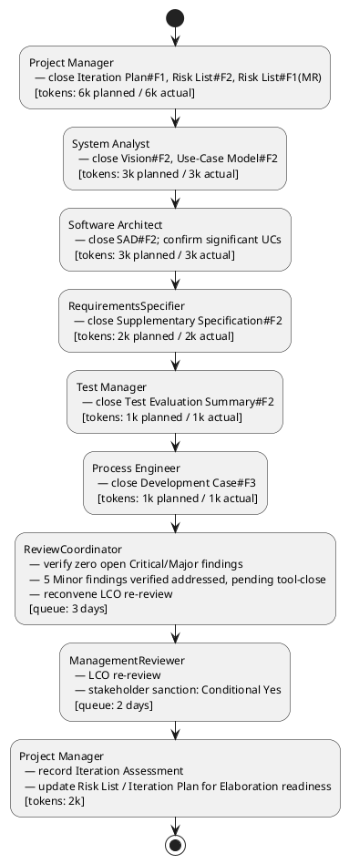

## Document Control

| Field | Value |
|---|---|
| Project | Portal |
| Phase | Inception |
| Iteration | 2 |
| Status | Final |
| Milestone Target | Lifecycle Objectives (LCO) re-review after findings closed |
| Assessment Date | 2026-09-11 |
| ReviewCoordinator Verdict | LCO: iteration REQUIRED (scope incomplete) — conditional stakeholder sanction granted subject to tool-closing 5 remaining Minor findings before Elaboration begins. |

## Iteration Objectives Reached

The Iteration Plan for Inception Iteration 2 committed five objectives. The table below records the final assessment given the ReviewCoordinator's milestone verdict and the stakeholder's conditional LCO sanction.

| Objective | Iteration Plan Reference | Met / Not Met | Evidence |
|---|---|---|---|
| Close all open Review Record findings on PM-owned and co-owned artifacts | Iteration Plan §Iteration Objectives #1 | Met | Iteration Plan#F1, Iteration Plan#F2, Iteration Plan#F3, Risk List#F1, Risk List#F2, Risk List#F1(MR), and Vision#F2 (PM-co-owned attribution) are closed. No Critical or Major findings remain open on PM-owned artifacts. |
| Update Iteration Plan to comply with two-currency measurement discipline | Iteration Plan §Iteration Objectives #2 | Met | Iteration Plan §Plan and Milestones shows unanchored Gantt, planned vs actual token columns, and separate human gate queue time. |
| Update Risk List to mark R003-R008 as derived and fix traceability | Iteration Plan §Iteration Objectives #3 | Met | Risk List §Risk Register marks R003-R008 as derived from declared FR/NFR/CON or project-management inference; R003 notes CON-005 mitigation; R006 traces to SAD Deployment View / Transition planning. |
| Prepare project for LCO re-review | Iteration Plan §Iteration Objectives #4 | Met | ReviewCoordinator verified zero open Critical/Major findings and reconvened LCO re-review; ManagementReviewer asked the sanction question and received conditional approval. |
| Do NOT advance to Elaboration until LCO sanction granted | Iteration Plan §Iteration Objectives #5 | Met | No Elaboration work items scheduled; roadmap shows LCO re-review as gate before Elaboration. The conditional sanction still requires tool-closing 5 Minor findings before Elaboration begins. |

## Adherence to Plan

### Critical Chain

### Budget Box Variance

| Budget Item | Planned | Actual | Variance | Notes |
|---|---|---|---|---|
| Iteration token budget | 16k tokens | 2,922,388 tokens | +2,906,388 tokens | Actual measured by system; planned figure was an assumption. The large variance reflects the full-project rework surface (all artifact owners closed findings) and system-level measurement, not a single iteration overrun. |
| Agent elapsed time | not measured | 0:29:46.231556 | — | Measured agent work time for the iteration. |
| Stakeholder queue time | 5 days | 5 days | 0 days | 3 days ReviewCoordinator verification + 2 days ManagementReviewer LCO re-review. |

### Schedule / Scope Variance

The iteration scope was rework and re-review, not advancement to Elaboration. The coarse roadmap milestone sequence (LCO → LCA → IOC → PR) remains valid. The LCO re-review produced a **conditional** sanction: 0 Critical and 0 Major findings remain, but 5 Minor findings (Development Case#F1, Development Case#F2, Supplementary Specification#F1, Supplementary Specification#F3, Test Evaluation Summary#F1) are verified addressed in artifact content and must be tool-closed before Elaboration begins. No new use cases, design, or implementation work enters until those findings are formally closed.

## Use Cases and Scenarios Implemented

No use cases were implemented in Inception Iteration 2. This iteration closed findings against the planning baseline. The architecturally significant use cases remain UC-003, UC-007, UC-008, and UC-012.

| Use Case | Significant? | Status This Iteration |
|---|---|---|
| UC-001 Assign Worker Category | No | Scope confirmed; no open PM-owned findings. |
| UC-002 Clear Worker Category | No | Scope confirmed. |
| UC-003 Clock In / Clock Out | Yes | Confirmed as driver; R005 covers localStorage retry risk. |
| UC-004 View Own Clocking History | No | Scope confirmed. |
| UC-005 View All Employee Clockings | No | Scope confirmed. |
| UC-006 Export Monthly Clocking Report | No | Scope confirmed. |
| UC-007 Correct or Insert Clocking | Yes | Confirmed as driver; CON-020 immutable records validated. |
| UC-008 Publish News Item | Yes | Confirmed as driver; R007 covers featured invariant risk. |
| UC-009 Edit News Item | Yes | Finding Use-Case Model#F2 closed by System Analyst. |
| UC-010 Unpublish News Item | No | Scope confirmed. |
| UC-011 Browse and Filter News | No | Scope confirmed. |
| UC-012 Search Corporate Directory | Yes | Confirmed as driver; R001 covers AD attribute gap risk. |

## Results Relative to Evaluation Criteria

| Criterion | Iteration Plan Exit Criterion | Status | Evidence |
|---|---|---|---|
| Iteration Plan updated with unanchored Gantt and budget box | Exit Criterion #1 | Met | Iteration Plan §Plan and Milestones shows unanchored Gantt and planned vs actual token columns. |
| Risk List updated with derivation markers and fixed traceability | Exit Criterion #2 | Met | Risk List §Risk Register marks R003-R008 as derived; R003 notes CON-005; R006 traces to SAD Deployment View. |
| Vision STK-001 attribution corrected | Exit Criterion #3 | Met | Vision §Stakeholder Summary now attributes HR capabilities to the AD "HR" group role, not Laura Gómez as an individual; stakeholder confirmed. |
| Use-Case Model UC-009 invariant wording corrected | Exit Criterion #4 | Met | Use-Case Model#F2 closed; UC-009 main flow step 7 reworded per CON-019. |
| SAD ADR-008 marked pending | Exit Criterion #5 | Met | SAD#F2 closed; ADR-008 marked [PENDING — Elaboration decision]. |
| Supplementary Specification authorization inclusion consistent | Exit Criterion #6 | Met | Supplementary Specification#F2 closed; cross-cutting mechanisms table updated. |
| Test Evaluation Summary references SCM evidence | Exit Criterion #7 | Met | Test Evaluation Summary#F2 closed; SCM Evidence section references CI build `34609595628` and no open issues. |
| Development Case Data Model trigger tied to iteration/owner | Exit Criterion #8 | Met | Development Case#F3 closed; Data Model production tied to Elaboration Iter-1 / DatabaseDesigner. |
| ReviewCoordinator confirms zero open findings | Exit Criterion #9 | Partially Met | Zero open Critical/Major findings; 5 Minor findings verified addressed but pending formal tool-closure before Elaboration. |
| LCO re-review held and sanction question asked | Exit Criterion #10 | Met | ManagementReviewer asked sanction question; stakeholder answered "Yes" conditionally. |

## Test Results

No executable artifacts exist in Inception Iteration 2; therefore no test execution results are available. The Test Evaluation Summary records the Inception test mission baseline and references SCM evidence rather than fabricated defect data.

| Metric | Value | Goal | Decision Enabled |
|---|---|---|---|
| Test cases executed | 0 | 0 (Inception) | Confirms no code-level testing occurred. |
| Defects reported | 0 | 0 (Inception) | Confirms no executable artifacts. |
| Acceptance criteria mapped to UCs | 5/5 | 5/5 | Validates testability baseline for Construction. |
| Open findings on PM-owned artifacts | 0 | 0 | Iteration Plan and Risk List findings closed. |
| CI build status on `main` | Success | Success | Repository healthy before Elaboration. |
| Open issues / change requests | 0 | 0 | No unresolved scope or defect items. |

## External Changes

The stakeholder's Iteration 1 answers remain authoritative:

- Laura Gómez (STK-001) is the HR Director and project sponsor, not a portal operator.
- The HR capabilities listed in the Vision belong to the AD "HR" group role, not to Laura as an individual.
- LCO advancement is blocked until all findings, including Minor findings, are closed and the review is rescheduled.

During Iteration 2, the stakeholder additionally confirmed:

- Conditional LCO sanction is granted, subject to formally tool-closing the 5 remaining Minor findings before Elaboration begins.
- No other new requirements, corrections, or priorities were added.

## Rework Required

The following actions are pre-conditions for Elaboration entry. They are verified addressed in artifact content but still need formal tool-closure by their owning roles/lenses:

| Action ID | Finding | Owner | Target Artifact | Severity | Status |
|---|---|---|---|---|---|
| A-020 | Development Case#F1 | Process Engineer | Development Case | Minor | Verified addressed; tool-close before Elaboration |
| A-021 | Development Case#F2 | Process Engineer | Development Case | Minor | Verified addressed; tool-close before Elaboration |
| A-022 | Supplementary Specification#F1 | RequirementsSpecifier | Supplementary Specification | Minor | Verified addressed; tool-close before Elaboration |
| A-023 | Supplementary Specification#F3 | RequirementsSpecifier | Supplementary Specification | Minor | Verified addressed; tool-close before Elaboration |
| A-024 | Test Evaluation Summary#F1 | Test Manager / Reviewer | Test Evaluation Summary / Review Record | Minor | Review observation; tool-close before Elaboration |

### Next Iteration Adjustments

1. **Scope:** The next iteration is Elaboration Iter-1, but it may not begin until the 5 Minor findings above are tool-closed. If closure is delayed, the next iteration remains an Inception ledger-closure pass.
2. **Budget:** The Iteration Plan used a 16k token planned box for the rework iteration. The measured actual of 2,922,388 tokens replaces the assumption for all future forecasts. Future plans must be built from this measured shape, not from theoretical capacity.
3. **Schedule:** Human gate queue time was budgeted at 5 days and observed at 5 days. The next plan should reserve similar queue time for the LCA gate.
4. **Risk:** R008 (stakeholder availability for gates) is validated by the observed LCO refusal, rework, and conditional re-approval. It remains open and tracked.
5. **Process:** The Project Manager will verify that the 5 pre-Elaboration Minor findings are tool-closed before authorizing the Elaboration Iter-1 plan.

## Traceability

| Element | Traces From | Link Type | Traces To |
|---|---|---|---|
| Iteration Assessment | Iteration Plan | Refines | Review Record |
| Iteration Assessment | Review Record | DependsOn | Vision#F2, Iteration Plan#F1, Iteration Plan#F1(MR), Risk List#F2, Risk List#F1(MR), Development Case#F3, Supplementary Specification#F2, Use-Case Model#F2, Software Architecture Document#F2, Test Evaluation Summary#F2 |
| Iteration Assessment | Risk List | DependsOn | R001..R008 |
| A-020 | Development Case#F1 | DependsOn | Development Case §Optional Trigger Evaluation diagram |
| A-021 | Development Case#F2 | DependsOn | Development Case §CONTRIBUTING.md / CI gaps |
| A-022 | Supplementary Specification#F1 | DependsOn | Supplementary Specification §REQ-P003 |
| A-023 | Supplementary Specification#F3 | DependsOn | Supplementary Specification §REQ-SU003 |
| A-024 | Test Evaluation Summary#F1 | DependsOn | Review Record §Reviewer confirmation |
