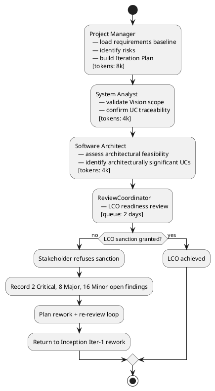
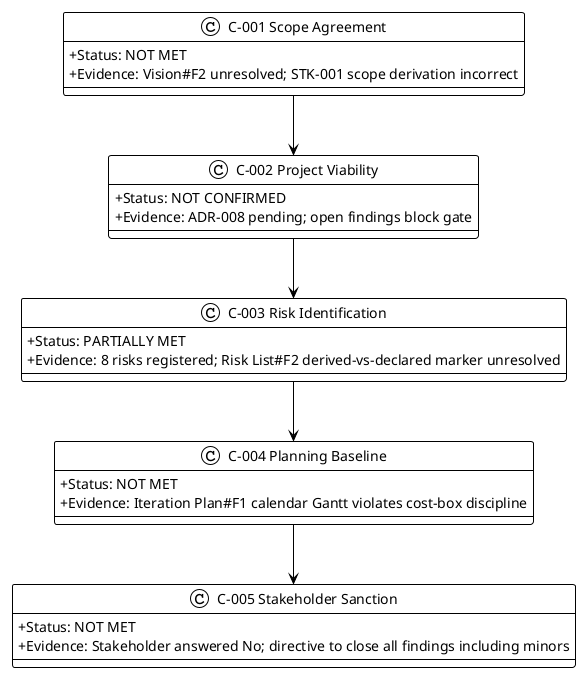
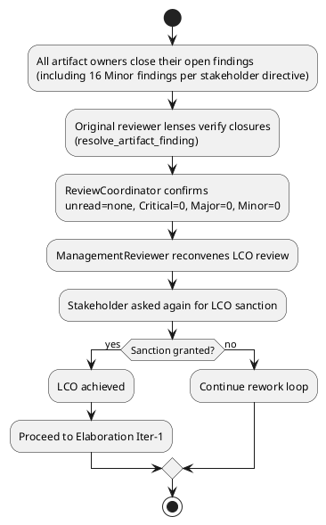

## Document Control

| Field | Value |
|---|---|
| Project | Portal |
| Phase | Inception |
| Iteration | 1 |
| Status | Draft |
| Milestone Target | Lifecycle Objectives (LCO) |
| Assessment Date | 2026-09-11 |
| ReviewCoordinator Verdict | LCO: iteration REQUIRED (scope incomplete) |

## Iteration Objectives Reached

The Iteration Plan committed four objectives for Inception Iteration 1. The table below records whether each was met, given the ReviewCoordinator's LCO No-Go verdict and the open findings.

| Objective | Iteration Plan Reference | Met / Not Met | Evidence |
|---|---|---|---|
| Establish the project management baseline: risk list, iteration plan, and coarse cross-iteration roadmap | Iteration Plan §Iteration Objectives #1 | Partially met | Risk List and Iteration Plan are persisted, but Iteration Plan#F1 (calendar Gantt) and Risk List#F2 (derived-vs-declared marker) are open Major findings. |
| Confirm the requirements baseline is complete and traceable to declared scope | Iteration Plan §Iteration Objectives #2 | Not met | Vision#F2 Critical finding: STK-001 scope derivation incorrectly attributes HR capabilities to Laura Gómez instead of the AD "HR" group role. |
| Validate that the four architecturally significant use cases cover the highest technical risks | Iteration Plan §Iteration Objectives #3 | Partially met | UC-003, UC-007, UC-008, UC-012 are identified, but SAD#F2 (ADR-008 pending decision not marked) and Supplementary Specification#F2 (authorization inclusion inconsistency) are open. |
| Assess readiness for the LCO milestone | Iteration Plan §Iteration Objectives #4 | Not met | Stakeholder refused LCO sanction; 2 Critical, 8 Major, and 16 Minor findings remain open. |

## Adherence to Plan

### Critical Chain

### Budget Box Variance

| Budget Item | Planned | Actual | Variance |
|---|---|---|---|
| Iteration token budget | 16k tokens | 3,338,736 tokens | Actual spend exceeded planned box; the 16k figure was an early planning assumption before measured actuals existed. Future plans must use measured spend. |
| Agent elapsed time | not measured | 0:29:03 | Baseline established for future forecasting. |
| Stakeholder queue time | 2 days | 0:00:00 | No queue time was recorded for this iteration; the LCO re-review gate will add queue time in the rework loop. |

### Schedule / Scope Variance

The iteration produced the planned artifacts (Vision, Use-Case Model, Supplementary Specification, SAD, Risk List, Iteration Plan, Development Case, Test Evaluation Summary, Review Record). However, the LCO milestone was not achieved because the artifacts contain open findings. The scope of the next iteration is therefore **rework and re-review**, not advancement to Elaboration.

## Use Cases and Scenarios Implemented

No use cases were implemented in Inception. This iteration validated scope and planning against the 12 declared use cases. The table below records which architecturally significant use cases were confirmed as drivers and which remain at risk.

| Use Case | Significant? | Status This Iteration |
|---|---|---|
| UC-001 Assign Worker Category | No | Scope confirmed; no open findings directly tied. |
| UC-002 Clear Worker Category | No | Scope confirmed. |
| UC-003 Clock In / Clock Out | Yes | Confirmed as driver; R005 covers localStorage retry risk. |
| UC-004 View Own Clocking History | No | Scope confirmed. |
| UC-005 View All Employee Clockings | No | Scope confirmed. |
| UC-006 Export Monthly Clocking Report | No | Scope confirmed; UC-006 Minor finding on HoursWorked computation remains open. |
| UC-007 Correct or Insert Clocking | Yes | Confirmed as driver; CON-020 immutable records validated. |
| UC-008 Publish News Item | Yes | Confirmed as driver; R007 covers featured invariant risk. |
| UC-009 Edit News Item | Yes | Major finding Use-Case Model#F2: featured invariant wording ambiguous. |
| UC-010 Unpublish News Item | No | Scope confirmed. |
| UC-011 Browse and Filter News | No | Scope confirmed. |
| UC-012 Search Corporate Directory | Yes | Confirmed as driver; R001 covers AD attribute gap risk. |

## Results Relative to Evaluation Criteria

| Criterion | Iteration Plan Exit Criterion | Status | Evidence |
|---|---|---|---|
| Risk List persisted with all risks classified | Exit Criterion #1 | Partially met | Risk List persisted; Risk List#F2 Major finding requires derived-vs-declared marker for R003-R008. |
| Iteration Plan persisted with coarse roadmap, fine plan, resource profile, and budget box | Exit Criterion #2 | Not met | Iteration Plan persisted; Iteration Plan#F1 Major finding: calendar Gantt violates cost-box discipline. |
| Requirements baseline confirmed traceable to declared scope | Exit Criterion #3 | Not met | Vision#F2 Critical finding on STK-001 scope derivation. |
| LCO readiness review scheduled with STK-001, STK-002, STK-003 | Exit Criterion #4 | Met | Review held; stakeholder refused sanction and directed closure of all findings including minors. |

## Test Results

No executable artifacts exist in Inception Iteration 1; therefore no test execution results are available. The Test Evaluation Summary records the Inception test mission as self-assessed Pass, but Test Evaluation Summary#F2 (Major) notes that the defect lifecycle table misrepresents the Inception state by implying defect tracking was exercised. The Project Manager concurs with the reviewer: the Test Evaluation Summary should reference SCM evidence (CI build status, pull request state) rather than a zeroed defect table.

| Metric | Value | Goal | Decision Enabled |
|---|---|---|---|
| Test cases executed | 0 | 0 (Inception) | Confirms no code-level testing occurred. |
| Defects reported | 0 | 0 (Inception) | Confirms no executable artifacts. |
| Acceptance criteria mapped to UCs | 5/5 | 5/5 | Validates testability baseline for Construction. |

## External Changes

The only external change during this iteration was the stakeholder's response to the LCO sanction question and the subsequent Critical-finding escalation. The stakeholder clarified that:

- Laura Gómez (STK-001) is the HR Director and project sponsor, not a portal operator.
- The HR capabilities listed in the Vision belong to the AD "HR" group role, not to Laura as an individual.
- LCO advancement is blocked until all findings, including Minor findings, are closed and the review is rescheduled.

This response changes the Vision and the Use-Case Model actor attribution. It does not change the declared functional requirements (FR-001..FR-012) or the authorization model (NFR-006).

## Rework Required

The iteration did not achieve LCO. The following rework is required before the LCO re-review:

### Rework Action Register

| Action ID | Finding | Owner | Target Artifact | Severity | Status |
|---|---|---|---|---|---|
| A-001 | Vision#F2 | System Analyst / Project Manager | Vision | Critical | Open — update STK-001 description and attribute HR capabilities to AD "HR" group role |
| A-002 | Iteration Plan#F1 (MR) | Project Manager | Iteration Plan / Review Record | Critical | Open — close after all other findings closed |
| A-003 | Iteration Plan#F1 | Project Manager | Iteration Plan | Major | Open — replace calendar Gantt with unanchored cost-box Gantt |
| A-004 | Risk List#F2 | Project Manager | Risk List | Major | Open — mark R003-R008 as derived or Elaboration concerns where applicable |
| A-005 | Risk List#F1 (MR) | Project Manager | Risk List / Iteration Plan | Major | Open — budget rework and re-review queue time |
| A-006 | Development Case#F3 | Process Engineer | Development Case | Major | Open — tie Data Model trigger to iteration/owner |
| A-007 | Supplementary Specification#F2 | RequirementsSpecifier | Supplementary Specification | Major | Open — fix authorization inclusion table |
| A-008 | Use-Case Model#F2 | System Analyst | Use-Case Model | Major | Open — clarify UC-009 featured invariant wording |
| A-009 | Software Architecture Document#F2 | Software Architect | SAD | Major | Open — mark ADR-008 as [PENDING] / [ELABORATION DECISION] |
| A-010 | Test Evaluation Summary#F2 | Test Manager | Test Evaluation Summary | Major | Open — replace zeroed defect table with SCM evidence |
| A-011..A-026 | All Minor findings | Respective artifact owners | All reviewed artifacts | Minor | Open — close per stakeholder directive |

### Next Iteration Adjustments

1. **Scope:** The next iteration remains Inception Iteration 1 rework. No new use cases or design work enters until LCO is achieved.
2. **Budget:** The next Iteration Plan must include explicit rework token budget and re-review queue time. The previous 16k token assumption is retired; use measured actuals (3,338,736 tokens, 0:29:03 agent time) as the baseline for forecasting.
3. **Schedule:** The coarse roadmap remains valid at the milestone sequence level (LCO → LCA → IOC → PR), but the fine plan must be rebuilt as an unanchored Gantt with queue-time gates.
4. **Risk:** R008 (stakeholder availability for gates) is now validated and should be updated with the observed refusal and re-review queue time.

## Traceability

| Element | Traces From | Link Type | Traces To |
|---|---|---|---|
| Iteration Assessment | Iteration Plan | Refines | Review Record |
| Iteration Assessment | Review Record | DependsOn | Vision#F2, Iteration Plan#F1, Risk List#F2, Risk List#F1(MR), Development Case#F3, Supplementary Specification#F2, Use-Case Model#F2, Software Architecture Document#F2, Test Evaluation Summary#F2 |
| Iteration Assessment | Test Evaluation Summary | Refines | AC-001..AC-005 |
| Iteration Assessment | Risk List | DependsOn | R001..R008 |
| A-001 | Vision#F2 | DependsOn | STK-001, FR-001..FR-012 |
| A-003 | Iteration Plan#F1 | DependsOn | IARI cost-box discipline |
| A-004 | Risk List#F2 | DependsOn | R003..R008 |
| A-005 | Risk List#F1(MR) | DependsOn | Iteration Plan rework budget |
