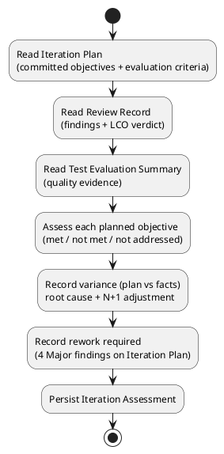

## Document Control

| Field | Value |
|---|---|
| Phase | Inception |
| Status | Draft |
| Milestone Target | End-of-Inception (Lifecycle Objectives) — NOT YET ACHIEVED |

## Iteration Objectives Reached

The four phase-planned objectives for Inception Iteration 1 are assessed against the Review Record and Test Evaluation Summary. **The milestone verdict is the ReviewCoordinator's, already issued: LCO No-Go — stakeholder sanction REFUSED.** This assessment records the objective-by-objective result *given* that verdict; it does not gate the phase.

| # | Planned objective | Result | Evidence |
|---|---|---|---|
| 1 | Define Project Scope | **Met** | Vision scope statement delineates in/out; 12 UCs trace 1:1 to FR-001…FR-012; Review Record: "Scope agreement: PASS" |
| 2 | Identify Critical Risks | **Met** | Risk List carries R001–R004 with P/I/exposure/magnitude/strategy/mitigation/contingency; Review Record: "Risk identification: PASS" |
| 3 | Tailor Development Process | **Met** | Development Case produced (Environment discipline); Business Modeling discipline correctly INACTIVE |
| 4 | Establish Feasibility | **Met** | Candidate SAD honors all 21 constraints; layered monolith on single node; Review Record: "Feasibility: PASS" |

**Net:** all four objectives are substantively met. The No-Go verdict is a **governance/consistency stop, not a scope or feasibility stop** — the baseline is sound; the Iteration Plan's internal consistency and cost-box governance failed review.

## Adherence to Plan

The iteration produced **9 artifacts** (Vision, Use-Case Model, Supplementary Specification, Development Case, Risk List, Iteration Plan, Software Architecture Document, Test Evaluation Summary, Review Record) against a plan that committed to a 6-artifact baseline (Vision, Use-Case Model, Supplementary Specification, Development Case, Risk List, Iteration Plan).

**Variance (plan vs. facts):**

| Variance | Root cause | N+1 adjustment |
|---|---|---|
| SAD and Test Evaluation Summary were produced, but the Iteration Plan's Resources table marked Software Architect "Dormant" and omitted Test Manager entirely | The plan's resource profile was written before the actual artifact set was known; it was not updated when the SAD and Test Evaluation Summary landed | Iteration Plan#F1 (Reviewer) remediation: add Software Architect (candidate SAD) and Test Manager rows; fold SAD + Test Evaluation Summary into Objective 1 |
| Iteration Plan Gantt expressed agent work in "days" (duration/effort fusion) | The Gantt was authored before the DC measurement policy (tokens + elapsed time only) was applied consistently | Iteration Plan#F2 (Reviewer) remediation: replace "days" with token budgets for agent work; keep "days" only for human-gate queue time |
| No single total cost-box stated; per-stretch budgets present but no measurable stop condition | Budget-box governance was applied per-stretch but never summed into one iteration total | Iteration Plan#F1 (MR) remediation: state the iteration's total token budget as an explicit assumption with basis named |

**Measured actuals (this iteration):** token spend = 1,860,682; agent elapsed time = 0:30:46.6; stakeholder queue time = 0:00:00 (excludes the end-of-iteration approval gate, which is not measured). These replace every assumed share in the Elaboration forecast.

## Use Cases and Scenarios Implemented

None — Inception does not implement. The iteration **surveyed all 12 UCs** and **detailed two** architecturally significant ones to retire risk:

- **UC-001 Clock In/Out** — detailed (forces CON-021 client-timestamp + idempotency, AC-005 offline retry).
- **UC-008 Search Directory** — detailed (forces CON-007 AD on-demand projection, surfaces R001).

Remaining UCs (UC-002…UC-007, UC-009…UC-012) are outlined; flows are detailed in Elaboration. This matches the Test Evaluation Summary's finding #1 (Low, expected at Inception).

## Results Relative to Evaluation Criteria

**Layer (a) — declared acceptance criteria (AC-NNN):**

| AC | Disposition this iteration | Result |
|---|---|---|
| AC-001 | Deferred to Construction (UC-001) | Not addressed this iteration — correct deferral |
| AC-002 | Deferred to Construction (UC-003) | Not addressed this iteration — correct deferral |
| AC-003 | Deferred to Construction (UC-008); R001 retired in Elaboration first | Not addressed this iteration — correct deferral |
| AC-004 | Deferred to Transition (adoption vs BG-003) | Not addressed this iteration — correct deferral |
| AC-005 | Deferred to Construction (UC-001 offline retry) | Not addressed this iteration — correct deferral |

**Layer (b) — this iteration's own exit criteria (LCO readiness):**

| Criterion | Result | Evidence |
|---|---|---|
| 1. Six baseline artifacts exist and are internally consistent | **Not met** | All six exist, but the Iteration Plan is internally inconsistent (resource table, Gantt units) — 4 Major findings |
| 2. All 12 UCs trace to FRs; all 21 constraints + 5 NFRs captured | **Met** | Review Record: "Scope agreement: PASS"; Supplementary Specification captures NFR-001…NFR-005 |
| 3. R001 and R003 classified with mitigation + contingency | **Met** | Risk List: R001 (High, 9), R003 (Significant, 6) both carry strategy/mitigation/contingency |
| 4. ReviewCoordinator issues an LCO verdict | **Met** | Verdict issued: No-Go (stakeholder sanction REFUSED) |

## Test Results

No executed tests exist in Inception (no test environment provisioned; no Construction code). The **Test Evaluation Summary** verdict is **PASS** — the baseline is testable and the test effort is ready for Elaboration:

- All 5 ACs trace to a UC and a named phase where they become verifiable.
- All 5 NFRs have a measurable verification path.
- All 12 UCs carry preconditions/postconditions/business rules; UC-001 and UC-008 are detailed with alternative flows.
- Test-relevant risks R001/R002 have concrete test hooks; R001 is scheduled for retirement in Elaboration iteration 1.

Three Low testability findings (10 UCs outlined only; NFR-001/002 thresholds not yet quantified; no test environment) are all expected at Inception and carry no action this iteration.

## External Changes

None. No Change Request was raised this iteration. The stakeholder's two answers (LCO sanction "No"; directive "Fix all findings") are recorded in the Review Record and drive the rework below — they are not scope changes.

## Rework Required

The Review Record consolidated **0 Critical, 4 Major, 1 Minor** findings. All four Major findings target the Iteration Plan and are owned by the Project Manager; the one Minor targets the SAD and is owned by the Software Architect.

| Finding | Severity | Owner | Remediation |
|---|---|---|---|
| Iteration Plan#F1 (Reviewer) — resource table inconsistent | Major | Project Manager | Add Software Architect (candidate SAD) + Test Manager rows; fold SAD + Test Evaluation Summary into Objective 1 |
| Iteration Plan#F2 (Reviewer) — Gantt "days" unit violation | Major | Project Manager | Replace "days" with token budgets for agent work; keep "days" only for human-gate queue time |
| Iteration Plan#F1 (MR) — cost-box total not stated | Major | Project Manager | State the iteration's total token budget as an explicit assumption with basis named |
| Iteration Plan#F2 (MR) — stakeholder refusal directive | Major | Project Manager | Resolves once the other three Major findings are remediated; then re-review at next LCO gate |
| Software Architecture Document#F1 — Volatility High vs Medium | Minor | Software Architect | Correct prose to "Volatility: Medium" or "the two most volatile UCs" |

**Next-iteration plan adjustment:** the Iteration Plan must be remediated (all four Major findings) before the stakeholder re-sanctions LCO. The measured token spend (1,860,682) and elapsed time (0:30:46.6) now anchor the Elaboration forecast — no assumed share survives.

## Traceability

| Element | Traces From | Link Type | Traces To |
|---|---|---|---|
| Iteration Assessment (Inception Iter-1) | Iteration Plan, Review Record, Test Evaluation Summary, Risk List | DependsOn | LCO milestone verdict (ReviewCoordinator) |
| Iteration Plan#F1 (Reviewer) | Iteration Plan (resource table) | DependsOn | Project Manager (rework) |
| Iteration Plan#F2 (Reviewer) | Iteration Plan (Gantt units) | DependsOn | Project Manager (rework) |
| Iteration Plan#F1 (MR) | Iteration Plan (cost-box) | DependsOn | Project Manager (rework) |
| Iteration Plan#F2 (MR) | Iteration Plan (stakeholder refusal) | DependsOn | Project Manager (rework) |
| Software Architecture Document#F1 | SAD (Volatility wording) | DependsOn | Software Architect (rework) |
| R001 | CON-007, FR-008, UC-008 | DependsOn | Elaboration PoC |
| R003 | STK-003, CON-006, CON-010 | DependsOn | Iteration Plan (human gates) |
