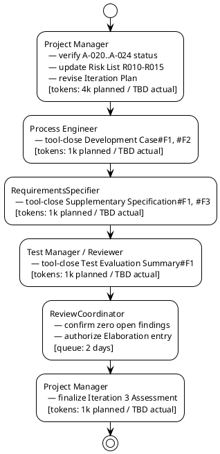

## Document Control

| Field | Value |
|---|---|
| Project | Portal |
| Phase | Inception |
| Iteration | 3 |
| Status | Draft |
| Milestone Target | LCO final closure / Elaboration entry readiness |
| Assessment Date | 2026-09-11 |
| ReviewCoordinator Verdict | Pending — awaiting tool-closure of 5 remaining Minor findings before LCO can be declared final and Elaboration authorized. |

## Iteration Objectives Reached

The Iteration Plan for Inception Iteration 3 committed four objectives. The table below records the current assessment before the ReviewCoordinator's final ledger-closure verdict.

| Objective | Iteration Plan Reference | Met / Not Met | Evidence |
|---|---|---|---|
| Verify tool-closure of the 5 remaining Minor Review Record findings (A-020..A-024) | Iteration Plan §Iteration Objectives #1 | Not Yet Met | Findings remain open in the Review Record ledger at the start of Iteration 3; their owning roles (Process Engineer, RequirementsSpecifier, Test Manager/Reviewer) are responsible for tool-closure. |
| Update the Risk List with Elaboration environment-gate risks R010-R015 | Iteration Plan §Iteration Objectives #2 | Met | Risk List updated to include R010-R015, each traced to Development Case gates E1-G1..E1-G6. |
| Confirm Elaboration entry readiness | Iteration Plan §Iteration Objectives #3 | Not Yet Met | Readiness is blocked until the 5 Minor findings are tool-closed and the ReviewCoordinator confirms zero open findings. |
| Do NOT advance to Elaboration until LCO sanction is fully satisfied | Iteration Plan §Iteration Objectives #4 | Met | No Elaboration work items scheduled; Iteration Plan keeps Elaboration Iter-1 behind the LCO final-closure gate. |

## Adherence to Plan

### Critical Chain

### Budget Box Variance

| Budget Item | Planned | Actual | Variance | Notes |
|---|---|---|---|---|
| Iteration token budget | 8k tokens | TBD | TBD | Actual will be measured by system when iteration closes. |
| Agent elapsed time | not measured | TBD | — | Measured agent work time for the iteration. |
| Stakeholder queue time | 2 days | TBD | — | ReviewCoordinator final verification gate. |

### Schedule / Scope Variance

The iteration scope is ledger closure and Elaboration readiness, not advancement to Elaboration. The coarse roadmap milestone sequence (LCO → LCA → IOC → PR) remains valid. The LCO milestone is **not yet final** because 5 Minor findings (Development Case#F1, Development Case#F2, Supplementary Specification#F1, Supplementary Specification#F3, Test Evaluation Summary#F1) remain open pending formal tool-closure by their owning roles. No new use cases, design, or implementation work enters until those findings are closed.

## Use Cases and Scenarios Implemented

No use cases were implemented in Inception Iteration 3. This iteration closes the Inception ledger and prepares for Elaboration. The architecturally significant use cases remain UC-003, UC-007, UC-008, UC-009, and UC-012.

| Use Case | Significant? | Status This Iteration |
|---|---|---|
| UC-001 Assign Worker Category | No | Scope confirmed; no open PM-owned findings. |
| UC-002 Clear Worker Category | No | Scope confirmed. |
| UC-003 Clock In / Clock Out | Yes | Confirmed as driver; R005 covers localStorage retry risk. |
| UC-004 View Own Clocking History | No | Scope confirmed. |
| UC-005 View All Employee Clockings | No | Scope confirmed. |
| UC-006 Export Monthly Clocking Report | No | Scope confirmed. |
| UC-007 Correct or Insert Clocking | Yes | Confirmed as driver; CON-020 immutable records validated. |
| UC-008 Publish News Item | Yes | Confirmed as driver; R007 covers featured invariant risk. |
| UC-009 Edit News Item | Yes | Scope confirmed; Use-Case Model#F2 closed in Iteration 2. |
| UC-010 Unpublish News Item | No | Scope confirmed. |
| UC-011 Browse and Filter News | No | Scope confirmed. |
| UC-012 Search Corporate Directory | Yes | Confirmed as driver; R001 covers AD attribute gap risk. |

## Results Relative to Evaluation Criteria

| Criterion | Iteration Plan Exit Criterion | Status | Evidence |
|---|---|---|---|
| Review Record shows zero open findings | Exit Criterion #1 | Not Yet Met | 5 Minor findings remain open at start of Iteration 3; owners are Process Engineer, RequirementsSpecifier, Test Manager/Reviewer. |
| Risk List includes R010-R015 | Exit Criterion #2 | Met | Risk List §Risk Register updated with gate-derived risks. |
| Iteration Plan reflects Iteration 3 scope | Exit Criterion #3 | Met | This Iteration Plan updated to Iteration 3 with budget box and human gate queue time. |
| Development Case gates assigned and tracked | Exit Criterion #4 | Met | Development Case §Guidelines and Procedures gates E1-G1..E1-G6 mapped to Risk List R010-R015. |
| ReviewCoordinator confirms Elaboration readiness | Exit Criterion #5 | Not Yet Met | Pending tool-closure of 5 Minor findings. |
| LCO final closure achieved | Exit Criterion #6 | Not Yet Met | Conditional LCO sanction from Iteration 2 not yet fully satisfied. |

## Test Results

No executable artifacts exist in Inception Iteration 3; therefore no test execution results are available. The Test Evaluation Summary records the Inception test mission baseline and references SCM evidence.

| Metric | Value | Goal | Decision Enabled |
|---|---|---|---|
| Test cases executed | 0 | 0 (Inception) | Confirms no code-level testing occurred. |
| Defects reported | 0 | 0 (Inception) | Confirms no executable artifacts. |
| Acceptance criteria mapped to UCs | 5/5 | 5/5 | Validates testability baseline for Construction. |
| Open findings on PM-owned artifacts | 0 | 0 | Iteration Plan and Risk List findings closed. |
| Open findings awaiting tool-closure | 5 | 0 | Tracks remaining pre-Elaboration ledger work. |
| CI build status on `main` | Success | Success | Repository healthy before Elaboration. |
| Open issues / change requests | 0 | 0 | No unresolved scope or defect items. |

## External Changes

The stakeholder's prior answers remain authoritative:

- Laura Gómez (STK-001) is the HR Director and project sponsor, not a portal operator.
- The HR capabilities listed in the Vision belong to the AD "HR" group role, not to Laura as an individual.
- LCO advancement is blocked until all findings, including Minor findings, are closed and the review is rescheduled.
- Conditional LCO sanction was granted in Iteration 2, subject to formally tool-closing the 5 remaining Minor findings before Elaboration begins.
- No other new requirements, corrections, or priorities were added.

## Rework Required

The following actions are pre-conditions for Elaboration entry. They are verified addressed in artifact content but still need formal tool-closure by their owning roles/lenses:

| Action ID | Finding | Owner | Target Artifact | Severity | Status |
|---|---|---|---|---|---|
| A-020 | Development Case#F1 | Process Engineer | Development Case | Minor | Verified addressed; tool-close before Elaboration |
| A-021 | Development Case#F2 | Process Engineer | Development Case | Minor | Verified addressed; tool-close before Elaboration |
| A-022 | Supplementary Specification#F1 | RequirementsSpecifier | Supplementary Specification | Minor | Verified addressed; tool-close before Elaboration |
| A-023 | Supplementary Specification#F3 | RequirementsSpecifier | Supplementary Specification | Minor | Verified addressed; tool-close before Elaboration |
| A-024 | Test Evaluation Summary#F1 | Test Manager / Reviewer | Test Evaluation Summary / Review Record | Minor | Review observation; tool-close before Elaboration |

### Next Iteration Adjustments

1. **Scope:** If the 5 Minor findings are tool-closed within this iteration, the next iteration is Elaboration Iter-1. If closure is delayed, the next iteration remains an Inception ledger-closure pass.
2. **Budget:** The Iteration Plan uses an 8k token planned box for the ledger-closure iteration. The measured actual from Iteration 2 (2,922,388 tokens) remains the baseline for forecasts until Iteration 3 closes.
3. **Schedule:** Human gate queue time is budgeted at 2 days for ReviewCoordinator final verification. The next plan should reserve similar queue time for the LCA gate.
4. **Risk:** R008 (stakeholder availability for gates) is validated by the observed LCO refusal, rework, and conditional re-approval. It remains open and tracked. R010-R015 are new schedule/technical risks derived from Development Case Elaboration gates.
5. **Process:** The Project Manager will verify that the 5 pre-Elaboration Minor findings are tool-closed before authorizing the Elaboration Iter-1 plan.

## Traceability

| Element | Traces From | Link Type | Traces To |
|---|---|---|---|
| Iteration Assessment | Iteration Plan | Refines | Review Record |
| Iteration Assessment | Review Record | DependsOn | Development Case#F1, Development Case#F2, Supplementary Specification#F1, Supplementary Specification#F3, Test Evaluation Summary#F1 |
| Iteration Assessment | Risk List | DependsOn | R001..R015 |
| A-020 | Development Case#F1 | DependsOn | Development Case §Optional Trigger Evaluation diagram |
| A-021 | Development Case#F2 | DependsOn | Development Case §Guidelines and Procedures |
| A-022 | Supplementary Specification#F1 | DependsOn | Supplementary Specification §REQ-P003 |
| A-023 | Supplementary Specification#F3 | DependsOn | Supplementary Specification §REQ-SU003 |
| A-024 | Test Evaluation Summary#F1 | DependsOn | Review Record §Reviewer confirmation |
