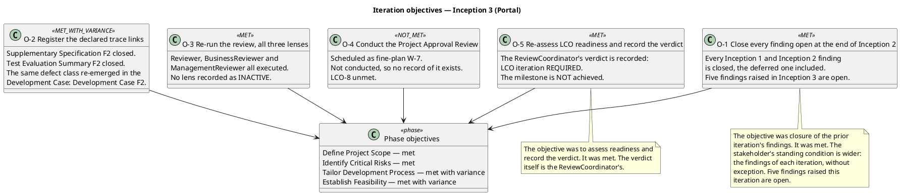
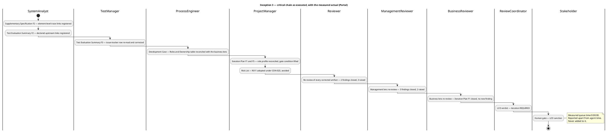
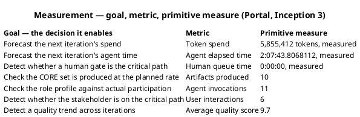

## Document Control
- **Phase:** Inception
- **Status:** Draft — under review
- **Milestone Target:** End of Inception (not yet achieved)
- **Iteration:** 3, Cycle 1
- **Owner:** ProjectManager
- **Date:** 2026-10-08

## Iteration Objectives Reached
The iteration's objectives were largely met. The milestone was not. Those are two different statements and this assessment keeps them apart: the objectives were to close the findings open at the end of Inception 2, to register the declared trace links, to re-run the review with all three lenses, to conduct the Project Approval Review and to re-assess LCO readiness. Four of the five were met, one was not. The LCO verdict is the ReviewCoordinator's and it is that the iteration is required again.

| # | Objective | Verdict | Evidence |
|---|---|---|---|
| O-1 | Close every finding open at the end of Inception 2, minor ones included. | **Met** | Every Inception 1 and Inception 2 finding is closed by its emitting lens, the deferred Test Evaluation Summary#F2 included. No finding from a prior iteration is open at this gate. |
| O-2 | Register the declared trace links in the trace repository so the coverage the artifacts claim is machine-verifiable. | **Met with variance** | Supplementary Specification#F2 and Test Evaluation Summary#F2 are closed: the Requirements Traceability Matrix carries a `Refines` link to the Software Architecture Document for each of NFR-001 to NFR-005 and to the Test Case artifact for each of AC-001 to AC-006, and the Test Evaluation Summary is present in the trace tree. The same defect class re-emerged in a third artifact — Development Case#F2. See V-1 and V-3. |
| O-3 | Re-run the review with all three lenses at the LCO gate. | **Met** | Review Record entries from the Reviewer, the BusinessReviewer and the ManagementReviewer. No lens is recorded as INACTIVE; all three executed. |
| O-4 | Conduct the Project Approval Review ahead of the LCO verdict. | **Not met** | Scheduled as fine-plan W-7 and not conducted, so no record of it exists and LCO-8 is unmet. Second consecutive iteration in which it is scheduled and not reached. See V-2. |
| O-5 | Re-assess LCO readiness against X-1 to X-5 on the corrected baseline and record the verdict. | **Met** | The ReviewCoordinator's verdict is recorded: LCO — iteration REQUIRED (scope incomplete). The milestone is not achieved. |

```plantuml
@startuml
title Iteration objectives — Inception 3 (Portal)

skinparam classAttributeIconSize 0

class "O-1 Close every finding open at the end of Inception 2" as O1 <<MET>> {
  Every Inception 1 and Inception 2 finding
  is closed, the deferred one included.
  Five findings raised in Inception 3 are open.
}

class "O-2 Register the declared trace links" as O2 <<MET_WITH_VARIANCE>> {
  Supplementary Specification F2 closed.
  Test Evaluation Summary F2 closed.
  The same defect class re-emerged in the
  Development Case: Development Case F2.
}

class "O-3 Re-run the review, all three lenses" as O3 <<MET>> {
  Reviewer, BusinessReviewer and
  ManagementReviewer all executed.
  No lens recorded as INACTIVE.
}

class "O-4 Conduct the Project Approval Review" as O4 <<NOT_MET>> {
  Scheduled as fine-plan W-7.
  Not conducted, so no record of it exists.
  LCO-8 unmet.
}

class "O-5 Re-assess LCO readiness and record the verdict" as O5 <<MET>> {
  The ReviewCoordinator's verdict is recorded:
  LCO iteration REQUIRED.
  The milestone is NOT achieved.
}

class "Phase objectives" as PH <<phase>> {
  Define Project Scope — met
  Identify Critical Risks — met
  Tailor Development Process — met with variance
  Establish Feasibility — met with variance
}

O1 --> PH
O2 --> PH
O3 --> PH
O4 --> PH
O5 --> PH

note bottom of O1
  The objective was closure of the prior
  iteration's findings. It was met. The
  stakeholder's standing condition is wider:
  the findings of each iteration, without
  exception. Five findings raised this
  iteration are open.
end note

note bottom of O5
  The objective was to assess readiness and
  record the verdict. It was met. The verdict
  itself is the ReviewCoordinator's.
end note
@enduml
```

**The phase objectives against the iteration objectives.** Define Project Scope is O-1, O-2 and O-5: the baseline is complete, the scope is agreed and no scope question is open, but the review that certifies the baseline is not clean. Identify Critical Risks is discharged by the Risk List, which carries no finding from any lens and which adopted R011 this phase under CON-023. Tailor Development Process is discharged by the Development Case, which carries three open findings, and by the Iteration Plan, which carries none. Establish Feasibility is O-3, O-4 and O-5: the architecture is sound and the review ran with all three lenses, but the Project Approval Review was not conducted and the milestone was not sanctioned. No phase objective was left unaddressed; two are met with variance.

## Adherence to Plan
Eight fine-plan work items W-1 to W-8 were planned. Six were executed, in the planned order, each by its planned owner. W-7 was not reached. W-8 was executed. The critical chain ran sequentially as planned and ended at the human gate. The plan's forecast discipline held: no work item carried a size, and the one spend figure quoted was the forecast built from Inception 2's measured actual.

```plantuml
@startuml
title Inception 3 — critical chain as executed, with the measured actual (Portal)

|SystemAnalyst|
start
:Supplementary Specification F2 — element-level trace links registered;
:Test Evaluation Summary F2 — declared upstream links registered;
|TestManager|
:Test Evaluation Summary F3 — issue-tracker row re-read and corrected;
|ProcessEngineer|
:Development Case — Roles and Ownership table reconciled with the business lens;
|ProjectManager|
:Iteration Plan F1 and F5 — role profile reconciled, gate condition lifted;
:Risk List — R011 adopted under CON-023, avoided;
|Reviewer|
:Re-review of every corrected artifact — 2 findings closed, 3 raised;
|ManagementReviewer|
:Management lens re-review — 3 findings closed, 2 raised;
|BusinessReviewer|
:Business lens re-review — Iteration Plan F1 closed, no new finding;
|ReviewCoordinator|
:LCO verdict — iteration REQUIRED;
|Stakeholder|
:Human gate — LCO sanction;
note right
  Measured queue time 0:00:00.
  Reported apart from agent time.
  Never added to it.
end note
stop
@enduml
```

### Variance against the plan

Five variances. Each is recorded with its root cause and the adjustment it forces in Inception 4, in the same breath — a variance recorded without its correction is left open for the next iteration's reviewers to find.

| # | Planned | Actual | Root cause | Adjustment in Inception 4 |
|---|---|---|---|---|
| V-1 | O-2: register the declared trace links so the coverage the artifacts claim is machine-verifiable. | The two artifacts the work items named are registered. The same defect class re-emerged in a third artifact: Development Case#F2 — nine declared artifact-level rows are not registered and the graph shows the Development Case as a Business-level LEAF node. | The work items named two artifacts, not the defect class. Registration was performed against the ledger entry rather than as a sweep of every artifact's Traceability table against the graph, so the third artifact carrying the same class was not examined. | Inception 4 carries a single sweep work item: every artifact's Traceability table is read against the graph and every declared row that the graph does not carry is either registered or dropped. The Development Case's nine rows are the first entry. |
| V-2 | O-4: the Project Approval Review conducted ahead of the LCO verdict. | Not conducted, for the second consecutive iteration. LCO-8 unmet. | The review was scheduled as W-7 and sequenced after the re-review. The iteration reached the verdict before it reached W-7, because the re-review raised new findings and the closure work consumed the iteration. A work item sequenced last is the first one an iteration drops. | Inception 4 sequences the Project Approval Review as the first work item after the re-review, and O-4 states the Review Record entry as its exit evidence. It is not sequenced behind the closure work. |
| V-3 | The plan's forecast rule: the correction set is the cost driver, and the artifact surface is re-read to correct it. | The measured actual is 5,855,412 tokens and 2:07:43.8068112 of agent time — 0.49× and 0.90× of Inception 2's measured actual, against a plan that forecast "of the same order as Inception 2's measured actual, not below it". | The forecast treated the accumulated artifact surface as the cost driver. The actual driver is the size of the correction set and the number of artifacts it touches: Inception 3 corrected six findings across five artifacts, against eleven findings across eight in Inception 2, and most of the correction was registration rather than re-authoring. The surface is re-read either way; what varies is how much of it is rewritten. | The Inception 4 forecast is built from Inception 3's measured actual and states the correction-set size, not the artifact count, as the driver. No per-stretch figure is derived: three observations do not yield a per-stretch distribution, and inventing one would be a fabricated observation. |
| V-4 | The fine plan's work items were derived from the Inception 2 finding ledger. | The review raised findings in two artifacts the fine plan did not touch: the Development Case and the Software Architecture Document. | The plan treated the finding ledger as closed-ended — the work items were the ledger's entries, and the ledger was assumed to be the complete set of what the review would examine. A re-review examines every artifact, not only the corrected ones. | Inception 4's fine plan carries a work item for each open finding plus a sweep work item over every artifact's declared traceability, so the plan is not bounded by the previous ledger. |
| V-5 | The plan's forecast rule: no spend figure before a phase closes. | The rule held. Three iterations have now closed with a measured actual. | Not a variance — the rule working as designed. | None. The rule is unchanged and is applied to Inception 4. |

```plantuml
@startuml
title Variance and adjustment — Inception 3 plan against the iteration's facts (Portal)

skinparam classAttributeIconSize 0

class "PlannedWorkItem" as PWI <<plan>> {
  + id : W-1 .. W-8
  + owner : role
  + exitEvidence : text
}

class "ExecutedStretch" as EXE <<actual>> {
  + role : role
  + artifact : name
  + measuredTokens : 5855412
  + measuredAgentTime : 2:07:43.8068112
}

class "Variance" as VAR <<record>> {
  + id : V-1 .. V-5
  + planned : text
  + actual : text
  + rootCause : text
  + adjustment : text
}

class "Finding" as FND <<record>> {
  + key : artifact Fn
  + severity : Major | Minor
  + lens : Reviewer | ManagementReviewer | BusinessReviewer
  + owner : role
}

class "Adjustment" as ADJ <<plan>> {
  + target : Inception 4
  + workItem : text
  + owner : role
}

PWI --> EXE : executed as
EXE --> VAR : measured against
FND --> VAR : forces
VAR --> ADJ : corrected by

note bottom of VAR
  A variance recorded without its correction
  is left open for the next iteration's
  reviewers to find. Recorded with it, it
  is closed work.
end note

note bottom of ADJ
  Every adjustment lands in Inception 4.
  None cuts or defers declared scope.
end note
@enduml
```

**No adjustment cuts or defers declared scope.** Every one of the five is a correction to the plan's own structure or to a statement about observable state. Declared scope is the stakeholder's to change, not the plan's.

### Measured actuals — the third closed iteration

Three iterations have now closed with a measured actual. The two currencies are reported side by side and are never added.

| Quantity | Inception 1 | Inception 2 | Inception 3 | Goal — the decision it enables |
|---|---|---|---|---|
| Token spend | 6,891,971 | 11,955,748 | 5,855,412 | Forecast Inception 4's spend. The fall to 0.49× of Inception 2 is the measured cost of a smaller correction set, not of a smaller artifact surface. |
| Agent elapsed time | 1:17:17.4186317 | 2:22:39.389271 | 2:07:43.8068112 | Forecast the next iteration's agent time. The ratio 0.90× against Inception 2 does not track the token ratio, so the two do not move together across iterations. |
| Human queue time | 0:00:00 | 0:00:00 | 0:00:00 | Detect whether a human gate has become the critical path. It has not. Excludes the end-of-iteration approval gate, which is not measured. |
| Artifacts produced | 9 | 10 | 10 | Check the Development Case's CORE set is being produced at the rate the plan assumes. |
| Agent invocations | 11 | 11 | 11 | Check the role profile against actual participation. The profile is a plan, and this is the third observation of it. |
| User interactions | 11 | 10 | 6 | Detect whether the stakeholder is on the critical path. The fall is the questionnaire count, not a change in the gate. |
| Average quality score | 10.0 | 9.9 | 9.7 | Detect a quality trend across iterations. **Not a substitute for the finding ledger** — five findings are open while this figure reads 9.7, so the figure does not measure review outcome and is not read as if it did. |

```plantuml
@startsalt
title Measurement — goal, metric, primitive measure (Portal, Inception 3)
{
  <b>Goal — the decision it enables | <b>Metric | <b>Primitive measure
  Forecast the next iteration's spend | Token spend | 5,855,412 tokens, measured
  Forecast the next iteration's agent time | Agent elapsed time | 2:07:43.8068112, measured
  Detect whether a human gate is the critical path | Human queue time | 0:00:00, measured
  Check the CORE set is produced at the planned rate | Artifacts produced | 10
  Check the role profile against actual participation | Agent invocations | 11
  Detect whether the stakeholder is on the critical path | User interactions | 6
  Detect a quality trend across iterations | Average quality score | 9.7
}
@endsalt
```

**No budget is set and none is proposed.** CON-034 declares no budget or cap on token spend and none is to be set by the team. Declared scope is never cut or deferred to fit an estimate.

## Use Cases and Scenarios Implemented
**None.** Inception 3 produces no executable increment, so no use case is implemented and no scenario is executed. This is the correct state for the iteration, not a shortfall: the iteration's output is the corrected artifact scope and the risk record.

| UC | Source | This iteration | Implemented | Realization |
|---|---|---|---|---|
| UC-002 | FR-002 | Detailed | No | None — no executable increment exists |
| UC-004 | FR-004 | Detailed | No | None |
| UC-005 | FR-005 | Detailed | No | None |
| UC-010 | FR-010 | Detailed | No | None |
| UC-011 | FR-011 | Detailed | No | None |
| UC-001, UC-003, UC-006, UC-007, UC-008, UC-009, UC-012 | FR-001, FR-003, FR-006 to FR-009, FR-012 | Surveyed | No | None |

**Scenarios named for the TestDesigner.** The alternative flows that carry a risk or an invariant are the ones that must be covered from Elaboration 2: UC-002 A1 (duplicate press), A2 (network unreachable), A3 (clock-out with no open pair); UC-004 A1 (clock-out missing), A2 (day with no clocking), A3 (no category); UC-005 A1 (insertion for a day with no clocking), A2 (employee attempts a correction); UC-010 A1 (clearing the flag on the featured item), A2 (no item featured); UC-011 A1 (empty attribute), A2 (no category), A3 (network unreachable), A4 (no match). None was executed this iteration.

## Results Relative to Evaluation Criteria
### (a) This iteration's own exit criteria

| # | Exit criterion | Verdict | Evidence |
|---|---|---|---|
| X-1 | The requirements baseline is complete and reviewed: twelve declared requirements as twelve use cases, one-to-one, with no use case lacking a declared source, and no finding open against the Vision, the Use-Case Model or the Supplementary Specification. | **Met** | Twelve declared requirements map one-to-one to twelve use cases, each carrying its declared source. Vision, Use-Case Model and Supplementary Specification carry no new finding from any lens; Supplementary Specification#F2 and its gate condition #F1 are closed. |
| X-2 | Every risk is classified with a strategy and an owner, and every accepted risk names the basis of its acceptance. | **Met** | Risk List persisted; R001 to R011 each carry strategy, owner, mitigation, contingency and an observable indicator; each accepted risk names its CON-024 basis; R011 is adopted under CON-023 and avoided, so no acceptance basis is claimed for it. No finding from any lens. |
| X-3 | The coarse roadmap and this iteration's fine plan are composed, with no work item sized in a unit this system does not measure, and no finding open against the Iteration Plan. | **Met** | The plan is composed and no work item carries a size. Iteration Plan#F1 (Minor) and its gate condition #F5 are closed by their emitting lenses; the Iteration Plan carries no new finding from any lens. |
| X-4 | The first-cut architecture confronts the highest-magnitude technical risks rather than deferring them. | **Met with variance** | Software Architecture Document persisted, addressing R001, R003, R004 and R008. Software Architecture Document#F1 (Minor) is open: two of its twenty declared element-level rows are not carried by the graph as declared. |
| X-5 | LCO readiness is re-assessed and the verdict recorded, with no finding open against any artifact. | **Not met** | The verdict is recorded — LCO, iteration REQUIRED — but five findings are open, so the second half of the criterion is not satisfied. |

### (b) Declared acceptance criteria

All six are accounted for. **None is addressed this iteration** — no executable increment exists, so no acceptance criterion is closable. Each is deferred to a named iteration with the evidence that will close it.

| AC | Criterion | This iteration | Deferred to | Evidence that will close it |
|---|---|---|---|---|
| AC-001 | The performance criterion is the full page load as the employee experiences it, including the clocking page's script. | Not addressed — no executable exists. | Construction 1 | A measured full page load on the corporate network, browser request to page displayed and usable. Server response time is the engineering target, not a substitute. |
| AC-002 | An employee can clock in and out without help from HR or the development team. | Not addressed — no executable exists. | Construction 1 | UC-002 exercised end to end with no assistance. |
| AC-003 | An HR Administrator can publish a news item without technical assistance. | Not addressed — no executable exists. | Construction 2 | UC-006 exercised end to end with no assistance. |
| AC-004 | Any employee finds a colleague's phone/email in under 10 seconds. | Not addressed — no executable exists. | Construction 2 | UC-011 exercised against the stand-in directory; re-verified against the real AD after the Elaboration gate. |
| AC-005 | 80% of employees complete at least one clocking with no prior training. | Not addressed — no executable exists. | Transition 1 | Adoption measured against the declared population of 200 after go-live. |
| AC-006 | A clocking made while the corporate network is down for up to 5 minutes is not lost. | Not addressed — no executable exists. | Construction 1 | UC-002 A2 exercised with the network down for the full window. |

## Test Results
**No test was executed.** No executable increment exists, so no test case was authored, no scenario was run and no pass rate exists to report. None is invented.

The Test Evaluation Summary's mission verdict is that the requirements baseline is **verifiable** — every declared requirement, acceptance criterion and non-functional requirement has a stated, observable verification method, and no requirement was found untestable. That verdict is met on its own scope, which was verifiability, not verification. Its declared coverage is registered in the trace repository and is machine-verifiable.

**SCM signal, read directly this iteration.** Build on `main`: `ci-run-37770804165` — success, 2026-10-08 11:33:12Z to 11:34:07Z. The repository carries scaffolding only — a solution, two empty projects, a CI workflow, a README and the mandatory design reference. No productive code is present, which is consistent with Inception scope.

**Defect register.** No defect is recorded. No test was executed, so there is no deviation from declared behaviour to record. A defect register with no entries is the correct state for this iteration — it is not evidence of quality and is not reported as such.

## External Changes
| Change | Recorded as |
|---|---|
| The stakeholder refused the LCO sanction a third time. | Stakeholder sanction: REFUSED. The gate is held, not opened. The remedy is another iteration (CON-026). |
| The stakeholder directed that the team try to fix all the findings and close it. | The closure of the five open findings is a condition on the LCO re-assessment, and Inception 4 is the iteration that carries it. This is the substance of variance V-1 and V-2. |
| The stakeholder confirmed that all doubts have been cleared up and that the findings need to be corrected. | No open scope question remains. The declared scope is unchanged and is not cut or deferred by anything in this assessment. |
| No Change Request was raised. | No scope change. No new declared input. Issue #1 remains the tracking reference for the trace-registration act and is not a defect against the portal. |
| No external system was contacted. | The real Keycloak and the real Active Directory were not touched, which is the declared working method (CON-035). |

## Rework Required
Five findings are open at the gate: 0 Critical, 3 Major, 2 Minor. Every one is correctable within Inception and none requires a Change Request — each restores an artifact's agreement with observable state or registers a declared link in the trace repository, and none changes declared scope. **None is against an artifact the ProjectManager owns.**

| Finding | Severity | Lens | Owner | Rework | Iteration |
|---|---|---|---|---|---|
| Development Case#F2 | Major | Reviewer | SystemAnalyst, trace steward | Register the nine declared artifact-level links in the trace repository, or drop the rows and state that the artifact carries no registered trace link, so the table states what the graph carries (T-8). | Inception 4 |
| Development Case#F3 | Major | Reviewer | ProcessEngineer | Re-read the issue tracker in all states and replace "No Change Request is open" with the observed value, or date the sentence as a point-in-time record of the S1 assessment. | Inception 4 |
| Development Case#F1 | Major | ManagementReviewer | ProcessEngineer, SystemAnalyst | The gate condition on #F2 and #F3. It closes when both close. | Inception 4 |
| Software Architecture Document#F1 | Minor | Reviewer | SoftwareArchitect | Align the two rows with the graph: state COMP-009's registered source as UC-011, and either register COMP-001 to INT-001 or drop the row. | Inception 4 |
| Software Architecture Document#F1 | Minor | ManagementReviewer | SoftwareArchitect | The gate condition on the Reviewer's finding. It closes when that finding closes. | Inception 4 |

**The Project Approval Review is not a finding and is not rework against an artifact.** It is a review event that LCO-8 requires and that has now been scheduled and not reached twice. Inception 4 sequences it as the first work item after the re-review, and its Review Record entry is the exit evidence of objective O-4.

**Rework is not measured in a human-team unit.** Three iterations have closed with a measured actual, and rework performed in Inception 4 is reported in tokens and in measured elapsed time, split into agent time and human queue time, and the two are never added.

**Five artifacts require no rework.** The Vision, the Use-Case Model, the Supplementary Specification, the Risk List and the Iteration Plan carry no new finding from any lens and are approved. Silence is the verdict.

**Closure discipline.** A finding is closed only by the lens that emitted it. The Reviewer's findings are closed by the Reviewer; the ManagementReviewer's by the ManagementReviewer; the BusinessReviewer's by the BusinessReviewer. A statement in this assessment that a finding is resolved does not close it.

```plantuml
@startuml
title Open findings at the LCO gate — end of Inception 3 (Portal)

skinparam classAttributeIconSize 0
skinparam packageStyle rectangle

package "Open at the gate — 5 findings, 0 Critical" as OPEN {
  class "Development Case#F2" as O1 <<Major>> {
    Lens: Reviewer
    Nine declared artifact-level trace links
    not registered; the graph shows the
    Development Case as a Business-level LEAF.
    Owner: SystemAnalyst, trace steward
  }
  class "Development Case#F3" as O2 <<Major>> {
    Lens: Reviewer
    S1 assessment records "No Change Request
    is open" while Issue #1 is open.
    Owner: ProcessEngineer
  }
  class "Development Case#F1" as O3 <<Major>> {
    Lens: Management Reviewer
    Gate condition: not releasable while
    F2 and F3 stand.
    Owner: ProcessEngineer, SystemAnalyst
  }
  class "Software Architecture Document#F1 — Reviewer" as O4 <<Minor>> {
    Two of twenty declared element-level rows
    not carried: COMP-009's source and
    COMP-001 to INT-001.
    Owner: SoftwareArchitect
  }
  class "Software Architecture Document#F1 — Management" as O5 <<Minor>> {
    Gate condition: not releasable while
    the Reviewer's finding stands.
    Owner: SoftwareArchitect
  }
}

package "Closed this iteration — 6 findings" as CLOSED {
  class "Supplementary Specification#F2" as C1 <<closed>> {
    Reviewer. Element-level traceability registered.
  }
  class "Test Evaluation Summary#F3" as C2 <<closed>> {
    Reviewer. Issue-tracker row reconciles with the SCM.
  }
  class "Supplementary Specification#F1" as C3 <<closed>> {
    Management Reviewer. Gate condition lifted.
  }
  class "Test Evaluation Summary#F1" as C4 <<closed>> {
    Management Reviewer. Gate condition lifted.
  }
  class "Iteration Plan#F5" as C5 <<closed>> {
    Management Reviewer. Gate condition lifted.
  }
  class "Iteration Plan#F1" as C6 <<closed>> {
    Business Reviewer. Role profile reconciled.
  }
}

package "No new finding this iteration — 5 artifacts" as CLEAN {
  class "Vision" as K1 <<artifact>>
  class "Use-Case Model" as K2 <<artifact>>
  class "Supplementary Specification" as K3 <<artifact>>
  class "Risk List" as K4 <<artifact>>
  class "Iteration Plan" as K5 <<artifact>>
}

package "Milestone verdict" as V {
  class "LCO" as V1 <<verdict>> {
    NOT SANCTIONED
    Stakeholder sanction: REFUSED
    Open Critical: 0
    Open Major: 3
    Open Minor: 2
    Findings from prior iterations open: 0
  }
}

O1 --> V1
O2 --> V1
O3 --> V1
O4 --> V1
O5 --> V1
C1 --> V1
C2 --> V1
C3 --> V1
C4 --> V1
C5 --> V1
C6 --> V1

note bottom of OPEN
  Every open finding carries an owner and a
  deadline. No finding is Critical, so no
  Critical escalation is required. None is
  against an artifact the ProjectManager owns.
end note

note bottom of CLOSED
  Closure is materialized by the lens that
  emitted the finding. A sentence in this
  assessment saying a finding is resolved
  does not close it.
end note

note bottom of CLEAN
  No new defect was found in these five
  artifacts this iteration. Silence is the
  verdict.
end note
@enduml
```

## Traceability
| Element | Traces From | Link Type | Traces To |
|---|---|---|---|
| Iteration Assessment | Iteration Plan | Refines | Risk List |
| Iteration Assessment | R001, R002, R003, R004, R005, R006, R007, R008, R009, R010, R011 | Refines | Risk List |
| Iteration Assessment | UC-001, UC-002, UC-003, UC-004, UC-005, UC-006, UC-007, UC-008, UC-009, UC-010, UC-011, UC-012 | Refines | Use-Case Model |
| Iteration Assessment | AC-001, AC-002, AC-003, AC-004, AC-005, AC-006 | Refines | Test Case |
| Iteration Assessment | NFR-001, NFR-002, NFR-003, NFR-004, NFR-005 | Refines | Supplementary Specification |
| Iteration Assessment | CON-023, CON-024, CON-026, CON-034 | Refines | Development Case |
| Iteration Assessment | BG-001, BG-002, BG-003 | Refines | Vision |
| Iteration Assessment | `ci-run-37770804165` | DependsOn | — |

**Reading the table.** `Traces From` is the artifact or declared input this assessment is accountable to — the plan it assesses, the risks it carries forward, the use cases and criteria it reports on, and the constraints that govern its own measurement and risk policy. `Traces To` is the artifact that will carry the elements this assessment specifies: the Risk List, whose entries this assessment carries forward unchanged, and the Test Case artifact, which is empty this iteration because no use-case realization exists to test against. The `ci-run-37770804165` row is the observed build the Test Results section rests on.

**No business-level element appears in this table.** There is no `BUC-NNN` and no `BR-NNN` to trace, because the Business Modeling discipline is inactive for the whole project (Development Case T-1) and no such element was created. The absence is the verdict, not a gap.
