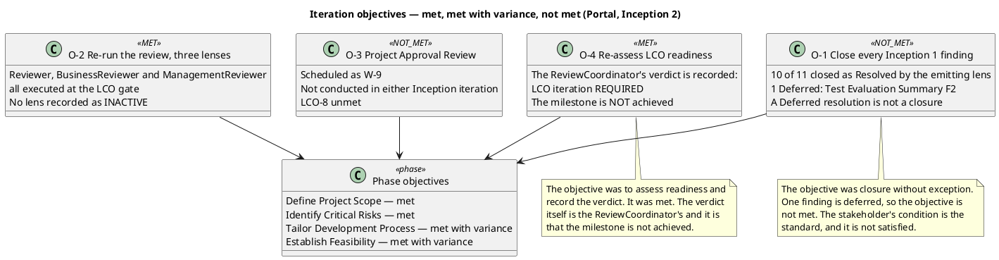
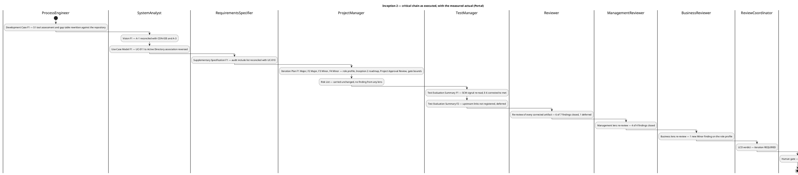
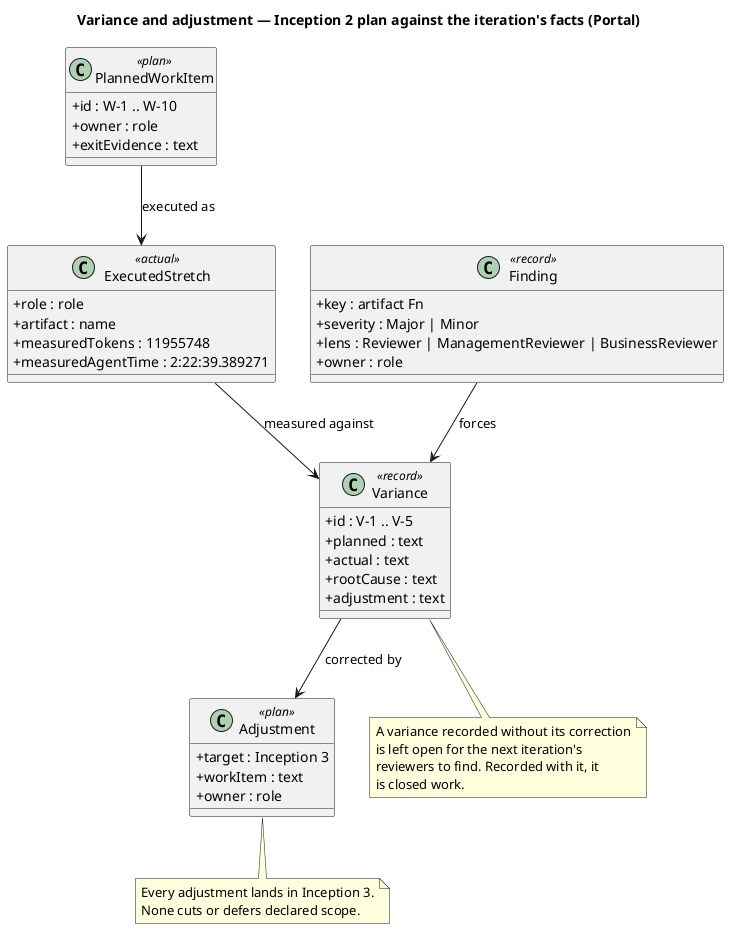

## Document Control
- **Phase:** Inception
- **Status:** Draft — under review
- **Milestone Target:** End of Inception (not yet achieved)
- **Iteration:** 2, Cycle 1
- **Owner:** ProjectManager
- **Date:** 2026-10-07
## Iteration Objectives Reached
The iteration's objectives were partly met. The milestone was not. Those are two different statements and this assessment keeps them apart: the objectives were to close the findings the first review raised, to re-run the review with all three lenses, to conduct the Project Approval Review and to re-assess LCO readiness; three of the four were met and one was not. The LCO verdict is the ReviewCoordinator's and it is that the iteration is required again.

| # | Objective | Verdict | Evidence |
|---|---|---|---|
| O-1 | Close every finding the Inception 1 review raised, minor ones included, across all eight artifacts. | **Not met** | Ten of the eleven findings are closed as Resolved by their emitting lenses. One is Deferred: Test Evaluation Summary#F2 — the declared upstream links are still not registered in the trace repository and the artifact is still absent from the Business-level trace tree. A Deferred resolution is not a closure: the defect stands and the gate counts the finding open. |
| O-2 | Re-run the review with all three lenses, the management lens included, at the LCO gate. | **Met** | Review Record entries from the Reviewer, the BusinessReviewer and the ManagementReviewer. No lens is recorded as INACTIVE; all three executed. |
| O-3 | Conduct the Project Approval Review ahead of the LCO verdict. | **Not met** | The Review Record's escalation table records it as scheduled (W-9) and not conducted in either Inception iteration, so LCO-8 is unmet. |
| O-4 | Re-assess LCO readiness against X-1 to X-5 on the corrected baseline and record the verdict. | **Met** | The ReviewCoordinator's verdict is recorded: LCO — iteration REQUIRED (scope incomplete). The milestone is not achieved. |

```plantuml
@startuml
title Iteration objectives — met, met with variance, not met (Portal, Inception 2)

skinparam classAttributeIconSize 0

class "O-1 Close every Inception 1 finding" as O1 <<NOT_MET>> {
  10 of 11 closed as Resolved by the emitting lens
  1 Deferred: Test Evaluation Summary F2
  A Deferred resolution is not a closure
}

class "O-2 Re-run the review, three lenses" as O2 <<MET>> {
  Reviewer, BusinessReviewer and ManagementReviewer
  all executed at the LCO gate
  No lens recorded as INACTIVE
}

class "O-3 Project Approval Review" as O3 <<NOT_MET>> {
  Scheduled as W-9
  Not conducted in either Inception iteration
  LCO-8 unmet
}

class "O-4 Re-assess LCO readiness" as O4 <<MET>> {
  The ReviewCoordinator's verdict is recorded:
  LCO iteration REQUIRED
  The milestone is NOT achieved
}

class "Phase objectives" as PH <<phase>> {
  Define Project Scope — met
  Identify Critical Risks — met
  Tailor Development Process — met with variance
  Establish Feasibility — met with variance
}

O1 --> PH
O2 --> PH
O3 --> PH
O4 --> PH

note bottom of O1
  The objective was closure without exception.
  One finding is deferred, so the objective is
  not met. The stakeholder's condition is the
  standard, and it is not satisfied.
end note

note bottom of O4
  The objective was to assess readiness and
  record the verdict. It was met. The verdict
  itself is the ReviewCoordinator's and it is
  that the milestone is not achieved.
end note
@enduml
```

**The phase objectives against the iteration objectives.** Define Project Scope is O-1 and O-4: the baseline is complete and the scope is agreed, but the review that certifies it is not clean. Identify Critical Risks is discharged by the Risk List, which carries no finding from any lens. Tailor Development Process is discharged by the Development Case, whose one Major finding was closed this iteration, and by the Iteration Plan, which carries one Minor finding open. Establish Feasibility is O-2, O-3 and O-4: the architecture is sound and the review ran with all three lenses, but the Project Approval Review was not conducted and the milestone was not sanctioned. No phase objective was left unaddressed; two are met with variance.
## Adherence to Plan
All ten fine-plan work items W-1 to W-10 were executed, in the planned order, each by its planned owner. The critical chain ran sequentially as planned and ended at the human gate. The plan's forecast discipline held: no work item carried a size, and the one spend figure quoted was the forecast built from Inception 1's measured actual.

```plantuml
@startuml
title Inception 2 — critical chain as executed, with the measured actual (Portal)

|ProcessEngineer|
start
:Development Case F1 — S1 tool assessment and gap table rewritten against the repository;
|SystemAnalyst|
:Vision F1 — A-1 reconciled with CON-035 and A-3;
:Use-Case Model F1 — UC-011 to Active Directory association reversed;
|RequirementsSpecifier|
:Supplementary Specification F1 — audit include list reconciled with UC-010;
|ProjectManager|
:Iteration Plan F1 Major, F2 Major, F3 Minor, F4 Minor — role profile, Inception 2 roadmap, Project Approval Review, gate bounds;
:Risk List — carried unchanged, no finding from any lens;
|TestManager|
:Test Evaluation Summary F1 — SCM signal re-read, E-6 corrected to met;
:Test Evaluation Summary F2 — upstream links not registered, deferred;
|Reviewer|
:Re-review of every corrected artifact — 6 of 7 findings closed, 1 deferred;
|ManagementReviewer|
:Management lens re-review — 4 of 4 findings closed;
|BusinessReviewer|
:Business lens re-review — 1 new Minor finding on the role profile;
|ReviewCoordinator|
:LCO verdict — iteration REQUIRED;
|Stakeholder|
:Human gate — LCO sanction;
note right
  Measured queue time 0:00:00.
  Reported apart from agent time.
  Never added to it.
end note
stop
@enduml
```

### Measured actuals — the first this project has

No phase had closed before this iteration, so no forecast existed and none was invented. Inception 1 is now the first closed phase, and these measured values replace every assumed share in every forecast made from here on. The two currencies are reported side by side and are never added.

| Quantity | Measured | Goal — the decision it enables |
|---|---|---|
| Token spend | 6,891,971 | Forecast Inception 2's spend. This is the first measured actual; it replaces the rubber profile's assumed share for Inception. |
| Agent elapsed time | 1:17:17.4186317 | Forecast the next iteration's agent time. |
| Human queue time | 0:00:00 | Detect whether a human gate has become the critical path. Excludes the end-of-iteration approval gate, which is not measured. |
| Artifacts produced | 9 | Check the Development Case's CORE set is being produced at the rate the plan assumes. |
| Agent invocations | 11 | Check the role profile against actual participation — the profile is a plan, and this is the first observation of it. |
| User interactions | 11 | Detect whether the stakeholder is on the critical path. |
| Average quality score | 10.0 | Detect a quality trend across iterations. **Not a substitute for the finding ledger** — eleven findings are open while this figure reads 10.0, so the figure does not measure review outcome and is not read as if it did. |

**No budget is set and none is proposed.** CON-034 declares no budget or cap on token spend and none is to be set by the team. Declared scope is never cut or deferred to fit an estimate.

### Variance against the plan

Five variances. Each is recorded with its root cause and the adjustment it forces in Inception 3, in the same breath — a variance recorded without its correction is left open for the next iteration's reviewers to find.

| # | Planned | Actual | Root cause | Adjustment in Inception 3 |
|---|---|---|---|---|
| V-1 | O-1: every Inception 1 finding closed, minor ones included. | Ten of eleven closed; Test Evaluation Summary#F2 Deferred with the defect standing. | The remedy for #F2 is the trace steward's act, not the artifact owner's, and the plan assigned the work item to the TestManager with the SystemAnalyst named only as an accessory. The owner who could perform the remedy was not the owner of the work item. | W-1 and W-2 assign the trace-registration work to the SystemAnalyst as trace steward, with the TestManager as the artifact owner. The two are separated so the work item's owner is the role that can close it. |
| V-2 | O-3: the Project Approval Review conducted ahead of the LCO verdict. | Not conducted in either Inception iteration; LCO-8 unmet. | The review-event framework was reconciled against the milestone sequence in Inception 2 and the review was scheduled as W-9, but W-9 was sequenced after the re-review and the iteration closed before it ran. The plan scheduled it; the iteration did not reach it. | W-7 sequences the Project Approval Review before the LCO verdict and after the re-review, and O-4 states it as an objective with the Review Record entry as its exit evidence. |
| V-3 | The role profile recorded the BusinessReviewer as non-participating in every iteration. | The business lens executed at this gate and raised one Minor finding. | The profile was built from the discipline intensity matrix, which records the discipline as inactive, without separating the discipline's inactivity from the lens's execution. | The role profile now records the BusinessReviewer as executing the business lens at I1, I2, I3, E2, C3 and T1, with the BusinessProcessAnalyst still non-participating. Iteration Plan#F1 (Minor). |
| V-4 | The plan forecast Inception 2's spend as "of the same order" as Inception 1's measured actual. | The measured actual is 1.73× in tokens and 1.85× in agent elapsed time. | The forecast treated the artifact surface as the cost driver. The actual cost driver is re-reading the accumulated surface to correct it, which grows with the number of iterations already closed, not with the number of artifacts. | The Inception 3 forecast is built from Inception 2's measured actual and states the growth mechanism explicitly, rather than from the artifact count. No per-stretch figure is derived from two observations. |
| V-5 | The plan's forecast rule: no spend figure before a phase closes. | The rule fired for the first time in Inception 1 and holds. | Not a variance — the rule working as designed. | None. The rule is unchanged and is applied to Inception 3. |

```plantuml
@startuml
title Variance and adjustment — Inception 2 plan against the iteration's facts (Portal)

skinparam classAttributeIconSize 0

class "PlannedWorkItem" as PWI <<plan>> {
  + id : W-1 .. W-10
  + owner : role
  + exitEvidence : text
}

class "ExecutedStretch" as EXE <<actual>> {
  + role : role
  + artifact : name
  + measuredTokens : 11955748
  + measuredAgentTime : 2:22:39.389271
}

class "Variance" as VAR <<record>> {
  + id : V-1 .. V-5
  + planned : text
  + actual : text
  + rootCause : text
  + adjustment : text
}

class "Finding" as FND <<record>> {
  + key : artifact Fn
  + severity : Major | Minor
  + lens : Reviewer | ManagementReviewer | BusinessReviewer
  + owner : role
}

class "Adjustment" as ADJ <<plan>> {
  + target : Inception 3
  + workItem : text
  + owner : role
}

PWI --> EXE : executed as
EXE --> VAR : measured against
FND --> VAR : forces
VAR --> ADJ : corrected by

note bottom of VAR
  A variance recorded without its correction
  is left open for the next iteration's
  reviewers to find. Recorded with it, it
  is closed work.
end note

note bottom of ADJ
  Every adjustment lands in Inception 3.
  None cuts or defers declared scope.
end note
@enduml
```

**No adjustment cuts or defers declared scope.** Every one of the five is a correction to the plan's own structure or to a statement about observable state. Declared scope is the stakeholder's to change, not the plan's.

### Measured actuals — the second closed iteration

Two iterations have now closed with a measured actual. The two currencies are reported side by side and are never added.

| Quantity | Inception 1 | Inception 2 | Goal — the decision it enables |
|---|---|---|---|
| Token spend | 6,891,971 | 11,955,748 | Forecast Inception 3's spend. The ratio 1.73× is the measured cost of correcting an accumulated artifact surface rather than authoring it. |
| Agent elapsed time | 1:17:17.4186317 | 2:22:39.389271 | Forecast the next iteration's agent time. The ratio 1.85× tracks the token ratio, so the two move together here. |
| Human queue time | 0:00:00 | 0:00:00 | Detect whether a human gate has become the critical path. It has not. Excludes the end-of-iteration approval gate, which is not measured. |
| Artifacts produced | 9 | 10 | Check the Development Case's CORE set is being produced at the rate the plan assumes. |
| Agent invocations | 11 | 11 | Check the role profile against actual participation. The profile is a plan, and this is the second observation of it. |
| User interactions | 11 | 10 | Detect whether the stakeholder is on the critical path. |
| Average quality score | 10.0 | 9.9 | Detect a quality trend across iterations. **Not a substitute for the finding ledger** — six findings are open while this figure reads 9.9, so the figure does not measure review outcome and is not read as if it did. |

**No budget is set and none is proposed.** CON-034 declares no budget or cap on token spend and none is to be set by the team. Declared scope is never cut or deferred to fit an estimate.

## Use Cases and Scenarios Implemented
**None.** Inception 2 produces no executable increment, so no use case is implemented and no scenario is executed. This is the correct state for the iteration, not a shortfall: the iteration's output is the corrected artifact scope and the risk record.

| UC | Source | This iteration | Implemented | Realization |
|---|---|---|---|---|
| UC-002 | FR-002 | Detailed | No | None — no executable increment exists |
| UC-004 | FR-004 | Detailed | No | None |
| UC-005 | FR-005 | Detailed | No | None |
| UC-010 | FR-010 | Detailed | No | None |
| UC-011 | FR-011 | Detailed | No | None |
| UC-001, UC-003, UC-006, UC-007, UC-008, UC-009, UC-012 | FR-001, FR-003, FR-006 to FR-009, FR-012 | Surveyed | No | None |

**Scenarios named for the TestDesigner.** The alternative flows that carry a risk or an invariant are the ones that must be covered from Elaboration 2: UC-002 A1 (duplicate press), A2 (network unreachable), A3 (clock-out with no open pair); UC-004 A1 (clock-out missing), A2 (day with no clocking), A3 (no category); UC-005 A1 (insertion for a day with no clocking), A2 (employee attempts a correction); UC-010 A1 (clearing the flag on the featured item), A2 (no item featured); UC-011 A1 (empty attribute), A2 (no category), A3 (network unreachable), A4 (no match). None was executed this iteration.
## Results Relative to Evaluation Criteria
### (a) This iteration's own exit criteria

| # | Exit criterion | Verdict | Evidence |
|---|---|---|---|
| X-1 | The requirements baseline is complete and reviewed: twelve declared requirements as twelve use cases, one-to-one, with no use case lacking a declared source, and no finding open against the Vision, the Use-Case Model or the Supplementary Specification. | **Not met** | Vision#F1, Use-Case Model#F1 and Supplementary Specification#F1 are closed. Supplementary Specification#F2 and its gate condition #F1 remain open: the declared element-level traceability is not registered in the trace repository, so the declared coverage cannot be verified from the graph. |
| X-2 | Every risk is classified with a strategy and an owner, and every accepted risk names the basis of its acceptance. | **Met** | Risk List persisted; R001 to R010 each carry strategy, owner, mitigation, contingency and an observable indicator; each accepted risk names its CON-024 basis. No finding from any lens. |
| X-3 | The coarse roadmap and this iteration's fine plan are composed, with no work item sized in a unit this system does not measure, and no finding open against the Iteration Plan. | **Not met** | The plan is composed and no work item carries a size. Iteration Plan#F1 (Minor) and its gate condition #F5 remain open: the role profile records the BusinessReviewer as non-participating while the business lens executed at this gate. |
| X-4 | The first-cut architecture confronts the highest-magnitude technical risks rather than deferring them. | **Met** | Software Architecture Document persisted, addressing R001, R003, R004 and R008. No finding from any lens. |
| X-5 | LCO readiness is re-assessed and the verdict recorded, with no finding open against any artifact. | **Not met** | The verdict is recorded — LCO, iteration REQUIRED — but six findings remain open, so the second half of the criterion is not satisfied. |

### (b) Declared acceptance criteria

All six are accounted for. **None is addressed this iteration** — no executable increment exists, so no acceptance criterion is closable. Each is deferred to a named iteration with the evidence that will close it.

| AC | Criterion | This iteration | Deferred to | Evidence that will close it |
|---|---|---|---|---|
| AC-001 | The performance criterion is the full page load as the employee experiences it, including the clocking page's script. | Not addressed — no executable exists. | Construction 1 | A measured full page load on the corporate network, browser request to page displayed and usable. |
| AC-002 | An employee can clock in and out without help from HR or the development team. | Not addressed — no executable exists. | Construction 1 | UC-002 exercised end to end with no assistance. |
| AC-003 | An HR Administrator can publish a news item without technical assistance. | Not addressed — no executable exists. | Construction 2 | UC-006 exercised end to end with no assistance. |
| AC-004 | Any employee finds a colleague's phone/email in under 10 seconds. | Not addressed — no executable exists. | Construction 2 | UC-011 exercised against the stand-in directory; re-verified against the real AD after the Elaboration gate. |
| AC-005 | 80% of employees complete at least one clocking with no prior training. | Not addressed — no executable exists. | Transition 1 | Adoption measured against the declared population of 200 after go-live. |
| AC-006 | A clocking made while the corporate network is down for up to 5 minutes is not lost. | Not addressed — no executable exists. | Construction 1 | UC-002 A2 exercised with the network down for the full window. |

## Test Results
**No test was executed.** No executable increment exists, so no test case was authored, no scenario was run and no pass rate exists to report. None is invented.

The Test Evaluation Summary's mission verdict is that the requirements baseline is **verifiable** — every declared requirement, acceptance criterion and non-functional requirement has a stated, observable verification method, and no requirement was found untestable. That verdict is met on its own scope, which was verifiability, not verification.

**SCM signal, read directly this iteration.** Build on `main`: `ci-run-37588755525` — success, 2026-10-07 07:40:14Z to 07:41:20Z. The repository carries scaffolding only — a solution, two empty projects, a CI workflow, a README and the mandatory design reference. No productive code is present, which is consistent with Inception scope.

**One correction the Test Evaluation Summary still owes.** That artifact's SCM quality signals table records the issue tracker as holding no issue open or closed, while Issue #1 is open and the artifact's own Traceability section cites it as the tracking reference for its unregistered links. The artifact states the issue exists in one section and that no issue exists in another. That is Test Evaluation Summary#F3, owned by the TestManager; this assessment records the observed value and does not correct another role's artifact.

**Defect register.** No defect is recorded. No test was executed, so there is no deviation from declared behaviour to record. A defect register with no entries is the correct state for this iteration — it is not evidence of quality and is not reported as such.
## External Changes
| Change | Recorded as |
|---|---|
| The stakeholder refused the LCO sanction a second time. | Stakeholder sanction: REFUSED. The gate is held, not opened. The remedy is another iteration (CON-026), and the stakeholder's own words name the standard: the findings from each iteration must be closed, without exception. |
| The stakeholder directed that findings must not be left uncorrected and unclosed, and that it is acceptable for more to emerge. | The closure of the six open findings is a condition on the LCO re-assessment, and Inception 3 is the iteration that carries it. This is the substance of variance V-1 and V-2. |
| The stakeholder confirmed that all doubts have been cleared up and that the findings need to be corrected. | No open scope question remains. The declared scope is unchanged and is not cut or deferred by anything in this assessment. |
| No Change Request was raised. | No scope change. No new declared input. |
| No external system was contacted. | The real Keycloak and the real Active Directory were not touched, which is the declared working method (CON-035). |
## Rework Required

Eleven findings are open: 0 Critical, 5 Major, 6 Minor. Every one is correctable within Inception and none requires a Change Request — each restores an artifact's agreement with the declared scope, with observable state, or with the gate structure, and none changes declared scope.

| Finding | Severity | Owner | Rework | Iteration |
|---|---|---|---|---|
| Iteration Plan#F2 | Major | ProjectManager | Add Inception 2 to the coarse roadmap with a fine plan closing every open finding; re-assess X-1 to X-5 there. | Inception 2 |
| Iteration Plan#F1 | Major | ProjectManager | Add ManagementReviewer to the role profile for I1, E2 and C3, with the verdict at LCO, LCA and IOC. | Inception 2 |
| Development Case#F1 | Major | ProcessEngineer | Rewrite the S1 tool assessment and the gap table against the repository; remove the CI workflow from the Elaboration checkpoint's outstanding conditions. | Inception 2 |
| Test Evaluation Summary#F1 | Major | TestManager | Replace the cited run id and window with the observed build; correct the reading of E-6 to met. | Inception 2 |
| Test Evaluation Summary#F2 | Major | TestManager, with SystemAnalyst as trace steward | Register the artifact's upstream links in the trace repository so its declared coverage is machine-verifiable. | Inception 2 |
| Iteration Plan#F3 | Minor | ProjectManager | Schedule the Project Approval Review ahead of the LCO re-assessment, or record the determination that it does not apply with its basis. | Inception 2 |
| Supplementary Specification#F1 | Minor | RequirementsSpecifier | Reconcile the audit mechanism's include list with UC-010's audit step. | Inception 2 |
| Use-Case Model#F1 | Minor | SystemAnalyst | Reverse the UC-011 to Active Directory association so the portal is the initiating end. | Inception 2 |
| Vision#F1 | Minor | SystemAnalyst | Reconcile A-1 with CON-035 and A-3. | Inception 2 |
| Iteration Plan#F1 | Minor | ProjectManager | Remove the duration from the roadmap chart, or state the nominal unit inside the chart. | Inception 2 |
| Iteration Plan#F4 | Minor | ProjectManager | Report the 14-day process bound on all three human gates, with measured queue time apart from agent time. | Inception 2 |

**Rework is not measured in a human-team unit.** No phase had closed before this iteration, so no measured actual existed; the first one now does. Rework performed in Inception 2 is reported in tokens and in measured elapsed time, split into agent time and human queue time, and the two are never added.

**Two artifacts require no rework.** The Software Architecture Document and the Risk List carry no finding from any lens and are approved. Silence is the verdict.

**Closure discipline.** A finding is closed only by the lens that emitted it. The seven findings of the Reviewer's lens are closed by the Reviewer; the four of the ManagementReviewer's lens by the ManagementReviewer. A statement in this assessment that a finding is resolved does not close it.

## Traceability

| Element | Traces From | Link Type | Traces To |
|---|---|---|---|
| Iteration Assessment | Iteration Plan | Refines | Risk List |
| Iteration Assessment | R001, R002, R003, R004, R005, R006, R007, R008, R009, R010 | Refines | Risk List |
| Iteration Assessment | UC-001, UC-002, UC-003, UC-004, UC-005, UC-006, UC-007, UC-008, UC-009, UC-010, UC-011, UC-012 | Refines | Use-Case Model |
| Iteration Assessment | AC-001, AC-002, AC-003, AC-004, AC-005, AC-006 | Refines | Test Case |
| Iteration Assessment | NFR-001, NFR-002, NFR-003, NFR-004, NFR-005 | Refines | Supplementary Specification |
| Iteration Assessment | CON-023, CON-024, CON-026, CON-034 | Refines | Development Case |
| Iteration Assessment | BG-001, BG-002, BG-003 | Refines | Vision |
| Iteration Assessment | `ci-run-37583334371` | DependsOn | — |

**Reading the table.** `Traces From` is the artifact or declared input this assessment is accountable to — the plan it assesses, the risks it carries forward, the use cases and criteria it reports on, and the constraints that govern its own measurement and risk policy. `Traces To` is the artifact that will carry the elements this assessment specifies: the Risk List, whose entries this assessment carries forward unchanged, and the Test Case artifact, which is empty this iteration because no use-case realization exists to test against. The `ci-run-37583334371` row is the observed build the Test Results section rests on.

**No business-level element appears in this table.** There is no `BUC-NNN` and no `BR-NNN` to trace, because the Business Modeling discipline is inactive for the whole project (Development Case T-1) and no such element was created. The absence is the verdict, not a gap.
