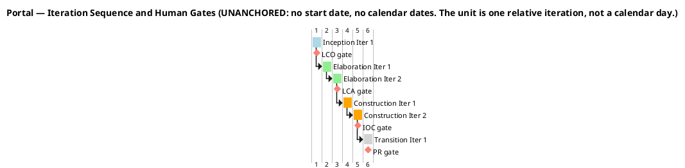
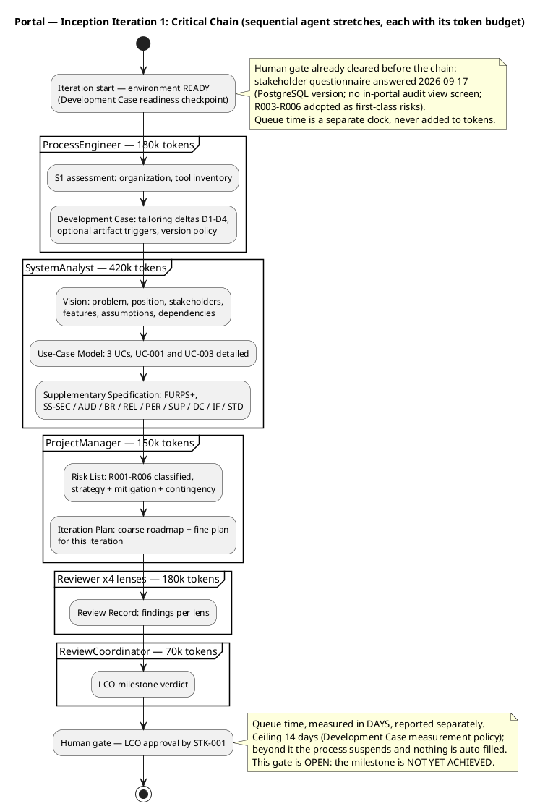

## Document Control

| Field | Value |
|---|---|
| Artifact | Iteration Plan — Portal (Employee Portal, Cuba Corp) |
| Phase | Inception |
| Status | Draft — produced for review; milestone NOT YET ACHIEVED |
| Milestone Target | End-of-Inception (LCO) — not marked complete by this artifact |
| Iteration / Cycle | 1 / 1 |
| Owner | ProjectManager |
| Date | 2026-09-17 |
| Governing process | Development Case (Inception) — cost-boxed iterations; two currencies, never summed |
| Evolution this iteration | Initial plan created. Carries the coarse cross-iteration roadmap (LCO → LCA → IOC → PR) and the fine plan for Inception Iteration 1. All six risks are cited by identifier: R001 and R002 from the declared scope, and R003–R006 adopted as first-class risks on the stakeholder's decision of 2026-09-17. |

**Two levels, one artifact.** *Plan and Milestones* carries both: the **coarse roadmap** (the milestone sequence and the iteration boundaries, cross-iteration) and the **fine plan** (this iteration's work items, owners and token budgets, bounded by the iteration's budget box). The coarse level narrates across iterations; the fine level stays inside this iteration's box. They are not mixed.

**Two currencies, never summed.** Agent work is denominated in **tokens** and in **measured elapsed time**. Human gates are denominated in **days of queue time** — waiting, not working. The two are reported side by side and are never added, and neither is converted into the other. No figure in this plan is expressed in person-weeks, person-days, person-months, calendar weeks or story points: this system does not measure those units.

## Iteration Objectives

**Inception Iteration 1 — establish the project and reach the Lifecycle Objectives milestone.**

| # | Objective | Verifiable outcome |
|---|---|---|
| O1 | Establish the requirements baseline for the declared scope | Vision, Use-Case Model and Supplementary Specification exist and place every declared FR-NNN, NFR-NNN, CON-NNN, STK-NNN, BG-NNN and AC-NNN |
| O2 | Identify and classify the project's risks, and sequence the iterations to confront them | Risk List carries all six risks (R001–R006) with probability, impact, exposure, magnitude, strategy, mitigation and contingency; the highest-magnitude risk is scheduled into the iteration that confronts it |
| O3 | Compose the coarse cross-iteration roadmap and the fine plan for this iteration | This artifact: milestone sequence LCO → LCA → IOC → PR, iteration boundaries, agent role profile, and this iteration's work items inside its budget box |
| O4 | Assess Lifecycle Objectives (LCO) readiness | The ReviewCoordinator's LCO verdict, given the reviewers' findings — the milestone is **NOT YET ACHIEVED** and is not marked complete by this artifact |

**What this iteration deliberately does NOT do.** It produces no executable. Inception's increment is a *decision-ready baseline*: a scope the stakeholders can agree on, a risk register that sequences the work, and a plan. No code, no architecture baseline, no test execution. The Architectural Proof-of-Concept that confronts R001 is an **Elaboration** deliverable (Development Case delta D2) — it is scheduled, not performed here.

## Plan and Milestones

### Coarse roadmap — milestone sequence and iteration boundaries

**Total: 6 iterations.** Within the 6 ± 3 rule (fewer than 3 signals insufficient risk exposure; more than 9 signals over-engineering the process overhead).

| Milestone | Closed by | Exit criteria |
|---|---|---|
| **LCO** — Lifecycle Objectives | Inception Iter 1 | Stakeholders agree on the scope; the project is viable; initial risks are identified and classified. |
| **LCA** — Lifecycle Architecture | Elaboration Iter 2 | The architecture is baselined; **R001 is confronted empirically** by the Architectural Proof-of-Concept reading the real AD attributes across the 3 offices; **R003, R004 and R006 are discharged** in the UC-001 and UC-002 realizations; the UC-001 and UC-003 realizations are stable. |
| **IOC** — Initial Operational Capability | Construction Iter 2 | All three use cases are implemented and integrated; AC-001..AC-005 are testable against a running system. |
| **PR** — Product Release | Transition Iter 1 | The product is released and handed over to the Infrastructure team (CON-011); the development team's operational duty ends; **R002 is measured** against BG-003 and AC-004. |

| Phase | Iterations | Count | Rubber-profile starting point | Adjustment and justification |
|---|---|---|---|---|
| Inception | 1 | 1 | ~5% → 0.3 | **Raised to 1** — a phase cannot hold a fractional iteration; 1 is the floor. The scope is already declared and closed, so no scope-discovery iteration is needed. |
| Elaboration | 1–2 | 2 | ~20% → 1.2 | **Stretched to 2** — R001 (High, exposure 9) requires *empirical* validation that design reasoning cannot supply, and the Development Case fired the Architectural Proof-of-Concept trigger on exactly that basis (delta D2). The AD/LDAP boundary is the project's dominant technical risk and the portal holds no local copy of the employee (CON-020), so a gap in AD has no fallback. R003, R004 and R006 are also discharged here. |
| Construction | 1–2 | 2 | ~65% → 3.9 | **Compressed to 2** — the artifact surface is small (3 use cases, 14 FRs, 4 NFRs); there is no data migration (CON-012), no Keycloak work (CON-005), no backup design (CON-014), no permission model (CON-016) and no category-management screen (CON-023); and the UI design is already supplied and mandated (CON-013), so Construction carries no UI discovery work. |
| Transition | 1 | 1 | ~10% → 0.6 | **Raised to 1** — the floor. Compressed because deployment is internal and single-node on the existing Windows Server estate (CON-007), and AC-004 requires that no prior training be needed. |

**The rubber profile is a starting point for ITERATION COUNT only.** It is not a budget split. The budget split across phases is **measured**, not assumed: the moment one phase closes, its recorded token spend and elapsed time replace every assumed share in every forecast made afterwards. No phase has closed yet, so no measured actual exists and no phase-level budget share is asserted here.

**Why this Gantt is unanchored.** No project start date and no calendar date appears in it. A date computed from an estimate reads downstream as an observation, and nothing here has been measured. The unit is one relative iteration. Human gates are quoted in days of queue time in the table below, separately from agent work.

### Human gates — the second currency

| Gate | Where | What is being waited on | Unit | Ceiling |
|---|---|---|---|---|
| Stakeholder questionnaire | Before Inception Iter 1's chain | STK-001's answers on the PostgreSQL version, on whether an in-portal audit view screen is needed, and on adopting R003–R006 as first-class risks | days of queue time | 14 days |
| **LCO approval** | End of Inception Iter 1 | STK-001's agreement that the scope is right and the project is viable | days of queue time | 14 days |
| LCA approval | End of Elaboration Iter 2 | STK-001's acceptance of the baselined architecture | days of queue time | 14 days |
| IOC approval | End of Construction Iter 2 | STK-001's acceptance that the system is operational | days of queue time | 14 days |
| PR acceptance | End of Transition Iter 1 | STK-003's acceptance of the handover | days of queue time | 14 days |

**A gate is a risk, not an estimate.** The 14-day ceiling is the Development Case measurement policy: beyond it the process suspends and nothing is auto-filled. Gate queue time is carried as **R005** in the Risk List. The questionnaire gate was cleared on 2026-09-17; the LCO gate is **OPEN** — the milestone is not yet achieved.

### Fine plan — Inception Iteration 1

**The budget box.** The iteration is bounded by a fixed token budget; the scope adapts to fill the box, and the box does not grow to fit the scope. No phase has closed, so no measured actual exists and the box is an explicit assumption with its basis named:

> **Inception Iteration 1 box: 1,000,000 tokens** — `[ASSUMPTION — basis: 8 work items across 5 agent roles, producing 7 artifacts; the dominant cost driver is re-reading the accumulating artifact surface, not emitting text. No phase has closed, so no measured actual exists to replace this figure. It is replaced by the measured Inception spend the moment this phase closes.]`

| WI | Work item | Owner | Deliverable | Token budget |
|---|---|---|---|---|
| WI-1 | S1 assessment; Development Case tailoring (deltas D1–D4, optional triggers, version policy) | ProcessEngineer | Development Case | 180,000 |
| WI-2 | Problem, position, stakeholders, features, assumptions, dependencies | SystemAnalyst | Vision | 150,000 |
| WI-3 | Three use cases identified; UC-001 and UC-003 detailed (the architecturally significant ones) | SystemAnalyst | Use-Case Model | 150,000 |
| WI-4 | FURPS+ categories; every declared NFR and constraint placed | SystemAnalyst | Supplementary Specification | 120,000 |
| WI-5 | Identify, classify and plan mitigation for all six risks | ProjectManager | Risk List | 80,000 |
| WI-6 | Coarse roadmap + this iteration's fine plan | ProjectManager | Iteration Plan | 70,000 |
| WI-7 | Review across four lenses | Reviewer | Review Record | 180,000 |
| WI-8 | LCO milestone verdict | ReviewCoordinator | Review Record | 70,000 |
| | **Total committed** | | | **1,000,000** |

**Box compliance.** The eight work items sum to exactly the box. Nothing is promised beyond it. Work that does not fit the box goes to the next iteration's backlog rather than extending this one — and the only item deliberately held back is the **Iteration Assessment**, which is produced at iteration close *after* the ReviewCoordinator's verdict, not before it.

**No work item exists for Keycloak, for a data migration, for a backup design, or for a permission model.** Each is excluded by a declared constraint (CON-005, CON-012, CON-014, CON-016) and the Development Case records each as a project-specific process rule so that no discipline role creates one.

### Critical chain — sequential agent stretches to the gate

**Depth of the chain: five sequential agent stretches** from iteration start to the gate — ProcessEngineer → SystemAnalyst → ProjectManager → Reviewer → ReviewCoordinator. The chain is sequential, not parallel, because each stretch consumes the previous one's artifact surface: the SystemAnalyst's requirements are the ProjectManager's planning input, and the reviewers read what all three produced. Adding agent roles to this chain would multiply coordination overhead and artifact contention without shortening it — the chain's length is set by the dependency order, not by the number of agents.

## Resources

### Agent role profile

| Role | Engaged this iteration | Artifacts produced | Token budget | Share of box |
|---|---|---|---|---|
| ProcessEngineer | Yes | Development Case | 180,000 | 18% |
| SystemAnalyst | Yes | Vision, Use-Case Model, Supplementary Specification | 420,000 | 42% |
| ProjectManager | Yes | Risk List, Iteration Plan | 150,000 | 15% |
| Reviewer (4 lenses) | Yes | Review Record | 180,000 | 18% |
| ReviewCoordinator | Yes | Review Record (LCO verdict) | 70,000 | 7% |
| **Total** | | | **1,000,000** | **100%** |

**Roles deliberately NOT engaged.** `BusinessProcessAnalyst` and `BusinessReviewer` are not engaged: Business Modeling is INACTIVE (Development Case delta D1, `business-process-led = false`), so no Business Use-Case Model and no Business Rules artifact is produced. The remaining roles of the 25-role roster are engaged in later phases as their discipline intensity rises.

**Why the SystemAnalyst holds 42% of the box.** The requirements baseline is this iteration's product, and it is the artifact surface every later phase re-reads. The dominant cost driver in this system is re-reading the accumulated artifact surface, not emitting text — so the iteration that creates the surface the whole project reads is correctly the most expensive one.

**Parallelism discipline.** No additional agent role is added to this iteration. The critical chain is sequential and its length is fixed by dependency order; more agents would add context conflicts and artifact contention without shortening the chain. If this iteration overruns its box, the remedy is **scope reduction** — fewer use cases detailed, or a thinner review lens set — not more agents.

### Budget split across the role profile

The split above is the **assumed** profile for this iteration, derived from the work items each role owns. It is not a measured actual. The Development Case measurement policy governs what is recorded and what decision each figure enables:

| Measured quantity | Decision it enables | Read by |
|---|---|---|
| Tokens consumed this iteration | Whether the box is spent, and therefore whether scope bends to the box | ProjectManager, at iteration close |
| Elapsed **agent** time | Whether a discipline is consuming disproportionate agent time, and therefore whether its workflow should be simplified | ProjectManager; ProcessEngineer when it drives a process change |
| Elapsed **human queue** time (days) | Whether a gate is becoming a schedule risk, and therefore whether it must be bounded (R005) | ProjectManager; ProcessEngineer |

No velocity is quoted, no per-iteration figure is recorded as a trend, and the two clocks are never added.

## Use Cases and Scenarios Addressed

**The iteration's scope is a named set of use cases, not a paraphrase.** All three declared use cases are in scope for this iteration — at Inception's depth, which is *identified and detailed*, not implemented.

| UC | Name | Source | This iteration's treatment | Scenarios addressed this iteration | Deferred |
|---|---|---|---|---|---|
| UC-001 | Clocking | FR-001, FR-002, FR-003, FR-004, FR-012, FR-014 | **Detailed** — architecturally significant (the only client-side mechanism; client timestamp, idempotency key and 5-minute window cross the boundary — **R003**) | Main flow; A1 duplicate press; A2 network lost at press; A3 network lost beyond 5 minutes; A4 HR corrects or inserts; A5 HR views all clockings; A6 HR exports the month; A7 own history; E1 token invalid; E2 identity unresolvable | Realization and implementation → Elaboration Iter 1–2, Construction |
| UC-002 | News | FR-005, FR-006, FR-007, FR-008, FR-009 | **Surveyed** with its scenarios — partly architecturally significant (CON-018's "at most one featured" is a declared system invariant — **R004**) | Main flow; A1 edit; A2 feature an existing item; A3 un-feature and leave none; A4 unpublish; A5 read and filter; A6 no connection; E1 token invalid; E2 non-HR attempt | Realization and implementation → Elaboration Iter 2, Construction |
| UC-003 | Employee Directory | FR-010, FR-011, FR-013 | **Detailed** — architecturally significant (the AD/LDAP boundary carries **R001**, exposure 9, and there is no local copy of the employee) | Main flow; A1 HR assigns or clears a category; A2 employee with no category; A3 no connection; E1 AD unreachable; E2 AD attribute missing; E3 non-HR attempt | Realization and implementation → Elaboration Iter 1–2, Construction |

**Why UC-001 and UC-003 are detailed first.** They carry the project's architectural risk. UC-003 sits on the AD/LDAP boundary where R001 lives; UC-001 carries the only client-side mechanism in the product (FR-012) and the only place a client-supplied timestamp crosses the boundary (R003). UC-002 is surveyed because its risk is a design invariant (CON-018, R004) rather than an unknown — it is confronted in Elaboration, not deferred to Construction.

**No use case is added, split or promoted.** Three declared use cases, three in the model. There is no per-actor split (each UC has two primary actors interacting with the *same* declared process) and no cross-cutting mechanism promoted to a use case — authentication (CON-005), the audit trail (NFR-004) and the no-connection handling (FR-013) are Supplementary Specification constraints, and there is deliberately no `UC-AUTH`, no `UC-LOG` and no `UC-SYNC`.

## Evaluation Criteria

Two layers, kept apart: **(a)** every declared acceptance criterion, cited by identifier, addressed this iteration or deferred to a named iteration; **(b)** this iteration's own exit criteria.

### (a) Declared acceptance criteria — AC-001 .. AC-005

Every AC-NNN in the declared scope appears below. None is absent. Inception does not *verify* an acceptance criterion — verification needs a running system — so each is **addressed this iteration by being made testable** in the requirements baseline, and **deferred for verification** to a named iteration.

| AC | Criterion | Addressed this iteration as | Verified in |
|---|---|---|---|
| AC-001 | An employee can clock in and out without help from HR or the development team | Made testable: SS-USA-06 (no HR or developer involvement in the clocking path); UC-001 main flow and A7 | Construction Iter 2 (IOC) |
| AC-002 | An HR Administrator can publish a news item without technical assistance | Made testable: SS-USA-07 (publishing requires no developer, no deployment, no database access); UC-002 main flow | Construction Iter 2 (IOC) |
| AC-003 | Any employee finds a colleague's phone/email in under 10 seconds | Made testable: SS-USA-04 (contact data appears in the search result list itself, not behind a second click); UC-003 main flow. **Carries R001** — if the AD attribute is empty, the field shows empty | Construction Iter 2 (IOC) |
| AC-004 | 80% of employees complete at least one clocking with no prior training | Made testable: SS-USA-05 (the clocking action is reachable and unambiguous from the main screen); UC-001 main flow | Transition Iter 1 (PR) — measured against BG-003 and **R002** |
| AC-005 | A clocking made while the corporate network is down for up to 5 minutes is not lost; beyond 5 minutes the employee reports the clocking to HR | Made testable: SS-REL-02 (5-minute retry, client-supplied timestamp, idempotency key); UC-001 A2 and A3. **Carries R003** | Construction Iter 2 (IOC) |

**No acceptance criterion is invented.** The declared scope carries exactly five, and all five are above. No criterion is added for the audit trail, for the worker category or for the featured invariant — those are verified through the Test Case and Test Evaluation Summary artifacts against SS-AUD-01..SS-AUD-07, SS-BR-05 and SS-BR-08, not through a new AC.

### (b) This iteration's own exit criteria

| # | Exit criterion | Evidence |
|---|---|---|
| X1 | Every declared input is placed in the requirements baseline — no FR-NNN, NFR-NNN, CON-NNN, STK-NNN, BG-NNN or AC-NNN is unplaced | Vision, Use-Case Model and Supplementary Specification coverage checks |
| X2 | Every risk is classified with probability, impact, exposure, magnitude, strategy, mitigation and contingency; the highest-magnitude risk is scheduled into the iteration that confronts it | Risk List — all six risks R001–R006 classified; R001 (High) scheduled into Elaboration |
| X3 | The coarse roadmap and the fine plan both exist, and the fine plan sums within the iteration's budget box | This artifact — 8 work items summing to 1,000,000 tokens |
| X4 | The iteration's scope is a named set of use cases, and no use case is added, split or promoted | This artifact — UC-001, UC-002, UC-003 |
| X5 | The reviewers have ruled and the ReviewCoordinator has issued the LCO verdict | Review Record — **pending; the milestone is NOT YET ACHIEVED** |

**X5 is the gate.** This artifact does not close the iteration and does not mark the milestone. The Iteration Assessment is produced at iteration close, *after* the ReviewCoordinator's verdict, and records the assessment given that verdict.

## Traceability

| Element | Traces From | Link Type | Traces To |
|---|---|---|---|
| Iteration Plan | STK-001, STK-002, STK-003, STK-004 | Derives | Iteration Assessment |
| Iteration Plan | BG-001, BG-002, BG-003 | Derives | Iteration Assessment |
| Iteration Plan | AC-001, AC-002, AC-003, AC-004, AC-005 | Derives | Test Evaluation Summary |
| Iteration Plan | UC-001, UC-002, UC-003 | Derives | Design Model |
| Iteration Plan | R001, R002, R003, R004, R005, R006 | Derives | Iteration Assessment |
| Iteration Plan | R001 | Derives | Architectural Proof-of-Concept |
| Iteration Plan | R003, R004, R006 | Derives | Design Model |
| Iteration Plan | CON-005, CON-012, CON-014, CON-016 | Derives | Development Case |
| Iteration Plan | CON-007, CON-011, CON-013 | Derives | Release Notes |
| Iteration Plan | NFR-001, NFR-002, NFR-003, NFR-004 | Derives | Test Case |

**All six risks are cited by identifier.** R001 and R002 come from the declared scope. R003–R006 were identified by the ProjectManager and adopted as first-class risks on the stakeholder's decision of 2026-09-17 ("Adopt all four as first-class risks and assign them identifiers"), which is the authority that authorises their identifiers. Each is scheduled into the iteration that confronts it: R001, R003, R004 and R006 in Elaboration; R002 in Transition; R005 monitored every iteration.
