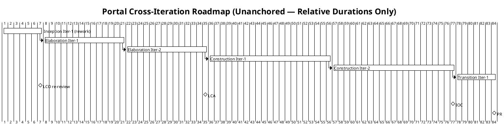
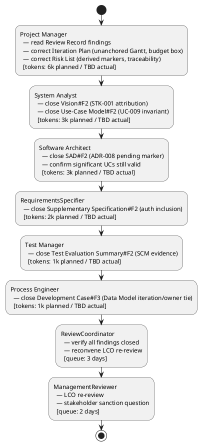

## Document Control

| Field | Value |
|---|---|
| Project | Portal |
| Phase | Inception |
| Iteration | 2 |
| Status | Draft |
| Milestone Target | End-of-Inception review (LCO re-review after findings closed) |

## Iteration Objectives

1. Close all open Review Record findings on Project Manager-owned artifacts (Iteration Plan, Risk List, Iteration Assessment) and on co-owned artifacts where the Project Manager contributes (Vision STK-001 attribution).
2. Update the Iteration Plan to comply with the two-currency measurement discipline: unanchored Gantt, token budget box with planned vs actual distinction, and human gate queue time reported separately.
3. Update the Risk List to mark R003-R008 as derived from declared scope elements (FR/NFR/CON) or as project-management inferences, and to fix traceability to existing artifacts.
4. Prepare the project for LCO re-review: all artifact owners close their findings, ReviewCoordinator confirms zero open findings, ManagementReviewer reconvenes the LCO gate.
5. Do NOT advance to Elaboration until stakeholder sanction is granted at the re-reviewed LCO gate.

## Plan and Milestones

### Coarse Roadmap

### Milestone Sequence

| Milestone | Target Phase/Iteration | Purpose |
|---|---|---|
| LCO — Lifecycle Objectives | End of Inception Iter-1 rework | Stakeholders agree on scope; project viable; initial risks identified; zero open findings. |
| LCA — Lifecycle Architecture | End of Elaboration Iter-2 | Architectural baseline established; highest risks retired. |
| IOC — Initial Operational Capability | End of Construction Iter-2 | System functionally complete; ready for beta deployment. |
| PR — Product Release | End of Transition Iter-1 | System deployed and handed over to Infrastructure team. |

### Iteration Count Justification

- **Total iterations: 6** (within the 6 ± 3 rule).
- **Inception: 1** (~17% of iterations; above the 5% rubber profile because the declared scope is mature and the priority is to confirm viability and risks, not to stretch discovery).
- **Elaboration: 2** (~33% of iterations; justified by architectural risks R001, R003, R005, R007 and the need to retire them before Construction).
- **Construction: 2** (~33% of iterations; implements the 12 use cases in risk-priority order).
- **Transition: 1** (~17% of iterations; internal Windows Server deployment and handover to Infrastructure team).

### Fine Plan — Inception Iteration 2 (Rework)

| Work Item | Owner | Token Budget (Planned) | Token Budget (Actual) | Output / Evidence |
|---|---|---|---|---|
| Read Review Record and identify PM-owned findings | Project Manager | 1k | TBD | Findings A-002..A-005 mapped to Iteration Plan / Risk List / Iteration Assessment |
| Correct Iteration Plan: unanchored Gantt, budget box, evaluation criteria mapping | Project Manager | 3k | TBD | This Iteration Plan updated; no absolute dates; planned vs actual columns |
| Correct Risk List: derivation markers, R003 mitigation note, R006 traceability | Project Manager | 2k | TBD | Risk List updated; R003-R008 marked as derived; R006 traces to SAD Deployment View |
| Close Vision#F2 (STK-001 attribution to AD "HR" group role) | System Analyst / Project Manager | 2k | TBD | Vision §Stakeholder Summary updated |
| Close Use-Case Model#F2 (UC-009 featured invariant wording) | System Analyst | 1k | TBD | UC-009 main flow step 7 reworded per CON-019 |
| Close SAD#F2 (ADR-008 pending decision marker) | Software Architect | 2k | TBD | ADR-008 marked [PENDING — Elaboration decision] |
| Confirm architecturally significant UCs | Software Architect | 1k | TBD | UC-003, UC-007, UC-008, UC-012 remain drivers |
| Close Supplementary Specification#F2 (authorization inclusion consistency) | RequirementsSpecifier | 2k | TBD | Cross-cutting mechanisms table updated |
| Close Test Evaluation Summary#F2 (SCM evidence vs zeroed defect table) | Test Manager | 1k | TBD | TES references CI build / PR state |
| Close Development Case#F3 (Data Model trigger iteration/owner tie) | Process Engineer | 1k | TBD | Data Model production tied to Elaboration Iter-1 / DatabaseDesigner |
| Verify all findings closed and reconvene LCO re-review | ReviewCoordinator | — | — | queue: 3 days; zero open findings confirmed |
| LCO re-review and stakeholder sanction | ManagementReviewer | — | — | queue: 2 days; stakeholder asked again for sanction |

**Iteration budget box: 16k tokens planned + 5 days human gate queue time.**

> **Measurement note:** Actual token spend will be recorded in the Iteration Assessment after the iteration closes. The 16k planned figure is an assumption based on the previous iteration's measured actual (3,338,736 tokens) and the rework scope; it will be replaced by measured actuals for forecasting in the next plan.

## Resources

### Agent Role Profile

| Role | Responsibility in this iteration | Token Share (Planned) |
|---|---|---|
| Project Manager | Close PM-owned findings; update Iteration Plan, Risk List, Iteration Assessment | 6k |
| System Analyst | Close Vision#F2 and Use-Case Model#F2 | 3k |
| Software Architect | Close SAD#F2; confirm significant UCs | 3k |
| RequirementsSpecifier | Close Supplementary Specification#F2 | 2k |
| Test Manager | Close Test Evaluation Summary#F2 | 1k |
| Process Engineer | Close Development Case#F3 | 1k |
| ReviewCoordinator | Verify findings closed; schedule LCO re-review | 3 days queue |
| ManagementReviewer | LCO re-review; stakeholder sanction question | 2 days queue |

### Human Gate Queue Time

| Gate | Stakeholder | Queue Time | Purpose |
|---|---|---|---|
| LCO re-review readiness verification | ReviewCoordinator | 3 days | Confirm all findings closed; package artifacts for re-review |
| LCO re-review / stakeholder sanction | STK-001, STK-002, STK-003 | 2 days | Reconfirm scope, viability, risk ownership; ask sanction question |

## Use Cases and Scenarios Addressed

This iteration does not implement use cases; it closes findings against the planning baseline. The following use cases are referenced for scope confirmation and risk assessment:

| Use Case | Source | Addressed This Iteration | Evidence |
|---|---|---|---|
| UC-001 Assign Worker Category | FR-001 | Scope confirmed | Listed in Use-Case Model; risk R007 covers category invariant |
| UC-002 Clear Worker Category | FR-002 | Scope confirmed | Listed in Use-Case Model |
| UC-003 Clock In / Clock Out | FR-003, NFR-007 | Scope confirmed; architecturally significant | Detailed in Use-Case Model; risk R005 covers retry edge cases |
| UC-004 View Own Clocking History | FR-004 | Scope confirmed | Listed in Use-Case Model |
| UC-005 View All Employee Clockings | FR-005 | Scope confirmed | Listed in Use-Case Model |
| UC-006 Export Monthly Clocking Report | FR-006 | Scope confirmed | Listed in Use-Case Model |
| UC-007 Correct or Insert Clocking | FR-007, CON-020 | Scope confirmed; architecturally significant | Detailed in Use-Case Model |
| UC-008 Publish News Item | FR-008, CON-019 | Scope confirmed; architecturally significant | Detailed in Use-Case Model; risk R007 covers featured invariant |
| UC-009 Edit News Item | FR-009 | Finding closure | Use-Case Model#F2: featured invariant wording corrected |
| UC-010 Unpublish News Item | FR-010 | Scope confirmed | Listed in Use-Case Model |
| UC-011 Browse and Filter News | FR-011 | Scope confirmed | Listed in Use-Case Model |
| UC-012 Search Corporate Directory | FR-012, CON-010 | Scope confirmed; architecturally significant | Detailed in Use-Case Model; risk R001 covers AD attribute gaps |

## Evaluation Criteria

### Declared Acceptance Criteria Mapping

| ID | Criterion | Addressed This Iteration | Evidence / Iteration |
|---|---|---|---|
| AC-001 | An employee can clock in and clock out without help from HR or the development team. | Deferred to Construction | Will be verified by test cases in Construction |
| AC-002 | An HR Administrator can publish a news item without technical assistance. | Deferred to Construction | Will be verified by test cases in Construction |
| AC-003 | Any employee finds a colleague's phone or email in under 10 seconds. | Deferred to Elaboration/Construction | Prototype directory read in Elaboration Iter-1; performance verified in Construction |
| AC-004 | 80% of employees complete at least one clocking with no prior training. | Deferred to Transition | Adoption measured post-deployment |
| AC-005 | A clocking made while the corporate network is down for up to 5 minutes is not lost; localStorage retry + idempotency key. | Deferred to Construction | Design validated in Elaboration; acceptance test in Construction |

### This Iteration's Exit Criteria

1. Iteration Plan updated with unanchored Gantt, token budget box with planned vs actual columns, and human gate queue time reported separately.
2. Risk List updated with R003-R008 marked as derived from declared scope elements or project-management inference; R003 notes CON-005 as scope-level mitigation; R006 traceability points to SAD Deployment View / Transition planning.
3. Vision STK-001 attribution corrected: Laura Gómez is project sponsor only; HR capabilities belong to AD "HR" group role.
4. Use-Case Model UC-009 featured invariant wording aligned with CON-019.
5. SAD ADR-008 marked as [PENDING — Elaboration decision].
6. Supplementary Specification authorization inclusion table consistent: Authentication included from UC-001..UC-012; Authorization included from UC-001, UC-002, UC-005..UC-010; Audit included from UC-001, UC-002, UC-007..UC-010.
7. Test Evaluation Summary references SCM evidence (CI build / PR state) rather than a zeroed defect table.
8. Development Case Data Model trigger tied to Elaboration Iteration 1 / DatabaseDesigner.
9. ReviewCoordinator confirms zero open Critical, Major, and Minor findings.
10. LCO re-review held; stakeholder sanction question asked again.

## Traceability

| Element | Traces From | Link Type | Traces To |
|---|---|---|---|
| Iteration Plan | BG-001, BG-002, BG-003 | Refines | Risk List |
| Iteration Plan | FR-001..FR-012 | Refines | UC-001..UC-012 |
| Iteration Plan | NFR-001..NFR-008 | Refines | Supplementary Specification |
| Iteration Plan | AC-001..AC-005 | Refines | Evaluation Criteria |
| Iteration Plan | R001..R008 | DependsOn | Risk List |
| Iteration Plan | Review Record Findings | Refines | Iteration Assessment |
