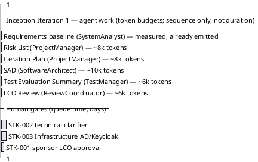
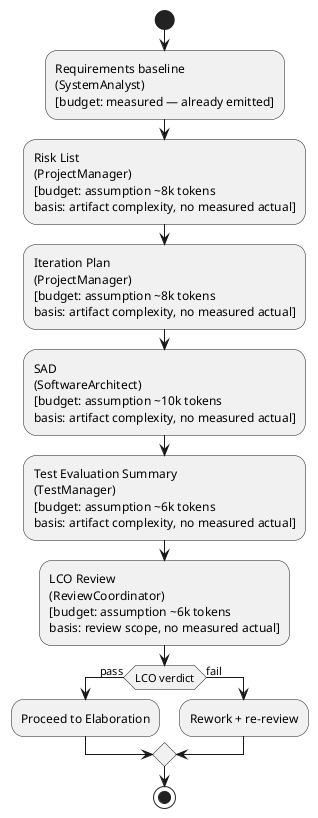

## Document Control

| Field | Value |
|---|---|
| Phase | Inception |
| Status | Draft |
| Milestone Target | End-of-Inception (Lifecycle Objectives) — NOT YET ACHIEVED |

## Iteration Objectives

1. Establish the project baseline: Vision, Use-Case Model, Supplementary Specification, Development Case, Software Architecture Document, and Test Evaluation Summary are produced and internally consistent (Requirements + Environment + Analysis & Design + Test disciplines).
2. Produce the Risk List and this Iteration Plan (Project Management discipline).
3. Retire the highest-magnitude risks as far as Inception permits: R001 (AD attribute consistency) and R003 (human-gate queue time) are surfaced and bound, not deferred.
4. Reach the Lifecycle Objectives (LCO) milestone: stakeholders agree on scope, the project is viable, and initial risks are identified — decided by the ReviewCoordinator's milestone verdict, not by this plan.

## Plan and Milestones

### Coarse cross-iteration roadmap

| Milestone | Phase | Iteration | Exit criterion |
|---|---|---|---|
| LCO — Lifecycle Objectives | Inception | 1 | Scope agreed, viability confirmed, initial risks identified |
| LCA — Lifecycle Architecture | Elaboration | 2–3 | Architecture baseline stable; R001 retired; UC-001/UC-008 realized |
| IOC — Initial Operational Capability | Construction | 4–6 | All 12 UCs implemented and integrated |
| PR — Product Release | Transition | 7 | Handover to Infrastructure (CON-011); adoption vs BG-003 |

**Iteration count rationale (6 ± 3 rule):** 7 iterations total — [1, 2, 3, 1]. Elaboration is stretched to 2 iterations because R001 (AD integration) and the two architecturally significant UCs (UC-001, UC-008) must be retired before Construction. Construction is 3 iterations to absorb the 12 Must UCs in risk-ordered batches. Transition is 1 iteration (internal deployment, no user-training-heavy rollout beyond the R002 communication plan). This is a starting profile, subject to measured actuals once Inception closes.

### This iteration (Inception Iter-1) — fine plan

**Cost-box (total token budget for this iteration):** The iteration's total agent-work budget is **~38k tokens** (assumption), the sum of the per-stretch token budgets above — Risk List ~8k + Iteration Plan ~8k + SAD ~10k + Test Evaluation Summary ~6k + LCO Review ~6k. The Requirements baseline stretch is already emitted and is measured, not assumed; it is excluded from the box because its spend is recorded, not forecast. **Basis for the assumption:** no phase has closed yet, so no measured token actual exists; the per-stretch figures are sized by artifact complexity and review scope. This box is the iteration's stop condition — scope bends to the box, not the reverse. The moment Inception closes, its recorded token spend and elapsed time replace every assumed share in the Elaboration forecast. Agent work is quoted in tokens + measured elapsed time; human gates are quoted separately in days of queue time — the two are never summed.

## Resources

| Agent role | Discipline | Inception assignment |
|---|---|---|
| SystemAnalyst | Requirements | Vision, Use-Case Model, Supplementary Specification (emitted) |
| ProjectManager | Project Management | Risk List, Iteration Plan (this turn) |
| SoftwareArchitect | Analysis & Design | Software Architecture Document (candidate SAD emitted in Inception Iter-1) |
| TestManager | Test | Test Evaluation Summary (emitted in Inception Iter-1) |
| ReviewCoordinator | Review | LCO milestone verdict |
| ProcessEngineer | Environment | Development Case (emitted) |
| BusinessProcessAnalyst / BusinessReviewer | Business Modeling | Dormant (discipline INACTIVE per DC) |

**Budget split (assumption, no measured actual yet):** Requirements ~40%, Project Management ~20%, Analysis & Design ~15%, Test ~10%, Review ~15%. This split is an explicit assumption and will be replaced by the measured shape once Inception closes.

## Use Cases and Scenarios Addressed

This iteration addresses the **requirements baseline** (all 12 UCs surveyed) rather than implementing any. Two UCs are detailed to retire architectural risk:

- **UC-001 Clock In/Out** — detailed (forces CON-021 client-timestamp + idempotency, AC-005 offline retry).
- **UC-008 Search Directory** — detailed (forces CON-007 AD on-demand projection, surfaces R001).

Remaining UCs (UC-002…UC-007, UC-009…UC-012) are outlined; their flows are detailed in Elaboration.

## Evaluation Criteria

**Layer (a) — declared acceptance criteria (AC-NNN), each addressed this iteration or deferred to a named iteration:**

| AC | Disposition this iteration |
|---|---|
| AC-001 | Deferred to Construction (UC-001 implementation) — not verifiable in Inception |
| AC-002 | Deferred to Construction (UC-003 implementation) |
| AC-003 | Deferred to Construction (UC-008 implementation); R001 must be retired in Elaboration first |
| AC-004 | Deferred to Transition (adoption measurement vs BG-003) |
| AC-005 | Deferred to Construction (UC-001 offline-retry implementation) |

**Layer (b) — this iteration's own exit criteria (LCO readiness):**

1. Vision, Use-Case Model, Supplementary Specification, Development Case, Software Architecture Document, Test Evaluation Summary, Risk List, and Iteration Plan all exist and are internally consistent.
2. All 12 UCs trace to declared FRs; all 21 constraints and 5 NFRs are captured.
3. R001 and R003 are classified with mitigation + contingency (Risk List).
4. The ReviewCoordinator issues an LCO milestone verdict.

## Traceability

| Element | Traces From | Link Type | Traces To |
|---|---|---|---|
| Iteration Plan (Inception Iter-1) | BG-001, BG-002, BG-003 | DependsOn | LCO milestone |
| UC-001 (detailed) | FR-001, CON-021, AC-005 | Derives | Elaboration realization |
| UC-008 (detailed) | FR-008, CON-007, R001 | Derives | Elaboration realization |
| R001 | CON-007, FR-008 | DependsOn | Software Architecture Document |
| R003 | STK-003, CON-006, CON-010 | DependsOn | human gates |
