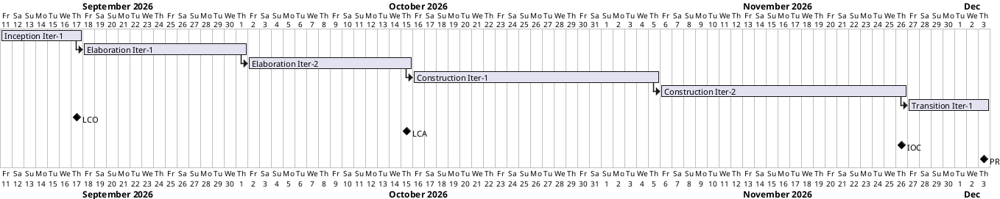
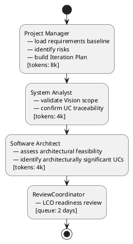

## Document Control

| Field | Value |
|---|---|
| Project | Portal |
| Phase | Inception |
| Iteration | 1 |
| Status | Draft |
| Milestone Target | End-of-Inception review (LCO) |

## Iteration Objectives

1. Establish the project management baseline: risk list, iteration plan, and coarse cross-iteration roadmap.
2. Confirm the requirements baseline is complete and traceable to the declared scope (FR-001..FR-012, NFR-001..NFR-008, AC-001..AC-005, CON-001..CON-021, BG-001..BG-003).
3. Validate that the four architecturally significant use cases identified in the Use-Case Model (UC-003, UC-007, UC-008, UC-012) cover the highest technical risks.
4. Assess readiness for the Lifecycle Objectives (LCO) milestone: stakeholders agree on scope, project is viable, initial risks are identified and owned.

## Plan and Milestones

### Coarse Roadmap

### Milestone Sequence

| Milestone | Target Phase/Iteration | Purpose |
|---|---|---|
| LCO — Lifecycle Objectives | End of Inception Iter-1 | Stakeholders agree on scope; project viable; initial risks identified. |
| LCA — Lifecycle Architecture | End of Elaboration Iter-2 | Architectural baseline established; highest risks retired. |
| IOC — Initial Operational Capability | End of Construction Iter-2 | System functionally complete; ready for beta deployment. |
| PR — Product Release | End of Transition Iter-1 | System deployed and handed over to Infrastructure team. |

### Iteration Count Justification

- **Total iterations: 6** (within the 6 ± 3 rule).
- **Inception: 1** (~17% of iterations; above the 5% rubber profile because the declared scope is mature and the priority is to confirm viability and risks, not to stretch discovery).
- **Elaboration: 2** (~33% of iterations; justified by architectural risks R001, R003, R005, R007 and the need to retire them before Construction).
- **Construction: 2** (~33% of iterations; implements the 12 use cases in risk-priority order).
- **Transition: 1** (~17% of iterations; internal Windows Server deployment and handover to Infrastructure team).

### Fine Plan — Inception Iteration 1

| Work Item | Owner | Token Budget | Output / Evidence |
|---|---|---|---|
| Load requirements baseline and confirm traceability | Project Manager | 2k | Vision, Use-Case Model, Supplementary Specification read; no missing declared scope |
| Identify and classify initial risks | Project Manager | 3k | Risk List with 8 risks, magnitudes, owners, mitigations |
| Compose coarse roadmap and fine plan | Project Manager | 3k | This Iteration Plan with Gantt + critical-chain diagrams |
| Validate Vision scope and UC traceability | System Analyst | 2k | Confirmed FR-001..FR-012 map to UC-001..UC-012 |
| Confirm supplementary requirements coverage | System Analyst | 2k | NFRs and constraints reflected in Supplementary Specification |
| Assess architectural feasibility and significant UCs | Software Architect | 4k | Confirmation that UC-003, UC-007, UC-008, UC-012 are the right architectural drivers |
| LCO readiness review | ReviewCoordinator | queue: 2 days | Verdict on whether Inception can close |

**Iteration budget box: 16k tokens + 2 days human gate queue time.**

## Resources

### Agent Role Profile

| Role | Responsibility in this iteration | Token Share |
|---|---|---|
| Project Manager | Risk identification, iteration planning, milestone tracking | 8k |
| System Analyst | Scope validation, requirements traceability confirmation | 4k |
| Software Architect | Architectural feasibility assessment, significant-UC validation | 4k |
| ReviewCoordinator | LCO readiness review gate | 2 days queue |

### Human Gate Queue Time

| Gate | Stakeholder | Queue Time | Purpose |
|---|---|---|---|
| LCO readiness review | STK-001, STK-002, STK-003 | 2 days | Confirm scope, viability, risk ownership |

## Use Cases and Scenarios Addressed

This iteration does not implement use cases; it validates the planning baseline against them. The following use cases are referenced for scope confirmation and risk assessment:

| Use Case | Source | Addressed This Iteration | Evidence |
|---|---|---|---|
| UC-001 Assign Worker Category | FR-001 | Scope confirmed | Listed in Use-Case Model; risk R007 covers category invariant |
| UC-002 Clear Worker Category | FR-002 | Scope confirmed | Listed in Use-Case Model |
| UC-003 Clock In / Clock Out | FR-003, NFR-007 | Scope confirmed; architecturally significant | Detailed in Use-Case Model; risk R005 covers retry edge cases |
| UC-004 View Own Clocking History | FR-004 | Scope confirmed | Listed in Use-Case Model |
| UC-005 View All Employee Clockings | FR-005 | Scope confirmed | Listed in Use-Case Model |
| UC-006 Export Monthly Clocking Report | FR-006 | Scope confirmed | Listed in Use-Case Model |
| UC-007 Correct or Insert Clocking | FR-007, CON-020 | Scope confirmed; architecturally significant | Detailed in Use-Case Model |
| UC-008 Publish News Item | FR-008, CON-019 | Scope confirmed; architecturally significant | Detailed in Use-Case Model; risk R007 covers featured invariant |
| UC-009 Edit News Item | FR-009 | Scope confirmed | Listed in Use-Case Model |
| UC-010 Unpublish News Item | FR-010 | Scope confirmed | Listed in Use-Case Model |
| UC-011 Browse and Filter News | FR-011 | Scope confirmed | Listed in Use-Case Model |
| UC-012 Search Corporate Directory | FR-012, CON-010 | Scope confirmed; architecturally significant | Detailed in Use-Case Model; risk R001 covers AD attribute gaps |

## Evaluation Criteria

### Declared Acceptance Criteria

| ID | Criterion | Addressed This Iteration | Evidence / Iteration |
|---|---|---|---|
| AC-001 | Employee can clock in/out without HR/dev help | Deferred to Construction | Will be verified by test cases in Construction |
| AC-002 | HR Administrator can publish news without technical assistance | Deferred to Construction | Will be verified by test cases in Construction |
| AC-003 | Employee finds colleague phone/email in under 10 seconds | Deferred to Elaboration/Construction | Prototype directory read in Elaboration Iter-1 |
| AC-004 | 80% of employees complete at least one clocking with no prior training | Deferred to Transition | Adoption measured post-deployment |
| AC-005 | Clocking survives up to 5-minute network outage via localStorage retry + idempotency | Deferred to Construction | Design validated in Elaboration |

### This Iteration's Exit Criteria

1. Risk List persisted with all risks classified by probability, impact, magnitude, strategy, owner, mitigation, and contingency.
2. Iteration Plan persisted with coarse roadmap, fine plan, resource profile, and budget box.
3. Requirements baseline (Vision, Use-Case Model, Supplementary Specification) confirmed traceable to declared scope.
4. LCO readiness review scheduled with STK-001, STK-002, STK-003.

## Traceability

| Element | Traces From | Link Type | Traces To |
|---|---|---|---|
| Iteration Plan | BG-001, BG-002, BG-003 | Refines | Risk List |
| Iteration Plan | FR-001..FR-012 | Refines | UC-001..UC-012 |
| Iteration Plan | NFR-001..NFR-008 | Refines | Supplementary Specification |
| Iteration Plan | AC-001..AC-005 | Refines | Evaluation Criteria |
| Iteration Plan | R001..R008 | DependsOn | Risk List |
