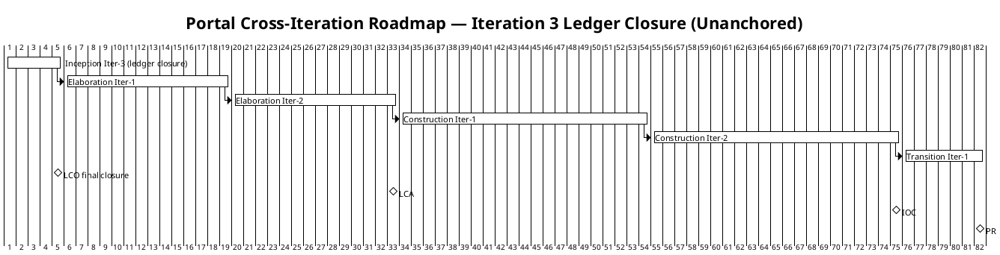
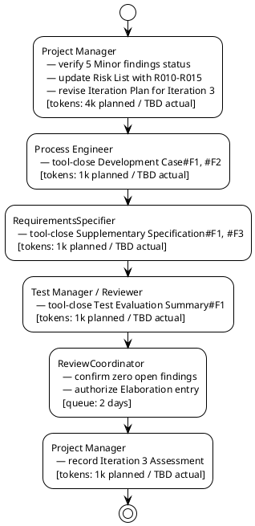

## Document Control

| Field | Value |
|---|---|
| Project | Portal |
| Phase | Inception |
| Iteration | 3 |
| Status | Draft |
| Milestone Target | LCO final closure / Elaboration entry readiness |

## Iteration Objectives

1. **Verify tool-closure of the 5 remaining Minor Review Record findings** (A-020..A-024) that are verified addressed in artifact content but still open in the ledger. These findings are owned by Process Engineer, RequirementsSpecifier, and Test Manager/Reviewer; the Project Manager tracks them as pre-conditions for Elaboration entry.
2. **Update the Risk List** with Elaboration environment-gate risks R010-R015 introduced by the Development Case in Inception Iteration 3, ensuring every Development Case gate has a corresponding risk owner and mitigation.
3. **Confirm Elaboration entry readiness:** zero open Critical, Major, and Minor findings; Development Case optional triggers and environment gates assigned to owners; coarse roadmap validated against measured actuals from Iteration 2.
4. **Do NOT advance to Elaboration** until the ReviewCoordinator confirms all findings are tool-closed and the stakeholder's conditional LCO sanction is fully satisfied.

## Plan and Milestones

### Coarse Roadmap

### Milestone Sequence

| Milestone | Target Phase/Iteration | Purpose |
|---|---|---|
| LCO — Lifecycle Objectives | End of Inception Iter-3 | Stakeholders agree on scope; project viable; zero open findings; initial risks identified. |
| LCA — Lifecycle Architecture | End of Elaboration Iter-2 | Architectural baseline established; highest risks retired. |
| IOC — Initial Operational Capability | End of Construction Iter-2 | System functionally complete; ready for beta deployment. |
| PR — Product Release | End of Transition Iter-1 | System deployed and handed over to Infrastructure team. |

### Iteration Count Justification

- **Total iterations: 6** (within the 6 ± 3 rule).
- **Inception: 1** reworked into 3 ledger-closure passes (~50% of elapsed time so far because of the LCO refusal and close-all-findings directive; iteration count remains within the rule).
- **Elaboration: 2** (~33% of iterations; justified by architectural risks R001, R003, R005, R007 and the need to retire them before Construction).
- **Construction: 2** (~33% of iterations; implements the 12 use cases in risk-priority order).
- **Transition: 1** (~17% of iterations; internal Windows Server deployment and handover to Infrastructure team).

### Fine Plan — Inception Iteration 3 (Ledger Closure)

| Work Item | Owner | Token Budget (Planned) | Token Budget (Actual) | Output / Evidence |
|---|---|---|---|---|
| Verify status of A-020..A-024 and map to Elaboration readiness | Project Manager | 1k | TBD | Updated Iteration Plan; risk of delayed closure recorded |
| Update Risk List with R010-R015 (Development Case Elaboration gates) | Project Manager | 2k | TBD | Risk List §Risk Register includes gate-derived risks |
| Revise Iteration Plan for Iteration 3 ledger-closure scope | Project Manager | 1k | TBD | This Iteration Plan |
| Tool-close Development Case#F1 (Optional Trigger Evaluation diagram labels) | Process Engineer | 0.5k | TBD | Development Case §Optional Artifact Triggers updated |
| Tool-close Development Case#F2 (CONTRIBUTING.md / CI gaps as Elaboration gates) | Process Engineer | 0.5k | TBD | Development Case §Guidelines and Procedures updated |
| Tool-close Supplementary Specification#F1 (REQ-P003 Elaboration decomposition note) | RequirementsSpecifier | 0.5k | TBD | Supplementary Specification §REQ-P003 updated |
| Tool-close Supplementary Specification#F3 (REQ-SU003 backup confirmation citation) | RequirementsSpecifier | 0.5k | TBD | Supplementary Specification §REQ-SU003 updated |
| Tool-close Test Evaluation Summary#F1 (Reviewer/ReviewCoordinator confirmation) | Test Manager / Reviewer | 1k | TBD | Test Evaluation Summary §Verdict updated |
| Confirm zero open findings and authorize Elaboration entry | ReviewCoordinator | — | — | queue: 2 days; zero open findings confirmed |
| Record Iteration 3 Assessment | Project Manager | 1k | TBD | Iteration Assessment updated |

**Iteration budget box: 8k tokens planned + 2 days human gate queue time.**

> **Measurement note:** Actual token spend will be recorded in the Iteration Assessment after the iteration closes. The 8k planned figure is an assumption based on the previous iteration's measured actual (2,922,388 tokens) and the reduced ledger-closure scope; it will be replaced by measured actuals for forecasting in the next plan.

## Resources

### Agent Role Profile

| Role | Responsibility in this iteration | Token Share (Planned) |
|---|---|---|
| Project Manager | Verify finding status; update Risk List and Iteration Plan; record Iteration Assessment | 4k |
| Process Engineer | Tool-close Development Case#F1, #F2 | 1k |
| RequirementsSpecifier | Tool-close Supplementary Specification#F1, #F3 | 1k |
| Test Manager / Reviewer | Tool-close Test Evaluation Summary#F1 | 1k |
| ReviewCoordinator | Confirm zero open findings; authorize Elaboration entry | 2 days queue |

### Human Gate Queue Time

| Gate | Stakeholder | Queue Time | Purpose |
|---|---|---|---|
| Final ledger-closure verification | ReviewCoordinator | 2 days | Confirm all 5 remaining Minor findings are tool-closed; package artifacts for LCO final closure |
| LCO final closure / Elaboration authorization | STK-001, STK-002, STK-003 | 0 days (async) | Confirm conditional sanction is satisfied; no new question required unless findings remain |

## Use Cases and Scenarios Addressed

This iteration does not implement use cases; it closes the Inception ledger and prepares for Elaboration. The following use cases are referenced for scope confirmation and risk assessment:

| Use Case | Source | Addressed This Iteration | Evidence |
|---|---|---|---|
| UC-001 Assign Worker Category | FR-001 | Scope confirmed | Listed in Use-Case Model; risk R007 covers category invariant |
| UC-002 Clear Worker Category | FR-002 | Scope confirmed | Listed in Use-Case Model |
| UC-003 Clock In / Clock Out | FR-003, NFR-007 | Scope confirmed; architecturally significant | Detailed in Use-Case Model; risk R005 covers retry edge cases |
| UC-004 View Own Clocking History | FR-004 | Scope confirmed | Listed in Use-Case Model |
| UC-005 View All Employee Clockings | FR-005 | Scope confirmed | Listed in Use-Case Model |
| UC-006 Export Monthly Clocking Report | FR-006 | Scope confirmed | Listed in Use-Case Model |
| UC-007 Correct or Insert Clocking | FR-007, CON-020 | Scope confirmed; architecturally significant | Detailed in Use-Case Model |
| UC-008 Publish News Item | FR-008, CON-019 | Scope confirmed; architecturally significant | Detailed in Use-Case Model; risk R007 covers featured invariant |
| UC-009 Edit News Item | FR-009 | Scope confirmed | Use-Case Model#F2 closed in Iteration 2 |
| UC-010 Unpublish News Item | FR-010 | Scope confirmed | Listed in Use-Case Model |
| UC-011 Browse and Filter News | FR-011 | Scope confirmed | Listed in Use-Case Model |
| UC-012 Search Corporate Directory | FR-012, CON-010 | Scope confirmed; architecturally significant | Detailed in Use-Case Model; risk R001 covers AD attribute gaps |

## Evaluation Criteria

### Declared Acceptance Criteria Mapping

| ID | Criterion | Addressed This Iteration | Evidence / Iteration |
|---|---|---|---|
| AC-001 | An employee can clock in and clock out without help from HR or the development team. | Deferred to Construction | Will be verified by test cases in Construction |
| AC-002 | An HR Administrator can publish a news item without technical assistance. | Deferred to Construction | Will be verified by test cases in Construction |
| AC-003 | Any employee finds a colleague's phone or email in under 10 seconds. | Deferred to Elaboration/Construction | Prototype directory read in Elaboration Iter-1; performance verified in Construction |
| AC-004 | 80% of employees complete at least one clocking with no prior training. | Deferred to Transition | Adoption measured post-deployment |
| AC-005 | A clocking made while the corporate network is down for up to 5 minutes is not lost; localStorage retry + idempotency key. | Deferred to Construction | Design validated in Elaboration; acceptance test in Construction |

### This Iteration's Exit Criteria

1. Review Record shows zero open Critical, Major, and Minor findings (A-020..A-024 tool-closed by their owners).
2. Risk List includes R010-R015 derived from Development Case Elaboration gates E1-G1..E1-G6, each with owner, mitigation, and contingency.
3. Iteration Plan reflects Iteration 3 scope, budget box, and human gate queue time.
4. Development Case optional triggers and environment gates are assigned to owners and tracked in Risk List.
5. ReviewCoordinator confirms Elaboration entry readiness.
6. LCO final closure achieved; no Elaboration work begins until this criterion is met.

## Traceability

| Element | Traces From | Link Type | Traces To |
|---|---|---|---|
| Iteration Plan | BG-001, BG-002, BG-003 | Refines | Risk List |
| Iteration Plan | FR-001..FR-012 | Refines | UC-001..UC-012 |
| Iteration Plan | NFR-001..NFR-008 | Refines | Supplementary Specification |
| Iteration Plan | AC-001..AC-005 | Refines | Evaluation Criteria |
| Iteration Plan | R001..R015 | DependsOn | Risk List |
| Iteration Plan | Development Case §Elaboration Gates | DependsOn | Risk List R010..R015 |
| Iteration Plan | Review Record Findings A-020..A-024 | Refines | Iteration Assessment |
