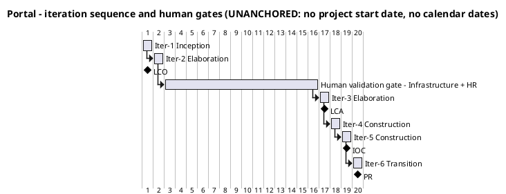
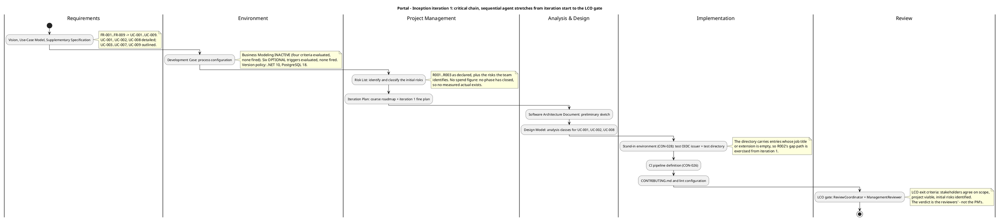

## Document Control

- **Phase:** Inception
- **Status:** Draft — iteration 1, not yet reviewed
- **Milestone Target:** Lifecycle Objectives (LCO) — end of Inception. NOT YET ACHIEVED.

## Iteration Objectives

Iteration 1 is the Inception iteration. It is a mini-project, not a requirements phase: it produces a verifiable increment — the agreed requirements baseline, the process configuration that governs the project, and the initial risk register — and it is closed by the LCO gate.

| # | Objective | Evidence that closes it |
|---|---|---|
| 1 | Establish the agreed scope as a named set of use cases | Use-Case Model: UC-001..UC-009, one per declared FR-001..FR-009; UC-001, UC-002 and UC-008 detailed, the remaining six outlined |
| 2 | Establish the non-functional and business-rule baseline | Supplementary Specification: NFR-001..NFR-005 and CON-009..CON-019 |
| 3 | Configure the process that governs the project | Development Case: Business Modeling inactive, no OPTIONAL trigger fired, version policy .NET 10 / PostgreSQL 18 |
| 4 | Identify and classify the initial risks | Risk List: R001..R009 with probability, impact, magnitude, strategy, owner, mitigation and contingency |
| 5 | Make the project's principal process control real | Stand-in environment (CON-028): a test OIDC issuer and a test directory carrying the declared attributes, including entries whose job title or extension is empty |
| 6 | Make the build verifiable | CI pipeline definition (CON-026) and the guideline files the Development Case references |

**What this iteration does NOT do.** It does not implement a use case, does not verify an acceptance criterion, and does not close a milestone. The LCO verdict belongs to the ReviewCoordinator and the ManagementReviewer; this plan produces the evidence they rule on.

## Plan and Milestones

### Coarse roadmap — milestone sequence and iteration boundaries

Six iterations, distributed [1, 2, 2, 1] across Inception, Elaboration, Construction and Transition. The count is a starting point bent to this project's risk profile, and it is re-planned at every iteration from the measured spend and elapsed time of the phases that have closed (CON-027) — never from a theoretical capacity.

**Why the profile is bent this way.** Inception is one iteration, not a fraction of one: the declared baseline is unusually rich (9 FRs, 5 NFRs, 32 constraints, 6 acceptance criteria) and the stand-in boundary must be established before any use case can be built. Elaboration takes two iterations because the architecture baseline must be established *and* the CON-028 human validation feedback from Infrastructure with HR must arrive before LCA closes. Construction is compressed to two iterations because the scope is genuinely small — nine use cases, two entities the portal owns (clockings, news) plus one link table, no data migration (CON-030), no distributed topology, and a stack pinned by CON-022/CON-023/CON-024 so there is no architectural exploration to fund. Transition is one iteration because there is no user training programme (AC-005 requires no prior training) and no data migration, but the handover to Infrastructure (CON-029) is real work.

| Milestone | Closes at | The decision it gates | Evidence the reviewers rule on |
|---|---|---|---|
| LCO — Lifecycle Objectives | End of Iter-1 (Inception) | Do the stakeholders agree on the scope, is the project viable, are the initial risks identified? | Vision, Use-Case Model, Supplementary Specification, Development Case, Risk List, this Iteration Plan |
| LCA — Lifecycle Architecture | End of Iter-3 (Elaboration) | Is the architecture baseline stable enough to build on? | Software Architecture Document, Design Model, and the CON-028 validation feedback from Infrastructure with HR |
| IOC — Initial Operational Capability | End of Iter-5 (Construction) | Is the product complete enough to operate? | AC-001, AC-004 and AC-006 verified; all nine use cases implemented and tested |
| PR — Product Release | End of Iter-6 (Transition) | Is the product ready for handover to Infrastructure (CON-029)? | AC-002, AC-003 and AC-005 verified; Release Notes; User Documentation |

| Iteration | Phase | Objective | Use cases | Exit criteria |
|---|---|---|---|---|
| Iter-1 | Inception | Agreed scope, process configuration, initial risk register | UC-001, UC-002, UC-008 detailed; UC-003..UC-007, UC-009 outlined | The six objectives above; LCO readiness assessed |
| Iter-2 | Elaboration | Establish the architecture baseline and open the human validation gate | UC-001, UC-002, UC-008 | Architecture baseline demonstrable against the stand-ins; the AC-006 retry designed; the CON-028 gate opened |
| Iter-3 | Elaboration | Close the architecture baseline on the validation feedback; design the remaining six use cases | UC-003..UC-007, UC-009 | LCA: the architecture is stable enough to build on |
| Iter-4 | Construction | Build and test the clocking and news increments | UC-001..UC-007 | AC-001, AC-002, AC-003, AC-006 verified |
| Iter-5 | Construction | Build and test the directory increment; harden; reach IOC | UC-008, UC-009 | AC-004 verified; all nine use cases implemented and tested |
| Iter-6 | Transition | Hand over to Infrastructure; make adoption measurable | all nine | AC-005 measurable from the recorded clockings; PR |

**The human gate is not an iteration.** The CON-028 validation of the real Keycloak and real AD is performed by Infrastructure with HR, outside the team's control. It is bounded at 14 days of queue time, after which the process suspends (Development Case measurement policy). It is reported in days of queue time, apart from agent time, and the two are never added into one figure. If it delays a milestone, the remedy is another iteration (CON-021) — never a cut to declared scope.

### Fine plan — Inception iteration 1 work items

No work item below carries a size. No phase has closed, so no measured actual exists, and this system measures exactly two quantities: tokens and elapsed time. A work item sized in hours, days, weeks or person-anything would be a unit nothing here produces. The order below is the critical chain, not a schedule.

| # | Work item | Owner (agent role) | Predecessor | Evidence that closes it |
|---|---|---|---|---|
| 1 | Requirements baseline: Vision, Use-Case Model, Supplementary Specification | SystemAnalyst, RequirementsSpecifier | — | UC-001..UC-009 traced to FR-001..FR-009; NFR-001..NFR-005 and CON-009..CON-019 recorded |
| 2 | Process configuration: Development Case, version policy, optional-trigger evaluation | ProcessEngineer | — | Business Modeling inactive; no OPTIONAL trigger fired; .NET 10 / PostgreSQL 18 recorded |
| 3 | Risk List: identify, classify, assign strategy and owner | ProjectManager | 1, 2 | R001..R009 with probability, impact, magnitude, strategy, owner, mitigation, contingency |
| 4 | Iteration Plan: coarse roadmap and this fine plan | ProjectManager | 1, 2, 3 | This artifact |
| 5 | Preliminary architecture sketch and analysis classes for UC-001, UC-002, UC-008 | SoftwareArchitect, Designer | 1 | Software Architecture Document sketch; analysis classes for the three architecturally significant use cases |
| 6 | Stand-in environment (CON-028): test OIDC issuer and test directory | Implementer, Integrator | 5 | A test directory carrying the declared attributes, including entries whose job title or extension is empty |
| 7 | CI pipeline definition (CON-026) | ConfigurationManager, Implementer | — | A pipeline definition that builds and tests on the hosted provider's CI |
| 8 | `CONTRIBUTING.md` and lint configuration | SoftwareArchitect, Implementer, TestManager | — | The guideline files the Development Case references exist |
| 9 | LCO review | ReviewCoordinator, ManagementReviewer, Reviewer | 1..8 | The LCO verdict — the reviewers' ruling, not the Project Manager's |

## Resources

### Agent role profile

Planning here means selecting which agent roles execute in each iteration. The 25-role IARI roster is fixed and no role is merged (Development Case). BusinessProcessAnalyst and BusinessReviewer are **not active** in any iteration: Business Modeling is inactive because business-process-led = false.

| Agent role | Iter-1 Inception | Iter-2 Elaboration | Iter-3 Elaboration | Iter-4 Construction | Iter-5 Construction | Iter-6 Transition |
|---|---|---|---|---|---|---|
| SystemAnalyst | Execute | Consult | Consult | — | — | Consult |
| RequirementsSpecifier | Execute | Execute | Execute | Consult | Consult | — |
| SoftwareArchitect | Execute | Execute | Execute | Consult | Consult | Consult |
| Designer | Execute | Execute | Execute | Execute | Execute | — |
| DatabaseDesigner | — | Execute | Execute | Execute | Execute | — |
| UserInterfaceDesigner | Consult | Execute | Execute | Execute | Execute | — |
| CapsuleDesigner | — | Consult | Consult | Consult | Consult | — |
| Implementer | Execute | Execute | Execute | Execute | Execute | Consult |
| Integrator | Execute | Execute | Execute | Execute | Execute | Execute |
| TestManager | Consult | Execute | Execute | Execute | Execute | Execute |
| TestDesigner | — | Execute | Execute | Execute | Execute | Consult |
| TestAnalyst | — | Consult | Execute | Execute | Execute | Execute |
| Tester | — | Consult | Execute | Execute | Execute | Execute |
| DeploymentManager | — | Consult | Consult | Consult | Execute | Execute |
| TechnicalWriter | — | Consult | Consult | Execute | Execute | Execute |
| ConfigurationManager | Execute | Execute | Execute | Execute | Execute | Execute |
| ChangeControlManager | — | Consult | Consult | Execute | Execute | Execute |
| ProcessEngineer | Execute | Execute | Execute | Consult | Consult | Execute |
| ProjectManager | Execute | Execute | Execute | Execute | Execute | Execute |
| Reviewer | Execute | Execute | Execute | Execute | Execute | Execute |
| ReviewCoordinator | Execute | Execute | Execute | Execute | Execute | Execute |
| ManagementReviewer | Execute | Execute | Execute | Execute | Execute | Execute |
| CodeReviewer | — | Consult | Consult | Execute | Execute | Consult |
| BusinessProcessAnalyst | Not active — Business Modeling inactive | — | — | — | — | — |
| BusinessReviewer | Not active — Business Modeling inactive | — | — | — | — | — |

**Parallelism discipline.** Adding agent roles to a phase increases coordination overhead — context conflicts and artifact contention — without proportional benefit. When the project is behind, the lever is another iteration to finish the declared scope, never more agents in parallel and never a cut to declared scope.

### Two currencies, reported apart

| Currency | What it measures | This iteration |
|---|---|---|
| Agent work | Tokens consumed, and the elapsed time the system measures | Not yet measured — no phase has closed. No forecast is invented from a theoretical capacity |
| Human gate | Days of queue time waiting for a person | The CON-028 validation of the real Keycloak and AD by Infrastructure with HR. Ceiling 14 days, then the process suspends. Actual measured and reported apart; estimate none |

The two are never summed into one figure and never converted into one another. There is no token budget on this project and none is to be set (CON-027): each iteration's measured spend is recorded and used to forecast the next, and declared scope is never cut or deferred to fit an estimate.

## Use Cases and Scenarios Addressed

| UC | Name | Priority | Volatility | This iteration | Scenarios carried |
|---|---|---|---|---|---|
| UC-001 | Clock In and Clock Out | Must | High | Full specification | Main flow; A1 network unavailable (AC-006); A2 pair already complete (CON-011); A3 open at midnight (CON-010); A4 HR views all clockings |
| UC-002 | Export Monthly Clocking Report | Must | Medium | Full specification | Main flow; A1 day with no clocking; A2 missing clock-out; A3 corrected day; A4 no worker category (CON-015); A5 blank FullName (R002) |
| UC-008 | Search Employee Directory | Must | High | Full specification | Main flow; A1 empty job title or extension (R002); A2 no category (CON-015); A3 network unavailable; A4 no match |
| UC-003 | Correct or Insert a Clocking | Must | Low | Outline | A1 no reason supplied; A2 no self-service correction |
| UC-004 | Read Internal News | Must | Low | Outline | A1 no item featured (CON-009); A2 network unavailable |
| UC-005 | Publish News | Must | Low | Outline | A1 featuring un-features the previous (CON-009); A2 featuring is never automatic |
| UC-006 | Edit Published News | Should | Low | Outline | A1 featured-flag change (CON-009) |
| UC-007 | Unpublish News | Should | Low | Outline | A1 the featured item is un-featured; A2 no hard delete (CON-017) |
| UC-009 | Assign or Clear Worker Category | Should | Low | Outline | A1 category cleared (CON-015); A2 fifth value refused (CON-014); A3 no employee field is editable (CON-005) |

**Why these three are detailed and the other six are not.** UC-001, UC-002 and UC-008 are the architecturally significant use cases. UC-001 forces the client-timestamp and idempotency decisions (AC-006) and the page-level script (CON-023). UC-008 forces the LDAP read merged with the portal-owned category link (CON-005, CON-016) and must survive empty attributes (R002). UC-002 forces the exact export contract of FR-003. The remaining six are outlined; the RequirementsSpecifier details them in Elaboration. Detailing them now would be planning beyond the horizon.

## Evaluation Criteria

### Layer (a) — every declared acceptance criterion, accounted for

Every AC-NNN in the declared scope is listed. None is absent. This iteration verifies none of them: Inception produces the baseline, not a running system. Each is deferred to the named iteration whose increment closes it.

| AC | Criterion | Disposition | Evidence that closes it |
|---|---|---|---|
| AC-001 | Full page load as the employee experiences it, including the clocking page's script, under 3 seconds | Deferred to Iter-4 (Construction) | A measured full page load on the corporate network against the running clocking page |
| AC-002 | An employee can clock in and out without help from HR or the development team | Deferred to Iter-4 (Construction) | An end-to-end clocking performed against the built increment |
| AC-003 | An HR Administrator can publish a news item without technical assistance | Deferred to Iter-4 (Construction) | An HR publish performed against the built increment |
| AC-004 | Any employee finds a colleague's phone/email in under 10 seconds | Deferred to Iter-5 (Construction) | A directory search performed against the built increment |
| AC-005 | 80% of employees complete at least one clocking with no prior training | Deferred to Iter-6 (Transition) | Adoption counted from the clockings the portal records. The 3-month window extends beyond PR; the measurement is the stakeholder's |
| AC-006 | A clocking made while the corporate network is down for up to 5 minutes is not lost | Deferred to Iter-4 (Construction) | The localStorage retry, the client-supplied timestamp and the idempotency key exercised against the built increment |

### Layer (b) — this iteration's own exit criteria

| # | Exit criterion | Evidence |
|---|---|---|
| 1 | Stakeholders agree on the scope | The Vision's declared scope and the Use-Case Model's nine use cases are the agreed baseline; no element outside the declared scope |
| 2 | The project is viable | The stack is pinned by CON-022/CON-023/CON-024; the OIDC client is already registered (CON-003) so login is testable from day one; no technical unknown requires empirical validation (Development Case: Architectural Proof-of-Concept NOT FIRED) |
| 3 | Initial risks identified and classified | Risk List: R001..R009 with probability, impact, magnitude, strategy, owner, mitigation and contingency |
| 4 | The process configuration governs the project | Development Case: Business Modeling inactive, no OPTIONAL trigger fired, version policy recorded |
| 5 | The stand-in environment is available (CON-028) | A test OIDC issuer and a test directory carrying the declared attributes, including entries whose job title or extension is empty |
| 6 | The build is verifiable (CON-026) | A CI pipeline definition that builds and tests on the hosted provider's CI |

**LCO readiness.** Criteria 1, 3 and 4 are met by the artifacts this iteration produces. Criterion 2 is met by the declared constraints. Criteria 5 and 6 are iteration-1 environment work and are the two items that can still fail this iteration. The LCO verdict is the ReviewCoordinator's and the ManagementReviewer's; this plan does not pre-empt it.

## Traceability

| Element | Traces From | Link Type | Traces To |
|---|---|---|---|
| Iteration 1 objectives | FR-001..FR-009, NFR-001..NFR-005, CON-009..CON-019 | Refines | UC-001, UC-002, UC-008 |
| Coarse roadmap (6 iterations, [1,2,2,1]) | CON-027, CON-021 | Refines | LCO, LCA, IOC, PR |
| Human validation gate (14-day ceiling) | CON-021, CON-028 | DependsOn | R005 |
| Fine plan work item 1 (requirements baseline) | FR-001..FR-009 | Refines | UC-001, UC-002, UC-008 |
| Fine plan work item 3 (Risk List) | CON-020, CON-021 | Refines | R001, R002, R003, R004, R005, R006, R007, R009 |
| Fine plan work item 5 (architecture sketch) | CON-022, CON-023, CON-024, CON-025 | Refines | UC-001, UC-002, UC-008 |
| Fine plan work item 6 (stand-in environment) | CON-028 | DependsOn | R004 |
| Fine plan work item 7 (CI pipeline) | CON-026 | DependsOn | R009 |
| Evaluation criteria layer (a) | AC-001, AC-002, AC-003, AC-004, AC-005, AC-006 | Refines | Iter-4, Iter-5, Iter-6 |
| Evaluation criteria layer (b) | CON-003, CON-026, CON-028 | Refines | LCO |
| Agent role profile | CON-027 | Refines | Iter-1, Iter-2, Iter-3, Iter-4, Iter-5, Iter-6 |
