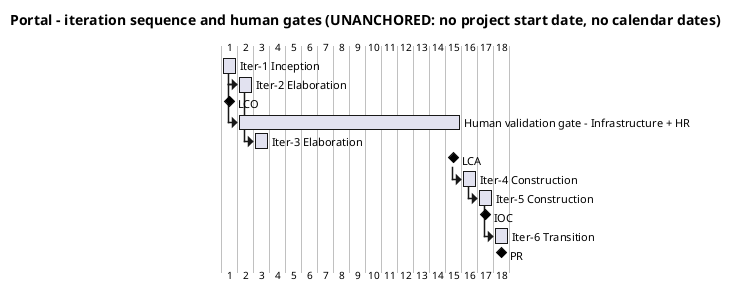
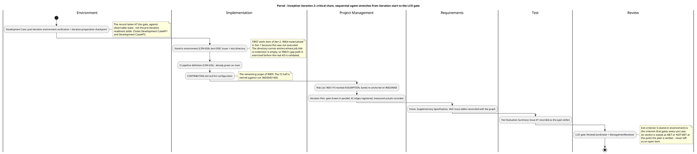

## Document Control

- **Phase:** Inception
- **Status:** Draft — iteration 2
- **Milestone Target:** Lifecycle Objectives (LCO) — end of Inception. NOT YET ACHIEVED.

## Iteration Objectives

Iteration 2 is the second Inception iteration. It is a mini-project, not a requirements phase: it completes the Inception increment — the stand-in environment that gates every use case, the guideline files, and the correction of the 18 findings the LCO review recorded — and it is closed by the LCO gate.

| # | Objective | Evidence that closes it |
|---|---|---|
| 1 | Deliver the stand-in environment (CON-028) — the one LCO exit criterion not met at Iter-1 close | A test OIDC issuer and a test directory carrying the declared attributes, including entries whose job title or extension is empty, recorded in the Development Case's post-iteration environment verification |
| 2 | Deliver the guideline files the Development Case references | `CONTRIBUTING.md` and the lint configuration exist; the CI pipeline builds and tests on `main` |
| 3 | Correct every finding the LCO review recorded, including the minor ones | The 18-finding ledger: each finding's corrective action applied in the artifact that owns it |
| 4 | Re-anchor the Risk List's magnitude bands on a confirmed basis | R001's probability and impact marked `[ASSUMPTION — requires validation]`; the bands anchored on R002's and R003's declared exposures |
| 5 | Record the iteration's measured spend and elapsed time | The measured actuals of Iter-1 recorded in this plan and in the Iteration Assessment; the two currencies reported apart |
| 6 | Make the plan's exit-criteria verdicts honest at the point of writing | Every layer (b) criterion carries a verdict of MET or NOT MET, never an open item |

**What this iteration does NOT do.** It does not implement a use case, does not verify an acceptance criterion, and does not close a milestone. The LCO verdict belongs to the ReviewCoordinator and the ManagementReviewer; this plan produces the evidence they rule on.

## Plan and Milestones

### Coarse roadmap — milestone sequence and iteration boundaries

Six iterations, distributed [1, 2, 2, 1] across Inception, Elaboration, Construction and Transition. The count is a starting point bent to this project's risk profile, and it is re-planned at every iteration from the measured spend and elapsed time of the phases that have closed (CON-027) — never from a theoretical capacity.

**Why the profile is bent this way.** Inception takes two iterations, not one: the declared baseline is unusually rich (9 FRs, 5 NFRs, 32 constraints, 6 acceptance criteria), the stand-in boundary must be established before any use case can be built, and Iter-1 closed with that boundary undelivered — R004 materialized. Elaboration takes two iterations because the architecture baseline must be established *and* the CON-028 human validation feedback from Infrastructure with HR must arrive before LCA closes. Construction is compressed to two iterations because the scope is genuinely small — nine use cases, two entities the portal owns (clockings, news) plus one link table, no data migration (CON-030), no distributed topology, and a stack pinned by CON-022/CON-023/CON-024 so there is no architectural exploration to fund. Transition is one iteration because there is no user training programme (AC-005 requires no prior training) and no data migration, but the handover to Infrastructure (CON-029) is real work.

| Milestone | Closes at | The decision it gates | Evidence the reviewers rule on |
|---|---|---|---|
| LCO — Lifecycle Objectives | End of Iter-2 (Inception) | Do the stakeholders agree on the scope, is the project viable, are the initial risks identified? | Vision, Use-Case Model, Supplementary Specification, Development Case, Risk List, this Iteration Plan |
| LCA — Lifecycle Architecture | End of Iter-3 (Elaboration) | Is the architecture baseline stable enough to build on? | Software Architecture Document, Design Model, and the CON-028 validation feedback from Infrastructure with HR |
| IOC — Initial Operational Capability | End of Iter-5 (Construction) | Is the product complete enough to operate? | AC-001, AC-004 and AC-006 verified; all nine use cases implemented and tested |
| PR — Product Release | End of Iter-6 (Transition) | Is the product ready for handover to Infrastructure (CON-029)? | AC-002, AC-003 and AC-005 verified; Release Notes; User Documentation |

| Iteration | Phase | Objective | Use cases | Exit criteria |
|---|---|---|---|---|
| Iter-1 | Inception | Agreed scope, process configuration, initial risk register | UC-001, UC-002, UC-008 detailed; UC-003..UC-007, UC-009 outlined | Closed: 5 of 6 met; exit criterion 5 (stand-in environment) NOT MET |
| Iter-2 | Inception | Deliver the stand-in environment and the guideline files; correct the 18 findings | UC-001, UC-002, UC-008 | The six objectives above; LCO readiness assessed |
| Iter-3 | Elaboration | Establish the architecture baseline and close it on the validation feedback; design the remaining six use cases | UC-003..UC-007, UC-009 | LCA: the architecture is stable enough to build on |
| Iter-4 | Construction | Build and test the clocking and news increments | UC-001..UC-007 | AC-001, AC-002, AC-003, AC-006 verified |
| Iter-5 | Construction | Build and test the directory increment; harden; reach IOC | UC-008, UC-009 | AC-004 verified; all nine use cases implemented and tested |
| Iter-6 | Transition | Hand over to Infrastructure; make adoption measurable | all nine | AC-005 measurable from the recorded clockings; PR |

**The human gate is not an iteration, and it is not on the team's path.** The CON-028 validation of the real Keycloak and real AD is performed by Infrastructure with HR, outside the team's control. It runs in parallel with Iter-2 and Iter-3: the team's work does not wait on it, because every use case is built and tested against the stand-ins. It is bounded at 14 days of queue time, after which the process suspends (Development Case measurement policy). It is reported in days of queue time, apart from agent time, and the two are never added into one figure. If it delays a milestone, the remedy is another iteration (CON-021) — never a cut to declared scope.

### Fine plan — Inception iteration 2 work items

No work item below carries a size. This system measures exactly two quantities — tokens and elapsed time — and a work item sized in hours, days, weeks or person-anything would be a unit nothing here produces. The order below is the critical chain, not a schedule.

| # | Work item | Owner (agent role) | Predecessor | Evidence that closes it |
|---|---|---|---|---|
| 1 | Stand-in environment (CON-028): test OIDC issuer and test directory | Implementer, Integrator | — | A test directory carrying the declared attributes, including entries whose job title or extension is empty; recorded in the Development Case's post-iteration environment verification |
| 2 | Post-iteration environment verification and iteration-preparation checkpoint | ProcessEngineer | 1 | A record taken at the gate, against observable state, for each item the checkpoint names |
| 3 | `CONTRIBUTING.md` and lint configuration | SoftwareArchitect, Implementer, TestManager | — | The guideline files the Development Case references exist |
| 4 | Risk List: re-anchor the magnitude bands; record R004's treatment state | ProjectManager | — | R001's P and I marked `[ASSUMPTION — requires validation]`; bands anchored on R002 and R003; R004 recorded as materialized |
| 5 | Iteration Plan: gate drawn in parallel, AC edges registered, measured actuals recorded | ProjectManager | 4 | This artifact |
| 6 | Traceability reconciliation: Vision, Supplementary Specification, Software Architecture Document | SystemAnalyst, RequirementsSpecifier, SoftwareArchitect | — | Each trace table names element identifiers and each row is registered as an edge |
| 7 | Test Evaluation Summary: record `Issue #1` as the open defect | TestManager | — | The three places that assert no issue exists record the defect count as one |
| 8 | LCO review | ReviewCoordinator, ManagementReviewer, Reviewer | 1..7 | The LCO verdict — the reviewers' ruling, not the Project Manager's |

## Resources

### Agent role profile

Planning here means selecting which agent roles execute in each iteration. The 25-role IARI roster is fixed and no role is merged (Development Case). BusinessProcessAnalyst and BusinessReviewer are **not active** in any iteration: Business Modeling is inactive because business-process-led = false.

| Agent role | Iter-1 Inception | Iter-2 Inception | Iter-3 Elaboration | Iter-4 Construction | Iter-5 Construction | Iter-6 Transition |
|---|---|---|---|---|---|---|
| SystemAnalyst | Execute | Execute | Consult | — | — | Consult |
| RequirementsSpecifier | Execute | Execute | Execute | Consult | Consult | — |
| SoftwareArchitect | Execute | Execute | Execute | Consult | Consult | Consult |
| Designer | Execute | Consult | Execute | Execute | Execute | — |
| DatabaseDesigner | — | — | Execute | Execute | Execute | — |
| UserInterfaceDesigner | Consult | Consult | Execute | Execute | Execute | — |
| CapsuleDesigner | — | — | Consult | Consult | Consult | Consult |
| Implementer | Execute | Execute | Execute | Execute | Execute | Consult |
| Integrator | Execute | Execute | Execute | Execute | Execute | Execute |
| TestManager | Consult | Execute | Execute | Execute | Execute | Execute |
| TestDesigner | — | — | Execute | Execute | Execute | Consult |
| TestAnalyst | — | — | Execute | Execute | Execute | Execute |
| Tester | — | — | Execute | Execute | Execute | Execute |
| DeploymentManager | — | — | Consult | Consult | Execute | Execute |
| TechnicalWriter | — | — | Consult | Execute | Execute | Execute |
| ConfigurationManager | Execute | Execute | Execute | Execute | Execute | Execute |
| ChangeControlManager | — | — | Consult | Execute | Execute | Execute |
| ProcessEngineer | Execute | Execute | Execute | Consult | Consult | Execute |
| ProjectManager | Execute | Execute | Execute | Execute | Execute | Execute |
| Reviewer | Execute | Execute | Execute | Execute | Execute | Execute |
| ReviewCoordinator | Execute | Execute | Execute | Execute | Execute | Execute |
| ManagementReviewer | Execute | Execute | Execute | Execute | Execute | Execute |
| CodeReviewer | — | — | Consult | Execute | Execute | Consult |
| BusinessProcessAnalyst | Not active — Business Modeling inactive | — | — | — | — | — |
| BusinessReviewer | Not active — Business Modeling inactive | — | — | — | — | — |

**Parallelism discipline.** Adding agent roles to a phase increases coordination overhead — context conflicts and artifact contention — without proportional benefit. Iter-2 adds no role to the roster: the same roles that executed Iter-1 execute Iter-2, with the environment work moved to the front of the chain. When the project is behind, the lever is another iteration to finish the declared scope, never more agents in parallel and never a cut to declared scope.

### Two currencies, reported apart

| Currency | What it measures | Iter-1 (measured actual) | Iter-2 (forecast) |
|---|---|---|---|
| Agent work | Tokens consumed, and the elapsed time the system measures | 6,918,081 tokens; 8:35:00.7478289 elapsed agent time | No forecast is invented from a theoretical capacity. The measured actual of the phase that closed is the input; the iteration's own spend is measured at its close |
| Human gate | Days of queue time waiting for a person | 0:00:00 measured, excluding the end-of-iteration approval gate, which is not measured | The CON-028 validation of the real Keycloak and AD by Infrastructure with HR. Ceiling 14 days, then the process suspends. Actual measured and reported apart; estimate none |

The two are never summed into one figure and never converted into one another. There is no token budget on this project and none is to be set (CON-027): each iteration's measured spend is recorded and used to forecast the next, and declared scope is never cut or deferred to fit an estimate.

## Use Cases and Scenarios Addressed

| UC | Name | Priority | Volatility | This iteration | Scenarios carried |
|---|---|---|---|---|---|
| UC-001 | Clock In and Clock Out | Must | High | Specification carried; exercised against the stand-in OIDC issuer | Main flow; A1 network unavailable (AC-006); A2 pair already complete (CON-011); A3 open at midnight (CON-010); A4 HR views all clockings |
| UC-002 | Export Monthly Clocking Report | Must | Medium | Specification carried; exercised against the stand-in directory | Main flow; A1 day with no clocking; A2 missing clock-out; A3 corrected day; A4 no worker category (CON-015); A5 blank FullName (R002) |
| UC-008 | Search Employee Directory | Must | High | Specification carried; exercised against the stand-in directory | Main flow; A1 empty job title or extension (R002); A2 no category (CON-015); A3 network unavailable; A4 no match |
| UC-003 | Correct or Insert a Clocking | Must | Low | Outline | A1 no reason supplied; A2 no self-service correction |
| UC-004 | Read Internal News | Must | Low | Outline | A1 no item featured (CON-009); A2 network unavailable |
| UC-005 | Publish News | Must | Low | Outline | A1 featuring un-features the previous (CON-009); A2 featuring is never automatic |
| UC-006 | Edit Published News | Should | Low | Outline | A1 featured-flag change (CON-009) |
| UC-007 | Unpublish News | Should | Low | Outline | A1 the featured item is un-featured; A2 no hard delete (CON-017) |
| UC-009 | Assign or Clear Worker Category | Should | Low | Outline | A1 category cleared (CON-015); A2 fifth value refused (CON-014); A3 no employee field is editable (CON-005) |

**Why these three are detailed and the other six are not.** UC-001, UC-002 and UC-008 are the architecturally significant use cases. UC-001 forces the client-timestamp and idempotency decisions (AC-006) and the page-level script (CON-023). UC-008 forces the LDAP read merged with the portal-owned category link (CON-005, CON-016) and must survive empty attributes (R002). UC-002 forces the exact export contract of FR-003. The remaining six are outlined; the RequirementsSpecifier details them in Elaboration. Detailing them now would be planning beyond the horizon.

**What Iter-2 does with them.** No use case is implemented. The three detailed use cases are exercised against the stand-in environment — the test OIDC issuer and the test directory — which is what makes them buildable and testable in Elaboration. That exercise is the delivery of exit criterion 5, not an implementation.

## Evaluation Criteria

### Layer (a) — every declared acceptance criterion, accounted for

Every AC-NNN in the declared scope is listed. None is absent. This iteration verifies none of them: Inception produces the baseline, not a running system. Each is deferred to the named iteration whose increment closes it, and each carries a registered trace edge to the use case that carries it.

| AC | Criterion | Disposition | Carried by | Evidence that closes it |
|---|---|---|---|---|
| AC-001 | Full page load as the employee experiences it, including the clocking page's script, under 3 seconds | Deferred to Iter-4 (Construction) | UC-001 | A measured full page load on the corporate network against the running clocking page |
| AC-002 | An employee can clock in and out without help from HR or the development team | Deferred to Iter-4 (Construction) | UC-001 | An end-to-end clocking performed against the built increment |
| AC-003 | An HR Administrator can publish a news item without technical assistance | Deferred to Iter-4 (Construction) | UC-005 | An HR publish performed against the built increment |
| AC-004 | Any employee finds a colleague's phone/email in under 10 seconds | Deferred to Iter-5 (Construction) | UC-008 | A directory search performed against the built increment |
| AC-005 | 80% of employees complete at least one clocking with no prior training | Deferred to Iter-6 (Transition), and not closable by any test the team runs | UC-001 | Adoption counted from the clockings the portal records. The 3-month window extends beyond PR; the measurement is the stakeholder's |
| AC-006 | A clocking made while the corporate network is down for up to 5 minutes is not lost | Deferred to Iter-4 (Construction) | UC-001 | The localStorage retry, the client-supplied timestamp and the idempotency key exercised against the built increment |

### Layer (b) — this iteration's own exit criteria, each with its verdict

Each criterion carries a verdict of MET or NOT MET at the point this plan is written. A criterion whose evidence does not exist is recorded as NOT MET, never as an open item.

| # | Exit criterion | Verdict at Iter-2 start | Evidence that closes it |
|---|---|---|---|
| 1 | Stakeholders agree on the scope | **MET** | The Vision's declared scope and the Use-Case Model's nine use cases are the agreed baseline; no element outside the declared scope |
| 2 | The project is viable | **MET** | The stack is pinned by CON-022/CON-023/CON-024; the OIDC client is already registered (CON-003) so login is testable from day one; no technical unknown requires empirical validation (Development Case: Architectural Proof-of-Concept NOT FIRED) |
| 3 | Initial risks identified and classified | **MET** | Risk List: R001..R009 with probability, impact, magnitude, strategy, owner, mitigation and contingency. R001's P and I are marked `[ASSUMPTION — requires validation]` and the bands are anchored on R002's and R003's declared exposures |
| 4 | The process configuration governs the project | **MET** | Development Case: Business Modeling inactive, no OPTIONAL trigger fired, version policy recorded |
| 5 | The stand-in environment is available (CON-028) | **NOT MET** | No artifact evidences the test OIDC issuer or the test directory. This is the criterion that gates every use case: CON-028 forbids building or testing against the real Keycloak or the real AD, so with no stand-in no use case can be built or tested and R004 remains untreated. It is the first work item of this iteration |
| 6 | The build is verifiable (CON-026) | **MET** | The CI pipeline builds and tests on `main`; the build is green (run `36050451436`) |

**LCO readiness.** Criteria 1, 2, 3, 4 and 6 are met. **Criterion 5 is NOT MET at the point this plan is written** — it is the one criterion that gates every use case, and it is the first work item of this iteration. The LCO gate is therefore not passable until criterion 5's evidence exists. The LCO verdict is the ReviewCoordinator's and the ManagementReviewer's; this plan does not pre-empt it, and it does not present an unexecuted work item as an open item.

## Traceability
| Element | Traces From | Link Type | Traces To |
|---|---|---|---|
| Iteration Plan | FR-001, FR-003, FR-008 | Refines | UC-001, UC-002, UC-008 |
| Iteration Plan | CON-027 | DependsOn | R007 |
| Iteration Plan | CON-021, CON-028 | DependsOn | R005 |
| Iteration Plan | CON-028 | DependsOn | R004 |
| Iteration Plan | — | Refines | Development Case |
| Iteration Plan | — | Refines | AC-001, AC-002, AC-003, AC-004, AC-005, AC-006 |
| AC-001 | NFR-001 | Refines | UC-001 |
| AC-002 | FR-001 | Refines | UC-001 |
| AC-003 | FR-005 | Refines | UC-005 |
| AC-004 | FR-008 | Refines | UC-008 |
| AC-005 | BG-003 | Refines | UC-001 |

The Development Case governs this plan: it fixes the active disciplines, the CORE artifact set, the agent role profile and the measurement policy. The declared acceptance criteria AC-001..AC-006 are accounted for in Evaluation Criteria layer (a) and deferred to the iterations named there; each carries a registered edge to the use case that carries it, so the criterion-to-use-case mapping exists in the graph and not only as prose.

**Trace endpoints.** `FR-001`..`FR-009`, `NFR-001`..`NFR-005`, `AC-001`..`AC-006`, `CON-001`..`CON-032`, `BG-001`..`BG-003`, `STK-001`..`STK-004` and `R001`..`R009` are declared identifiers, copied exactly from the work order. `UC-001`..`UC-009` are the System Analyst's use-case identifiers. `LCO`, `LCA`, `IOC` and `PR` are the milestones this plan sequences. `run 36050451436` is an observed SCM fact, cited as returned by the `scm_*` tools. The findings cited above are the reviewers' `<artifact>#<key>` handles; a finding is not an element and no edge is registered on one.

**No element of this role is minted.** The Project Manager produces no `UC-NNN`, `CLS-NNN`, `COMP-NNN`, `TC-NNN` or `INT-NNN`; those families belong to other authorities. The objectives table, the milestone table, the iteration table, the work-item table and the agent role profile are sections of this plan, not trace-graph elements, so no edge is registered on them.

**Milestone not declared.** This plan produces the evidence the reviewers rule on. It does not declare the LCO milestone, the iteration or the phase as completed.

