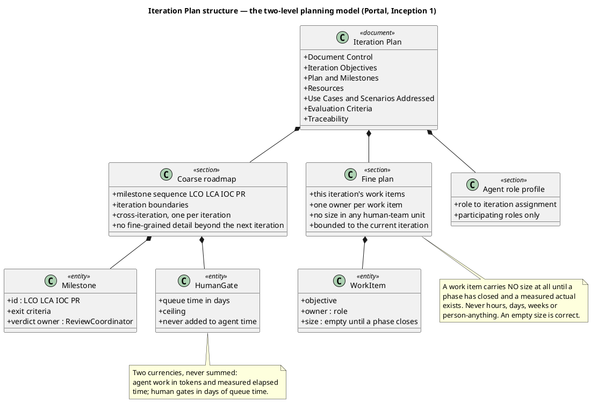
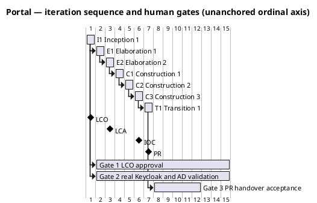
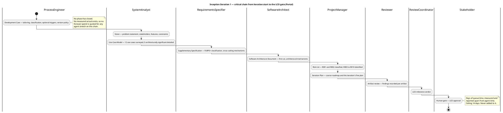

## Document Control

- **Phase:** Inception
- **Status:** Draft — under review
- **Milestone Target:** End of Inception (not yet achieved)
- **Iteration:** 1, Cycle 1
- **Owner:** ProjectManager
- **Date:** 2026-10-07

## Iteration Objectives

This plan carries two levels. The **coarse roadmap** is cross-iteration: the milestone sequence and the iteration boundaries. The **fine plan** is bounded to Inception iteration 1: its work items and their owners. Planning beyond the next iteration in fine-grained detail is waste — no architectural baseline and no measured actual exist yet.

```plantuml
@startuml
title Iteration Plan structure — the two-level planning model (Portal, Inception 1)

skinparam classAttributeIconSize 0

class "Iteration Plan" as IP <<document>> {
  + Document Control
  + Iteration Objectives
  + Plan and Milestones
  + Resources
  + Use Cases and Scenarios Addressed
  + Evaluation Criteria
  + Traceability
}

class "Coarse roadmap" as COARSE <<section>> {
  + milestone sequence LCO LCA IOC PR
  + iteration boundaries
  + cross-iteration, one per iteration
  + no fine-grained detail beyond the next iteration
}

class "Fine plan" as FINE <<section>> {
  + this iteration's work items
  + one owner per work item
  + no size in any human-team unit
  + bounded to the current iteration
}

class "Agent role profile" as ROLES <<section>> {
  + role to iteration assignment
  + participating roles only
}

class "Milestone" as MS <<entity>> {
  + id : LCO LCA IOC PR
  + exit criteria
  + verdict owner : ReviewCoordinator
}

class "WorkItem" as WI <<entity>> {
  + objective
  + owner : role
  + size : empty until a phase closes
}

class "HumanGate" as GATE <<entity>> {
  + queue time in days
  + ceiling
  + never added to agent time
}

IP *-- COARSE
IP *-- FINE
IP *-- ROLES
COARSE *-- MS
FINE *-- WI
COARSE *-- GATE

note bottom of FINE
  A work item carries NO size at all until a
  phase has closed and a measured actual
  exists. Never hours, days, weeks or
  person-anything. An empty size is correct.
end note

note bottom of GATE
  Two currencies, never summed:
  agent work in tokens and measured elapsed
  time; human gates in days of queue time.
end note
@enduml
```

### Inception iteration 1 — objectives

| # | Objective | Exit evidence |
|---|---|---|
| O-1 | Establish the requirements baseline the whole project is accountable to: the twelve declared requirements as twelve use cases, the five architecturally significant ones detailed, the non-functional requirements and constraints classified. | Vision, Use-Case Model, Supplementary Specification persisted and reviewed. |
| O-2 | Identify and classify the project's risks, with a strategy and an owner for each, and retire the candidates whose mechanism has no actor in this system. | Risk List persisted; R001 to R010 classified; retired candidates recorded with their reason. |
| O-3 | Compose the coarse roadmap — milestone sequence, iteration boundaries, agent role profile — and this iteration's fine plan. | This Iteration Plan. |
| O-4 | Reach a first-cut architecture that confronts the highest-magnitude technical risks rather than deferring them. | Software Architecture Document persisted; R001, R003, R004, R008 addressed in it. |
| O-5 | Assess LCO readiness: is the project viable to proceed to Elaboration? | The ReviewCoordinator's LCO verdict, recorded in the Review Record. |

**Not an objective of this iteration.** No executable increment. Inception's output is the artifact scope and the risk record, not running code. No acceptance criterion is closed this iteration — see Evaluation Criteria.

## Plan and Milestones

### Coarse roadmap — milestone sequence and iteration boundaries

Seven iterations, distributed Inception 1, Elaboration 2, Construction 3, Transition 1. This sits inside the 6 ± 3 rule and is justified against the risk profile, not against the rubber profile's default shape.

| Milestone | Closes | Exit criteria | Verdict owner |
|---|---|---|---|
| **LCO** — Lifecycle Objectives | Inception 1 | Stakeholders agree on the scope; the project is viable to proceed; the initial risks are identified and classified. | ReviewCoordinator |
| **LCA** — Lifecycle Architecture | Elaboration 2 | The architecture is stable and validated against the real Keycloak and the real AD; the highest-magnitude risks are retired or bounded; the plan for Construction is credible. | ReviewCoordinator |
| **IOC** — Initial Operational Capability | Construction 3 | The declared scope is implemented, integrated and tested; the system is ready for handover to Infrastructure. | ReviewCoordinator |
| **PR** — Product Release | Transition 1 | The product is released to the declared population; Infrastructure has accepted operation. | ReviewCoordinator |

```plantuml
@startgantt
title Portal — iteration sequence and human gates (unanchored ordinal axis)

[I1 Inception 1] lasts 1 day
[E1 Elaboration 1] lasts 1 day
[E2 Elaboration 2] lasts 1 day
[C1 Construction 1] lasts 1 day
[C2 Construction 2] lasts 1 day
[C3 Construction 3] lasts 1 day
[T1 Transition 1] lasts 1 day

[E1 Elaboration 1] starts at [I1 Inception 1]'s end
[E2 Elaboration 2] starts at [E1 Elaboration 1]'s end
[C1 Construction 1] starts at [E2 Elaboration 2]'s end
[C2 Construction 2] starts at [C1 Construction 1]'s end
[C3 Construction 3] starts at [C2 Construction 2]'s end
[T1 Transition 1] starts at [C3 Construction 3]'s end

[LCO] happens at [I1 Inception 1]'s end
[LCA] happens at [E2 Elaboration 2]'s end
[IOC] happens at [C3 Construction 3]'s end
[PR] happens at [T1 Transition 1]'s end

[Gate 1 LCO approval] lasts 14 days
[Gate 1 LCO approval] starts at [I1 Inception 1]'s end
[Gate 2 real Keycloak and AD validation] lasts 14 days
[Gate 2 real Keycloak and AD validation] starts at [E1 Elaboration 1]'s start
[Gate 3 PR handover acceptance] lasts 5 days
[Gate 3 PR handover acceptance] starts at [T1 Transition 1]'s end
@endgantt
```

**Reading the chart.** The axis is ordinal, not calendar: one bar is one iteration and its width is a nominal unit, not a duration. No project start date is set and no calendar date is projected from an estimate — a date computed from an estimate reads downstream as an observation. The only measured quantity on this chart is the human gate, in days of queue time, and it is reported apart from agent time and never added to it.

**Why seven iterations, and why this distribution.**

| Phase | Iterations | Justification against the risk profile |
|---|---|---|
| Inception | 1 | The domain is ordinary intranet and HR vocabulary; the requirements baseline is complete and no scope question is open. A second Inception iteration would re-derive a baseline that already exists. |
| Elaboration | 2 | **Stretched.** Three of the highest-magnitude risks are architectural and are retired only by building and validating: R001 (live LDAP read against inconsistently filled attributes), R003 (the human validation gate on the real Keycloak and AD, whose feedback must land before Elaboration closes), R004 (client-supplied clocking timestamp). Elaboration 1 builds the architecture and starts the human gate; Elaboration 2 absorbs the gate's feedback and stabilises. One iteration would leave the gate's feedback with nowhere to land. |
| Construction | 3 | Twelve use cases over three processes, with the audit trail and the two closed value lists. Three iterations let the increment be integrated and tested per iteration rather than in one terminal test phase. |
| Transition | 1 | **Compressed.** Internal deployment to a declared population of 200, no user training required (AC-005 requires 80% to clock with no prior training), no data migration (CON-037), and Infrastructure already operates the platform (CON-036). There is no user-training or migration work to spread over a second iteration. |

**The spend split is not assumed from this shape.** The rubber profile's 5/20/65/10 distribution is a starting point for iteration COUNT only. The moment one phase closes, its recorded token spend and measured elapsed time replace every assumed share in every forecast made afterwards. No phase has closed, so no spend figure appears anywhere in this plan.

### Fine plan — Inception iteration 1

Work items, one owner each. **No work item carries a size.** No phase has closed, so no measured actual exists and no forecast can be derived from one. A size in hours, days, weeks or person-anything would be a unit this system does not measure.

| # | Work item | Owner | Depends on | Exit evidence |
|---|---|---|---|---|
| W-1 | Author the Development Case: tailoring, classification verdicts, optional artifact triggers, version policy, measurement policy, risk governance. | ProcessEngineer | — | Development Case persisted. |
| W-2 | Author the Vision: problem statement, product position, stakeholder summary, features, constraints, non-functional requirements, business goals, acceptance criteria. | SystemAnalyst | W-1 | Vision persisted. |
| W-3 | Author the Use-Case Model: twelve use cases surveyed one-to-one against the twelve declared requirements; the five architecturally significant ones detailed. | SystemAnalyst | W-2 | Use-Case Model persisted. |
| W-4 | Author the Supplementary Specification: FURPS+ classification of every declared requirement and constraint; the cross-cutting mechanisms specified and included by each dependent use case. | RequirementsSpecifier | W-3 | Supplementary Specification persisted. |
| W-5 | Author the first-cut Software Architecture Document: the architectural mechanisms for the LDAP read, the OIDC client, the audit trail, the offline retry and the two closed value lists. | SoftwareArchitect | W-4 | Software Architecture Document persisted. |
| W-6 | Identify and classify the project's risks; retire the candidates whose mechanism has no actor; assign a strategy, an owner, a mitigation and a contingency to each. | ProjectManager | W-2 | Risk List persisted. |
| W-7 | Compose the coarse roadmap and this iteration's fine plan; assess LCO readiness. | ProjectManager | W-6 | This Iteration Plan. |
| W-8 | Review every artifact produced this iteration and record findings per artifact. | Reviewer | W-5, W-7 | Review Record. |
| W-9 | Rule on the LCO milestone. | ReviewCoordinator | W-8 | LCO verdict in the Review Record. |

```plantuml
@startuml
title Inception Iteration 1 — critical chain from iteration start to the LCO gate (Portal)

|ProcessEngineer|
start
:Development Case — tailoring, classification, optional triggers, version policy;
note right
  No phase has closed.
  No measured actual exists, so no
  forecast spend is quoted for any
  agent stretch on this chain.
end note

|SystemAnalyst|
:Vision — problem statement, stakeholders, features, constraints;
:Use-Case Model — 12 use cases surveyed, 5 architecturally significant detailed;

|RequirementsSpecifier|
:Supplementary Specification — FURPS+ classification, cross-cutting mechanisms;

|SoftwareArchitect|
:Software Architecture Document — first cut, architectural mechanisms;

|ProjectManager|
:Risk List — R001 and R002 classified, R003 to R010 identified;
:Iteration Plan — coarse roadmap and this iteration's fine plan;

|Reviewer|
:Artifact review — findings recorded per artifact;

|ReviewCoordinator|
:LCO milestone verdict;

|Stakeholder|
:Human gate — LCO approval;
note right
  Days of queue time, measured and
  reported apart from agent time.
  Ceiling 14 days. Never added to it.
end note
stop
@enduml
```

**The critical chain.** The chain is sequential, not parallel: each stretch consumes the artifact the previous one produced, and the depth of the chain is the count of sequential agent stretches from iteration start to the gate. The chain ends at a human gate, not at an agent — the LCO verdict is the ReviewCoordinator's, and the approval behind it is the stakeholder's. **No stretch on this chain carries a spend figure**, because no phase has closed and no measured actual exists. The first forecast this plan will carry is the one built from Inception 1's own measured spend, recorded in the Iteration Assessment.

**Human gates.** Reported in days of queue time, apart from agent time, never summed with it.

| Gate | What is waited for | Ceiling | Remedy if it delays a milestone |
|---|---|---|---|
| LCO approval | The stakeholder's agreement that the scope is right and the project is viable. | 14 days | Another iteration (CON-026). |
| Real Keycloak and AD validation | Infrastructure with HR validating the real identity provider and the real directory (CON-035). Human work, not team work to plan. | 14 days | Another iteration (CON-026). |
| PR handover acceptance | Infrastructure accepting operation of the portal (CON-036). | 5 days | Another iteration (CON-026). |

## Resources

The agent role profile: which roles execute in which iteration. Roles not listed do not participate — BusinessProcessAnalyst and BusinessReviewer (Business Modeling inactive) and CapsuleDesigner (not a real-time system) do not participate in any iteration.

| Role | I1 | E1 | E2 | C1 | C2 | C3 | T1 |
|---|---|---|---|---|---|---|---|
| ProcessEngineer | author | prepare | prepare | — | — | — | — |
| SystemAnalyst | author | detail | detail | — | — | — | — |
| RequirementsSpecifier | author | detail | detail | — | — | — | — |
| SoftwareArchitect | author | author | stabilise | guide | guide | guide | — |
| Designer | — | author | author | author | author | author | — |
| UserInterfaceDesigner | — | author | author | author | author | author | — |
| DatabaseDesigner | — | author | author | author | — | — | — |
| Implementer | — | build | build | build | build | build | — |
| Integrator | — | — | integrate | integrate | integrate | integrate | — |
| TestManager | — | plan | plan | plan | plan | plan | — |
| TestAnalyst | — | — | author | author | author | author | — |
| TestDesigner | — | — | author | author | author | author | — |
| Tester | — | — | execute | execute | execute | execute | execute |
| DeploymentManager | — | — | — | — | — | prepare | deploy |
| ConfigurationManager | — | configure | maintain | maintain | maintain | maintain | maintain |
| ChangeControlManager | — | — | — | on CR | on CR | on CR | on CR |
| ProjectManager | author | plan | plan | plan | plan | plan | plan |
| TechnicalWriter | — | — | — | author | author | author | author |
| Reviewer | review | review | review | review | review | review | review |
| CodeReviewer | — | — | — | review | review | review | — |
| ManagementReviewer | — | — | — | — | — | — | review |
| ReviewCoordinator | verdict | verdict | verdict | verdict | verdict | verdict | verdict |

**Parallelism discipline.** The profile above is the plan, not a lever. If an iteration slips, the remedy is another iteration — never more agent roles executing at once, and never cutting declared scope. Adding roles to a phase increases coordination overhead and artifact contention without proportional benefit, and declared scope is the stakeholder's to change, not the plan's.

**Human resources.** One human participates: the stakeholder, at the three gates above. Infrastructure and HR perform the real-Keycloak and real-AD validation as human work (CON-035); it is bounded as a risk (R003), not as an estimate.

## Use Cases and Scenarios Addressed

The scope of an iteration is a selected set of use cases, not a set of technical tasks. Inception 1 selects all twelve for **survey** and five for **detail** — the five that force an architectural decision.

| UC | Source | Use case | This iteration | Why |
|---|---|---|---|---|
| UC-002 | FR-002 | Clock In and Clock Out | **Detailed** | Client-supplied timestamp, idempotency key, 5-minute offline retry (CON-040, NFR-003, AC-006). |
| UC-004 | FR-004 | Export Monthly Clocking Report as CSV | **Detailed** | High volatility: the fixed column contract and the empty-not-zero semantics (FR-004). |
| UC-005 | FR-005 | Correct or Insert a Clocking | **Detailed** | Append-only correction with audit; the original is never overwritten in place (CON-007, NFR-001). |
| UC-010 | FR-010 | Feature or Un-feature a News Item | **Detailed** | High volatility: the at-most-one-featured invariant (CON-011, CON-012). |
| UC-011 | FR-011 | Search Employee Directory | **Detailed** | Live LDAP read with no local copy (CON-032, R001). |
| UC-001 | FR-001 | View Own Clocking History | Surveyed | No architectural decision. Detailed in Elaboration. |
| UC-003 | FR-003 | View All Employee Clockings | Surveyed | No architectural decision. Detailed in Elaboration. |
| UC-006 | FR-006 | Publish News Item | Surveyed | No architectural decision. Detailed in Elaboration. |
| UC-007 | FR-007 | Read News | Surveyed | No architectural decision. Detailed in Elaboration. |
| UC-008 | FR-008 | Edit Published News Item | Surveyed | No architectural decision. Detailed in Elaboration. |
| UC-009 | FR-009 | Unpublish News Item | Surveyed | No architectural decision. Detailed in Elaboration. |
| UC-012 | FR-012 | Assign Worker Category | Surveyed | No architectural decision. Detailed in Elaboration. |

**Scenarios.** The alternative flows that carry a risk or an invariant are named in the Use-Case Model and are the ones the TestDesigner must cover: UC-002 A1 (duplicate press), A2 (network unreachable), A3 (clock-out with no open pair); UC-004 A1 (clock-out missing), A2 (day with no clocking), A3 (no category); UC-005 A1 (insertion for a day with no clocking), A2 (employee attempts a correction); UC-010 A1 (clearing the flag on the featured item), A2 (no item featured); UC-011 A1 (empty attribute), A2 (no category), A3 (network unreachable), A4 (no match).

**No use case is split per actor.** UC-003, UC-004 and UC-005 are three distinct HR goals over the same clocking data — viewing, exporting and correcting are separate outcomes with separate triggers.

## Evaluation Criteria

Two layers, kept apart.

### (a) Declared acceptance criteria — every AC-NNN accounted for

All six declared acceptance criteria are accounted for. **None is closed this iteration**, because Inception 1 produces no executable increment. Each is deferred to a named iteration and the evidence that will close it is named.

| AC | Criterion | This iteration | Deferred to | Evidence that will close it |
|---|---|---|---|---|
| AC-001 | The performance criterion is the full page load as the employee experiences it, including the clocking page's script. | Not closable — no executable exists. | Construction 1 | A measured full page load on the corporate network, browser request to page displayed and usable. Server response time is the engineering target, not a substitute. |
| AC-002 | An employee can clock in and out without help from HR or the development team. | Not closable — no executable exists. | Construction 1 | UC-002 exercised end to end with no assistance. |
| AC-003 | An HR Administrator can publish a news item without technical assistance. | Not closable — no executable exists. | Construction 2 | UC-006 exercised end to end with no assistance. |
| AC-004 | Any employee finds a colleague's phone/email in under 10 seconds. | Not closable — no executable exists. | Construction 2 | UC-011 exercised against the stand-in directory; re-verified against the real AD after the Elaboration gate. |
| AC-005 | 80% of employees complete at least one clocking with no prior training. | Not closable — no executable exists. | Transition 1 | Adoption measured against the declared population of 200 after go-live. |
| AC-006 | A clocking made while the corporate network is down for up to 5 minutes is not lost. | Not closable — no executable exists. | Construction 1 | UC-002 A2 exercised with the network down for the full window. |

### (b) This iteration's own exit criteria

| # | Exit criterion | Met when |
|---|---|---|
| X-1 | The requirements baseline is complete and reviewed: twelve declared requirements as twelve use cases, one-to-one, with no use case lacking a declared source. | Vision, Use-Case Model and Supplementary Specification persisted and reviewed. |
| X-2 | Every risk is classified with a strategy and an owner, and every accepted risk names the basis of its acceptance. | Risk List persisted. |
| X-3 | The coarse roadmap and this iteration's fine plan are composed, with no work item sized in a unit this system does not measure. | This Iteration Plan. |
| X-4 | The first-cut architecture confronts the highest-magnitude technical risks rather than deferring them. | Software Architecture Document persisted, addressing R001, R003, R004 and R008. |
| X-5 | LCO readiness is assessed and the verdict recorded. | The ReviewCoordinator's LCO verdict in the Review Record. |

**LCO readiness assessment.** The project is viable to proceed to Elaboration. The scope is agreed and complete — twelve declared requirements, twelve use cases, no open scope question. The initial risks are identified and classified, and the three highest-magnitude ones (R001, R003, R004) are architectural and are confronted in Elaboration rather than deferred. The architecture is first-cut and its two external dependencies — the existing Keycloak and the read-only AD — are declared, bounded and validated by human work whose feedback lands before Elaboration closes. **This assessment is the ProjectManager's; the milestone verdict is the ReviewCoordinator's, and the milestone is not achieved until that verdict is recorded.**

## Traceability

| Element | Traces From | Link Type | Traces To |
|---|---|---|---|
| Iteration Plan | R001, R002, R003, R004, R005, R006, R007, R008, R009, R010 | Refines | Risk List |
| Iteration Plan | UC-001, UC-002, UC-003, UC-004, UC-005, UC-006, UC-007, UC-008, UC-009, UC-010, UC-011, UC-012 | Refines | Use-Case Model |
| Iteration Plan | AC-001, AC-002, AC-003, AC-004, AC-005, AC-006 | Refines | Test Case |
| Iteration Plan | CON-023, CON-024, CON-025, CON-026, CON-034 | Refines | Development Case |
| Iteration Plan | BG-001, BG-002, BG-003 | Refines | Vision |
| Iteration Plan | NFR-001, NFR-002, NFR-003, NFR-004, NFR-005 | Refines | Supplementary Specification |

**Reading the table.** The Iteration Plan is sequenced by the Risk List, scoped by the Use-Case Model, and bounded by the Development Case's risk governance and measurement policy. Its acceptance criteria are verified by Test Cases that do not exist yet — the `Traces To` end is the artifact that will carry them, and it is empty of elements this iteration.
