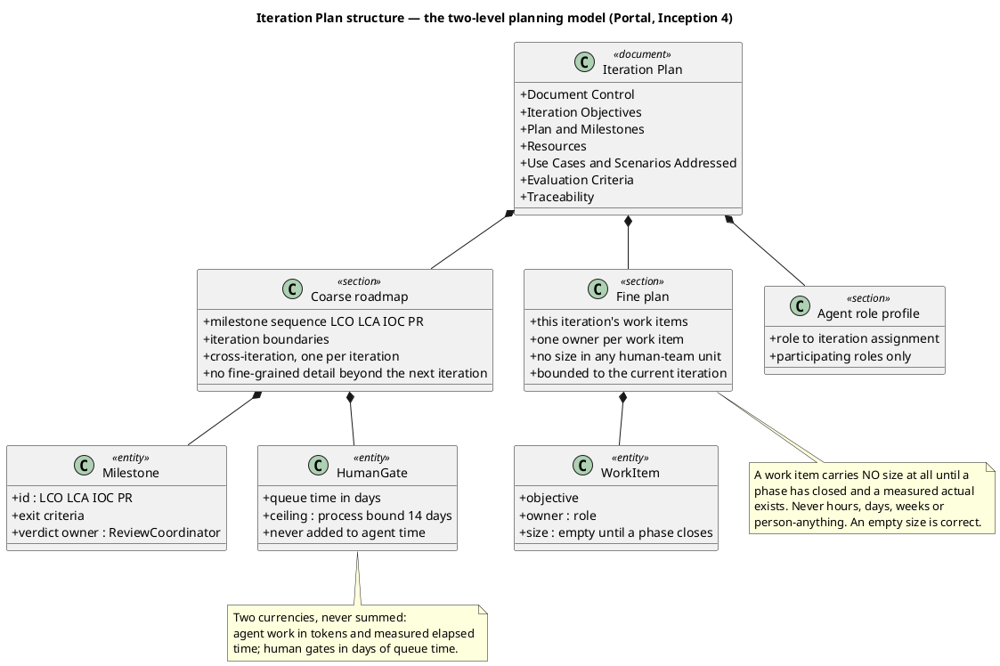
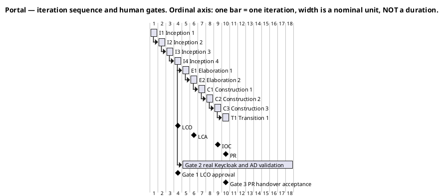
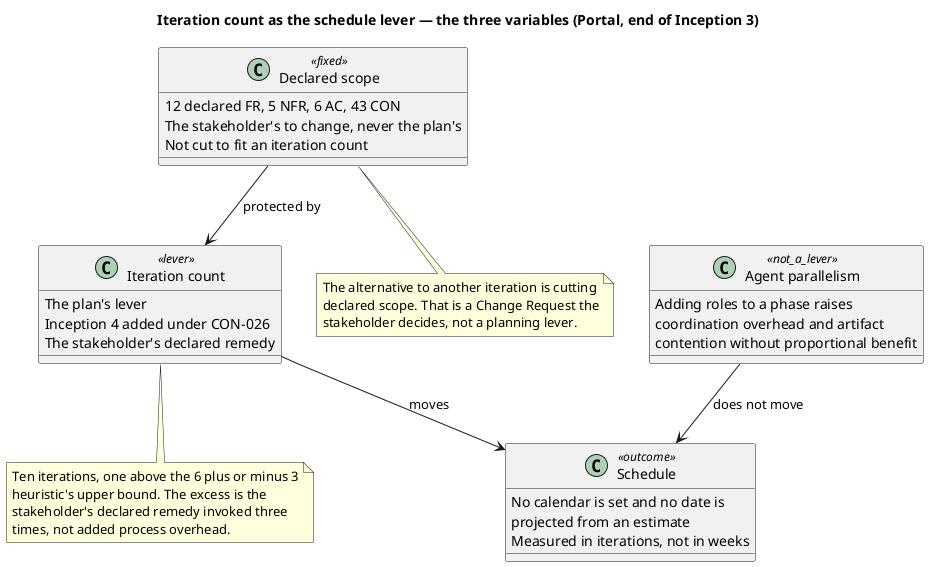
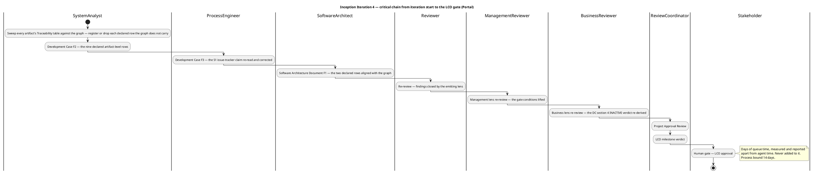

## Document Control
- **Phase:** Inception
- **Status:** Draft — under review
- **Milestone Target:** End of Inception (not yet achieved)
- **Iteration:** 4, Cycle 1
- **Owner:** ProjectManager
- **Date:** 2026-10-08

## Iteration Objectives
This plan carries two levels. The **coarse roadmap** is cross-iteration: the milestone sequence and the iteration boundaries. The **fine plan** is bounded to Inception iteration 4: its work items and their owners. Planning beyond the next iteration in fine-grained detail is waste — no architectural baseline and no measured actual for Elaboration exist yet.

```plantuml
@startuml
title Iteration Plan structure — the two-level planning model (Portal, Inception 4)

skinparam classAttributeIconSize 0

class "Iteration Plan" as IP <<document>> {
  + Document Control
  + Iteration Objectives
  + Plan and Milestones
  + Resources
  + Use Cases and Scenarios Addressed
  + Evaluation Criteria
  + Traceability
}

class "Coarse roadmap" as COARSE <<section>> {
  + milestone sequence LCO LCA IOC PR
  + iteration boundaries
  + cross-iteration, one per iteration
  + no fine-grained detail beyond the next iteration
}

class "Fine plan" as FINE <<section>> {
  + this iteration's work items
  + one owner per work item
  + no size in any human-team unit
  + bounded to the current iteration
}

class "Agent role profile" as ROLES <<section>> {
  + role to iteration assignment
  + participating roles only
}

class "Milestone" as MS <<entity>> {
  + id : LCO LCA IOC PR
  + exit criteria
  + verdict owner : ReviewCoordinator
}

class "WorkItem" as WI <<entity>> {
  + objective
  + owner : role
  + size : empty until a phase closes
}

class "HumanGate" as GATE <<entity>> {
  + queue time in days
  + ceiling : process bound 14 days
  + never added to agent time
}

IP *-- COARSE
IP *-- FINE
IP *-- ROLES
COARSE *-- MS
FINE *-- WI
COARSE *-- GATE

note bottom of FINE
  A work item carries NO size at all until a
  phase has closed and a measured actual
  exists. Never hours, days, weeks or
  person-anything. An empty size is correct.
end note

note bottom of GATE
  Two currencies, never summed:
  agent work in tokens and measured elapsed
  time; human gates in days of queue time.
end note
@enduml
```

### Inception iteration 4 — objectives

| # | Objective | Exit evidence |
|---|---|---|
| O-1 | Close every finding open at the end of Inception 3, minor ones included. | The Review Record's finding ledger carries no open finding. |
| O-2 | Sweep every artifact's Traceability table against the trace graph and register or drop each declared row the graph does not carry, so no artifact's declared coverage is unverifiable. | The Requirements Traceability Matrix shows no Business-level LEAF node for any artifact that declares a downstream link. |
| O-3 | Conduct the Project Approval Review ahead of the LCO verdict. | The Review Record's Project Approval Review entry. |
| O-4 | Re-run the review with all three lenses at the LCO gate. | Review Record entries from the Reviewer, the BusinessReviewer and the ManagementReviewer. |
| O-5 | Re-assess LCO readiness against X-1 to X-5 on the corrected baseline and record the verdict. | The ReviewCoordinator's LCO verdict in the Review Record. |

**Not an objective of this iteration.** No executable increment. Inception's output is the artifact scope and the risk record, not running code. No acceptance criterion is closed this iteration — see Evaluation Criteria. No use case is newly detailed: the selection made in Inception 1 stands.

**Why O-2 is a sweep and not two work items.** The same defect class — a declared traceability row the graph does not carry — has now been raised in three artifacts across three iterations: Supplementary Specification#F2, Test Evaluation Summary#F2 and Development Case#F2. Each was closed against the artifact the ledger named, and the class re-emerged in the next artifact. The work item is therefore the class, not the entry: every artifact's Traceability table is read against the graph in one pass.

## Plan and Milestones
### Coarse roadmap — milestone sequence and iteration boundaries

Ten iterations, distributed Inception 4, Elaboration 2, Construction 3, Transition 1. This sits one above the 6 ± 3 rule's upper bound, and the excess is justified against the risk profile and the stakeholder's declared remedy, not against the rubber profile's default shape.

| Milestone | Closes | Exit criteria | Verdict owner |
|---|---|---|---|
| **LCO** — Lifecycle Objectives | Inception 4 | Stakeholders agree on the scope; the project is viable to proceed; the initial risks are identified and classified; the Project Approval Review is conducted; no finding from any prior iteration remains open. | ReviewCoordinator |
| **LCA** — Lifecycle Architecture | Elaboration 2 | The architecture is stable and validated against the real Keycloak and the real AD; the highest-magnitude risks are retired or bounded; the plan for Construction is credible. | ReviewCoordinator |
| **IOC** — Initial Operational Capability | Construction 3 | The declared scope is implemented, integrated and tested; the system is ready for handover to Infrastructure. | ReviewCoordinator |
| **PR** — Product Release | Transition 1 | The product is released to the declared population; Infrastructure has accepted operation. | ReviewCoordinator |

```plantuml
@startgantt
title Portal — iteration sequence and human gates. Ordinal axis: one bar = one iteration, width is a nominal unit, NOT a duration.
[I1 Inception 1] lasts 1 day
[I2 Inception 2] lasts 1 day
[I3 Inception 3] lasts 1 day
[I4 Inception 4] lasts 1 day
[E1 Elaboration 1] lasts 1 day
[E2 Elaboration 2] lasts 1 day
[C1 Construction 1] lasts 1 day
[C2 Construction 2] lasts 1 day
[C3 Construction 3] lasts 1 day
[T1 Transition 1] lasts 1 day
[I2 Inception 2] starts at [I1 Inception 1]'s end
[I3 Inception 3] starts at [I2 Inception 2]'s end
[I4 Inception 4] starts at [I3 Inception 3]'s end
[E1 Elaboration 1] starts at [I4 Inception 4]'s end
[E2 Elaboration 2] starts at [E1 Elaboration 1]'s end
[C1 Construction 1] starts at [E2 Elaboration 2]'s end
[C2 Construction 2] starts at [C1 Construction 1]'s end
[C3 Construction 3] starts at [C2 Construction 2]'s end
[T1 Transition 1] starts at [C3 Construction 3]'s end
[LCO] happens at [I4 Inception 4]'s end
[LCA] happens at [E2 Elaboration 2]'s end
[IOC] happens at [C3 Construction 3]'s end
[PR] happens at [T1 Transition 1]'s end
[Gate 2 real Keycloak and AD validation] lasts 14 days
[Gate 2 real Keycloak and AD validation] starts at [E1 Elaboration 1]'s start
[Gate 1 LCO approval] happens at [I4 Inception 4]'s end
[Gate 3 PR handover acceptance] happens at [T1 Transition 1]'s end
note bottom
  ORDINAL AXIS, NO CALENDAR. One bar is one iteration and its width is a nominal unit, not a
  duration. The "1 day" token is PlantUML's syntax for that nominal unit: it is not a measured
  or estimated duration, and no calendar date is projected from it. No project start date is set.
  The only measured quantity on this chart is the human gate, in days of queue time, reported
  apart from agent time and never added to it.
end note
@endgantt
```

**Reading the chart.** The axis is ordinal, not calendar: one bar is one iteration and its width is a nominal unit, not a duration. No project start date is set and no calendar date is projected from an estimate — a date computed from an estimate reads downstream as an observation. The only measured quantity on this chart is the human gate, in days of queue time, and it is reported apart from agent time and never added to it. The 14-day bar is the process bound on a human gate, not an estimate of work.

**Why ten iterations, and why this distribution.**

| Phase | Iterations | Justification against the risk profile |
|---|---|---|
| Inception | 4 | The first iteration produced the requirements baseline, the risk record and the first-cut architecture; its review raised eleven findings and the stakeholder refused the LCO sanction. The second closed ten of those eleven and raised six. The third closed all six, the deferred one included, and raised five — three against the Development Case and two against the Software Architecture Document. The stakeholder refused the sanction a third time on the same standing condition: the findings of each iteration closed, without exception. Inception 4 is not a re-derivation of the baseline: it is the closure of the five findings the third review raised, the traceability sweep that closes the defect class behind three of them, and the Project Approval Review that LCO-8 requires and that has now been scheduled and not reached twice. CON-026 names another iteration as the remedy for a milestone delayed at a human gate, and the same remedy applies to a refused sanction. |
| Elaboration | 2 | **Stretched.** Three of the highest-magnitude risks are architectural and are retired only by building and validating: R001 (live LDAP read against inconsistently filled attributes), R003 (the human validation gate on the real Keycloak and AD, whose feedback must land before Elaboration closes), R004 (client-supplied clocking timestamp). Elaboration 1 builds the architecture and starts the human gate; Elaboration 2 absorbs the gate's feedback and stabilises. One iteration would leave the gate's feedback with nowhere to land. |
| Construction | 3 | Twelve use cases over three processes, with the audit trail and the two closed value lists. Three iterations let the increment be integrated and tested per iteration rather than in one terminal test phase. |
| Transition | 1 | **Compressed.** Internal deployment to a declared population of 200, no user training required (AC-005 requires 80% to clock with no prior training), no data migration (CON-037), and Infrastructure already operates the platform (CON-036). There is no user-training or migration work to spread over a second iteration. |

**The iteration count is the schedule lever, and it is the only one.** The alternative to another Inception iteration is cutting declared scope, which is a Change Request the stakeholder decides, not a planning lever. Adding agent roles to a phase is not a lever either: it raises coordination overhead and artifact contention without proportional benefit.

```plantuml
@startuml
title Iteration count as the schedule lever — the three variables (Portal, end of Inception 3)

skinparam classAttributeIconSize 0

class "Declared scope" as SCOPE <<fixed>> {
  12 declared FR, 5 NFR, 6 AC, 43 CON
  The stakeholder's to change, never the plan's
  Not cut to fit an iteration count
}

class "Iteration count" as ITER <<lever>> {
  The plan's lever
  Inception 4 added under CON-026
  The stakeholder's declared remedy
}

class "Agent parallelism" as PAR <<not_a_lever>> {
  Adding roles to a phase raises
  coordination overhead and artifact
  contention without proportional benefit
}

class "Schedule" as SCHED <<outcome>> {
  No calendar is set and no date is
  projected from an estimate
  Measured in iterations, not in weeks
}

SCOPE --> ITER : protected by
ITER --> SCHED : moves
PAR --> SCHED : does not move

note bottom of ITER
  Ten iterations, one above the 6 plus or minus 3
  heuristic's upper bound. The excess is the
  stakeholder's declared remedy invoked three
  times, not added process overhead.
end note

note bottom of SCOPE
  The alternative to another iteration is cutting
  declared scope. That is a Change Request the
  stakeholder decides, not a planning lever.
end note
@enduml
```

**The spend split is measured, not assumed.** Three iterations have now closed with a measured actual, recorded in the Iteration Assessment. Those measured values replace the rubber profile's assumed share for Inception in every forecast made from here on. No other phase has closed, so no other phase carries a spend figure, and the rubber profile's 5/20/65/10 shape is not used as a spend forecast anywhere in this plan.

### Fine plan — Inception iteration 4

Work items, one owner each. **No work item carries a size.** A size in hours, days, weeks or person-anything would be a unit this system does not measure. The iteration-level forecast is stated once, below the critical chain, and traces to the measured actuals of the three closed iterations.

| # | Work item | Owner | Depends on | Exit evidence |
|---|---|---|---|---|
| W-1 | Sweep every artifact's Traceability table against the trace graph. For each declared row the graph does not carry, either register the link or drop the row and state that the artifact-level link is the registered one, so the table states what the graph carries. | SystemAnalyst, trace steward | — | Requirements Traceability Matrix shows no Business-level LEAF node for any artifact that declares a downstream link. |
| W-2 | Close Development Case#F2: the nine declared artifact-level rows are registered, or dropped with the table stating that the artifact carries no registered trace link. | SystemAnalyst, trace steward | W-1 | Development Case present in the trace tree; finding closed by the Reviewer. |
| W-3 | Close Development Case#F3: re-read the issue tracker in all states and replace "No Change Request is open" with the observed value, or date the sentence as a point-in-time record of the S1 assessment. | ProcessEngineer | — | Development Case corrected; finding closed by the Reviewer. |
| W-4 | Close Software Architecture Document#F1: state COMP-009's registered source as UC-011, and either register COMP-001 to INT-001 or drop the row. | SoftwareArchitect | W-1 | Software Architecture Document corrected; finding closed by the Reviewer. |
| W-5 | Re-review every corrected artifact and close each finding from the lens that emitted it, including the gate-condition findings Development Case#F1 and Software Architecture Document#F1, which close when their underlying defect closes. | Reviewer, ManagementReviewer, BusinessReviewer | W-2, W-3, W-4 | Review Record — no open finding. |
| W-6 | Conduct the Project Approval Review. | ReviewCoordinator | W-5 | Review Record — Project Approval Review entry. |
| W-7 | Rule on the LCO milestone. | ReviewCoordinator | W-6 | LCO verdict in the Review Record. |

**W-6 is sequenced immediately after the re-review, not last.** The Project Approval Review has been scheduled and not reached in two consecutive iterations because it sat behind the closure work. It is now the first work item after the re-review, and objective O-3 states its Review Record entry as the exit evidence.

```plantuml
@startuml
title Inception Iteration 4 — critical chain from iteration start to the LCO gate (Portal)

|SystemAnalyst|
start
:Sweep every artifact's Traceability table against the graph — register or drop each declared row the graph does not carry;
:Development Case F2 — the nine declared artifact-level rows;

|ProcessEngineer|
:Development Case F3 — the S1 issue-tracker claim re-read and corrected;

|SoftwareArchitect|
:Software Architecture Document F1 — the two declared rows aligned with the graph;

|Reviewer|
:Re-review — findings closed by the emitting lens;

|ManagementReviewer|
:Management lens re-review — the gate conditions lifted;

|BusinessReviewer|
:Business lens re-review — the DC section 4 INACTIVE verdict re-derived;

|ReviewCoordinator|
:Project Approval Review;
:LCO milestone verdict;

|Stakeholder|
:Human gate — LCO approval;
note right
  Days of queue time, measured and reported
  apart from agent time. Never added to it.
  Process bound 14 days.
end note
stop
@enduml
```

**The critical chain.** The chain is sequential, not parallel: each stretch consumes the artifact the previous one produced, and the depth of the chain is the count of sequential agent stretches from iteration start to the gate — eight stretches here, against eight in Inception 3, eight in Inception 2 and seven in Inception 1. The chain ends at a human gate, not at an agent: the LCO verdict is the ReviewCoordinator's, and the approval behind it is the stakeholder's.

**Forecast spend for this iteration.** Three iterations have closed with a measured actual, and they are the only basis a forecast may rest on:

| Closed iteration | Token spend | Agent elapsed time | Human queue time |
|---|---|---|---|
| Inception 1 | 6,891,971 | 1:17:17.4186317 | 0:00:00 |
| Inception 2 | 11,955,748 | 2:22:39.389271 | 0:00:00 |
| Inception 3 | 5,855,412 | 2:07:43.8068112 | 0:00:00 |

The three observations do not form a trend: Inception 2 cost 1.73× Inception 1 in tokens, and Inception 3 cost 0.49× Inception 2. The driver is not the artifact surface, which is re-read in every iteration, but the size of the correction set and the number of artifacts it touches — eleven findings across eight artifacts in Inception 2, six across five in Inception 3. Inception 4 carries five findings across two artifacts, a smaller correction set than Inception 3, **plus one work item that is new work rather than correction**: the traceability sweep over every artifact's declared rows. The forecast is therefore of the same order as Inception 3's measured actual, and the sweep is the term that could push it above. No per-stretch figure is derived: three observations do not yield a per-stretch distribution, and inventing one would be a fabricated observation. The forecast is revised against Inception 4's own measured actual when the iteration closes. **No budget is set and none is proposed** — CON-034 declares no budget or cap on token spend and none is to be set by the team, and declared scope is never cut or deferred to fit an estimate.

**Human gates.** Reported in days of queue time, apart from agent time, never summed with it.

| Gate | What is waited for | Process bound | Measured queue time | Remedy if it delays a milestone |
|---|---|---|---|---|
| LCO approval | The stakeholder's agreement that the scope is right and the project is viable. | 14 days — the process bound on any human gate | 0:00:00, measured in Inception 1, Inception 2 and Inception 3 | Another iteration (CON-026). |
| Real Keycloak and AD validation | Infrastructure with HR validating the real identity provider and the real directory (CON-035). Human work, not team work to plan. | 14 days — the process bound on any human gate, and the ceiling declared in the Development Case | Not yet opened; opens at the start of Elaboration 1 | Another iteration (CON-026). |
| PR handover acceptance | Infrastructure accepting operation of the portal (CON-036). | 14 days — the process bound on any human gate | Not yet reached | Another iteration (CON-026). |

**The 14-day bound is the process rule for any human gate, not a per-gate declaration.** It applies to all three gates. Where a gate has no declared ceiling of its own, the process bound applies and is reported; no per-gate ceiling is invented, and no gate is left without the process bound. Measured queue time is reported apart from agent time and is never added to it.

### Risk-driven sequencing

The iteration is sequenced by the Risk List, not by artifact order. Two risks drive the order of the fine plan.

| Risk | Magnitude | What it forces in this iteration's sequence |
|---|---|---|
| R011 | Moderate | The trace-registration step is iteration work with a named owner, not an unassigned act. W-1 is the first work item and the SystemAnalyst holds it as trace steward; the Requirements Traceability Matrix is its exit evidence. This is the avoidance treatment: the mechanism is inside the plan's control, so it is removed rather than accepted. R011's trend moved down in Inception 3 when the step acquired an owner; the sweep is the treatment completing. |
| R003 | Significant | The human validation gate on the real Keycloak and the real AD opens at the start of Elaboration 1, not in this iteration. It is bounded as a risk with a 14-day process bound and is reported in days of queue time, apart from agent time. No work item in this iteration depends on it. |

**R001, R002, R004, R005 and R007 are accepted under CON-024 and carry no work item here.** Their mechanisms are outside the team's control and their treatments are design decisions already recorded in the Risk List. **R006, R008, R009 and R010 are avoided** and their treatments are architectural or procedural, discharged in Elaboration rather than in this iteration.

**No risk is retired by this iteration.** Inception's LCO criterion is that the initial risks are identified and classified, not that they are retired. The trend line begins at LCA. R011 is the one risk this iteration acts on directly, and its treatment is the assignment of the registration step to an owner and the sweep that closes the defect class behind it — which is what the fine plan's W-1 and W-2 do.

## Resources
The agent role profile: which roles execute in which iteration. Roles not listed do not participate — BusinessProcessAnalyst (Business Modeling inactive, no business model is authored) and CapsuleDesigner (not a real-time system) do not participate in any iteration.

| Role | I1 | I2 | I3 | I4 | E1 | E2 | C1 | C2 | C3 | T1 |
|---|---|---|---|---|---|---|---|---|---|---|
| ProcessEngineer | author | correct | correct | correct | prepare | prepare | — | — | — | — |
| SystemAnalyst | author | correct | correct | correct | detail | detail | — | — | — | — |
| RequirementsSpecifier | author | correct | — | — | detail | detail | — | — | — | — |
| SoftwareArchitect | author | — | — | correct | author | stabilise | guide | guide | guide | — |
| Designer | — | — | — | — | author | author | author | author | author | — |
| UserInterfaceDesigner | — | — | — | — | author | author | author | author | author | — |
| DatabaseDesigner | — | — | — | — | author | author | author | — | — | — |
| Implementer | — | — | — | — | build | build | build | build | build | — |
| Integrator | — | — | — | — | — | integrate | integrate | integrate | integrate | — |
| TestManager | — | correct | correct | — | plan | plan | plan | plan | plan | — |
| TestAnalyst | — | — | — | — | — | author | author | author | author | — |
| TestDesigner | — | — | — | — | — | author | author | author | author | — |
| Tester | — | — | — | — | — | execute | execute | execute | execute | execute |
| DeploymentManager | — | — | — | — | — | — | — | — | prepare | deploy |
| ConfigurationManager | — | — | — | — | configure | maintain | maintain | maintain | maintain | maintain |
| ChangeControlManager | — | — | — | — | — | — | on CR | on CR | on CR | on CR |
| ProjectManager | author | author | author | author | plan | plan | plan | plan | plan | plan |
| TechnicalWriter | — | — | — | — | — | — | author | author | author | author |
| Reviewer | review | review | review | review | review | review | review | review | review | review |
| CodeReviewer | — | — | — | — | — | — | review | review | review | — |
| ManagementReviewer | review | review | review | review | — | review | — | — | review | review |
| BusinessReviewer | review | review | review | review | — | review | — | — | review | review |
| ReviewCoordinator | verdict | verdict | verdict | verdict | verdict | verdict | verdict | verdict | verdict | verdict |

**The business lens at every lifecycle gate.** The BusinessReviewer participates in I1, I2, I3, I4, E2, C3 and T1. The four lifecycle gates are I4 (LCO), E2 (LCA), C3 (IOC) and T1 (PR); I1, I2 and I3 are carried because the lens executed in all three. The business lens is the only lens that re-derives the Development Case §4 INACTIVE verdict each iteration, and that re-derivation is what would catch a business process entering scope through a Change Request. Leaving its execution unplanned would leave the re-derivation unscheduled. The lens's output at each gate is a Review Record entry: the re-derived §4 verdict, the business-volatility annotation check, and the business-dimension traceability compliance check. The BusinessProcessAnalyst remains non-participating: the discipline is inactive, so no business model, no `BUC-NNN` and no `BR-NNN` is authored. Executing the lens is not authoring the model.

**Reconciliation with the Development Case.** The Development Case's Roles and Ownership table records the BusinessReviewer as participating in its review capacity, with the BusinessProcessAnalyst non-participating — the same determination this profile makes. The two artifacts are reconciled: this profile is the plan's end, the Development Case's table is the process end, and both now carry the ten-iteration roadmap in which LCO closes Inception 4.

**The management lens at every lifecycle gate.** The ManagementReviewer participates in I1, I2, I3, I4, E2, C3 and T1 — the iterations that close the four lifecycle milestones LCO (I4), LCA (E2), IOC (C3) and PR (T1), plus the three earlier Inception iterations for the record. The management lens supplies evidence at each gate: a compliance table against that milestone's exit criteria, a risk status chart with trend direction, and a four-axis health scorecard. The ReviewCoordinator remains the verdict owner — the management lens supplies evidence, it does not replace the coordinator. A gate verified only by the technical lens has no assessment of feasibility, acceptability, four-axis health or risk-retirement trend, which is what LCO, LCA and IOC require.

**Parallelism discipline.** The profile above is the plan, not a lever. If an iteration slips, the remedy is another iteration — never more agent roles executing at once, and never cutting declared scope. Adding roles to a phase increases coordination overhead and artifact contention without proportional benefit, and declared scope is the stakeholder's to change, not the plan's.

**Human resources.** One human participates: the stakeholder, at the three gates above. Infrastructure and HR perform the real-Keycloak and real-AD validation as human work (CON-035); it is bounded as a risk (R003), not as an estimate.

## Use Cases and Scenarios Addressed
Inception 4 selects no use case for detail and changes no use case. The selection made in Inception 1 stands: all twelve surveyed one-to-one against the twelve declared requirements, five detailed because they force an architectural decision. Inception 4 closes findings against the artifacts that carry them; it does not re-scope the iteration.

| UC | Source | Selection | Changed this iteration |
|---|---|---|---|
| UC-002 | FR-002 | Detailed (Inception 1) | No |
| UC-004 | FR-004 | Detailed (Inception 1) | No |
| UC-005 | FR-005 | Detailed (Inception 1) | No |
| UC-010 | FR-010 | Detailed (Inception 1) | No |
| UC-011 | FR-011 | Detailed (Inception 1) | No |
| UC-001 | FR-001 | Surveyed (Inception 1) | No |
| UC-003 | FR-003 | Surveyed (Inception 1) | No |
| UC-006 | FR-006 | Surveyed (Inception 1) | No |
| UC-007 | FR-007 | Surveyed (Inception 1) | No |
| UC-008 | FR-008 | Surveyed (Inception 1) | No |
| UC-009 | FR-009 | Surveyed (Inception 1) | No |
| UC-012 | FR-012 | Surveyed (Inception 1) | No |

**Scenarios.** The alternative flows that carry a risk or an invariant are the ones the TestDesigner must cover from Elaboration 2: UC-002 A1 (duplicate press), A2 (network unreachable), A3 (clock-out with no open pair); UC-004 A1 (clock-out missing), A2 (day with no clocking), A3 (no category); UC-005 A1 (insertion for a day with no clocking), A2 (employee attempts a correction); UC-010 A1 (clearing the flag on the featured item), A2 (no item featured); UC-011 A1 (empty attribute), A2 (no category), A3 (network unreachable), A4 (no match). None is executed this iteration.

**No use case is split per actor.** UC-003, UC-004 and UC-005 are three distinct HR goals over the same clocking data — viewing, exporting and correcting are separate outcomes with separate triggers.

## Evaluation Criteria
Two layers, kept apart.

### (a) Declared acceptance criteria — every AC-NNN accounted for

All six declared acceptance criteria are accounted for. **None is closed this iteration**, because Inception 4 produces no executable increment. Each is deferred to a named iteration and the evidence that will close it is named.

| AC | Criterion | This iteration | Deferred to | Evidence that will close it |
|---|---|---|---|---|
| AC-001 | The performance criterion is the full page load as the employee experiences it, including the clocking page's script. | Not closable — no executable exists. | Construction 1 | A measured full page load on the corporate network, browser request to page displayed and usable. Server response time is the engineering target, not a substitute. |
| AC-002 | An employee can clock in and out without help from HR or the development team. | Not closable — no executable exists. | Construction 1 | UC-002 exercised end to end with no assistance. |
| AC-003 | An HR Administrator can publish a news item without technical assistance. | Not closable — no executable exists. | Construction 2 | UC-006 exercised end to end with no assistance. |
| AC-004 | Any employee finds a colleague's phone/email in under 10 seconds. | Not closable — no executable exists. | Construction 2 | UC-011 exercised against the stand-in directory; re-verified against the real AD after the Elaboration gate. |
| AC-005 | 80% of employees complete at least one clocking with no prior training. | Not closable — no executable exists. | Transition 1 | Adoption measured against the declared population of 200 after go-live. |
| AC-006 | A clocking made while the corporate network is down for up to 5 minutes is not lost. | Not closable — no executable exists. | Construction 1 | UC-002 A2 exercised with the network down for the full window. |

### (b) This iteration's own exit criteria

X-1 to X-5 are re-assessed in Inception 4, not assumed met in an earlier iteration. Each now carries the closure of the findings that touch it.

| # | Exit criterion | Met when |
|---|---|---|
| X-1 | The requirements baseline is complete and reviewed: twelve declared requirements as twelve use cases, one-to-one, with no use case lacking a declared source, and no finding open against the Vision, the Use-Case Model or the Supplementary Specification. | Vision, Use-Case Model and Supplementary Specification carry no open finding; the baseline is unchanged from Inception 3, where all three were approved. |
| X-2 | Every risk is classified with a strategy and an owner, and every accepted risk names the basis of its acceptance. | Risk List persisted; R001 to R011 each carry strategy, owner, mitigation, contingency and an observable indicator; each accepted risk names its CON-024 basis; R011 is adopted under CON-023 and avoided, so no acceptance basis is claimed for it. |
| X-3 | The coarse roadmap and this iteration's fine plan are composed, with no work item sized in a unit this system does not measure, and no finding open against the Iteration Plan. | This Iteration Plan; the Iteration Plan carries no open finding from any lens. |
| X-4 | The first-cut architecture confronts the highest-magnitude technical risks rather than deferring them, and its declared traceability is carried by the graph. | Software Architecture Document persisted, addressing R001, R003, R004 and R008; Software Architecture Document#F1 closed by the Reviewer and its gate condition lifted by the ManagementReviewer. |
| X-5 | LCO readiness is re-assessed and the verdict recorded, with no finding open against any artifact and the Project Approval Review conducted. | The ReviewCoordinator's LCO verdict in the Review Record, following the Project Approval Review entry. |

**LCO readiness assessment.** The project is viable to proceed to Elaboration. The scope is agreed and complete — twelve declared requirements, twelve use cases, no open scope question. The initial risks are identified and classified, and the three highest-magnitude ones (R001, R003, R004) are architectural and are confronted in Elaboration rather than deferred. The architecture is first-cut and its two external dependencies — the existing Keycloak and the read-only AD — are declared, bounded and validated by human work whose feedback lands before Elaboration closes. What the first three iterations did not deliver is a clean review: eleven findings were raised in the first, six in the second and five in the third, and the sanction was refused three times on the same condition. The finding count is falling and the concentration has moved to a single defect class — a declared traceability row the graph does not carry — which Inception 4 addresses as a class rather than as three separate entries. Inception 4 exists to close the remaining five findings, to conduct the Project Approval Review, and to re-assess LCO readiness. **This assessment is the ProjectManager's; the milestone verdict is the ReviewCoordinator's, and the milestone is not achieved until that verdict is recorded.**

## Traceability
| Element | Traces From | Link Type | Traces To |
|---|---|---|---|
| Iteration Plan | R001, R002, R003, R004, R005, R006, R007, R008, R009, R010, R011 | Refines | Risk List |
| Iteration Plan | UC-001, UC-002, UC-003, UC-004, UC-005, UC-006, UC-007, UC-008, UC-009, UC-010, UC-011, UC-012 | Refines | Use-Case Model |
| Iteration Plan | AC-001, AC-002, AC-003, AC-004, AC-005, AC-006 | Refines | Test Case |
| Iteration Plan | CON-023, CON-024, CON-025, CON-026, CON-034 | Refines | Development Case |
| Iteration Plan | BG-001, BG-002, BG-003 | Refines | Vision |
| Iteration Plan | NFR-001, NFR-002, NFR-003, NFR-004, NFR-005 | Refines | Supplementary Specification |

**Reading the table.** The Iteration Plan is sequenced by the Risk List, scoped by the Use-Case Model, and bounded by the Development Case's risk governance and measurement policy. Its acceptance criteria are verified by Test Cases that do not exist yet — the `Traces To` end is the artifact that will carry them, and it is empty of elements this iteration. The plan's forecast spend is built from the Iteration Assessment's measured actuals, which the assessment records; the link is not duplicated here.
