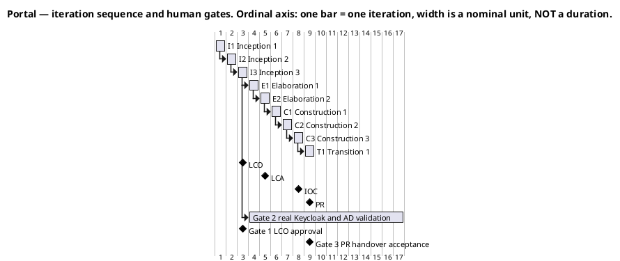
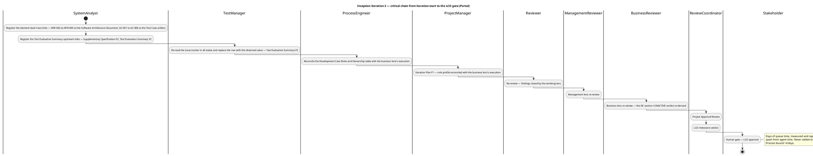

## Document Control
- **Phase:** Inception
- **Status:** Draft — under review
- **Milestone Target:** End of Inception (not yet achieved)
- **Iteration:** 3, Cycle 1
- **Owner:** ProjectManager
- **Date:** 2026-10-08
## Iteration Objectives
This plan carries two levels. The **coarse roadmap** is cross-iteration: the milestone sequence and the iteration boundaries. The **fine plan** is bounded to Inception iteration 3: its work items and their owners. Planning beyond the next iteration in fine-grained detail is waste — no architectural baseline and no measured actual for Elaboration exist yet.

```plantuml
@startuml
title Iteration Plan structure — the two-level planning model (Portal, Inception 3)

skinparam classAttributeIconSize 0

class "Iteration Plan" as IP <<document>> {
  + Document Control
  + Iteration Objectives
  + Plan and Milestones
  + Resources
  + Use Cases and Scenarios Addressed
  + Evaluation Criteria
  + Traceability
}

class "Coarse roadmap" as COARSE <<section>> {
  + milestone sequence LCO LCA IOC PR
  + iteration boundaries
  + cross-iteration, one per iteration
  + no fine-grained detail beyond the next iteration
}

class "Fine plan" as FINE <<section>> {
  + this iteration's work items
  + one owner per work item
  + no size in any human-team unit
  + bounded to the current iteration
}

class "Agent role profile" as ROLES <<section>> {
  + role to iteration assignment
  + participating roles only
}

class "Milestone" as MS <<entity>> {
  + id : LCO LCA IOC PR
  + exit criteria
  + verdict owner : ReviewCoordinator
}

class "WorkItem" as WI <<entity>> {
  + objective
  + owner : role
  + size : empty until a phase closes
}

class "HumanGate" as GATE <<entity>> {
  + queue time in days
  + ceiling : process bound 14 days
  + never added to agent time
}

IP *-- COARSE
IP *-- FINE
IP *-- ROLES
COARSE *-- MS
FINE *-- WI
COARSE *-- GATE

note bottom of FINE
  A work item carries NO size at all until a
  phase has closed and a measured actual
  exists. Never hours, days, weeks or
  person-anything. An empty size is correct.
end note

note bottom of GATE
  Two currencies, never summed:
  agent work in tokens and measured elapsed
  time; human gates in days of queue time.
end note
@enduml
```

### Inception iteration 3 — objectives

| # | Objective | Exit evidence |
|---|---|---|
| O-1 | Close every finding open at the end of Inception 2, minor ones included. | The Review Record's finding ledger carries no open finding. |
| O-2 | Register the declared trace links in the trace repository so the coverage the artifacts claim is machine-verifiable. | The Requirements Traceability Matrix shows no Business-level LEAF for NFR-002 to NFR-005, and the Test Evaluation Summary appears in the trace tree. |
| O-3 | Re-run the review with all three lenses at the LCO gate. | Review Record entries from the Reviewer, the BusinessReviewer and the ManagementReviewer. |
| O-4 | Conduct the Project Approval Review ahead of the LCO verdict. | The Review Record's Project Approval Review entry. |
| O-5 | Re-assess LCO readiness against X-1 to X-5 on the corrected baseline and record the verdict. | The ReviewCoordinator's LCO verdict in the Review Record. |

**Not an objective of this iteration.** No executable increment. Inception's output is the artifact scope and the risk record, not running code. No acceptance criterion is closed this iteration — see Evaluation Criteria. No use case is newly detailed: the selection made in Inception 1 stands.

## Plan and Milestones
### Coarse roadmap — milestone sequence and iteration boundaries

Nine iterations, distributed Inception 3, Elaboration 2, Construction 3, Transition 1. This sits inside the 6 ± 3 rule and is justified against the risk profile, not against the rubber profile's default shape.

| Milestone | Closes | Exit criteria | Verdict owner |
|---|---|---|---|
| **LCO** — Lifecycle Objectives | Inception 3 | Stakeholders agree on the scope; the project is viable to proceed; the initial risks are identified and classified; no finding from the Inception 1 or Inception 2 review remains open. | ReviewCoordinator |
| **LCA** — Lifecycle Architecture | Elaboration 2 | The architecture is stable and validated against the real Keycloak and the real AD; the highest-magnitude risks are retired or bounded; the plan for Construction is credible. | ReviewCoordinator |
| **IOC** — Initial Operational Capability | Construction 3 | The declared scope is implemented, integrated and tested; the system is ready for handover to Infrastructure. | ReviewCoordinator |
| **PR** — Product Release | Transition 1 | The product is released to the declared population; Infrastructure has accepted operation. | ReviewCoordinator |

```plantuml
@startgantt
title Portal — iteration sequence and human gates. Ordinal axis: one bar = one iteration, width is a nominal unit, NOT a duration.
[I1 Inception 1] lasts 1 day
[I2 Inception 2] lasts 1 day
[I3 Inception 3] lasts 1 day
[E1 Elaboration 1] lasts 1 day
[E2 Elaboration 2] lasts 1 day
[C1 Construction 1] lasts 1 day
[C2 Construction 2] lasts 1 day
[C3 Construction 3] lasts 1 day
[T1 Transition 1] lasts 1 day
[I2 Inception 2] starts at [I1 Inception 1]'s end
[I3 Inception 3] starts at [I2 Inception 2]'s end
[E1 Elaboration 1] starts at [I3 Inception 3]'s end
[E2 Elaboration 2] starts at [E1 Elaboration 1]'s end
[C1 Construction 1] starts at [E2 Elaboration 2]'s end
[C2 Construction 2] starts at [C1 Construction 1]'s end
[C3 Construction 3] starts at [C2 Construction 2]'s end
[T1 Transition 1] starts at [C3 Construction 3]'s end
[LCO] happens at [I3 Inception 3]'s end
[LCA] happens at [E2 Elaboration 2]'s end
[IOC] happens at [C3 Construction 3]'s end
[PR] happens at [T1 Transition 1]'s end
[Gate 2 real Keycloak and AD validation] lasts 14 days
[Gate 2 real Keycloak and AD validation] starts at [E1 Elaboration 1]'s start
[Gate 1 LCO approval] happens at [I3 Inception 3]'s end
[Gate 3 PR handover acceptance] happens at [T1 Transition 1]'s end
note bottom
  ORDINAL AXIS, NO CALENDAR. One bar is one iteration and its width is a nominal unit, not a
  duration. The "1 day" token is PlantUML's syntax for that nominal unit: it is not a measured
  or estimated duration, and no calendar date is projected from it. No project start date is set.
  The only measured quantity on this chart is the human gate, in days of queue time, reported
  apart from agent time and never added to it.
end note
@endgantt
```

**Reading the chart.** The axis is ordinal, not calendar: one bar is one iteration and its width is a nominal unit, not a duration. No project start date is set and no calendar date is projected from an estimate — a date computed from an estimate reads downstream as an observation. The only measured quantity on this chart is the human gate, in days of queue time, and it is reported apart from agent time and never added to it. The 14-day bar is the process bound on a human gate, not an estimate of work.

**Why nine iterations, and why this distribution.**

| Phase | Iterations | Justification against the risk profile |
|---|---|---|
| Inception | 3 | The first iteration produced the requirements baseline, the risk record and the first-cut architecture; its review raised eleven findings and the stakeholder refused the LCO sanction. The second iteration closed ten of those eleven and raised six new ones, of which four Major and two Minor remain open; the stakeholder refused the sanction again on the same condition — every iteration's findings closed, without exception. Inception 3 is not a re-derivation of the baseline: it is the closure of the findings the second review raised, and the re-assessment of LCO readiness. CON-026 names another iteration as the remedy for a milestone delayed at a human gate, and the same remedy applies to a refused sanction. |
| Elaboration | 2 | **Stretched.** Three of the highest-magnitude risks are architectural and are retired only by building and validating: R001 (live LDAP read against inconsistently filled attributes), R003 (the human validation gate on the real Keycloak and AD, whose feedback must land before Elaboration closes), R004 (client-supplied clocking timestamp). Elaboration 1 builds the architecture and starts the human gate; Elaboration 2 absorbs the gate's feedback and stabilises. One iteration would leave the gate's feedback with nowhere to land. |
| Construction | 3 | Twelve use cases over three processes, with the audit trail and the two closed value lists. Three iterations let the increment be integrated and tested per iteration rather than in one terminal test phase. |
| Transition | 1 | **Compressed.** Internal deployment to a declared population of 200, no user training required (AC-005 requires 80% to clock with no prior training), no data migration (CON-037), and Infrastructure already operates the platform (CON-036). There is no user-training or migration work to spread over a second iteration. |

**The spend split is measured, not assumed.** Two iterations have now closed with a measured actual, recorded in the Iteration Assessment. Those measured values replace the rubber profile's assumed share for Inception in every forecast made from here on. No other phase has closed, so no other phase carries a spend figure, and the rubber profile's 5/20/65/10 shape is not used as a spend forecast anywhere in this plan.

### Fine plan — Inception iteration 3

Work items, one owner each. **No work item carries a size.** A size in hours, days, weeks or person-anything would be a unit this system does not measure. The iteration-level forecast is stated once, below the critical chain, and traces to the measured actuals of the two closed iterations.

| # | Work item | Owner | Depends on | Exit evidence |
|---|---|---|---|---|
| W-1 | Close Supplementary Specification#F2: register the element-level links in the trace repository — NFR-002 to NFR-005 to the Software Architecture Document, and AC-001 to AC-006 to the Test Case artifact — or drop the element-level rows and state that the artifact-level link is the registered one. | SystemAnalyst, trace steward | — | Requirements Traceability Matrix shows no Business-level LEAF for NFR-002 to NFR-005; finding closed by the Reviewer. |
| W-2 | Close Test Evaluation Summary#F2 (deferred): register the artifact's declared upstream links so the coverage the summary claims is machine-verifiable. Tracked by Issue #1. | SystemAnalyst, trace steward | — | Test Evaluation Summary appears in the trace tree; finding closed by the Reviewer. |
| W-3 | Close Test Evaluation Summary#F3: re-read the issue tracker in all states, replace the row with the observed value, and correct the reading — the artifact's own Defect lifecycle section already states that the issue tracker is the authoritative record. | TestManager | — | Test Evaluation Summary corrected; finding closed by the Reviewer. |
| W-4 | Close Iteration Plan#F1 (Minor): reconcile the role profile with the observed execution of the business lens, in the same pass as the Development Case's Roles and Ownership table. | ProjectManager | — | This Iteration Plan; finding closed by the BusinessReviewer. |
| W-5 | Reconcile the Development Case's Roles and Ownership table with the business lens's execution, in the same pass as W-4, so the two artifacts cannot disagree again. | ProcessEngineer | W-4 | Development Case corrected. |
| W-6 | Re-review every corrected artifact and close each finding from the lens that emitted it, including the gate-condition findings Supplementary Specification#F1, Test Evaluation Summary#F1 and Iteration Plan#F5, which close when their underlying defect closes. | Reviewer, ManagementReviewer, BusinessReviewer | W-1, W-2, W-3, W-4, W-5 | Review Record — no open finding. |
| W-7 | Conduct the Project Approval Review. | ReviewCoordinator | W-6 | Review Record — Project Approval Review entry. |
| W-8 | Rule on the LCO milestone. | ReviewCoordinator | W-7 | LCO verdict in the Review Record. |

```plantuml
@startuml
title Inception Iteration 3 — critical chain from iteration start to the LCO gate (Portal)

|SystemAnalyst|
start
:Register the element-level trace links — NFR-002 to NFR-005 to the Software Architecture Document, AC-001 to AC-006 to the Test Case artifact;
:Register the Test Evaluation Summary upstream links — Supplementary Specification F2, Test Evaluation Summary F2;

|TestManager|
:Re-read the issue tracker in all states and replace the row with the observed value — Test Evaluation Summary F3;

|ProcessEngineer|
:Reconcile the Development Case Roles and Ownership table with the business lens's execution;

|ProjectManager|
:Iteration Plan F1 — role profile reconciled with the business lens's execution;

|Reviewer|
:Re-review — findings closed by the emitting lens;

|ManagementReviewer|
:Management lens re-review;

|BusinessReviewer|
:Business lens re-review — the DC section 4 INACTIVE verdict re-derived;

|ReviewCoordinator|
:Project Approval Review;
:LCO milestone verdict;

|Stakeholder|
:Human gate — LCO approval;
note right
  Days of queue time, measured and reported
  apart from agent time. Never added to it.
  Process bound 14 days.
end note
stop
@enduml
```

**The critical chain.** The chain is sequential, not parallel: each stretch consumes the artifact the previous one produced, and the depth of the chain is the count of sequential agent stretches from iteration start to the gate — eight stretches here, against eight in Inception 2 and seven in Inception 1. The chain ends at a human gate, not at an agent: the LCO verdict is the ReviewCoordinator's, and the approval behind it is the stakeholder's.

**Forecast spend for this iteration.** Two iterations have closed with a measured actual, and they are the only basis a forecast may rest on:

| Closed iteration | Token spend | Agent elapsed time | Human queue time |
|---|---|---|---|
| Inception 1 | 6,891,971 | 1:17:17.4186317 | 0:00:00 |
| Inception 2 | 11,955,748 | 2:22:39.389271 | 0:00:00 |

Inception 2 cost 1.73× Inception 1 in tokens and 1.85× in agent elapsed time, over one additional sequential stretch and the same eight-artifact surface. The growth is the cost of re-reading the accumulated artifact surface to correct it, not of authoring new content. Inception 3 carries eight sequential stretches over the same surface, with a smaller correction set — six open findings against eleven — so the forecast is of the same order as Inception 2's measured actual, not below it: the trace-registration work is new work, not a correction of existing text. No per-stretch figure is derived: two measured iterations do not yield a per-stretch distribution, and inventing one would be a fabricated observation. The forecast is revised against Inception 3's own measured actual when the iteration closes. **No budget is set and none is proposed** — CON-034 declares no budget or cap on token spend and none is to be set by the team, and declared scope is never cut or deferred to fit an estimate.

**Human gates.** Reported in days of queue time, apart from agent time, never summed with it.

| Gate | What is waited for | Process bound | Measured queue time | Remedy if it delays a milestone |
|---|---|---|---|---|
| LCO approval | The stakeholder's agreement that the scope is right and the project is viable. | 14 days — the process bound on any human gate | 0:00:00, measured in Inception 1 and Inception 2 | Another iteration (CON-026). |
| Real Keycloak and AD validation | Infrastructure with HR validating the real identity provider and the real directory (CON-035). Human work, not team work to plan. | 14 days — the process bound on any human gate, and the ceiling declared in the Development Case | Not yet opened; opens at the start of Elaboration 1 | Another iteration (CON-026). |
| PR handover acceptance | Infrastructure accepting operation of the portal (CON-036). | 14 days — the process bound on any human gate | Not yet reached | Another iteration (CON-026). |

**The 14-day bound is the process rule for any human gate, not a per-gate declaration.** It applies to all three gates. Where a gate has no declared ceiling of its own, the process bound applies and is reported; no per-gate ceiling is invented, and no gate is left without the process bound. Measured queue time is reported apart from agent time and is never added to it.

## Resources
The agent role profile: which roles execute in which iteration. Roles not listed do not participate — BusinessProcessAnalyst (Business Modeling inactive, no business model is authored) and CapsuleDesigner (not a real-time system) do not participate in any iteration.

| Role | I1 | I2 | I3 | E1 | E2 | C1 | C2 | C3 | T1 |
|---|---|---|---|---|---|---|---|---|---|
| ProcessEngineer | author | correct | correct | prepare | prepare | — | — | — | — |
| SystemAnalyst | author | correct | correct | detail | detail | — | — | — | — |
| RequirementsSpecifier | author | correct | — | detail | detail | — | — | — | — |
| SoftwareArchitect | author | — | — | author | stabilise | guide | guide | guide | — |
| Designer | — | — | — | author | author | author | author | author | — |
| UserInterfaceDesigner | — | — | — | author | author | author | author | author | — |
| DatabaseDesigner | — | — | — | author | author | author | — | — | — |
| Implementer | — | — | — | build | build | build | build | build | — |
| Integrator | — | — | — | — | integrate | integrate | integrate | integrate | — |
| TestManager | — | correct | correct | plan | plan | plan | plan | plan | — |
| TestAnalyst | — | — | — | — | author | author | author | author | — |
| TestDesigner | — | — | — | — | author | author | author | author | — |
| Tester | — | — | — | — | execute | execute | execute | execute | execute |
| DeploymentManager | — | — | — | — | — | — | — | prepare | deploy |
| ConfigurationManager | — | — | — | configure | maintain | maintain | maintain | maintain | maintain |
| ChangeControlManager | — | — | — | — | — | on CR | on CR | on CR | on CR |
| ProjectManager | author | author | author | plan | plan | plan | plan | plan | plan |
| TechnicalWriter | — | — | — | — | — | author | author | author | author |
| Reviewer | review | review | review | review | review | review | review | review | review |
| CodeReviewer | — | — | — | — | — | review | review | review | — |
| ManagementReviewer | review | review | review | — | review | — | — | review | review |
| BusinessReviewer | review | review | review | — | review | — | — | review | review |
| ReviewCoordinator | verdict | verdict | verdict | verdict | verdict | verdict | verdict | verdict | verdict |

**The business lens at every lifecycle gate.** The BusinessReviewer participates in I1, I2, I3, E2, C3 and T1 — the iterations that close the four lifecycle milestones LCO (I3), LCA (E2), IOC (C3) and PR (T1), plus the two earlier Inception iterations for the record. The business lens is the only lens that re-derives the Development Case §4 INACTIVE verdict each iteration, and that re-derivation is what would catch a business process entering scope through a Change Request. Leaving its execution unplanned would leave the re-derivation unscheduled. The lens's output at each gate is a Review Record entry: the re-derived §4 verdict, the business-volatility annotation check, and the business-dimension traceability compliance check. The BusinessProcessAnalyst remains non-participating: the discipline is inactive, so no business model, no `BUC-NNN` and no `BR-NNN` is authored. Executing the lens is not authoring the model, and the two are recorded separately here so the profile and the Development Case's Roles and Ownership table cannot disagree.

**The management lens at every lifecycle gate.** The ManagementReviewer participates in I1, I2, I3, E2, C3 and T1 — the iterations that close the four lifecycle milestones LCO (I3), LCA (E2), IOC (C3) and PR (T1), plus the two earlier Inception iterations for the record. The management lens supplies evidence at each gate: a compliance table against that milestone's exit criteria, a risk status chart with trend direction, and a four-axis health scorecard. The ReviewCoordinator remains the verdict owner — the management lens supplies evidence, it does not replace the coordinator. A gate verified only by the technical lens has no assessment of feasibility, acceptability, four-axis health or risk-retirement trend, which is what LCO, LCA and IOC require.

**Parallelism discipline.** The profile above is the plan, not a lever. If an iteration slips, the remedy is another iteration — never more agent roles executing at once, and never cutting declared scope. Adding roles to a phase increases coordination overhead and artifact contention without proportional benefit, and declared scope is the stakeholder's to change, not the plan's.

**Human resources.** One human participates: the stakeholder, at the three gates above. Infrastructure and HR perform the real-Keycloak and real-AD validation as human work (CON-035); it is bounded as a risk (R003), not as an estimate.
## Use Cases and Scenarios Addressed
Inception 3 selects no use case for detail and changes no use case. The selection made in Inception 1 stands: all twelve surveyed one-to-one against the twelve declared requirements, five detailed because they force an architectural decision. Inception 3 closes findings against the artifacts that carry them; it does not re-scope the iteration.

| UC | Source | Selection | Changed this iteration |
|---|---|---|---|
| UC-002 | FR-002 | Detailed (Inception 1) | No |
| UC-004 | FR-004 | Detailed (Inception 1) | No |
| UC-005 | FR-005 | Detailed (Inception 1) | No |
| UC-010 | FR-010 | Detailed (Inception 1) | No |
| UC-011 | FR-011 | Detailed (Inception 1) | No |
| UC-001 | FR-001 | Surveyed (Inception 1) | No |
| UC-003 | FR-003 | Surveyed (Inception 1) | No |
| UC-006 | FR-006 | Surveyed (Inception 1) | No |
| UC-007 | FR-007 | Surveyed (Inception 1) | No |
| UC-008 | FR-008 | Surveyed (Inception 1) | No |
| UC-009 | FR-009 | Surveyed (Inception 1) | No |
| UC-012 | FR-012 | Surveyed (Inception 1) | No |

**Scenarios.** The alternative flows that carry a risk or an invariant are the ones the TestDesigner must cover from Elaboration 2: UC-002 A1 (duplicate press), A2 (network unreachable), A3 (clock-out with no open pair); UC-004 A1 (clock-out missing), A2 (day with no clocking), A3 (no category); UC-005 A1 (insertion for a day with no clocking), A2 (employee attempts a correction); UC-010 A1 (clearing the flag on the featured item), A2 (no item featured); UC-011 A1 (empty attribute), A2 (no category), A3 (network unreachable), A4 (no match). None is executed this iteration.

**No use case is split per actor.** UC-003, UC-004 and UC-005 are three distinct HR goals over the same clocking data — viewing, exporting and correcting are separate outcomes with separate triggers.
## Evaluation Criteria
Two layers, kept apart.

### (a) Declared acceptance criteria — every AC-NNN accounted for

All six declared acceptance criteria are accounted for. **None is closed this iteration**, because Inception 3 produces no executable increment. Each is deferred to a named iteration and the evidence that will close it is named.

| AC | Criterion | This iteration | Deferred to | Evidence that will close it |
|---|---|---|---|---|
| AC-001 | The performance criterion is the full page load as the employee experiences it, including the clocking page's script. | Not closable — no executable exists. | Construction 1 | A measured full page load on the corporate network, browser request to page displayed and usable. Server response time is the engineering target, not a substitute. |
| AC-002 | An employee can clock in and out without help from HR or the development team. | Not closable — no executable exists. | Construction 1 | UC-002 exercised end to end with no assistance. |
| AC-003 | An HR Administrator can publish a news item without technical assistance. | Not closable — no executable exists. | Construction 2 | UC-006 exercised end to end with no assistance. |
| AC-004 | Any employee finds a colleague's phone/email in under 10 seconds. | Not closable — no executable exists. | Construction 2 | UC-011 exercised against the stand-in directory; re-verified against the real AD after the Elaboration gate. |
| AC-005 | 80% of employees complete at least one clocking with no prior training. | Not closable — no executable exists. | Transition 1 | Adoption measured against the declared population of 200 after go-live. |
| AC-006 | A clocking made while the corporate network is down for up to 5 minutes is not lost. | Not closable — no executable exists. | Construction 1 | UC-002 A2 exercised with the network down for the full window. |

### (b) This iteration's own exit criteria

X-1 to X-5 are re-assessed in Inception 3, not assumed met in an earlier iteration. Each now carries the closure of the findings that touch it.

| # | Exit criterion | Met when |
|---|---|---|
| X-1 | The requirements baseline is complete and reviewed: twelve declared requirements as twelve use cases, one-to-one, with no use case lacking a declared source, and no finding open against the Vision, the Use-Case Model or the Supplementary Specification. | Vision, Use-Case Model and Supplementary Specification corrected; Supplementary Specification#F2 and its gate condition #F1 closed by their emitting lenses. |
| X-2 | Every risk is classified with a strategy and an owner, and every accepted risk names the basis of its acceptance. | Risk List persisted; R001 to R010 each carry strategy, owner, mitigation, contingency and an observable indicator; each accepted risk names its CON-024 basis. |
| X-3 | The coarse roadmap and this iteration's fine plan are composed, with no work item sized in a unit this system does not measure, and no finding open against the Iteration Plan. | This Iteration Plan; Iteration Plan#F1 (Minor) and its gate condition #F5 closed by their emitting lenses. |
| X-4 | The first-cut architecture confronts the highest-magnitude technical risks rather than deferring them. | Software Architecture Document persisted, addressing R001, R003, R004 and R008. |
| X-5 | LCO readiness is re-assessed and the verdict recorded, with no finding open against any artifact. | The ReviewCoordinator's LCO verdict in the Review Record, following the Project Approval Review. |

**LCO readiness assessment.** The project is viable to proceed to Elaboration. The scope is agreed and complete — twelve declared requirements, twelve use cases, no open scope question. The initial risks are identified and classified, and the three highest-magnitude ones (R001, R003, R004) are architectural and are confronted in Elaboration rather than deferred. The architecture is first-cut and its two external dependencies — the existing Keycloak and the read-only AD — are declared, bounded and validated by human work whose feedback lands before Elaboration closes. What Inception 1 and Inception 2 did not deliver is a clean review: eleven findings were raised in the first iteration and six in the second, and the sanction was refused twice on the same condition. Inception 3 exists to close the remaining six. **This assessment is the ProjectManager's; the milestone verdict is the ReviewCoordinator's, and the milestone is not achieved until that verdict is recorded.**

## Traceability
| Element | Traces From | Link Type | Traces To |
|---|---|---|---|
| Iteration Plan | R001, R002, R003, R004, R005, R006, R007, R008, R009, R010 | Refines | Risk List |
| Iteration Plan | UC-001, UC-002, UC-003, UC-004, UC-005, UC-006, UC-007, UC-008, UC-009, UC-010, UC-011, UC-012 | Refines | Use-Case Model |
| Iteration Plan | AC-001, AC-002, AC-003, AC-004, AC-005, AC-006 | Refines | Test Case |
| Iteration Plan | CON-023, CON-024, CON-025, CON-026, CON-034 | Refines | Development Case |
| Iteration Plan | BG-001, BG-002, BG-003 | Refines | Vision |
| Iteration Plan | NFR-001, NFR-002, NFR-003, NFR-004, NFR-005 | Refines | Supplementary Specification |

**Reading the table.** The Iteration Plan is sequenced by the Risk List, scoped by the Use-Case Model, and bounded by the Development Case's risk governance and measurement policy. Its acceptance criteria are verified by Test Cases that do not exist yet — the `Traces To` end is the artifact that will carry them, and it is empty of elements this iteration. The plan's forecast spend is built from the Iteration Assessment's measured actuals, which the assessment records; the link is not duplicated here.
