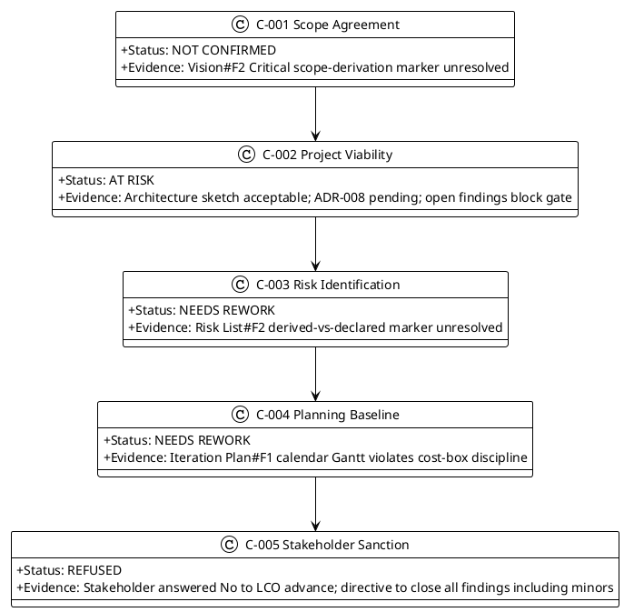
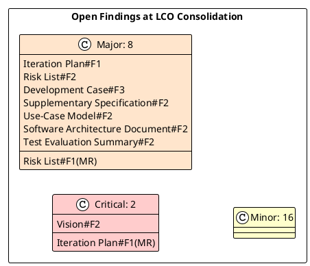
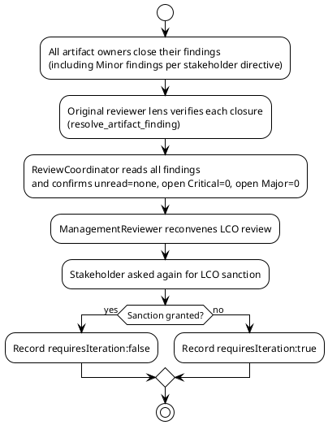
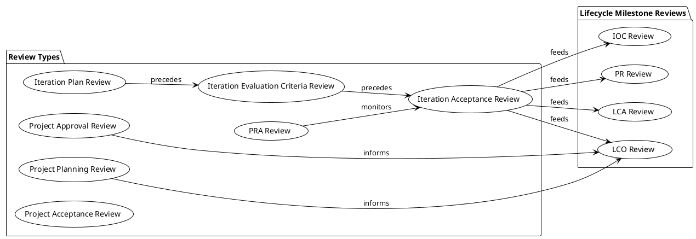

## Document Control

| Field | Value |
|---|---|
| Project | Portal |
| Phase | Inception |
| Iteration | 1 |
| Status | Consolidated — LCO No-Go |
| Milestone Target | Lifecycle Objectives (LCO) |
| Review Type | Lifecycle Milestone Review |
| Review Coordinator | ReviewCoordinator |
| Date | 2026-09-11 |

## Review Scope and Criteria

This is the consolidated authoritative Review Record for the Inception Iteration 1 Lifecycle Objectives (LCO) milestone review. It aggregates findings from all reviewer lenses that evaluated the review and records the final milestone disposition.

### Lenses Participating in This Review

| Lens | Status | Artifacts Evaluated |
|---|---|---|
| Reviewer (Technical) | EXECUTED | Vision, Iteration Plan, Risk List, Development Case, Supplementary Specification, Use-Case Model, Software Architecture Document, Test Evaluation Summary |
| BusinessReviewer | INACTIVE — did not evaluate this review | — |
| ManagementReviewer | EXECUTED | Iteration Plan, Risk List, and LCO sanction question |

### Artifacts Reviewed

| Artifact | Owner | Review Status |
|---|---|---|
| Vision | System Analyst | Findings open |
| Iteration Plan | Project Manager | Findings open |
| Risk List | Project Manager | Findings open |
| Development Case | Process Engineer | Findings open |
| Supplementary Specification | RequirementsSpecifier | Findings open |
| Use-Case Model | System Analyst | Findings open |
| Software Architecture Document | Software Architect | Findings open |
| Test Evaluation Summary | Test Manager | Findings open |

### LCO Exit Criteria Assessed

## Findings

### Critical Findings

| ID | Artifact | Lens | Severity | Finding | Verdict |
|---|---|---|---|---|---|
| Vision#F2 | Vision | Reviewer | Critical | STK-001 (Laura Gómez) is described as performing specific HR capabilities (publish/edit/unpublish news, manage worker categories, view all clockings, export CSV, correct/insert clockings) without a [DERIVED] marker. The Work Order explicitly states these capabilities are derived from the HR role, not from the stakeholder's own description of Laura. This is silent promotion of a derivation to declared scope. | NeedsRework |
| Iteration Plan#F1 (MR) | Iteration Plan | ManagementReviewer | Critical | LCO stakeholder sanction REFUSED. The stakeholder did not accept advancing past the Lifecycle Objectives milestone while open findings remain. The project is blocked at the LCO gate until all findings (including Minor findings per the stakeholder's explicit directive) are closed. | NeedsRework |

### Major Findings

| ID | Artifact | Lens | Severity | Finding | Verdict |
|---|---|---|---|---|---|
| Iteration Plan#F1 | Iteration Plan | Reviewer | Major | The Iteration Plan's coarse Gantt chart projects fixed calendar dates by adding durations to 2026-09-11. Per the IARI baseline, iterations are cost-boxed in tokens + elapsed time, not time-boxed by calendar; projecting dates from an assumed duration violates the two-currency measurement discipline and the anti-fabrication rule. | NeedsRework |
| Risk List#F2 | Risk List | Reviewer | Major | The Risk List introduces 6 new risks (R003-R008) beyond the 2 declared in the Work Order (R001, R002). While risk identification is encouraged, the Project Manager should ensure these are not disguised design decisions or assumptions. R004, R006, R007, and R008 in particular read more like Elaboration concerns than Inception risks. | NeedsRework |
| Risk List#F1 (MR) | Risk List | ManagementReviewer | Major | Stakeholder directive: "Close all findings even if they are minors." This raises the LCO exit bar — no findings of any severity may remain open at re-review. The project must budget additional rework and re-review queue time. | NeedsRework |
| Development Case#F3 | Development Case | Reviewer | Major | The Data Model optional artifact is declared TRIGGERED, but the Development Case does not state who produces it or in which iteration. The IARI baseline assigns Data Model to the DatabaseDesigner, yet the Roles and Ownership table only says DatabaseDesigner "contributes to: Design Model (Data Model section)" and the Optional Artifact Triggers section says "The DatabaseDesigner will produce this artifact in Elaboration" without tying it to a specific iteration. | NeedsRework |
| Supplementary Specification#F2 | Supplementary Specification | Reviewer | Major | The cross-cutting mechanisms table states that Authentication is included from UC-001..UC-012, but the Authorization mechanism is listed as included only from UC-001, UC-002, UC-005..UC-010, omitting UC-003 and UC-004 (employee clocking actions) and UC-011, UC-012 (employee read actions). All UCs require authentication; any UC with behavior difference between HR and Employee roles requires authorization. The current table is inconsistent. | NeedsRework |
| Use-Case Model#F2 | Use-Case Model | Reviewer | Major | UC-009 Edit News Item main flow step 7 contains ambiguous logic: "If the featured flag is set and no other item is currently featured, system proceeds. If another item is featured, system clears its featured flag." This wording suggests a conditional check that is redundant with CON-019's invariant. The correct behavior per CON-019 is that featuring one item always un-features any existing featured item. | NeedsRework |
| Software Architecture Document#F2 | Software Architecture Document | Reviewer | Major | The SAD's ADR-008 "Timezone Handling Mechanism" leaves the product selection pending ("Decision pending until Elaboration; current recommendation is TimeZoneInfo"). The SAD does not mark the decision as [PENDING] or [ELABORATION DECISION], and the traceability table traces ADR-008 to a specific product decision that does not yet exist. | NeedsRework |
| Test Evaluation Summary#F2 | Test Evaluation Summary | Reviewer | Major | The Test Evaluation Summary presents a Defect Lifecycle diagram and a Current Defect Status table with zeros, creating the impression that defect tracking was exercised when it could not have been. It does not reference the open pull request state or CI build status, which are the actual SCM evidence available in Inception. | NeedsRework |

### Minor Findings

| ID | Artifact | Lens | Severity | Finding | Verdict |
|---|---|---|---|---|---|
| Vision#F1 | Vision | Reviewer | Minor | System Boundary diagram mixes human actors and external systems without explicit <<system>> or <<external system>> stereotypes. | Approved |
| Vision#F3 | Vision | Reviewer | Minor | Traceability table only traces to UC-001..UC-012 and F-001..F-011 as aggregates; does not cite specific FR-NNN / NFR-NNN identifiers per feature. | Approved |
| Iteration Plan#F2 | Iteration Plan | Reviewer | Minor | Fine Plan token budgets do not distinguish planned vs actual. | Approved |
| Iteration Plan#F3 | Iteration Plan | Reviewer | Minor | Evaluation criteria defer all acceptance criteria to later phases without explicit mapping table. | Approved |
| Risk List#F1 | Risk List | Reviewer | Minor | R003 marked with strategy "Transfer" and owner STK-003; should note CON-005 as scope-level mitigation. | Approved |
| Risk List#F3 | Risk List | Reviewer | Minor | Traceability table traces R006 to "Deployment Plan", but no Deployment Plan artifact exists. | Approved |
| Development Case#F1 | Development Case | Reviewer | Minor | Optional Trigger Evaluation activity diagram contains inverted yes/no labels for the Glossary decision branch. | Approved |
| Development Case#F2 | Development Case | Reviewer | Minor | CONTRIBUTING.md and CI/CD workflow gaps deferred to Elaboration but not tracked as risks or explicit gates. | Approved |
| Supplementary Specification#F1 | Supplementary Specification | Reviewer | Minor | REQ-P003 derived from AC-003; Elaboration note should clarify whether 10-second target is page-load or search-interaction target. | Approved |
| Supplementary Specification#F3 | Supplementary Specification | Reviewer | Minor | REQ-SU003 framed as project requirement rather than dependency on Infrastructure team confirmation. | Approved |
| Use-Case Model#F1 | Use-Case Model | Reviewer | Minor | System boundary diagram duplicates Vision diagram without showing <<include>> relationships for cross-cutting mechanisms. | Approved |
| Use-Case Model#F3 | Use-Case Model | Reviewer | Minor | UC-006 does not specify how HoursWorked is computed when clock-out is missing or correction exists. | Approved |
| Use-Case Model#F4 | Use-Case Model | Reviewer | Minor | UC-003 does not specify idempotency key generation strategy. | Approved |
| Software Architecture Document#F1 | Software Architecture Document | Reviewer | Minor | Application-layer components named after features rather than responsibilities of change. | Approved |
| Software Architecture Document#F3 | Software Architecture Document | Reviewer | Minor | Data View does not address performance risk of repeated LDAP queries with no caching permitted. | Approved |
| Software Architecture Document#F4 | Software Architecture Document | Reviewer | Minor | PoC Plan lists four risks for empirical validation but Development Case does not trigger standalone Architectural Proof-of-Concept artifact. | Approved |
| Test Evaluation Summary#F1 | Test Evaluation Summary | Reviewer | Minor | Mission verdict is "Pass" but self-assessed by Test Manager; should note independent review needed in future iterations. | Approved |

### Open Finding Summary

## Resolutions and Actions

### Action Register

| Action ID | Finding | Owner | Target Artifact | Severity | Due | Status |
|---|---|---|---|---|---|---|
| A-001 | Vision#F2 | System Analyst / Project Manager | Vision | Critical | Before LCO re-review | Open |
| A-002 | Iteration Plan#F1 (MR) | Project Manager / Stakeholder | Review Record / Iteration Plan | Critical | Before LCO re-review | Open |
| A-003 | Iteration Plan#F1 | Project Manager | Iteration Plan | Major | Before LCO re-review | Open |
| A-004 | Risk List#F2 | Project Manager | Risk List | Major | Before LCO re-review | Open |
| A-005 | Risk List#F1 (MR) | Project Manager | Risk List / Iteration Plan | Major | Before LCO re-review | Open |
| A-006 | Development Case#F3 | Process Engineer | Development Case | Major | Before LCO re-review | Open |
| A-007 | Supplementary Specification#F2 | RequirementsSpecifier | Supplementary Specification | Major | Before LCO re-review | Open |
| A-008 | Use-Case Model#F2 | System Analyst | Use-Case Model | Major | Before LCO re-review | Open |
| A-009 | Software Architecture Document#F2 | Software Architect | Software Architecture Document | Major | Before LCO re-review | Open |
| A-010 | Test Evaluation Summary#F2 | Test Manager | Test Evaluation Summary | Major | Before LCO re-review | Open |
| A-011..A-026 | All Minor findings | Respective artifact owners | All reviewed artifacts | Minor | Before LCO re-review | Open |

### Rework and Re-Review Plan

## Disposition

### Stakeholder Sanction

**Stakeholder sanction: REFUSED**

The stakeholder was asked: "Knowing the open defects, do you accept the project scope and objectives and sanction advancing past the Lifecycle Objectives milestone, subject to the team resolving the Conditional findings before Elaboration begins?"

The stakeholder answered: **No**

Additional stakeholder directive: **"Close all findings even if they are minors."**

### Milestone Verdict

**Verdict: No-Go — requires iteration**

The Lifecycle Objectives (LCO) milestone is **not sanctioned**. The project remains in Inception until:

1. All open findings across all reviewed artifacts are closed, including all Minor findings as directed by the stakeholder.
2. The original reviewer lenses resolve their findings via `resolve_artifact_finding`.
3. The ReviewCoordinator confirms from the finding data that unread=none, open Critical=0, open Major=0, and open Minor=0.
4. The ManagementReviewer reconvenes the LCO review and the stakeholder grants explicit sanction to proceed.

### Review Process Artifacts

## Traceability

| Element | Traces From | Link Type | Traces To |
|---|---|---|---|
| Review Record | Vision, Use-Case Model, Supplementary Specification, SAD, Iteration Plan, Risk List, Development Case, Test Evaluation Summary | Refines | LCO exit criteria |
| Review Record | Reviewer findings | DependsOn | Vision#F2, Iteration Plan#F1, Risk List#F2, Development Case#F3, Supplementary Specification#F2, Use-Case Model#F2, Software Architecture Document#F2, Test Evaluation Summary#F2 |
| Review Record | ManagementReviewer findings | DependsOn | Iteration Plan#F1(MR), Risk List#F1(MR) |
| LCO verdict | Stakeholder response | Refines | Iteration Plan rework, Risk List update |
| Action A-001 | Vision#F2 | DependsOn | STK-001, FR-001..FR-012 |
| Action A-003 | Iteration Plan#F1 | DependsOn | IARI DC §8.1 cost-boxing |
| Action A-004 | Risk List#F2 | DependsOn | R001..R008 |
| Action A-006 | Development Case#F3 | DependsOn | Data Model optional trigger |
| Action A-007 | Supplementary Specification#F2 | DependsOn | NFR-006, UC-001..UC-012 |
| Action A-008 | Use-Case Model#F2 | DependsOn | CON-019, UC-009 |
| Action A-009 | Software Architecture Document#F2 | DependsOn | ADR-008, CON-021 |
| Action A-010 | Test Evaluation Summary#F2 | DependsOn | AC-001..AC-005 |
