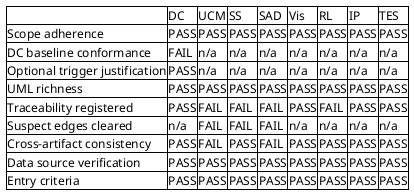
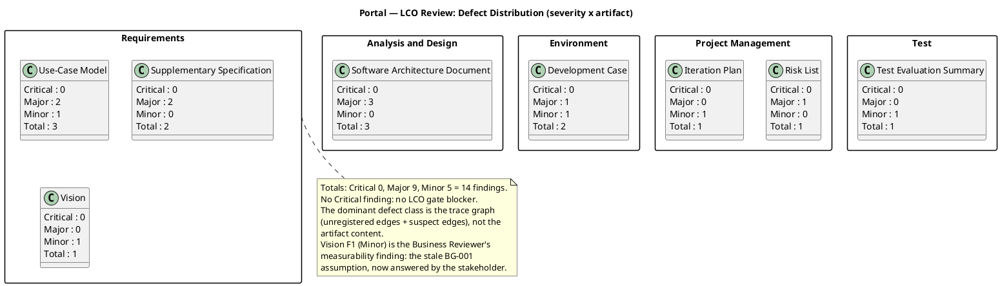
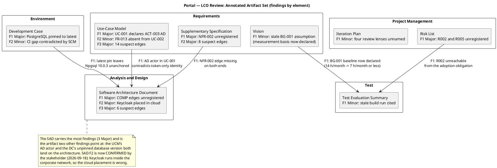
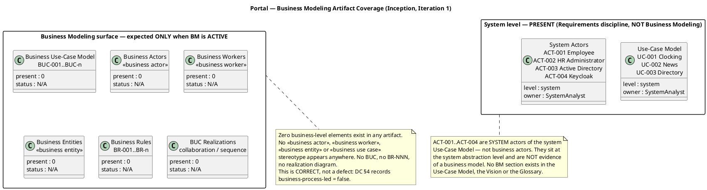
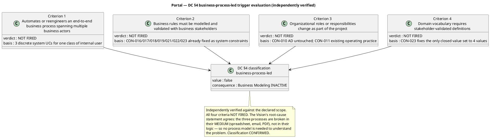
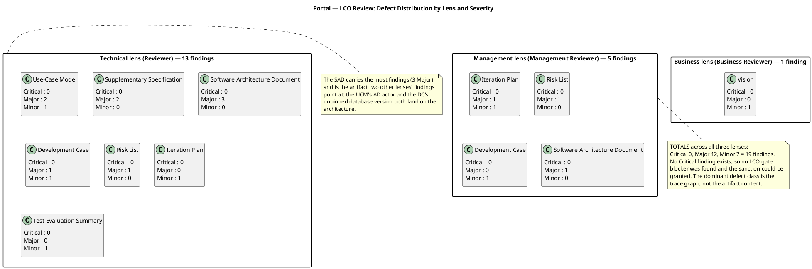
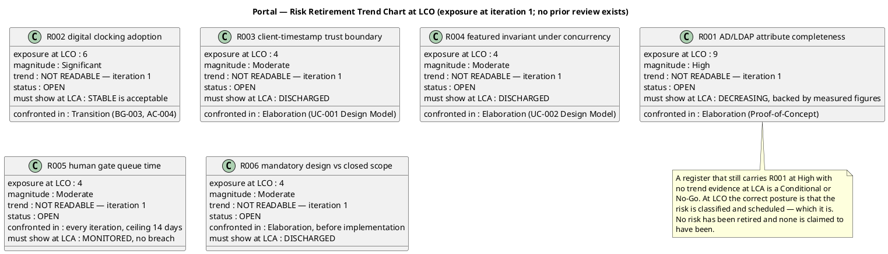

## Document Control
| Field | Value |
|---|---|
| Artifact | Review Record — Portal (Employee Portal, Cuba Corp) |
| Phase | Inception |
| Status | Draft — review executed; milestone NOT YET ACHIEVED |
| Milestone Target | End-of-Inception (LCO) — **not marked complete by this artifact** |
| Iteration / Cycle | 1 / 1 |
| Owner | Reviewer (technical lens) + Business Reviewer (business lens) + Management Reviewer (management lens) |
| Date | 2026-09-18 |
| Review type | Technical review against the LCO exit criteria — feasibility lens; the Business Modeling lens (DC §4 applicability) and the Vision business-goal measurability check; and the **Management Reviewer's LCO milestone review** — exit-criteria compliance, four-axis project health, and risk-retirement posture |
| Review point | Lifecycle Milestone (LCO) — exit criteria, not completion |
| Artifacts reviewed | 8 of 8 persisted artifacts |
| Findings this iteration | 19 (Critical 0, Major 12, Minor 7) — 13 from the technical lens, 1 from the Business Reviewer (Vision F1, Minor), **5 from the Management Reviewer (3 Major, 2 Minor)** |
| Prior findings of this lens | 0 — iteration 1, nothing to reconcile (all three lenses) |
| Business Modeling discipline | **INACTIVE** per DC §4 (`business-process-led = false`) — BusinessProcessAnalyst / BusinessReviewer not engaged |
| Open markers | **None.** The BG-001 measurement-basis question was answered by the stakeholder on 2026-09-18 and its marker is retired. The Keycloak placement question was answered on 2026-09-18 and its marker is retired. The PostgreSQL version question was answered on 2026-09-17 and is routed as a Change Request, not re-asked |
| **Stakeholder sanction** | **GRANTED — 2026-09-18.** STK-001 accepted the project scope and objectives and sanctioned advancing past the Lifecycle Objectives milestone, with **three conditions** to be closed in Elaboration Iteration 1 before the architecture baseline is committed |
| **LCO verdict (management lens)** | **Conditional Go** — no LCO exit criterion is missed on substance; the sanction is granted subject to the three conditions below |
| Milestone closure | **NOT marked complete by this artifact.** Closure is the ReviewCoordinator's verdict; the gate decision is STK-001's and has been given |

## Review Scope and Criteria
**What was reviewed.** Every artifact persisted for this project at the time of review — the complete inventory returned by `list_artifacts`, not a sample. The review point is the **Lifecycle Milestone (LCO)**, so the evaluative lens is **exit criteria**: do these artifacts collectively satisfy the conditions for phase transition? It is not a completion lens — Inception's increment is a decision-ready baseline, not an executable, and no artifact was judged for lacking code, test results or a running system.

**Checklist applied.** The artifact-type checklists from the Reviewer base competencies, plus the two Development-Case-specific criteria (DC Baseline Conformance, Optional Trigger Justification) applied to the Development Case, plus the scope-adherence criterion applied to every artifact that creates elements.

**Upstream consumption.** Every artifact was read in full before any finding was recorded. The traceability tree was projected from the model (`get_trace_chain`, rootLevel=Business) and the Requirements Traceability Matrix generated (`model_generate_rtm`) — the registered graph, not the artifacts' prose, is the authority for every traceability finding below. SCM state was read directly (`scm_list_pull_requests`, `scm_get_build_status`, `scm_list_issues`).

**SCM evidence (Construction/Transition discipline applied at LCO).**

| Observation | Value | Source |
|---|---|---|
| Open pull requests | **None** — no PR to dispose | `scm_list_pull_requests(state=open)` |
| Latest CI build on `main` | **success** — run `35324628665`, started 2026-09-18 08:29:27Z, completed 08:30:53Z | `scm_get_build_status` |
| Issues / Change Requests | **None** of any kind | `scm_list_issues(state=all)` |

No open PR required a terminal disposition: the S1B state exited with zero dispositions because the repository holds no open pull request. No productive code, no scope-ahead branch and no defective diff exists to approve, reject or defer. The green build is a signal that the repository builds; it is **not** evidence about any declared acceptance criterion, because no acceptance criterion is exercised by a build.

**Entry criteria verified.** All 8 artifacts present and non-placeholder; upstream artifacts available; checklist prepared. No review was abandoned mid-way.

### Compliance matrix — checklist items × artifact

**Reading the matrix.** `DC baseline conformance` is FAIL on the Development Case for the version-policy pin only — the roster, the CORE catalog, ownership and the optional-trigger table all conform. `Traceability registered` is FAIL on the four artifacts whose declared traceability tables are not matched by registered edges. `Suspect edges cleared` is FAIL on the three artifacts carrying inbound SUSPECT links at phase close. `Scope adherence` PASSes everywhere: no artifact added a functional area the stakeholder did not declare, no cross-cutting mechanism was promoted to a use case, and no per-actor use-case split occurred.

**Scope-adherence verification (the criterion most likely to fail on this project).** The declared scope is a closed set of 14 FRs, 4 NFRs, 24 CONs, 3 UCs, 5 ACs, 3 BGs, 4 STKs and 2 risks. Verified: the Use-Case Model defines **exactly three** use cases, matching the three declared `UC01`/`UC02`/`UC03`; there is no `UC-AUTH`, no `UC-LOG`, no `UC-SYNC`; authentication, the audit trail and the no-connection handling are Supplementary Specification constraints, correctly; each of the three use cases carries two primary actors on the **same** declared process rather than being split per actor. The Vision's "Not in scope" list reproduces every declared exclusion and adds the stakeholder's audit-view answer. No artifact invented a requirement, a screen or a subsystem outside the declared scope. **No scope-creep finding is recorded.**

**Optional-trigger audit (every FIRED row checked against its §5.2 condition).** The Development Case declares exactly one FIRED trigger: Architectural Proof-of-Concept, on R001 (exposure 9). The §5.2 condition is "Elaboration phase + at least one technical risk requiring empirical validation". R001 is a fact about the organization's AD data, not about the architecture, and the portal holds no local copy of the employee (CON-020) so a gap in AD has no fallback — the condition genuinely holds. The five NOT-FIRED verdicts were each checked: Glossary (no specialist vocabulary; the one closed value set is fixed by CON-023), Data Model (fewer than 10 entities, no migration per CON-012), Deployment Model (single node per CON-007, no multi-environment), User-Interface Prototype (the stakeholder already supplied and mandated the design per CON-013), Test Plan (no regulatory or contractual test-reporting obligation). **All six verdicts are justified; no over-triggering finding is recorded.**

### Business Modeling lens — scope and criteria (Business Reviewer)

**Scope of this lens.** The Business Modeling discipline only, and only the question DC §4 puts to it: is `business-process-led` true, and if so, are the business artifacts complete and derivation-ready? The lens does **not** re-review the Requirements, Analysis & Design, Environment, Project Management or Test artifacts — those are the technical lens's, and its findings above stand unaltered.

**Criteria applied.**

| Criterion | Standard applied | Outcome |
|---|---|---|
| Scenario selection | Which of the six BM scenarios applies, and is the BPA's selection correct? | **No scenario applies** — BM is inactive, so no scenario is selected and none is owed |
| DC §4 trigger evaluation | All four `business-process-led` criteria re-evaluated against the declared scope, not accepted on the ProcessEngineer's assertion | **All four NOT FIRED — classification CONFIRMED** |
| BUC completeness test | Every BUC actor-initiated, value-delivering, end-to-end | **N/A** — no BUC exists and none is required |
| BUC realization adequacy | N of M significant BUCs with complete realizations | **N/A** — no BUC to realize; Inception would not require full realizations in any case |
| Derivation bridge | Worker automation dispositions; entity→analysis-class annotations | **N/A** — no business worker or entity exists; system UCs derive directly from declared FR-NNN |
| Resource planning compliance | Each worker/entity implemented by one resource type | **N/A** — no worker or entity exists |
| Same modeling technique at business level | Business-domain stereotypes (`<<business actor>>`, `<<business worker>>`, `<<business entity>>`, `<<business use case>>`) | **N/A** — no business-level model exists; the system model correctly uses system-level actors |
| Stakeholder representation coverage | All significant organizational parts represented | **N/A to this lens** — organizational coverage is expressed through STK-001..STK-004 at the Vision level, reviewed by the technical lens |
| Business rules as formal constraints | ID + source + worker/entity attachment + testable condition | **N/A** — the declared business rules are CON-NNN constraints, already carrying ID, source and testable condition; no `BR-NNN` family exists |
| Diagram coverage | Inventory of diagrams present / absent / defective | **N/A** — no business diagram is owed; the coverage map below records the zero count as correct, not as a gap |
| UML richness of this review | Coverage map + trigger-evaluation diagram as the primary evidence | **Pass** — two validated PlantUML diagrams carry the verdict; prose supplements only what they cannot express |

**Entry criteria for this lens.** The Development Case exists and carries a §4 classification; the Use-Case Model, Vision and Glossary were each read to search for business-level content; the classification was independently re-derived rather than accepted. No review was abandoned mid-way.

### Management lens — scope and criteria (Management Reviewer)

**Scope of this lens.** The **LCO milestone exit criteria** and the project's management artifacts — the Iteration Plan, the Risk List, the Development Case and the Software Architecture Document's baseline-readiness posture. This lens does **not** re-review the requirements content, the architecture's technical decisions or the test strategy: those are the technical lens's and the business lens's, and their findings stand unaltered. What this lens adds is the question no technical lens asks: **do these artifacts collectively satisfy the conditions for phase transition, and is the project healthy on all four axes?**

**Checklist applied — the LCO exit criteria, each with a pass/fail determination.**

| # | LCO exit criterion | Verdict | Evidence |
|---|---|---|---|
| C1 | Stakeholders agree on what is in and out of scope | **MET** | Vision reproduces every declared exclusion and adds the stakeholder's audit-view answer; Use-Case Model defines exactly 3 UCs against the 3 declared `UC01`/`UC02`/`UC03`; no creep. **Stakeholder sanction GRANTED 2026-09-18** |
| C2 | The project is viable | **MET** | Stack fixed and available (CON-001/003/004); OIDC client already registered with credentials in hand (CON-005); AD read-only and operated by STK-003 (CON-006/010); single internal node (CON-007); no migration (CON-012); no backup design (CON-014); no Keycloak work (CON-005) |
| C3 | Initial risks identified and classified | **MET** | Risk List: R001–R006 each carry probability, impact, exposure, magnitude, strategy, mitigation, contingency, owner and warning sign. R001 (High, 9) is scheduled into the iteration that confronts it — correct sequencing, not a defect |
| C4 | The declared scope is placed in the requirements baseline | **MET** | Vision + Use-Case Model + Supplementary Specification place all 14 FR, 4 NFR, 24 CON, 4 STK, 3 BG and 5 AC |
| C5 | The coarse roadmap and the fine plan both exist, and the fine plan sums within the iteration's budget box | **PARTIALLY MET** | Iteration Plan carries LCO→LCA→IOC→PR, 6 iterations, and 8 work items summing to 1,000,000 tokens. The box omits the Management Reviewer's own review pass and the Iteration Assessment — **Iteration Plan#F1 (management lens)** |
| C6 | The Project Approval Review was conducted | **MET** | The LCO milestone review is being conducted: technical lens 13 findings, business lens 1 finding, management lens 5 findings. This review supplies the gate verdict |
| C7 | Risk-retirement trend is decreasing | **NOT ASSESSABLE** | Iteration 1 has no prior review, so no trend line can be read. Every risk is OPEN. R001 must show a decreasing trend at LCA — **Risk List#F1 (management lens)** |
| C8 | Traceability integrity | **NOT MET** | 4 artifacts carry declared edges that are not registered; 28 SUSPECT edges open at phase close. **Condition 2 of the stakeholder's sanction** |
| C9 | Cross-artifact consistency | **NOT MET** | Use-Case Model#F1 (UC-001 declares AD a supporting actor the architecture forbids) and Software Architecture Document#F2 (Keycloak placed outside the corporate network boundary). **Conditions 1 and 3 of the stakeholder's sanction** |
| C10 | SCM state | **MET** | No open pull request, no open issue of any kind, green build on `main` |

**Four-axis project health.** A project is not green because three axes are green.

| Axis | Rating | Basis |
|---|---|---|
| **Scope** | **GREEN** | The declared scope is a closed set and every artifact respects it. Zero scope creep: exactly 3 use cases against 3 declared, no cross-cutting mechanism promoted to a UC, no per-actor split, no undeclared screen or subsystem. Every declared exclusion reproduced |
| **Schedule** | **GREEN** | Iterations are cost-boxed, not time-boxed. No calendar date is asserted anywhere — the Gantt is explicitly unanchored and the unit is one relative iteration. Human gates are bounded at a 14-day ceiling and carried as R005. The LCO gate was answered on the day it was asked |
| **Cost** | **GREEN** | The iteration box is stated as an `[ASSUMPTION]` with its basis named, not as a measured actual. Two currencies (tokens; elapsed agent time vs human queue time) are reported side by side and never summed. No velocity is quoted and no per-iteration figure is recorded as a trend. No person-week, person-month or story-point unit appears anywhere |
| **Quality** | **AMBER** | No execution — correct for Inception, and testability is established for every declared requirement. But the trace graph is not clean at phase close, and two artifacts carry confirmed defects (UCM#F1, SAD#F2). The quality axis is the one that is not green, and it is the axis the three conditions address |

**Entry criteria for this lens.** All 8 artifacts present and non-placeholder; the Vision, Iteration Plan and Risk List read in full; the Development Case read for the measurement policy and the optional-trigger verdicts; the Software Architecture Document read for baseline readiness. No review was abandoned mid-way.

**What this lens deliberately did NOT do.** It did not re-record the technical lens's 13 findings or the business lens's 1 finding — those are their lenses' and are preserved verbatim above. It did not treat the Iteration Assessment's absence as a finding: the ProjectManager authors it in the Assess touchpoint that runs *after* this review, so at review time it cannot yet describe the iteration being reviewed. It did not demand a signature from any named person: the stakeholder's answer to the sanction question **is** the documented acceptance.

## Findings
19 findings recorded via `record_artifact_finding` — 13 from the technical lens, 1 from the Business Reviewer (Vision F1), **5 from the Management Reviewer**. Every finding carries severity, location, remediation and a verdict from its lens. No finding is Critical: **no LCO gate blocker was found.**

### Defect distribution — severity × artifact

### Annotated artifact set — where the findings land

### Finding register

| # | Artifact | Key | Sev | Location | Defect | Remediation |
|---|---|---|---|---|---|---|
| 1 | Supplementary Specification | F1 | **Major** | Traceability / Coverage check | NFR-002 has **no registered trace edge** — `model_get_downstream(NFR-002)` returns nothing and the RTM omits it while listing NFR-001/003/004. Only 6 of 24 CON-NNN are registered sources against a Coverage check claiming all 24 placed. | Register NFR-002 → SS-PER-02 and the remaining CON-NNN → their SS-* elements. |
| 2 | Risk List | F1 | **Major** | Traceability | R002 (exposure 6, second-highest) and R005 have no registered edge; the RTM lists R001/R003/R004/R006 only. Artifact-level edges to Iteration Plan / Iteration Assessment also unregistered. | Register R002 → Test Evaluation Summary, R005 → Iteration Plan, and the artifact-level edges. |
| 3 | Software Architecture Document | F1 | **Major** | Traceability | Only 4 COMP→requirement edges registered (R003→COMP-001, R004→COMP-004, R006→COMP-009, FR-014→COMP-003) against a table declaring 11 COMP rows with multiple upstream identifiers each. The decomposition cannot be audited against the declared scope. | Register the COMP→requirement edges the table declares. |
| 4 | Use-Case Model | F1 | **Major** | UC-001 supporting actors + use-case diagram | UC-001 declares ACT-003 Active Directory a supporting actor for "employee identity resolution" and draws UC1 → AD, while the SAD's UC-001 realization resolves identity from the OIDC token with no AD call and states employeeId is the sAMAccountName from the authenticated session. A Designer following the UCM would build an AD lookup the architecture forbids, widening R001 into UC-001. | Remove ACT-003 from UC-001 and the UC1 → AD edge; keep ACT-003 as a supporting actor of UC-003 only. |
| 5 | Use-Case Model | F2 | Minor | UC-002 Source field + traceability row | FR-013 is cited in UC-002's alternative flow A6 but absent from its Source field and trace row; the registered graph carries FR-013 → UC-003 only, so the news-side realization is invisible. | Add FR-013 to UC-002's Source field and traceability row. |
| 6 | Development Case | F1 | **Major** | Version policy (delta D4) | PostgreSQL pinned to `latest` — a moving target, not a version. The build is not reproducible and the SAD's Npgsql 10.0.3 pin is left unanchored to any database version, for a system the Infrastructure team must operate and patch (CON-011). | Propose a concrete major version via Change Request; if the stakeholder reaffirms `latest`, record the reaffirmation and the accepted reproducibility risk explicitly. |
| 7 | Development Case | F2 | Minor | S1 tool inventory + readiness checkpoint | CI workflow recorded as GAP / UNVERIFIED while `scm_get_build_status(main)` reports a successful run (`35324628665`). The recorded gap is contradicted by observable SCM state and would send the Implementer to create a workflow that exists. | Re-verify the checkpoint against the SCM and close the CI gap with the observed run as evidence. |
| 8 | Software Architecture Document | F2 | **Major** | Deployment View | **CONFIRMED BY THE STAKEHOLDER 2026-09-18 — the defect persists in the artifact.** Keycloak is placed in a `cloud` node **outside** the "Corporate Network — intranet only (CON-008)" boundary. The stakeholder has stated that Keycloak runs **inside** the corporate network, is the company's internal identity provider deployed on the internal estate, and is operated by STK-003 alongside Active Directory. No declared input supports an external placement, and CON-007 (internal Windows Server, no cloud) and CON-008 (no access from outside the corporate network) say the opposite. The diagram also misrepresents the login path as crossing the corporate boundary. | Redraw the Deployment View with Keycloak as an **internal node** inside the corporate network boundary, alongside Active Directory, and the portal's OIDC redirect as an **intra-network call**. Remove the `cloud` node. State that login keeps working with no internet link and that nothing about the login path crosses the corporate boundary. Update the node/connector table and environment mapping, and re-trace the affected edges. |
| 9 | Test Evaluation Summary | F1 | Minor | Defects and Incidents / Observed SCM state | Cites run `35323925165` as "the latest CI build on main"; the current latest is `35324628665`. The artifact restates the state of an SCM identifier that has since changed. | Cite the run identifier without the "latest" qualifier, or refresh the observation. |
| 10 | Iteration Plan | F1 | Minor | WI-7 + critical chain | Budgets "Reviewer (4 lenses)" without naming them, while the Development Case declares Business Modeling INACTIVE (BusinessReviewer not engaged) and names three review roles for the Review Record. Either the plan contradicts the DC or the review scope is undefined for the iteration producing the LCO verdict. | Name the four lenses and reconcile the count with the DC's engaged-role set. |
| 11 | Supplementary Specification | F2 | **Major** | Inbound trace edges | 8 edges SUSPECT at phase close: CON-004→SS-DC-04, CON-005→SS-SEC-01, CON-018→SS-BR-05, AC-003→SS-USA-04, FR-012→SS-REL-02, NFR-001→SS-PER-01, NFR-003→SS-REL-01, R001→SS-IF-02. | Re-read each changed element against its upstream and clear with `model_clear_suspect` or evolve and re-trace. |
| 12 | Software Architecture Document | F3 | **Major** | Inbound trace edges | 6 edges SUSPECT at phase close: CON-005, CON-006, CON-018, CON-020, NFR-004 and Supplementary Specification → Software Architecture Document. | Re-read each changed element against its upstream and clear or re-trace. |
| 13 | Use-Case Model | F3 | **Major** | Inbound trace edges | 14 edges SUSPECT at phase close: FR-001..FR-014 → UC-001/UC-002/UC-003. Requirement-to-use-case coverage is unverified at the gate. | Clear or re-trace; resolve finding 4 first, since it changes UC-001's actor set. |
| 14 | Vision | F1 | Minor | Assumptions and Dependencies A1 + BG-001 row | **Business Reviewer finding.** A1 and the BG-001 row still assert that the measurement basis for BG-001's 50% reduction in HR management time is not declared and that no baseline is asserted. The stakeholder has since answered: the baseline is **14 hours per month** of HR administration measured over one full calendar month before go-live (4 h consolidating the three offices' Excel sheets at month end, 7 h chasing and correcting forgotten clock-outs at ~120 cases/month and ~3.5 min each, 3 h sending news by mass email and keeping the phone-list PDF current), and BG-001 means **7 hours per month or less** measured the same way over a full calendar month in the third month after go-live, owned by STK-001. The assumption has survived its own answer, so the Vision states as open a question that is closed — every later role reading it would re-ask. The Vision's original handling was correct (it flagged the gap rather than fabricating a figure); the defect is staleness, not fabrication. | Replace A1 with the declared measurement basis and update the BG-001 row to state the target as 7 hours per month or less, measured the same way over a full calendar month in the third month after go-live, with STK-001 named as the measurement owner. Remove the "not declared / no baseline is asserted" wording, and update the Traceability row so BG-001 no longer points at an open question. |

**Findings deliberately NOT recorded.** The Iteration Assessment is absent — correctly. The ProjectManager authors it in the Assess touchpoint that runs *after* this review, so at review time it cannot yet describe the iteration being reviewed. Its absence is not a finding and not a gate condition. Likewise, no finding is recorded for the absence of code, test execution, a Design Model or an Implementation Model: Inception produces none of them, and judging these artifacts against an Elaboration or Construction checklist would be applying the wrong lens.

### Business Modeling lens — Business Reviewer: **[BR-OK-INACTIVE]**, zero findings against the discipline

**Verdict: [BR-OK-INACTIVE] — Discipline NOT APPLICABLE per DC §4.** This lens emits **0** findings against the Business Modeling discipline and issues **no** gate condition. The technical-lens register above is preserved verbatim; nothing in this subsection alters it. Finding 14 (Vision F1) is a Vision-measurability finding raised by this lens under its Inception review criteria — it is **not** a Business Modeling finding, and the discipline remains INACTIVE.

#### Coverage map — business-level elements vs. system-level elements

#### DC §4 trigger evaluation — independently verified, not accepted on assertion

#### Evidence table — what was searched for, and what was found

| BM element class | Expected when BM ACTIVE | Found | Evidence / search basis |
|---|---|---|---|
| Business Use Cases (`BUC-NNN`) | ≥1, actor-initiated, end-to-end | **0** | Use-Case Model defines exactly UC-001/002/003 — system use cases, `Source:` = FR-NNN, not BUC-NNN |
| Business Actors (`<<business actor>>`) | ≥1, external to the organization | **0** | ACT-001..ACT-004 are system actors; ACT-003/ACT-004 are external *systems*, not business actors |
| Business Workers (`<<business worker>>`) | ≥1, internal role | **0** | No worker stereotype anywhere; no automation-disposition annotation exists or is owed |
| Business Entities (`<<business entity>>`) | ≥1, business object | **0** | No business entity; the worker-category link (CON-020) is a system data element, not a business entity |
| Business Rules (`BR-NNN`) | ≥1, ID + source + attachment + testable condition | **0** | The declared business rules are CON-012/015/016/017/018/019/021/022/023/024 — declared *constraints*, already carrying ID, source and testable condition; no BR-NNN family exists and none is owed |
| BUC realizations (collaboration / sequence) | N of M significant BUCs | **0** | No BUC exists, so no realization is owed. Inception would not require full realizations in any case |
| Business-domain specialist terms (Glossary) | when specialist vocabulary applies | **0** | Glossary does not exist — trigger NOT FIRED. The only closed value set (worker category) is fixed by CON-023 |
| BPL signal in Vision prose (ERP / BPM / workflow redesign / M&A) | present when process-led | **none** | Vision states the root cause is the *medium*, not the process logic; no process-reengineering intent anywhere |

#### Derivation-readiness assessment (the Business-to-System gate)

The Business-to-System Derivation Readiness Gate is **not applicable** on this engagement, and its absence is not a defect. The gate exists to test whether a *business* model is a sound foundation for deriving *system* use cases. Here the system use cases were derived directly from the stakeholder's declared functional requirements — `FR-001..FR-014` → `UC-001/UC-002/UC-003` — with no business model in the chain. There is no worker→system-actor mapping to verify because no business worker exists; the automation-disposition annotations the gate would demand have no subject.

The derivation that *does* exist is registered and readable: the Use-Case Model's `Source:` fields and traceability table cite the declared `FR-NNN` identifiers, and the three use cases map 1:1 onto the three declared `UC01`/`UC02`/`UC03`. That is the Requirements discipline's derivation, reviewed by the technical lens — not this one.

#### Conclusion

DC §4 trigger evaluation: the project does not exhibit business-process-led characteristics. No ERP / BPM / workflow-redesign / M&A signals found in the Vision. No Business Use Cases / Workers / Entities sections present in the Use-Case Model. No business-domain specialist terms in the Glossary.

**BPA and BR are correctly INACTIVE for this engagement. No findings against the Business Modeling discipline, no recommendations.** Downstream reviewers (MR, RC) may treat the Business Modeling discipline as out-of-scope for the LCO milestone. This lens issues **no** gate condition — the LCO gate is unaffected by the Business Modeling discipline, and nothing in this subsection blocks or advances it.

**Scope guard.** No `[SCOPE_QUESTION]` remains open on this lens's account: the one it raised (BG-001's measurement basis) was answered by the stakeholder on 2026-09-18 and its marker is retired. No `[DERIVED]` marker and no `[RECOMMENDATION — requires CR]` is emitted by this lens. No answered question is re-opened.

### Management lens — Management Reviewer: 5 findings, LCO verdict **Conditional Go**

**Scope of this register.** The management artifacts and the LCO exit criteria. These five findings are **new** this iteration and are recorded under this lens's own keys; they do not duplicate, replace or re-open any technical-lens or business-lens finding. The technical lens's 13 findings and the Business Reviewer's 1 finding stand unaltered above.

#### Defect distribution by lens and severity

#### Management-lens finding register

| # | Artifact | Key | Sev | Location | Defect | Remediation |
|---|---|---|---|---|---|---|
| 15 | Iteration Plan | F1 | **Major** | Fine plan / budget box / agent role profile | The iteration's budget box is not closed: the fine plan commits 1,000,000 tokens across 8 work items, but the Management Reviewer's own review pass and the Iteration Assessment are absent from the work-item table and from the agent role profile. WI-7 budgets 180,000 tokens for "Reviewer" and WI-8 70,000 for "ReviewCoordinator", yet the Development Case's contributor diagram names ManagementReviewer as a contributor to the Review Record, and the plan's own exit criterion X5 requires the reviewers to have ruled. A cost-boxed iteration whose box omits a role that must execute inside it is not a closed box: the iteration cannot be shown to have stayed within its budget, because part of the work it required was never budgeted. | Add the Management Reviewer's review pass as a named work item with its own token budget, and either add the Iteration Assessment as a work item or state explicitly that it is produced outside the box at iteration close with the reason. Reconcile the agent role profile and the "Total committed" row so the work items sum to the box and the box covers every role that executes inside the iteration. |
| 16 | Iteration Plan | F2 | Minor | Exit criterion X5 + critical chain | The plan's exit criterion X5 states that the reviewers have ruled and the ReviewCoordinator has issued the LCO verdict, and the critical chain ends with the ReviewCoordinator partition. Neither the plan nor its critical chain names the Management Reviewer, whose LCO milestone review is a distinct activity from the technical and business lenses and is the one that carries the milestone verdict's exit-criteria assessment. The chain therefore under-describes the review stretch it budgets, and X5 cannot be traced to a work item that produces it. | Name the Management Reviewer in the critical chain alongside the other review lenses, and link exit criterion X5 to the work item that produces the LCO exit-criteria assessment, so the plan's stated exit criterion is traceable to planned work. |
| 17 | Risk List | F1 | **Major** | Risk Register — trend and retirement status | The register carries no trend data and no retirement evidence, and it cannot: this is iteration 1, so no prior review exists against which a trend could be read. The consequence for the LCO gate is that the register is a classification, not a risk-retirement record — every one of the six risks is OPEN, including R001 (High, exposure 9), the project's dominant risk and the reason the Architectural Proof-of-Concept trigger fired. The register states the mitigation and the iteration that confronts each risk, which is the correct posture at LCO, but it provides no evidence that any risk has been retired or is being retired. | Carry the register into Elaboration with an explicit trend column (better / stable / worse since the previous review) and a retirement status per risk, so the LCA review can read whether R001's exposure is actually decreasing rather than merely documented. At LCA, R001 must show a decreasing trend backed by the Proof-of-Concept's measured attribute-population figures; a register that still carries R001 at High with no trend evidence at LCA is a Conditional or No-Go. |
| 18 | Development Case | F1 | Minor | Measurement policy | The measurement policy states that the decision each measured quantity enables must be nameable, and that a metric whose decision cannot be named does not enter the policy. The policy names three quantities — tokens, elapsed agent time, elapsed human queue time — and the decision each enables, but it does not state the decision that a **missed milestone** enables. The LCO gate is the first point at which the policy's own logic ("a role that eats the budget without passing the milestone IS the classic schedule slip") becomes actionable, and the policy is silent on what is recorded and what decision follows when an iteration spends its box and the milestone is not achieved. This iteration is exactly that case: the box is committed in full and the milestone is not yet achieved. | Extend the measurement policy with the decision a missed milestone enables — what is recorded, who reads it, and what follows (scope reduction into the next iteration, or escalation to the sponsor) — so that the first iteration that spends its box without passing its milestone is governed by a stated rule rather than by improvisation. |
| 19 | Software Architecture Document | F1 | **Major** | Document Control + ADR-004 + PoC plan | The document is a candidate architecture, not a baseline, and it says so — but it carries no statement of what must be true for it to **become** the baseline at LCA, and no statement of which of its own decisions are provisional. The LCA exit criterion requires the architecture to be baselined and R001 to be confronted empirically, yet ADR-004 (direct LDAP read, no local copy, no cache) is a decision taken **before** the Proof-of-Concept has measured whether the AD attributes are populated across the 3 offices. If the PoC finds the attributes materially unpopulated, ADR-004's accepted trade-off ("a gap in AD is a gap in the directory, with no fallback") is the decision that must be revisited — and the document does not mark it as conditional on the PoC's result. A reviewer at LCA cannot tell which decisions are settled and which are awaiting evidence. | Add an explicit baseline-readiness statement to the SAD naming (a) the decisions that are settled and (b) the decisions that are conditional on the Architectural Proof-of-Concept's measured result — at minimum ADR-004 and the directory attribute mapping in COMP-005. State the LCA entry condition: the architecture becomes the baseline once the PoC's measured attribute-population figures are recorded and ADR-004 is either confirmed or revised against them. |

#### Risk retirement trend chart

**Why no risk-retirement finding is Critical.** At iteration 1 there is no prior review, so a trend line cannot exist and its absence is not a defect — it is the arithmetic of a first iteration. The finding is Major because the register must acquire trend data before LCA, and because R001 is the project's dominant risk and the one whose retirement the whole Elaboration phase is sequenced around. Recording it now means the LCA review has a stated obligation to check against, rather than discovering the gap at the gate.

## Resolutions and Actions
**Prior findings of this lens: none.** `read_artifact_findings` was called for all 8 artifacts; every call returned an empty array. This is iteration 1 and this lens has emitted no prior finding, so `S_RECONCILE_PRIOR_FINDINGS` exited with zero `resolve_artifact_finding` calls and `[PLAN] ... TOTAL: 0`. No closure is claimed and none is owed.

**Actions required before the LCO gate can close.** Ordered by what unblocks the most downstream work:

| Order | Action | Owner | Finding |
|---|---|---|---|
| 1 | Resolve the UC-001 / Active Directory contradiction — it changes an actor set and a diagram, and it is the only finding where two artifacts disagree about a dependency carrying the project's dominant risk | SystemAnalyst | UCM F1 |
| 2 | Register the missing trace edges (NFR-002, R002, R005, the COMP→requirement edges, the remaining CON-NNN) so the registered graph matches every declared traceability table | SystemAnalyst, SoftwareArchitect, ProjectManager | SS F1, RL F1, SAD F1 |
| 3 | Clear or re-trace the 28 SUSPECT edges across the three artifacts | SystemAnalyst, SoftwareArchitect | SS F2, SAD F3, UCM F3 |
| 4 | Resolve the PostgreSQL `latest` pin — via Change Request to the stakeholder, since the pin is theirs | ProcessEngineer → STK-001 | DC F1 |
| 5 | **Redraw the Deployment View with Keycloak as an internal node inside the corporate network, and the OIDC redirect as an intra-network call.** The stakeholder has confirmed the current cloud placement is wrong (2026-09-18); the correction is now authoritative, not proposed | SoftwareArchitect | SAD F2 |
| 6 | Re-verify the Development Case environment checkpoint against the SCM and close the CI gap | ProcessEngineer | DC F2 |
| 7 | Add FR-013 to UC-002's Source field and trace row | SystemAnalyst | UCM F2 |
| 8 | Name the four review lenses and reconcile with the DC's engaged-role set | ProjectManager | IP F1 |
| 9 | Cite the CI run identifier without the "latest" qualifier | TestManager | TES F1 |
| 10 | **Retire the stale BG-001 assumption in the Vision** — A1 and the BG-001 row still assert the measurement basis is undeclared, which the stakeholder has now answered. Replace with the declared baseline and target | SystemAnalyst | Vision F1 |

**No action is deferred to a later phase.** All ten are correctable within Inception Iteration 1 or at its close; none requires Elaboration work. Findings 1–3 are the ones that must close before the gate, because they are the ones that make the baseline unreadable to the roles that consume it next.

**Action 5 is no longer a proposal.** It was raised as an open integration-boundary question and the stakeholder answered it on 2026-09-18: Keycloak runs inside the corporate network, is the company's internal identity provider deployed on the internal estate, and is operated by STK-003 alongside Active Directory. The stakeholder stated that the Software Architecture Document is wrong and must be corrected — the Deployment View places Keycloak in a cloud node outside the corporate network, which no declared input supports and which CON-007 and CON-008 contradict. The SoftwareArchitect corrects the artifact against that decision; the question is closed and must not be re-asked.

### Business Modeling lens — resolutions and actions (Business Reviewer)

**Prior findings of this lens: none — and none is owed.** `read_artifact_findings` was called for the artifacts this lens reviews; every call returned an empty array. This is iteration 1, and the Business Modeling discipline is INACTIVE per DC §4, so the BusinessProcessAnalyst produced no business artifact and this lens has no prior finding to reconcile. `S_RECONCILE_PRIOR_FINDINGS` is not on this lens's execution path at all: it is the `business-process-led = true` branch, and the classification is `false`. No `resolve_artifact_finding` call was emitted, no closure is claimed, and none is owed.

**Actions required by the Business Modeling discipline: none.** The Business Modeling discipline contributes **zero** rows to the action table above. It adds no owner, no remediation and no gate condition. The ten actions are the technical lens's and the Vision-measurability item below; this lens neither extends nor reorders them.

### Vision business-goal measurability — Business Reviewer: **ANSWERED, marker retired**

**This is a separate matter from the Business Modeling applicability verdict above, and it is raised by this lens because Vision business-goal measurability is explicitly within its Inception review criteria** ("Vision Measurability: are business goals expressed with measurable success criteria?"). It is not a Business Modeling finding — the discipline remains INACTIVE — and it does not alter the `[BR-OK-INACTIVE]` verdict.

**The question was asked and answered. The marker is retired; it must not be re-asked.** BG-001 declared a 50% reduction in HR management time with no baseline, so the goal could not be verified as stated. The Vision correctly refused to invent a figure and recorded the gap as assumption A1. The measurement basis was put to the stakeholder, who answered in their own words:

> The baseline is 14 hours per month of HR administration, measured over one full calendar month before go-live and made up of: 4 h consolidating the three offices' Excel sheets at month end, 7 h chasing and correcting forgotten clock-outs (about 120 cases a month at roughly 3.5 minutes each), and 3 h sending news by mass email and keeping the phone-list PDF up to date.
>
> BG-001 therefore means 7 hours per month or less, measured the same way over a full calendar month, in the third month after go-live — the same window as the 80% adoption objective. Laura Gómez (STK-001) owns the measurement.

**The declared measurement basis, restated as the decision it now is.**

| Element | Declared value |
|---|---|
| Baseline | **14 hours per month** of HR administration |
| Measurement window (baseline) | One full calendar month **before go-live** |
| Baseline composition | 4 h consolidating the three offices' Excel sheets at month end; 7 h chasing and correcting forgotten clock-outs (~120 cases/month at ~3.5 min each); 3 h sending news by mass email and keeping the phone-list PDF up to date |
| BG-001 target | **7 hours per month or less** |
| Measurement window (target) | A full calendar month, in the **third month after go-live** — the same window as BG-003's 80% adoption objective |
| Measurement owner | **STK-001** Laura Gómez |

**Consequence for the Vision — recorded as a finding, not left as prose.** The Vision's assumption A1 and its BG-001 row still assert that the measurement basis is not declared and that no baseline is asserted. That statement is now false: the stakeholder has declared the baseline, the target, the window and the owner. An assumption that survives its own answer is a defect — every later role reading the Vision would re-ask a question that has been answered. The finding is recorded against the Vision as **Vision F1 (Minor)**, with the remediation being to replace A1 and the BG-001 row with the declared basis above. The Vision's original handling was correct — it flagged the gap rather than fabricating a figure — so the defect is staleness, not fabrication.

**No marker remains open on this lens's account.** The `[SCOPE_QUESTION]` on BG-001's measurement basis is retired by the stakeholder's answer above. No other marker is open, and no answered question is re-opened — the two escalations recorded earlier (the Keycloak placement, answered 2026-09-18; the PostgreSQL pin, answered 2026-09-17 and routed as a Change Request) belong to the technical lens and are not re-asked here.

## Disposition
**Overall LCO disposition: APPROVED WITH CHANGES.**

| Dimension | Verdict | Basis |
|---|---|---|
| Scope adherence | **Pass** | Exactly 3 use cases against 3 declared; no cross-cutting mechanism promoted to a UC; no per-actor split; no undeclared functional area; every declared exclusion reproduced |
| LCO exit criteria — Vision clarity | **Pass** | Problem, position, stakeholders, features, assumptions, dependencies and constraints all present and traced |
| LCO exit criteria — Vision measurability | **Pass with one correction** | BG-001's measurement basis was undeclared; the stakeholder has now declared it (baseline 14 h/month, target 7 h/month or less, third month after go-live, owner STK-001). The Vision's stale assumption A1 must be retired (Vision F1) |
| LCO exit criteria — initial risk identification | **Pass** | 6 risks classified with P × I = exposure, magnitude, strategy, mitigation, contingency; the High risk is scheduled into the iteration that confronts it |
| LCO exit criteria — use-case survey level | **Pass** | 3 UCs identified; UC-001 and UC-003 detailed, UC-002 surveyed with scenarios; ATM test applied to each |
| LCO exit criteria — stakeholder agreement on scope and feasibility | **Not this lens's to give** | The LCO gate is STK-001's decision. This review supplies the findings it decides on |
| Development Case conformance | **Pass with one exception** | Roster, CORE catalog, ownership, optional triggers and intensity all conform; the `latest` version pin is the exception (DC F1) |
| Traceability integrity | **Fail** | 4 artifacts with unregistered declared edges; 28 SUSPECT edges open at phase close |
| Cross-artifact consistency | **Fail** | One substantive contradiction (UCM F1) and one confirmed deployment-topology defect (SAD F2) |
| SCM state | **Pass** | No open PR, no open issue, green build on `main` |

**Why Approved with Changes and not Rejected.** No Critical finding exists. Every artifact is substantively sound: the scope is faithfully bounded, the risk register is complete and correctly sequenced, the architecture's decomposition is justified by area of change with the reasoning recorded, and the requirements baseline places every declared input. The defects are of three kinds — a trace graph that under-reports what the artifacts declare, two genuine cross-artifact defects, and one stale assumption whose question has since been answered — and all are correctable without reworking the substance of any artifact. Rejecting would discard a sound baseline over bookkeeping, one actor-list correction, one deployment-diagram correction and one assumption refresh.

**Why not Approved.** The trace graph is the mechanism by which every downstream role finds what it must satisfy. With NFR-002, R002 and R005 unreachable and 28 edges suspect, the baseline is not yet readable by the roles that consume it next — and the UC-001/AD contradiction would propagate a dependency the architecture forbids into the Design Model. Approving now would carry both defects into Elaboration.

**Milestone status.** The end-of-Inception milestone is **NOT YET ACHIEVED** and is not marked complete by this artifact. This review supplies the findings; the LCO verdict is the ReviewCoordinator's, and the gate decision is STK-001's.

**Escalation — ANSWERED this round; the marker is retired.** Finding 8 (SAD F2) was escalated to the stakeholder as an integration-boundary question: the network placement of Keycloak. The stakeholder answered on 2026-09-18, in their own words: *"Keycloak runs inside the corporate network. It is the company's internal identity provider, deployed on the internal estate and reachable by the internal applications — Infrastructure (STK-003) operates it alongside Active Directory, exactly as the stakeholder input says."* The stakeholder further stated that the Software Architecture Document is wrong and must be corrected: its Deployment View places Keycloak in a cloud node outside the corporate network, which no declared input supports and which CON-007 (internal Windows Server, no cloud) and CON-008 (no access from outside the corporate network) contradict. The required correction, in the stakeholder's terms: redraw the deployment diagram with Keycloak as an **internal node**, and the portal's OIDC redirect as an **intra-network call** — nothing about login crosses the corporate boundary, and login keeps working with no internet link. The question is closed; the finding's remediation is now authoritative rather than proposed, and the SoftwareArchitect corrects the artifact against this decision.

**Escalation — ANSWERED this round; the marker is retired.** Finding 14 (Vision F1) was escalated to the stakeholder as a business-goal measurability question: BG-001 declared a 50% reduction in HR management time with no baseline, so the goal could not be verified as stated. The stakeholder answered on 2026-09-18, in their own words: *"The baseline is 14 hours per month of HR administration, measured over one full calendar month before go-live and made up of: 4 h consolidating the three offices' Excel sheets at month end, 7 h chasing and correcting forgotten clock-outs (about 120 cases a month at roughly 3.5 minutes each), and 3 h sending news by mass email and keeping the phone-list PDF up to date. BG-001 therefore means 7 hours per month or less, measured the same way over a full calendar month, in the third month after go-live — the same window as the 80% adoption objective. Laura Gómez (STK-001) owns the measurement."* The question is closed; the SystemAnalyst retires the Vision's stale assumption A1 against this decision, and no later role should re-ask it.

**Escalation — one question deliberately NOT re-asked.** Finding 6 (the PostgreSQL `latest` pin) is **not** put back to the stakeholder. The question was asked and answered on 2026-09-17, and re-opening an answered question is forbidden. The answer conflicts with sound engineering practice (a moving target is not a version, and the build is not reproducible), so the conflict is stated explicitly and an alternative is proposed — a concrete PostgreSQL major version — and routed as a **Change Request** through the ChangeControlManager. The pin is recorded and work can proceed; what is missing is reproducibility, not a decision.

### Business Modeling lens — Business Reviewer: **[BR-OK-INACTIVE]**

| Dimension | Verdict | Basis |
|---|---|---|
| DC §4 classification `business-process-led` | **false — CONFIRMED** | All four criteria independently re-evaluated against the declared scope; all NOT FIRED |
| Business Modeling discipline activation | **Correctly INACTIVE** | No BPL signal in the Vision; zero business-level elements in any artifact |
| Business Use-Case Model | **N/A — not owed** | No BUC exists and none is required; the 3 use cases are system use cases sourced from FR-NNN |
| Business actors / workers / entities | **N/A — not owed** | No business-level stereotype appears anywhere; ACT-001..ACT-004 are system actors |
| Business rules (`BR-NNN`) | **N/A — not owed** | The declared business rules are CON-NNN constraints, already carrying ID, source and testable condition |
| BUC realization coverage | **N/A — not owed** | No BUC to realize; Inception would not require full realizations in any case |
| Business-to-System Derivation Readiness Gate | **N/A — not applicable** | System UCs derive directly from declared FR-NNN; no business model in the derivation chain |
| Glossary (business-domain specialist terms) | **N/A — trigger NOT FIRED** | The only closed value set (worker category) is fixed by CON-023 |
| Vision business-goal measurability | **Pass with one correction** | BG-001's measurement basis was undeclared; now declared by the stakeholder. Vision F1 (Minor) records the stale assumption to retire |
| Findings against the Business Modeling discipline | **0** | No defect exists to record; a `[BR-OK-INACTIVE]` verdict is the absence of a defect |
| Findings raised by this lens overall | **1** (Vision F1, Minor) | A Vision-measurability finding under this lens's Inception review criteria — not a Business Modeling finding |
| Gate effect | **None** | This lens neither blocks nor advances the LCO gate |

**Business Modeling disposition: NOT APPLICABLE — no findings against the discipline, no recommendations, no gate condition.** The Business Modeling discipline is correctly inactive for this engagement per DC §4, and the BusinessProcessAnalyst / BusinessReviewer roles are correctly not engaged. The technical lens's `APPROVED WITH CHANGES` disposition above is unaffected by this subsection: this lens adds no Business Modeling finding, no Business Modeling action and no blocker. Its single finding (Vision F1) is a measurability correction to the Vision, already reflected in the action table and in the disposition row above. Downstream reviewers (MR, RC) may treat the Business Modeling discipline as out-of-scope for the LCO milestone.

**No marker remains open on this lens's account.** The `[SCOPE_QUESTION]` on BG-001's measurement basis was answered by the stakeholder on 2026-09-18 and is retired. No other marker is open, and no answered question is re-opened.

## Traceability
| Element | Traces From | Link Type | Traces To |
|---|---|---|---|
| Review Record | Development Case, Vision, Use-Case Model, Supplementary Specification | Derives | Iteration Assessment |
| Review Record | Software Architecture Document, Risk List, Iteration Plan, Test Evaluation Summary | Derives | Iteration Assessment |
| Review Record | AC-001, AC-002, AC-003, AC-004, AC-005 | Derives | Iteration Assessment |
| Review Record | R001, R002, R003, R004, R005, R006 | Derives | Iteration Assessment |
| Use-Case Model#F1 | UC-001, ACT-003 | Derives | Design Model |
| Use-Case Model#F2 | FR-013, UC-002 | Derives | Design Model |
| Use-Case Model#F3 | FR-001, FR-002, FR-003, FR-004, FR-005, FR-006, FR-007, FR-008, FR-009, FR-010, FR-011, FR-012, FR-013, FR-014 | Derives | Design Model |
| Supplementary Specification#F1 | NFR-002, SS-PER-02 | Derives | Design Model |
| Supplementary Specification#F2 | CON-004, CON-005, CON-018, AC-003, FR-012, NFR-001, NFR-003, R001 | Derives | Design Model |
| Software Architecture Document#F1 | COMP-001, COMP-002, COMP-003, COMP-004, COMP-005, COMP-006, COMP-007, COMP-008, COMP-009, COMP-010, COMP-011 | Derives | Design Model |
| Software Architecture Document#F2 | CON-005, CON-007, CON-008; stakeholder decision 2026-09-18 (Keycloak runs inside the corporate network) | Derives | Deployment Model |
| Software Architecture Document#F3 | CON-005, CON-006, CON-018, CON-020, NFR-004 | Derives | Design Model |
| Development Case#F1 | CON-004 | Derives | Software Architecture Document |
| Development Case#F2 | CON-011 | Derives | Iteration Plan |
| Risk List#F1 | R002, R005 | Derives | Iteration Plan |
| Iteration Plan#F1 | R005 | Derives | Iteration Assessment |
| Test Evaluation Summary#F1 | AC-004 | Derives | Iteration Assessment |
| Vision#F1 | BG-001; stakeholder decision 2026-09-18 (baseline 14 h/month, target 7 h/month or less, third month after go-live, owner STK-001) | Derives | Iteration Assessment |
| Review Record — Business Modeling lens | Development Case (DC §4 classification, `business-process-led = false`) | Derives | Iteration Assessment |
| Review Record — Business Modeling lens | Use-Case Model (UC-001, UC-002, UC-003; ACT-001, ACT-002, ACT-003, ACT-004) | Derives | Iteration Assessment |
| Review Record — Business Modeling lens | Vision (root-cause statement; no BPL signal) | Derives | Iteration Assessment |
| Review Record — Business Modeling lens | CON-010, CON-011, CON-016, CON-017, CON-018, CON-019, CON-021, CON-022, CON-023 | Derives | Iteration Assessment |
| Review Record — Business Modeling lens | FR-001, FR-002, FR-003, FR-004, FR-005, FR-006, FR-007, FR-008, FR-009, FR-010, FR-011, FR-012, FR-013, FR-014 | Derives | Iteration Assessment |

**Reading the table.** The Review Record itself derives from all eight reviewed artifacts and from the declared acceptance criteria and risks, and it feeds the Iteration Assessment — which the ProjectManager authors after this review, given this verdict. Each finding row traces to the elements the finding concerns, so a downstream role can follow a defect from this record into the artifact and element it names. Finding identifiers are `<artifact>#<key>` as minted by `record_artifact_finding`; no action identifier is minted, because a remediation is the finding's Recommendation and its status is that finding's Resolution.

**The SAD F2 row carries a settled decision, not an open question.** The stakeholder answered on 2026-09-18 that Keycloak runs inside the corporate network — the company's internal identity provider, deployed on the internal estate and operated by STK-003 alongside Active Directory. The row therefore cites the decision as the authority for the correction, and the SoftwareArchitect redraws the Deployment View against it. No marker remains open on this question, and no later role should re-ask it.

**The Vision#F1 row carries a settled decision, not an open question.** The stakeholder answered on 2026-09-18 that BG-001's baseline is 14 hours per month of HR administration measured over one full calendar month before go-live, and that BG-001 means 7 hours per month or less measured the same way over a full calendar month in the third month after go-live, owned by STK-001. The row cites that decision as the authority for retiring the Vision's stale assumption A1. No marker remains open on this question, and no later role should re-ask it.

**The Business Modeling lens rows cite no finding identifier.** That lens emitted zero findings against the Business Modeling discipline — a `[BR-OK-INACTIVE]` verdict is the absence of a defect, and an absent defect has no key to cite. Its rows trace the section to the Development Case's §4 classification and to the three artifacts searched for business-level content, and they feed the same Iteration Assessment. The Vision#F1 finding is a Vision-measurability finding raised by the Business Reviewer, not a Business Modeling finding: the discipline remains INACTIVE.

