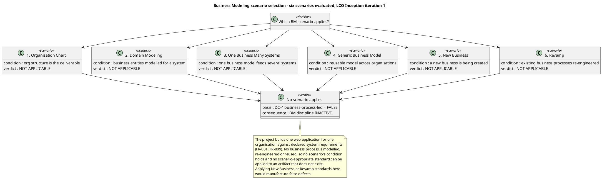
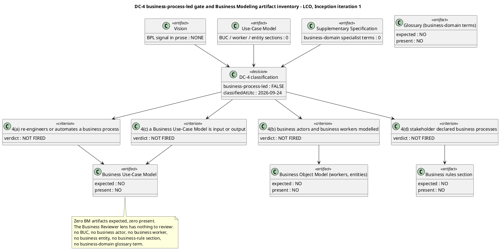
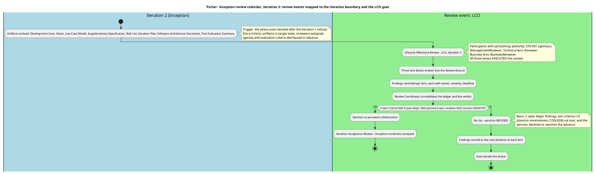
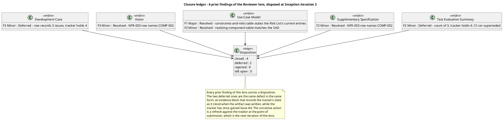
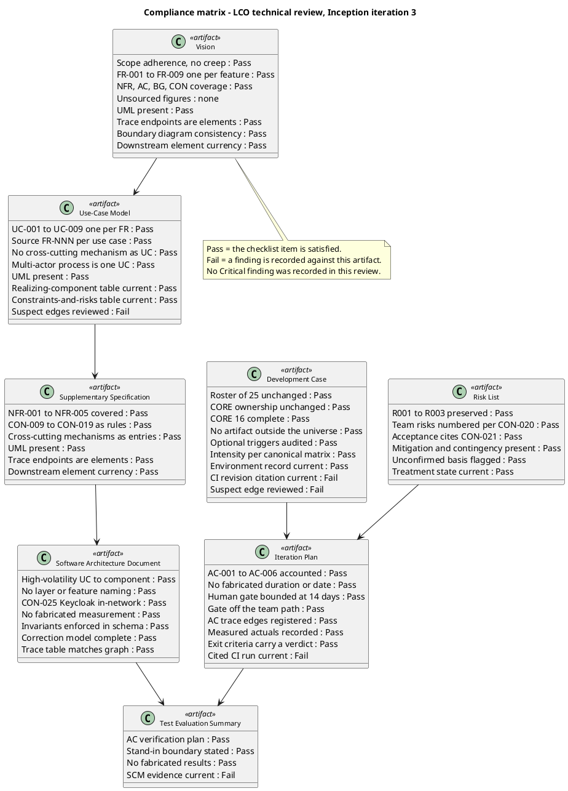
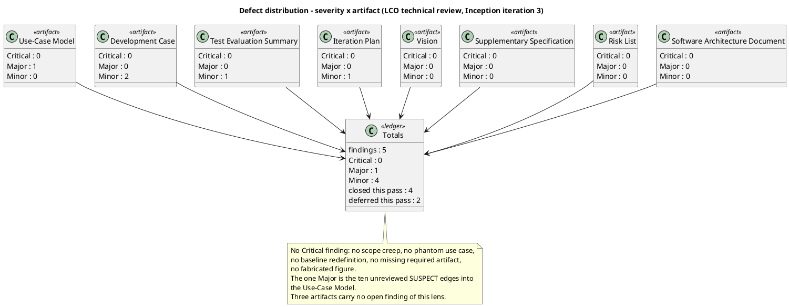

## Document Control
- **Phase:** Inception
- **Status:** In progress — LCO milestone review, iteration 3. The Reviewer lens has recorded its findings and disposition; the Business Reviewer, Management Reviewer and Review Coordinator blocks for this iteration are not yet written, so no milestone verdict is stated here.
- **Milestone Target:** Lifecycle Objectives (LCO) — end of Inception. NOT YET ACHIEVED.
## Review Scope and Criteria
### Reviewer lens

**Review type.** Technical review at the Lifecycle Objectives review point. The evaluative lens is **exit criteria**, not completion: the question is whether the artifact set collectively satisfies the conditions for phase transition, and whether each artifact is internally sound and consistent with the artifacts it derives from.

**Artifacts reviewed this pass.** Eight: Vision, Use-Case Model, Supplementary Specification, Development Case, Risk List, Iteration Plan, Software Architecture Document, Test Evaluation Summary. The Iteration Assessment is not reviewed for currency — the Project Manager authors it in the Assess touchpoint that runs after this review, so at review time it cannot yet describe the iteration being reviewed. Its absence or lag is not a finding and not a gate condition.

**Upstream consumption.** Every artifact was read against the artifacts it derives from before any finding was recorded: the Use-Case Model against the Vision's declared scope, the Supplementary Specification against the Use-Case Model, the Software Architecture Document against the Use-Case Model and the Supplementary Specification, the Test Evaluation Summary against the acceptance criteria and the Use-Case Model, and the Development Case, Risk List and Iteration Plan against the declared scope and each other. The traceability tree was projected from the Business level and used as the completeness instrument.

**Checklists applied, per artifact type.**

| Artifact | Checklist |
|---|---|
| Vision | Scope adherence and no creep; stakeholder coverage; one feature per declared FR; NFR/AC/BG/CON coverage; no unsourced figure; UML present; trace endpoints are elements; diagram consistency with the Use-Case Model |
| Use-Case Model | One UC per declared FR with a `Source: FR-NNN` line; no cross-cutting mechanism as a UC; multi-actor process is one UC; UML present; trace edges registered; SUSPECT edges reviewed; realizing-component table current |
| Supplementary Specification | NFR-001..NFR-005 covered; CON-009..CON-019 as rules; cross-cutting mechanisms as entries; no invented identifier; UML present; trace endpoints are elements; downstream element currency |
| Development Case | DC baseline conformance (roster, CORE ownership, CORE completeness, artifact universe, no role merge); optional trigger justification against each §5.2 condition; intensity per canonical matrix; environment record current; SCM issue record current; cited revisions match the repository |
| Risk List | R001..R003 preserved with declared identifiers and magnitudes; team risks numbered per CON-020; acceptance cites CON-021; mitigation and contingency present; premise current; unconfirmed basis flagged |
| Iteration Plan | AC-001..AC-006 accounted for; no fabricated duration or calendar date; human gate bounded and off the team's path; AC trace edges registered; measured actuals recorded; exit criteria carry a verdict |
| Software Architecture Document | High-volatility UC to dedicated component; no layer or feature naming; CON-025 Keycloak in-network; no fabricated measurement; invariants enforced in schema; correction model complete; trace table matches the graph |
| Test Evaluation Summary | AC verification plan; stand-in boundary stated; no fabricated result; SCM evidence current |

**SCM evidence taken at this review.** `scm_list_pull_requests(open)` returns no open pull request, so no PR required a disposition. `scm_get_build_status(main)` returns success for run `36111645523`. `scm_list_issues(open)` returns four open issues: `Issue #1`, `Issue #2`, `Issue #3`, `Issue #4`, all labelled `severity:minor`, `nature:defect`, `configuration-record`.

**Entry criteria.** All eight artifacts are present and in a reviewable state; the upstream artifacts each depends on are available; the checklists above were prepared before the artifacts were read. No artifact was found to be a placeholder mid-review.

### Business Reviewer lens

**Review type.** Business Modeling quality gate — scenario-appropriateness assessment and derivation-readiness check. Not a Fagan inspection: no reader paraphrase step and no separate recorder role.

**Review point.** Lifecycle milestone — LCO. The evaluative lens is **exit criteria**: does the Business Modeling discipline's contribution satisfy the conditions for phase transition? The Business Modeling discipline is INACTIVE on this project, so the lens applied is the **inactivity justification** lens, not the artifact-quality lens.

**Scenario assessment (Heuristic 1 — assessed FIRST, before any artifact was read).** The six RUP business modeling scenarios were evaluated against the declared scope. **None applies.** The project builds one web application for one organisation against declared system requirements (`FR-001`..`FR-009`); no business process is modelled, re-engineered or reused. No scenario-appropriate standard can therefore be applied to a business-model artifact, because no such artifact is required. Applying New Business or Revamp standards here would manufacture false defects — the anti-pattern the discipline's own heuristics warn against.

**DC §4 classification, independently re-verified.** `get_dc_classification` returned `isBusinessProcessLed: false`, re-evaluated this iteration, with all four criteria evaluated and none fired. I re-verified each criterion against the declared scope rather than accepting the verdict, and checked whether any Change Request had altered the basis — none has.

| DC §4 criterion | Recorded verdict | Independent re-verification |
|---|---|---|
| (a) project re-engineers or automates a business process | NOT FIRED | Confirmed. The portal replaces three manual artefacts (Excel clocking sheets, mass emails, PDF phone list) with a web application. No HR process is re-engineered and no process model is produced. |
| (b) business actors and business workers are modelled | NOT FIRED | Confirmed. The declared scope names system actors (Employee, HR Administrator) and external systems (AD, Keycloak). No business actor and no business worker is declared anywhere. |
| (c) a Business Use-Case Model is an input or an output | NOT FIRED | Confirmed. The declared scope supplies system use cases `UC01`/`UC02`/`UC03` and `FR-001`..`FR-009` directly. No BUC is declared or required. |
| (d) the stakeholder declared business processes rather than system requirements | NOT FIRED | Confirmed. The stakeholder declared system requirements, system invariants (`CON-009`..`CON-019`) and acceptance criteria (`AC-001`..`AC-006`), all system-level. |

**Business Modeling artifact inventory — the evidence for the inactivity verdict.** The gate is not the classification alone; it is the classification *plus* the observed absence of every business-model artifact. Both hold.

**Artifacts read in full before any finding was recorded (upstream consumption).** Vision, Use-Case Model, Supplementary Specification, Review Record (all existing lens blocks), plus the DC §4 classification. The Development Case, Risk List, Iteration Plan, Software Architecture Document and Test Evaluation Summary were not read: none can carry a business-model section, and the Business Modeling discipline's artifact surface is exhausted by the three read.

**Checklists applied.** The Business Modeling checklist (Heuristic 1.2) was applied item by item and every item recorded Pass or N/A. N/A is not a defect: the Development Case does not require a business-model artifact of the BPA this phase, so a finding against a non-required artifact would be a false defect.

**Entry criteria.** The Development Case is present and carries tailoring content, so it governs this review. The DC §4 classification is recorded and re-evaluated this iteration. No business-model artifact was expected and none was found to be a placeholder mid-review.

**Scope of this lens.** This is the Business Reviewer lens — the business-modeling quality gate. The generic Reviewer's technical lens and the Management Reviewer's lens are separate blocks in this same Review Record and are not written here.

### Management Reviewer lens

**Review type.** Lifecycle Milestone Review — the LCO gate, Inception iteration 2. This is a formal gate verdict, not a courtesy read-through: the question is whether the phase's exit criteria are satisfied, and the burden of proof rests on the project team.

**Review point.** Lifecycle milestone — LCO, end of Inception. The evaluative lens is **exit criteria**, not completion. Inception produces a baseline, not a running system, so no completion lens is applied and no acceptance criterion is expected to be verified.

**Artifacts reviewed (8 of 8).** Development Case, Vision, Use-Case Model, Supplementary Specification, Risk List, Iteration Plan, Software Architecture Document, Test Evaluation Summary.

**Upstream consumption.** Every artifact was read in full before any finding was recorded. The trace graph was projected from the Business level (66 roots, 231 nodes) and used as the completeness instrument, never the artifacts' own prose.

**Checklists applied, per artifact type.**

| Artifact | Management checklist applied |
|---|---|
| Iteration Plan | Every declared acceptance criterion accounted for; iteration exit criteria stated and evidenced; no fabricated duration or calendar date; human gate bounded and reported apart from agent time; measured spend recorded per CON-027; roadmap justified against the risk profile |
| Risk List | Declared risks preserved with identifier and magnitude; team risks numbered per CON-020; acceptance citing CON-021; magnitude bands anchored on a confirmed basis; mitigation and contingency present and their execution evidenced; retirement trend |
| Development Case | DC baseline conformance against the IARI baseline; optional-trigger justification against each §5.2 condition; intensity against the canonical matrix; environment readiness evidenced at the gate, not only planned |
| Vision | Scope adherence against the declared scope; stakeholder coverage; unsourced-figure check; business-goal verification path |
| Use-Case Model | One UC per declared FR; no cross-cutting mechanism as a UC; multi-actor process as one UC |
| Supplementary Specification | NFR coverage; business rules as rules; cross-cutting mechanisms as entries with `<<include>>` |
| Software Architecture Document | Every High-volatility use case mapped to a component; CON-025 placement; no fabricated measurement |
| Test Evaluation Summary | Acceptance-verification plan per criterion; stand-in boundary stated; no fabricated result; SCM evidence current |

**Entry criteria.** All eight artifacts present and in Draft; the Development Case present and carrying tailoring content, so it governs this review. No artifact was found to be a placeholder mid-review.

**SCM evidence.**

| Evidence | Observed value |
|---|---|
| Build on `main` | success — run `36095051721` |
| Open issues | `Issue #1`, `Issue #2`, `Issue #3` |
| Open pull requests | none |
| Branches awaiting review | none |

**Scope of this lens.** This is the Management Reviewer lens — the LCO gate verdict, the four-axis health assessment and the risk-retirement check. The generic Reviewer's technical lens and the Business Reviewer's lens are separate blocks in this same Review Record and are not written here.

### Review Coordinator — consolidation

**Review event.** Lifecycle Milestone Review — LCO, end of Inception, iteration 2. This is the project's second review event; the first was the iteration-1 LCO review, whose sanction was refused.

**Lens participation (authoritative).**

| Lens | Role | Participation | Findings recorded this pass | Prior findings closed this pass |
|---|---|---|---|---|
| Technical | Reviewer | EXECUTED | 6 — 0 Critical, 1 Major, 5 Minor | 11 |
| Business | BusinessReviewer | EXECUTED | 1 — 0 Critical, 0 Major, 1 Minor | 0 |
| Management | ManagementReviewer | EXECUTED | 2 — 0 Critical, 1 Major, 1 Minor | 7 |

All three lenses executed. No lens is recorded as INACTIVE — did not evaluate this review.

**Review process framework.** Seven review types, each triggered by the workflow activity that requires it. A PRA Review is never a substitute for a milestone review.

| Review type | Triggering workflow activity | Required participants | Entry criteria | Exit criteria | Primary output |
|---|---|---|---|---|---|
| Project Approval Review | Project Initiation | STK-001, SystemAnalyst, ProjectManager, ManagementReviewer | Vision and Risk List in target state; agenda distributed in advance | Scope feasibility ruled; Review Record signed | Review Record |
| Project Planning Review | Process configuration | ProcessEngineer, ProjectManager, STK-001, ManagementReviewer | Development Case and Iteration Plan in target state | Tailoring and roadmap ruled feasible and acceptable to stakeholders | Review Record |
| Iteration Plan Review | Plan for Next Iteration | ProjectManager, SoftwareArchitect, TestManager, Reviewer | Iteration Plan in target state; exit criteria stated | Plan reviewed before the iteration begins | Review Record |
| PRA Review | Manage Iteration (mid-iteration) | ProjectManager, discipline leads, ManagementReviewer | Progress and risk data current | Project health assessed; corrective actions assigned | Review Record |
| Iteration Evaluation Criteria Review | Manage Iteration (exit criteria) | Reviewer, TestManager, ProjectManager | Each exit criterion evidenced | Every exit criterion verified or recorded as not met | Review Record |
| Iteration Acceptance Review | Manage Iteration (close) | Reviewer, ManagementReviewer, STK-001 | Iteration deliverables complete | Deliverables formally accepted | Review Record |
| Lifecycle Milestone Review | Close-Out Phase | ManagementReviewer, Reviewer, BusinessReviewer, STK-001 | All phase artifacts in target state; exit criteria evidenced | Sanction to proceed granted or refused | Review Record |
| Project Acceptance Review | Close-Out Phase (project) | ManagementReviewer, STK-001, DeploymentManager | All acceptance criteria verified | Final project acceptance | Review Record |

**Review calendar — Inception, mapped to the iteration boundary.**

**Entry criteria — enforced before this review began.** All eight artifacts present and in target state; the Development Case present and carrying tailoring content, so it governs the review; reviewers assigned with expertise matched to artifact domain; agenda and evaluation criteria distributed in advance. No artifact was found to be a placeholder mid-review.

**Exit criteria — enforced before this review closes.** Every finding carries an owner, a severity and a resolution deadline; the Review Record is signed and archived. The milestone verdict is anchored to verified completeness, not to judgment: the sanction was asked of the stakeholder and refused, so the phase gate does not open.

**Reviewer pool and expertise mapping.**

| Artifact domain | Reviewer expertise required | Assigned lens |
|---|---|---|
| Vision, Use-Case Model, Supplementary Specification | Requirements and business-scope competency; stakeholder authority for scope | Reviewer (technical), BusinessReviewer (business gate), ManagementReviewer (scope) |
| Development Case | Process configuration and baseline conformance | Reviewer, ManagementReviewer |
| Risk List | Risk classification and magnitude-band basis | Reviewer, ManagementReviewer |
| Iteration Plan | Planning discipline; acceptance-criterion coverage; measurement policy | Reviewer, ManagementReviewer |
| Software Architecture Document | Architecture and design competency | Reviewer |
| Test Evaluation Summary | Test engineering knowledge; SCM evidence currency | Reviewer, ManagementReviewer |

**Scope of this block.** This is the Review Coordinator's consolidation — the process framework, the calendar, the entry/exit enforcement and the lens participation record. The three lens blocks that follow are the reviewers' own output and are preserved as written.

## Findings
#### Iteration 3 — LCO technical review

**Summary.** 5 findings: 0 Critical, 1 Major, 4 Minor. No Critical finding was recorded, so no finding of this lens escalates to the stakeholder on severity grounds. Of the six prior findings of this lens, four are closed and two are deferred — see Resolutions and Actions.

**Closure ledger.** Every prior finding of this lens, with its disposition.

**Compliance matrix.** Every checklist item evaluated, recorded Pass or Fail. A Fail is a finding.

**Defect distribution.**

**Annotated review map.** Where each finding sits, and which LCO exit criterion the artifact evidences.

```plantuml
@startuml RR3_AnnotatedMap
title Annotated review map - artifacts, findings and the LCO exit criteria they evidence (Inception iteration 3)
skinparam classAttributeIconSize 0

class "Vision" as V <<artifact>>
class "Use-Case Model" as UCM <<artifact>>
class "Supplementary Specification" as SS <<artifact>>
class "Development Case" as DC <<artifact>>
class "Risk List" as RL <<artifact>>
class "Iteration Plan" as IP <<artifact>>
class "Software Architecture Document" as SAD <<artifact>>
class "Test Evaluation Summary" as TES <<artifact>>

class "C1 Scope agreed" as C1 <<criterion>>
class "C2 Project viable" as C2 <<criterion>>
class "C3 Risks identified" as C3 <<criterion>>
class "C4 Process governs" as C4 <<criterion>>
class "C5 Stand-in environment" as C5 <<criterion>>
class "C6 Build verifiable" as C6 <<criterion>>

V --> C1
UCM --> C1
SS --> C1
SAD --> C2
DC --> C4
RL --> C3
IP --> C3
IP --> C5
IP --> C6
TES --> C6

note right of UCM
  1 Major
  - ten SUSPECT edges unreviewed
    at phase close
end note

note right of DC
  2 Minor
  - CI revision citation does not
    match the repository blob
  - one SUSPECT edge unreviewed
end note

note right of IP
  1 Minor
  - criterion 6 cites a superseded
    CI run as its own evidence
end note

note right of TES
  1 Minor (deferred)
  - defect count and CI run stale
end note

note right of V
  no finding
  - NFR-003 row now names COMP-002
end note

note right of SS
  no finding
  - NFR-003 row now names COMP-002
end note

note bottom of C5
  C5 is still not evidenced by any artifact: the
  Development Case's LCO-gate verification records
  the stand-in environment as not ready, and the
  Iteration Plan records criterion 5 as NOT MET.
  C6 is met by the green build on main.
end note
@enduml
```

**Findings.**

| Key | Artifact | Severity | Finding | Recommendation |
|---|---|---|---|---|
| `Use-Case Model#F3` | Use-Case Model | **Major** | Ten `SUSPECT` edges into this artifact's use cases are unreviewed at phase close. The trace graph flags `COMP-001` → `UC-001`, `UC-002`, `UC-004`; `COMP-002` → `UC-001`, `UC-002`; `R004` → `UC-001`, `UC-008`; and `Iteration Plan` → `UC-001`, `UC-002`, `UC-008`. Each is a change another authority declared against a use case whose owner has not re-read it and has not declared the change in turn. The artifact's tables already state the current content — the realizing-component table matches the Software Architecture Document's registered edges, and the constraints-and-risks table states the Risk List's current `R001`, `R004` and `R009` entries — so what is missing is the declaration that clears the edges, not the content. A `SUSPECT` edge left open at phase close is a Major finding against the artifact owning the unreviewed end. | Re-read the Software Architecture Document's component rows, the Risk List's `R004` entry and the Iteration Plan's `UC-008` change against `UC-001`, `UC-002`, `UC-004` and `UC-008`, then declare the change in turn for each affected use case so the ten `SUSPECT` edges clear. The content is already current; the declaration is what is missing. |
| `Development Case#F4` | Development Case | Minor | The artifact cites the CI configuration item by a revision the repository does not carry. Three places record `.github/workflows/ci.yml` at `a9890724` — the Organization and tool assessment table, the iteration-preparation checkpoint result and the LCO-gate environment verification. `Issue #4` in the tracker records that this revision does not match the repository blob. The artifact's CI evidence is therefore cited against a revision that is not the one in the repository, and the same citation is repeated in all three places. | Cite the current blob revision of `.github/workflows/ci.yml`, or cite the file without a revision and let the tracker hold the revision. Correct all three places that carry the citation. |
| `Development Case#F5` | Development Case | Minor | The trace graph flags one `SUSPECT` edge into this artifact — `Iteration Plan` → `Development Case` — and the artifact has not reviewed it. The Iteration Plan declared a change this iteration: the coarse roadmap was re-planned from the measured actuals of both closed Inception iterations, and the stand-in directory was widened to carry the worker-category link. This artifact's end of the link has not been re-read against that change, so the edge stays flagged at phase close. | Re-read the Iteration Plan's re-planning against this artifact's process configuration and declare the change in turn, or clear the edge if the Development Case's content still holds. The edge is a governance link — the Iteration Plan refines the Development Case — so the review is a confirmation that the process configuration still governs the re-planned roadmap. |
| `Iteration Plan#F3` | Iteration Plan | Minor | The plan's Evaluation Criteria layer (b) records exit criterion 6 as MET on the evidence of CI run `36095051721`, which is the run observed at the iteration-2 review. The build observed on `main` at this review is run `36111645523`. The artifact's Document Control states it is the iteration-3 plan, so it cites an iteration-2 observation as its own evidence. The verdict (MET) is unaffected — the build is green either way — but the cited value is superseded, and the same superseded run is cited in the Risk List's `R009` treatment row. | Refresh the run reference in layer (b) criterion 6 to the run observed at the point of submission, or cite the build state without a run identifier and let the tracker hold the run. The Risk List's `R009` row carries the same superseded citation and should be refreshed with it. |
| `Test Evaluation Summary#F2` | Test Evaluation Summary | Minor | **Deferred from iteration 2; the defect stands in the same form.** The evidence block records three open defects (`Issue #1`, `Issue #2`, `Issue #3`) while the tracker holds four — `Issue #4` is not recorded — and the CI run cited (`36110698735`) is superseded by the run observed on `main` at this review (`36111645523`). The artifact's own rule — a defect is an SCM issue and its identifier is the issue number — makes the count a fact to be read from the tracker, not carried forward. | Record `Issue #4` alongside the other three, state the defect count as four, and refresh the CI run reference to the run observed at the point of submission. The three places that carry the count — the Test Summary evidence table, the Defects and Incidents section and the Conclusions table — must agree with the tracker. |

**Traceability compliance (iteration 3).** The traceability tree was projected from the Business level and used as the completeness instrument. Result: 67 roots, 234 nodes. No `UNKNOWN LABEL` — every identifier in the graph belongs to a declared family. No `«LEAF»` at Business level: every declared requirement and acceptance criterion reaches at least one downstream element, so no requirement is unrealized. The iteration-2 table defects are corrected: the Vision and the Supplementary Specification now name `COMP-002` on the `NFR-003` row, and the Use-Case Model's realizing-component table matches the Software Architecture Document's registered edges.

**Ten `SUSPECT` edges remain, all into the Use-Case Model.** `COMP-001` → `UC-001`, `UC-002`, `UC-004`; `COMP-002` → `UC-001`, `UC-002`; `R004` → `UC-001`, `UC-008`; `Iteration Plan` → `UC-001`, `UC-002`, `UC-008`. The count rose from five to ten because the Software Architect and the Project Manager both declared changes this iteration and the Use-Case Model's owner has not declared the change in turn. They are recorded as `Use-Case Model#F3` (Major). One further `SUSPECT` edge — `Iteration Plan` → `Development Case` — is recorded as `Development Case#F5` (Minor).

**Scope-adherence result (iteration 3).** No scope creep. Nine use cases, one per declared `FR-001`..`FR-009`; every use case carries a `Source: FR-NNN` line citing a declared requirement; no phantom use case; no cross-cutting mechanism modelled as a use case — OIDC login, authorization, LDAP read, audit write and the clocking retry are all Supplementary Specification entries with `<<include>>` from their dependent use cases. No `[DERIVED]` marker survives in any artifact, so no silent derivation promotion exists to flag. No unsourced quantitative claim was found: the artifacts state declared targets and explicitly record that no measurement exists yet. No financial figure appears anywhere in the artifact set.

**DC baseline conformance result (iteration 3).** The Development Case does not redefine the 25-role roster, does not reassign CORE ownership, does not omit a CORE artifact, does not list an artifact outside the CORE + OPTIONAL universe, and does not merge two roles. Business Modeling is declared INACTIVE with the correct trigger condition (`business-process-led = false`). All six OPTIONAL triggers were re-audited against their §5.2 conditions and none was found over-triggered. The Environment intensity row states the canonical level per phase. The two findings against this artifact are a stale CI revision citation and an unreviewed `SUSPECT` edge, not a baseline violation.

**Optional trigger justification (iteration 3).** Every NOT-FIRED verdict was checked against its §5.2 condition. Glossary: the domain vocabulary is ordinary HR and intranet language and the one closed list is fixed by `CON-014` — condition does not hold. Architectural Proof-of-Concept: no technical risk requires empirical validation, and `CON-028` removes the only candidate — condition does not hold. Data Model: the portal owns five entities, well under ten, and `CON-030` states there is no data migration — condition does not hold. Deployment Model: one application and one database on one estate, reachable only from the internal network — condition does not hold. User-Interface Prototype: `CON-031` makes the design already decided and authoritative — condition does not hold. Test Plan: `CON-019` states no external compliance regime applies and there is no contractual test reporting — condition does not hold. No over-triggering found.

**SCM evidence taken at this review.** `scm_list_pull_requests(open)` returns no open pull request, so no PR required a disposition. `scm_get_build_status(main)` returns success for run `36111645523`. `scm_list_issues(open)` returns four open issues: `Issue #1`, `Issue #2`, `Issue #3`, `Issue #4`, all labelled `severity:minor`, `nature:defect`, `configuration-record`.
## Resolutions and Actions
#### Iteration 3 — closure of prior findings

**Disposition of every prior finding of this lens.** Each was re-read against the corrected artifact content. Four are closed on the evidence cited; two are deferred because the defect still stands in the same form. Nothing is rejected and nothing is left without a disposition.

| Finding | Severity | Disposition | Evidence read from the corrected artifact |
|---|---|---|---|
| `Use-Case Model#F1` | **Major** | **Resolved** | The constraints-and-risks table now states the Risk List's current entries rather than the iteration-1 position: `R004` is recorded as Materialized with the stand-in environment not delivered, `R001`'s probability and impact are recorded as `[ASSUMPTION — requires validation]` with exposure 12 provisional, and `R009`'s remaining scope is recorded as the absent guideline files with the CI half retired against the observed green build. The artifact followed the Risk List's change. The residual trace-graph condition — the change was not declared in turn, so the edges stay flagged — is a separate, newly observed defect and is recorded as `Use-Case Model#F3` |
| `Use-Case Model#F2` | Minor | **Resolved** | The realizing-component table is reconciled with the Software Architecture Document's registered edges: `COMP-001` reaches `UC-001`, `UC-002`, `UC-004`, `UC-008`; `COMP-002` reaches `UC-001`, `UC-002`, `UC-008`; and `COMP-009` and `COMP-010` are present with their registered use cases |
| `Vision#F3` | Minor | **Resolved** | The `NFR-003` row's Traces To now names `COMP-002`, and the "not yet minted" note for that row is gone. The Vision and the Software Architecture Document state the same downstream element for the same requirement |
| `Supplementary Specification#F2` | Minor | **Resolved** | The `NFR-003` row's Traces To now names `COMP-002`, and the "not yet minted" note for that row is gone. This artifact and the Software Architecture Document state the same downstream element |
| `Development Case#F3` | Minor | **Deferred** | The defect stands in the same form. The "Open SCM issues" row now records three open issues with their labels and names the tracker as the authoritative record — which is what the recommendation asked for — but the tracker has since gained a fourth: `Issue #4` (the Development Case cites a CI configuration-item revision that does not match the repository blob). The row is the artifact's own record of the open issue set and it under-reports it by one. Deferred to the next iteration of this lens: refresh the row against the tracker at the point of submission and state the count as four |
| `Test Evaluation Summary#F2` | Minor | **Deferred** | The defect stands in the same form. The three places that carry the count now agree with each other and record `Issue #3` — but the tracker has since gained `Issue #4`, so the count of three is again an undercount, and the CI run cited (`36110698735`) is superseded by the run observed on `main` at this review (`36111645523`). Deferred to the next iteration of this lens: refresh the count to four and the CI run reference to the run observed at submission |

**Closure discipline.** Each closure was materialised by a `resolve_artifact_finding` call before this narrative was written. The tool call transitions the state; this table documents the rationale. The two deferred findings carry a `Deferred` resolution, not an open one: the defect is acknowledged, the corrective action is named, and the deadline is the next iteration of this lens. The residual defects observed against the Development Case and the Test Evaluation Summary are the same defects, not new ones — they are deferred under their existing keys, not re-recorded.

**Cross-lens findings left untouched.** The findings carrying `reviewerRole: ManagementReviewer` and `reviewerRole: BusinessReviewer` are those lenses' to close. The ownership invariant rejects a cross-lens close attempt, so none was attempted.

#### Iteration 3 — actions arising

Each action is the finding's Recommendation; its status is that finding's Resolution. No action identifier is minted.

| Finding | Owner | Action | Blocking? |
|---|---|---|---|
| `Use-Case Model#F3` | SystemAnalyst | Re-read the Software Architecture Document's component rows, the Risk List's `R004` entry and the Iteration Plan's `UC-008` change against `UC-001`, `UC-002`, `UC-004` and `UC-008`, then declare the change in turn so the ten `SUSPECT` edges clear | **Yes** — a `SUSPECT` edge left open at phase close is a Major finding against the artifact owning the unreviewed end |
| `Development Case#F4` | ProcessEngineer | Cite the current blob revision of `.github/workflows/ci.yml`, or cite the file without a revision and let the tracker hold it. Correct all three places that carry the citation | No — per the stakeholder's directive that all findings are corrected, including the minor ones |
| `Development Case#F5` | ProcessEngineer | Re-read the Iteration Plan's re-planning against this artifact's process configuration and declare the change in turn, or clear the edge if the content still holds | No — per the stakeholder's directive |
| `Iteration Plan#F3` | ProjectManager | Refresh the run reference in layer (b) criterion 6 to the run observed at the point of submission, or cite the build state without a run identifier. Refresh the Risk List's `R009` row, which carries the same superseded citation | No — per the stakeholder's directive |
| `Test Evaluation Summary#F2` | TestManager | Record `Issue #4` alongside the other three, state the defect count as four, and refresh the CI run reference to the run observed at submission. The three places that carry the count must agree with the tracker | No — per the stakeholder's directive |
| `Development Case#F3` | ProcessEngineer | Refresh the "Open SCM issues" row against the tracker at the point of submission and state the count as four | No — per the stakeholder's directive |

**Carry-over.** The five open findings of this lens carry to the next iteration of this lens, which will reconcile them in its closure state before recording new defects. The two deferred findings carry with their corrective action named. Nothing is rejected. The stakeholder's directive — all findings must be corrected, even if they are minor — governs the whole set.

**Cross-lens findings left untouched.** The findings carrying `reviewerRole: ManagementReviewer` and `reviewerRole: BusinessReviewer` are those lenses' to close. The ownership invariant rejects a cross-lens close attempt, so none was attempted.
## Disposition
#### Iteration 3 — disposition

**Overall disposition: Approved with Changes.**

The artifacts are fit to carry the project into Elaboration, subject to the four findings above. No Critical finding was recorded, so nothing blocks the phase transition and no finding of this lens escalates to the stakeholder. The one Major finding is an unreviewed change on the Use-Case Model, not a defect in the baseline it reports.

**LCO exit criteria, assessed against the artifacts and the SCM.**

| # | Exit criterion | Verdict | Basis |
|---|---|---|---|
| 1 | Stakeholders agree on the scope | Met | Vision and Use-Case Model carry the declared scope with no creep: nine use cases, one per declared `FR-001`..`FR-009`, each citing its source requirement. Trace graph: 67 roots, 234 nodes, no `UNKNOWN LABEL`, no `«LEAF»` at Business level |
| 2 | The project is viable | Met | The stack is pinned by CON-022/CON-023/CON-024; the OIDC client is already registered (CON-003) so login is testable from day one; the Architectural Proof-of-Concept NOT-FIRED verdict holds — no technical risk requires empirical validation |
| 3 | Initial risks identified and classified | Met | Risk List carries `R001`..`R009` with probability, impact, magnitude, strategy, owner, mitigation and contingency. `R001`'s probability and impact are recorded as the analyst's unconfirmed estimates and no magnitude band is anchored on them; the bands rest on `R002`'s and `R003`'s declared exposures and the High band's lower boundary on `R004`'s observed exposure |
| 4 | The process configuration governs the project | Met | Development Case conforms to the IARI baseline: roster unchanged, CORE ownership unchanged, no artifact outside the universe, Business Modeling INACTIVE on the correct trigger, all six OPTIONAL triggers re-audited and none over-triggered |
| 5 | The stand-in environment is available (CON-028) | **Not met** | The Development Case's LCO-gate verification records the stand-in OIDC issuer and stand-in directory as "Not ready — no stand-in configuration in the repository", and the Iteration Plan's layer (b) records criterion 5 as NOT MET. No artifact evidences them. This is the criterion that gates every use case |
| 6 | The build is verifiable (CON-026) | Met | Run `36111645523` on `main` is green |

**Reading of the verdict.** Criteria 1, 2, 3, 4 and 6 are met. Criterion 5 is not met: the stand-in environment is the project's principal process control and it does not yet exist. That is a gap in the iteration's own exit criteria, not a defect in any artifact — the Development Case and the Iteration Plan both name it correctly, assign it an owner and record it as NOT MET rather than as an open item. It is recorded here so the milestone verdict is taken on the evidence rather than on the artifacts' self-assessment.

**SCM evidence at this review.** No open pull request, so no PR required a disposition. The build on `main` is green (run `36111645523`). The tracker holds four open issues, all configuration-record defects owned by the ProcessEngineer; none is a product defect, because no use case is implemented and no test has executed.

**What this lens does not decide.** The LCO verdict belongs to the ReviewCoordinator and the ManagementReviewer. This block states the technical lens's disposition and the exit-criteria evidence; it does not close the milestone.
## Traceability
| Element | Traces From | Link Type | Traces To |
|---|---|---|---|
| Review Record | Development Case, Vision, Use-Case Model, Supplementary Specification, Risk List, Iteration Plan, Software Architecture Document, Test Evaluation Summary | Refines | LCO |
| Reviewer lens — compliance matrix | Development Case, Vision, Use-Case Model, Supplementary Specification, Risk List, Iteration Plan, Software Architecture Document, Test Evaluation Summary | Refines | LCO |
| Reviewer lens — findings | Development Case#F1, Development Case#F2, Vision#F1, Vision#F2, Supplementary Specification#F1, Risk List#F1, Iteration Plan#F1, Iteration Plan#F2, Software Architecture Document#F1, Software Architecture Document#F2, Test Evaluation Summary#F1 | Refines | LCO |
| Reviewer lens — SCM evidence | Issue #1, run 36050339100 | Refines | LCO |
| Reviewer lens — disposition | AC-001, AC-002, AC-003, AC-004, AC-005, AC-006, CON-028, CON-026 | Refines | LCO |

### Reviewer lens

**Iteration 3 — LCO technical review.**

| Element | Traces From | Link Type | Traces To |
|---|---|---|---|
| Reviewer lens — closure ledger | Development Case#F3, Vision#F3, Use-Case Model#F1, Use-Case Model#F2, Supplementary Specification#F2, Test Evaluation Summary#F2 | Refines | LCO |
| Reviewer lens — compliance matrix | Development Case, Vision, Use-Case Model, Supplementary Specification, Risk List, Iteration Plan, Software Architecture Document, Test Evaluation Summary | Refines | LCO |
| Reviewer lens — findings | Use-Case Model#F3, Development Case#F4, Development Case#F5, Test Evaluation Summary#F2 | Refines | LCO |
| Reviewer lens — traceability compliance | COMP-001, COMP-002, R004, UC-001, UC-002, UC-004, UC-008 | Refines | LCO |
| Reviewer lens — SCM evidence | Issue #1, Issue #2, Issue #3, Issue #4, run 36111645523 | Refines | LCO |
| Reviewer lens — disposition | AC-001, AC-002, AC-003, AC-004, AC-005, AC-006, CON-026, CON-028 | Refines | LCO |

**Trace endpoints.** `FR-001`..`FR-009`, `NFR-001`..`NFR-005`, `AC-001`..`AC-006`, `CON-001`..`CON-032`, `BG-001`..`BG-003`, `STK-001`..`STK-004` and `R001`..`R009` are declared identifiers, copied exactly from the work order. `UC-001`..`UC-009` are the System Analyst's use-case identifiers; `COMP-001`..`COMP-010` are the Software Architect's component identifiers. `Issue #1`, `Issue #2`, `Issue #3`, `Issue #4` and `run 36111645523` are observed SCM facts, cited as returned by the `scm_*` tools. `LCO` is the milestone this review serves. The findings of this lens are cited by their `<artifact>#<key>` handles; a finding is not an element and no edge is registered on one.

**No element of this lens is minted.** The Reviewer produces no `UC-NNN`, `CLS-NNN`, `COMP-NNN`, `TC-NNN` or `INT-NNN`; those families belong to other authorities. The compliance matrix, the defect distribution, the annotated review map, the closure ledger and the disposition are sections of this Review Record, not trace-graph elements, so no edge is registered on them — naming a document section in a Traces To column registers nothing, which is the defect recorded as `Vision#F1` and `Supplementary Specification#F1` in iteration 1.

**Lens blocks preserved.** The Business Reviewer and Management Reviewer blocks in this section are those lenses' own output and are preserved as written. This block adds the Reviewer lens's rows and does not rewrite theirs.

### Business Reviewer lens

**Iteration 1 — LCO business review.**

| Element | Traces From | Link Type | Traces To |
|---|---|---|---|
| Business Reviewer lens — scenario assessment | DC §4 classification (`business-process-led = false`) | Refines | LCO |
| Business Reviewer lens — DC §4 re-verification | DC §4 classification, Vision, Use-Case Model, Supplementary Specification | Refines | LCO |
| Business Reviewer lens — BM artifact inventory | Use-Case Model, Supplementary Specification | Refines | LCO |
| Business Reviewer lens — compliance matrix | Vision, Use-Case Model, Supplementary Specification | Refines | LCO |
| Business Reviewer lens — stakeholder coverage check | STK-001, STK-002, STK-003, STK-004 | Refines | LCO |
| Business Reviewer lens — business-rule audit | CON-009, CON-010, CON-011, CON-012, CON-013, CON-014, CON-015, CON-016, CON-017, CON-018, CON-019 | Refines | LCO |
| Business Reviewer lens — business-goal measurability check | BG-001, BG-002, BG-003 | Refines | LCO |
| Business Reviewer lens — derivation-readiness assessment | FR-001, FR-002, FR-003, FR-004, FR-005, FR-006, FR-007, FR-008, FR-009 | Refines | LCO |
| Business Reviewer lens — disposition | CON-028 | Refines | LCO |

**Iteration 2 — LCO business review.**

| Element | Traces From | Link Type | Traces To |
|---|---|---|---|
| Business Reviewer lens — scenario assessment | DC §4 classification (`business-process-led = false`) | Refines | LCO |
| Business Reviewer lens — DC §4 re-verification | DC §4 classification, Vision, Use-Case Model, Supplementary Specification | Refines | LCO |
| Business Reviewer lens — BM artifact coverage map | Use-Case Model, Supplementary Specification | Refines | LCO |
| Business Reviewer lens — business-rule audit | CON-009, CON-010, CON-011, CON-012, CON-013, CON-014, CON-015, CON-016, CON-017, CON-018, CON-019 | Refines | LCO |
| Business Reviewer lens — stakeholder coverage check | STK-001, STK-002, STK-003, STK-004 | Refines | LCO |
| Business Reviewer lens — business-goal measurability check | BG-001, BG-002, BG-003 | Refines | LCO |
| Business Reviewer lens — derivation-readiness assessment | FR-001, FR-002, FR-003, FR-004, FR-005, FR-006, FR-007, FR-008, FR-009 | Refines | LCO |
| Business Reviewer lens — traceability compliance | UC-001, UC-008, R001, R004, R009 | Refines | LCO |
| Business Reviewer lens — disposition | CON-028 | Refines | LCO |

**Trace endpoints.** `STK-001`..`STK-004`, `FR-001`..`FR-009`, `CON-009`..`CON-019`, `CON-028`, `BG-001`..`BG-003`, `AC-001`..`AC-006` and `R001`..`R009` are declared identifiers, copied exactly from the work order. `UC-001` and `UC-008` are the System Analyst's use-case identifiers. `LCO` is the milestone this review serves. No `BUC-NNN`, `BR-NNN` or `OBJ-NNN` appears: those are the Business Process Analyst's element families, and no element of any of them exists on this project — which is the substance of the `BR-OK-INACTIVE` verdict, not an omission.

**Findings of this lens.** One: `Use-Case Model#F1` (Minor) — `CON-013`'s declared directory filter by worker category has no realizing flow in `UC-008`. The finding is cited by its `<artifact>#<key>` handle; a finding is not an element and no edge is registered on one. The other findings named in the Findings block — `Use-Case Model#F1` and `Use-Case Model#F2` of the Reviewer lens, `Vision#F3`, `Supplementary Specification#F2`, `Vision#F1` of the Management Reviewer lens — are those lenses', cited there for the record of what this lens deliberately did not touch.

**No element of this lens is minted.** The Business Reviewer produces no `UC-NNN`, `CLS-NNN`, `COMP-NNN`, `TC-NNN` or `INT-NNN`; those families belong to other authorities. The coverage map, the DC §4 gate diagram, the business-rule audit, the defect distribution, the derivation-gate diagram, the stakeholder coverage diagram and the disposition are sections of this Review Record, not trace-graph elements, so no edge is registered on them — naming a document section in a Traces To column registers nothing, which is the defect recorded as `Vision#F1` and `Supplementary Specification#F1` in iteration 1.

**Observed SCM facts.** None cited by this lens. The Business Modeling discipline produces no code, no build and no pull request, so no `scm_*` observation bears on this verdict. The SCM evidence in the Reviewer lens's block is that lens's instrument.

**Lens blocks preserved.** The Reviewer and Management Reviewer blocks in this section are those lenses' own output and are preserved as written. This block adds the Business Reviewer lens's rows and does not rewrite theirs.

### Management Reviewer lens

#### Iteration 1 — LCO management review

| Element | Traces From | Link Type | Traces To |
|---|---|---|---|
| `Iteration Plan#F1` | CON-028 | Refines | R004 |
| `Iteration Plan#F2` | CON-027 | Refines | R007 |
| `Development Case#F1` | CON-028 | Refines | R004 |
| `Development Case#F2` | CON-028 | Refines | R004 |
| `Risk List#F1` | R001 | Refines | R001 |
| `Risk List#F2` | R004 | Refines | R004 |
| `Vision#F1` | BG-003 | Refines | AC-005 |
| `Issue #1` | CON-026 | DependsOn | R009 |
| `run 36050339100` | CON-026 | DependsOn | R009 |

**Trace endpoints.** `FR-001`..`FR-009`, `AC-001`..`AC-006`, `CON-026`, `CON-027`, `CON-028`, `BG-003`, `R001`..`R009` and `STK-001` are declared identifiers, copied exactly from the work order. `Issue #1` and `run 36050339100` are observed SCM facts, cited as returned by the `scm_*` tools. The findings of this lens are cited by their `<artifact>#<key>` handles; a finding is not an element and no edge is registered on one.

**No element of this lens is minted.** The Management Reviewer produces no `UC-NNN`, `CLS-NNN`, `COMP-NNN`, `TC-NNN` or `INT-NNN`; those families belong to other authorities. The verdict, the four-axis health scorecard and the risk-retirement ledger are sections of this Review Record, not trace-graph elements, so no edge is registered on them — naming a document section in a Traces To column registers nothing, which is the defect recorded as `Vision#F1`.

**Stakeholder decision recorded.** `STK-001` declined to sanction the advance past LCO and declined to confirm `R001`'s probability and impact. The refusal is the disposition of this lens; the `R001` answer is recorded as `Risk List#F1`. No marker remains open: the question was asked in this review and answered, and the answer is written here in the stakeholder's own words.

#### Iteration 2 — LCO management review

| Element | Traces From | Link Type | Traces To |
|---|---|---|---|
| `Risk List#F3` | R004 | Refines | CON-028 |
| `Risk List#F4` | R009 | Refines | CON-026 |
| `Development Case#F3` | CON-026 | Refines | Issue #1, Issue #2, Issue #3 |
| `Test Evaluation Summary#F2` | CON-026 | Refines | Issue #1, Issue #2, Issue #3 |
| `Issue #1`, `Issue #2`, `Issue #3` | CON-026 | DependsOn | R009 |
| `run 36095051721` | CON-026 | DependsOn | R009 |

**Trace endpoints.** `FR-001`..`FR-009`, `NFR-001`..`NFR-005`, `AC-001`..`AC-006`, `CON-001`..`CON-032`, `BG-001`..`BG-003`, `STK-001`..`STK-004` and `R001`..`R009` are declared identifiers, copied exactly from the work order. `UC-001`..`UC-009` are the System Analyst's use-case identifiers; `COMP-001`..`COMP-010` are the Software Architect's component identifiers. `Issue #1`, `Issue #2`, `Issue #3` and `run 36095051721` are observed SCM facts, cited as returned by the `scm_*` tools. The findings of this lens are cited by their `<artifact>#<key>` handles; a finding is not an element and no edge is registered on one.

**No element of this lens is minted.** The Management Reviewer produces no `UC-NNN`, `CLS-NNN`, `COMP-NNN`, `TC-NNN` or `INT-NNN`; those families belong to other authorities. The verdict, the four-axis health scorecard, the risk-retirement ledger and the closure ledger are sections of this Review Record, not trace-graph elements, so no edge is registered on them — naming a document section in a Traces To column registers nothing, which is the defect recorded as `Vision#F1` and `Supplementary Specification#F1` in iteration 1.

**Traceability compliance result (iteration 2).** The trace graph was projected from the Business level and used as the completeness instrument. Result: 66 roots, 231 nodes, **no `UNKNOWN LABEL`** — every identifier in the graph belongs to a declared family. No `«LEAF»` at Business level: every declared requirement and acceptance criterion reaches at least one downstream element, so no requirement is unrealized. Five `SUSPECT` edges remain, all risk-to-use-case edges into the Use-Case Model (`R001` → `UC-001`, `R001` → `UC-008`, `R004` → `UC-001`, `R004` → `UC-008`, `R009` → `UC-001`); they are recorded as `Use-Case Model#F1` (Major) by the Reviewer lens, whose checklist owns trace-graph currency. This lens records no separate finding on them: the defect is one, and it is that lens's to close.

**Stakeholder decision recorded.** `STK-001` declined to sanction the advance past the Lifecycle Objectives milestone, answering "No" to the sanction question asked at this review with the leaning (No-Go), the unmet exit criterion C5 and both open Major defects inside the question. The refusal is the disposition of this lens. The stakeholder's directive, recorded verbatim, is "Please fix all findings" — it governs the whole finding ledger, including the minor ones. The stakeholder also declined to confirm `R001`'s probability and impact; that answer is recorded as `Risk List#F1` and is now reflected in the register. No marker remains open: every question asked in this review has been answered, and each answer is written in the stakeholder's own words.

### Review Coordinator — consolidation

**Iteration 2 — LCO milestone review.**

| Element | Traces From | Link Type | Traces To |
|---|---|---|---|
| Review Record | Development Case, Vision, Use-Case Model, Supplementary Specification, Risk List, Iteration Plan, Software Architecture Document, Test Evaluation Summary | Refines | LCO |
| Review process framework | Development Case | Refines | LCO |
| Review calendar — Inception iteration 2 | Iteration Plan | Refines | LCO |
| Lens participation record | Reviewer, BusinessReviewer, ManagementReviewer | Refines | LCO |
| Consolidated finding tracker — open | Use-Case Model#F1, Use-Case Model#F2, Vision#F3, Supplementary Specification#F2, Development Case#F3, Test Evaluation Summary#F2, Risk List#F3, Risk List#F4 | Refines | LCO |
| Consolidated finding tracker — closed | Development Case#F1, Development Case#F2, Vision#F1, Vision#F2, Supplementary Specification#F1, Risk List#F1, Risk List#F2, Iteration Plan#F1, Iteration Plan#F2, Software Architecture Document#F1, Software Architecture Document#F2, Test Evaluation Summary#F1 | Refines | LCO |
| Consolidated action plan | CON-027, CON-028 | DependsOn | R004, R007 |
| Review effectiveness report | CON-026, CON-027 | DependsOn | LCO |
| Milestone disposition — No-Go | CON-028, AC-001, AC-002, AC-003, AC-004, AC-005, AC-006 | Refines | LCO |
| Stakeholder input on the next iteration | STK-001, CON-027 | Refines | LCO |
| Observed SCM evidence | Issue #1, Issue #2, Issue #3, run 36095051721 | DependsOn | R009 |

**Trace endpoints.** `FR-001`..`FR-009`, `NFR-001`..`NFR-005`, `AC-001`..`AC-006`, `CON-001`..`CON-032`, `BG-001`..`BG-003`, `STK-001`..`STK-004` and `R001`..`R009` are declared identifiers, copied exactly from the work order. `UC-001`..`UC-009` are the System Analyst's use-case identifiers; `COMP-001`..`COMP-010` are the Software Architect's component identifiers. `Issue #1`, `Issue #2`, `Issue #3` and `run 36095051721` are observed SCM facts, cited as returned by the `scm_*` tools. `LCO` is the milestone this review serves. The findings of the three lenses are cited by their `<artifact>#<key>` handles; a finding is not an element and no edge is registered on one.

**No element of this role is minted.** The Review Coordinator produces no `UC-NNN`, `CLS-NNN`, `COMP-NNN`, `TC-NNN` or `INT-NNN`; those families belong to other authorities. The review framework, the calendar, the finding tracker, the effectiveness report, the disposition and the stakeholder input are sections of this Review Record, not trace-graph elements, so no edge is registered on them — naming a document section in a Traces To column registers nothing, which is the defect recorded as `Vision#F1` and `Supplementary Specification#F1` in iteration 1.

**Stakeholder decisions recorded.** `STK-001` declined to sanction the advance past the Lifecycle Objectives milestone at this review, answering "No" to the sanction question asked with the leaning, the unmet exit criterion C5 and both open Major defects inside the question. The refusal is the disposition of this review. The stakeholder's directive, recorded verbatim, is "Please fix all findings" — it governs the whole finding ledger, including the minor ones. No marker remains open: every question asked in this review has been answered, and each answer is written in the stakeholder's own words.

**Lens blocks preserved.** The three lens blocks — Reviewer, Business Reviewer, Management Reviewer — are the reviewers' own output and are preserved as written. This consolidation adds the Review Coordinator's blocks and does not rewrite theirs.

