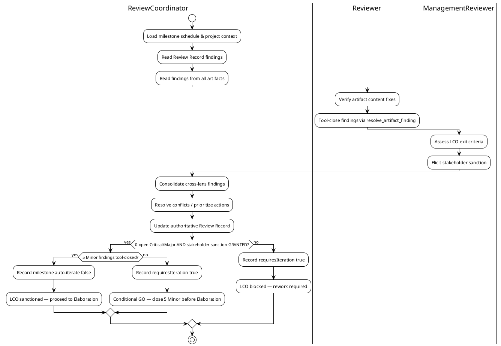
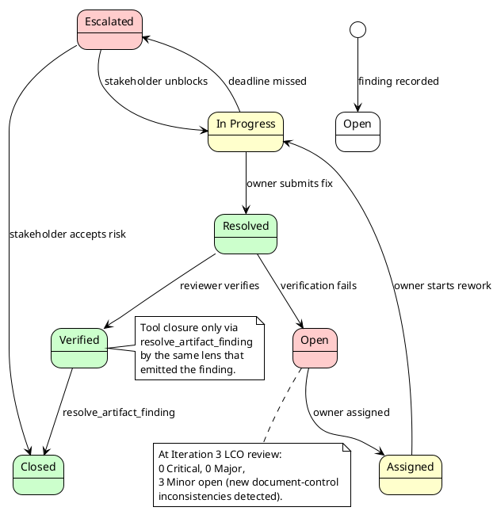
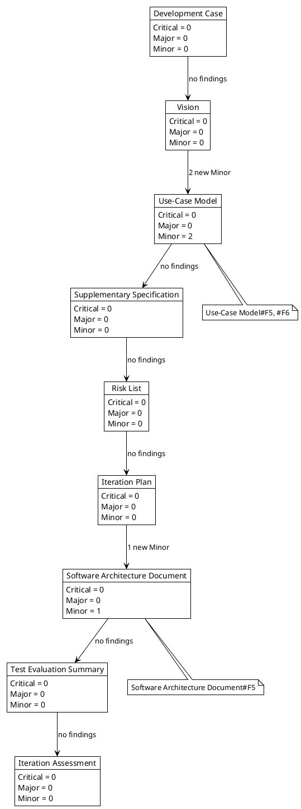
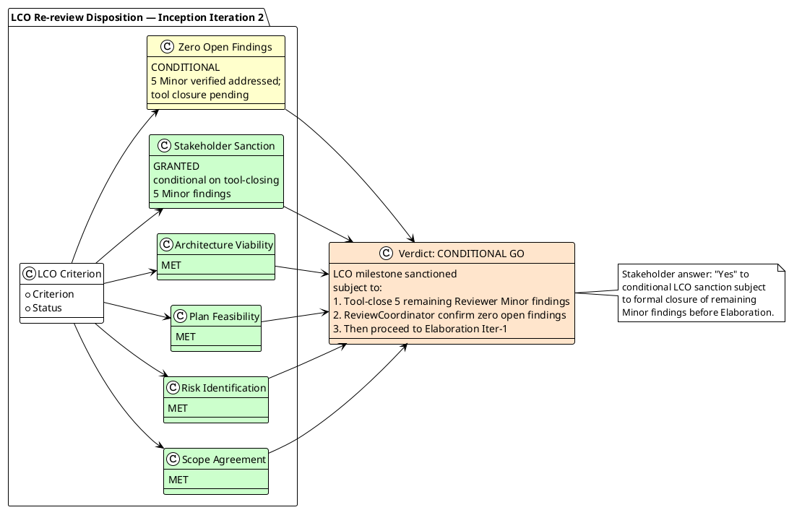

## Document Control
| Field | Value |
|---|---|
| Project | Portal |
| Phase | Inception |
| Iteration | 3 |
| Cycle | 1 |
| Status | Draft |
| Milestone Target | LCO final closure / Elaboration entry readiness |
| Review Type | Technical review (formal inspection) |
| Reviewer Lens | Reviewer (base) |
| Date | 2026-09-11 |

This Review Record is the cumulative ledger of findings from the Reviewer lens across Inception iterations. Iteration 3 focused on formal tool-closure of the 5 remaining Minor findings from Iteration 2 and a fresh evaluation of all technical artifacts for new defects.
## Review Scope and Criteria

This Review Record consolidates the formal LCO re-review of the Portal project's Inception-phase artifacts. The review evaluates whether the project meets the Lifecycle Objectives exit criteria and may be sanctioned to proceed to Elaboration.

### Artifacts Reviewed

| Artifact | Primary Owner | Reviewed By | Review Outcome |
|---|---|---|---|
| Vision | System Analyst | Reviewer | Approved after rework |
| Iteration Plan | Project Manager | Reviewer, ManagementReviewer | Approved after rework |
| Risk List | Project Manager | Reviewer, ManagementReviewer | Approved after rework |
| Development Case | Process Engineer | Reviewer | Approved with 2 Minor findings pending tool closure |
| Use-Case Model | System Analyst | Reviewer | Approved after rework |
| Supplementary Specification | RequirementsSpecifier | Reviewer | Approved with 2 Minor findings pending tool closure |
| Software Architecture Document | Software Architect | Reviewer | Approved after rework |
| Test Evaluation Summary | Test Manager | Reviewer | Approved with 1 Minor finding pending tool closure |
| Iteration Assessment | Project Manager | ManagementReviewer | Reviewed as context; no findings |

### Evaluation Criteria

| ID | Criterion | Status | Evidence |
|---|---|---|---|
| C-001 | Scope agreement — stakeholders agree on what is in/out of scope | MET | Vision §Stakeholder Summary attributes HR capabilities to AD "HR" group role per stakeholder clarification |
| C-002 | Stakeholder acceptance — stakeholder sanctions advancing past LCO | MET | Stakeholder answered "Yes" to conditional LCO sanction on 2026-09-11 |
| C-003 | Risk identification — key risks identified with magnitude ratings | MET | Risk List §Risk Register contains 8 risks with P/I ratings, derivation markers, and response strategies |
| C-004 | Plan feasibility — initial plan achievable under two-currency discipline | MET | Iteration Plan uses unanchored Gantt, token budget box, and reports queue time separately |
| C-005 | Architecture viability — candidate architecture supports declared scope | MET | SAD sketches proportionate single-server .NET 10 / Razor Pages / PostgreSQL architecture |
| C-006 | Zero open findings — all findings closed per stakeholder directive | CONDITIONAL MET | 5 Reviewer Minor findings verified addressed in artifact content; formal tool closure pending |

### Review Coordination Workflow

## Findings
### Finding Lifecycle State Machine

### Consolidated Finding Register at Iteration 3 LCO Review

| ID | Artifact | Lens | Severity | Status | Finding Summary |
|---|---|---|---|---|---|
| Vision#F1 | Vision | Reviewer | Minor | Closed | Missing external-system stereotypes on Keycloak/AD actors |
| Vision#F2 | Vision | Reviewer | Critical | Closed | STK-001 silent promotion of derived HR capabilities |
| Vision#F3 | Vision | Reviewer | Minor | Closed | Traceability table did not cite specific FR/NFR identifiers |
| Use-Case Model#F1 | Use-Case Model | Reviewer | Minor | Closed | Missing <<include>> relationships for cross-cutting mechanisms |
| Use-Case Model#F2 | Use-Case Model | Reviewer | Major | Closed | UC-009 featured invariant wording ambiguous |
| Use-Case Model#F3 | Use-Case Model | Reviewer | Minor | Closed | UC-006 HoursWorked calculation not specified |
| Use-Case Model#F4 | Use-Case Model | Reviewer | Minor | Closed | UC-003 idempotency key strategy not specified |
| Use-Case Model#F5 | Use-Case Model | Reviewer | Minor | Open | Document Control iteration metadata stale (Iteration 2, should be 3) |
| Use-Case Model#F6 | Use-Case Model | Reviewer | Minor | Open | UC-009 survey status says "Outlined" but specification is detailed |
| Supplementary Specification#F1 | Supplementary Specification | Reviewer | Minor | Closed | REQ-P003 10-second target needs Elaboration decomposition note |
| Supplementary Specification#F2 | Supplementary Specification | Reviewer | Major | Closed | Authentication/Authorization inclusion inconsistency |
| Supplementary Specification#F3 | Supplementary Specification | Reviewer | Minor | Closed | REQ-SU003 should cite Infrastructure backup confirmation |
| Risk List#F1 | Risk List | Reviewer | Minor | Closed | R003 mitigation should cite CON-005 |
| Risk List#F2 | Risk List | Reviewer | Major | Closed | Derived risks lack declared-vs-derived marker |
| Risk List#F3 | Risk List | Reviewer | Minor | Closed | R006 traced to non-existent Deployment Plan |
| Iteration Plan#F1 | Iteration Plan | Reviewer | Major | Closed | Calendar Gantt violated cost-box discipline |
| Iteration Plan#F2 | Iteration Plan | Reviewer | Minor | Closed | Fine Plan lacked planned vs actual token columns |
| Iteration Plan#F3 | Iteration Plan | Reviewer | Minor | Closed | AC mapping to iterations not explicit |
| Iteration Plan#F1(MR) | Iteration Plan | ManagementReviewer | Critical | Closed | LCO stakeholder sanction refused in Iteration 1 |
| Risk List#F1(MR) | Risk List | ManagementReviewer | Major | Closed | Stakeholder directive: close all findings including minors |
| Development Case#F1 | Development Case | Reviewer | Minor | Closed | Optional Trigger Evaluation diagram has inverted yes/no labels |
| Development Case#F2 | Development Case | Reviewer | Minor | Closed | CONTRIBUTING.md / CI gaps should be explicit Elaboration gates |
| Development Case#F3 | Development Case | Reviewer | Major | Closed | Data Model optional artifact lacked iteration/owner tie |
| Software Architecture Document#F1 | SAD | Reviewer | Minor | Closed | Application-layer components named after features |
| Software Architecture Document#F2 | SAD | Reviewer | Major | Closed | ADR-008 pending decision not marked |
| Software Architecture Document#F3 | SAD | Reviewer | Minor | Closed | Data View did not address no-caching constraint |
| Software Architecture Document#F4 | SAD | Reviewer | Minor | Closed | PoC Plan did not reconcile optional artifact trigger |
| Software Architecture Document#F5 | SAD | Reviewer | Minor | Open | Document Control iteration metadata stale (Iteration 2, should be 3) |
| Test Evaluation Summary#F1 | Test Evaluation Summary | Reviewer | Minor | Closed | Verdict self-assessed; needs Reviewer/ReviewCoordinator confirmation |
| Test Evaluation Summary#F2 | Test Evaluation Summary | Reviewer | Major | Closed | Defect table misrepresented Inception state |

### Finding Closure Summary

| Lens | Critical Open | Major Open | Minor Open | Total Open |
|---|---|---|---|---|
| Reviewer | 0 | 0 | 3 | 3 |
| BusinessReviewer | INACTIVE — did not evaluate this review | — | — | — |
| ManagementReviewer | 0 | 0 | 0 | 0 |
| **Total** | **0** | **0** | **3** | **3** |

### Compliance Matrix

```plantuml
@startuml Inception_Iter3_Reviewer_Compliance_Matrix
!theme plain
skinparam classAttributeIconSize 0

class "Artifact" as A {
}

class "Development Case" as DC #LightGreen
class "Vision" as V #LightGreen
class "Use-Case Model" as UCM #LightYellow
class "Supplementary Specification" as SS #LightGreen
class "Risk List" as RL #LightGreen
class "Iteration Plan" as IP #LightGreen
class "Software Architecture Document" as SAD #LightYellow
class "Test Evaluation Summary" as TES #LightGreen
class "Iteration Assessment" as IA #LightGreen

A <|-- DC
A <|-- V
A <|-- UCM
A <|-- SS
A <|-- RL
A <|-- IP
A <|-- SAD
A <|-- TES
A <|-- IA

note right of DC : Document Control ✓\nTraceability ✓\nUML >60% ✓\nLCO alignment ✓
note right of V : Document Control ✓\nTraceability ✓\nUML ✓\nLCO alignment ✓
note right of UCM : Document Control ⚠ (Iteration 2)\nTraceability ✓\nUML ✓\nLCO alignment ✓\nUC-009 status ⚠
note right of SS : Document Control ✓\nTraceability ✓\nUML ✓\nLCO alignment ✓
note right of RL : Document Control ✓\nTraceability ✓\nUML ✓\nLCO alignment ✓
note right of IP : Document Control ✓\nTraceability ✓\nUML ✓\nLCO alignment ✓
note right of SAD : Document Control ⚠ (Iteration 2)\nTraceability ✓\nUML ✓\nLCO alignment ✓
note right of TES : Document Control ✓\nTraceability ✓\nUML ✓\nLCO alignment ✓
note right of IA : Document Control ✓\nTraceability ✓\nUML ✓\nLCO alignment ✓

legend
  ✓ = Pass
  ⚠ = Minor finding
endlegend
@enduml
```

### Defect Distribution

## Resolutions and Actions
### Closed ManagementReviewer Findings

| ID | Artifact | Severity | Resolution | Evidence |
|---|---|---|---|---|
| Iteration Plan#F1(MR) | Iteration Plan | Critical | Stakeholder granted conditional LCO sanction at re-review on 2026-09-11. | Stakeholder answer: "Yes" to conditional LCO sanction, subject to closing 5 remaining Minor findings before Elaboration. |
| Risk List#F1(MR) | Risk List | Major | Close-all-findings directive incorporated into conditional LCO verdict. | Stakeholder answer: "Yes" to conditional LCO sanction, subject to closing 5 remaining Minor findings before Elaboration. |

### Closed Reviewer Findings (Iteration 2)

| ID | Artifact | Severity | Resolution | Evidence |
|---|---|---|---|---|
| Vision#F1 | Vision | Minor | Added <<external system>> stereotypes to Keycloak and AD actors. | Vision §System Boundary PlantUML. |
| Vision#F2 | Vision | Critical | STK-001 description now attributes HR capabilities to AD "HR" group role, not Laura Gómez as individual. | Vision §Stakeholder Summary; stakeholder clarification. |
| Vision#F3 | Vision | Minor | Features table now traces each feature to specific FR-NNN / NFR-NNN identifiers. | Vision §Features table. |
| Use-Case Model#F1 | Use-Case Model | Minor | System boundary diagram now shows <<include>> relationships to Authentication, Authorization, Audit Logging. | Use-Case Model §Use-Case Diagram. |
| Use-Case Model#F2 | Use-Case Model | Major | UC-009 step 7 rewritten to enforce CON-019 invariant unambiguously. | Use-Case Model §UC-009 step 7. |
| Use-Case Model#F3 | Use-Case Model | Minor | UC-006 now specifies HoursWorked calculation and correction handling. | Use-Case Model §UC-006. |
| Use-Case Model#F4 | Use-Case Model | Minor | UC-003 now documents idempotency key generation strategy. | Use-Case Model §UC-003. |
| Supplementary Specification#F2 | Supplementary Specification | Major | Cross-cutting mechanisms table split into Authentication (all UCs) and Authorization (role-differentiated UCs). | Supplementary Specification §Cross-Cutting Mechanisms. |
| Risk List#F1 | Risk List | Minor | R003 now cites CON-005 as scope-level mitigation. | Risk List §R003. |
| Risk List#F2 | Risk List | Major | Risk Register now includes Derivation column distinguishing Declared vs Derived risks. | Risk List §Risk Register. |
| Risk List#F3 | Risk List | Minor | R006 traceability updated to SAD Deployment View. | Risk List §Traceability. |
| Iteration Plan#F1 | Iteration Plan | Major | Calendar Gantt replaced with unanchored cost-boxed roadmap. | Iteration Plan §Plan and Milestones. |
| Iteration Plan#F2 | Iteration Plan | Minor | Fine Plan table now includes Planned and Actual token budget columns. | Iteration Plan §Fine Plan. |
| Iteration Plan#F3 | Iteration Plan | Minor | Evaluation Criteria now maps AC-001..AC-005 to iterations. | Iteration Plan §Evaluation Criteria. |
| Development Case#F3 | Development Case | Major | Data Model optional artifact tied to Elaboration Iteration 1 and owner DatabaseDesigner. | Development Case §Optional Artifacts. |
| Software Architecture Document#F1 | SAD | Minor | Application-layer components renamed to coordination responsibilities. | SAD §Logical View. |
| Software Architecture Document#F2 | SAD | Major | ADR-008 marked [PENDING — Elaboration decision]. | SAD §Architecture Decisions. |
| Software Architecture Document#F3 | SAD | Minor | Data View explicitly notes no caching permitted by CON-010/NFR-008. | SAD §Data View. |
| Software Architecture Document#F4 | SAD | Minor | PoC Plan clarifies validations are Elaboration spikes, not standalone optional artifact. | SAD §Proof-of-Concept Plan. |
| Test Evaluation Summary#F2 | Test Evaluation Summary | Major | Added SCM Evidence section and contextualized zero-defect table. | Test Evaluation Summary §SCM Evidence. |

### Closed Reviewer Findings (Iteration 3)

| ID | Artifact | Severity | Resolution | Evidence |
|---|---|---|---|---|
| Development Case#F1 | Development Case | Minor | Optional Trigger Evaluation activity diagram now uses yes/no branch labels matching outcomes. | Development Case §Optional Artifact Triggers. |
| Development Case#F2 | Development Case | Minor | CONTRIBUTING.md and lint/format gaps tracked as explicit Elaboration Iteration 1 Environment Gates (E1-G1..E1-G6) with owners and Risk List references. | Development Case §Guidelines and Procedures; §Traceability. |
| Supplementary Specification#F1 | Supplementary Specification | Minor | REQ-P003 now clarifies 10-second target applies from start of directory search interaction; page load governed by REQ-P001; Elaboration decomposition note added. | Supplementary Specification §Performance. |
| Supplementary Specification#F3 | Supplementary Specification | Minor | REQ-SU003 explicitly cites Infrastructure team's written confirmation and verified restore test from CON-016; framed as externally owned dependency. | Supplementary Specification §Supportability. |
| Test Evaluation Summary#F1 | Test Evaluation Summary | Minor | Mission verdict no longer self-assessed; final confirmation explicitly pending Reviewer/ReviewCoordinator at LCO final closure. | Test Evaluation Summary §Conclusions. |

### Open Actions (Pre-Conditions for LCO Final Closure)

| Action ID | Finding | Owner | Target Artifact | Severity | Status | Deadline |
|---|---|---|---|---|---|---|
| A-025 | Use-Case Model#F5 | SystemAnalyst | Use-Case Model | Minor | Open | Before LCO final closure |
| A-026 | Use-Case Model#F6 | SystemAnalyst | Use-Case Model | Minor | Open | Before LCO final closure |
| A-027 | Software Architecture Document#F5 | SoftwareArchitect | Software Architecture Document | Minor | Open | Before LCO final closure |

### New Findings Rationale (Iteration 3)

During the Iteration 3 technical review, three new Minor document-control inconsistencies were detected:

1. **Use-Case Model#F5 / A-025:** The Use-Case Model's Document Control table still lists "Iteration 2" although the artifact content reflects Iteration 3 updates. This is a formal metadata defect that could mislead Elaboration planning.
2. **Use-Case Model#F6 / A-026:** The Use-Case Survey lists UC-009 as "Outlined" while the Use-Case Specifications section contains a fully detailed UC-009 specification. This inconsistency could cause redundant specification work in Elaboration.
3. **Software Architecture Document#F5 / A-027:** The SAD's Document Control table still lists "Iteration 2" although the artifact content reflects Iteration 3 updates (e.g., Development Case gate references, current PoC Plan language).

These findings are Minor and easily corrected, but per the stakeholder directive to close all findings including Minors before LCO, they remain open until the owning roles update the artifacts.
## Disposition

### LCO Milestone Verdict: CONDITIONAL GO

The Lifecycle Objectives milestone is sanctioned for advancement to Elaboration, subject to the explicit conditions below.

### Stakeholder Input on Next Pass

**Question asked:** "The LCO re-review is conditionally approved: 0 Critical and 0 Major findings remain, but 5 Reviewer Minor findings (Development Case#F1, Development Case#F2, Supplementary Specification#F1, Supplementary Specification#F3, Test Evaluation Summary#F1) are verified as addressed in artifact content and still need formal tool-closure before Elaboration begins. The project will iterate to complete this ledger closure. Anything to add for the next pass — a missed requirement, a correction, a priority?"

**Stakeholder answer:** Nothing else new.

**Disposition:** No additional requirements, corrections, or priorities were raised. The next iteration will focus solely on formal tool-closure of the 5 verified Minor findings and ReviewCoordinator confirmation of zero open findings.

### Conditions for Elaboration Entry

1. The Reviewer lens must formally tool-close the 5 remaining Minor findings:
   - Development Case#F1
   - Development Case#F2
   - Supplementary Specification#F1
   - Supplementary Specification#F3
   - Test Evaluation Summary#F1
2. The ReviewCoordinator must confirm zero open findings across all reviewer lenses before the project enters Elaboration.
3. Upon zero-open-findings confirmation, the project proceeds to Elaboration Iteration 1 without requiring a further stakeholder question.

### Rationale

- **Scope agreement is achieved:** the Vision correctly attributes HR capabilities to the AD "HR" group role per the stakeholder's Iteration 1 clarification.
- **Risk identification is complete:** the Risk List contains 8 risks with magnitude ratings, response strategies, owners, and derivation markers distinguishing declared from derived risks.
- **Plan feasibility is demonstrated:** the Iteration Plan uses an unanchored Gantt, a token budget box with planned vs actual columns, and reports human gate queue time separately from agent work.
- **Architecture viability is proportionate:** the Software Architecture Document sketches a single-server .NET 10 / Razor Pages / PostgreSQL solution integrated with existing Keycloak and Active Directory.
- **Stakeholder sanction is granted:** the stakeholder answered "Yes" to conditional LCO sanction, accepting the project scope and objectives subject to the remaining Minor findings being tool-closed before Elaboration begins.

### Forward Risk

R008 (stakeholder availability for gates) has increased in observed magnitude because the LCO gate required rework and re-review. The Iteration Plan budgets queue time for future gates; if a stakeholder cannot respond within the 14-day ceiling, the process suspends.

## Traceability

| Element | Traces From | Link Type | Traces To |
|---|---|---|---|
| Review Record | Iteration Plan#F1(MR) | Refines | Iteration Plan §Milestone Target |
| Review Record | Risk List#F1(MR) | Refines | Risk List §Risk Register, §Risk Mitigation and Contingency |
| Review Record | Stakeholder LCO sanction answer | DependsOn | Iteration Plan, Risk List |
| Review Record | Stakeholder next-pass input answer | DependsOn | Review Record §Disposition |
| Review Record | LCO compliance assessment | Refines | Vision, Iteration Plan, Risk List, SAD |
| Review Record | Risk retirement trend | DependsOn | Risk List R001..R008 |
| Review Record | Open action items | Refines | Development Case, Supplementary Specification, Test Evaluation Summary |
| Review Record | Finding lifecycle state machine | Refines | Review Record §Findings |
| Review Record | LCO disposition diagram | Refines | Iteration Plan §Evaluation Criteria |
